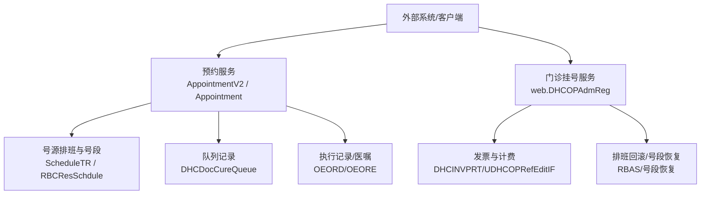
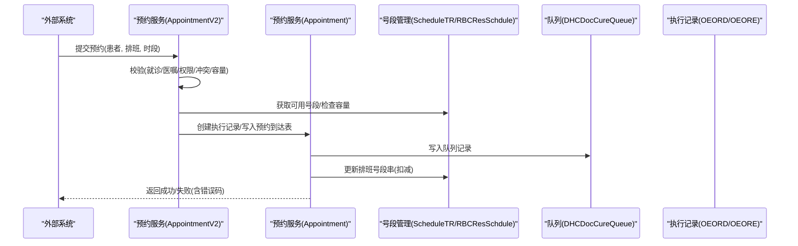
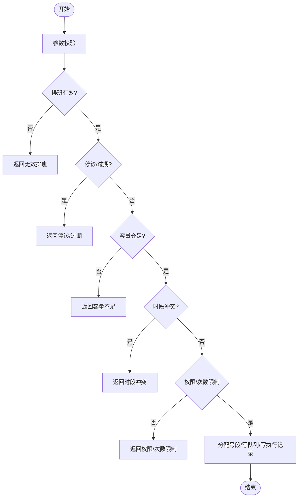
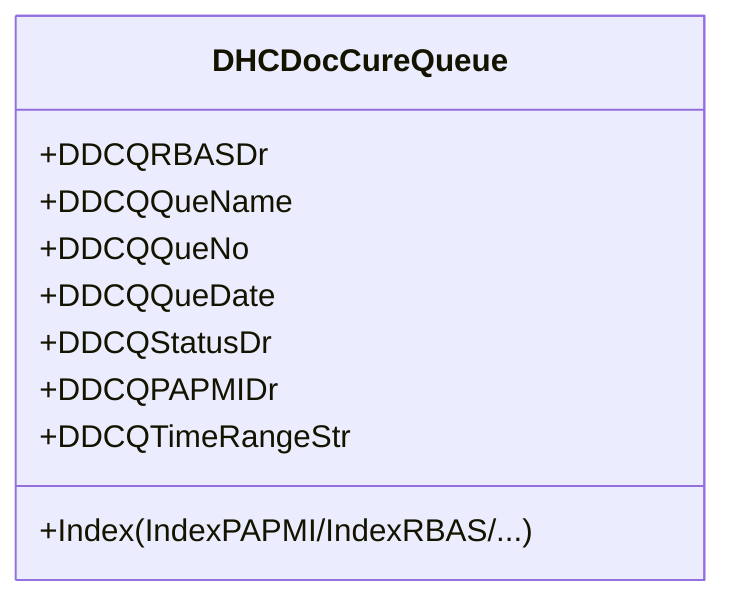
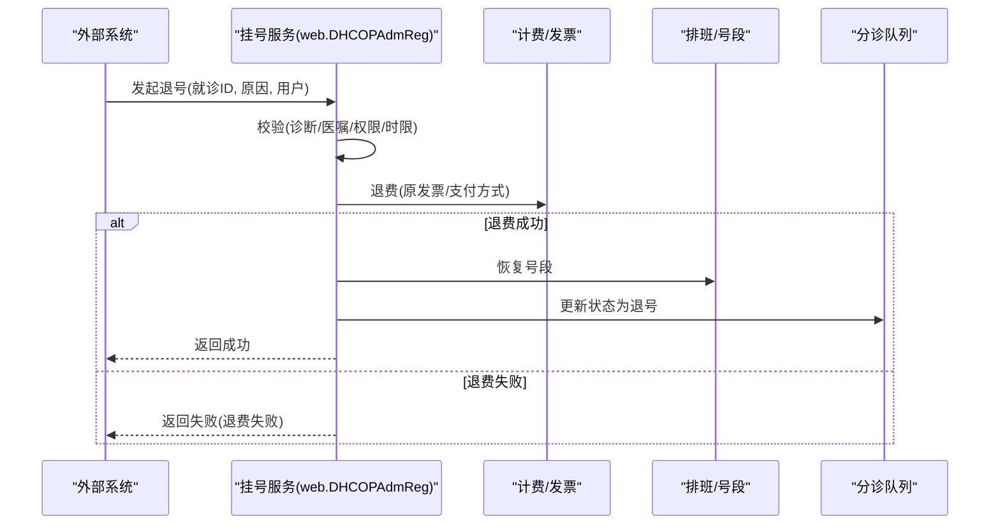
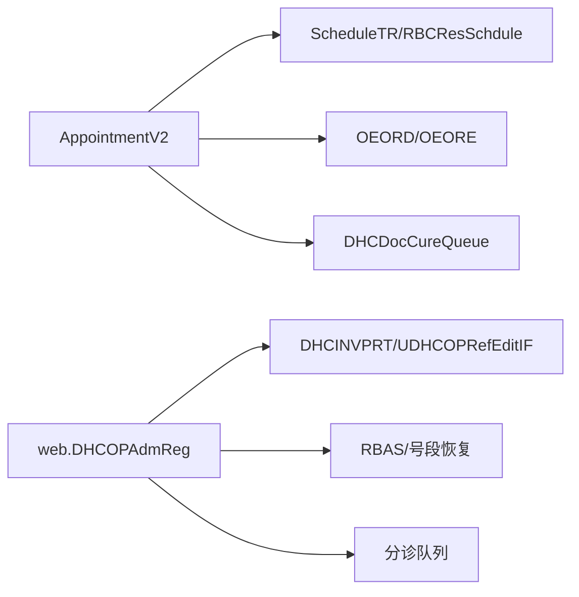

# 挂号接口

<cite>
**本文引用的文件**
- [AppointmentV2.cls](file://src/backend/cure-ws/DHCDoc/DHCDocCure/AppointmentV2.cls)
- [Appointment.cls](file://src/backend/cure-ws/DHCDoc/DHCDocCure/Appointment.cls)
- [DHCDocCureQueue.cls](file://src/backend/cure-ws/User/DHCDocCureQueue.cls)
- [DHCOPAdmReg.cls](file://src/backend/opadm-mc/web/DHCOPAdmReg.cls)
</cite>

## 目录
1. [简介](#简介)
2. [项目结构](#项目结构)
3. [核心组件](#核心组件)
4. [架构总览](#架构总览)
5. [详细组件分析](#详细组件分析)
6. [依赖关系分析](#依赖关系分析)
7. [性能与容量控制](#性能与容量控制)
8. [故障排查指南](#故障排查指南)
9. [结论](#结论)
10. [附录：接口调用示例](#附录接口调用示例)

## 简介
本文件面向HIS系统对接方，提供“挂号/预约”相关接口的完整说明。内容覆盖挂号申请、号源管理（排班与号段）、预约确认、查询、退号处理、冲突检测、排队机制与容量控制、异常处理与业务补偿等。文档基于代码库中的治疗预约与门诊挂号能力进行梳理，确保对外集成时具备可操作性与可维护性。

## 项目结构
围绕挂号与预约的核心实现主要分布在以下模块：
- 治疗预约与号源调度：位于 cure-ws 下的 DHCDocCure 包，负责预约校验、号段分配、队列管理与状态流转。
- 门诊挂号与退号：位于 opadm-mc 的 web.DHCOPAdmReg，提供挂号信息查询、退号流程与发票退费联动。
- 队列实体：User.DHCDocCureQueue 定义治疗预约队列的数据模型与索引，支撑查询与排序。

图表来源
- [AppointmentV2.cls:619-720](file://src/backend/cure-ws/DHCDoc/DHCDocCure/AppointmentV2.cls#L619-L720)
- [Appointment.cls:327-530](file://src/backend/cure-ws/DHCDoc/DHCDocCure/Appointment.cls#L327-L530)
- [DHCDocCureQueue.cls:1-82](file://src/backend/cure-ws/User/DHCDocCureQueue.cls#L1-L82)
- [DHCOPAdmReg.cls:307-696](file://src/backend/opadm-mc/web/DHCOPAdmReg.cls#L307-L696)

章节来源
- [AppointmentV2.cls:1-800](file://src/backend/cure-ws/DHCDoc/DHCDocCure/AppointmentV2.cls#L1-L800)
- [Appointment.cls:1-800](file://src/backend/cure-ws/DHCDoc/DHCDocCure/Appointment.cls#L1-L800)
- [DHCDocCureQueue.cls:1-320](file://src/backend/cure-ws/User/DHCDocCureQueue.cls#L1-L320)
- [DHCOPAdmReg.cls:1-800](file://src/backend/opadm-mc/web/DHCOPAdmReg.cls#L1-L800)

## 核心组件
- 预约校验与创建
  - 预约前校验：就诊类型、医嘱状态、申请单状态、资源停诊/过期、最大号数与时段容量、患者时段冲突、权限限制等。
  - 号段分配：根据是否分时时段与报到策略生成或跳过序号；并发锁保护号段更新。
  - 事务与回滚：创建执行记录、写入预约到达表、更新排班号段串，失败回滚并返回错误码。
- 号源管理
  - 排班信息读取：科室、资源、日期、时间窗、截止时间、最大号数、已约数量等。
  - 号段恢复：取消预约/退号时将占用号段归还至可用池。
- 队列与状态
  - 队列实体包含患者、科室、日期、状态、操作人、时间段等信息，支持按患者/排班/日期等多维查询。
  - 状态机：已预约、已报到、已完成、已取消等。
- 门诊挂号与退号
  - 挂号查询：按发票、就诊ID、日期范围检索挂号记录及关联排班、替诊、预约标记等。
  - 退号流程：校验退号条件（诊断、医嘱、应急系统、安全组权限、退号时限），退费联动，排班号段恢复，分诊队列状态更新，平台同步。

章节来源
- [AppointmentV2.cls:302-785](file://src/backend/cure-ws/DHCDoc/DHCDocCure/AppointmentV2.cls#L302-L785)
- [Appointment.cls:155-530](file://src/backend/cure-ws/DHCDoc/DHCDocCure/Appointment.cls#L155-L530)
- [DHCDocCureQueue.cls:1-82](file://src/backend/cure-ws/User/DHCDocCureQueue.cls#L1-L82)
- [DHCOPAdmReg.cls:307-696](file://src/backend/opadm-mc/web/DHCOPAdmReg.cls#L307-L696)

## 架构总览
挂号/预约整体流程分为两条主线：
- 治疗预约主线：通过预约服务完成校验、号段分配、执行记录创建、队列写入与状态更新。
- 门诊挂号主线：通过挂号服务完成挂号信息查询、退号校验、退费、排班号段恢复与平台通知。

图表来源
- [AppointmentV2.cls:619-720](file://src/backend/cure-ws/DHCDoc/DHCDocCure/AppointmentV2.cls#L619-L720)
- [Appointment.cls:327-530](file://src/backend/cure-ws/DHCDoc/DHCDocCure/Appointment.cls#L327-L530)

章节来源
- [AppointmentV2.cls:619-720](file://src/backend/cure-ws/DHCDoc/DHCDocCure/AppointmentV2.cls#L619-L720)
- [Appointment.cls:327-530](file://src/backend/cure-ws/DHCDoc/DHCDocCure/Appointment.cls#L327-L530)

## 详细组件分析

### 预约校验与创建（AppointmentV2）
- 关键方法
  - CheckAppByDCA：校验治疗申请单、医嘱状态、配置项、执行记录状态等。
  - CheckAppSchedule：校验排班有效性、停诊、截止预约时间、最大号数与时段容量。
  - CheckBeforeAppInsert：综合校验（参数、就诊类型、排班、时段冲突、次数限制）。
  - FindAppList/FindAppointmentList：多条件查询预约列表与明细。
- 号段分配与并发控制
  - 使用排班锁保护号段更新，避免超卖。
  - 分时时段模式下，按时间段获取可用号序；非分时且需报到则不产生序号。
- 事务与回滚
  - 创建执行记录、写入预约到达表、更新排班号段串在同一事务中，任一失败均回滚。

图表来源
- [AppointmentV2.cls:619-785](file://src/backend/cure-ws/DHCDoc/DHCDocCure/AppointmentV2.cls#L619-L785)
- [Appointment.cls:203-325](file://src/backend/cure-ws/DHCDoc/DHCDocCure/Appointment.cls#L203-L325)

章节来源
- [AppointmentV2.cls:302-785](file://src/backend/cure-ws/DHCDoc/DHCDocCure/AppointmentV2.cls#L302-L785)
- [Appointment.cls:203-325](file://src/backend/cure-ws/DHCDoc/DHCDocCure/Appointment.cls#L203-L325)

### 号源管理与号段分配（ScheduleTR/RBCResSchdule）
- 号段获取
  - 分时时段：按时间段计算可用号序，若为0则不可预约。
  - 非分时：根据配置决定是否产生序号。
- 号段更新
  - 在排班锁内更新排班的号段串，保证并发安全。
- 号段恢复
  - 取消预约/退号时调用恢复方法将号段归还到可用池。

章节来源
- [AppointmentV2.cls:619-720](file://src/backend/cure-ws/DHCDoc/DHCDocCure/AppointmentV2.cls#L619-L720)
- [Appointment.cls:383-498](file://src/backend/cure-ws/DHCDoc/DHCDocCure/Appointment.cls#L383-L498)

### 队列与状态（DHCDocCureQueue）
- 数据模型
  - 包含排班、患者、科室、日期、状态、操作人、时间段、服务组等字段。
  - 提供多维度索引以支持高效查询。
- 触发器
  - 插入/更新后触发分配逻辑，用于队列状态联动。

图表来源
- [DHCDocCureQueue.cls:1-82](file://src/backend/cure-ws/User/DHCDocCureQueue.cls#L1-L82)

章节来源
- [DHCDocCureQueue.cls:1-320](file://src/backend/cure-ws/User/DHCDocCureQueue.cls#L1-L320)

### 门诊挂号查询与退号（web.DHCOPAdmReg）
- 挂号查询
  - 支持按发票号、就诊ID、日期范围查询挂号记录，并关联排班、替诊、预约标记等。
- 退号流程
  - 校验：应急系统、诊断、医嘱、安全组权限、退号时限等。
  - 退费：根据发票与支付方式调用退费接口，必要时生成负账单。
  - 号段恢复：若关联排班，则恢复号段；更新分诊队列状态为退号。
  - 平台同步：完成后调用平台接口发送退号信息。

图表来源
- [DHCOPAdmReg.cls:307-696](file://src/backend/opadm-mc/web/DHCOPAdmReg.cls#L307-L696)

章节来源
- [DHCOPAdmReg.cls:307-696](file://src/backend/opadm-mc/web/DHCOPAdmReg.cls#L307-L696)

## 依赖关系分析
- 预约服务依赖
  - 排班与号段：ScheduleTR/RBCResSchdule 提供号段分配与容量控制。
  - 执行记录：OEORD/OEORE 用于创建/更新执行记录。
  - 队列：DHCDocCureQueue 持久化队列记录。
- 挂号服务依赖
  - 发票与计费：DHCINVPRT/UDHCOPRefEditIF 完成退费与票据处理。
  - 排班与号段：RBAS 与号段恢复逻辑。
  - 分诊队列：更新队列状态为退号。

图表来源
- [AppointmentV2.cls:619-720](file://src/backend/cure-ws/DHCDoc/DHCDocCure/AppointmentV2.cls#L619-L720)
- [Appointment.cls:327-530](file://src/backend/cure-ws/DHCDoc/DHCDocCure/Appointment.cls#L327-L530)
- [DHCOPAdmReg.cls:307-696](file://src/backend/opadm-mc/web/DHCOPAdmReg.cls#L307-L696)

章节来源
- [AppointmentV2.cls:619-720](file://src/backend/cure-ws/DHCDoc/DHCDocCure/AppointmentV2.cls#L619-L720)
- [Appointment.cls:327-530](file://src/backend/cure-ws/DHCDoc/DHCDocCure/Appointment.cls#L327-L530)
- [DHCOPAdmReg.cls:307-696](file://src/backend/opadm-mc/web/DHCOPAdmReg.cls#L307-L696)

## 性能与容量控制
- 并发控制
  - 使用排班锁保护号段更新，防止超卖与重复分配。
- 容量控制
  - 排班最大号数与时段容量双重校验；超时/停诊/过期直接拒绝。
- 查询优化
  - 队列实体提供多维索引（患者、排班、日期、科室），提升查询效率。
- 建议
  - 批量预约时采用分批提交与重试机制，降低瞬时压力。
  - 对高频查询增加缓存层（如最近排班与号段余量）。

[本节为通用指导，无需特定文件引用]

## 故障排查指南
- 常见错误码与含义
  - 无效排班/停诊/过期：检查排班状态与截止时间。
  - 容量不足/时段已满：检查排班最大号数与时段可用号序。
  - 权限/次数限制：检查配置与患者当前申请项目的操作权限。
  - 退费失败：核对发票状态、支付方式与安全组权限。
  - 号段恢复失败：检查排班号段串与恢复逻辑。
- 定位步骤
  - 查看预约/挂号日志与临时变量（如 ^tmplog）。
  - 核对排班、号段串、队列状态与执行记录状态。
  - 复核退费流水与平台回调结果。

章节来源
- [AppointmentV2.cls:619-785](file://src/backend/cure-ws/DHCDoc/DHCDocCure/AppointmentV2.cls#L619-L785)
- [Appointment.cls:617-728](file://src/backend/cure-ws/DHCDoc/DHCDocCure/Appointment.cls#L617-L728)
- [DHCOPAdmReg.cls:307-696](file://src/backend/opadm-mc/web/DHCOPAdmReg.cls#L307-L696)

## 结论
本接口体系围绕“预约校验—号段分配—队列写入—状态更新”的主线，结合门诊挂号的“查询—退号—退费—号段恢复”，形成完整的挂号/预约闭环。通过严格的容量控制、并发保护与事务一致性保障，确保在高并发场景下的稳定性与准确性。对接方应严格遵循校验规则与错误码处理，配合重试与补偿机制，提升整体鲁棒性。

[本节为总结，无需特定文件引用]

## 附录：接口调用示例
以下为典型调用流程的示意（以文字描述为主，具体参数与响应格式请参考对应类的方法签名与注释）：
- 挂号申请（治疗预约）
  - 输入：患者ID、排班ID、可选时段串、医院ID、语言、会话信息等。
  - 流程：校验→号段分配→创建执行记录→写入队列→更新排班号段串→返回结果。
  - 参考路径：[AppointmentV2.CheckBeforeAppInsert:722-785](file://src/backend/cure-ws/DHCDoc/DHCDocCure/AppointmentV2.cls#L722-L785)、[Appointment.AppInsertHUI:327-530](file://src/backend/cure-ws/DHCDoc/DHCDocCure/Appointment.cls#L327-L530)
- 预约状态查询
  - 输入：患者ID/排班ID、日期范围、状态过滤、服务组等。
  - 流程：按索引查询队列→组装详情（排班、时段、状态）→返回列表。
  - 参考路径：[AppointmentV2.FindAppointmentList:444-617](file://src/backend/cure-ws/DHCDoc/DHCDocCure/AppointmentV2.cls#L444-L617)
- 批量处理（批量预约/取消）
  - 输入：多个排班ID或预约ID串、用户ID、会话信息。
  - 流程：循环调用单条处理→聚合错误信息→返回批次结果。
  - 参考路径：[Appointment.AppInsertBroker:48-127](file://src/backend/cure-ws/DHCDoc/DHCDocCure/Appointment.cls#L48-L127)、[Appointment.AppCancelBatch:617-660](file://src/backend/cure-ws/DHCDoc/DHCDocCure/Appointment.cls#L617-L660)
- 退号处理
  - 输入：就诊ID、用户、原因、医院ID、支付方式等。
  - 流程：校验→退费→恢复号段→更新队列状态→平台同步→返回结果。
  - 参考路径：[DHCOPAdmReg.ICancelOPRegist:307-336](file://src/backend/opadm-mc/web/DHCOPAdmReg.cls#L307-L336)、[DHCOPAdmReg.CancelOPRegist:359-696](file://src/backend/opadm-mc/web/DHCOPAdmReg.cls#L359-L696)

[本节为示例指引，未包含具体代码片段]