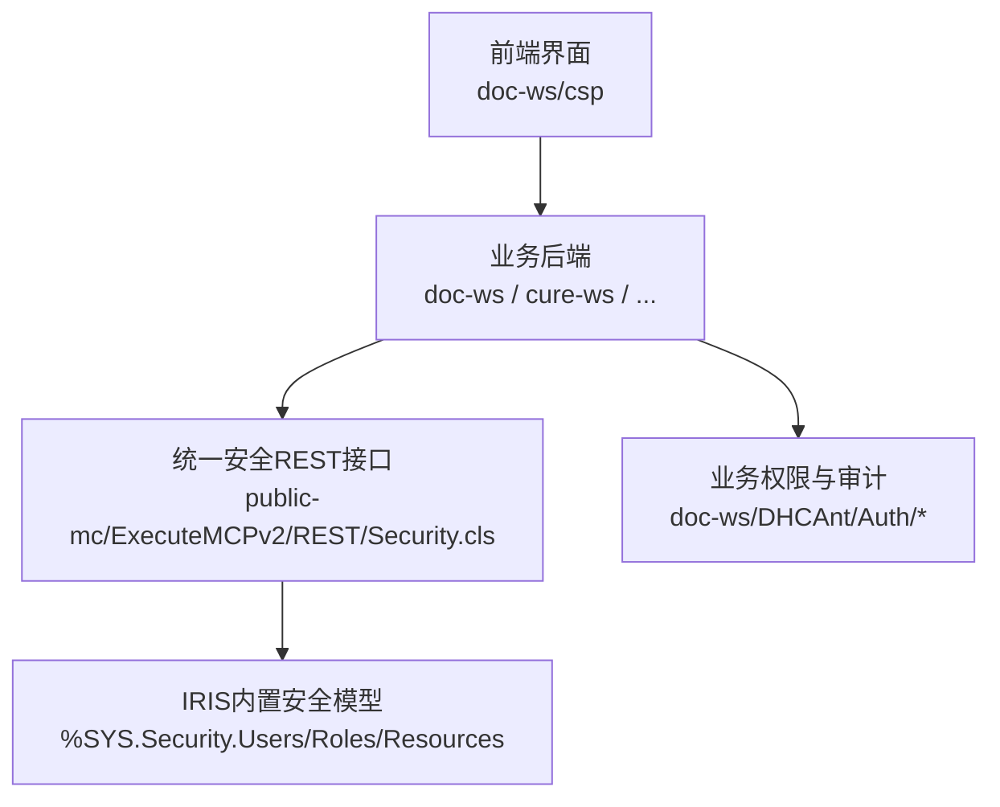
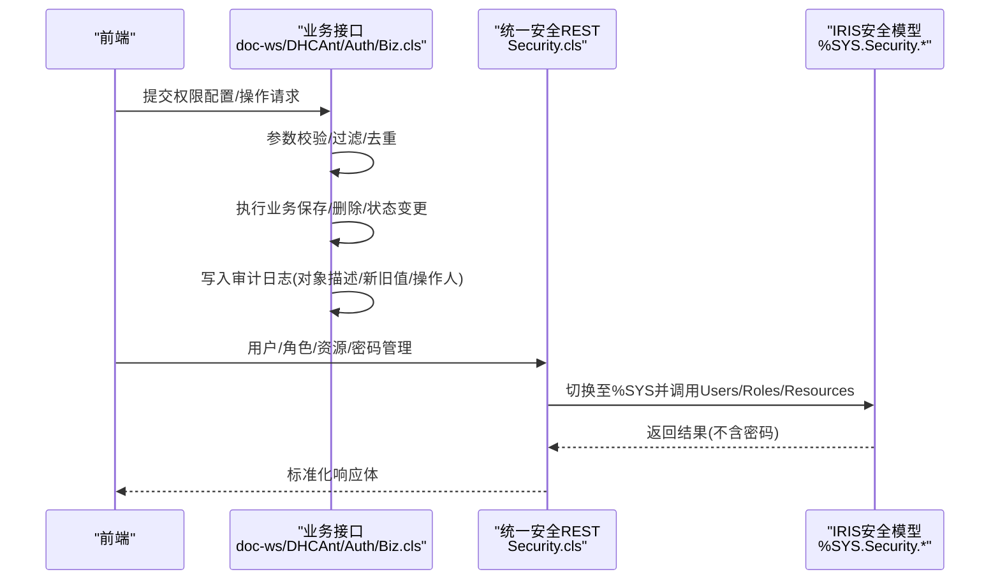
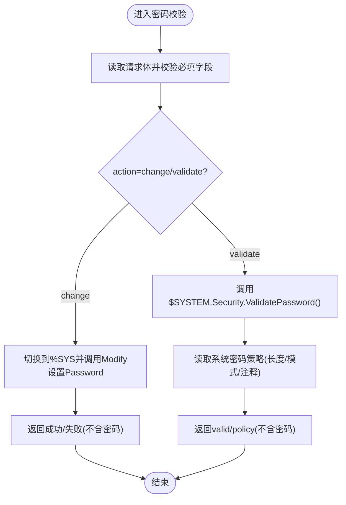
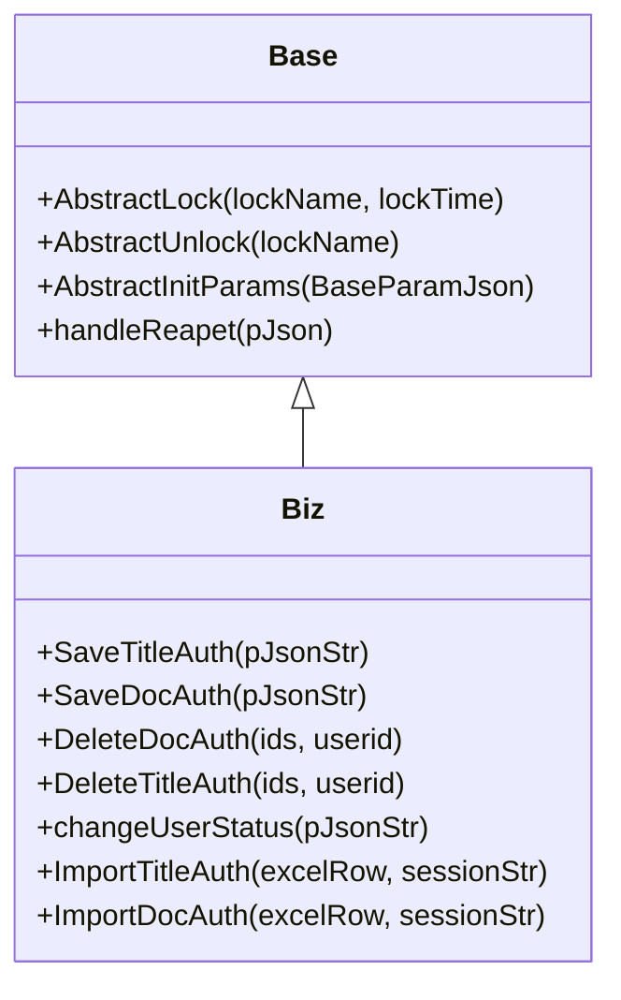
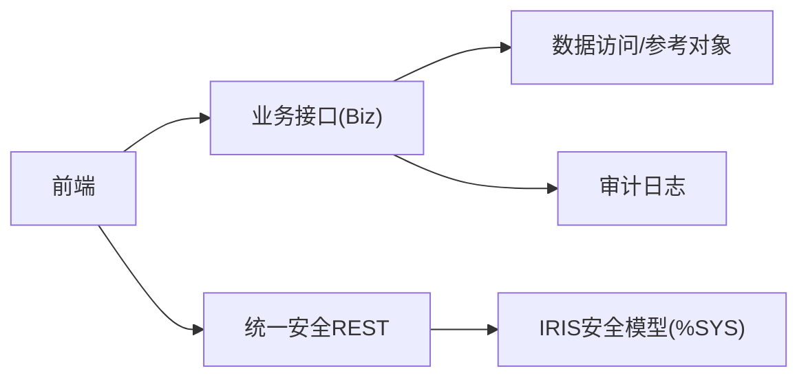

# 合规性与隐私保护

<cite>
**本文引用的文件**
- [README.md](file://README.md)
- [Security.cls](file://src/backend/public-mc/ExecuteMCPv2/REST/Security.cls)
- [Base.cls](file://src/backend/doc-ws/DHCAnt/Auth/Base.cls)
- [Biz.cls](file://src/backend/doc-ws/DHCAnt/Auth/Biz.cls)
</cite>

## 目录
1. [简介](#简介)
2. [项目结构](#项目结构)
3. [核心组件](#核心组件)
4. [架构总览](#架构总览)
5. [详细组件分析](#详细组件分析)
6. [依赖关系分析](#依赖关系分析)
7. [性能与可审计性考量](#性能与可审计性考量)
8. [故障排查指南](#故障排查指南)
9. [结论](#结论)
10. [附录：合规检查清单与实施指南](#附录：合规检查清单与实施指南)

## 简介
本文件面向IRIS HIS系统的合规性与隐私保护，聚焦于如何在系统设计与实现中落实医疗行业法规要求（如HIPAA、GDPR）以及数据最小化原则。文档基于仓库中的实际代码实现，梳理身份认证、权限控制、审计日志、密码策略与敏感信息防护等关键能力，并提供可操作的合规检查清单与实施指南，帮助团队在开发与运维过程中持续满足监管要求。

## 项目结构
IRIS HIS采用前后端分离的模块化组织方式：后端以InterSystems IRIS ObjectScript为主，按业务域划分多个子系统；前端为CSP+jQuery的传统Web形态。公共安全与权限管理通过统一的REST接口暴露，业务域内则提供细粒度的权限配置与审计记录。

**图表来源**
- [README.md:1-35](file://README.md#L1-L35)
- [Security.cls:1-17](file://src/backend/public-mc/ExecuteMCPv2/REST/Security.cls#L1-L17)
- [Base.cls:1-41](file://src/backend/doc-ws/DHCAnt/Auth/Base.cls#L1-L41)

**章节来源**
- [README.md:1-35](file://README.md#L1-L35)

## 核心组件
- 统一安全REST接口：提供用户、角色、资源与密码管理的标准化API，严格遵循“不泄露敏感信息”的原则。
- 业务权限与审计：围绕临床用药等场景，提供职称与医生维度的权限配置、启用/停用、导入导出与完整审计日志。
- 命名空间隔离：安全操作在%SYS命名空间执行，避免越权访问应用数据。

**章节来源**
- [Security.cls:1-17](file://src/backend/public-mc/ExecuteMCPv2/REST/Security.cls#L1-L17)
- [Biz.cls:1-259](file://src/backend/doc-ws/DHCAnt/Auth/Biz.cls#L1-L259)

## 架构总览
下图展示了从前端到后端再到IRIS内置安全模型的调用链路，以及在业务层进行的权限与审计处理。

**图表来源**
- [Biz.cls:1-259](file://src/backend/doc-ws/DHCAnt/Auth/Biz.cls#L1-L259)
- [Security.cls:1-17](file://src/backend/public-mc/ExecuteMCPv2/REST/Security.cls#L1-L17)
- [Security.cls:25-84](file://src/backend/public-mc/ExecuteMCPv2/REST/Security.cls#L25-L84)
- [Security.cls:131-249](file://src/backend/public-mc/ExecuteMCPv2/REST/Security.cls#L131-L249)
- [Security.cls:370-553](file://src/backend/public-mc/ExecuteMCPv2/REST/Security.cls#L370-L553)

## 详细组件分析

### 统一安全REST接口（用户、角色、资源、密码）
- 用户列表与详情：枚举用户属性，明确不包含密码字段；支持按名称查询。
- 用户管理：创建、修改、删除用户，强制校验必填项，错误消息经脱敏处理。
- 角色管理：列出与CRUD角色，支持授予/撤销角色。
- 资源管理：列出与CRUD资源，维护公开权限等元数据。
- 密码管理：支持修改与校验，读取系统密码策略（长度、模式），对错误信息进行脱敏，确保不会回显或传播密码。

**图表来源**
- [Security.cls:370-553](file://src/backend/public-mc/ExecuteMCPv2/REST/Security.cls#L370-L553)

**章节来源**
- [Security.cls:25-84](file://src/backend/public-mc/ExecuteMCPv2/REST/Security.cls#L25-L84)
- [Security.cls:131-249](file://src/backend/public-mc/ExecuteMCPv2/REST/Security.cls#L131-L249)
- [Security.cls:555-688](file://src/backend/public-mc/ExecuteMCPv2/REST/Security.cls#L555-L688)
- [Security.cls:690-800](file://src/backend/public-mc/ExecuteMCPv2/REST/Security.cls#L690-L800)
- [Security.cls:370-553](file://src/backend/public-mc/ExecuteMCPv2/REST/Security.cls#L370-L553)

### 业务权限与审计（临床用药场景）
- 权限维度：支持按“职称”和“医生”两个维度配置权限，包括控制类型、审核类型、优先级、所属医院等。
- 生命周期：新增、更新、删除、启用/停用均记录审计日志，包含对象描述、新旧值、操作人与时间戳。
- 批量导入：支持Excel导入职称与医生权限，内部转换为JSON后复用保存逻辑，保证一致性。
- 基类抽象：提供锁与参数初始化等通用能力，便于扩展其他权限模块。

**图表来源**
- [Base.cls:1-41](file://src/backend/doc-ws/DHCAnt/Auth/Base.cls#L1-L41)
- [Biz.cls:1-259](file://src/backend/doc-ws/DHCAnt/Auth/Biz.cls#L1-L259)

**章节来源**
- [Base.cls:1-41](file://src/backend/doc-ws/DHCAnt/Auth/Base.cls#L1-L41)
- [Biz.cls:1-259](file://src/backend/doc-ws/DHCAnt/Auth/Biz.cls#L1-L259)

### 数据最小化与敏感信息防护
- 密码不回显：所有用户相关接口在响应体中绝不包含密码字段；错误消息经过脱敏处理，避免泄露候选密码片段。
- 最小必要字段：用户列表仅返回必要属性（名称、角色、是否启用、命名空间、备注等），避免过度暴露。
- 命名空间隔离：安全操作在%SYS命名空间执行，降低误用风险。

**章节来源**
- [Security.cls:1-17](file://src/backend/public-mc/ExecuteMCPv2/REST/Security.cls#L1-L17)
- [Security.cls:25-84](file://src/backend/public-mc/ExecuteMCPv2/REST/Security.cls#L25-L84)
- [Security.cls:370-553](file://src/backend/public-mc/ExecuteMCPv2/REST/Security.cls#L370-L553)

## 依赖关系分析
- 业务权限模块依赖统一鉴权与审计基础设施，通过DAO/Ref等工具类完成持久化与日志记录。
- 统一安全REST接口依赖IRIS内置安全模型（Security.Users/Roles/Resources），并通过命名空间切换确保操作边界清晰。
- 前端与后端通过REST/业务接口交互，形成清晰的职责分层。

**图表来源**
- [Biz.cls:1-259](file://src/backend/doc-ws/DHCAnt/Auth/Biz.cls#L1-L259)
- [Security.cls:1-17](file://src/backend/public-mc/ExecuteMCPv2/REST/Security.cls#L1-L17)

**章节来源**
- [Biz.cls:1-259](file://src/backend/doc-ws/DHCAnt/Auth/Biz.cls#L1-L259)
- [Security.cls:1-17](file://src/backend/public-mc/ExecuteMCPv2/REST/Security.cls#L1-L17)

## 性能与可审计性考量
- 审计日志：业务权限的关键操作均记录对象描述、新旧值、操作人与时间戳，满足可追溯性要求。
- 幂等与重复处理：提供忽略重复的配置选项，减少重复写入与审计噪音。
- 错误处理：统一的安全接口使用try/catch与标准化响应体，便于集中监控与告警。

**章节来源**
- [Biz.cls:1-259](file://src/backend/doc-ws/DHCAnt/Auth/Biz.cls#L1-L259)
- [Security.cls:25-84](file://src/backend/public-mc/ExecuteMCPv2/REST/Security.cls#L25-L84)

## 故障排查指南
- 密码校验失败：检查系统密码策略（长度、模式），确认请求参数合法；查看返回的错误消息（已脱敏）。
- 用户/角色/资源操作异常：确认命名空间切换正确、参数校验通过；关注错误消息是否包含敏感信息（应已被脱敏）。
- 权限配置未生效：核对启用/停用状态、生效时间、所属医院与优先级；检查审计日志定位变更轨迹。

**章节来源**
- [Security.cls:370-553](file://src/backend/public-mc/ExecuteMCPv2/REST/Security.cls#L370-L553)
- [Biz.cls:166-201](file://src/backend/doc-ws/DHCAnt/Auth/Biz.cls#L166-L201)

## 结论
IRIS HIS在统一安全REST接口与业务权限模块中，实现了符合医疗行业合规要求的身份认证、权限控制、审计追踪与敏感信息防护。通过命名空间隔离、密码策略校验与最小化响应，系统在保障可用性的同时，有效降低了隐私泄露风险。建议结合本文件的检查清单与实施指南，持续完善知情同意、数据主体权利响应与隐私影响评估等机制，以满足HIPAA、GDPR等法规要求。

## 附录：合规检查清单与实施指南

### HIPAA合规要点（对应实现）
- 访问控制与最小权限
  - 使用统一安全REST接口进行用户、角色、资源管理，确保RBAC落地。
  - 业务权限按“职称/医生”维度精细化配置，限制不必要的数据访问。
- 审计与可追溯性
  - 关键操作（增删改、启用/停用）均记录审计日志，包含对象描述、新旧值、操作人与时间戳。
- 敏感信息保护
  - 密码不在响应中回显；错误消息脱敏；命名空间隔离安全操作。
- 传输与存储安全
  - 服务器配置使用HTTPS（见快速开始中的webServer.scheme/port配置）。

**章节来源**
- [Security.cls:1-17](file://src/backend/public-mc/ExecuteMCPv2/REST/Security.cls#L1-L17)
- [Security.cls:25-84](file://src/backend/public-mc/ExecuteMCPv2/REST/Security.cls#L25-L84)
- [Security.cls:370-553](file://src/backend/public-mc/ExecuteMCPv2/REST/Security.cls#L370-L553)
- [Biz.cls:1-259](file://src/backend/doc-ws/DHCAnt/Auth/Biz.cls#L1-L259)
- [README.md:151-206](file://README.md#L151-L206)

### GDPR合规要点（对应实现）
- 数据最小化
  - 用户列表与详情仅返回必要字段；密码从不出现在响应或错误消息中。
- 数据主体权利响应
  - 通过统一安全接口支持用户账户的查询、修改、删除；配合业务权限模块，可实现受限访问与撤销授权。
- 同意与目的限定
  - 建议在业务层增加“知情同意”记录与用途标记，并在导出/共享时进行目的校验（当前仓库未见直接实现，需补充）。
- 数据泄露通知与可追溯
  - 利用审计日志追踪敏感操作；建立告警与上报流程（需在运维侧完善）。

**章节来源**
- [Security.cls:25-84](file://src/backend/public-mc/ExecuteMCPv2/REST/Security.cls#L25-L84)
- [Security.cls:131-249](file://src/backend/public-mc/ExecuteMCPv2/REST/Security.cls#L131-L249)
- [Biz.cls:1-259](file://src/backend/doc-ws/DHCAnt/Auth/Biz.cls#L1-L259)

### 隐私影响评估（PIA）建议流程
- 识别数据处理活动：梳理涉及患者数据的业务流程（如医嘱、检验、治疗记录）。
- 评估风险与影响：识别潜在泄露点（接口响应、日志、备份、第三方集成）。
- 制定缓解措施：最小化字段、脱敏、加密、访问控制、审计。
- 验证与复评：上线前测试、运行期监控、定期复评。

[本节为概念性内容，不直接分析具体文件]

### 合规性检查清单（建议逐项核对）
- 身份与访问控制
  - 是否启用统一安全REST接口进行用户/角色/资源管理？
  - 是否按最小权限原则分配角色与资源？
  - 是否禁用不必要的公开资源访问？
- 审计与可追溯
  - 关键操作是否记录审计日志（对象描述、新旧值、操作人、时间）？
  - 是否能检索特定用户的操作历史？
- 敏感信息保护
  - 是否确保密码不出现在任何响应或错误消息中？
  - 是否对日志中的敏感字段进行脱敏？
- 传输与存储
  - 是否使用HTTPS访问Web服务？
  - 是否对静态敏感数据进行加密存储？
- 数据主体权利
  - 是否支持用户查询、修改、删除其个人信息？
  - 是否支持撤回同意与限制处理？
- 同意管理
  - 是否记录患者知情同意的版本、范围、有效期？
  - 是否在数据共享/导出时校验同意范围？

[本节为通用实践建议，不直接分析具体文件]

### 隐私保护实施指南（落地步骤）
- 在业务接口中引入“同意校验”环节，拒绝超出同意范围的数据访问与共享。
- 在导出/报表功能中加入“数据最小化”开关，仅输出必要字段。
- 对日志系统进行分级管控，禁止记录患者标识符与敏感内容。
- 建立定期审计与告警机制，发现异常访问及时阻断并上报。
- 将隐私影响评估纳入需求与设计阶段，确保新特性上线前完成合规评审。

[本节为通用实践建议，不直接分析具体文件]