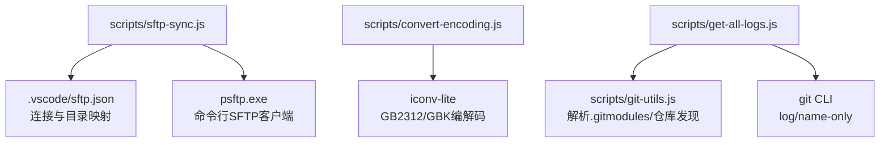
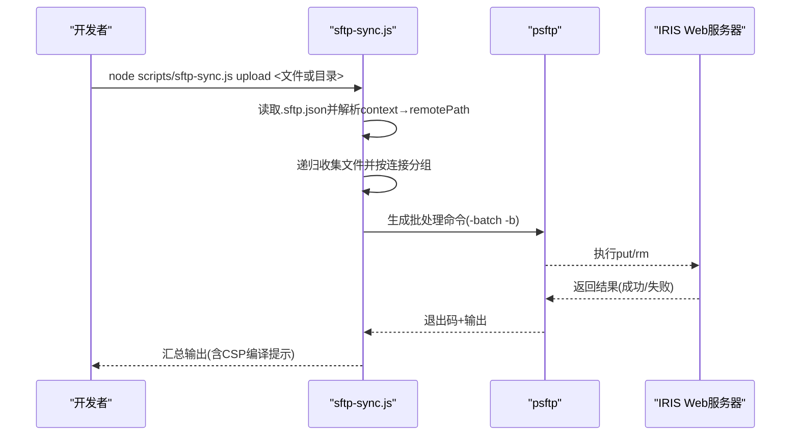
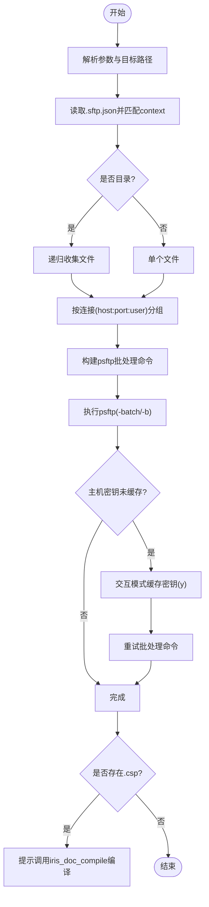
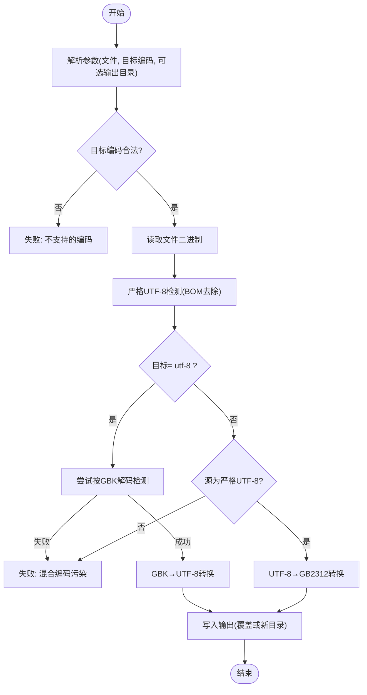
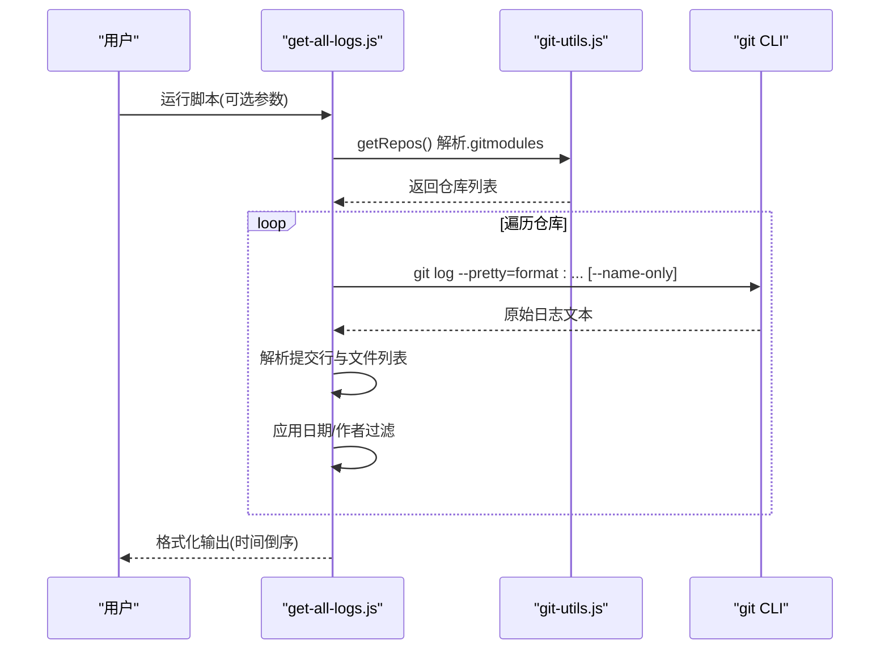
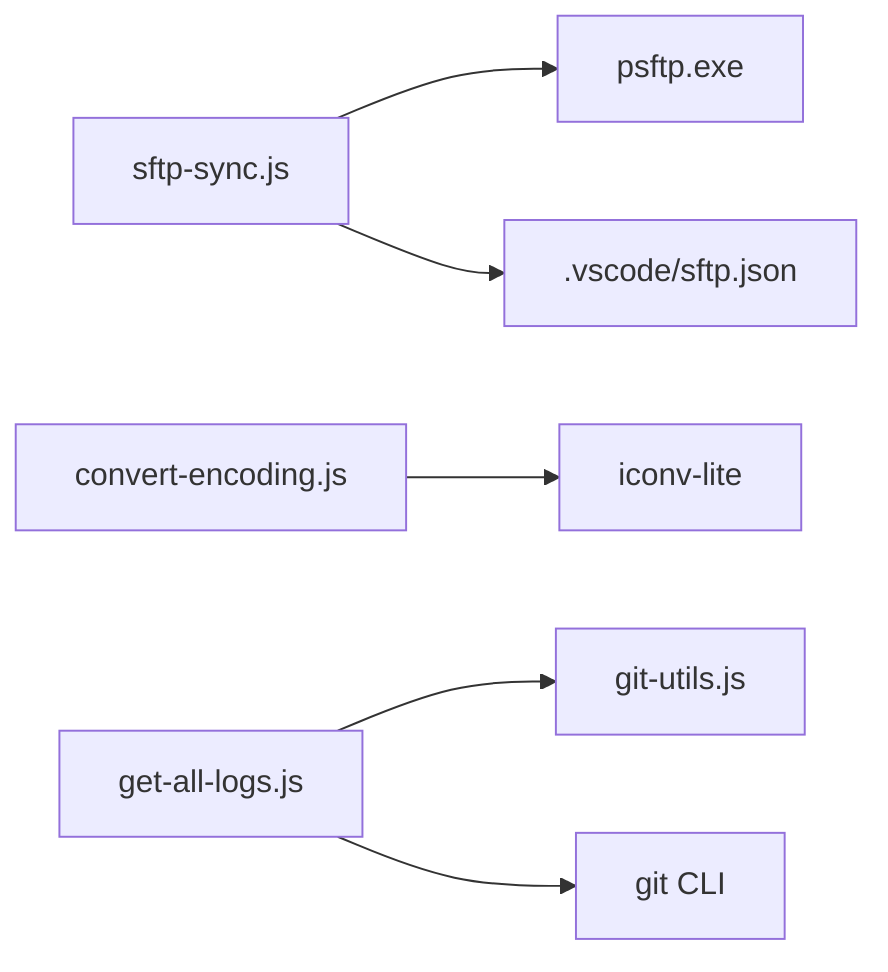

# 部署工具

<cite>
**本文引用的文件**
- [sftp-sync.js](file://scripts/sftp-sync.js)
- [convert-encoding.js](file://scripts/convert-encoding.js)
- [get-all-logs.js](file://scripts/get-all-logs.js)
- [git-utils.js](file://scripts/git-utils.js)
- [package.json](file://scripts/package.json)
- [README.md](file://README.md)
</cite>

## 更新摘要
**所做更改**
- 更新了编码转换工具的详细文档，涵盖UTF-8和GB2312转换功能
- 增强了自动编码检测机制的说明
- 添加了混合编码场景的错误处理指南
- 完善了iconv-lite库的使用说明
- 更新了故障排查指南中的编码相关问题

## 目录
1. [简介](#简介)
2. [项目结构](#项目结构)
3. [核心组件](#核心组件)
4. [架构总览](#架构总览)
5. [详细组件分析](#详细组件分析)
6. [依赖关系分析](#依赖关系分析)
7. [性能与增量同步建议](#性能与增量同步建议)
8. [故障排查指南](#故障排查指南)
9. [结论](#结论)
10. [附录：常用命令速查](#附录常用命令速查)

## 简介
本仓库提供一套面向前端部署与运维的脚本工具，覆盖以下能力：
- 通过 psftp（PuTTY SFTP）将前端静态资源上传至 IRIS Web 服务器，并自动处理主机密钥缓存、按连接分组批量执行。
- 对历史遗留的 GB2312/GBK 文件进行编码转换，严格校验 UTF-8 合法性，避免混合编码污染。
- 聚合根仓库与所有子模块的 Git 提交日志，支持日期范围、作者过滤与变更文件列表展示。
- 配合 README 中的配置说明，形成"预检查—上传—编译—回滚—监控"的完整部署流程。

## 项目结构
- scripts 目录集中存放部署与辅助脚本，包括 sftp-sync.js、convert-encoding.js、get-all-logs.js 以及 git 相关工具。
- 前端代码位于 src/frontend/*，后端代码位于 src/backend/*（通过 IRIS ObjectScript 扩展直接编译上传，不走 SFTP）。
- 服务器路径映射由 .vscode/sftp.json 管理，脚本读取该配置后根据本地 context 自动匹配远程 remotePath。

**图表来源**
- [sftp-sync.js:53-95](file://scripts/sftp-sync.js#L53-L95)
- [convert-encoding.js:56-83](file://scripts/convert-encoding.js#L56-L83)
- [get-all-logs.js:47-110](file://scripts/get-all-logs.js#L47-L110)
- [git-utils.js:14-60](file://scripts/git-utils.js#L14-L60)

**章节来源**
- [README.md:5-51](file://README.md#L5-L51)

## 核心组件
- sftp-sync.js：前端文件 SFTP 同步脚本（upload/delete/check），基于 psftp 批量命令，自动分组会话、处理主机密钥缓存、提示 CSP 编译。
- convert-encoding.js：单文件编码转换（UTF-8 ↔ GB2312），严格 UTF-8 校验，拒绝混合编码污染。
- get-all-logs.js：跨仓库聚合提交日志，支持 --start-date/--end-date/--author/--show-files。
- git-utils.js：子模块解析、仓库发现、分支状态检测等通用能力。
- package.json：声明 iconv-lite 依赖，供编码转换使用。

**章节来源**
- [sftp-sync.js:1-291](file://scripts/sftp-sync.js#L1-L291)
- [convert-encoding.js:1-191](file://scripts/convert-encoding.js#L1-L191)
- [get-all-logs.js:1-218](file://scripts/get-all-logs.js#L1-L218)
- [git-utils.js:1-155](file://scripts/git-utils.js#L1-L155)
- [package.json:1-10](file://scripts/package.json#L1-L10)

## 架构总览
整体工作流围绕"配置—执行—反馈"展开：
- 配置层：.vscode/sftp.json 定义多通道（host/port/username/password/context/remotePath）。
- 执行层：Node 脚本调用系统命令（psftp、git）完成上传、删除、日志收集。
- 反馈层：控制台输出映射关系、统计信息、错误提示；CSP 文件提示后续编译步骤。

**图表来源**
- [sftp-sync.js:53-95](file://scripts/sftp-sync.js#L53-L95)
- [sftp-sync.js:118-164](file://scripts/sftp-sync.js#L118-L164)
- [sftp-sync.js:181-227](file://scripts/sftp-sync.js#L181-L227)

## 详细组件分析

### sftp-sync.js：前端文件同步脚本
- 功能要点
  - 从 .vscode/sftp.json 读取多个通道配置，按本地 context 最长匹配确定目标 remotePath。
  - 支持 upload/delete/check 三种操作；upload 支持目录递归；delete 仅支持文件。
  - 按 host:port:username 分组会话，减少重复登录开销。
  - 首次连接若未缓存主机密钥，自动进入交互模式应答 y 缓存后重试。
  - 上传完成后识别 .csp 文件并提示调用 iris_doc_compile 编译。
- 关键流程
  - 参数解析与目标校验 → 读取配置 → 解析远程路径 → 构建命令 → 执行 psftp → 清理临时批处理文件。
- 错误处理
  - 配置文件缺失或格式错误时立即失败。
  - 路径不在任何 context 下时失败。
  - psftp 启动失败或主机密钥缓存失败给出明确指引。
  - 删除不支持目录时提示并失败。
- 增量同步机制
  - 当前实现为"全量 put/rm"，非增量差异同步；可通过 check 预览映射，结合外部 diff 工具控制上传范围。
- 最佳实践
  - 仅上传必要文件，缩小批量规模以提升速度。
  - 先使用 check 验证映射，再执行 upload。
  - 对 .csp 文件上传后务必执行编译。

**图表来源**
- [sftp-sync.js:168-227](file://scripts/sftp-sync.js#L168-L227)
- [sftp-sync.js:118-164](file://scripts/sftp-sync.js#L118-L164)

**章节来源**
- [sftp-sync.js:53-95](file://scripts/sftp-sync.js#L53-L95)
- [sftp-sync.js:118-164](file://scripts/sftp-sync.js#L118-L164)
- [sftp-sync.js:181-227](file://scripts/sftp-sync.js#L181-L227)

### convert-encoding.js：编码转换工具
**更新** 增强了编码转换工具的文档，涵盖完整的UTF-8和GB2312转换功能

- 功能要点
  - 仅支持 utf-8 与 gb2312（别名 utf8/gb2312）。
  - 严格 UTF-8 字节校验（TextDecoder fatal），避免误判。
  - 智能探测源编码：若目标为 utf-8，则尝试按 GBK 解码判断是否为 GB2312/GBK；若目标为 gb2312，则要求源为严格 UTF-8。
  - 支持输出到指定目录或直接覆盖原文件。
  - 检测到混合编码污染（既非严格 UTF-8 也无法按 GBK 完整解码）时拒绝转换。
- 依赖
  - iconv-lite（scripts/package.json 中声明），首次使用需在 scripts 目录执行 npm install。
- 使用示例
  - GB2312 → UTF-8：node scripts/convert-encoding.js src/frontend/doc-ws/scripts/xxx.js utf-8
  - UTF-8 → GB2312：node scripts/convert-encoding.js src/frontend/doc-ws/csp/xxx.csp gb2312 tmp/converted
- 错误处理
  - 未找到 iconv-lite 依赖时提供明确的安装指引。
  - 参数不足或过多时显示帮助信息。
  - 不支持的目标编码时给出错误提示。
  - 文件不存在或非有效文件时终止执行。
  - 空文件时提示无需转换。

**图表来源**
- [convert-encoding.js:63-123](file://scripts/convert-encoding.js#L63-L123)
- [convert-encoding.js:127-188](file://scripts/convert-encoding.js#L127-L188)

**章节来源**
- [convert-encoding.js:1-191](file://scripts/convert-encoding.js#L1-L191)
- [package.json:6-8](file://scripts/package.json#L6-L8)

### get-all-logs.js：日志收集工具
- 功能要点
  - 通过 git-utils.js 解析 .gitmodules 获取根仓库与所有子模块路径。
  - 对每个有效仓库执行 git log（可附加 --name-only 显示变更文件）。
  - 支持 --start-date/--end-date 时间范围过滤，--author 姓名/邮箱模糊匹配。
  - 输出按时间倒序，包含仓库路径、commit hash、作者、主题等信息。
- 使用示例
  - 获取全部日志：node scripts/get-all-logs.js
  - 按日期范围：node scripts/get-all-logs.js --start-date 2026-06-01 --end-date 2026-06-10
  - 按作者：node scripts/get-all-logs.js --author "wangqingyong1014"
  - 显示变更文件：node scripts/get-all-logs.js --show-files

**图表来源**
- [get-all-logs.js:47-110](file://scripts/get-all-logs.js#L47-L110)
- [get-all-logs.js:113-211](file://scripts/get-all-logs.js#L113-L211)
- [git-utils.js:35-60](file://scripts/git-utils.js#L35-L60)

**章节来源**
- [get-all-logs.js:1-218](file://scripts/get-all-logs.js#L1-L218)
- [git-utils.js:1-155](file://scripts/git-utils.js#L1-L155)

## 依赖关系分析
- sftp-sync.js
  - 依赖 Node 内置模块：fs、path、os、child_process。
  - 依赖外部工具：psftp（需安装 PuTTY 并加入 PATH）。
  - 依赖配置文件：.vscode/sftp.json（需提前从模板复制并填写密码）。
- convert-encoding.js
  - 依赖 Node 内置模块：fs、path。
  - 依赖第三方库：iconv-lite（scripts/package.json 声明）。
- get-all-logs.js
  - 依赖 Node 内置模块：child_process、util、path。
  - 依赖自定义模块：git-utils.js（解析 .gitmodules、仓库发现）。
  - 依赖外部工具：git CLI。

**图表来源**
- [sftp-sync.js:27-34](file://scripts/sftp-sync.js#L27-L34)
- [convert-encoding.js:26-29](file://scripts/convert-encoding.js#L26-L29)
- [get-all-logs.js:1-6](file://scripts/get-all-logs.js#L1-L6)
- [git-utils.js:1-6](file://scripts/git-utils.js#L1-L6)
- [package.json:6-8](file://scripts/package.json#L6-L8)

**章节来源**
- [sftp-sync.js:27-34](file://scripts/sftp-sync.js#L27-L34)
- [convert-encoding.js:26-29](file://scripts/convert-encoding.js#L26-L29)
- [get-all-logs.js:1-6](file://scripts/get-all-logs.js#L1-L6)
- [git-utils.js:1-6](file://scripts/git-utils.js#L1-L6)
- [package.json:6-8](file://scripts/package.json#L6-L8)

## 性能与增量同步建议
- 减少会话次数
  - sftp-sync.js 已按 host:port:username 分组会话，尽量合并上传以减少登录开销。
- 缩小上传范围
  - 使用 check 预览映射，仅上传必要文件；避免整目录全量上传。
- 利用缓存与网络优化
  - 首次连接缓存主机密钥，后续无需交互；确保 psftp 在 PATH 中且网络稳定。
- 编码转换性能
  - convert-encoding.js 针对单文件设计，适合少量历史文件修复；批量场景建议分批执行。
- 日志聚合效率
  - get-all-logs.js 对每个仓库执行一次 git log，建议在子模块数量较多时按需使用 --start-date/--end-date 限制范围。

## 故障排查指南
**更新** 增强了编码转换相关的故障排查内容

- sftp-sync.js
  - 未找到 .vscode/sftp.json：请从模板复制并填写密码（参考 README 配置说明）。
  - 路径不在任何 context 之下：检查本地路径是否在配置的 context 范围内。
  - 主机密钥未缓存：首次连接会提示缓存；如失败，手动执行 echo y | psftp -P <端口> <用户名>@<主机>。
  - psftp 启动失败：确认已安装 PuTTY 并将 psftp 加入 PATH。
  - 删除失败：delete 仅支持文件；目录删除请使用其他方式。
- convert-encoding.js
  - 未找到 iconv-lite：在 scripts 目录执行 npm install。
  - 混合编码污染：文件既非严格 UTF-8 也无法按 GBK 完整解码，需人工检查后再转换。
  - 目标编码不支持：仅支持 utf-8 与 gb2312（大小写不限）。
  - 参数错误：检查参数数量和格式，可使用 --help 查看帮助信息。
  - 文件为空：空文件无需转换，检查输入文件是否正确。
- get-all-logs.js
  - 未找到 Git 仓库：确保已初始化子模块（git submodule update --init --recursive）。
  - 某个子模块不是有效仓库：脚本会跳过并警告，不影响其他仓库。
  - 日期/作者过滤无结果：检查日期格式与作者名称/邮箱片段是否正确。

**章节来源**
- [sftp-sync.js:53-63](file://scripts/sftp-sync.js#L53-L63)
- [sftp-sync.js:69-95](file://scripts/sftp-sync.js#L69-L95)
- [sftp-sync.js:118-164](file://scripts/sftp-sync.js#L118-L164)
- [sftp-sync.js:229-258](file://scripts/sftp-sync.js#L229-L258)
- [convert-encoding.js:56-61](file://scripts/convert-encoding.js#L56-L61)
- [convert-encoding.js:104-119](file://scripts/convert-encoding.js#L104-L119)
- [convert-encoding.js:145-150](file://scripts/convert-encoding.js#L145-L150)
- [get-all-logs.js:47-55](file://scripts/get-all-logs.js#L47-L55)
- [get-all-logs.js:141-147](file://scripts/get-all-logs.js#L141-L147)

## 结论
本套部署工具以最小依赖实现了前端文件的可靠上传、历史文件的编码修复与跨仓库日志聚合。通过合理的配置与命令组合，可形成稳定的"预检查—上传—编译—回滚—监控"流程。建议在生产环境中：
- 严格管理 .vscode/sftp.json，避免泄露敏感信息。
- 使用 check 预览映射，缩小上传范围。
- 对 .csp 文件上传后及时编译。
- 使用 get-all-logs.js 定期审计提交记录，结合日期与作者过滤快速定位问题。
- 对于编码转换任务，优先使用 convert-encoding.js 进行严格的编码检测和转换，避免混合编码污染。

## 附录：常用命令速查
- 前端文件上传（目录递归）
  - node scripts/sftp-sync.js upload src/frontend/doc-ws/csp/xxx.csp src/frontend/doc-ws/scripts/entry.page.js
- 查看映射（不执行）
  - node scripts/sftp-sync.js check src/frontend/doc-ws/csp/xxx.csp
- 删除服务器文件
  - node scripts/sftp-sync.js delete src/frontend/doc-ws/scripts/old-file.js
- 编码转换（GB2312 → UTF-8）
  - node scripts/convert-encoding.js src/frontend/doc-ws/scripts/xxx.js utf-8
- 编码转换（UTF-8 → GB2312，输出到新目录）
  - node scripts/convert-encoding.js src/frontend/doc-ws/csp/xxx.csp gb2312 tmp/converted
- 编码转换帮助
  - node scripts/convert-encoding.js --help
- 聚合日志（按日期范围与作者）
  - node scripts/get-all-logs.js --start-date 2026-06-01 --end-date 2026-06-10 --author "wangqingyong1014"
- 显示变更文件
  - node scripts/get-all-logs.js --show-files

**章节来源**
- [README.md:256-278](file://README.md#L256-L278)
- [README.md:448-509](file://README.md#L448-L509)