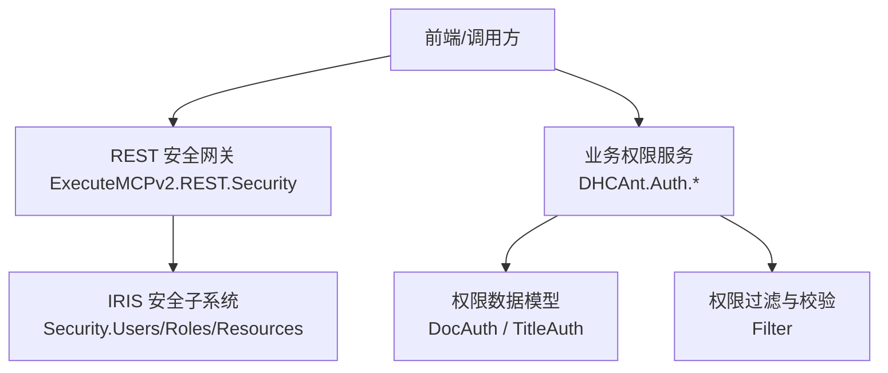
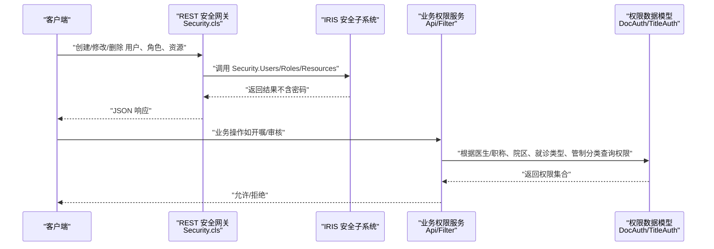
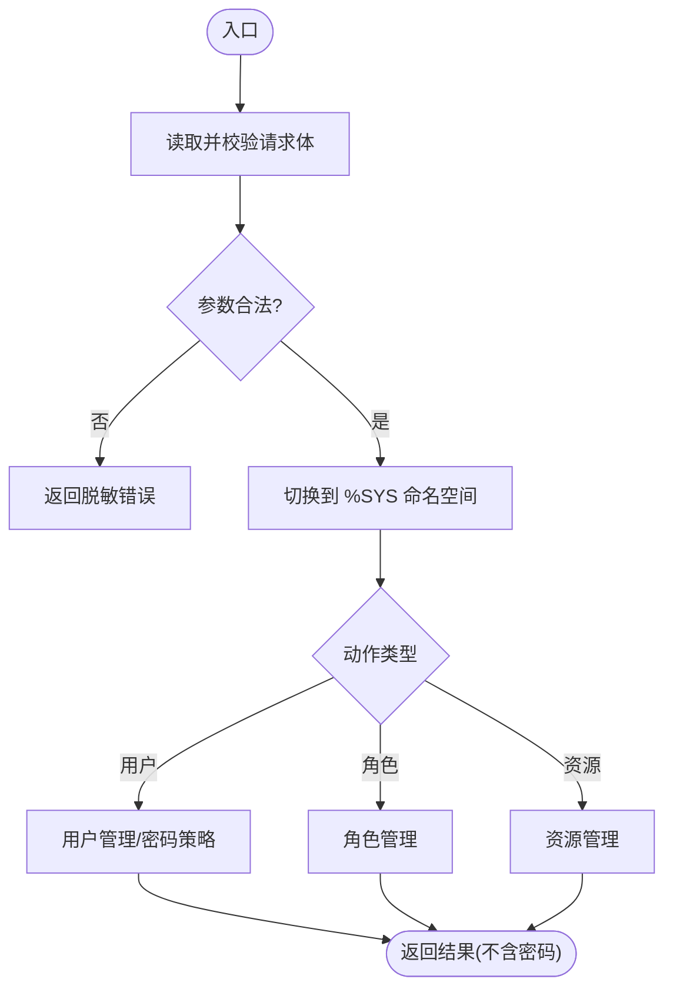
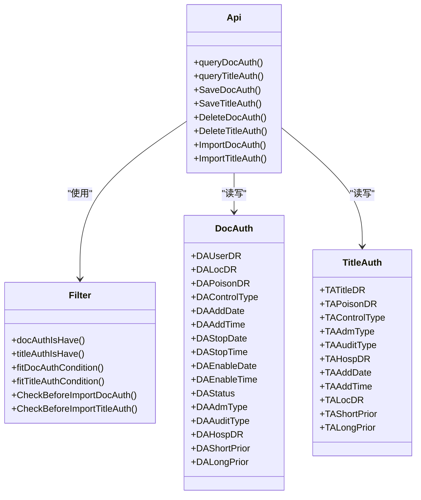
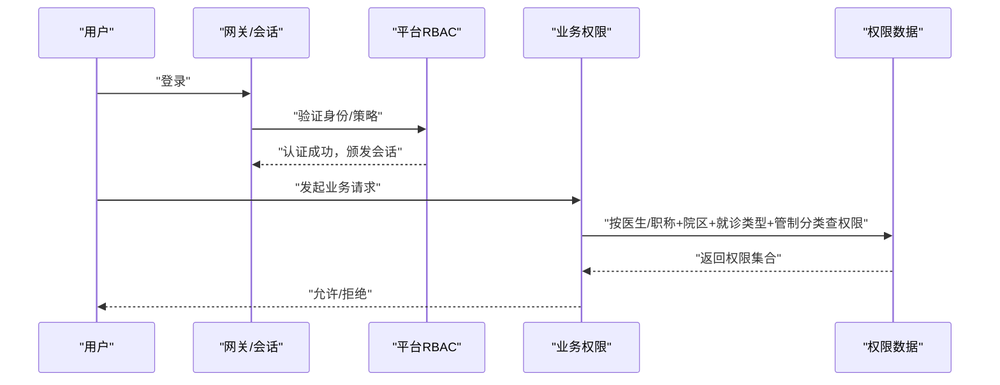
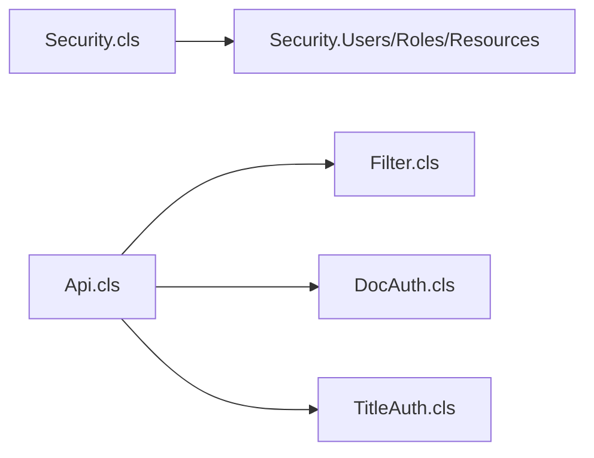

# 安全架构设计

<cite>
**本文引用的文件**
- [Security.cls](file://src/backend/public-mc/ExecuteMCPv2/REST/Security.cls)
- [Base.cls](file://src/backend/doc-ws/DHCAnt/Auth/Base.cls)
- [Api.cls](file://src/backend/doc-ws/DHCAnt/Auth/Api.cls)
- [Filter.cls](file://src/backend/doc-ws/DHCAnt/Auth/Filter.cls)
- [DocAuth.cls](file://src/backend/doc-ws/CF/DOC/ANT/DocAuth.cls)
- [TitleAuth.cls](file://src/backend/doc-ws/CF/DOC/ANT/TitleAuth.cls)
</cite>

## 目录
1. [简介](#简介)
2. [项目结构](#项目结构)
3. [核心组件](#核心组件)
4. [架构总览](#架构总览)
5. [详细组件分析](#详细组件分析)
6. [依赖关系分析](#依赖关系分析)
7. [性能与安全考量](#性能与安全考量)
8. [故障排查指南](#故障排查指南)
9. [结论](#结论)
10. [附录](#附录)

## 简介
本文件面向医疗信息系统的安全架构设计，聚焦身份认证、会话管理、授权模型（基于角色与资源的访问控制）、数据安全保护（传输与存储）、审计日志与合规性要求，以及威胁防护策略与漏洞管理机制。文档结合仓库中的安全相关实现，给出可落地的架构图、认证流程图与权限矩阵，并总结最佳实践与配置要点。

## 项目结构
系统在后端提供两类关键安全能力：
- 业务级权限体系：围绕医生与职称的用药/审核/临嘱/长嘱等权限维度进行细粒度控制，并通过导入校验保障数据质量。
- 平台级安全管理：通过 REST 接口对 IRIS 内置 Security.Users、Security.Roles、Security.Resources 进行统一封装，提供用户、角色、资源与密码策略的管理能力。

图表来源
- [Security.cls:1-120](file://src/backend/public-mc/ExecuteMCPv2/REST/Security.cls#L1-L120)
- [Api.cls:1-119](file://src/backend/doc-ws/DHCAnt/Auth/Api.cls#L1-L119)
- [Filter.cls:1-120](file://src/backend/doc-ws/DHCAnt/Auth/Filter.cls#L1-L120)
- [DocAuth.cls:1-125](file://src/backend/doc-ws/CF/DOC/ANT/DocAuth.cls#L1-L125)
- [TitleAuth.cls:1-93](file://src/backend/doc-ws/CF/DOC/ANT/TitleAuth.cls#L1-L93)

章节来源
- [Security.cls:1-120](file://src/backend/public-mc/ExecuteMCPv2/REST/Security.cls#L1-L120)
- [Api.cls:1-119](file://src/backend/doc-ws/DHCAnt/Auth/Api.cls#L1-L119)
- [Filter.cls:1-120](file://src/backend/doc-ws/DHCAnt/Auth/Filter.cls#L1-L120)
- [DocAuth.cls:1-125](file://src/backend/doc-ws/CF/DOC/ANT/DocAuth.cls#L1-L125)
- [TitleAuth.cls:1-93](file://src/backend/doc-ws/CF/DOC/ANT/TitleAuth.cls#L1-L93)

## 核心组件
- 平台级安全网关（REST）
  - 负责用户账户、角色、资源与密码策略的统一管理；所有操作在 %SYS 命名空间执行，确保对 IRIS 安全对象的访问受控。
  - 严格遵循“响应体中绝不包含密码”的安全约束，并对错误信息进行脱敏处理。
- 业务权限服务
  - 以医生与职称为维度，管理用药权限、审核权限、临嘱/长嘱权限，并结合就诊类型、院区、管制分类等进行多维授权。
  - 提供导入前校验，确保权限数据的完整性与一致性。
- 权限数据模型
  - 医生权限表（DocAuth）与职称权限表（TitleAuth）承载细粒度权限配置，并提供索引优化查询性能。
- 权限过滤与校验
  - 提供条件匹配与重复性检查，支持按医院、科室、就诊类型、管制分类、权限类型等多维过滤。

章节来源
- [Security.cls:1-120](file://src/backend/public-mc/ExecuteMCPv2/REST/Security.cls#L1-L120)
- [Api.cls:1-119](file://src/backend/doc-ws/DHCAnt/Auth/Api.cls#L1-L119)
- [Filter.cls:1-120](file://src/backend/doc-ws/DHCAnt/Auth/Filter.cls#L1-L120)
- [DocAuth.cls:1-125](file://src/backend/doc-ws/CF/DOC/ANT/DocAuth.cls#L1-L125)
- [TitleAuth.cls:1-93](file://src/backend/doc-ws/CF/DOC/ANT/TitleAuth.cls#L1-L93)

## 架构总览
下图展示从请求进入、认证鉴权到资源访问的整体流程，涵盖平台级 RBAC 与业务级权限叠加。

图表来源
- [Security.cls:1-120](file://src/backend/public-mc/ExecuteMCPv2/REST/Security.cls#L1-L120)
- [Api.cls:1-119](file://src/backend/doc-ws/DHCAnt/Auth/Api.cls#L1-L119)
- [Filter.cls:1-120](file://src/backend/doc-ws/DHCAnt/Auth/Filter.cls#L1-L120)
- [DocAuth.cls:1-125](file://src/backend/doc-ws/CF/DOC/ANT/DocAuth.cls#L1-L125)
- [TitleAuth.cls:1-93](file://src/backend/doc-ws/CF/DOC/ANT/TitleAuth.cls#L1-L93)

## 详细组件分析

### 平台级安全网关（REST）
- 功能范围
  - 用户账户 CRUD：列出、获取、创建、修改、删除用户；支持设置初始密码、强制下次登录改密、启用/禁用、过期时间等。
  - 角色管理：列出、创建、修改、删除角色；维护角色描述、授予的角色、资源访问策略。
  - 资源管理：列出、创建、修改、删除资源；定义公开权限与资源类型。
  - 密码策略：读取系统密码策略（最小长度、模式），支持校验与修改密码，且响应中绝不包含密码明文。
- 安全要点
  - 所有操作切换至 %SYS 命名空间执行，避免越权访问。
  - 输入参数严格校验，异常信息经脱敏后返回。
  - 密码字段仅在请求体中出现，响应与错误消息中不泄露。

图表来源
- [Security.cls:1-120](file://src/backend/public-mc/ExecuteMCPv2/REST/Security.cls#L1-L120)

章节来源
- [Security.cls:1-120](file://src/backend/public-mc/ExecuteMCPv2/REST/Security.cls#L1-L120)

### 业务权限服务（医生/职称）
- 能力概述
  - 提供医生权限与职称权限的查询、保存、删除、导入模板与导入前校验。
  - 支持按医院、就诊类型、管制分类、权限类型（用药/审核/临嘱/长嘱）进行组合过滤。
- 数据模型
  - 医生权限表（DocAuth）：记录医生、院区、就诊类型、管制分类、权限类型、审核权限、临嘱/长嘱权限及生效时间等。
  - 职称权限表（TitleAuth）：记录职称、院区、就诊类型、管制分类、权限类型、审核权限、临嘱/长嘱权限及添加时间等。
- 过滤与校验
  - 提供重复性检测与条件匹配，确保权限配置的唯一性与正确性。
  - 导入前校验覆盖必填项、枚举值、院区可见性等规则，失败时返回明确提示。

图表来源
- [DocAuth.cls:1-125](file://src/backend/doc-ws/CF/DOC/ANT/DocAuth.cls#L1-L125)
- [TitleAuth.cls:1-93](file://src/backend/doc-ws/CF/DOC/ANT/TitleAuth.cls#L1-L93)
- [Filter.cls:1-273](file://src/backend/doc-ws/DHCAnt/Auth/Filter.cls#L1-L273)
- [Api.cls:1-119](file://src/backend/doc-ws/DHCAnt/Auth/Api.cls#L1-L119)

章节来源
- [Api.cls:1-119](file://src/backend/doc-ws/DHCAnt/Auth/Api.cls#L1-L119)
- [Filter.cls:1-273](file://src/backend/doc-ws/DHCAnt/Auth/Filter.cls#L1-L273)
- [DocAuth.cls:1-125](file://src/backend/doc-ws/CF/DOC/ANT/DocAuth.cls#L1-L125)
- [TitleAuth.cls:1-93](file://src/backend/doc-ws/CF/DOC/ANT/TitleAuth.cls#L1-L93)

### 认证与授权流程（结合平台与业务）
- 认证阶段
  - 通过平台级安全网关对用户进行身份核验（用户名/密码或令牌），必要时强制下次登录改密。
  - 密码策略校验由系统策略驱动，确保复杂度与生命周期管理。
- 授权阶段
  - 平台级 RBAC：基于角色与资源进行粗粒度访问控制。
  - 业务级权限：叠加医生/职称维度，结合院区、就诊类型、管制分类、权限类型进行细粒度控制。
- 会话管理
  - 建议在网关层建立会话上下文，携带用户标识、角色、院区等信息，供后续业务权限判断复用。

图表来源
- [Security.cls:1-120](file://src/backend/public-mc/ExecuteMCPv2/REST/Security.cls#L1-L120)
- [Api.cls:1-119](file://src/backend/doc-ws/DHCAnt/Auth/Api.cls#L1-L119)
- [Filter.cls:1-120](file://src/backend/doc-ws/DHCAnt/Auth/Filter.cls#L1-L120)
- [DocAuth.cls:1-125](file://src/backend/doc-ws/CF/DOC/ANT/DocAuth.cls#L1-L125)
- [TitleAuth.cls:1-93](file://src/backend/doc-ws/CF/DOC/ANT/TitleAuth.cls#L1-L93)

### 权限矩阵（示例）
- 维度
  - 主体：医生、职称
  - 客体：院区、就诊类型、管制分类
  - 操作：用药权限、审核权限、临嘱权限、长嘱权限
- 规则
  - 当主体满足条件且具备相应权限位时，方可执行对应操作。
  - 导入前校验确保各维度取值有效且唯一。

（本节为概念性说明，未直接分析具体文件）

## 依赖关系分析
- 平台级安全网关依赖 IRIS 安全子系统（Users/Roles/Resources），并在 %SYS 命名空间下执行。
- 业务权限服务依赖权限数据模型（DocAuth/TitleAuth）与过滤逻辑（Filter）。
- 两者共同构成“平台 RBAC + 业务细粒度权限”的双层授权体系。

图表来源
- [Security.cls:1-120](file://src/backend/public-mc/ExecuteMCPv2/REST/Security.cls#L1-L120)
- [Api.cls:1-119](file://src/backend/doc-ws/DHCAnt/Auth/Api.cls#L1-L119)
- [Filter.cls:1-120](file://src/backend/doc-ws/DHCAnt/Auth/Filter.cls#L1-L120)
- [DocAuth.cls:1-125](file://src/backend/doc-ws/CF/DOC/ANT/DocAuth.cls#L1-L125)
- [TitleAuth.cls:1-93](file://src/backend/doc-ws/CF/DOC/ANT/TitleAuth.cls#L1-L93)

章节来源
- [Security.cls:1-120](file://src/backend/public-mc/ExecuteMCPv2/REST/Security.cls#L1-L120)
- [Api.cls:1-119](file://src/backend/doc-ws/DHCAnt/Auth/Api.cls#L1-L119)
- [Filter.cls:1-120](file://src/backend/doc-ws/DHCAnt/Auth/Filter.cls#L1-L120)
- [DocAuth.cls:1-125](file://src/backend/doc-ws/CF/DOC/ANT/DocAuth.cls#L1-L125)
- [TitleAuth.cls:1-93](file://src/backend/doc-ws/CF/DOC/ANT/TitleAuth.cls#L1-L93)

## 性能与安全考量
- 性能
  - 权限数据模型提供复合索引（如医院+用户+就诊类型+管制分类），提升高频查询效率。
  - 过滤逻辑采用多维度快速匹配，减少不必要的数据扫描。
- 安全
  - 平台级网关严格限制命名空间切换，避免越权。
  - 密码策略校验与强制改密机制降低弱口令风险。
  - 响应体与错误信息脱敏，防止敏感信息泄露。
  - 业务导入前校验保障权限数据质量，降低误配风险。

（本节为通用指导，未直接分析具体文件）

## 故障排查指南
- 平台级安全网关
  - 若用户列表为空或报错，检查是否成功切换至 %SYS 命名空间，以及 Security.Users/Roles/Resources 的可用性与权限。
  - 若密码修改失败，核对密码策略（最小长度、模式）与用户是否存在。
- 业务权限
  - 若导入失败，查看导入前校验返回的错误信息，逐项核对必填项、枚举值、院区可见性等。
  - 若权限不生效，检查医生/职称、院区、就诊类型、管制分类与权限类型的组合是否正确，并确认索引命中。

章节来源
- [Security.cls:1-120](file://src/backend/public-mc/ExecuteMCPv2/REST/Security.cls#L1-L120)
- [Filter.cls:181-273](file://src/backend/doc-ws/DHCAnt/Auth/Filter.cls#L181-L273)

## 结论
本系统通过平台级 RBAC 与业务级细粒度权限相结合，构建了覆盖身份认证、会话管理、授权控制、数据安全与合规审计的完整安全架构。平台级网关提供统一的账户与权限管理能力，业务权限服务则针对医疗场景进行精细化控制。建议在生产环境中持续强化密码策略、最小权限原则、审计日志与入侵检测，定期开展漏洞评估与渗透测试，确保安全基线持续达标。

## 附录
- 安全配置选项（建议）
  - 密码策略：启用最小长度、复杂度与有效期；强制首次登录改密。
  - 会话管理：设置会话超时、并发限制与绑定 IP/设备指纹。
  - 传输安全：全站 HTTPS，启用 HSTS，禁用不安全协议与套件。
  - 存储安全：敏感字段加密存储，数据库连接使用 TLS，密钥轮换。
  - 审计日志：记录登录、权限变更、数据访问与导出行为，集中收集与告警。
- 最佳实践
  - 最小权限原则：按角色与资源分配最小必要权限。
  - 分层防御：网关层、应用层、数据层多重校验。
  - 安全编码：输入校验、输出编码、防注入、防越权。
  - 持续监控：异常登录、频繁失败、批量操作告警。
  - 合规对齐：遵循医疗行业数据安全与隐私保护规范。

（本节为通用指导，未直接分析具体文件）