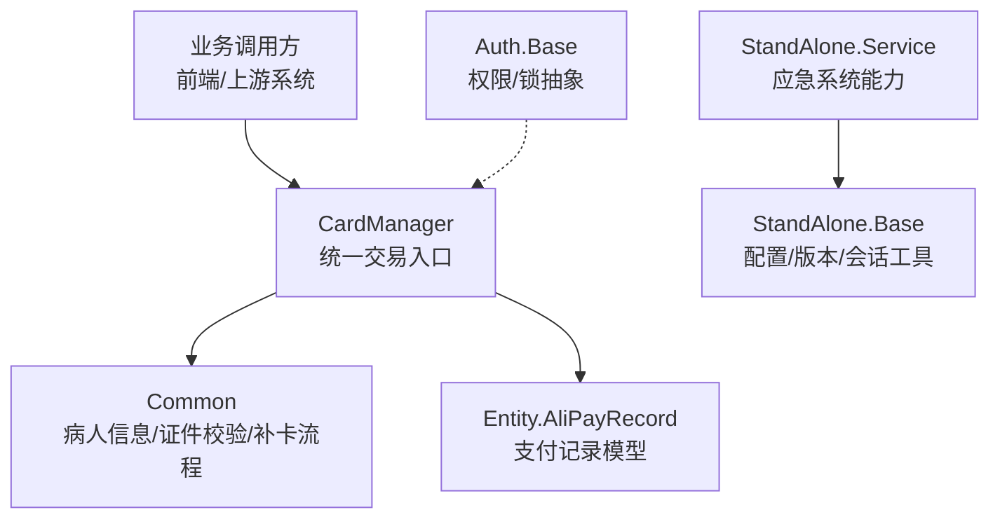
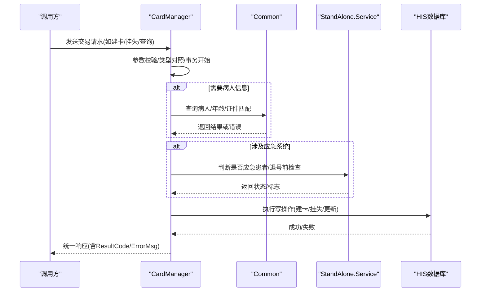
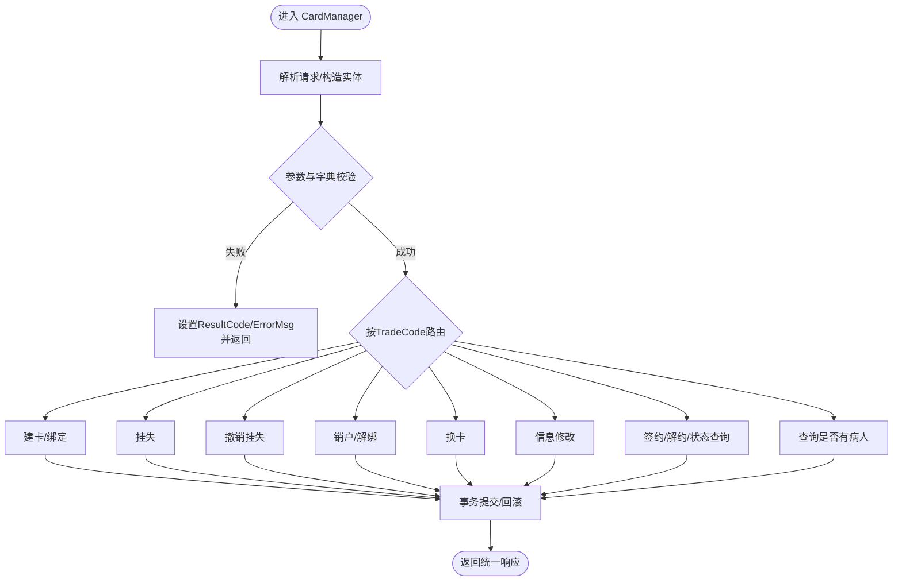
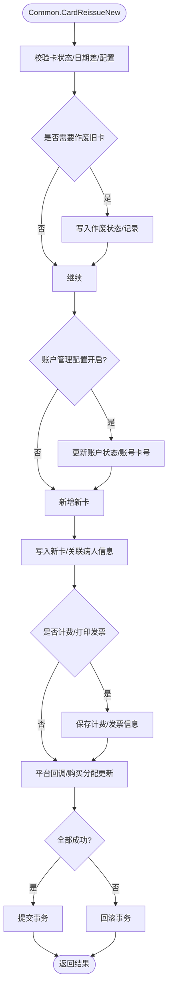
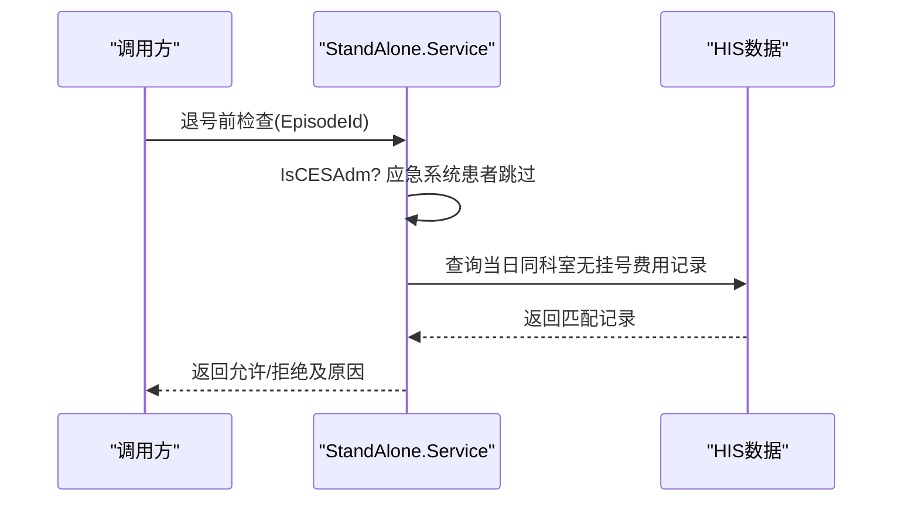
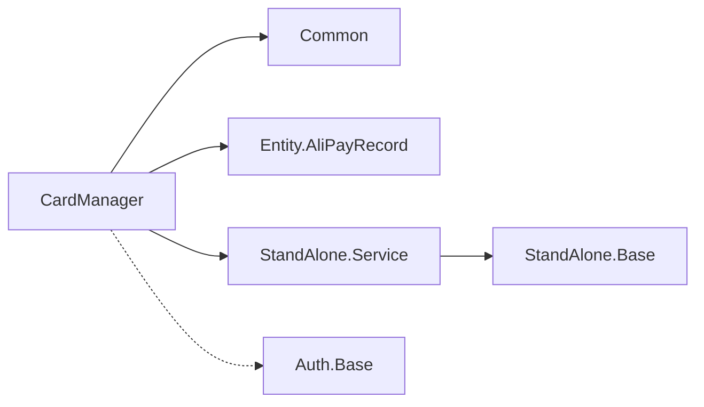

# 第三方服务集成

<cite>
**本文引用的文件**
- [CardManager.cls](file://src/backend/public-mc/DHCExternalService/CardInterface/CardManager.cls)
- [Common.cls](file://src/backend/public-mc/DHCExternalService/CardInterface/Common.cls)
- [AliPayRecord.cls](file://src/backend/public-mc/DHCExternalService/CardInterface/Entity/AliPayRecord.cls)
- [Service.cls](file://src/backend/conting-ws/DHCDoc/Interface/StandAlone/Service.cls)
- [Base.cls](file://src/backend/conting-ws/DHCDoc/Interface/StandAlone/Base.cls)
- [Base.cls](file://src/backend/doc-ws/DHCAnt/Auth/Base.cls)
</cite>

## 目录
1. [简介](#简介)
2. [项目结构](#项目结构)
3. [核心组件](#核心组件)
4. [架构总览](#架构总览)
5. [详细组件分析](#详细组件分析)
6. [依赖关系分析](#依赖关系分析)
7. [性能与可用性](#性能与可用性)
8. [故障排查指南](#故障排查指南)
9. [结论](#结论)
10. [附录：接口与调用示例](#附录接口与调用示例)

## 简介
本文件聚焦于本仓库中与外部系统对接的第三方服务集成，重点覆盖以下方面：
- 医保系统与支付平台（以银医卡、支付宝等为例）的对接能力
- 认证授权、数据加密与签名验证的安全机制
- 服务注册发现、负载均衡、熔断降级等微服务治理建议
- 服务调用示例、监控告警与日志追踪方案
- 版本兼容性与回滚策略

说明：本文基于仓库中已实现的“银医卡/支付”相关类与应急系统对接能力进行梳理，并结合通用最佳实践给出可落地的治理与运维方案。

## 项目结构
围绕第三方集成的关键代码主要分布在以下模块：
- 公共对外服务：DHCExternalService/CardInterface（银医卡与支付实体、通用工具、统一入口）
- 应急系统对接：conting-ws/DHCDoc/Interface/StandAlone（应急系统开关、状态判断、退号前校验等）
- 认证基础：doc-ws/DHCAnt/Auth/Base（权限与锁抽象基类）

图示来源
- [CardManager.cls:1-118](file://src/backend/public-mc/DHCExternalService/CardInterface/CardManager.cls#L1-L118)
- [Common.cls:1-381](file://src/backend/public-mc/DHCExternalService/CardInterface/Common.cls#L1-L381)
- [AliPayRecord.cls:1-37](file://src/backend/public-mc/DHCExternalService/CardInterface/Entity/AliPayRecord.cls#L1-L37)
- [Service.cls:1-227](file://src/backend/conting-ws/DHCDoc/Interface/StandAlone/Service.cls#L1-L227)
- [Base.cls](standalone):[1-199:1-199](file://src/backend/conting-ws/DHCDoc/Interface/StandAlone/Base.cls#L1-L199)
- [Base.cls](auth):[1-41:1-41](file://src/backend/doc-ws/DHCAnt/Auth/Base.cls#L1-L41)

章节来源
- [CardManager.cls:1-118](file://src/backend/public-mc/DHCExternalService/CardInterface/CardManager.cls#L1-L118)
- [Common.cls:1-381](file://src/backend/public-mc/DHCExternalService/CardInterface/Common.cls#L1-L381)
- [Service.cls:1-227](file://src/backend/conting-ws/DHCDoc/Interface/StandAlone/Service.cls#L1-L227)
- [Base.cls](standalone):[1-199:1-199](file://src/backend/conting-ws/DHCDoc/Interface/StandAlone/Base.cls#L1-L199)
- [Base.cls](auth):[1-41:1-41](file://src/backend/doc-ws/DHCAnt/Auth/Base.cls#L1-L41)

## 核心组件
- 统一交易入口 CardManager：负责解析请求、路由到建卡/挂失/解绑/换卡/修改/签约/查询等具体处理逻辑，统一事务边界与错误码封装。
- 通用工具 Common：提供病人信息查询、年龄计算、证件号与姓名匹配、补卡流程、证件类型校验、外籍联系人校验等。
- 支付实体 AliPayRecord：定义支付侧返回/记录的数据模型（XML适配）。
- 应急系统 Service：提供应急系统开关、是否来自应急系统的患者判断、退号前检查、挂号医嘱存在性检查等。
- 基础能力 Base（StandAlone）：提供跨 HIS 版本的日期时间转换、配置读取、语言、会话串、错误码翻译、医院ID获取等。
- 认证基础 Auth.Base：提供权限表名、标题/文档权限类名、加解锁抽象、重复提交处理等。

章节来源
- [CardManager.cls:1-118](file://src/backend/public-mc/DHCExternalService/CardInterface/CardManager.cls#L1-L118)
- [Common.cls:1-381](file://src/backend/public-mc/DHCExternalService/CardInterface/Common.cls#L1-L381)
- [AliPayRecord.cls:1-37](file://src/backend/public-mc/DHCExternalService/CardInterface/Entity/AliPayRecord.cls#L1-L37)
- [Service.cls:1-227](file://src/backend/conting-ws/DHCDoc/Interface/StandAlone/Service.cls#L1-L227)
- [Base.cls](standalone):[1-199:1-199](file://src/backend/conting-ws/DHCDoc/Interface/StandAlone/Base.cls#L1-L199)
- [Base.cls](auth):[1-41:1-41](file://src/backend/doc-ws/DHCAnt/Auth/Base.cls#L1-L41)

## 架构总览
整体采用“统一网关 + 领域适配器”的模式：
- 统一网关：CardManager 作为银医卡/支付交易的唯一入口，屏蔽下游差异，统一事务与错误码。
- 领域适配器：Common 封装病人主索引、证件、补卡等业务；StandAlone 封装应急系统能力；Auth.Base 提供权限与并发控制抽象。
- 数据模型：Entity 层通过 XML 适配与序列化，保证与外部系统报文一致。

图示来源
- [CardManager.cls:1-118](file://src/backend/public-mc/DHCExternalService/CardInterface/CardManager.cls#L1-L118)
- [Common.cls:1-381](file://src/backend/public-mc/DHCExternalService/CardInterface/Common.cls#L1-L381)
- [Service.cls:1-227](file://src/backend/conting-ws/DHCDoc/Interface/StandAlone/Service.cls#L1-L227)

## 详细组件分析

### 组件A：银医卡/支付统一入口 CardManager
- 职责
  - 接收并解析外部请求（XML/对象），映射为内部实体
  - 根据交易码路由到具体方法（建卡、挂失、销户、换卡、修改、签约、查询等）
  - 统一事务管理（成功提交、异常回滚）
  - 统一错误码与消息封装
- 关键流程
  - 参数校验与字典对照（证件类型、性别、民族、职业等）
  - 业务分支处理（不同 TradeCode）
  - 调用底层保存/更新逻辑，捕获错误并转换为统一返回体
- 复杂度与优化点
  - 大量分支与字典查找，建议将对照表外置化并缓存
  - 长事务内避免重型I/O，必要时拆分子事务
  - 对重复建卡/重复绑定等场景增加幂等键（如交易流水号+卡号）

图示来源
- [CardManager.cls:1-118](file://src/backend/public-mc/DHCExternalService/CardInterface/CardManager.cls#L1-L118)

章节来源
- [CardManager.cls:1-118](file://src/backend/public-mc/DHCExternalService/CardInterface/CardManager.cls#L1-L118)

### 组件B：通用工具 Common
- 职责
  - 病人基本信息获取、年龄计算
  - 证件号与姓名匹配，支持15/18位身份证互转
  - 补卡流程（作废旧卡、新增新卡、账户状态、计费发票、平台回调）
  - 证件类型有效性校验、外籍联系人信息校验
- 关键点
  - 补卡过程包含多步写库与平台回调，需强一致性保障
  - 对外部平台回调（如 SENDREADDCARDINFO）应异步化或重试队列
- 复杂度与优化点
  - 多处SQL与对象序列化，建议批量化与批量提交
  - 平台回调失败应纳入重试与死信队列

图示来源
- [Common.cls:111-295](file://src/backend/public-mc/DHCExternalService/CardInterface/Common.cls#L111-L295)

章节来源
- [Common.cls:1-381](file://src/backend/public-mc/DHCExternalService/CardInterface/Common.cls#L1-L381)

### 组件C：应急系统对接 StandAlone
- 职责
  - 应急系统开关检测
  - 判断就诊是否来自应急系统
  - 退号前检查（防止误退应急系统患者）
  - 挂号医嘱存在性检查（用于退号限制）
- 关键点
  - 通过全局标记与队列状态综合判断，避免误判
  - 与 HIS 订单/队列数据交互，注意并发与一致性

图示来源
- [Service.cls:132-189](file://src/backend/conting-ws/DHCDoc/Interface/StandAlone/Service.cls#L132-L189)

章节来源
- [Service.cls:1-227](file://src/backend/conting-ws/DHCDoc/Interface/StandAlone/Service.cls#L1-L227)

### 组件D：基础能力 Base（StandAlone）
- 职责
  - 跨 HIS 版本的日期/时间格式转换
  - 配置节点读取、语言ID、会话串获取
  - 错误码翻译、医院ID获取
- 价值
  - 屏蔽不同 HIS 版本差异，提升兼容性
  - 统一配置与国际化访问方式

章节来源
- [Base.cls](standalone):[1-199:1-199](file://src/backend/conting-ws/DHCDoc/Interface/StandAlone/Base.cls#L1-L199)

### 组件E：认证与并发控制 Auth.Base
- 职责
  - 权限表名、权限类名配置
  - 加解锁抽象（可用于分布式锁/行级锁）
  - 重复提交处理（忽略/去重）
- 扩展建议
  - 在 CardManager 的关键写路径引入加解锁，避免并发冲突
  - 结合审计日志记录权限变更

章节来源
- [Base.cls](auth):[1-41:1-41](file://src/backend/doc-ws/DHCAnt/Auth/Base.cls#L1-L41)

## 依赖关系分析
- CardManager 依赖 Common（病人/证件/补卡）、依赖实体模型（XML序列化）、依赖 StandAlone（应急系统判断）
- Common 依赖 HIS 数据表与平台回调接口
- StandAlone 依赖 HIS 队列与订单数据
- Auth.Base 为可选的并发控制与权限抽象，可在上层复用

图示来源
- [CardManager.cls:1-118](file://src/backend/public-mc/DHCExternalService/CardInterface/CardManager.cls#L1-L118)
- [Common.cls:1-381](file://src/backend/public-mc/DHCExternalService/CardInterface/Common.cls#L1-L381)
- [AliPayRecord.cls:1-37](file://src/backend/public-mc/DHCExternalService/CardInterface/Entity/AliPayRecord.cls#L1-L37)
- [Service.cls:1-227](file://src/backend/conting-ws/DHCDoc/Interface/StandAlone/Service.cls#L1-L227)
- [Base.cls](standalone):[1-199:1-199](file://src/backend/conting-ws/DHCDoc/Interface/StandAlone/Base.cls#L1-L199)
- [Base.cls](auth):[1-41:1-41](file://src/backend/doc-ws/DHCAnt/Auth/Base.cls#L1-L41)

章节来源
- [CardManager.cls:1-118](file://src/backend/public-mc/DHCExternalService/CardInterface/CardManager.cls#L1-L118)
- [Common.cls:1-381](file://src/backend/public-mc/DHCExternalService/CardInterface/Common.cls#L1-L381)
- [Service.cls:1-227](file://src/backend/conting-ws/DHCDoc/Interface/StandAlone/Service.cls#L1-L227)

## 性能与可用性
- 事务与一致性
  - 统一入口使用事务包裹，确保写操作原子性；对长耗时步骤（如平台回调）建议异步化
- 幂等与防重
  - 建议在 CardManager 层引入幂等键（如 TransactionId + PatientCard），避免重复提交
- 并发控制
  - 利用 Auth.Base 的加解锁抽象，对建卡/挂失等热点操作加细粒度锁
- 缓存与字典
  - 将字典对照（证件类型、性别、民族等）与配置节点缓存至内存，降低数据库压力
- 熔断与降级
  - 对平台回调与外部依赖增加超时与重试，失败时走降级路径（如本地队列暂存）
- 负载均衡
  - 若部署多实例，建议通过网关层做请求分发，并在写操作前加分布式锁

[本节为通用指导，不直接分析具体文件]

## 故障排查指南
- 常见错误定位
  - 参数校验失败：检查传入字段是否符合字典与必填规则（如证件号、手机号）
  - 字典对照失败：核对银行代码、证件类型、性别、民族等的映射关系
  - 事务失败：查看回滚分支与异常捕获位置，确认是否某一步骤失败导致整体回滚
- 应急系统相关
  - 退号被拒：检查是否为应急系统患者或是否存在未停的挂号医嘱
- 平台回调失败
  - 补卡后平台回调失败：检查网络与重试策略，必要时人工介入补偿

章节来源
- [CardManager.cls:1-118](file://src/backend/public-mc/DHCExternalService/CardInterface/CardManager.cls#L1-L118)
- [Common.cls:111-295](file://src/backend/public-mc/DHCExternalService/CardInterface/Common.cls#L111-L295)
- [Service.cls:132-189](file://src/backend/conting-ws/DHCDoc/Interface/StandAlone/Service.cls#L132-L189)

## 结论
本仓库在第三方服务集成方面提供了较为完善的银医卡/支付统一入口与应急系统对接能力。通过统一入口、通用工具与基础能力层的分层设计，实现了较高的可维护性与可扩展性。建议在此基础上进一步完善：
- 统一的认证授权与签名验签机制
- 更完善的熔断降级与重试策略
- 更细粒度的监控与追踪埋点
- 明确的版本兼容矩阵与灰度发布流程

[本节为总结，不直接分析具体文件]

## 附录：接口与调用示例

### 银医卡统一接口（CardManager）
- 输入
  - 交易码（TradeCode）：如建卡、挂失、销户、换卡、修改、签约、查询等
  - 病人信息：登记号/姓名/性别/出生日期/联系方式等
  - 卡信息：卡号、卡类型、证件号、安全码等
  - 其他：银行代码、医院ID、用户ID、交易流水号等
- 输出
  - ResultCode：统一错误码
  - ErrorMsg：错误描述
  - 业务字段：如 SignedStatus、PatientID 等
- 调用示例（概念性）
  - 建卡：传入 TradeCode=3001，填充必要病人/卡信息，返回 ResultCode=0 表示成功
  - 挂失：传入 TradeCode=3002，指定卡号与证件信息，返回 ResultCode=0 表示成功
  - 查询：传入 TradeCode=3100，传入证件号与姓名，返回是否已有病人记录

章节来源
- [CardManager.cls:1-118](file://src/backend/public-mc/DHCExternalService/CardInterface/CardManager.cls#L1-L118)

### 应急系统能力（StandAlone.Service）
- 能力清单
  - 是否启用应急系统
  - 是否来自应急系统的患者
  - 退号前检查（禁止误退应急系统患者）
  - 挂号医嘱存在性检查
- 调用示例（概念性）
  - 退号前检查：传入 EpisodeId，若返回非0则不允许退号

章节来源
- [Service.cls:132-189](file://src/backend/conting-ws/DHCDoc/Interface/StandAlone/Service.cls#L132-L189)

### 安全机制建议（认证授权、加密、签名）
- 认证授权
  - 在网关层统一鉴权，结合 Auth.Base 的权限表与加解锁抽象，实现细粒度控制
- 数据加密
  - 敏感字段（证件号、手机号）传输层使用TLS，存储层按需加密
- 签名验证
  - 对外部报文增加签名（如 HMAC-SHA256），服务端验签后再进入业务逻辑
- 幂等与防重
  - 使用 TransactionId 作为幂等键，配合去重表或Redis计数

[本节为通用指导，不直接分析具体文件]

### 微服务治理建议（注册发现、负载均衡、熔断降级）
- 注册发现
  - 使用服务注册中心（如Nacos/Eureka）管理服务实例
- 负载均衡
  - 网关层按策略分发请求，避免单点过载
- 熔断降级
  - 对平台回调与外部依赖设置熔断阈值，失败时走降级路径（本地队列/延迟重试）
- 监控告警
  - 关键指标：成功率、延迟、错误率、熔断触发次数
  - 告警规则：错误率突增、延迟飙升、熔断频繁触发

[本节为通用指导，不直接分析具体文件]

### 版本兼容性与回滚策略
- 版本兼容
  - 通过 Base 的 HIS 版本获取与配置节点读取，屏蔽差异
  - 建立版本矩阵，明确各功能在不同版本的可用性与行为差异
- 回滚策略
  - 灰度发布：先小范围试点，观察指标稳定后全量
  - 快速回滚：保留上一版本镜像/脚本，出现问题立即回滚
  - 数据迁移：尽量向后兼容，避免破坏性变更

[本节为通用指导，不直接分析具体文件]