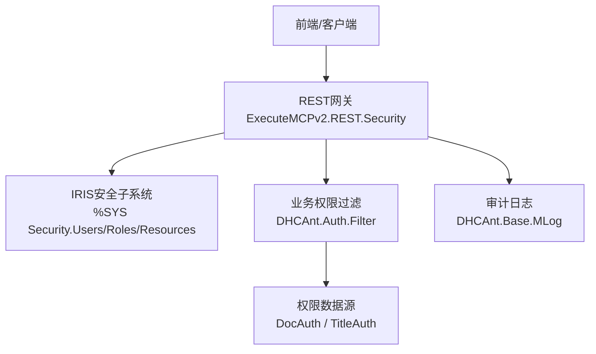
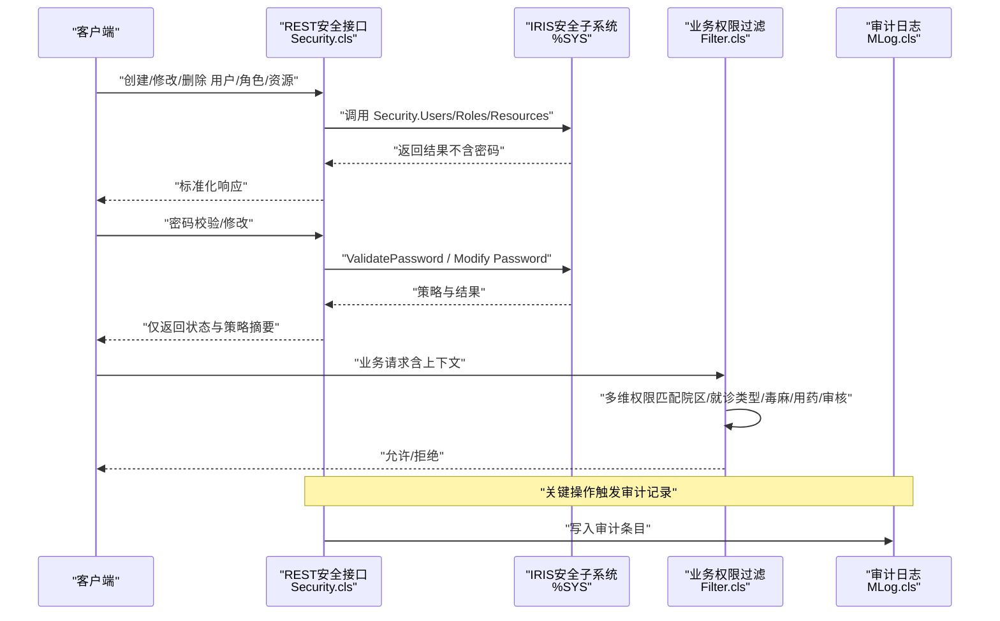
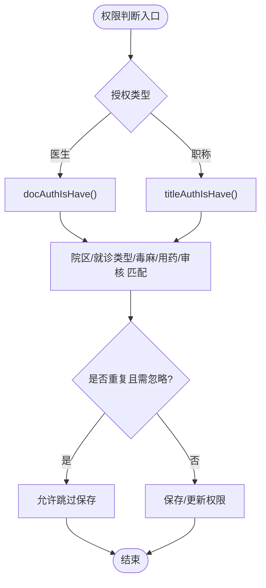
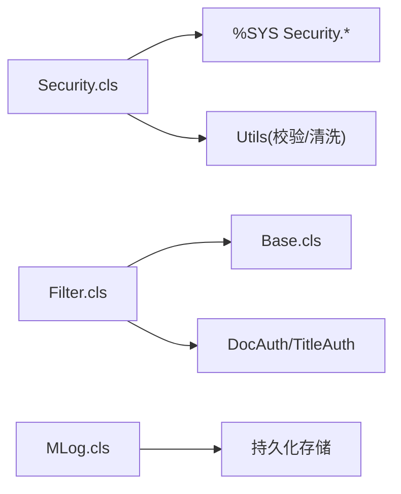

# 安全考虑

<cite>
**本文引用的文件**
- [Security.cls](file://src/backend/public-mc/ExecuteMCPv2/REST/Security.cls)
- [Filter.cls](file://src/backend/doc-ws/DHCAnt/Auth/Filter.cls)
- [Base.cls](file://src/backend/doc-ws/DHCAnt/Auth/Base.cls)
- [MLog.cls](file://src/backend/doc-ws/DHCAnt/Base/MLog.cls)
</cite>

## 目录
1. [简介](#简介)
2. [项目结构](#项目结构)
3. [核心组件](#核心组件)
4. [架构总览](#架构总览)
5. [详细组件分析](#详细组件分析)
6. [依赖关系分析](#依赖关系分析)
7. [性能与安全权衡](#性能与安全权衡)
8. [故障排查指南](#故障排查指南)
9. [结论](#结论)
10. [附录：合规与隐私、配置与审计](#附录合规与隐私配置与审计)

## 简介
本文件面向IRIS HIS的安全架构与防护措施，聚焦身份认证、权限控制、数据安全、审计日志、会话管理、输入校验、防注入与XSS、敏感数据加密与传输安全、访问控制策略、安全配置、审计方法与漏洞修复流程，以及合规性与隐私保护。内容基于仓库中已实现的安全相关代码进行梳理与说明，帮助读者理解系统如何落地安全能力。

## 项目结构
本项目在“后端”模块中包含多套业务子系统（doc-ws、public-mc等），其中与安全和权限相关的核心实现集中在：
- 统一安全REST接口：位于 public-mc/ExecuteMCPv2/REST/Security.cls，提供用户、角色、资源、密码策略的CRUD与校验能力，并在%SYS命名空间下调用IRIS内置安全类。
- 业务级权限过滤：位于 doc-ws/DHCAnt/Auth/Filter.cls，实现按医生/职称、院区、就诊类型、毒麻药品、用药权限、审核权限等多维度的细粒度授权判断。
- 权限基础模型与参数处理：位于 doc-ws/DHCAnt/Auth/Base.cls，定义表名、类名及通用参数处理逻辑。
- 审计日志：位于 doc-ws/DHCAnt/Base/MLog.cls，记录申请单审核等业务操作的关键信息。



图表来源
- [Security.cls:1-800](file://src/backend/public-mc/ExecuteMCPv2/REST/Security.cls#L1-L800)
- [Filter.cls:1-273](file://src/backend/doc-ws/DHCAnt/Auth/Filter.cls#L1-L273)
- [Base.cls:1-41](file://src/backend/doc-ws/DHCAnt/Auth/Base.cls#L1-L41)
- [MLog.cls:1-81](file://src/backend/doc-ws/DHCAnt/Base/MLog.cls#L1-L81)

章节来源
- [Security.cls:1-800](file://src/backend/public-mc/ExecuteMCPv2/REST/Security.cls#L1-L800)
- [Filter.cls:1-273](file://src/backend/doc-ws/DHCAnt/Auth/Filter.cls#L1-L273)
- [Base.cls:1-41](file://src/backend/doc-ws/DHCAnt/Auth/Base.cls#L1-L41)
- [MLog.cls:1-81](file://src/backend/doc-ws/DHCAnt/Base/MLog.cls#L1-L81)

## 核心组件
- 统一安全REST服务（Security.cls）
  - 提供用户账户、角色、资源的查询与变更；支持密码修改与强度校验；所有操作均在%SYS命名空间执行，确保对IRIS内置安全类的访问受控。
  - 严格遵循“不泄露密码”原则：请求体可接收密码，但响应与错误消息中绝不包含密码原文或片段。
  - 统一的输入校验与错误清洗，避免将内部异常细节暴露给调用方。
- 业务权限过滤（Filter.cls）
  - 针对“医生权限”和“职称权限”两类维度，结合院区、就诊类型、毒麻药品、用药权限、审核权限等进行匹配判定。
  - 支持导入前校验，确保批量授权数据的合法性与一致性。
- 权限基础模型（Base.cls）
  - 声明权限相关的数据表与类映射，便于上层逻辑复用。
- 审计日志（MLog.cls）
  - 记录审核类操作的类型、时间、操作人、科室、对象、备注等关键信息，支撑事后追溯与合规审计。

章节来源
- [Security.cls:1-800](file://src/backend/public-mc/ExecuteMCPv2/REST/Security.cls#L1-L800)
- [Filter.cls:1-273](file://src/backend/doc-ws/DHCAnt/Auth/Filter.cls#L1-L273)
- [Base.cls:1-41](file://src/backend/doc-ws/DHCAnt/Auth/Base.cls#L1-L41)
- [MLog.cls:1-81](file://src/backend/doc-ws/DHCAnt/Base/MLog.cls#L1-L81)

## 架构总览
下图展示了从客户端到安全子系统与业务权限过滤的整体交互流程，包括用户管理、角色与资源管理、密码策略校验与审计记录的落点。



图表来源
- [Security.cls:1-800](file://src/backend/public-mc/ExecuteMCPv2/REST/Security.cls#L1-L800)
- [Filter.cls:1-273](file://src/backend/doc-ws/DHCAnt/Auth/Filter.cls#L1-L273)
- [MLog.cls:1-81](file://src/backend/doc-ws/DHCAnt/Base/MLog.cls#L1-L81)

## 详细组件分析

### 统一安全REST接口（Security.cls）
- 功能要点
  - 用户管理：列表、获取、创建、修改、删除；始终排除密码字段输出。
  - 角色管理：列表、创建、修改、删除；支持授予/撤销角色。
  - 资源管理：列表、创建、修改、删除；维护资源公开权限。
  - 密码管理：修改密码、校验密码强度；读取并返回当前密码策略摘要（最小长度、模式、注释），不包含候选密码。
  - 命名空间隔离：所有安全操作切换到%SYS命名空间执行，并在完成后恢复原命名空间，保证工具类可见性与安全性。
  - 输入校验与错误清洗：统一读取请求体、校验必填项、限制action取值、错误信息脱敏后返回。
- 安全特性
  - 零信任输出：任何响应与错误消息均不包含密码原文或片段。
  - 最小权限：仅通过IRIS内置安全API完成操作，避免越权。
  - 可观测性：错误路径统一走SanitizeError，便于集中审计与告警。

```mermaid
flowchart TD
Start(["进入安全接口"]) --> ReadBody["读取并解析请求体"]
ReadBody --> Validate["校验必填参数与动作值"]
Validate --> |通过| NS["切换至 %SYS 命名空间"]
Validate --> |失败| Err["错误清洗并返回"]
NS --> Op{"操作类型"}
Op --> |用户| UserOps["Users CRUD / Roles 分配"]
Op --> |角色| RoleOps["Roles CRUD"]
Op --> |资源| ResOps["Resources CRUD"]
[REDACTED: environment-specific example]
UserOps --> Out["构建响应不含密码"]
RoleOps --> Out
ResOps --> Out
PwdOps --> Out
Out --> End(["结束"])
Err --> End
```

图表来源
- [Security.cls:1-800](file://src/backend/public-mc/ExecuteMCPv2/REST/Security.cls#L1-L800)

章节来源
- [Security.cls:1-800](file://src/backend/public-mc/ExecuteMCPv2/REST/Security.cls#L1-L800)

### 业务权限过滤（Filter.cls）
- 功能要点
  - 支持“医生权限”与“职称权限”两种授权维度，依据院区、就诊类型、毒麻药品、用药权限、审核权限等条件进行匹配。
  - 提供导入前的强校验：检查医生工号、就诊类型、毒麻分类、用药权限、审核权限、临嘱/长嘱权限、院区代码等是否合法且存在。
  - 支持重复处理策略（如忽略重复），减少无效写入。
- 安全特性
  - 细粒度访问控制：多维度组合条件，降低越权风险。
  - 数据完整性校验：批量导入时前置校验，防止脏数据进入权限体系。
  - 可审计：配合日志组件记录关键授权变更与操作。



图表来源
- [Filter.cls:1-273](file://src/backend/doc-ws/DHCAnt/Auth/Filter.cls#L1-L273)
- [Base.cls:1-41](file://src/backend/doc-ws/DHCAnt/Auth/Base.cls#L1-L41)

章节来源
- [Filter.cls:1-273](file://src/backend/doc-ws/DHCAnt/Auth/Filter.cls#L1-L273)
- [Base.cls:1-41](file://src/backend/doc-ws/DHCAnt/Auth/Base.cls#L1-L41)

### 审计日志（MLog.cls）
- 功能要点
  - 记录审核类操作的关键信息：类型、时间、操作人、科室、对象、备注、名称等。
  - 提供常用索引以支持高效检索与统计。
- 安全特性
  - 可追溯：为权限变更与敏感操作提供审计线索。
  - 结构化存储：便于后续分析与合规报表生成。

章节来源
- [MLog.cls:1-81](file://src/backend/doc-ws/DHCAnt/Base/MLog.cls#L1-L81)

## 依赖关系分析
- 组件耦合
  - Security.cls 依赖 IRIS 内置安全类（%SYS命名空间下的 Users/Roles/Resources），并通过统一工具类进行输入校验与错误清洗。
  - Filter.cls 依赖权限数据表（DocAuth/TitleAuth）与基础参数处理（Base.cls）。
  - MLog.cls 作为独立持久化实体，被业务模块在关键节点调用以记录审计。
- 外部依赖
  - IRIS 安全子系统：负责用户、角色、资源与密码策略的权威管理。
  - 业务数据层：权限规则与字典数据由DocAuth/TitleAuth等表承载。
- 潜在风险
  - 命名空间切换需严格成对恢复，避免上下文污染。
  - 批量导入时需确保前置校验充分，防止恶意或错误数据进入权限体系。



图表来源
- [Security.cls:1-800](file://src/backend/public-mc/ExecuteMCPv2/REST/Security.cls#L1-L800)
- [Filter.cls:1-273](file://src/backend/doc-ws/DHCAnt/Auth/Filter.cls#L1-L273)
- [Base.cls:1-41](file://src/backend/doc-ws/DHCAnt/Auth/Base.cls#L1-L41)
- [MLog.cls:1-81](file://src/backend/doc-ws/DHCAnt/Base/MLog.cls#L1-L81)

章节来源
- [Security.cls:1-800](file://src/backend/public-mc/ExecuteMCPv2/REST/Security.cls#L1-L800)
- [Filter.cls:1-273](file://src/backend/doc-ws/DHCAnt/Auth/Filter.cls#L1-L273)
- [Base.cls:1-41](file://src/backend/doc-ws/DHCAnt/Auth/Base.cls#L1-L41)
- [MLog.cls:1-81](file://src/backend/doc-ws/DHCAnt/Base/MLog.cls#L1-L81)

## 性能与安全权衡
- 命名空间切换开销：每次安全操作切换至%SYS并恢复，带来轻微开销，但换取了更强的隔离与可控性。
- 批量导入校验：前置校验增加CPU与I/O消耗，但显著降低错误数据入库与后续治理成本。
- 审计写入：在高频路径上应评估异步或批量化方案，平衡实时性与吞吐。

[本节为通用指导，不直接引用具体文件]

## 故障排查指南
- 常见错误定位
  - 参数缺失或非法：检查请求体结构与action取值，确认必填项完整。
  - 命名空间异常：确认安全操作前后命名空间正确切换与恢复。
  - 权限不通过：核对院区、就诊类型、毒麻药品、用药权限、审核权限等维度是否满足。
  - 密码策略不通过：查看返回的策略摘要与提示信息，调整密码复杂度。
- 建议步骤
  - 使用统一错误输出进行问题定位，避免直接暴露内部异常。
  - 结合审计日志回溯关键操作的时间线与责任人。
  - 对批量导入失败逐行定位，优先修正数据格式与字典值。

章节来源
- [Security.cls:1-800](file://src/backend/public-mc/ExecuteMCPv2/REST/Security.cls#L1-L800)
- [Filter.cls:1-273](file://src/backend/doc-ws/DHCAnt/Auth/Filter.cls#L1-L273)
- [MLog.cls:1-81](file://src/backend/doc-ws/DHCAnt/Base/MLog.cls#L1-L81)

## 结论
本项目的安全架构围绕“统一安全接口 + 业务权限过滤 + 审计日志”展开：
- 统一安全接口通过IRIS内置安全能力实现用户、角色、资源与密码策略的集中管理，并严格遵循“不泄露密码”的输出规范。
- 业务权限过滤在多维度条件下实现细粒度访问控制，保障医疗场景下的最小权限原则。
- 审计日志为关键操作提供可追溯性，支撑合规与事后分析。
建议在部署与运维中持续强化输入校验、错误清洗、审计采集与策略基线，形成闭环的安全运营机制。

[本节为总结性内容，不直接引用具体文件]

## 附录：合规与隐私、配置与审计
- 合规性要求
  - 最小权限与职责分离：通过角色与资源管理实现按需授权。
  - 可审计与可追溯：关键操作写入审计日志，支持取证与分析。
  - 密码策略：启用并强制实施密码强度规则，必要时设置首次登录强制改密。
- 隐私保护措施
  - 敏感数据最小化：响应与错误消息中不包含密码等敏感信息。
  - 访问控制：基于院区、就诊类型、毒麻药品等维度限制数据可见范围。
- 安全配置指南
  - 启用并配置密码策略（最小长度、复杂度、过期策略）。
  - 为不同角色分配最小必要资源与权限。
  - 开启并集中收集审计日志，定期审查异常行为。
- 安全审计方法
  - 基于审计日志进行趋势分析与异常检测。
  - 对权限变更与敏感操作进行抽样复核。
- 漏洞修复流程
  - 发现与评估：建立漏洞上报与分级机制。
  - 修复与验证：制定修复方案并进行回归测试与渗透验证。
  - 发布与回滚：灰度发布，准备回滚预案。
  - 复盘与加固：复盘根因，完善防护与监控。

[本节为通用指导，不直接引用具体文件]