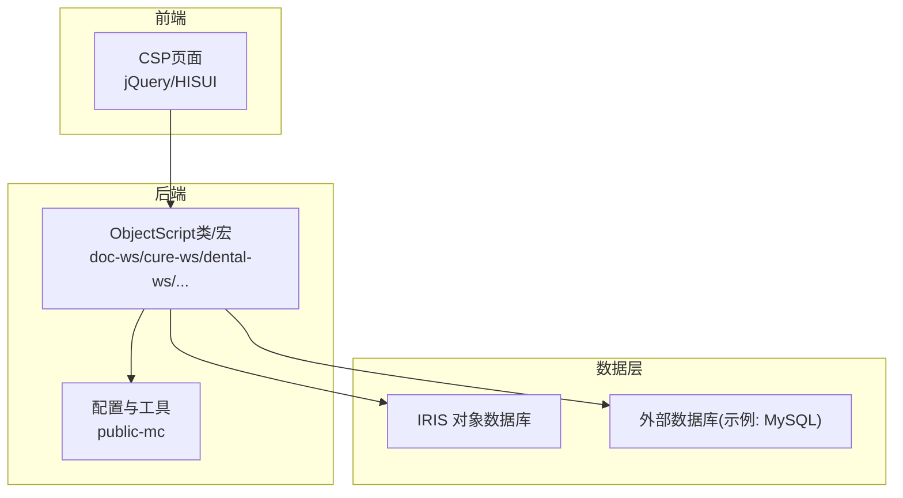
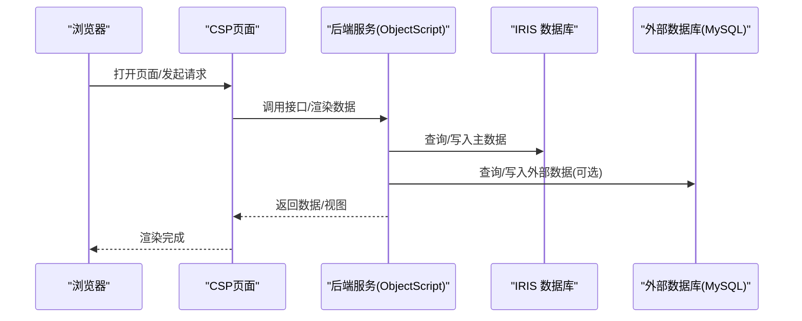
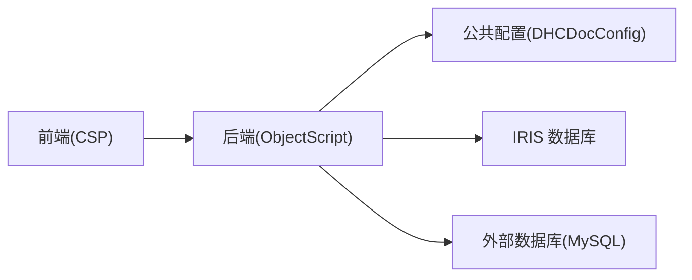

# 性能优化

<cite>
**本文引用的文件**
- [README.md](file://README.md)
- [DHCDocConfig.mac](file://src/backend/public-mc/DHCDocConfig.mac)
- [MySQLDB.cls](file://src/backend/conting-ws/DHCDoc/Interface/StandAlone/MySQLDB.cls)
- [CHQTASKNEW.mac](file://src/backend/public-mc/CHQTASKNEW.mac)
</cite>

## 目录
1. [简介](#简介)
2. [项目结构](#项目结构)
3. [核心组件](#核心组件)
4. [架构总览](#架构总览)
5. [详细组件分析](#详细组件分析)
6. [依赖关系分析](#依赖关系分析)
7. [性能考量与调优策略](#性能考量与调优策略)
8. [故障排查指南](#故障排查指南)
9. [结论](#结论)
10. [附录](#附录)

## 简介
本性能优化文档面向 IRIS HIS（医院信息系统），围绕数据库查询优化、缓存策略、内存管理、并发控制、前端性能优化、后端监控与瓶颈识别、基准/负载/压力测试方法，以及监控指标、告警规则和问题排查流程，提供系统化的实践指导。结合仓库中的后端 ObjectScript/CSP 技术栈与部署方式，给出可落地的优化建议与落地路径。

## 项目结构
IRIS HIS 采用前后端分离的模块化组织：
- 后端：InterSystems IRIS + ObjectScript，按产品域划分模块（如 doc-ws、cure-ws、dental-ws、epmi-mc、opadm-mc、triage-ws、public-mc 等）。
- 前端：CSP + jQuery/HISUI，静态资源通过 SFTP 同步到服务器 Web 目录。
- 构建与发布：后端通过 IRIS ObjectScript 扩展直接编译上传；前端通过脚本统一上传并编译 CSP。

图表来源
- [README.md:1-549](file://README.md#L1-L549)

章节来源
- [README.md:1-549](file://README.md#L1-L549)

## 核心组件
- 公共配置与工具：提供全局配置读写、日期时间处理、院区相关辅助能力，是跨模块共享的性能敏感点（频繁访问需考虑缓存与批量读取）。
- 任务调度入口：集中编排定时任务，具备加锁保护，避免重复执行导致资源争用。
- 外部数据库适配：封装建表与元数据检查，便于在外部数据库中建立索引与约束，提升查询性能。

章节来源
- [DHCDocConfig.mac:1-119](file://src/backend/public-mc/DHCDocConfig.mac#L1-L119)
- [CHQTASKNEW.mac:1-65](file://src/backend/public-mc/CHQTASKNEW.mac#L1-L65)
- [MySQLDB.cls:1-800](file://src/backend/conting-ws/DHCDoc/Interface/StandAlone/MySQLDB.cls#L1-L800)

## 架构总览
从请求到响应的关键路径包括：前端页面加载 → 后端服务处理（ObjectScript）→ 数据访问（IRIS/外部库）→ 返回结果。性能优化的关键在于减少 I/O、降低 CPU 热点、合理并发与缓存命中。

图表来源
- [README.md:1-549](file://README.md#L1-L549)

## 详细组件分析

### 公共配置组件（DHCDocConfig.mac）
- 职责：提供全局配置的读写、院区上下文获取、日期时间转换、常用字典字段读写等。
- 性能要点：
  - 高频读的配置项应引入缓存（进程内或分布式缓存），避免每次请求都访问全局节点。
  - 批量读取时合并多次 $O/$G 操作，减少 I/O 次数。
  - 对字符串拼接与分割进行最小化，避免在大循环中产生临时对象。
- 可扩展点：为关键配置增加 TTL 与失效策略，支持按需刷新。

章节来源
- [DHCDocConfig.mac:1-119](file://src/backend/public-mc/DHCDocConfig.mac#L1-L119)

### 任务调度入口（CHQTASKNEW.mac）
- 职责：统一编排每日/周期性任务（如床位日更、长期医嘱滚动、押金计算等），并通过加锁防止多实例重复执行。
- 性能要点：
  - 使用锁机制确保单实例串行执行，避免竞争条件导致的重复计算与写放大。
  - 将耗时任务拆分为子步骤，分批次提交，降低单次事务大小与锁持有时间。
  - 对大批量更新采用分批提交与索引维护策略，减少日志与锁开销。
- 监控建议：记录每步开始/结束时间与异常，便于定位慢任务。

章节来源
- [CHQTASKNEW.mac:1-65](file://src/backend/public-mc/CHQTASKNEW.mac#L1-L65)

### 外部数据库适配（MySQLDB.cls）
- 职责：生成外部数据库建表语句、检查表存在性，为外部系统对接提供基础能力。
- 性能要点：
  - 在建表阶段即规划主键、唯一键与常用查询列的索引，避免上线后补建索引带来的抖动。
  - 对大表分区/归档策略提前设计，控制热数据规模。
  - 对外部库连接池、超时、重试与熔断进行治理，避免拖垮主链路。
- 可观测性：记录建表/DDL 执行结果与耗时，便于审计与回滚。

章节来源
- [MySQLDB.cls:1-800](file://src/backend/conting-ws/DHCDoc/Interface/StandAlone/MySQLDB.cls#L1-L800)

## 依赖关系分析
- 前端依赖后端提供的 CSP/接口；后端依赖 IRIS 对象数据库与可能的外部数据库；公共配置被多个模块复用。
- 风险点：
  - 公共配置的高频访问可能成为热点，需要缓存与批量读取。
  - 任务调度若未合理拆分与限流，易造成批处理窗口拥塞。
  - 外部数据库连接与慢查询会放大端到端延迟。

图表来源
- [README.md:1-549](file://README.md#L1-L549)
- [DHCDocConfig.mac:1-119](file://src/backend/public-mc/DHCDocConfig.mac#L1-L119)
- [MySQLDB.cls:1-800](file://src/backend/conting-ws/DHCDoc/Interface/StandAlone/MySQLDB.cls#L1-L800)

## 性能考量与调优策略

### 数据库查询优化
- 索引与统计信息
  - 基于查询模式设计复合索引，优先覆盖高频过滤与排序字段。
  - 定期收集统计信息，避免执行计划劣化。
- SQL 与对象模型
  - 避免 N+1 查询，使用批量读取与关联查询。
  - 限制返回字段，仅拉取必要列；分页查询使用游标或范围扫描。
- 事务与锁
  - 缩小事务范围，减少长事务与行级锁持有时间。
  - 对高并发写热点采用队列化与幂等设计。
- 外部数据库
  - 连接池参数调优（最大连接数、空闲回收、超时）。
  - 慢查询日志与执行计划分析，必要时改写 SQL 或引入物化视图/汇总表。

章节来源
- [MySQLDB.cls:1-800](file://src/backend/conting-ws/DHCDoc/Interface/StandAlone/MySQLDB.cls#L1-L800)

### 缓存策略
- 缓存层级
  - 进程内缓存：用于热点配置、字典、用户偏好等小数据。
  - 分布式缓存：跨实例共享的会话、令牌、限流计数等。
- 失效与一致性
  - 设置合理 TTL，配合主动失效与懒失效。
  - 写扩散与读扩散权衡，保证最终一致性与低延迟。
- 命中率与容量
  - 监控命中率、淘汰率、内存占用，动态调整容量与策略。

章节来源
- [DHCDocConfig.mac:1-119](file://src/backend/public-mc/DHCDocConfig.mac#L1-L119)

### 内存管理
- 对象生命周期
  - 及时释放大对象引用，避免 GC 压力。
  - 避免在循环中创建大量临时对象。
- 堆与栈
  - 监控进程内存增长趋势，定位泄漏点。
  - 对大数据集采用流式处理，避免一次性加载。
- 序列化/反序列化
  - 控制 JSON/XML 体积，必要时压缩传输。

章节来源
- [README.md:1-549](file://README.md#L1-L549)

### 并发控制
- 任务调度
  - 使用分布式锁保证单实例执行，避免重复任务。
  - 将长任务拆分为可重试的子任务，支持断点续跑。
- 限流与背压
  - 对热点接口实施限流，保护下游数据库与外部服务。
  - 队列化削峰填谷，平滑突发流量。
- 资源隔离
  - 不同业务域使用独立线程池/连接池，避免相互影响。

章节来源
- [CHQTASKNEW.mac:1-65](file://src/backend/public-mc/CHQTASKNEW.mac#L1-L65)

### 前端性能优化
- 页面加载速度
  - 资源压缩与合并（CSS/JS）、启用 Gzip/Brotli。
  - 图片懒加载、CDN 加速、HTTP 缓存头优化。
- 响应时间
  - 减少首屏依赖，异步加载非关键资源。
  - 接口合并与去抖/节流，降低请求风暴。
- 渲染优化
  - 避免重排重绘，合理使用虚拟列表。
  - 错误边界与降级策略，保障可用性。

章节来源
- [README.md:1-549](file://README.md#L1-L549)

### 后端性能监控与瓶颈识别
- 指标采集
  - 应用层：QPS、RT、错误率、GC 时间、线程池使用率。
  - 系统层：CPU、内存、磁盘 IO、网络带宽。
  - 数据库层：慢查询、锁等待、缓冲池命中率。
- 链路追踪
  - 全链路 Trace ID，标注各阶段耗时。
- 瓶颈定位
  - 火焰图/热点函数分析，定位 CPU 热点。
  - 慢查询分析与执行计划优化。

章节来源
- [README.md:1-549](file://README.md#L1-L549)

### 基准测试、负载测试与压力测试
- 基准测试
  - 定义典型场景（如门诊挂号、处方开立、报告查询），测量 RT/P95/P99 与吞吐。
- 负载测试
  - 逐步加压，观察指标拐点，确定系统容量上限。
- 压力测试
  - 模拟极端峰值与异常（下游超时、数据库慢），验证弹性与降级。
- 自动化
  - 将用例纳入 CI，持续回归性能基线。

章节来源
- [README.md:1-549](file://README.md#L1-L549)

### 监控指标与告警规则
- 关键指标
  - 接口：成功率、平均/分位 RT、错误类型分布。
  - 资源：CPU/内存/IO 使用率、连接池使用率。
  - 数据：慢查询数量、缓存命中率、队列堆积。
- 告警规则
  - 阈值告警：如 P95 RT > 阈值、错误率 > 阈值、慢查询突增。
  - 趋势告警：如内存持续增长、GC 时间上升。
  - 组合告警：多指标联动，降低误报。
- 可视化
  - 仪表盘展示实时状态，支持钻取与下钻分析。

章节来源
- [README.md:1-549](file://README.md#L1-L549)

### 性能问题排查流程
- 现象确认：复现问题，收集时间窗口内的日志与指标。
- 快速止血：限流、降级、扩容，恢复服务。
- 根因分析：链路追踪、慢查询、热点函数、锁等待。
- 修复验证：回归测试与性能回归，确保无退化。
- 复盘改进：完善监控与预案，沉淀知识库。

章节来源
- [README.md:1-549](file://README.md#L1-L549)

## 故障排查指南
- 任务重复执行
  - 检查分布式锁是否生效，确认多实例部署下的互斥逻辑。
  - 查看任务日志，确认是否有异常中断导致重复触发。
- 配置读取缓慢
  - 评估是否频繁访问全局节点，考虑引入缓存与批量读取。
  - 检查是否存在大对象或复杂字符串拼接。
- 外部数据库慢查询
  - 核对索引是否命中，执行计划是否合理。
  - 检查连接池与超时配置，避免连接耗尽。

章节来源
- [CHQTASKNEW.mac:1-65](file://src/backend/public-mc/CHQTASKNEW.mac#L1-L65)
- [DHCDocConfig.mac:1-119](file://src/backend/public-mc/DHCDocConfig.mac#L1-L119)
- [MySQLDB.cls:1-800](file://src/backend/conting-ws/DHCDoc/Interface/StandAlone/MySQLDB.cls#L1-L800)

## 结论
IRIS HIS 的性能优化应从“数据层—应用层—前端”全链路入手：以索引与查询优化为基础，以缓存与并发控制为核心，以前端资源优化为体验保障，并以完善的监控与测试体系闭环。通过持续度量与迭代，可在保障稳定性的同时显著提升系统吞吐与响应速度。

## 附录
- 术语
  - QPS：每秒查询数
  - RT：响应时间
  - P95/P99：分位响应时间
  - TTL：生存时间
- 参考
  - 项目结构与部署说明参见 README。