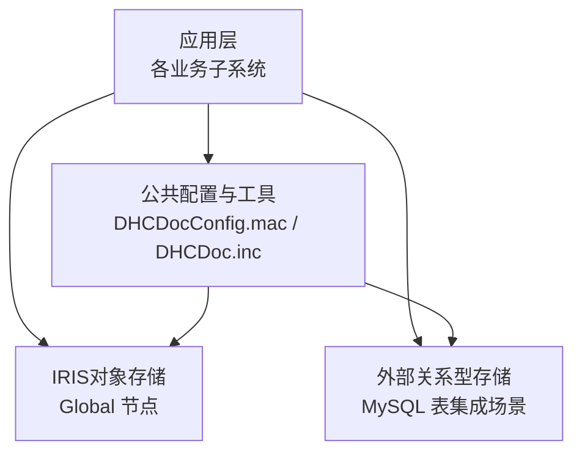
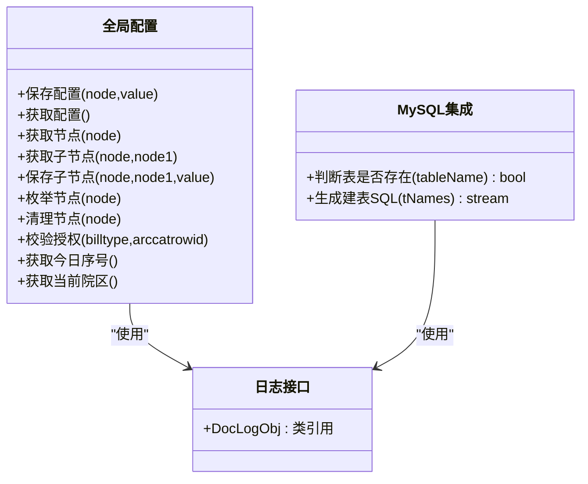
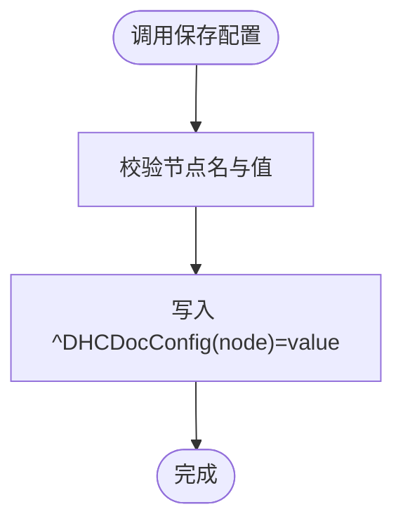
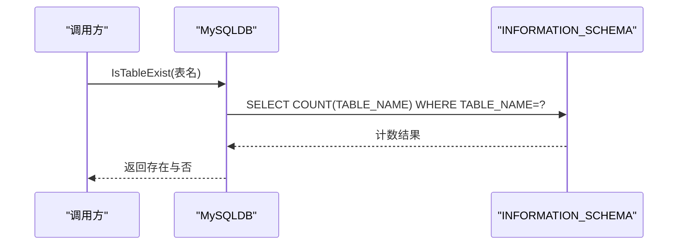
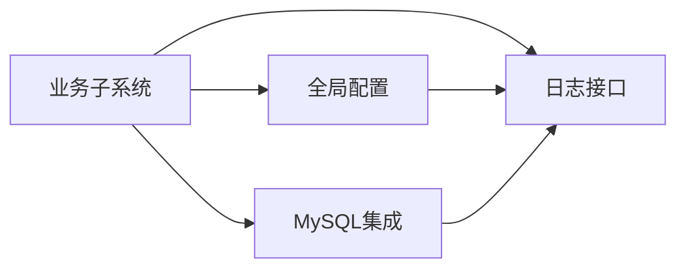

# 数据库架构概述

<cite>
**本文引用的文件**
- [README.md](file://README.md)
- [MySQLDB.cls](file://src/backend/conting-ws/DHCDoc/Interface/StandAlone/MySQLDB.cls)
- [DHCDocConfig.mac](file://src/backend/public-mc/DHCDocConfig.mac)
- [DHCDoc.inc](file://src/backend/public-mc/DHCDoc.inc)
</cite>

## 目录
1. [简介](#简介)
2. [项目结构](#项目结构)
3. [核心组件](#核心组件)
4. [架构总览](#架构总览)
5. [详细组件分析](#详细组件分析)
6. [依赖关系分析](#依赖关系分析)
7. [性能考虑](#性能考虑)
8. [故障排查指南](#故障排查指南)
9. [结论](#结论)
10. [附录](#附录)

## 简介
本文件面向IRIS HIS项目的数据库架构，聚焦以下方面：整体设计原则、命名规范、版本管理策略；Global变量的数据结构设计与索引策略；数据访问模式、缓存机制与事务处理；安全模型、权限控制与审计日志；监控指标与健康检查方法。文档基于仓库中的后端ObjectScript代码与配置进行归纳，并结合IRIS平台特性给出可落地的实践建议。

## 项目结构
- 后端采用InterSystems IRIS ObjectScript，按业务域划分为多个子系统（如医生工作站、治疗系统、牙科系统等），公共方法与配置集中在public-mc。
- 前端为CSP+jQuery传统技术栈，通过脚本部署到服务器Web路径。
- 数据库层既包含IRIS对象存储（Global）也包含外部MySQL表（用于特定集成场景）。

图表来源
- [README.md:1-549](file://README.md#L1-L549)
- [DHCDocConfig.mac:1-119](file://src/backend/public-mc/DHCDocConfig.mac#L1-L119)
- [MySQLDB.cls:1-800](file://src/backend/conting-ws/DHCDoc/Interface/StandAlone/MySQLDB.cls#L1-L800)

章节来源
- [README.md:1-549](file://README.md#L1-L549)

## 核心组件
- 全局配置与运行时参数：通过Global ^DHCDocConfig集中管理，提供读写、枚举、清理等能力，并封装日期、院区等常用操作。
- MySQL集成与DDL生成：在应急系统中提供建表语句生成与表存在性检查，便于外部系统对接或单机版数据同步。
- 日志与诊断：通过宏定义统一引用日志类，便于在各模块中记录关键事件。

章节来源
- [DHCDocConfig.mac:1-119](file://src/backend/public-mc/DHCDocConfig.mac#L1-L119)
- [MySQLDB.cls:1-800](file://src/backend/conting-ws/DHCDoc/Interface/StandAlone/MySQLDB.cls#L1-L800)
- [DHCDoc.inc:1-8](file://src/backend/public-mc/DHCDoc.inc#L1-L8)

## 架构总览
IRIS HIS的数据库架构以IRIS对象存储为核心，辅以必要的关系型存储用于跨系统对接。配置与工具层贯穿所有子系统，保证一致的命名、行为与可观测性。

图表来源
- [DHCDocConfig.mac:1-119](file://src/backend/public-mc/DHCDocConfig.mac#L1-L119)
- [MySQLDB.cls:1-800](file://src/backend/conting-ws/DHCDoc/Interface/StandAlone/MySQLDB.cls#L1-L800)
- [DHCDoc.inc:1-8](file://src/backend/public-mc/DHCDoc.inc#L1-L8)

## 详细组件分析

### 全局配置（^DHCDocConfig）
- 设计要点
  - 单一配置源：通过^DHCDocConfig维护系统级与模块级配置，避免散落散落的常量。
  - 维度化组织：支持一维与二维节点，便于按“配置项/院区”等维度隔离。
  - 辅助函数：封装日期、时间、院区等常用逻辑，降低重复实现。
- 数据结构与复杂度
  - 读取通常为O(1)或O(k)（k为子节点数），写入为O(1)。
  - 枚举节点时遍历子节点，复杂度与子节点数量线性相关。
- 索引与性能
  - Global天然有序，合理选择节点层级与键值可提升检索效率。
  - 对频繁读的配置建议结合IRIS Cache优化（例如将热点配置常驻内存）。
- 错误处理
  - 提供空值回退与默认值处理，避免空引用导致异常。
- 扩展点
  - 新增配置项应遵循现有命名约定，并在工具函数中补充对应存取方法。

图表来源
- [DHCDocConfig.mac:4-26](file://src/backend/public-mc/DHCDocConfig.mac#L4-L26)

章节来源
- [DHCDocConfig.mac:1-119](file://src/backend/public-mc/DHCDocConfig.mac#L1-L119)

### MySQL集成与DDL生成
- 设计要点
  - 表存在性检查：通过INFORMATION_SCHEMA查询确认目标表是否存在，避免重复创建。
  - DDL生成：集中生成建表语句，确保多环境一致性，便于初始化与升级。
- 数据结构与索引
  - 主键与唯一键：多数表定义主键与唯一键，保障实体唯一性与快速定位。
  - 复合索引：针对高频查询条件建立复合索引（如日期+资源ID、编码+行号等）。
  - 外键约束：部分表使用外键关联，保证引用完整性。
- 性能考量
  - InnoDB引擎配合utf8mb4字符集，兼顾多语言与并发写。
  - ROW_FORMAT=DYNAMIC利于大字段存储与页内空间利用。
- 事务与一致性
  - 建议在批量DDL执行时使用事务包裹，失败时回滚，保证环境一致性。
- 错误处理
  - 提供错误标签与状态恢复，确保异常路径下$zt清空，避免污染后续流程。

图表来源
- [MySQLDB.cls:16-26](file://src/backend/conting-ws/DHCDoc/Interface/StandAlone/MySQLDB.cls#L16-L26)

章节来源
- [MySQLDB.cls:1-800](file://src/backend/conting-ws/DHCDoc/Interface/StandAlone/MySQLDB.cls#L1-L800)

### 日志与可观测性
- 统一入口：通过宏定义引用日志类，便于在各模块中一致地记录关键事件。
- 建议实践
  - 关键路径埋点：配置变更、DDL执行、权限校验等关键操作均需记录。
  - 结构化日志：包含时间、用户、院区、操作类型、结果与耗时等字段。
  - 分级输出：DEBUG/INFO/WARN/ERROR分级，便于生产环境降噪。

章节来源
- [DHCDoc.inc:1-8](file://src/backend/public-mc/DHCDoc.inc#L1-L8)

## 依赖关系分析
- 组件耦合
  - 业务子系统依赖公共配置与日志接口，形成松耦合的横向依赖。
  - MySQL集成仅在需要的外部对接场景启用，避免不必要的耦合。
- 外部依赖
  - IRIS平台：Global存储、Cache、事务、权限与审计能力。
  - MySQL：用于特定集成场景的表结构与数据交换。
- 潜在循环依赖
  - 当前未见循环依赖迹象；建议保持配置层不反向依赖业务层。

图表来源
- [DHCDocConfig.mac:1-119](file://src/backend/public-mc/DHCDocConfig.mac#L1-L119)
- [MySQLDB.cls:1-800](file://src/backend/conting-ws/DHCDoc/Interface/StandAlone/MySQLDB.cls#L1-L800)
- [DHCDoc.inc:1-8](file://src/backend/public-mc/DHCDoc.inc#L1-L8)

章节来源
- [DHCDocConfig.mac:1-119](file://src/backend/public-mc/DHCDocConfig.mac#L1-L119)
- [MySQLDB.cls:1-800](file://src/backend/conting-ws/DHCDoc/Interface/StandAlone/MySQLDB.cls#L1-L800)
- [DHCDoc.inc:1-8](file://src/backend/public-mc/DHCDoc.inc#L1-L8)

## 性能考虑
- Global存储
  - 合理组织节点层级，减少深层查找；对热点配置使用短键。
  - 批量写入时合并操作，减少I/O次数。
- 索引策略
  - 为高频查询列建立合适索引；复合索引需覆盖常见查询谓词。
  - 定期评估索引使用率，移除无用索引以降低写放大。
- 事务与锁
  - 长事务拆分为短事务，减少锁持有时间。
  - 对DDL与批量更新使用事务包裹，确保一致性。
- 缓存机制
  - 对只读且变化不频繁的配置，可在进程级缓存，设置失效策略。
  - 跨进程共享配置可使用IRIS Cache或外部缓存服务。
- I/O与网络
  - 批量操作尽量走批接口；避免N+1查询。
  - 对外部MySQL连接池复用连接，减少握手开销。

[本节为通用性能指导，不直接分析具体文件]

## 故障排查指南
- 配置问题
  - 现象：功能异常或行为不符合预期。
  - 排查：检查^DHCDocConfig对应节点值是否正确；使用枚举方法确认子节点集合。
  - 参考：配置读写与枚举方法。
- MySQL表缺失
  - 现象：集成报错或数据导入失败。
  - 排查：使用表存在性检查方法确认；必要时重新生成DDL并执行。
  - 参考：IsTableExist与DDL生成方法。
- 日志定位
  - 现象：难以定位问题根因。
  - 排查：查看统一日志入口记录的上下文信息；关注错误码与堆栈。
  - 参考：日志宏定义。

章节来源
- [DHCDocConfig.mac:4-26](file://src/backend/public-mc/DHCDocConfig.mac#L4-L26)
- [MySQLDB.cls:16-26](file://src/backend/conting-ws/DHCDoc/Interface/StandAlone/MySQLDB.cls#L16-L26)
- [DHCDoc.inc:1-8](file://src/backend/public-mc/DHCDoc.inc#L1-L8)

## 结论
本项目以IRIS Global为核心数据存储，辅以MySQL满足特定集成需求。通过统一的配置管理与日志接口，实现了良好的可维护性与可观测性。建议在后续演进中持续完善索引策略、事务边界与监控指标，进一步提升系统的稳定性与性能。

[本节为总结性内容，不直接分析具体文件]

## 附录

### 设计原则与命名规范
- 设计原则
  - 单一职责：配置、日志、集成各自独立，职责清晰。
  - 可测试性：提供最小可用接口，便于单元测试与集成测试。
  - 可演进性：通过配置驱动行为，降低代码改动成本。
- 命名规范
  - 配置节点：采用语义化命名，区分维度（如“模块/院区/项”）。
  - 表名与字段：遵循业务含义，避免缩写歧义；主键与唯一键命名具有一致性。
  - 方法命名：动词+名词结构，表达明确意图。

[本节为通用规范说明，不直接分析具体文件]

### 版本管理策略
- 代码版本
  - 通过Git Submodule管理前后端代码，统一分支策略与提交流程。
- 数据库版本
  - DDL集中生成与管理，按版本号发布；上线前执行预检与回滚预案。
  - 配置变更纳入版本库，随代码一起发布与回滚。

章节来源
- [README.md:53-60](file://README.md#L53-L60)
- [README.md:279-300](file://README.md#L279-L300)

### 数据访问模式、缓存与事务
- 数据访问模式
  - 读多写少：优先使用Global与缓存；写操作批量合并。
  - 跨系统：通过MySQL集成进行数据交换，注意幂等与重试。
- 缓存机制
  - 进程级缓存：适用于热配置；设置TTL与失效策略。
  - 分布式缓存：如需跨实例共享，可引入Redis等。
- 事务处理
  - 短事务为主；DDL与批量更新使用事务包裹。
  - 失败回滚与补偿机制：确保最终一致性。

[本节为通用实践说明，不直接分析具体文件]

### 安全模型、权限控制与审计日志
- 安全模型
  - 基于IRIS角色与命名空间隔离；最小权限原则。
  - 敏感配置加密存储，访问受控。
- 权限控制
  - 配置项按院区与角色划分；操作前进行授权校验。
- 审计日志
  - 关键操作（配置修改、DDL执行、权限校验）全量记录。
  - 日志不可篡改，支持追溯与合规审计。

[本节为通用安全实践说明，不直接分析具体文件]

### 监控指标与健康检查
- 监控指标
  - 配置命中率、Global读写延迟、MySQL连接池使用率、DDL执行成功率。
  - 错误率与告警阈值：按模块与接口维度统计。
- 健康检查
  - 配置可读性检查：验证关键配置节点存在且有效。
  - 数据库连通性检查：MySQL心跳与IRIS存储可用性探测。
  - 自检报告：定时输出健康状态与慢查询清单。

[本节为通用运维实践说明，不直接分析具体文件]