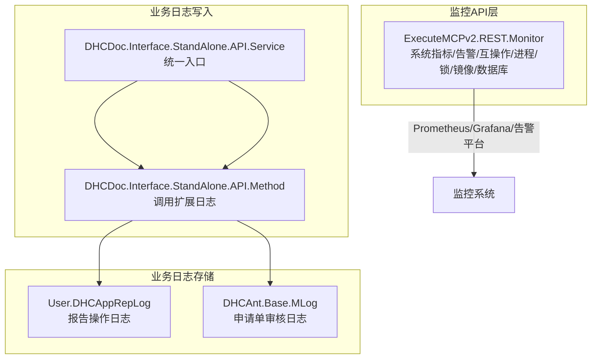
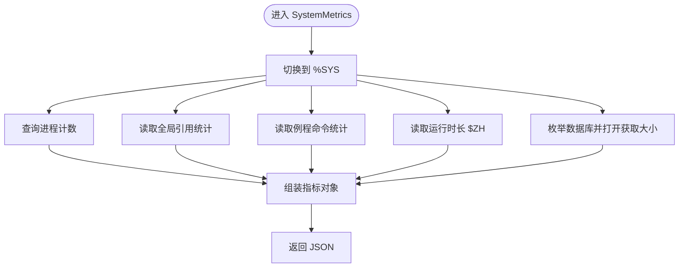
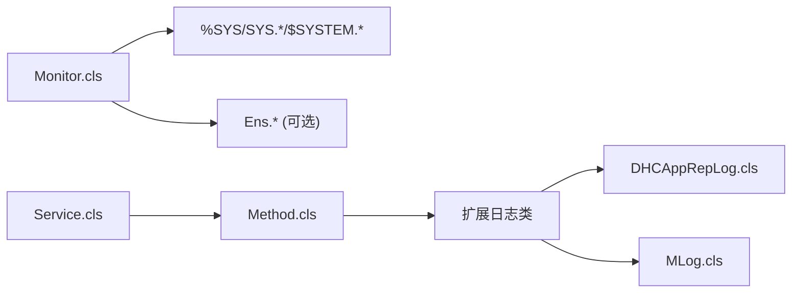

# 监控告警

<cite>
**本文引用的文件**
- [Monitor.cls](file://src/backend/public-mc/ExecuteMCPv2/REST/Monitor.cls)
- [Method.cls](file://src/backend/conting-ws/DHCDoc/Interface/StandAlone/API/Method.cls)
- [Service.cls](file://src/backend/conting-ws/DHCDoc/Interface/StandAlone/API/Service.cls)
- [DHCAppRepLog.cls](file://src/backend/doc-ws/User/DHCAppRepLog.cls)
- [MLog.cls](file://src/backend/doc-ws/DHCAnt/Base/MLog.cls)
</cite>

## 目录
1. [简介](#简介)
2. [项目结构](#项目结构)
3. [核心组件](#核心组件)
4. [架构总览](#架构总览)
5. [详细组件分析](#详细组件分析)
6. [依赖关系分析](#依赖关系分析)
7. [性能考虑](#性能考虑)
8. [故障排查指南](#故障排查指南)
9. [结论](#结论)
10. [附录](#附录)

## 简介
本文件为 IRIS HIS 系统的“监控告警配置”文档，面向运维与平台工程团队，说明系统如何采集系统性能指标、业务指标与用户行为数据，并基于内置 REST 接口输出标准化 JSON，便于接入 Prometheus/Grafana、日志系统与告警平台。文档同时给出告警规则建议、阈值与级别划分、日志收集与分析策略、仪表板配置建议与通知渠道设置，并提供常见场景的配置示例与调优建议。

## 项目结构
IRIS 后端通过 ExecuteMCPv2.REST.Monitor 暴露统一监控 API，覆盖系统级指标、活跃告警、互操作（Ens）指标、进程/锁/日志/镜像/数据库状态等；业务侧通过应急对接类写入扩展日志；各业务模块提供审计/操作日志实体用于行为追踪。



图表来源
- [Monitor.cls:1-126](file://src/backend/public-mc/ExecuteMCPv2/REST/Monitor.cls#L1-L126)
- [Service.cls:1-158](file://src/backend/conting-ws/DHCDoc/Interface/StandAlone/API/Service.cls#L1-L158)
- [Method.cls:1-95](file://src/backend/conting-ws/DHCDoc/Interface/StandAlone/API/Method.cls#L1-L95)
- [DHCAppRepLog.cls:1-123](file://src/backend/doc-ws/User/DHCAppRepLog.cls#L1-L123)
- [MLog.cls:1-81](file://src/backend/doc-ws/DHCAnt/Base/MLog.cls#L1-L81)

章节来源
- [Monitor.cls:1-126](file://src/backend/public-mc/ExecuteMCPv2/REST/Monitor.cls#L1-L126)
- [Service.cls:1-158](file://src/backend/conting-ws/DHCDoc/Interface/StandAlone/API/Service.cls#L1-L158)
- [Method.cls:1-95](file://src/backend/conting-ws/DHCDoc/Interface/StandAlone/API/Method.cls#L1-L95)
- [DHCAppRepLog.cls:1-123](file://src/backend/doc-ws/User/DHCAppRepLog.cls#L1-L123)
- [MLog.cls:1-81](file://src/backend/doc-ws/DHCAnt/Base/MLog.cls#L1-L81)

## 核心组件
- 系统监控 REST 处理器：提供系统指标、告警、互操作指标、进程列表、锁信息、镜像状态、审计事件、数据库检查与维护等操作。
- 应急对接日志写入：通过 Service 统一入口与 Method 实现，将终端异常与交互结果持久化到扩展日志表。
- 业务日志实体：报告操作日志与申请单审核日志，记录关键业务动作与责任人。

章节来源
- [Monitor.cls:1-126](file://src/backend/public-mc/ExecuteMCPv2/REST/Monitor.cls#L1-L126)
- [Service.cls:64-82](file://src/backend/conting-ws/DHCDoc/Interface/StandAlone/API/Service.cls#L64-L82)
- [Method.cls:47-57](file://src/backend/conting-ws/DHCDoc/Interface/StandAlone/API/Method.cls#L47-L57)
- [DHCAppRepLog.cls:1-123](file://src/backend/doc-ws/User/DHCAppRepLog.cls#L1-L123)
- [MLog.cls:1-81](file://src/backend/doc-ws/DHCAnt/Base/MLog.cls#L1-L81)

## 架构总览
IRIS 内部通过 %SYS 命名空间与 SYS.*、$SYSTEM.*、Config.* 等能力采集底层运行态数据；对外以 /api/executemcp/v2/monitor 系列端点输出 JSON。业务侧通过标准接口写入日志，供后续分析与审计。

```mermaid
sequenceDiagram
participant 客户端 as "监控客户端"
participant 监控API as "ExecuteMCPv2.REST.Monitor"
participant 系统NS as "%SYS"
participant 业务NS as "业务命名空间"
客户端->>监控API : GET /api/executemcp/v2/monitor/systemMetrics
监控API->>系统NS : SQL/Stats/$ZU 获取进程/全局引用/命令数/运行时长
系统NS-->>监控API : 指标JSON
监控API-->>客户端 : 200 OK + metrics
客户端->>监控API : GET /api/executemcp/v2/monitor/systemAlerts
监控API->>系统NS : $SYSTEM.Monitor.State/GetAlerts
系统NS-->>监控API : 告警状态与消息
监控API-->>客户端 : 200 OK + alerts
[REDACTED: environment-specific example]
监控API->>业务NS : Ens.* 查询队列/错误/生产状态
业务NS-->>监控API : 互操作指标
监控API-->>客户端 : 200 OK + namespaces[]
```

图表来源
- [Monitor.cls:18-126](file://src/backend/public-mc/ExecuteMCPv2/REST/Monitor.cls#L18-L126)
- [Monitor.cls:128-185](file://src/backend/public-mc/ExecuteMCPv2/REST/Monitor.cls#L128-L185)
- [Monitor.cls:187-258](file://src/backend/public-mc/ExecuteMCPv2/REST/Monitor.cls#L187-L258)

## 详细组件分析

### 系统指标采集（SystemMetrics）
- 采集项：进程数量、全局引用总数、例程命令总数、实例运行时长、数据库列表及大小。
- 数据来源：%SYS.ProcessQuery、SYS.Stats.Global/Routine、Config.Databases:List、SYS.Database。
- 输出：metrics 数组与 databases 数组。



图表来源
- [Monitor.cls:18-126](file://src/backend/public-mc/ExecuteMCPv2/REST/Monitor.cls#L18-L126)

章节来源
- [Monitor.cls:18-126](file://src/backend/public-mc/ExecuteMCPv2/REST/Monitor.cls#L18-L126)

### 系统告警（SystemAlerts）
- 采集项：系统健康状态、告警数量、告警消息列表、最近一次告警时间。
- 数据来源：$SYSTEM.Monitor.State()、$SYSTEM.Monitor.Alerts()、$SYSTEM.Monitor.GetAlerts()。

章节来源
- [Monitor.cls:128-185](file://src/backend/public-mc/ExecuteMCPv2/REST/Monitor.cls#L128-L185)

### 互操作指标（InteropMetrics）
- 采集项：指定或全部命名空间的 Production 状态、队列深度、过去24小时错误数与消息量。
- 数据来源：Ens.Director、Ens.MessageHeader、Ens_Util.Log。
- 支持跨命名空间汇总，避免在 ResultSet 迭代中切换命名空间。

章节来源
- [Monitor.cls:187-258](file://src/backend/public-mc/ExecuteMCPv2/REST/Monitor.cls#L187-L258)
- [Monitor.cls:532-604](file://src/backend/public-mc/ExecuteMCPv2/REST/Monitor.cls#L532-L604)

### 进程与锁（JobsList/LocksList）
- 进程：列出 PID、命名空间、例程、状态、用户名、IP、作业类型、执行命令数、全局引用、事务状态、CPU 时间。
- 锁：列出锁名、持有者 PID、模式、标志、计数。

章节来源
- [Monitor.cls:260-307](file://src/backend/public-mc/ExecuteMCPv2/REST/Monitor.cls#L260-L307)
- [Monitor.cls:309-362](file://src/backend/public-mc/ExecuteMCPv2/REST/Monitor.cls#L309-L362)

### 镜像与审计（MirrorStatus/AuditEvents）
- 镜像：是否成员、镜像名、成员类型、主备角色、异步成员、状态字符串。
- 审计：按时间范围、用户、事件类型过滤的审计事件列表，限制最大行数防止响应过大。

章节来源
- [Monitor.cls:409-461](file://src/backend/public-mc/ExecuteMCPv2/REST/Monitor.cls#L409-L461)
- [Monitor.cls:463-530](file://src/backend/public-mc/ExecuteMCPv2/REST/Monitor.cls#L463-L530)

### 数据库检查与维护（DatabaseCheck/DatabaseAction）
- 检查：数据库挂载/只读/加密/日志状态/大小。
- 维护：mount/dismount/compact/defragment/truncate/expandVolume，带参数校验与存在性守卫，同步执行。

章节来源
- [Monitor.cls:606-681](file://src/backend/public-mc/ExecuteMCPv2/REST/Monitor.cls#L606-L681)
- [Monitor.cls:683-800](file://src/backend/public-mc/ExecuteMCPv2/REST/Monitor.cls#L683-L800)

### 应急对接日志写入（Service/Method）
- 入口：Service.SynData/SaveExpLog/CheckIsValid/MacRegister 等统一封装。
- 实现：Method.SaveExpLog 调用扩展日志类保存终端异常与状态。
- 用途：用于第三方系统对接过程中的可观测性与问题定位。

章节来源
- [Service.cls:64-82](file://src/backend/conting-ws/DHCDoc/Interface/StandAlone/API/Service.cls#L64-L82)
- [Method.cls:47-57](file://src/backend/conting-ws/DHCDoc/Interface/StandAlone/API/Method.cls#L47-L57)

### 业务日志实体（DHCAppRepLog/MLog）
- DHCAppRepLog：报告相关操作日志，包含类型、医嘱关联、操作员、状态、时间、原因、设备、病理号等。
- MLog：申请单审核日志，包含审核类型、时间、操作人、科室、值、申请表、备注、名称等，并提供索引优化查询。

章节来源
- [DHCAppRepLog.cls:1-123](file://src/backend/doc-ws/User/DHCAppRepLog.cls#L1-L123)
- [MLog.cls:1-81](file://src/backend/doc-ws/DHCAnt/Base/MLog.cls#L1-L81)

## 依赖关系分析
- Monitor 对 %SYS 命名空间与 SYS.*/$SYSTEM.* 强依赖，用于系统级观测。
- InteropMetrics 对 Ens.* 表与类有选择性依赖，不存在时优雅降级。
- 业务日志写入链路：Service -> Method -> 扩展日志类 -> 业务日志表。
- 业务日志实体通过 SQLMap 与 Global 映射，提供高效检索。



图表来源
- [Monitor.cls:18-258](file://src/backend/public-mc/ExecuteMCPv2/REST/Monitor.cls#L18-L258)
- [Service.cls:64-82](file://src/backend/conting-ws/DHCDoc/Interface/StandAlone/API/Service.cls#L64-L82)
- [Method.cls:47-57](file://src/backend/conting-ws/DHCDoc/Interface/StandAlone/API/Method.cls#L47-L57)
- [DHCAppRepLog.cls:1-123](file://src/backend/doc-ws/User/DHCAppRepLog.cls#L1-L123)
- [MLog.cls:1-81](file://src/backend/doc-ws/DHCAnt/Base/MLog.cls#L1-L81)

章节来源
- [Monitor.cls:18-258](file://src/backend/public-mc/ExecuteMCPv2/REST/Monitor.cls#L18-L258)
- [Service.cls:64-82](file://src/backend/conting-ws/DHCDoc/Interface/StandAlone/API/Service.cls#L64-L82)
- [Method.cls:47-57](file://src/backend/conting-ws/DHCDoc/Interface/StandAlone/API/Method.cls#L47-L57)
- [DHCAppRepLog.cls:1-123](file://src/backend/doc-ws/User/DHCAppRepLog.cls#L1-L123)
- [MLog.cls:1-81](file://src/backend/doc-ws/DHCAnt/Base/MLog.cls#L1-L81)

## 性能考虑
- 指标采样频率：建议 15–60 秒，避免高频访问导致额外开销。
- 数据库维护操作：compact/defragment/truncate 为同步阻塞，建议在低峰期执行并控制参数。
- 审计事件查询：使用 maxRows 限制返回条数，结合 beginDate/endDate 缩小范围。
- 互操作指标：跨命名空间汇总时先收集命名空间列表再逐一查询，避免在游标迭代中切换命名空间。
- 日志写入：批量或异步化（若业务允许），减少主路径阻塞。

[本节为通用指导，不直接分析具体文件]

## 故障排查指南
- 系统告警：通过 systemAlerts 获取 state/stateText/alertCount/alerts，快速判断 Hung/Warning/Alert。
- 进程与锁：通过 jobsList/locksList 定位长事务、高 CPU、锁竞争。
- 数据库：通过 databaseCheck 查看挂载/只读/加密/日志状态/大小；必要时执行 databaseAction 进行维护。
- 互操作：通过 interopMetrics 观察队列深度与错误数，定位生产体或通道异常。
- 审计：通过 auditEvents 按用户/事件类型/时间范围回溯操作轨迹。
- 应急对接：通过 SaveExpLog 写入的扩展日志定位终端异常与交互失败原因。

章节来源
- [Monitor.cls:128-185](file://src/backend/public-mc/ExecuteMCPv2/REST/Monitor.cls#L128-L185)
- [Monitor.cls:260-362](file://src/backend/public-mc/ExecuteMCPv2/REST/Monitor.cls#L260-L362)
- [Monitor.cls:606-800](file://src/backend/public-mc/ExecuteMCPv2/REST/Monitor.cls#L606-L800)
- [Monitor.cls:463-530](file://src/backend/public-mc/ExecuteMCPv2/REST/Monitor.cls#L463-L530)
- [Service.cls:64-82](file://src/backend/conting-ws/DHCDoc/Interface/StandAlone/API/Service.cls#L64-L82)
- [Method.cls:47-57](file://src/backend/conting-ws/DHCDoc/Interface/StandAlone/API/Method.cls#L47-L57)

## 结论
IRIS HIS 通过统一的监控 REST 接口提供了系统级、互操作级与数据库级的可观测能力，并结合业务日志实体完善用户行为与关键操作的审计。配合合理的采集频率、告警规则与日志策略，可实现从基础设施到业务流程的全栈监控与快速排障。

[本节为总结性内容，不直接分析具体文件]

## 附录

### 监控指标与告警规则建议
- 系统性能指标
  - iris_process_count：当前进程数。阈值建议：超过预期基线 1.5–2 倍持续 5 分钟触发 Warning，持续 10 分钟触发 Alert。
  - iris_global_references_total：全局引用累计。趋势突增可能表示内存压力或热点访问，建议环比增长 > 20%/5min 触发 Warning。
  - iris_routine_commands_total：例程命令累计。突发飙升提示潜在死循环或重入，建议环比增长 > 30%/5min 触发 Warning。
  - iris_uptime_seconds：实例运行时长。长时间未重启且伴随其他指标异常时，建议结合变更窗口评估重启必要性。
- 业务指标（互操作）
  - queueDepth：队列深度。> 基线 2 倍持续 10 分钟触发 Warning，> 基线 3 倍持续 15 分钟触发 Alert。
  - errorCount24h：过去 24 小时错误数。> 基线 2 倍触发 Warning，> 基线 3 倍触发 Alert。
  - messageCount24h：过去 24 小时消息量。异常下降可能表示上游中断，需结合 queueDepth 综合判断。
- 用户行为监控
  - 审计事件：登录失败率、敏感操作频次、非工作时间操作占比。建议设置阈值与白名单，异常波动触发告警。
- 日志策略
  - 错误日志：集中采集 Ens_Util.Log Type=3 的错误条目，结合时间窗口聚合。
  - 性能日志：关注慢查询与长事务，结合 jobsList 中的 cpuTime/globalReferences 字段。
  - 业务日志：DHCAppRepLog 与 MLog 作为关键操作审计源，建立报表与异常模式匹配。

[本节为通用指导，不直接分析具体文件]

### 日志收集与分析方法
- 错误日志：通过 interopMetrics 的 errorCount24h 与 Ens_Util.Log 查询，结合时间范围与关键字筛选。
- 性能日志：通过 jobsList 与 locksList 识别瓶颈，结合数据库维护操作优化。
- 业务日志：基于 DHCAppRepLog 与 MLog 的索引字段（如 AR_Type、AR_Pointer、MApplyDR、MType）构建查询视图与报表。

章节来源
- [Monitor.cls:187-258](file://src/backend/public-mc/ExecuteMCPv2/REST/Monitor.cls#L187-L258)
- [Monitor.cls:260-362](file://src/backend/public-mc/ExecuteMCPv2/REST/Monitor.cls#L260-L362)
- [DHCAppRepLog.cls:1-123](file://src/backend/doc-ws/User/DHCAppRepLog.cls#L1-L123)
- [MLog.cls:1-81](file://src/backend/doc-ws/DHCAnt/Base/MLog.cls#L1-L81)

### 监控仪表板配置建议
- 系统概览：进程数、全局引用、例程命令、运行时长、数据库大小与挂载状态。
- 互操作看板：Production 状态、队列深度、错误数、消息量趋势。
- 资源与健康：镜像成员状态、审计事件分布、锁竞争热点。
- 告警面板：当前告警列表、最近告警时间、告警分类统计。

[本节为通用指导，不直接分析具体文件]

### 告警通知渠道设置
- 推荐渠道：企业微信/钉钉机器人、邮件、短信、电话语音（严重）。
- 分级策略：Warning 通知值班群，Alert 升级至负责人并触发电话；P0 立即电话+短信。
- 去重与抑制：同一指标短时间重复告警合并，维护窗口期抑制非关键告警。

[本节为通用指导，不直接分析具体文件]

### 常见监控场景配置示例
- 场景一：队列积压
  - 指标：queueDepth > 基线 2 倍持续 10 分钟 → Warning；> 基线 3 倍持续 15 分钟 → Alert。
  - 联动：检查 productionState、errorCount24h、auditEvents 中相关错误。
- 场景二：数据库膨胀
  - 指标：sizeMB 接近 maxSizeMB 或增长速率异常 → Warning；达到阈值 → Alert。
  - 联动：执行 databaseCheck 确认挂载/日志状态，必要时安排 compact/defragment。
- 场景三：长事务与锁竞争
  - 指标：jobsList 中 cpuTime/globalReferences 异常高；locksList 中出现长持有锁。
  - 联动：定位 Routine/UserName，结合审计事件回溯操作。

[本节为通用指导，不直接分析具体文件]

### 调优建议
- 合理设置采集间隔与缓存，降低监控自身开销。
- 对高频查询建立索引（如 DHCAppRepLog 的 IndexTypePointer、MLog 的 Apply/ApplyType）。
- 对大库维护操作选择低峰期，分批执行并监控进度。
- 对互操作通道增加重试与限流，减少抖动导致的误报。

[本节为通用指导，不直接分析具体文件]