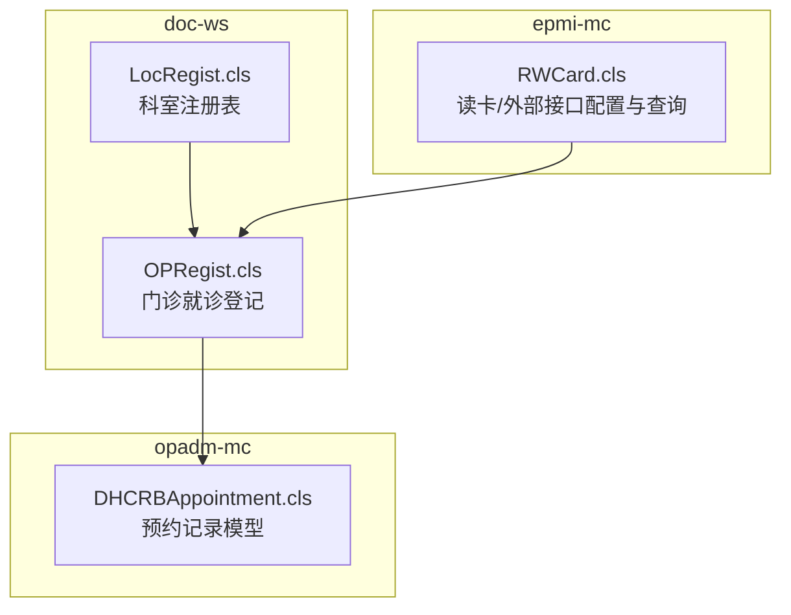
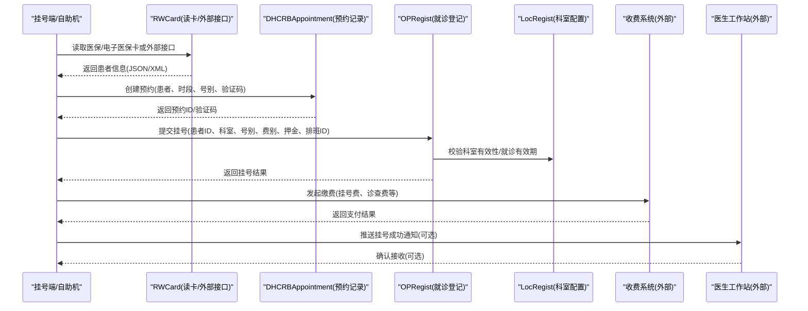
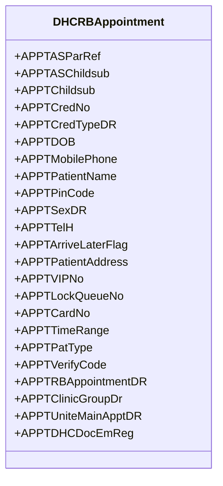
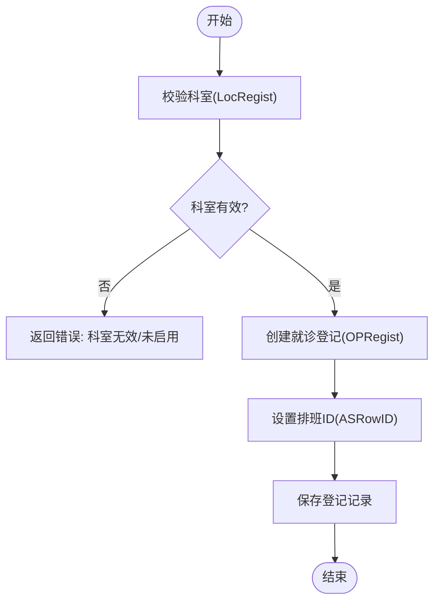
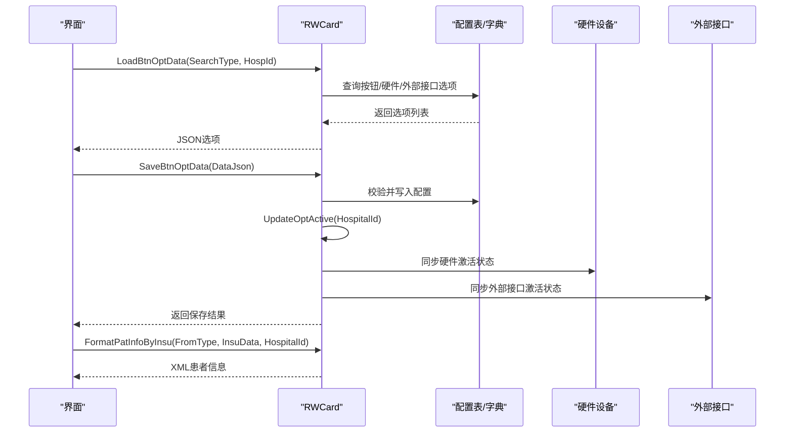
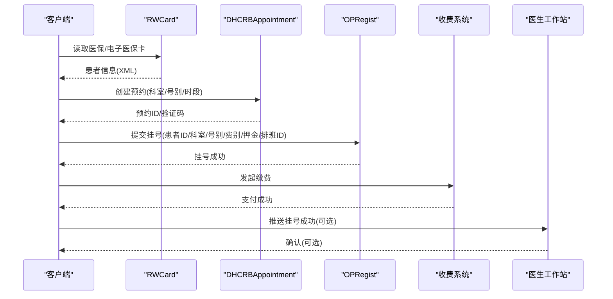
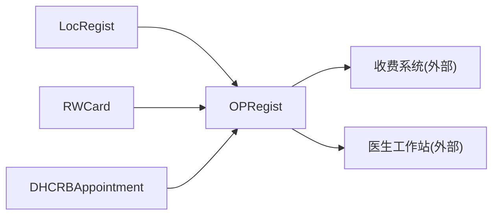

# 门诊挂号接口

<cite>
**本文引用的文件**
- [OPRegist.cls](file://src/backend/doc-ws/CF/DOC/HD/OPRegist.cls)
- [LocRegist.cls](file://src/backend/doc-ws/CF/DOC/HD/LocRegist.cls)
- [RWCard.cls](file://src/backend/epmi-mc/DHCDoc/Reg/RWCard.cls)
- [DHCRBAppointment.cls](file://src/backend/opadm-mc/User/DHCRBAppointment.cls)
</cite>

## 目录
1. [简介](#简介)
2. [项目结构](#项目结构)
3. [核心组件](#核心组件)
4. [架构总览](#架构总览)
5. [详细组件分析](#详细组件分析)
6. [依赖关系分析](#依赖关系分析)
7. [性能考虑](#性能考虑)
8. [故障排查指南](#故障排查指南)
9. [结论](#结论)
10. [附录](#附录)

## 简介
本文件面向“门诊挂号系统Web服务接口”的集成与使用，聚焦预约管理、排班管理、挂号流程等核心能力。文档基于代码库中的关键类与配置，梳理预约挂号、号源管理、挂号确认、退号处理等业务逻辑的接口规范，并说明医生排班配置、号段管理、挂号费用计算等功能的实现要点。同时提供挂号员在典型工作流中的API调用示例，以及与收费系统和医生工作站的集成方式说明。

## 项目结构
本项目后端按业务域划分多个子系统：
- doc-ws：医生站相关数据模型与业务（含门诊挂号相关实体）
- epmi-mc：患者主索引与读卡/外部接口能力（含读卡按钮配置、硬件设备与外部接口联动）
- opadm-mc：运营管理与预约核心数据模型（预约记录、资源关联等）

图表来源
- [OPRegist.cls:1-137](file://src/backend/doc-ws/CF/DOC/HD/OPRegist.cls#L1-L137)
- [LocRegist.cls:1-73](file://src/backend/doc-ws/CF/DOC/HD/LocRegist.cls#L1-L73)
- [RWCard.cls:1-800](file://src/backend/epmi-mc/DHCDoc/Reg/RWCard.cls#L1-L800)
- [DHCRBAppointment.cls:1-424](file://src/backend/opadm-mc/User/DHCRBAppointment.cls#L1-L424)

章节来源
- [OPRegist.cls:1-137](file://src/backend/doc-ws/CF/DOC/HD/OPRegist.cls#L1-L137)
- [LocRegist.cls:1-73](file://src/backend/doc-ws/CF/DOC/HD/LocRegist.cls#L1-L73)
- [RWCard.cls:1-800](file://src/backend/epmi-mc/DHCDoc/Reg/RWCard.cls#L1-L800)
- [DHCRBAppointment.cls:1-424](file://src/backend/opadm-mc/User/DHCRBAppointment.cls#L1-L424)

## 核心组件
- 门诊就诊登记（OPRegist）：承载患者ID、就诊ID、就诊科室、号别、费别、押金、状态、医院、排班ID等字段，用于记录一次门诊就诊登记信息。
- 科室注册表（LocRegist）：维护科室基础信息与就诊有效天数、押金结算标志、院区关联、启用状态等。
- 读卡与外部接口配置（RWCard）：提供读卡按钮配置加载、保存、删除、激活同步；支持硬件设备与外部接口的选择与联动；提供医保/电子医保卡患者信息格式化输出。
- 预约记录（DHCRBAppointment）：存储预约的核心字段，包括患者基本信息、联系方式、验证码、时段、号别、联合门诊主号别关联、急诊预检分级等，并提供多种索引以支撑查询。

章节来源
- [OPRegist.cls:1-137](file://src/backend/doc-ws/CF/DOC/HD/OPRegist.cls#L1-L137)
- [LocRegist.cls:1-73](file://src/backend/doc-ws/CF/DOC/HD/LocRegist.cls#L1-L73)
- [RWCard.cls:1-800](file://src/backend/epmi-mc/DHCDoc/Reg/RWCard.cls#L1-L800)
- [DHCRBAppointment.cls:1-424](file://src/backend/opadm-mc/User/DHCRBAppointment.cls#L1-L424)

## 架构总览
挂号业务流程涉及“预约—号源—登记—收费—工作站”的多环节协同。以下序列图展示从预约到挂号确认的关键调用链路与数据流转。

图表来源
- [RWCard.cls:1-800](file://src/backend/epmi-mc/DHCDoc/Reg/RWCard.cls#L1-L800)
- [DHCRBAppointment.cls:1-424](file://src/backend/opadm-mc/User/DHCRBAppointment.cls#L1-L424)
- [OPRegist.cls:1-137](file://src/backend/doc-ws/CF/DOC/HD/OPRegist.cls#L1-L137)
- [LocRegist.cls:1-73](file://src/backend/doc-ws/CF/DOC/HD/LocRegist.cls#L1-L73)

## 详细组件分析

### 预约记录模型（DHCRBAppointment）
- 职责：持久化预约信息，支撑预约查询、取号、改约、退号等流程。
- 关键字段：
  - 患者标识：姓名、性别、出生日期、证件号、手机号、家庭住址、VIP号、预约卡号
  - 预约信息：时段串、验证码、替诊前预约ID、联合门诊主号别关联、急诊预检分级ID
  - 资源关联：资源父引用、子序号、亚专业
- 索引：提供按证件号、手机号、电话、急诊预检、联合主号别、VIP号的快速检索能力。

图表来源
- [DHCRBAppointment.cls:1-424](file://src/backend/opadm-mc/User/DHCRBAppointment.cls#L1-L424)

章节来源
- [DHCRBAppointment.cls:1-424](file://src/backend/opadm-mc/User/DHCRBAppointment.cls#L1-L424)

### 门诊就诊登记（OPRegist）
- 职责：记录一次门诊就诊登记，包含患者ID、就诊ID、就诊科室、号别、费别、押金、状态、医院、最后更新人/时间、创建人/时间、排班ID等。
- 关键点：
  - 通过ASRowID关联排班，便于后续号源核销与统计。
  - 通过CTLoc关联科室，结合LocRegist进行有效性校验。
  - 通过BillType区分费别，影响费用计算与结算策略。

图表来源
- [OPRegist.cls:1-137](file://src/backend/doc-ws/CF/DOC/HD/OPRegist.cls#L1-L137)
- [LocRegist.cls:1-73](file://src/backend/doc-ws/CF/DOC/HD/LocRegist.cls#L1-L73)

章节来源
- [OPRegist.cls:1-137](file://src/backend/doc-ws/CF/DOC/HD/OPRegist.cls#L1-L137)
- [LocRegist.cls:1-73](file://src/backend/doc-ws/CF/DOC/HD/LocRegist.cls#L1-L73)

### 读卡与外部接口配置（RWCard）
- 职责：
  - 加载与维护“读卡按钮配置”，支持按院区、卡类型筛选。
  - 管理硬件设备与外部接口的选择与激活状态同步。
  - 将医保/电子医保卡数据格式化为标准XML供上游使用。
- 主要方法：
  - LoadBtnOptData：根据检索类型加载按钮/硬件/外部接口选项。
  - SaveBtnOptData：保存配置并进行一致性校验与事务提交。
  - UpdateOptActive：按院区同步按钮、硬件、插件、外部接口的激活状态。
  - GetCardHardOutData：根据按钮+卡类型获取硬件与外部接口详情。
  - FormatPatInfoByInsu：将医保/电子医保卡数据转换为XML格式的患者信息。

图表来源
- [RWCard.cls:1-800](file://src/backend/epmi-mc/DHCDoc/Reg/RWCard.cls#L1-L800)

章节来源
- [RWCard.cls:1-800](file://src/backend/epmi-mc/DHCDoc/Reg/RWCard.cls#L1-L800)

### 挂号流程（端到端）
- 步骤概览：
  1) 读取患者身份（医保/电子医保卡或外部接口），得到标准化患者信息。
  2) 创建预约（选择科室、号别、时段），生成验证码与预约ID。
  3) 执行挂号（登记就诊信息，关联排班ID）。
  4) 发起收费（挂号费、诊查费等），完成支付。
  5) 通知医生工作站（可选），进入候诊队列。

图表来源
- [RWCard.cls:1-800](file://src/backend/epmi-mc/DHCDoc/Reg/RWCard.cls#L1-L800)
- [DHCRBAppointment.cls:1-424](file://src/backend/opadm-mc/User/DHCRBAppointment.cls#L1-L424)
- [OPRegist.cls:1-137](file://src/backend/doc-ws/CF/DOC/HD/OPRegist.cls#L1-L137)

章节来源
- [RWCard.cls:1-800](file://src/backend/epmi-mc/DHCDoc/Reg/RWCard.cls#L1-L800)
- [DHCRBAppointment.cls:1-424](file://src/backend/opadm-mc/User/DHCRBAppointment.cls#L1-L424)
- [OPRegist.cls:1-137](file://src/backend/doc-ws/CF/DOC/HD/OPRegist.cls#L1-L137)

## 依赖关系分析
- OPRegist依赖LocRegist进行科室有效性校验。
- RWCard依赖配置表与字典，驱动硬件设备与外部接口的选择与激活。
- DHCRBAppointment作为预约核心模型，被挂号流程调用以创建、查询、修改、取消预约。
- 挂号流程中，OPRegist与DHCRBAppointment共同构成“预约—登记”闭环，并与外部系统（收费、工作站）交互。

图表来源
- [LocRegist.cls:1-73](file://src/backend/doc-ws/CF/DOC/HD/LocRegist.cls#L1-L73)
- [OPRegist.cls:1-137](file://src/backend/doc-ws/CF/DOC/HD/OPRegist.cls#L1-L137)
- [RWCard.cls:1-800](file://src/backend/epmi-mc/DHCDoc/Reg/RWCard.cls#L1-L800)
- [DHCRBAppointment.cls:1-424](file://src/backend/opadm-mc/User/DHCRBAppointment.cls#L1-L424)

章节来源
- [LocRegist.cls:1-73](file://src/backend/doc-ws/CF/DOC/HD/LocRegist.cls#L1-L73)
- [OPRegist.cls:1-137](file://src/backend/doc-ws/CF/DOC/HD/OPRegist.cls#L1-L137)
- [RWCard.cls:1-800](file://src/backend/epmi-mc/DHCDoc/Reg/RWCard.cls#L1-L800)
- [DHCRBAppointment.cls:1-424](file://src/backend/opadm-mc/User/DHCRBAppointment.cls#L1-L424)

## 性能考虑
- 索引优化：DHCRBAppointment提供多列索引（证件号、手机号、电话、急诊预检、联合主号别、VIP号），建议在高并发查询场景优先使用这些索引以减少全表扫描。
- 批量操作：在初始化或批量激活硬件/外部接口时，RWCard采用动态SQL批量更新，注意控制单次批大小以避免锁竞争。
- 缓存与字典：RWCard在加载选项时访问字典表，建议在高频查询路径上增加本地缓存或预热机制。
- 事务边界：SaveBtnOptData与UpdateOptActive使用事务保证一致性，需合理拆分长事务以降低锁持有时间。

[本节为通用性能建议，不直接分析具体文件]

## 故障排查指南
- 读卡按钮配置冲突：当保存读卡按钮配置时，若同一卡类型+院区下已存在相同按钮，会返回重复提示。应检查配置唯一性约束。
- 硬件设备与外部接口联动：若选择了卡介质但未选择硬件设备，或硬件设备为空且外部接口也为空，将触发校验失败。需确保至少选择其一。
- 激活状态不同步：保存或删除配置后，需调用激活同步方法以确保按钮、硬件、插件、外部接口的激活状态一致。如出现异常，检查动态SQL执行结果与回滚日志。
- 医保数据格式化：FormatPatInfoByInsu对性别、证件类型、民族、卡类型等进行映射转换，若返回数据异常，检查字典映射与输入数据完整性。

章节来源
- [RWCard.cls:1-800](file://src/backend/epmi-mc/DHCDoc/Reg/RWCard.cls#L1-L800)

## 结论
本接口文档基于代码库中的核心类，梳理了门诊挂号系统的预约、登记、读卡与外部接口配置等关键环节。通过明确的模型定义与流程编排，可实现从患者身份识别到挂号确认的完整闭环，并支持与收费系统与医生工作站的集成。实际对接时，请结合本院区的配置与字典映射，完善号段管理、费用计算与退号处理等扩展功能。

[本节为总结性内容，不直接分析具体文件]

## 附录

### API参考（基于现有类的可调用能力）
- 读卡与外部接口
  - 加载选项：LoadBtnOptData(SearchType, HospId) → 返回JSON选项列表
  - 保存配置：SaveBtnOptData(DataJson) → 返回保存结果（含错误码）
  - 删除配置：DeleteBtnOptData(CfgRowid) → 返回删除结果
  - 激活同步：UpdateOptActive(HospitalId) → 返回激活结果
  - 获取详情：GetCardHardOutData(ReadBtnId, CardType, HospitalId, LinkType, HardOutDR) → 返回硬件与外部接口详情
  - 全部按钮信息：GetAllBtnData(CardType, ForceAble, HospitalId) → 返回按钮可用状态
  - 患者信息格式化：FormatPatInfoByInsu(FromType, InsuData, HospitalId) → 返回XML患者信息

- 预约与登记
  - 预约记录：通过DHCRBAppointment创建、查询、修改、取消预约（字段见模型）
  - 就诊登记：通过OPRegist创建登记记录，关联科室与排班ID
  - 科室校验：通过LocRegist校验科室有效性、就诊有效期与启用状态

章节来源
- [RWCard.cls:1-800](file://src/backend/epmi-mc/DHCDoc/Reg/RWCard.cls#L1-L800)
- [DHCRBAppointment.cls:1-424](file://src/backend/opadm-mc/User/DHCRBAppointment.cls#L1-L424)
- [OPRegist.cls:1-137](file://src/backend/doc-ws/CF/DOC/HD/OPRegist.cls#L1-L137)
- [LocRegist.cls:1-73](file://src/backend/doc-ws/CF/DOC/HD/LocRegist.cls#L1-L73)