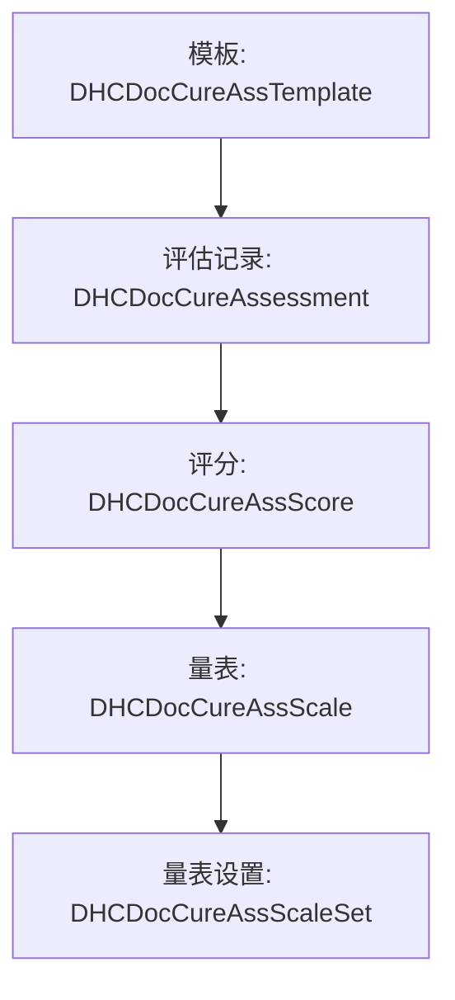
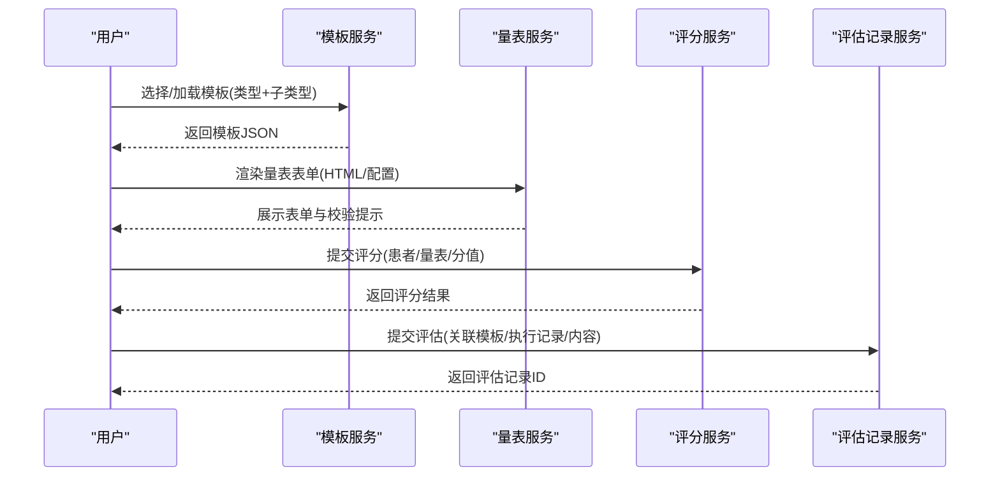
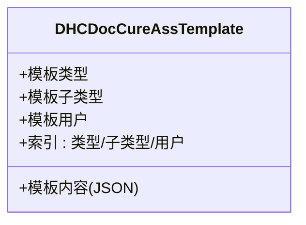
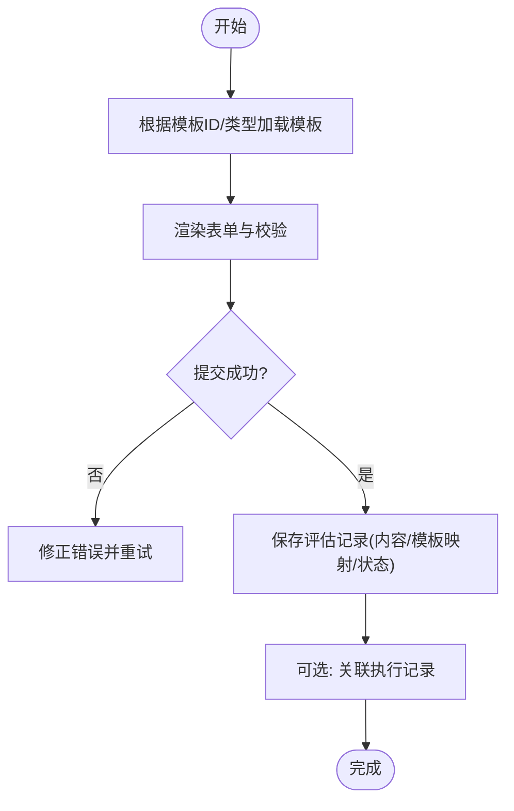
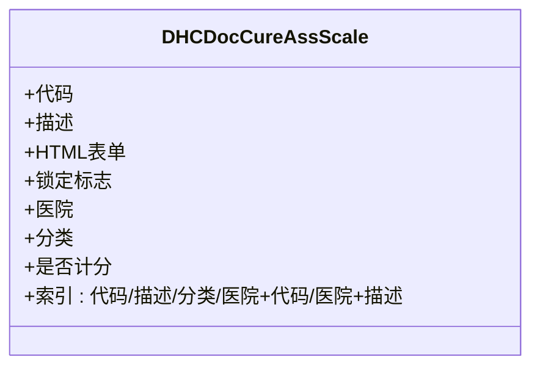
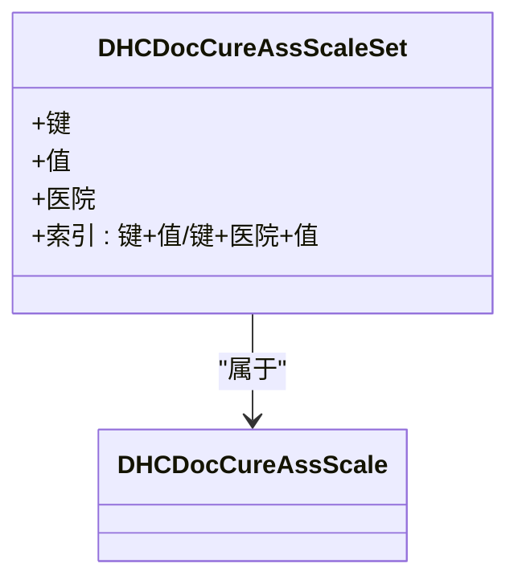
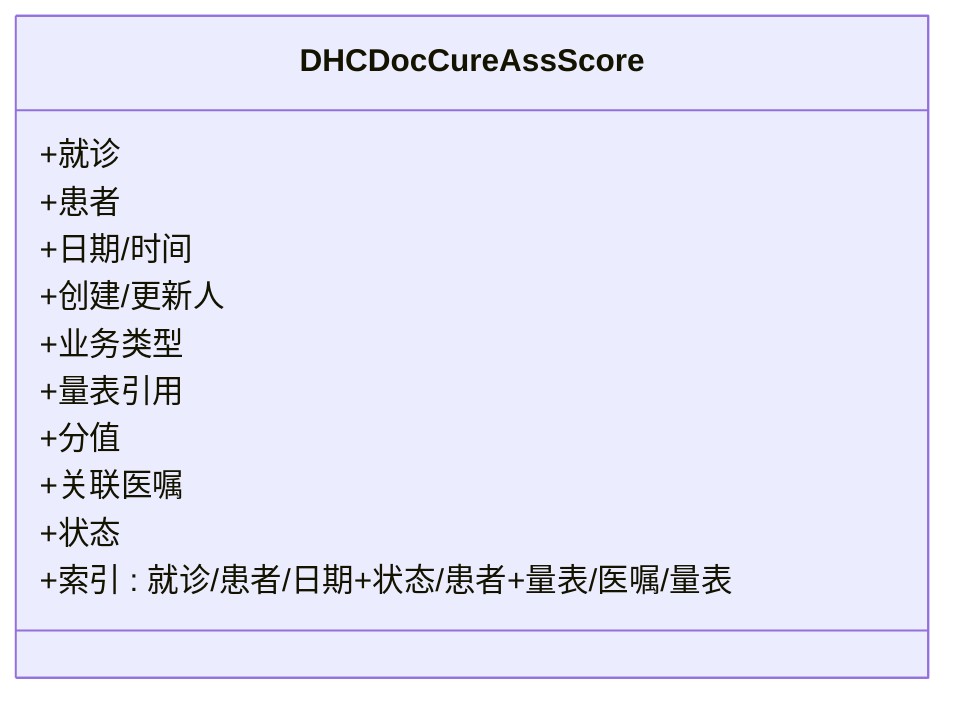
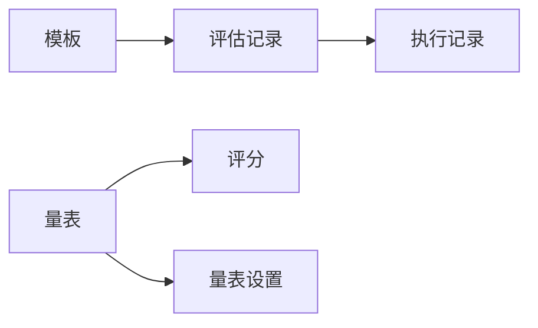

# 评估量表管理

<cite>
**本文引用的文件**
- [DHCDocCureAssTemplate.cls](file://src/backend/cure-ws/User/DHCDocCureAssTemplate.cls)
- [DHCDocCureAssessment.cls](file://src/backend/cure-ws/User/DHCDocCureAssessment.cls)
- [DHCDocCureAssScale.cls](file://src/backend/cure-ws/User/DHCDocCureAssScale.cls)
- [DHCDocCureAssScore.cls](file://src/backend/cure-ws/User/DHCDocCureAssScore.cls)
- [DHCDocCureAssScaleSet.cls](file://src/backend/cure-ws/User/DHCDocCureAssScaleSet.cls)
</cite>

## 目录
1. [简介](#简介)
2. [项目结构](#项目结构)
3. [核心组件](#核心组件)
4. [架构总览](#架构总览)
5. [详细组件分析](#详细组件分析)
6. [依赖关系分析](#依赖关系分析)
7. [性能考虑](#性能考虑)
8. [故障排查指南](#故障排查指南)
9. [结论](#结论)
10. [附录：API与前端使用指南](#附录api与前端使用指南)

## 简介
本文件面向“评估量表管理”功能，系统化说明评估模板定义、量表配置、评分标准设置等核心能力；重点解析 DHCDocCureAssTemplate（评估模板）与 DHCDocCureAssessment（评估记录）的实现细节，涵盖量表的创建、版本管理与动态加载机制；并说明评估量表的类型分类、字段定义、验证规则与计算逻辑；同时给出评估结果的数据结构、存储方式、统计分析思路，以及权限控制、数据安全与隐私保护措施建议。最后提供API接口规范与前端配置界面使用指南，并总结常见问题与解决方案。

## 项目结构
评估量表相关后端实体集中在 cure-ws 的 User 命名空间下，采用 InterSystems Caché/IRIS 类持久化模型，配合 SQL 存储策略与全局索引，支撑模板、量表、评分与评估记录的完整生命周期管理。

图表来源
- [DHCDocCureAssTemplate.cls:1-97](file://src/backend/cure-ws/User/DHCDocCureAssTemplate.cls#L1-L97)
- [DHCDocCureAssessment.cls:1-164](file://src/backend/cure-ws/User/DHCDocCureAssessment.cls#L1-L164)
- [DHCDocCureAssScale.cls:1-96](file://src/backend/cure-ws/User/DHCDocCureAssScale.cls#L1-L96)
- [DHCDocCureAssScore.cls:1-103](file://src/backend/cure-ws/User/DHCDocCureAssScore.cls#L1-L103)
- [DHCDocCureAssScaleSet.cls:1-45](file://src/backend/cure-ws/User/DHCDocCureAssScaleSet.cls#L1-L45)

章节来源
- [DHCDocCureAssTemplate.cls:1-97](file://src/backend/cure-ws/User/DHCDocCureAssTemplate.cls#L1-L97)
- [DHCDocCureAssessment.cls:1-164](file://src/backend/cure-ws/User/DHCDocCureAssessment.cls#L1-L164)
- [DHCDocCureAssScale.cls:1-96](file://src/backend/cure-ws/User/DHCDocCureAssScale.cls#L1-L96)
- [DHCDocCureAssScore.cls:1-103](file://src/backend/cure-ws/User/DHCDocCureAssScore.cls#L1-L103)
- [DHCDocCureAssScaleSet.cls:1-45](file://src/backend/cure-ws/User/DHCDocCureAssScaleSet.cls#L1-L45)

## 核心组件
- 评估模板（DHCDocCureAssTemplate）：按类型保存评估模板内容，支持模板类型、子类型、JSON 模板串、归属医生等维度，便于多场景复用与版本化管理。
- 评估记录（DHCDocCureAssessment）：承载一次评估实例，包含创建/更新时间、提交状态、有效性标记、关联执行记录、模板映射ID与数据源类型等。
- 量表（DHCDocCureAssScale）：定义可复用的评估表单与元数据，包括代码、描述、HTML 表单、是否计分、激活/锁定标志、医院范围与分类等。
- 量表设置（DHCDocCureAssScaleSet）：量表级键值对扩展配置，支持按医院维度覆盖默认值。
- 评分（DHCDocCureAssScore）：记录患者维度的评分结果，含日期时间、创建人、业务来源、量表引用、分值、关联医嘱、状态与更新人等。

章节来源
- [DHCDocCureAssTemplate.cls:1-97](file://src/backend/cure-ws/User/DHCDocCureAssTemplate.cls#L1-L97)
- [DHCDocCureAssessment.cls:1-164](file://src/backend/cure-ws/User/DHCDocCureAssessment.cls#L1-L164)
- [DHCDocCureAssScale.cls:1-96](file://src/backend/cure-ws/User/DHCDocCureAssScale.cls#L1-L96)
- [DHCDocCureAssScaleSet.cls:1-45](file://src/backend/cure-ws/User/DHCDocCureAssScaleSet.cls#L1-L45)
- [DHCDocCureAssScore.cls:1-103](file://src/backend/cure-ws/User/DHCDocCureAssScore.cls#L1-L103)

## 架构总览
评估量表管理的整体流程围绕“模板—量表—评分—评估记录”展开：
- 模板层：以 JSON 形式定义表单结构与校验规则，按类型/子类型组织，支持医生个人模板与共享模板。
- 量表层：将具体量表定义为可复用单元，绑定 HTML 表单与计分开关，支持医院级配置覆盖。
- 评分层：在患者维度生成评分记录，支持未完成/取消/已完成状态流转。
- 评估记录层：将一次评估过程打包为记录，关联模板映射信息、执行记录与内容快照。

图表来源
- [DHCDocCureAssTemplate.cls:1-97](file://src/backend/cure-ws/User/DHCDocCureAssTemplate.cls#L1-L97)
- [DHCDocCureAssScale.cls:1-96](file://src/backend/cure-ws/User/DHCDocCureAssScale.cls#L1-L96)
- [DHCDocCureAssScore.cls:1-103](file://src/backend/cure-ws/User/DHCDocCureAssScore.cls#L1-L103)
- [DHCDocCureAssessment.cls:1-164](file://src/backend/cure-ws/User/DHCDocCureAssessment.cls#L1-L164)

## 详细组件分析

### 评估模板（DHCDocCureAssTemplate）
- 作用：按类型与子类型组织评估模板，模板内容为 JSON 字符串，便于前端动态渲染表单与校验。
- 关键属性
  - 模板类型：用于区分不同业务场景的模板族。
  - 模板子类型：如正常治疗、改善治疗、无效果、异常治疗等细分场景。
  - 模板内容：JSON 字符串，承载字段定义、校验规则、显示配置等。
  - 模板用户：支持医生个人模板或团队共享模板。
- 存储与索引
  - 使用 SQL 存储策略，主键自增，流式存储大字段。
  - 建立基于“类型-子类型-行ID”的索引，以及“用户-类型-子类型-行ID”的用户维度索引，提升查询效率。
- 版本管理建议
  - 通过“类型+子类型+用户”组合定位模板，新增版本时递增行ID，保留历史版本以便回溯。
  - 建议在应用层维护版本号字段，或在 JSON 中嵌入版本标识。

图表来源
- [DHCDocCureAssTemplate.cls:1-97](file://src/backend/cure-ws/User/DHCDocCureAssTemplate.cls#L1-L97)

章节来源
- [DHCDocCureAssTemplate.cls:1-97](file://src/backend/cure-ws/User/DHCDocCureAssTemplate.cls#L1-L97)

### 评估记录（DHCDocCureAssessment）
- 作用：记录一次评估的完整上下文，包括创建/更新时间、提交状态、有效性、模板映射信息与内容快照。
- 关键属性
  - 父级关联：与治疗申请（DHCDocCureApp）建立父子关系，便于追溯业务上下文。
  - 子序号：用于同一父级下的多条评估排序与唯一性。
  - 创建/更新信息：记录人与时间戳，支持审计追踪。
  - 评估内容：文本内容与 JSON 内容双份存储，兼顾可读性与结构化处理。
  - 模板映射：保存保存时使用的模板ID与数据源类型（BL/ASS/NUR/CDSS），实现动态加载与溯源。
  - 执行记录关联：可与医嘱执行记录关联，体现评估与执行的联动。
  - 状态与有效性：暂存/提交、有效/无效等状态位。
- 存储与索引
  - 使用 SQL 存储策略，主键由父级ID与子序号构成复合结构。
  - 建立基于执行记录的索引，支持按执行记录快速检索评估。

图表来源
- [DHCDocCureAssessment.cls:1-164](file://src/backend/cure-ws/User/DHCDocCureAssessment.cls#L1-L164)

章节来源
- [DHCDocCureAssessment.cls:1-164](file://src/backend/cure-ws/User/DHCDocCureAssessment.cls#L1-L164)

### 量表（DHCDocCureAssScale）
- 作用：定义可复用的评估表单与元数据，支持 HTML 表单、是否计分、激活/锁定标志、医院范围与分类等。
- 关键属性
  - 代码与描述：用于识别与展示。
  - HTML 表单：表单渲染与交互逻辑载体。
  - 锁定标志：控制编辑权限。
  - 医院范围：限定量表适用的医疗机构。
  - 分类：用于分组与管理。
  - 是否计分：决定是否需要进入评分流程。
- 存储与索引
  - 使用持久化存储，建立代码、描述、分类、医院+代码、医院+描述等多维索引，提高检索效率。

图表来源
- [DHCDocCureAssScale.cls:1-96](file://src/backend/cure-ws/User/DHCDocCureAssScale.cls#L1-L96)

章节来源
- [DHCDocCureAssScale.cls:1-96](file://src/backend/cure-ws/User/DHCDocCureAssScale.cls#L1-L96)

### 量表设置（DHCDocCureAssScaleSet）
- 作用：量表级键值对扩展配置，支持按医院维度覆盖默认值，满足个性化需求。
- 关键属性
  - 键名：如 ARCIM、CTLOC 等预定义键。
  - 值：对应配置项的值。
  - 医院：限定适用范围。
- 存储与索引
  - 作为量表子实体存储，建立键+值、键+医院+值的索引，便于快速查找与覆盖。

图表来源
- [DHCDocCureAssScaleSet.cls:1-45](file://src/backend/cure-ws/User/DHCDocCureAssScaleSet.cls#L1-L45)

章节来源
- [DHCDocCureAssScaleSet.cls:1-45](file://src/backend/cure-ws/User/DHCDocCureAssScaleSet.cls#L1-L45)

### 评分（DHCDocCureAssScore）
- 作用：记录患者在特定量表的评分结果，支持业务来源、状态流转与统计查询。
- 关键属性
  - 患者与就诊：关联患者与就诊信息。
  - 日期时间：记录评分发生的时间。
  - 创建/更新人：审计追踪。
  - 业务类型：区分医师申请或治疗师新增等来源。
  - 量表引用：指向具体量表。
  - 分值：评分结果。
  - 关联医嘱：与执行记录关联，体现评估与执行的联动。
  - 状态：未完成、取消、已完成。
- 存储与索引
  - 建立就诊、患者、日期+状态、患者+量表、医嘱、量表等多维索引，支持多维度统计与分析。

图表来源
- [DHCDocCureAssScore.cls:1-103](file://src/backend/cure-ws/User/DHCDocCureAssScore.cls#L1-L103)

章节来源
- [DHCDocCureAssScore.cls:1-103](file://src/backend/cure-ws/User/DHCDocCureAssScore.cls#L1-L103)

## 依赖关系分析
- 模板到评估记录：评估记录保存时使用模板ID与数据源类型，形成“模板→评估”的溯源链。
- 量表到评分：评分记录引用量表ID，支撑按量表维度的统计。
- 评估记录到执行记录：可通过执行记录反向检索评估，增强业务闭环。
- 量表设置到量表：量表级配置按医院覆盖，形成“量表→设置”的扩展关系。

图表来源
- [DHCDocCureAssTemplate.cls:1-97](file://src/backend/cure-ws/User/DHCDocCureAssTemplate.cls#L1-L97)
- [DHCDocCureAssessment.cls:1-164](file://src/backend/cure-ws/User/DHCDocCureAssessment.cls#L1-L164)
- [DHCDocCureAssScale.cls:1-96](file://src/backend/cure-ws/User/DHCDocCureAssScale.cls#L1-L96)
- [DHCDocCureAssScore.cls:1-103](file://src/backend/cure-ws/User/DHCDocCureAssScore.cls#L1-L103)
- [DHCDocCureAssScaleSet.cls:1-45](file://src/backend/cure-ws/User/DHCDocCureAssScaleSet.cls#L1-L45)

章节来源
- [DHCDocCureAssTemplate.cls:1-97](file://src/backend/cure-ws/User/DHCDocCureAssTemplate.cls#L1-L97)
- [DHCDocCureAssessment.cls:1-164](file://src/backend/cure-ws/User/DHCDocCureAssessment.cls#L1-L164)
- [DHCDocCureAssScale.cls:1-96](file://src/backend/cure-ws/User/DHCDocCureAssScale.cls#L1-L96)
- [DHCDocCureAssScore.cls:1-103](file://src/backend/cure-ws/User/DHCDocCureAssScore.cls#L1-L103)
- [DHCDocCureAssScaleSet.cls:1-45](file://src/backend/cure-ws/User/DHCDocCureAssScaleSet.cls#L1-L45)

## 性能考虑
- 索引优化：充分利用现有索引（如患者+量表、日期+状态、模板类型+子类型）进行查询，避免全表扫描。
- 大字段存储：模板与评估内容使用流式存储，减少主表体积，提升读写性能。
- 批量操作：在导入/导出或批量评分时，采用事务与批处理提交，降低锁竞争。
- 缓存策略：对常用量表与模板可在应用层做短期缓存，减少重复读取。
- 分页与过滤：列表查询应结合状态、日期、患者等条件进行分页与过滤，避免一次性加载过多数据。

## 故障排查指南
- 模板未找到
  - 检查模板类型与子类型是否正确。
  - 确认模板用户与当前登录用户匹配。
  - 查看模板是否存在且未被锁定。
- 评估无法提交
  - 检查评估内容是否为空或格式不正确。
  - 确认模板映射ID与数据源类型一致。
  - 校验必填字段与校验规则。
- 评分异常
  - 确认量表是否启用计分。
  - 检查分值是否在允许范围内。
  - 查看状态是否为“已完成”，避免重复提交。
- 权限问题
  - 检查量表是否被锁定。
  - 确认用户是否有访问该医院范围量表的权限。
  - 核对评估记录的有效性标记。

章节来源
- [DHCDocCureAssTemplate.cls:1-97](file://src/backend/cure-ws/User/DHCDocCureAssTemplate.cls#L1-L97)
- [DHCDocCureAssessment.cls:1-164](file://src/backend/cure-ws/User/DHCDocCureAssessment.cls#L1-L164)
- [DHCDocCureAssScale.cls:1-96](file://src/backend/cure-ws/User/DHCDocCureAssScale.cls#L1-L96)
- [DHCDocCureAssScore.cls:1-103](file://src/backend/cure-ws/User/DHCDocCureAssScore.cls#L1-L103)

## 结论
评估量表管理通过模板、量表、评分与评估记录的协同工作，实现了从定义到执行的全流程闭环。借助 JSON 模板与 HTML 表单，系统具备高度的灵活性与可扩展性；通过多维索引与流式存储，保障了性能与可维护性。建议在应用中完善权限控制、数据脱敏与审计日志，进一步提升安全性与合规性。

## 附录：API与前端使用指南

### API 接口规范（建议）
- 模板管理
  - 获取模板列表：按类型与子类型筛选，支持用户维度过滤。
  - 获取模板详情：返回模板 JSON 与元数据。
  - 创建/更新模板：校验 JSON 结构，写入模板内容。
  - 删除模板：软删除或归档，保留历史版本。
- 量表管理
  - 获取量表列表：按医院、分类、是否计分筛选。
  - 获取量表详情：返回 HTML 表单与配置。
  - 创建/更新量表：校验 HTML 与配置合法性。
  - 锁定/解锁量表：控制编辑权限。
- 评分管理
  - 提交评分：校验分值与状态，写入评分记录。
  - 查询评分：按患者、量表、日期范围查询。
  - 更新评分：支持状态流转（未完成→已完成）。
- 评估记录管理
  - 创建评估：关联模板映射、执行记录与内容快照。
  - 查询评估：按患者、日期、状态筛选。
  - 更新评估：修改内容或状态。
  - 删除评估：软删除或归档。

### 前端配置界面使用指南
- 模板配置
  - 选择模板类型与子类型，编辑 JSON 模板，预览表单。
  - 设置模板用户与可见范围。
- 量表配置
  - 上传或编辑 HTML 表单，配置字段与校验规则。
  - 设置是否计分、锁定标志、医院范围与分类。
  - 配置量表级键值对，按医院覆盖默认值。
- 评分录入
  - 选择量表，填写表单，实时校验。
  - 提交后生成评分记录，支持查看与更新。
- 评估录入
  - 选择模板，加载表单，填写评估内容。
  - 提交后生成评估记录，支持查看与打印。

### 权限控制、数据安全与隐私保护
- 权限控制
  - 基于角色与医院的访问控制，限制量表与模板的可见性。
  - 量表锁定后仅授权用户可编辑。
- 数据安全
  - 敏感字段加密存储，传输层使用 HTTPS。
  - 审计日志记录创建、更新、删除操作。
- 隐私保护
  - 数据最小化原则，仅采集必要信息。
  - 支持数据脱敏与匿名化，便于统计分析。
  - 定期备份与恢复演练，确保数据可用性。

### 统计分析功能
- 按患者维度：统计某患者的量表评分趋势。
- 按量表维度：统计各量表的完成率、平均分、分布情况。
- 按时间维度：按月/季度统计评估数量与评分变化。
- 按业务来源：对比医师申请与治疗师新增的评分差异。
- 按医院维度：比较不同医院的量表使用情况与评分水平。

章节来源
- [DHCDocCureAssTemplate.cls:1-97](file://src/backend/cure-ws/User/DHCDocCureAssTemplate.cls#L1-L97)
- [DHCDocCureAssessment.cls:1-164](file://src/backend/cure-ws/User/DHCDocCureAssessment.cls#L1-L164)
- [DHCDocCureAssScale.cls:1-96](file://src/backend/cure-ws/User/DHCDocCureAssScale.cls#L1-L96)
- [DHCDocCureAssScore.cls:1-103](file://src/backend/cure-ws/User/DHCDocCureAssScore.cls#L1-L103)
- [DHCDocCureAssScaleSet.cls:1-45](file://src/backend/cure-ws/User/DHCDocCureAssScaleSet.cls#L1-L45)