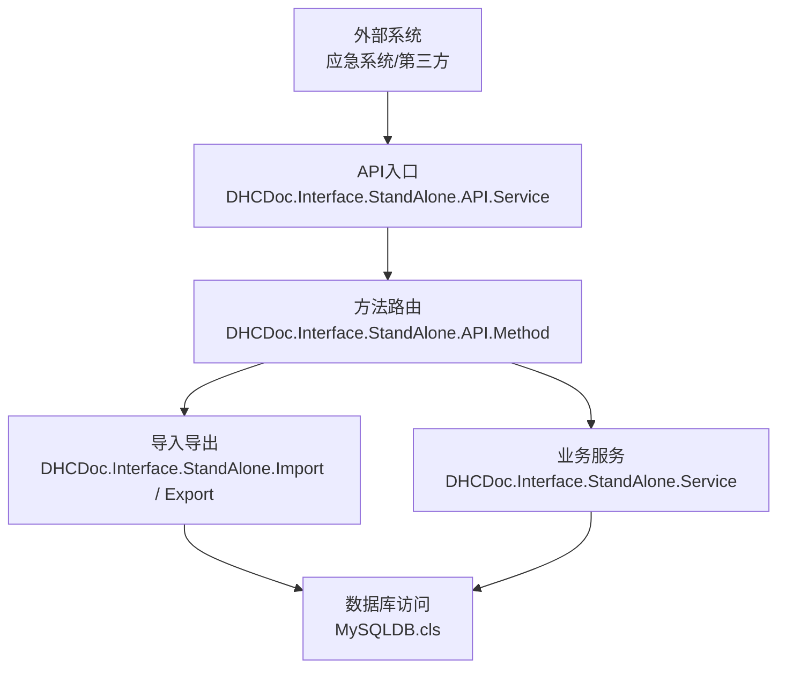
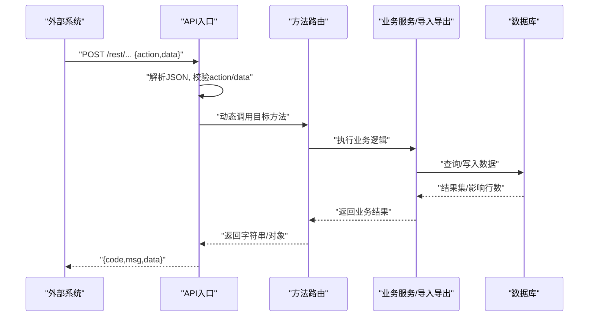
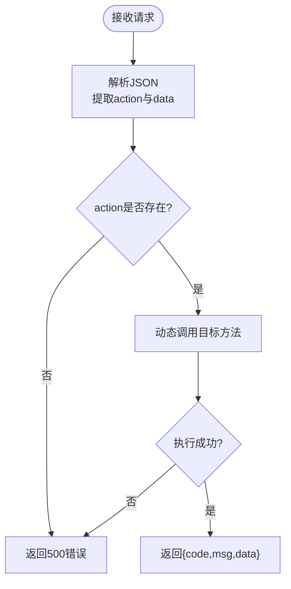
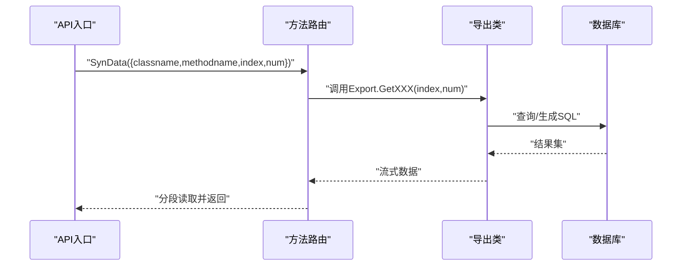
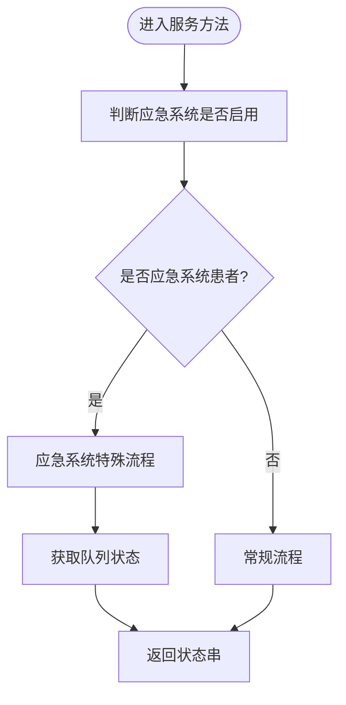
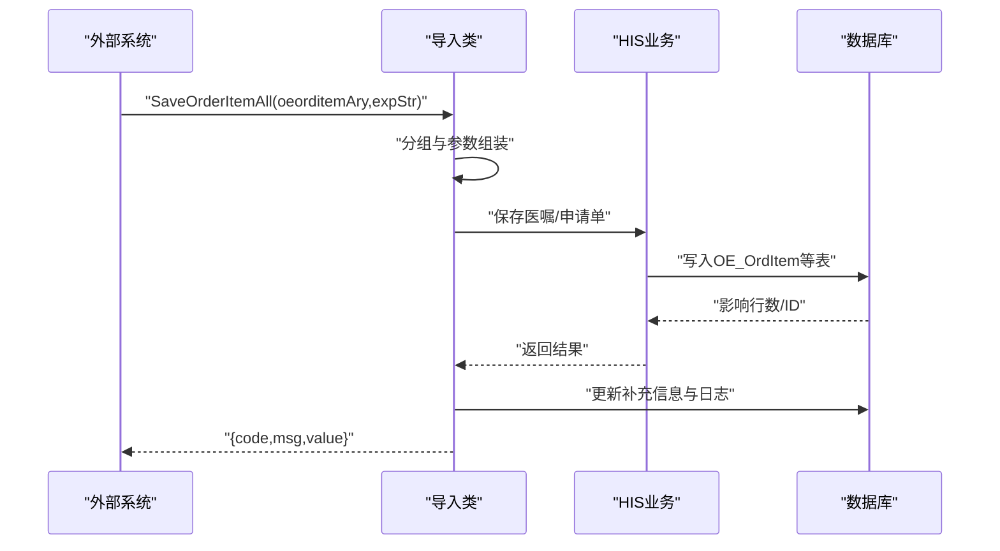
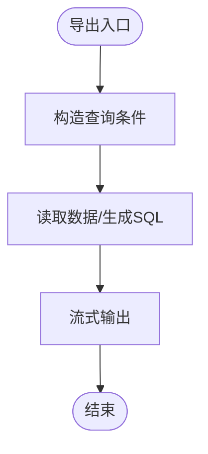
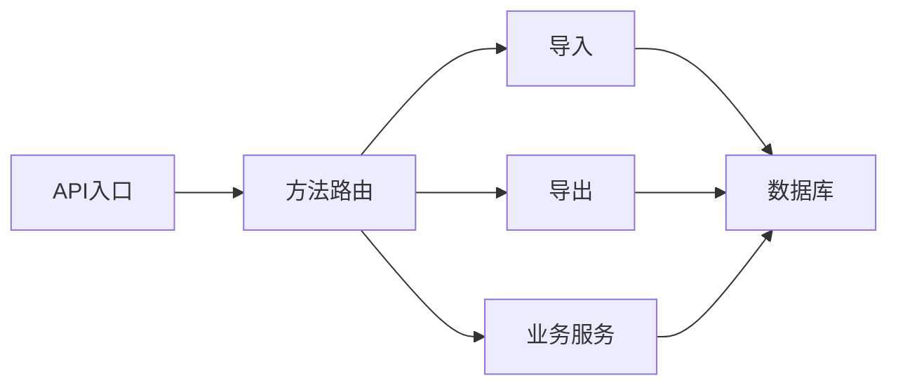

# HL7标准支持

<cite>
**本文引用的文件**
- [Service.cls](file://src/backend/conting-ws/DHCDoc/Interface/StandAlone/Service.cls)
- [Import.cls](file://src/backend/conting-ws/DHCDoc/Interface/StandAlone/Import.cls)
- [Export.cls](file://src/backend/conting-ws/DHCDoc/Interface/StandAlone/Export.cls)
- [API.Service.cls](file://src/backend/conting-ws/DHCDoc/Interface/StandAlone/API/Service.cls)
- [Method.cls](file://src/backend/conting-ws/DHCDoc/Interface/StandAlone/API/Method.cls)
- [MySQLDB.cls](file://src/backend/conting-ws/DHCDoc/Interface/StandAlone/MySQLDB.cls)
</cite>

## 目录
1. [简介](#简介)
2. [项目结构](#项目结构)
3. [核心组件](#核心组件)
4. [架构总览](#架构总览)
5. [详细组件分析](#详细组件分析)
6. [依赖关系分析](#依赖关系分析)
7. [性能考虑](#性能考虑)
8. [故障排查指南](#故障排查指南)
9. [结论](#结论)
10. [附录](#附录)

## 简介
本文件面向医疗信息系统中的HL7数据交换能力，聚焦于仓库中已实现的“应急系统与HIS对接”的接口与数据处理链路。根据代码库分析，系统当前并未直接实现HL7 v2.x或HL7 FHIR协议解析器；但提供了通过HTTP API进行结构化数据交换的能力，并在数据库层保留了HL7相关扩展字段（如发送方应用、发送机构等），为后续接入HL7消息网关或适配器预留了空间。

- 对HL7 v2.x：未提供直接的MSH/SEG解析与生成逻辑；可通过外部适配器将HL7 v2.x转换为JSON后调用现有REST接口。
- 对HL7 FHIR：未提供FHIR资源模型与RESTful端点；可基于现有JSON API封装FHIR资源映射层。
- 数据交换格式：当前采用JSON作为传输载体，统一由API入口类处理请求并路由到具体业务方法。
- 错误处理：统一的返回码与消息结构，便于上层集成与重试。
- 扩展性：数据库表结构中预留HL7扩展字段，便于未来记录HL7报文元信息。

[本节不直接分析具体文件]

## 项目结构
围绕HL7数据交换的相关代码集中在“应急系统对接HIS”的独立模块中，包含以下关键部分：
- 业务服务类：负责应急系统状态判断、患者队列状态、退号前校验等。
- 导入导出类：负责从HIS读取字典与配置、回写医嘱与申请单等。
- API网关类：统一接收JSON请求，动态路由到具体方法，并提供加密签名与分页下载能力。
- 工具与数据库类：提供SQL执行、表存在性检查、HL7扩展字段维护等。

**图表来源**
- [API.Service.cls:9-36](file://src/backend/conting-ws/DHCDoc/Interface/StandAlone/API/Service.cls#L9-L36)
- [Method.cls:16-37](file://src/backend/conting-ws/DHCDoc/Interface/StandAlone/API/Method.cls#L16-L37)
- [Service.cls:16-130](file://src/backend/conting-ws/DHCDoc/Interface/StandAlone/Service.cls#L16-L130)
- [Import.cls:135-556](file://src/backend/conting-ws/DHCDoc/Interface/StandAlone/Import.cls#L135-L556)
- [Export.cls:22-204](file://src/backend/conting-ws/DHCDoc/Interface/StandAlone/Export.cls#L22-L204)
- [MySQLDB.cls:20-350](file://src/backend/conting-ws/DHCDoc/Interface/StandAlone/MySQLDB.cls#L20-L350)

**章节来源**
- [API.Service.cls:9-36](file://src/backend/conting-ws/DHCDoc/Interface/StandAlone/API/Service.cls#L9-L36)
- [Method.cls:16-37](file://src/backend/conting-ws/DHCDoc/Interface/StandAlone/API/Method.cls#L16-L37)
- [Service.cls:16-130](file://src/backend/conting-ws/DHCDoc/Interface/StandAlone/Service.cls#L16-L130)
- [Import.cls:135-556](file://src/backend/conting-ws/DHCDoc/Interface/StandAlone/Import.cls#L135-L556)
- [Export.cls:22-204](file://src/backend/conting-ws/DHCDoc/Interface/StandAlone/Export.cls#L22-L204)
- [MySQLDB.cls:20-350](file://src/backend/conting-ws/DHCDoc/Interface/StandAlone/MySQLDB.cls#L20-L350)

## 核心组件
- 统一API入口：接收JSON请求，解析action与data，动态调用目标方法，返回统一JSON结构。
- 方法路由：解析输入参数，按类名与方法名反射调用，支持分页流式读取大数据集。
- 业务服务：提供应急系统可用性判断、患者队列状态输出、退号前校验等。
- 导入导出：
  - 导入：回插就诊信息、插入队列、保存医嘱与申请单、更新补充信息与日志。
  - 导出：拉取字典、配置、模板等数据，生成SQL语句供外部同步。
- 数据库工具：提供建表、字段扩展（含HL7扩展字段）、表存在性检查等。

**章节来源**
- [API.Service.cls:9-36](file://src/backend/conting-ws/DHCDoc/Interface/StandAlone/API/Service.cls#L9-L36)
- [Method.cls:16-37](file://src/backend/conting-ws/DHCDoc/Interface/StandAlone/API/Method.cls#L16-L37)
- [Service.cls:16-130](file://src/backend/conting-ws/DHCDoc/Interface/StandAlone/Service.cls#L16-L130)
- [Import.cls:135-556](file://src/backend/conting-ws/DHCDoc/Interface/StandAlone/Import.cls#L135-L556)
- [Export.cls:22-204](file://src/backend/conting-ws/DHCDoc/Interface/StandAlone/Export.cls#L22-L204)
- [MySQLDB.cls:345-350](file://src/backend/conting-ws/DHCDoc/Interface/StandAlone/MySQLDB.cls#L345-L350)

## 架构总览
系统以HTTP JSON API为核心，结合内部业务类完成数据交换。对于HL7生态，建议采用“HL7适配器→JSON API”的模式：
- HL7 v2.x：由适配器解析MSH/SEG，映射为JSON对象，调用API入口。
- HL7 FHIR：由FHIR服务器或客户端将资源序列化为JSON，调用API入口或直接映射到内部实体。

**图表来源**
- [API.Service.cls:9-36](file://src/backend/conting-ws/DHCDoc/Interface/StandAlone/API/Service.cls#L9-L36)
- [Method.cls:16-37](file://src/backend/conting-ws/DHCDoc/Interface/StandAlone/API/Method.cls#L16-L37)
- [Import.cls:135-556](file://src/backend/conting-ws/DHCDoc/Interface/StandAlone/Import.cls#L135-L556)
- [Export.cls:22-204](file://src/backend/conting-ws/DHCDoc/Interface/StandAlone/Export.cls#L22-L204)

## 详细组件分析

### 统一API入口（JSON REST）
- 功能：解析JSON请求，提取action与data，动态调用对应方法；统一返回{code,msg,data}结构。
- 安全：提供URL生成方法，使用SM4加密与SM3签名，支持GET/POST两种模式。
- 扩展：支持测试SQL连接、终端有效性检查、终端注册等。

**图表来源**
- [API.Service.cls:9-36](file://src/backend/conting-ws/DHCDoc/Interface/StandAlone/API/Service.cls#L9-L36)
- [API.Service.cls:46-54](file://src/backend/conting-ws/DHCDoc/Interface/StandAlone/API/Service.cls#L46-L54)
- [API.Service.cls:116-133](file://src/backend/conting-ws/DHCDoc/Interface/StandAlone/API/Service.cls#L116-L133)

**章节来源**
- [API.Service.cls:9-36](file://src/backend/conting-ws/DHCDoc/Interface/StandAlone/API/Service.cls#L9-L36)
- [API.Service.cls:46-54](file://src/backend/conting-ws/DHCDoc/Interface/StandAlone/API/Service.cls#L46-L54)
- [API.Service.cls:116-133](file://src/backend/conting-ws/DHCDoc/Interface/StandAlone/API/Service.cls#L116-L133)

### 方法路由与分页下载
- 功能：解析输入参数，按类名与方法名反射调用；支持大结果集的分页流式读取。
- 日志：提供写入日志表的方法，便于追踪导出任务状态。
- 终端管理：检查终端有效性、注册终端。

**图表来源**
- [Method.cls:16-37](file://src/backend/conting-ws/DHCDoc/Interface/StandAlone/API/Method.cls#L16-L37)
- [Export.cls:22-204](file://src/backend/conting-ws/DHCDoc/Interface/StandAlone/Export.cls#L22-L204)

**章节来源**
- [Method.cls:16-37](file://src/backend/conting-ws/DHCDoc/Interface/StandAlone/API/Method.cls#L16-L37)
- [Method.cls:47-92](file://src/backend/conting-ws/DHCDoc/Interface/StandAlone/API/Method.cls#L47-L92)

### 业务服务（应急系统对接）
- 功能：判断应急系统是否可用、是否为应急系统患者、获取就诊队列状态、退号前校验等。
- 数据源：依赖HIS内部全局与SQL表，结合排班与订单信息进行状态判定。

**图表来源**
- [Service.cls:16-130](file://src/backend/conting-ws/DHCDoc/Interface/StandAlone/Service.cls#L16-L130)

**章节来源**
- [Service.cls:16-130](file://src/backend/conting-ws/DHCDoc/Interface/StandAlone/Service.cls#L16-L130)

### 导入（回写医嘱与申请单）
- 功能：回插就诊信息、插入队列、保存医嘱项、自动生成检查检验申请单、更新补充信息与导入日志。
- 数据映射：将外部传入的对象字段映射为内部医嘱字符串，支持草药与非草药医嘱的不同处理路径。

**图表来源**
- [Import.cls:135-556](file://src/backend/conting-ws/DHCDoc/Interface/StandAlone/Import.cls#L135-L556)

**章节来源**
- [Import.cls:135-556](file://src/backend/conting-ws/DHCDoc/Interface/StandAlone/Import.cls#L135-L556)

### 导出（字典与配置）
- 功能：拉取挂号职称字典、科室医生号别对照、医嘱项外部代码、插件管理、硬件参数、医生站配置等。
- 输出：生成SQL语句或流式数据，便于外部系统增量同步。

**图表来源**
- [Export.cls:22-204](file://src/backend/conting-ws/DHCDoc/Interface/StandAlone/Export.cls#L22-L204)

**章节来源**
- [Export.cls:22-204](file://src/backend/conting-ws/DHCDoc/Interface/StandAlone/Export.cls#L22-L204)

### 数据库与HL7扩展字段
- 功能：提供建表、字段扩展、表存在性检查等。
- HL7扩展：在表结构中保留HL7发送方应用与发送机构等字段，便于未来记录HL7报文元信息。

**章节来源**
- [MySQLDB.cls:20-350](file://src/backend/conting-ws/DHCDoc/Interface/StandAlone/MySQLDB.cls#L20-L350)

## 依赖关系分析
- API入口依赖方法路由，方法路由依赖业务服务与导入导出类。
- 导入导出类依赖数据库访问与HIS内部全局。
- 数据库类提供基础能力，包括HL7扩展字段维护。

**图表来源**
- [API.Service.cls:9-36](file://src/backend/conting-ws/DHCDoc/Interface/StandAlone/API/Service.cls#L9-L36)
- [Method.cls:16-37](file://src/backend/conting-ws/DHCDoc/Interface/StandAlone/API/Method.cls#L16-L37)
- [Service.cls:16-130](file://src/backend/conting-ws/DHCDoc/Interface/StandAlone/Service.cls#L16-L130)
- [Import.cls:135-556](file://src/backend/conting-ws/DHCDoc/Interface/StandAlone/Import.cls#L135-L556)
- [Export.cls:22-204](file://src/backend/conting-ws/DHCDoc/Interface/StandAlone/Export.cls#L22-L204)
- [MySQLDB.cls:20-350](file://src/backend/conting-ws/DHCDoc/Interface/StandAlone/MySQLDB.cls#L20-L350)

**章节来源**
- [API.Service.cls:9-36](file://src/backend/conting-ws/DHCDoc/Interface/StandAlone/API/Service.cls#L9-L36)
- [Method.cls:16-37](file://src/backend/conting-ws/DHCDoc/Interface/StandAlone/API/Method.cls#L16-L37)
- [Service.cls:16-130](file://src/backend/conting-ws/DHCDoc/Interface/StandAlone/Service.cls#L16-L130)
- [Import.cls:135-556](file://src/backend/conting-ws/DHCDoc/Interface/StandAlone/Import.cls#L135-L556)
- [Export.cls:22-204](file://src/backend/conting-ws/DHCDoc/Interface/StandAlone/Export.cls#L22-L204)
- [MySQLDB.cls:20-350](file://src/backend/conting-ws/DHCDoc/Interface/StandAlone/MySQLDB.cls#L20-L350)

## 性能考虑
- 分页流式读取：方法路由支持按固定长度分段读取流式数据，避免一次性加载大量数据导致内存压力。
- SQL优化：导出类通过条件过滤与TOP限制减少查询量。
- 事务与回滚：导入类在失败时进行事务回滚，保证数据一致性。
- 日志记录：导入成功后记录导入日志，便于问题定位与审计。

[本节提供一般性指导，不直接分析具体文件]

## 故障排查指南
- 统一错误码：API入口返回{code,msg,data}，code非0表示异常，msg描述错误原因。
- 常见错误：
  - action缺失：返回500错误。
  - 数据为空：返回403或500错误。
  - 导入失败：返回错误码与详细信息，需检查参数与数据库状态。
- 调试建议：
  - 使用GenUrl生成带签名的测试链接，验证接口连通性。
  - 查看导入日志表，确认数据写入情况。
  - 检查数据库表结构与HL7扩展字段是否完整。

**章节来源**
- [API.Service.cls:9-36](file://src/backend/conting-ws/DHCDoc/Interface/StandAlone/API/Service.cls#L9-L36)
- [API.Service.cls:46-54](file://src/backend/conting-ws/DHCDoc/Interface/StandAlone/API/Service.cls#L46-L54)
- [Method.cls:47-92](file://src/backend/conting-ws/DHCDoc/Interface/StandAlone/API/Method.cls#L47-L92)
- [Import.cls:408-475](file://src/backend/conting-ws/DHCDoc/Interface/StandAlone/Import.cls#L408-L475)

## 结论
当前代码库未直接实现HL7 v2.x或HL7 FHIR协议解析，但提供了稳定的JSON REST API与完善的导入导出能力，可作为HL7适配器的后端支撑。建议在现有基础上：
- 引入HL7 v2.x适配器，将MSH/SEG映射为JSON后调用API入口。
- 构建FHIR资源映射层，将FHIR资源序列化为JSON后调用API入口或直接映射到内部实体。
- 利用数据库中的HL7扩展字段，记录HL7报文元信息，便于审计与追溯。
- 完善错误处理与日志记录，提升集成稳定性。

[本节总结性内容，不直接分析具体文件]

## 附录
- 数据转换示例（概念性）：
  - HL7 v2.x ADT_A01 → JSON → 调用API入口 → 导入类处理 → 写入HIS。
  - HL7 FHIR Patient/Encounter → JSON → 调用API入口 → 导入类处理 → 写入HIS。
- 验证规则（概念性）：
  - 必填字段校验、数据类型校验、业务规则校验（如患者是否存在、科室是否有效）。
- 最佳实践（概念性）：
  - 使用签名与加密确保传输安全。
  - 分批次处理大数据集，避免超时与内存溢出。
  - 记录导入日志，便于问题定位与审计。

[本节提供概念性内容，不直接分析具体文件]