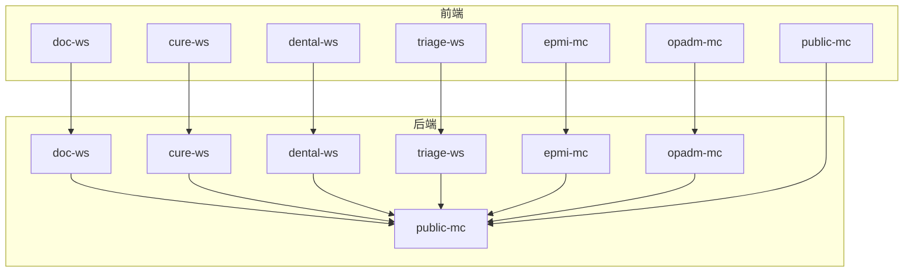
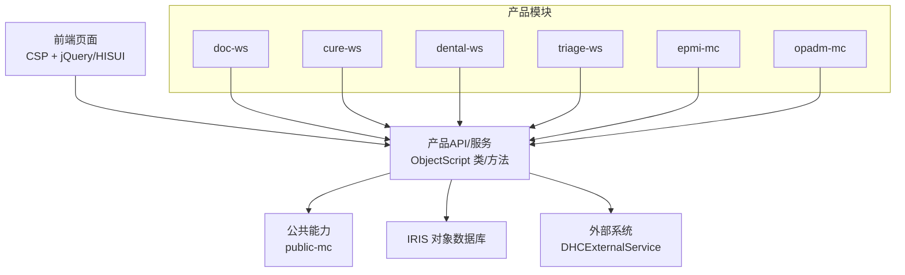
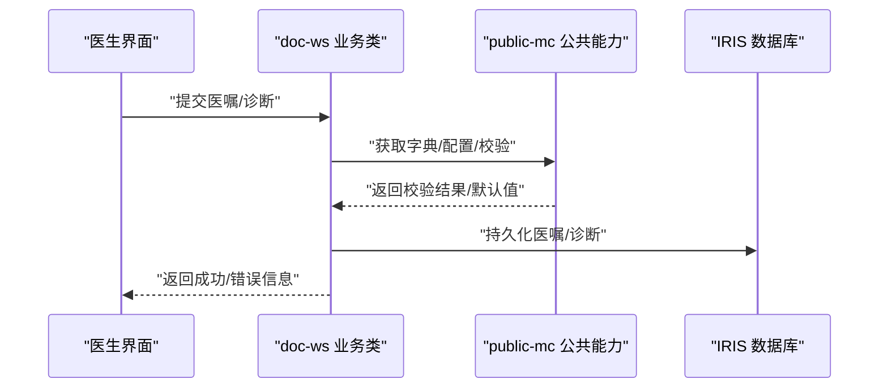
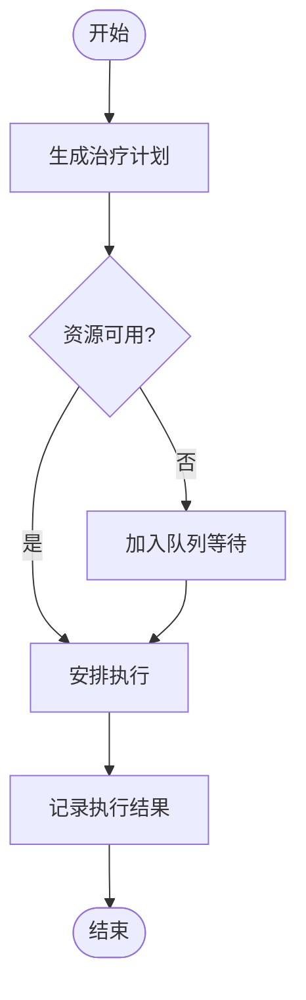
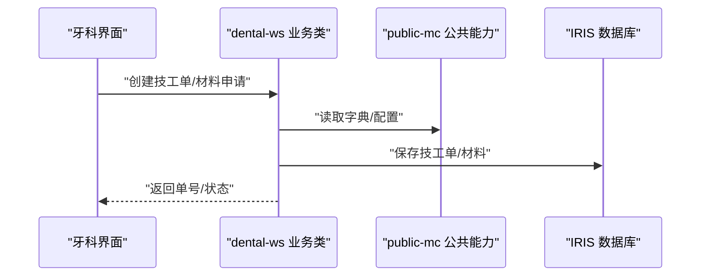
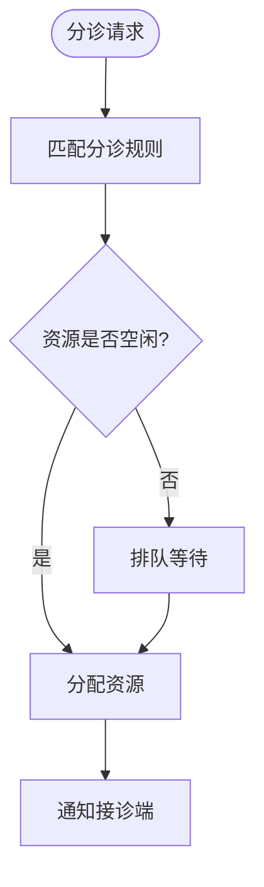
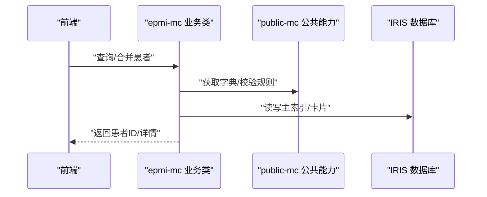
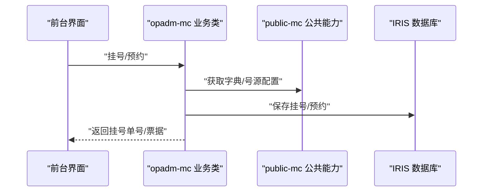
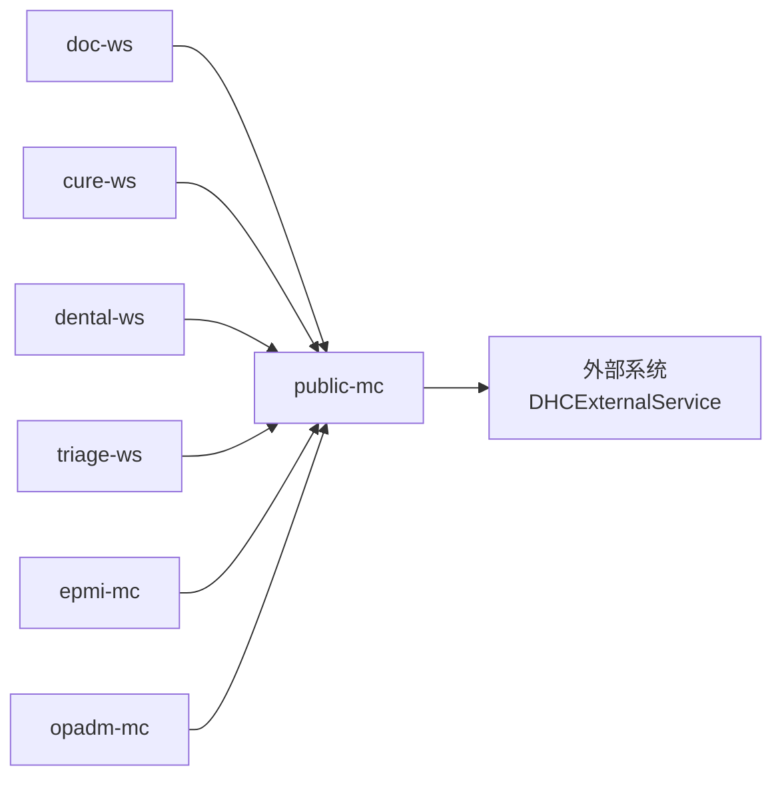

# 模块架构设计

<cite>
**本文引用的文件**
- [README.md](file://README.md)
- [doc-ws/CF](file://src/backend/doc-ws/CF)
- [doc-ws/DHCDoc](file://src/backend/doc-ws/DHCDoc)
- [doc-ws/User](file://src/backend/doc-ws/User)
- [cure-ws/DHCDoc](file://src/backend/cure-ws/DHCDoc)
- [dental-ws/DHCDoc](file://src/backend/dental-ws/DHCDoc)
- [triage-ws/User](file://src/backend/triage-ws/User)
- [epmi-mc/DHCDoc](file://src/backend/epmi-mc/DHCDoc)
- [opadm-mc/DHCDoc](file://src/backend/opadm-mc/DHCDoc)
- [public-mc/DHCDoc](file://src/backend/public-mc/DHCDoc)
- [public-mc/DHCExternalService](file://src/backend/public-mc/DHCExternalService)
</cite>

## 目录
1. [简介](#简介)
2. [项目结构](#项目结构)
3. [核心组件](#核心组件)
4. [架构总览](#架构总览)
5. [详细组件分析](#详细组件分析)
6. [依赖关系分析](#依赖关系分析)
7. [性能与扩展性](#性能与扩展性)
8. [故障排查指南](#故障排查指南)
9. [结论](#结论)
10. [附录：接口契约与部署版本管理](#附录接口契约与部署版本管理)

## 简介
本文档面向 IRIS HIS 多产品模块化架构，聚焦以下产品模块的职责划分、通信机制、数据交换格式、依赖关系与接口契约、部署策略与版本管理，以及扩展与插件化设计。系统后端基于 InterSystems IRIS ObjectScript，前端采用 CSP + jQuery/HISUI；各产品以独立目录组织，共享公共能力于 public-mc。

## 项目结构
- 后端代码位于 src/backend，按产品分目录：doc-ws、cure-ws、dental-ws、triage-ws、epmi-mc、opadm-mc、public-mc 等。
- 前端代码位于 src/frontend，对应同名目录，统一通过 SFTP 脚本上传至服务器路径 <remote-path>
- 后端通过 IRIS ObjectScript 扩展直接编译上传到 IRIS 命名空间（如 <namespace>），不经过 SFTP。
- README 明确了子模块（backend/frontend）的 Git Submodule 管理与部署方式。

**图表来源**
- [README.md:5-35](file://README.md#L5-L35)

**章节来源**
- [README.md:5-51](file://README.md#L5-L51)

## 核心组件
- doc-ws（医生工作站）：门诊/住院医嘱、诊断、处方、报告、排班、患者主索引查询等综合业务入口。
- cure-ws（治疗系统）：治疗计划、评估量表、执行记录、资源排班、队列与状态管理等。
- dental-ws（牙科系统）：牙科应用、材料、技工、修复、牙位色板、统计报表等。
- triage-ws（分诊系统）：分诊规则、资源分配、排队与状态流转。
- epmi-mc（患者主索引）：患者唯一标识、卡片、登记、主索引维护与跨系统患者识别。
- opadm-mc（门诊挂号系统）：挂号、预约、号源、收费关联、打印与票据等。
- public-mc（公共模块）：跨产品共享的数据模型、配置、外部服务封装、通用工具与页面资源。

职责边界建议：
- 业务域内聚：每个 ws/mc 聚焦自身领域实体与流程。
- 横向能力下沉：用户、权限、字典、日志、消息、外部系统集成等尽量沉淀到 public-mc。
- 对外暴露稳定接口：ws/mc 之间通过公开接口交互，避免直接耦合内部类。

**章节来源**
- [README.md:12-22](file://README.md#L12-L22)

## 架构总览
IRIS HIS 采用“多产品模块 + 公共能力”的分层架构：
- 表现层：CSP 页面与静态资源（jQuery/HISUI）。
- 业务层：各产品模块（ws/mc）提供领域服务。
- 公共层：public-mc 提供跨模块共享能力（数据访问、配置、外部服务、通用工具）。
- 基础设施：IRIS 对象数据库与应用服务器。

**图表来源**
- [README.md:526-536](file://README.md#L526-L536)
- [public-mc/DHCExternalService](file://src/backend/public-mc/DHCExternalService)

## 详细组件分析

### doc-ws（医生工作站）
- 职责：门诊/住院医嘱、诊断、处方、检查检验申请、报告查看、模板与常用项、过敏与禁忌、三查七对、转科、打印等。
- 关键目录：
  - DHCDoc：医嘱、诊断、报告、模板、排班、IP/OPDoc 等核心业务。
  - CF/CT：配置与字典（如过敏、频次、位置等）。
  - User：用户偏好、收藏、授权等。
  - web：CSP 页面与脚本。
- 典型调用链（示例：创建并执行医嘱）：
  - 前端页面发起请求 → doc-ws 业务类校验与落库 → 调用 public-mc 通用工具/字典 → 触发后续执行/计费/通知。

**图表来源**
- [doc-ws/DHCDoc](file://src/backend/doc-ws/DHCDoc)
- [public-mc/DHCDoc](file://src/backend/public-mc/DHCDoc)

**章节来源**
- [doc-ws/DHCDoc](file://src/backend/doc-ws/DHCDoc)
- [doc-ws/CF](file://src/backend/doc-ws/CF)
- [doc-ws/User](file://src/backend/doc-ws/User)

### cure-ws（治疗系统）
- 职责：治疗计划、评估量表、执行记录、资源与时间片、队列与状态、随访等。
- 关键目录：DHCDoc/Cure（治疗相关类）、User（用户相关）。
- 典型调用链（示例：治疗计划生成与执行）：
  - 前端选择治疗项目 → cure-ws 计算可执行项与资源占用 → 写入计划与队列 → 通知执行端。

**图表来源**
- [cure-ws/DHCDoc](file://src/backend/cure-ws/DHCDoc)

**章节来源**
- [cure-ws/DHCDoc](file://src/backend/cure-ws/DHCDoc)

### dental-ws（牙科系统）
- 职责：牙科应用、材料、技工加工、修复、牙位色板、统计报表等。
- 关键目录：DHCDoc/Dental（牙科业务）、CF/CT（配置与字典）。
- 典型调用链（示例：技工单流转）：
  - 前端创建技工单 → dental-ws 校验与落库 → 触发技工排产与进度跟踪。

**图表来源**
- [dental-ws/DHCDoc](file://src/backend/dental-ws/DHCDoc)
- [public-mc/DHCDoc](file://src/backend/public-mc/DHCDoc)

**章节来源**
- [dental-ws/DHCDoc](file://src/backend/dental-ws/DHCDoc)

### triage-ws（分诊系统）
- 职责：分诊规则、资源分配、排队与状态管理。
- 关键目录：User（用户/权限）、web（页面）。
- 典型调用链（示例：分诊派工）：
  - 前端提交分诊请求 → triage-ws 匹配规则与资源 → 更新队列状态 → 通知接诊端。

**图表来源**
- [triage-ws/User](file://src/backend/triage-ws/User)

**章节来源**
- [triage-ws/User](file://src/backend/triage-ws/User)

### epmi-mc（患者主索引）
- 职责：患者唯一标识、卡片、登记、主索引维护、跨系统患者识别。
- 关键目录：DHCDoc/EPMI（主索引逻辑）、User（用户/卡片管理）、web（页面）。
- 典型调用链（示例：患者合并/去重）：
  - 前端输入患者信息 → epmi-mc 检索与合并 → 更新主索引 → 返回新 ID。

**图表来源**
- [epmi-mc/DHCDoc](file://src/backend/epmi-mc/DHCDoc)
- [public-mc/DHCDoc](file://src/backend/public-mc/DHCDoc)

**章节来源**
- [epmi-mc/DHCDoc](file://src/backend/epmi-mc/DHCDoc)

### opadm-mc（门诊挂号系统）
- 职责：挂号、预约、号源管理、收费关联、打印与票据。
- 关键目录：DHCDoc（挂号/预约）、User（用户/权限）、web（页面）。
- 典型调用链（示例：挂号）：
  - 前端提交挂号 → opadm-mc 校验号源与费用 → 落库并生成票据 → 返回挂号单号。

**图表来源**
- [opadm-mc/DHCDoc](file://src/backend/opadm-mc/DHCDoc)
- [public-mc/DHCDoc](file://src/backend/public-mc/DHCDoc)

**章节来源**
- [opadm-mc/DHCDoc](file://src/backend/opadm-mc/DHCDoc)

### public-mc（公共模块）
- 职责：跨产品共享的数据模型、配置、外部服务封装、通用工具、页面资源。
- 关键目录：
  - DHCDoc：通用业务模型与工具。
  - DHCExternalService：外部系统集成封装（如 HRP、BSP 等）。
  - CF/CT：全局配置与字典。
  - User：通用用户与权限。
  - web：公共资源（CSP/JS/CSS）。
- 作用：降低模块间耦合，提供稳定、可复用的能力。

**章节来源**
- [public-mc/DHCDoc](file://src/backend/public-mc/DHCDoc)
- [public-mc/DHCExternalService](file://src/backend/public-mc/DHCExternalService)

## 依赖关系分析
- 模块内聚：各 ws/mc 内部按业务域组织类与方法，保持高内聚。
- 模块间解耦：通过 public-mc 提供的接口进行交互，避免直接引用对方内部实现。
- 外部依赖：通过 DHCExternalService 对接外部系统（如 HRP、BSP 等）。

**图表来源**
- [public-mc/DHCExternalService](file://src/backend/public-mc/DHCExternalService)

**章节来源**
- [README.md:12-22](file://README.md#L12-L22)
- [public-mc/DHCExternalService](file://src/backend/public-mc/DHCExternalService)

## 性能与扩展性
- 缓存与字典：将高频读的配置与字典放入内存或缓存层（由 public-mc 统一管理），减少数据库压力。
- 批处理与异步：对批量操作（如批量开嘱、批量执行）采用批处理与异步任务，提升吞吐。
- 连接池与事务：合理设置 IRIS 连接池与事务边界，避免长事务与锁竞争。
- 扩展点：在 public-mc 中定义标准扩展点（如规则引擎、事件总线、插件注册表），各模块按需实现。
- 插件化设计建议：
  - 定义统一的插件接口（如 IRule、IEvent、IService）。
  - 通过配置文件或元数据动态加载插件。
  - 提供沙箱与限流机制，防止恶意或低质量插件影响稳定性。

[本节为通用指导，不直接分析具体文件]

## 故障排查指南
- 常见问题定位：
  - 前端 CSP 未编译：确认已通过 IRIS 编译命令编译 .csp 文件。
  - 后端类未加载：确认 ObjectScript 扩展已正确导出并编译到目标命名空间。
  - 外部系统调用失败：检查 DHCExternalService 配置与网络连通性。
- 日志与追踪：
  - 在关键路径添加日志输出（public-mc 提供通用日志工具）。
  - 使用 IRIS 审计与监控工具定位慢查询与异常。
- 回滚与恢复：
  - 通过 Git Submodule 管理前后端版本，必要时回退到稳定版本。
  - 数据库变更需配合迁移脚本与回滚策略。

**章节来源**
- [README.md:256-277](file://README.md#L256-L277)

## 结论
本架构通过“多产品模块 + 公共能力”的分层设计，实现了清晰的职责划分与较低的模块耦合。借助 public-mc 的统一抽象与外部服务封装，各模块可独立演进与部署。结合 Git Submodule 与 IRIS 编译流程，可实现高效的开发与发布。未来可通过插件化与事件驱动进一步增强扩展性与可维护性。

[本节为总结，不直接分析具体文件]

## 附录：接口契约与部署版本管理

### 模块间通信机制与数据交换格式
- 通信机制：
  - 同进程调用：ObjectScript 类方法调用（推荐用于强一致场景）。
  - Web 服务：CSP/REST 接口（用于跨命名空间或跨实例调用）。
  - 异步消息：通过任务队列或事件总线（由 public-mc 提供）。
- 数据交换格式：
  - JSON：适用于 Web 服务与跨语言集成。
  - 对象序列化：IRIS 对象在进程内传递（高性能）。
  - 统一报文头：包含租户、用户、时间戳、签名等元数据。

[本节为通用规范，不直接分析具体文件]

### 模块依赖关系与接口定义
- 依赖方向：ws/mc → public-mc → 外部系统。
- 接口定义原则：
  - 明确输入输出类型与约束。
  - 定义错误码与重试策略。
  - 提供版本兼容说明（向后兼容优先）。

[本节为通用规范，不直接分析具体文件]

### 部署策略与版本管理
- 前端部署：
  - 通过 scripts/sftp-sync.js 上传至 <remote-path>
  - 按产品目录区分通道（doc-web、epmi-web 等）。
- 后端部署：
  - 通过 IRIS ObjectScript 扩展直接编译上传到命名空间（如 <namespace>）。
- 版本管理：
  - 使用 Git Submodule 管理前后端仓库。
  - 提测与发布通过脚本批量创建 MR 与同步分支。

**章节来源**
- [README.md:37-51](file://README.md#L37-L51)
- [README.md:256-277](file://README.md#L256-L277)
- [README.md:302-445](file://README.md#L302-L445)

### 模块扩展机制与插件系统设计
- 扩展点：
  - 规则引擎：在 public-mc 定义规则接口，各模块实现具体规则。
  - 事件总线：定义事件类型与处理器，支持订阅与发布。
  - 服务插件：通过工厂模式加载第三方服务。
- 生命周期：
  - 启动时扫描并注册插件。
  - 运行时动态启停与热更新（需考虑一致性）。
- 安全与隔离：
  - 权限控制与资源限制。
  - 沙箱执行与超时保护。

[本节为通用设计建议，不直接分析具体文件]