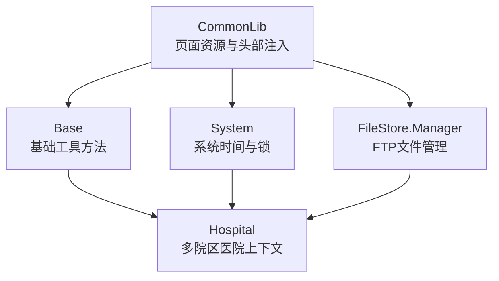
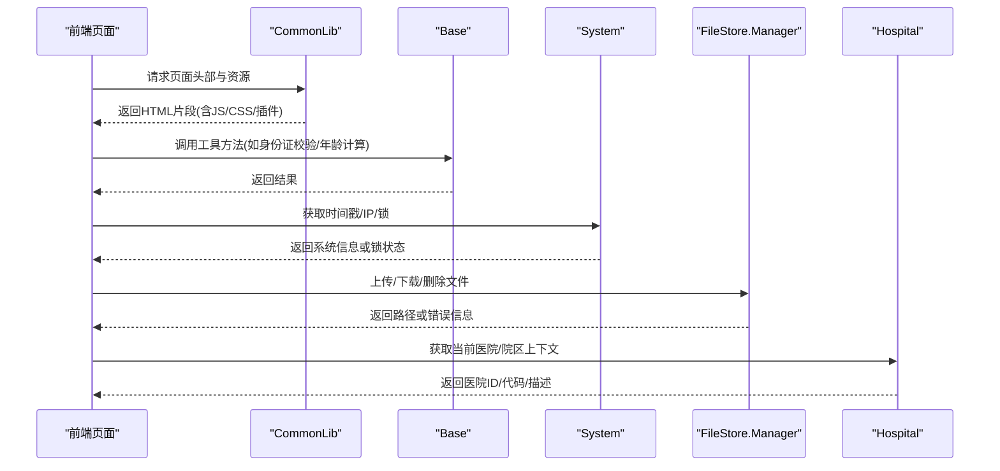
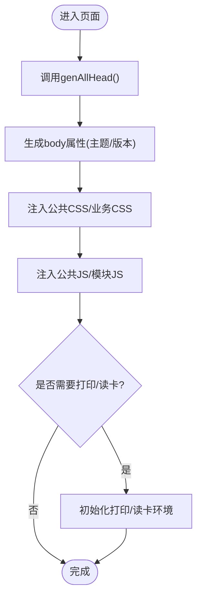
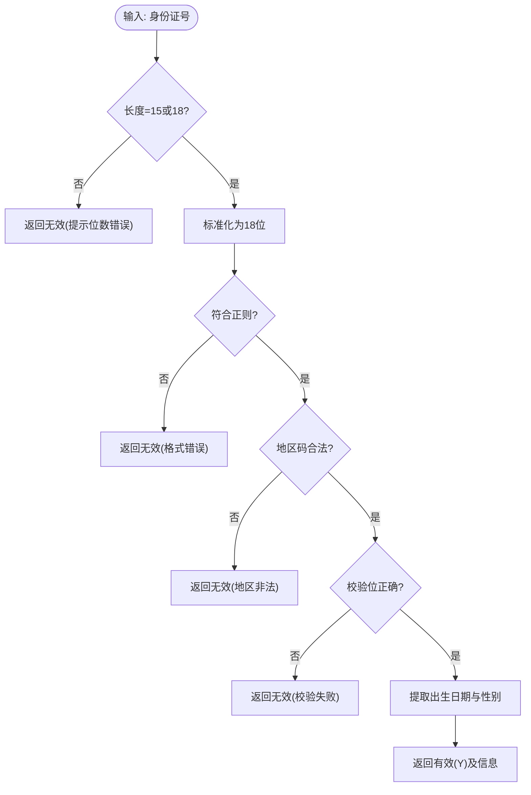
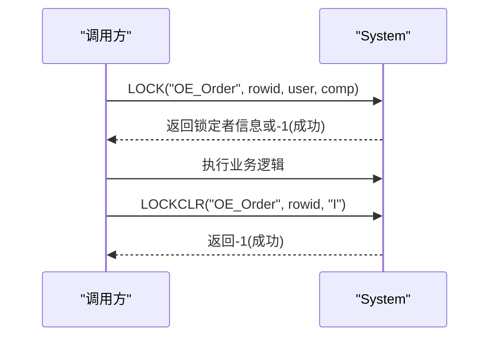
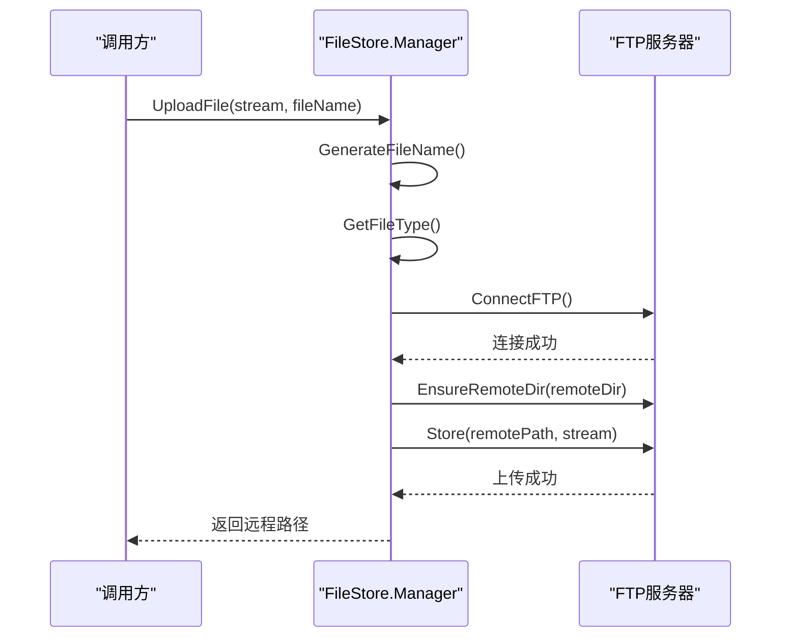
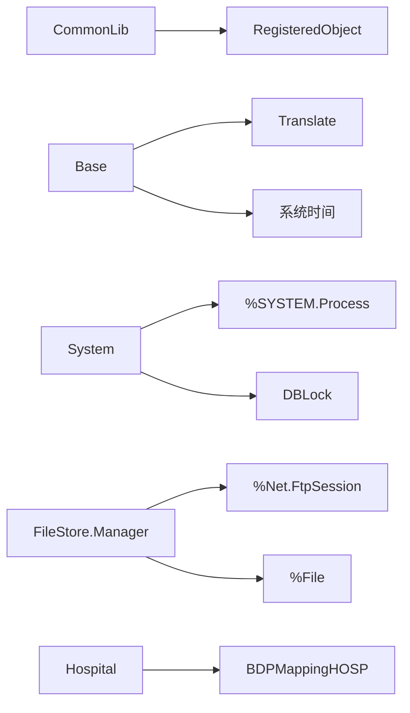

# 公共通用接口

<cite>
**本文引用的文件**
- [CommonLib.cls](file://src/backend/public-mc/DHCDoc/Common/CommonLib.cls)
- [Base.cls](file://src/backend/public-mc/DHCDoc/Util/Base.cls)
- [System.cls](file://src/backend/public-mc/DHCDoc/Util/System.cls)
- [Manager.cls](file://src/backend/public-mc/DHCDoc/FileStore/Manager.cls)
- [Hospital.cls](file://src/backend/public-mc/DHCDoc/Common/Hospital.cls)
</cite>

## 目录
1. [简介](#简介)
2. [项目结构](#项目结构)
3. [核心组件](#核心组件)
4. [架构总览](#架构总览)
5. [详细组件分析](#详细组件分析)
6. [依赖关系分析](#依赖关系分析)
7. [性能与缓存建议](#性能与缓存建议)
8. [故障排查指南](#故障排查指南)
9. [结论](#结论)
10. [附录：调用示例与扩展指南](#附录调用示例与扩展指南)

## 简介
本文件面向跨模块共享的公共通用Web服务接口，覆盖用户认证、权限验证、数据字典、系统配置等基础能力；同时记录基础工具类方法（身份证校验、日期时间处理、字符串处理）、日志记录、文件操作（FTP上传/下载/删除）以及多院区医院上下文等通用功能。文档提供接口复用策略、缓存机制与性能优化建议，并给出各模块调用公共接口的具体示例与扩展点说明，帮助开发者快速集成与二次开发。

## 项目结构
本项目将公共能力集中在 public-mc 模块中，按职责分层组织：
- 通用库与页面头资源加载：DHCDoc/Common/CommonLib.cls
- 基础工具与业务无关方法：DHCDoc/Util/Base.cls
- 系统与锁、时间戳等系统级能力：DHCDoc/Util/System.cls
- 文件存储管理（FTP）：DHCDoc/FileStore/Manager.cls
- 多院区医院上下文：DHCDoc/Common/Hospital.cls

图表来源
- [CommonLib.cls:106-200](file://src/backend/public-mc/DHCDoc/Common/CommonLib.cls#L106-L200)
- [Base.cls:1-120](file://src/backend/public-mc/DHCDoc/Util/Base.cls#L1-L120)
- [System.cls:1-130](file://src/backend/public-mc/DHCDoc/Util/System.cls#L1-L130)
- [Manager.cls:1-120](file://src/backend/public-mc/DHCDoc/FileStore/Manager.cls#L1-L120)
- [Hospital.cls:1-60](file://src/backend/public-mc/DHCDoc/Common/Hospital.cls#L1-L60)

章节来源
- [CommonLib.cls:106-200](file://src/backend/public-mc/DHCDoc/Common/CommonLib.cls#L106-L200)
- [Base.cls:1-120](file://src/backend/public-mc/DHCDoc/Util/Base.cls#L1-L120)
- [System.cls:1-130](file://src/backend/public-mc/DHCDoc/Util/System.cls#L1-L130)
- [Manager.cls:1-120](file://src/backend/public-mc/DHCDoc/FileStore/Manager.cls#L1-L120)
- [Hospital.cls:1-60](file://src/backend/public-mc/DHCDoc/Common/Hospital.cls#L1-L60)

## 核心组件
- 页面资源与头部注入（CommonLib）
  - 统一引入前端框架与公共JS/CSS，支持打印、读卡、插件中间层加载，生成页面body属性与标题模板。
- 基础工具（Base）
  - 身份证号15/18位互转与校验、年龄计算与格式化、登记号格式化处理、别名与用户名匹配、ASCII转换、隐藏敏感数字、日期有效性检查等。
- 系统能力（System）
  - 时间戳获取与解析、客户端/服务器IP、许可证信息、MAC地址、PDF生成示例、基于DBLock的行级加解锁。
- 文件存储（FileStore.Manager）
  - FTP上传/下载/删除、递归清空目录、本地下载目录管理、文件类型识别与MIME映射、FTP会话创建与连接、错误信息组装。
- 多院区医院（Hospital）
  - 当前登录医院ID/代码/描述获取、就诊/科室/用户/医嘱关联医院推导、多院区配置开关判断等。

章节来源
- [CommonLib.cls:106-200](file://src/backend/public-mc/DHCDoc/Common/CommonLib.cls#L106-L200)
- [Base.cls:12-150](file://src/backend/public-mc/DHCDoc/Util/Base.cls#L12-L150)
- [Base.cls:646-728](file://src/backend/public-mc/DHCDoc/Util/Base.cls#L646-L728)
- [System.cls:7-36](file://src/backend/public-mc/DHCDoc/Util/System.cls#L7-L36)
- [System.cls:91-127](file://src/backend/public-mc/DHCDoc/Util/System.cls#L91-L127)
- [Manager.cls:25-79](file://src/backend/public-mc/DHCDoc/FileStore/Manager.cls#L25-L79)
- [Manager.cls:209-298](file://src/backend/public-mc/DHCDoc/FileStore/Manager.cls#L209-L298)
- [Hospital.cls:51-100](file://src/backend/public-mc/DHCDoc/Common/Hospital.cls#L51-L100)

## 架构总览
公共接口通过“页面资源注入 + 工具方法 + 系统能力 + 文件服务 + 多院区上下文”的组合，为各业务模块提供统一的横切能力。典型调用链如下：

图表来源
- [CommonLib.cls:106-200](file://src/backend/public-mc/DHCDoc/Common/CommonLib.cls#L106-L200)
- [Base.cls:646-728](file://src/backend/public-mc/DHCDoc/Util/Base.cls#L646-L728)
- [System.cls:7-36](file://src/backend/public-mc/DHCDoc/Util/System.cls#L7-L36)
- [Manager.cls:25-79](file://src/backend/public-mc/DHCDoc/FileStore/Manager.cls#L25-L79)
- [Hospital.cls:51-100](file://src/backend/public-mc/DHCDoc/Common/Hospital.cls#L51-L100)

## 详细组件分析

### 组件A：页面资源与头部注入（CommonLib）
- 职责
  - 统一注入Bootstrap、EasyUI、公共JS/CSS，支持打印环境、读卡环境、插件中间层加载。
  - 生成页面body属性（主题、版本），构建页面标题模板，支持多语言与菜单信息填充。
- 关键方法
  - LoadBootstrapLib / LoadCommonLib：输出第三方库引用
  - LoadCommonHead / genAllHead：组合页面头部资源与业务CSS/JS
  - getBSPTitle：根据会话与配置生成页面标题
- 使用要点
  - 在CSP页面中调用以统一样式与脚本加载，避免重复引入。
  - 可通过参数控制是否启用调试模式、打印环境、读卡环境与插件中间层。

图表来源
- [CommonLib.cls:106-200](file://src/backend/public-mc/DHCDoc/Common/CommonLib.cls#L106-L200)

章节来源
- [CommonLib.cls:106-200](file://src/backend/public-mc/DHCDoc/Common/CommonLib.cls#L106-L200)

### 组件B：基础工具（Base）
- 职责
  - 提供与业务无关的工具方法：身份证校验与转换、年龄计算与格式化、登记号格式化、别名/用户名匹配、ASCII转换、隐藏敏感数字、日期有效性检查等。
- 关键方法
  - ID15to18 / ID18to15：身份证号互转
  - GetBirthDateByAge / GetAgeDesc / FormatAge：年龄相关计算
  - CheckIdCardNo：完整身份证校验并返回性别与出生日期
  - CheckExitFlag / HideStringNumber / Trim：字符串与掩码处理
- 使用要点
  - 所有方法均为静态ClassMethod，可直接调用。
  - 涉及国际化时优先使用%Translate进行文案翻译。

图表来源
- [Base.cls:646-728](file://src/backend/public-mc/DHCDoc/Util/Base.cls#L646-L728)

章节来源
- [Base.cls:12-150](file://src/backend/public-mc/DHCDoc/Util/Base.cls#L12-L150)
- [Base.cls:646-728](file://src/backend/public-mc/DHCDoc/Util/Base.cls#L646-L728)

### 组件C：系统能力（System）
- 职责
  - 时间戳获取与解析、客户端/服务器IP、许可证信息、MAC地址、PDF生成示例、行级加解锁。
- 关键方法
  - GetTimeStamp / ParseTimeStamp：时间戳互转
  - GetOutLocalIP / GetInLocalIP：网络信息
  - LOCK / LOCKCLR：基于DBLock的行级加解锁
- 使用要点
  - 加解锁需传入表名与RowID，注意并发场景下的等待与超时策略。
  - 时间戳默认UTC，可按需转换为本地时间。

图表来源
- [System.cls:91-127](file://src/backend/public-mc/DHCDoc/Util/System.cls#L91-L127)

章节来源
- [System.cls:7-36](file://src/backend/public-mc/DHCDoc/Util/System.cls#L7-L36)
- [System.cls:91-127](file://src/backend/public-mc/DHCDoc/Util/System.cls#L91-L127)

### 组件D：文件存储（FileStore.Manager）
- 职责
  - FTP上传/下载/删除、递归清空目录、本地下载目录管理、文件类型识别与MIME映射、FTP会话创建与连接、错误信息组装。
- 关键方法
  - UploadFile / UploadToFTP：上传到FTP
  - DownloadFile：从FTP下载到HIS服务器并按日分目录
  - DeleteFromFTP / DeleteDirFromFTP：删除文件或递归清空目录
  - GetFileTypesConfig / BuildDocMimeMap：文件类型与MIME映射
  - CreateFtpSession / ConnectFTP：FTP会话与连接
- 使用要点
  - 上传前生成唯一文件名，按类型选择远程目录。
  - 下载文件按日期子目录组织，返回Web访问路径供前端展示。
  - 错误信息包含FTP返回码与消息，便于定位问题。

图表来源
- [Manager.cls:25-79](file://src/backend/public-mc/DHCDoc/FileStore/Manager.cls#L25-L79)
- [Manager.cls:448-490](file://src/backend/public-mc/DHCDoc/FileStore/Manager.cls#L448-L490)
- [Manager.cls:555-591](file://src/backend/public-mc/DHCDoc/FileStore/Manager.cls#L555-L591)

章节来源
- [Manager.cls:25-79](file://src/backend/public-mc/DHCDoc/FileStore/Manager.cls#L25-L79)
- [Manager.cls:209-298](file://src/backend/public-mc/DHCDoc/FileStore/Manager.cls#L209-L298)
- [Manager.cls:348-433](file://src/backend/public-mc/DHCDoc/FileStore/Manager.cls#L348-L433)
- [Manager.cls:448-490](file://src/backend/public-mc/DHCDoc/FileStore/Manager.cls#L448-L490)
- [Manager.cls:555-591](file://src/backend/public-mc/DHCDoc/FileStore/Manager.cls#L555-L591)

### 组件E：多院区医院（Hospital）
- 职责
  - 当前登录医院ID/代码/描述获取、就诊/科室/用户/医嘱关联医院推导、多院区配置开关判断。
- 关键方法
  - GetCurrentSYSHospitalId / GetCurrentSYSHospitalCode / GetCurrentSYSHospitalDesc
  - GetAffiliatedHospitalId / GetOrdItemHospitalId
  - GetMultiHospConfigLoc：按科室的多院区配置判断
- 使用要点
  - 优先从会话获取登录医院ID，再根据业务上下文推导所属医院。
  - 多院区配置可控制不同院区的数据可见性与行为。

章节来源
- [Hospital.cls:51-100](file://src/backend/public-mc/DHCDoc/Common/Hospital.cls#L51-L100)
- [Hospital.cls:102-158](file://src/backend/public-mc/DHCDoc/Common/Hospital.cls#L102-L158)
- [Hospital.cls:160-184](file://src/backend/public-mc/DHCDoc/Common/Hospital.cls#L160-L184)

## 依赖关系分析
- CommonLib依赖注册对象与会话信息，用于动态注入资源与插件中间层。
- Base依赖翻译与系统时间，部分方法委托至其他业务类（如计费组）。
- System依赖系统进程与网络信息，提供加锁能力。
- FileStore.Manager依赖FTP会话与文件系统，配置项来自代码表。
- Hospital继承BDP映射基类，结合会话与数据表推导医院上下文。

图表来源
- [CommonLib.cls:106-200](file://src/backend/public-mc/DHCDoc/Common/CommonLib.cls#L106-L200)
- [Base.cls:12-150](file://src/backend/public-mc/DHCDoc/Util/Base.cls#L12-L150)
- [System.cls:91-127](file://src/backend/public-mc/DHCDoc/Util/System.cls#L91-L127)
- [Manager.cls:448-490](file://src/backend/public-mc/DHCDoc/FileStore/Manager.cls#L448-L490)
- [Hospital.cls:1-60](file://src/backend/public-mc/DHCDoc/Common/Hospital.cls#L1-60)

章节来源
- [CommonLib.cls:106-200](file://src/backend/public-mc/DHCDoc/Common/CommonLib.cls#L106-L200)
- [Base.cls:12-150](file://src/backend/public-mc/DHCDoc/Util/Base.cls#L12-L150)
- [System.cls:91-127](file://src/backend/public-mc/DHCDoc/Util/System.cls#L91-L127)
- [Manager.cls:448-490](file://src/backend/public-mc/DHCDoc/FileStore/Manager.cls#L448-L490)
- [Hospital.cls:1-60](file://src/backend/public-mc/DHCDoc/Common/Hospital.cls#L1-60)

## 性能与缓存建议
- 页面资源加载
  - 使用CommonLib统一注入，避免重复加载；按需启用调试模式减少生产开销。
- 工具方法
  - 高频调用（如身份证校验）可在会话或应用级缓存结果，减少重复计算。
- 系统锁
  - 合理设置LOCK等待策略，避免长时间阻塞；及时释放锁。
- 文件存储
  - 上传/下载采用分块读写，避免大文件内存溢出；本地下载按日分目录，定期清理任务。
- 多院区
  - 医院上下文尽量从会话获取，减少数据库查询；对频繁读取的配置可考虑缓存。

[本节为通用指导，不直接分析具体文件]

## 故障排查指南
- 文件上传/下载失败
  - 检查FTP配置（IP、端口、SSL、超时），确认远程目录存在且可写。
  - 查看错误信息中的FTP返回码与消息，定位连接或传输问题。
- 页面资源未加载
  - 确认CommonLib调用位置与参数，检查浏览器控制台是否有404或跨域错误。
- 锁冲突
  - 检查LOCK/LOCKCLR调用是否正确，确认RowID与表名一致，避免死锁。
- 医院上下文异常
  - 检查会话中的LOGON.HOSPID与数据表关联，确认多院区配置是否正确。

章节来源
- [Manager.cls:492-506](file://src/backend/public-mc/DHCDoc/FileStore/Manager.cls#L492-L506)
- [System.cls:91-127](file://src/backend/public-mc/DHCDoc/Util/System.cls#L91-L127)
- [Hospital.cls:51-100](file://src/backend/public-mc/DHCDoc/Common/Hospital.cls#L51-L100)

## 结论
公共通用接口通过统一的页面资源注入、基础工具、系统能力、文件存储与多院区上下文，为各业务模块提供了稳定、可复用的横切能力。遵循本文档的调用方式与最佳实践，可有效提升开发效率与系统稳定性。

[本节为总结性内容，不直接分析具体文件]

## 附录：调用示例与扩展指南

### 各模块调用公共接口的示例
- 页面头部与资源加载
  - 在CSP页面中调用CommonLib.genAllHead，传入module、debugger、needprint、productdomain等参数，实现统一资源注入与环境初始化。
- 基础工具调用
  - 使用Base.CheckIdCardNo进行身份证校验，返回Y/N与错误信息；使用Base.GetAgeDesc计算年龄描述。
- 系统能力调用
  - 使用System.GetTimeStamp获取时间戳；使用System.LOCK/LOCKCLR进行行级加解锁。
- 文件存储调用
  - 使用Manager.UploadFile上传文件，返回远程路径；使用Manager.DownloadFile下载文件，返回Web访问路径。
- 多院区上下文
  - 使用Hospital.GetCurrentSYSHospitalId获取当前医院ID；使用Hospital.GetAffiliatedHospitalId根据业务上下文推导所属医院。

章节来源
- [CommonLib.cls:106-200](file://src/backend/public-mc/DHCDoc/Common/CommonLib.cls#L106-L200)
- [Base.cls:646-728](file://src/backend/public-mc/DHCDoc/Util/Base.cls#L646-L728)
- [System.cls:7-36](file://src/backend/public-mc/DHCDoc/Util/System.cls#L7-L36)
- [System.cls:91-127](file://src/backend/public-mc/DHCDoc/Util/System.cls#L91-L127)
- [Manager.cls:25-79](file://src/backend/public-mc/DHCDoc/FileStore/Manager.cls#L25-L79)
- [Manager.cls:209-298](file://src/backend/public-mc/DHCDoc/FileStore/Manager.cls#L209-L298)
- [Hospital.cls:51-100](file://src/backend/public-mc/DHCDoc/Common/Hospital.cls#L51-L100)

### 接口复用策略与缓存机制
- 复用策略
  - 优先调用公共方法，避免重复实现；通过参数化配置（如文件类型、FTP配置）实现灵活适配。
- 缓存机制
  - 对频繁读取的配置（如医院描述、文件类型映射）可在会话或应用级缓存，减少数据库与外部系统调用。
- 性能优化
  - 批量处理文件与数据，减少往返次数；合理使用锁与事务，避免长事务与锁竞争。

[本节为通用指导，不直接分析具体文件]

### 扩展点与自定义开发指南
- 扩展点
  - 文件类型与MIME映射：通过Manager.BuildDocMimeMap扩展新类型。
  - 页面资源：通过CommonLib.LoadCommonHead注入自定义CSS/JS。
  - 多院区配置：通过Hospital.GetMultiHospConfigLoc扩展科室级配置。
- 自定义开发
  - 新增工具方法时，保持无副作用与幂等性；必要时增加单元测试与日志记录。
  - 对外部依赖（如FTP、数据库）进行封装，便于替换与测试。

[本节为通用指导，不直接分析具体文件]