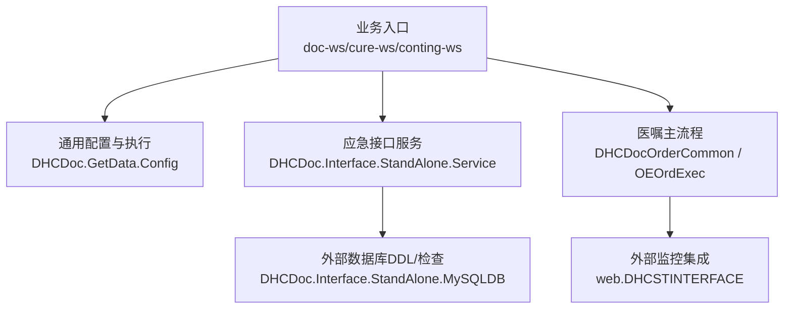
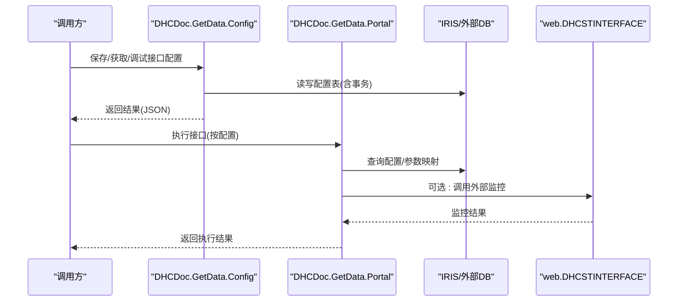
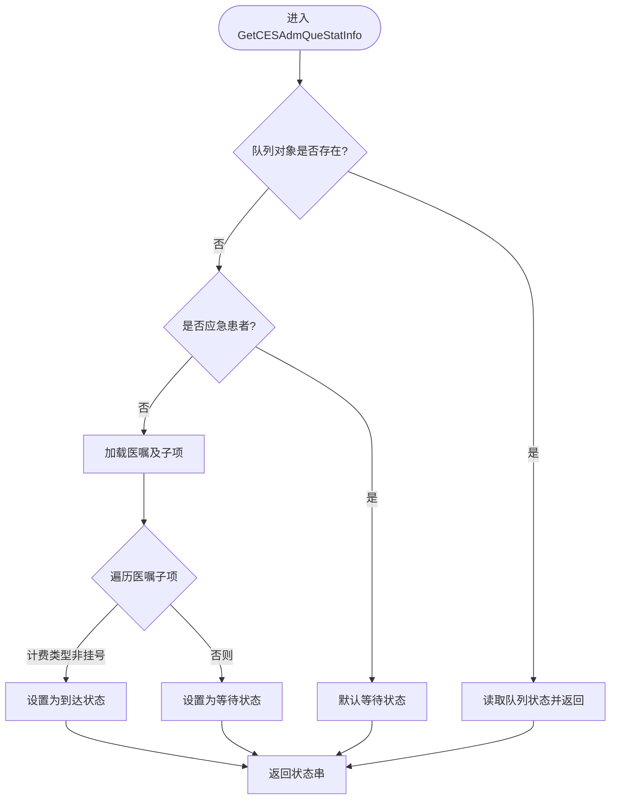
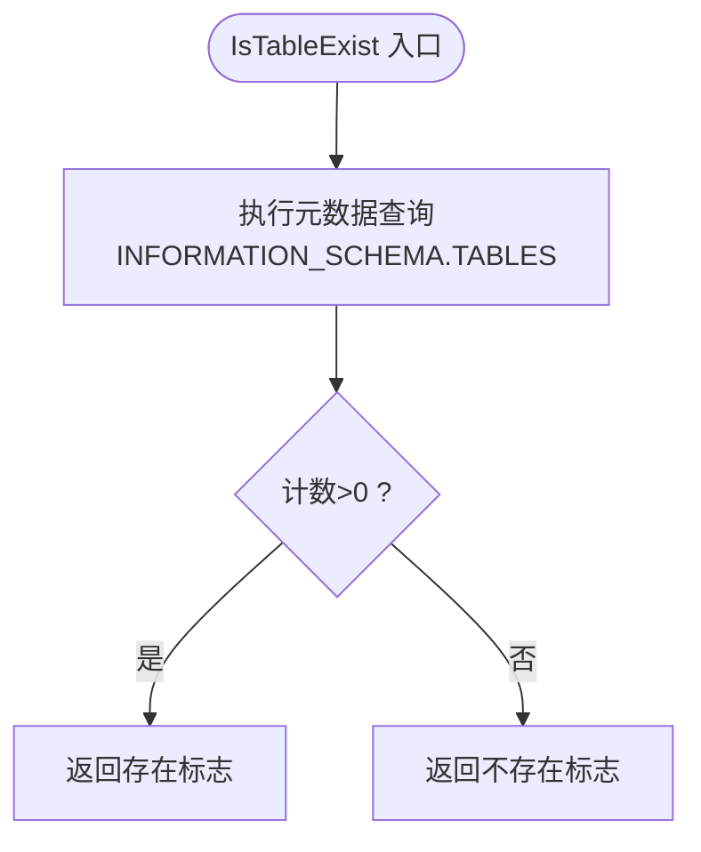
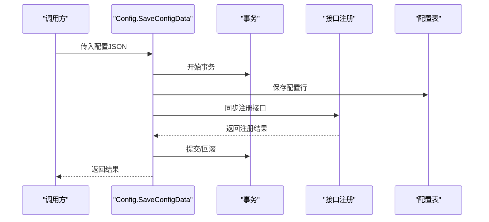
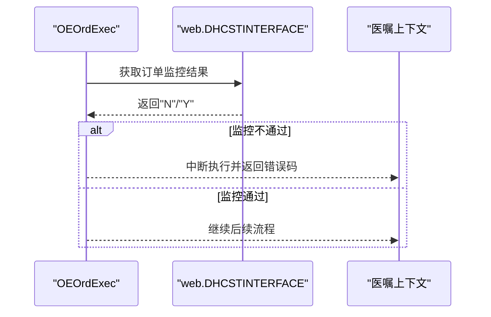
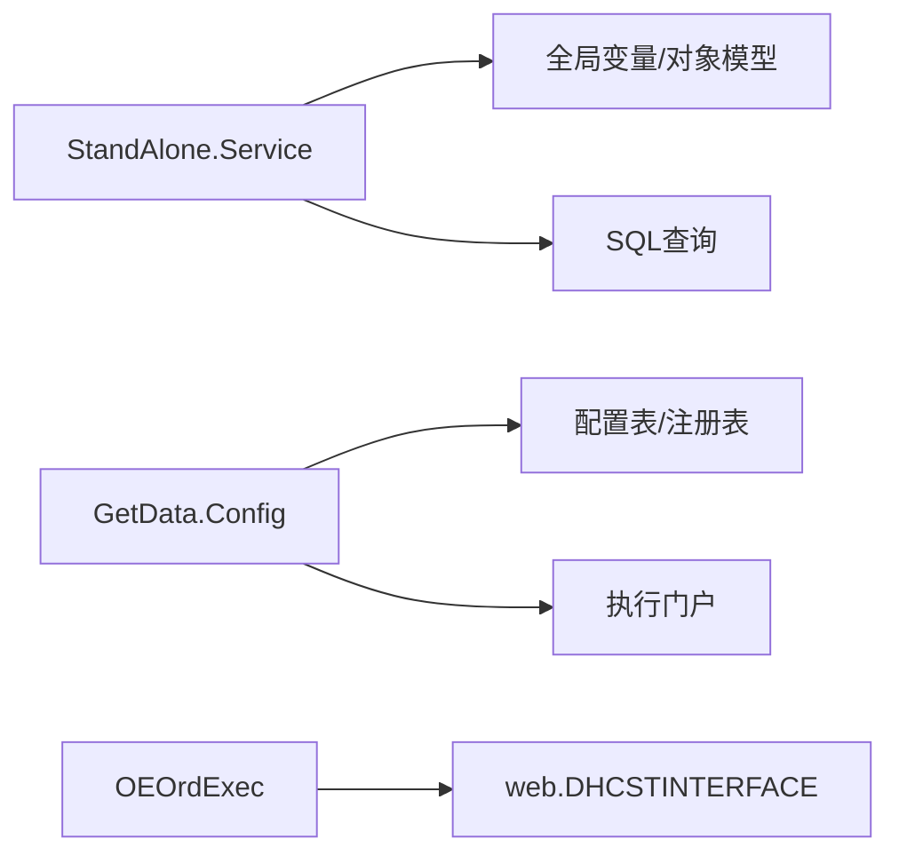

# 后端性能优化

<cite>
**本文引用的文件**
- [Service.cls](file://src/backend/conting-ws/DHCDoc/Interface/StandAlone/Service.cls)
- [MySQLDB.cls](file://src/backend/conting-ws/DHCDoc/Interface/StandAlone/MySQLDB.cls)
- [Config.cls](file://src/backend/public-mc/DHCDoc/GetData/Config.cls)
- [DHCDocOrderCommon.cls](file://src/backend/doc-ws/web/DHCDocOrderCommon.cls)
- [DHCOEOrdExec.cls](file://src/backend/doc-ws/appcom/OEOrdExec.cls)
- [DHCDocMainOrderInterface.cls](file://src/backend/doc-ws/web/DHCDocMainOrderInterface.cls)
</cite>

## 目录
1. [简介](#简介)
2. [项目结构](#项目结构)
3. [核心组件](#核心组件)
4. [架构总览](#架构总览)
5. [详细组件分析](#详细组件分析)
6. [依赖关系分析](#依赖关系分析)
7. [性能考量](#性能考量)
8. [故障排查指南](#故障排查指南)
9. [结论](#结论)
10. [附录](#附录)

## 简介
本文件面向IRIS应用服务器上的ObjectScript后端，聚焦性能调优策略与落地实践。内容覆盖类方法优化、内存管理、并发控制、事务处理、数据库访问优化，以及IRIS运行期配置（线程池、内存分配、垃圾回收）和监控分析方法。文档结合仓库中的实际代码片段，给出可操作的优化建议与排障路径。

## 项目结构
本项目为多模块IRIS医疗应用，后端以业务域划分（如doc-ws、cure-ws、conting-ws等），并通过大量Class实现业务逻辑、数据访问与接口编排。本次性能优化重点关注的三类典型场景：
- 跨系统对接与批量数据生成（应急接口与建表脚本）
- 通用数据查询与动态接口执行（配置驱动）
- 医嘱主流程与外部监控集成（订单执行链路）

图表来源
- [Config.cls:1-283](file://src/backend/public-mc/DHCDoc/GetData/Config.cls#L1-L283)
- [Service.cls:1-227](file://src/backend/conting-ws/DHCDoc/Interface/StandAlone/Service.cls#L1-L227)
- [MySQLDB.cls:1-800](file://src/backend/conting-ws/DHCDoc/Interface/StandAlone/MySQLDB.cls#L1-L800)
- [DHCDocOrderCommon.cls:7217-7233](file://src/backend/doc-ws/web/DHCDocOrderCommon.cls#L7217-L7233)
- [DHCOEOrdExec.cls:927-928](file://src/backend/doc-ws/appcom/OEOrdExec.cls#L927-L928)

章节来源
- [Service.cls:1-227](file://src/backend/conting-ws/DHCDoc/Interface/StandAlone/Service.cls#L1-L227)
- [MySQLDB.cls:1-800](file://src/backend/conting-ws/DHCDoc/Interface/StandAlone/MySQLDB.cls#L1-L800)
- [Config.cls:1-283](file://src/backend/public-mc/DHCDoc/GetData/Config.cls#L1-L283)
- [DHCDocOrderCommon.cls:7217-7233](file://src/backend/doc-ws/web/DHCDocOrderCommon.cls#L7217-L7233)
- [DHCOEOrdExec.cls:927-928](file://src/backend/doc-ws/appcom/OEOrdExec.cls#L927-L928)

## 核心组件
- 应急接口服务（StandAlone Service）
  - 提供应急系统可用性判断、患者来源识别、队列状态计算等能力，涉及全局变量读取、对象打开与SQL查询组合。
- 外部数据库工具（StandAlone MySQLDB）
  - 提供表存在性检查、批量DDL生成等能力，使用内联SQL与流式输出，适合部署期或运维期一次性任务。
- 通用数据查询配置（GetData Config）
  - 通过JSON配置定义接口元数据，支持保存、查询、调试执行；内部使用事务封装写入并联动注册接口。
- 医嘱主流程与监控集成
  - 在医嘱执行链中调用外部监控接口，必要时阻断流程；同时维护转科事务记录等关键审计信息。

章节来源
- [Service.cls:1-227](file://src/backend/conting-ws/DHCDoc/Interface/StandAlone/Service.cls#L1-L227)
- [MySQLDB.cls:1-800](file://src/backend/conting-ws/DHCDoc/Interface/StandAlone/MySQLDB.cls#L1-L800)
- [Config.cls:1-283](file://src/backend/public-mc/DHCDoc/GetData/Config.cls#L1-L283)
- [DHCDocOrderCommon.cls:7217-7233](file://src/backend/doc-ws/web/DHCDocOrderCommon.cls#L7217-L7233)
- [DHCOEOrdExec.cls:927-928](file://src/backend/doc-ws/appcom/OEOrdExec.cls#L927-L928)

## 架构总览
下图展示“配置驱动的动态接口执行”与“医嘱主流程+外部监控”的关键交互路径，体现性能敏感点：动态解析、事务边界、远程调用与数据库访问。

图表来源
- [Config.cls:46-119](file://src/backend/public-mc/DHCDoc/GetData/Config.cls#L46-L119)
- [Config.cls:141-180](file://src/backend/public-mc/DHCDoc/GetData/Config.cls#L141-L180)
- [DHCOEOrdExec.cls:927-928](file://src/backend/doc-ws/appcom/OEOrdExec.cls#L927-L928)

## 详细组件分析

### 应急接口服务（StandAlone Service）
- 职责
  - 判断应急系统是否可用、识别患者来源、计算就诊队列状态、退号前校验等。
- 性能关注点
  - 频繁的对象打开与属性访问（如队列状态、医嘱项集合）可能带来额外开销；建议在热点路径减少重复打开与遍历次数。
  - SQL查询用于字典/状态查找，应确保索引合理且避免全表扫描。
- 优化建议
  - 将热点字典/状态缓存至进程级Global或Cache，降低重复查询。
  - 对循环遍历的集合进行提前短路（如找到目标即退出）。
  - 将多次小查询合并为一次批量查询，减少往返。

图表来源
- [Service.cls:85-130](file://src/backend/conting-ws/DHCDoc/Interface/StandAlone/Service.cls#L85-L130)

章节来源
- [Service.cls:16-20](file://src/backend/conting-ws/DHCDoc/Interface/StandAlone/Service.cls#L16-L20)
- [Service.cls:30-48](file://src/backend/conting-ws/DHCDoc/Interface/StandAlone/Service.cls#L30-L48)
- [Service.cls:85-130](file://src/backend/conting-ws/DHCDoc/Interface/StandAlone/Service.cls#L85-L130)
- [Service.cls:140-174](file://src/backend/conting-ws/DHCDoc/Interface/StandAlone/Service.cls#L140-L174)

### 外部数据库工具（StandAlone MySQLDB）
- 职责
  - 检查外部数据库表是否存在、生成建表DDL脚本（流式输出）。
- 性能关注点
  - 大段字符串拼接与流写入在部署期可接受，但应避免在生产热路径中使用。
  - 元数据查询（INFORMATION_SCHEMA）在高并发下需谨慎。
- 优化建议
  - 将DDL生成与执行限制在运维窗口或独立任务中。
  - 对表存在性检查增加重试与超时保护，避免阻塞主流程。

图表来源
- [MySQLDB.cls:16-26](file://src/backend/conting-ws/DHCDoc/Interface/StandAlone/MySQLDB.cls#L16-L26)

章节来源
- [MySQLDB.cls:16-26](file://src/backend/conting-ws/DHCDoc/Interface/StandAlone/MySQLDB.cls#L16-L26)
- [MySQLDB.cls:36-800](file://src/backend/conting-ws/DHCDoc/Interface/StandAlone/MySQLDB.cls#L36-L800)

### 通用数据查询配置（GetData Config）
- 职责
  - 保存/获取默认参数、保存接口配置（含事务）、列表查询、调试执行等。
- 性能关注点
  - JSON解析与构造在高频调用时会产生GC压力；需控制对象生命周期与复用。
  - 事务边界内的写操作应尽量最小化，避免长事务。
  - 列表查询采用迭代器模式，注意游标释放与临时存储的使用。
- 优化建议
  - 对热点配置（如默认参数）进行进程级缓存。
  - 将批量写入拆分为小批次提交，降低锁竞争与回滚成本。
  - 列表查询结果按需分页，避免一次性拉取过多数据。

图表来源
- [Config.cls:46-119](file://src/backend/public-mc/DHCDoc/GetData/Config.cls#L46-L119)
- [Config.cls:141-180](file://src/backend/public-mc/DHCDoc/GetData/Config.cls#L141-L180)

章节来源
- [Config.cls:12-28](file://src/backend/public-mc/DHCDoc/GetData/Config.cls#L12-L28)
- [Config.cls:46-119](file://src/backend/public-mc/DHCDoc/GetData/Config.cls#L46-L119)
- [Config.cls:141-180](file://src/backend/public-mc/DHCDoc/GetData/Config.cls#L141-L180)
- [Config.cls:186-235](file://src/backend/public-mc/DHCDoc/GetData/Config.cls#L186-L235)
- [Config.cls:241-280](file://src/backend/public-mc/DHCDoc/GetData/Config.cls#L241-L280)

### 医嘱主流程与外部监控集成
- 职责
  - 在医嘱执行过程中调用外部监控接口，根据结果决定是否继续执行；维护转科事务记录。
- 性能关注点
  - 外部监控调用属于网络IO，需设置超时与降级策略，避免拖慢主流程。
  - 事务中尽量避免包含耗时I/O，可将监控调用移至事务外或异步处理。
- 优化建议
  - 对监控接口增加熔断与缓存（如短时间内相同请求直接复用结果）。
  - 将监控失败视为非致命错误，记录日志并继续流程（除非业务要求强一致）。

图表来源
- [DHCOEOrdExec.cls:927-928](file://src/backend/doc-ws/appcom/OEOrdExec.cls#L927-L928)
- [DHCDocMainOrderInterface.cls:665-668](file://src/backend/doc-ws/web/DHCDocMainOrderInterface.cls#L665-L668)

章节来源
- [DHCOEOrdExec.cls:927-928](file://src/backend/doc-ws/appcom/OEOrdExec.cls#L927-L928)
- [DHCDocMainOrderInterface.cls:665-668](file://src/backend/doc-ws/web/DHCDocMainOrderInterface.cls#L665-L668)
- [DHCDocOrderCommon.cls:7217-7233](file://src/backend/doc-ws/web/DHCDocOrderCommon.cls#L7217-L7233)

## 依赖关系分析
- 应急接口服务依赖全局变量与对象模型，间接依赖队列、医嘱、医院信息等基础数据。
- 通用配置模块依赖配置表与接口注册表，形成“配置→执行”的解耦链路。
- 医嘱主流程依赖外部监控接口，构成跨系统调用链。

图表来源
- [Service.cls:85-130](file://src/backend/conting-ws/DHCDoc/Interface/StandAlone/Service.cls#L85-L130)
- [Config.cls:46-119](file://src/backend/public-mc/DHCDoc/GetData/Config.cls#L46-L119)
- [DHCOEOrdExec.cls:927-928](file://src/backend/doc-ws/appcom/OEOrdExec.cls#L927-L928)

章节来源
- [Service.cls:85-130](file://src/backend/conting-ws/DHCDoc/Interface/StandAlone/Service.cls#L85-L130)
- [Config.cls:46-119](file://src/backend/public-mc/DHCDoc/GetData/Config.cls#L46-L119)
- [DHCOEOrdExec.cls:927-928](file://src/backend/doc-ws/appcom/OEOrdExec.cls#L927-L928)

## 性能考量
- 类方法优化
  - 减少对象重复打开：对同一实体的多次访问尽量复用已打开对象。
  - 缩短热点路径：将复杂判断前置，尽早返回；避免不必要的循环与分支。
  - 合并查询：将多个小查询合并为一次批量查询，减少往返与锁竞争。
- 内存管理
  - 控制JSON对象生命周期：避免在循环中创建大量临时对象；及时释放引用。
  - 合理使用Global：将热点字典/配置缓存到进程级Global，减少DB访问。
  - 避免大对象常驻内存：对大数据集采用流式处理或分页。
- 并发控制
  - 事务边界最小化：将耗时I/O移出事务，降低锁持有时间。
  - 幂等设计：对外部接口调用增加重试与去重机制，防止重复执行。
  - 限流与背压：对高并发入口增加令牌桶/漏桶限流，保护下游。
- 事务处理
  - 拆分长事务：将写操作拆分为小批次提交，降低死锁概率。
  - 明确异常回滚：确保异常路径正确回滚，避免脏数据。
- IRIS应用服务器配置建议
  - 线程池：根据CPU核数与IO特性调整最大工作线程数，避免过度上下文切换。
  - 内存分配：合理设置对象堆大小与增长策略，观察GC停顿与频率。
  - 垃圾回收：启用增量GC并调优阈值，减少Full GC带来的抖动。
  - 连接池：数据库连接池大小与超时需与峰值QPS匹配，避免连接耗尽或空闲浪费。
- 监控与分析
  - CPU使用率：关注热点方法执行时间与CPU占比，定位瓶颈函数。
  - 内存占用：跟踪对象分配速率与存活时间，识别内存泄漏与热点对象。
  - 数据库连接池：监控连接使用率、等待时间、慢查询数量。
  - 外部接口：统计调用成功率、延迟分布与超时比例。

[本节为通用指导，不直接分析具体文件]

## 故障排查指南
- 常见问题
  - 接口执行缓慢：检查是否包含长事务、外部调用未设超时、循环内重复查询。
  - 内存飙升：排查JSON解析与对象创建热点，确认是否及时释放引用。
  - 事务冲突：检查长事务与锁竞争，尝试拆分提交与缩小事务范围。
  - 外部监控阻塞：增加超时与熔断，避免主流程被拖垮。
- 诊断步骤
  - 使用IRIS性能分析器定位热点方法与SQL。
  - 查看事务日志与锁等待信息，识别阻塞点。
  - 收集外部接口调用指标（延迟、错误率），评估降级策略有效性。
- 参考实现位置
  - 事务封装与错误处理：见配置保存与接口注册流程。
  - 外部监控调用与阻断：见医嘱执行链路中的监控结果判断。

章节来源
- [Config.cls:46-119](file://src/backend/public-mc/DHCDoc/GetData/Config.cls#L46-L119)
- [DHCOEOrdExec.cls:927-928](file://src/backend/doc-ws/appcom/OEOrdExec.cls#L927-L928)
- [DHCDocMainOrderInterface.cls:665-668](file://src/backend/doc-ws/web/DHCDocMainOrderInterface.cls#L665-L668)

## 结论
通过对应急接口、通用配置与医嘱主流程的分析，明确了ObjectScript后端的性能关键点：减少对象与查询开销、合理划分事务边界、引入缓存与限流、优化IRIS运行期配置，并建立完善的监控与排障体系。建议在生产环境逐步落地上述优化措施，并结合监控数据持续迭代。

## 附录
- 术语
  - Global：IRIS全局变量，常用于高性能缓存与持久化。
  - 事务：保证一组操作的原子性与一致性。
  - 熔断：在下游不可用时快速失败，保护上游。
- 最佳实践清单
  - 热点数据缓存至Global，减少DB访问。
  - 事务内避免耗时I/O，拆分长事务。
  - 外部调用设置超时与重试，增加熔断。
  - 使用分页与流式处理处理大数据集。
  - 定期审查SQL与索引，避免全表扫描。
  - 基于监控数据持续优化，关注CPU、内存、连接池与外部接口指标。

[本节为补充说明，不直接分析具体文件]