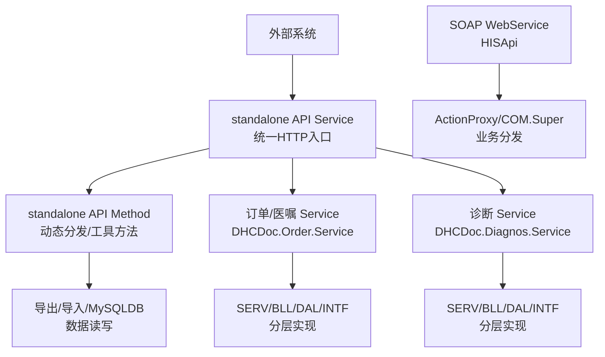
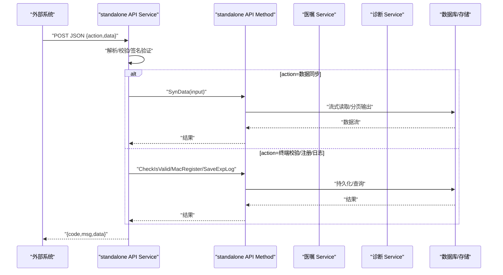
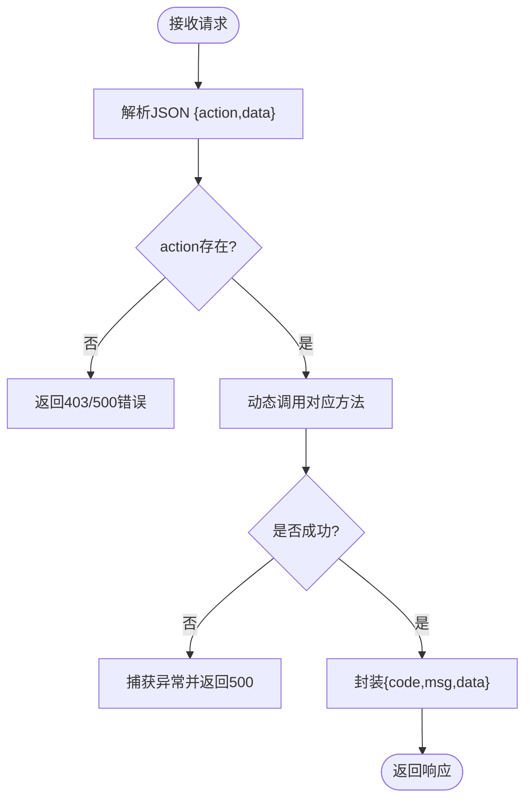
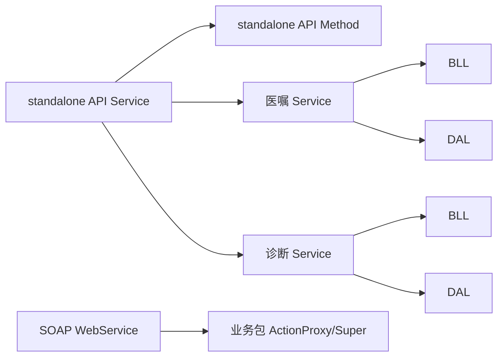

# HIS系统集成接口

<cite>
**本文引用的文件**
- [Service.cls](file://src/backend/conting-ws/DHCDoc/Interface/StandAlone/API/Service.cls)
- [Method.cls](file://src/backend/conting-ws/DHCDoc/Interface/StandAlone/API/Method.cls)
- [WebService.cls](file://src/backend/cure-ws/DHCDoc/DHCDocCure/Android/Soap/WebService.cls)
- [Service.cls（医嘱）](file://src/backend/doc-ws/DHCDoc/Order/Service.cls)
- [Service.cls（诊断）](file://src/backend/doc-ws/DHCDoc/Diagnos/Service.cls)
</cite>

## 目录
1. [简介](#简介)
2. [项目结构](#项目结构)
3. [核心组件](#核心组件)
4. [架构总览](#架构总览)
5. [详细组件分析](#详细组件分析)
6. [依赖关系分析](#依赖关系分析)
7. [性能与并发](#性能与并发)
8. [故障排查指南](#故障排查指南)
9. [结论](#结论)
10. [附录：接口规范与示例](#附录接口规范与示例)

## 简介
本文件面向医院信息系统（HIS）集成场景，聚焦以下能力：
- 患者主索引集成：通过统一入口进行终端鉴权、数据同步与日志记录。
- 医嘱数据交换：提供统一的医嘱服务路由与版本化扩展机制，便于对接外部系统。
- 诊断信息同步：提供诊断子系统对外服务入口，支持证书、模板、长效诊断等能力。
- 消息格式与映射：基于JSON请求体与标准化响应结构；结合SOAP WebService暴露通用接口；在业务层通过分层架构实现数据转换与规则校验。
- 错误处理与可观测性：统一返回码、异常堆栈定位、操作日志落库。
- 连接池、事务与并发：结合底层数据库访问与流式读取策略，保障高吞吐与稳定性。

## 项目结构
本项目采用“多子系统 + 统一入口”的架构模式：
- 应急/第三方对接入口：standalone API Service/Method，负责参数解析、动态调用、加密签名、日志与下载。
- 医嘱子系统：以DHCDoc.Order.Service为唯一对外入口，内部按SERV/BLL/DAL/INTF分层，并支持Local/V9版本路由。
- 诊断子系统：以DHCDoc.Diagnos.Service为唯一对外入口，同样遵循分层与版本路由。
- SOAP WebService：提供通用的HISApi方法，将请求转发到具体业务包的处理代理。

图表来源
- [Service.cls:1-158](file://src/backend/conting-ws/DHCDoc/Interface/StandAlone/API/Service.cls#L1-L158)
- [Method.cls:1-95](file://src/backend/conting-ws/DHCDoc/Interface/StandAlone/API/Method.cls#L1-L95)
- [WebService.cls:1-29](file://src/backend/cure-ws/DHCDoc/DHCDocCure/Android/Soap/WebService.cls#L1-L29)
- [Service.cls（医嘱）:1-95](file://src/backend/doc-ws/DHCDoc/Order/Service.cls#L1-L95)
- [Service.cls（诊断）:1-79](file://src/backend/doc-ws/DHCDoc/Diagnos/Service.cls#L1-L79)

章节来源
- [Service.cls:1-158](file://src/backend/conting-ws/DHCDoc/Interface/StandAlone/API/Service.cls#L1-L158)
- [Method.cls:1-95](file://src/backend/conting-ws/DHCDoc/Interface/StandAlone/API/Method.cls#L1-L95)
- [WebService.cls:1-29](file://src/backend/cure-ws/DHCDoc/DHCDocCure/Android/Soap/WebService.cls#L1-L29)
- [Service.cls（医嘱）:1-95](file://src/backend/doc-ws/DHCDoc/Order/Service.cls#L1-L95)
- [Service.cls（诊断）:1-79](file://src/backend/doc-ws/DHCDoc/Diagnos/Service.cls#L1-L79)

## 核心组件
- standalone API Service：统一接收JSON请求，解析action/data，动态调用对应方法，封装统一响应结构；提供加密链接生成、测试SQL、终端注册与有效性校验、日志写入、批量数据下载等能力。
- standalone API Method：实现具体的业务方法，如数据同步、日志保存、终端校验与注册。
- SOAP WebService：暴露HISApi方法，将请求转交给业务包的ActionProxy或公共Super类进行分发处理。
- 医嘱 Service：统一对外入口，重写分发逻辑，优先Local版本，再回退到标准版本，未命中抛出明确异常。
- 诊断 Service：统一对外入口，遵循相同的路由与版本控制策略。

章节来源
- [Service.cls:1-158](file://src/backend/conting-ws/DHCDoc/Interface/StandAlone/API/Service.cls#L1-L158)
- [Method.cls:1-95](file://src/backend/conting-ws/DHCDoc/Interface/StandAlone/API/Method.cls#L1-L95)
- [WebService.cls:1-29](file://src/backend/cure-ws/DHCDoc/DHCDocCure/Android/Soap/WebService.cls#L1-L29)
- [Service.cls（医嘱）:1-95](file://src/backend/doc-ws/DHCDoc/Order/Service.cls#L1-L95)
- [Service.cls（诊断）:1-79](file://src/backend/doc-ws/DHCDoc/Diagnos/Service.cls#L1-L79)

## 架构总览
整体采用“统一入口 + 分层实现 + 版本路由”的设计：
- 统一入口：standalone API Service与SOAP WebService作为外部接入点。
- 分层实现：各子系统（医嘱、诊断）内部严格分层（SERV/BLL/DAL/INTF），禁止跨层直连。
- 版本路由：优先Local定制，再回退到标准版本，保证兼容性与可扩展性。
- 安全与可观测性：请求加密签名、统一响应结构、异常堆栈定位、操作日志落库。

图表来源
- [Service.cls:1-158](file://src/backend/conting-ws/DHCDoc/Interface/StandAlone/API/Service.cls#L1-L158)
- [Method.cls:1-95](file://src/backend/conting-ws/DHCDoc/Interface/StandAlone/API/Method.cls#L1-L95)

章节来源
- [Service.cls:1-158](file://src/backend/conting-ws/DHCDoc/Interface/StandAlone/API/Service.cls#L1-L158)
- [Method.cls:1-95](file://src/backend/conting-ws/DHCDoc/Interface/StandAlone/API/Method.cls#L1-L95)

## 详细组件分析

### 统一HTTP入口（standalone API Service）
- 职责：接收JSON请求，解析action/data，动态调用目标方法；统一封装响应结构；提供加密链接生成、测试SQL、终端注册与校验、日志写入、批量数据下载。
- 关键流程：
  - 入参校验：空数据或无action时返回特定错误码。
  - 动态调用：根据action拼接方法名执行，支持有参/无参两种形式。
  - 统一响应：包含code/msg/data字段。
  - 加密签名：生成SM3签名与SM4加密参数，用于GET/POST安全传输。
  - 测试SQL：提供临时SQL执行能力用于连通性测试。
- 错误处理：捕获异常并返回统一错误结构，便于上层重试与告警。

图表来源
- [Service.cls:1-158](file://src/backend/conting-ws/DHCDoc/Interface/StandAlone/API/Service.cls#L1-L158)

章节来源
- [Service.cls:1-158](file://src/backend/conting-ws/DHCDoc/Interface/StandAlone/API/Service.cls#L1-L158)

### 业务方法分发（standalone API Method）
- 职责：实现数据同步、日志写入、终端校验与注册等具体方法。
- 关键点：
  - SynData：解析输入参数，调用底层工具进行流式读取与分块输出，避免大对象内存压力。
  - SaveExpLog：将终端号、状态、消息与行ID写入日志表，便于追踪。
  - CheckIsValid/MacRegister：对终端进行有效性检查与注册，返回统一的分隔字符串供上层封装。

章节来源
- [Method.cls:1-95](file://src/backend/conting-ws/DHCDoc/Interface/StandAlone/API/Method.cls#L1-L95)

### SOAP WebService（HISApi）
- 职责：暴露统一的SOAP接口HISApi，接收JSON字符串，交由业务包的ActionProxy或公共Super类处理。
- 特点：
  - 通用性强：方法尽可能通用，便于不同业务模块复用。
  - 健壮性：当请求为空时返回明确的错误信息。
  - 扩展性：通过包名反射调用具体业务处理类。

章节来源
- [WebService.cls:1-29](file://src/backend/cure-ws/DHCDoc/DHCDocCure/Android/Soap/WebService.cls#L1-L29)

### 医嘱子系统（DHCDoc.Order.Service）
- 职责：作为医嘱子系统的唯一对外入口，重写分发逻辑，优先Local版本，再回退到标准版本，未命中抛出明确异常。
- 分层设计：
  - SERV：服务编排与调度。
  - BLL：业务逻辑处理。
  - DAL：数据访问。
  - INTF：外部模块调用封装。
  - COM：公共基础组件。
- 版本路由：Local > V9，确保本地定制不影响标准版本。

章节来源
- [Service.cls（医嘱）:1-95](file://src/backend/doc-ws/DHCDoc/Order/Service.cls#L1-L95)

### 诊断子系统（DHCDoc.Diagnos.Service）
- 职责：作为诊断子系统的唯一对外入口，遵循与服务层相同的版本路由与分层设计。
- 能力范围：基础数据、诊断证明书、配置、录入、模板、长效诊断、专科表单等。

章节来源
- [Service.cls（诊断）:1-79](file://src/backend/doc-ws/DHCDoc/Diagnos/Service.cls#L1-L79)

## 依赖关系分析
- standalone API Service依赖Method进行具体方法实现，Method依赖底层工具与数据库访问。
- SOAP WebService依赖业务包的ActionProxy或Super类进行分发。
- 医嘱/诊断Service依赖各自的分层实现（SERV/BLL/DAL/INTF），并通过版本路由选择具体实现。
- 所有外部调用必须通过统一入口，禁止跨层直连，降低耦合度。

图表来源
- [Service.cls:1-158](file://src/backend/conting-ws/DHCDoc/Interface/StandAlone/API/Service.cls#L1-L158)
- [Method.cls:1-95](file://src/backend/conting-ws/DHCDoc/Interface/StandAlone/API/Method.cls#L1-L95)
- [WebService.cls:1-29](file://src/backend/cure-ws/DHCDoc/DHCDocCure/Android/Soap/WebService.cls#L1-L29)
- [Service.cls（医嘱）:1-95](file://src/backend/doc-ws/DHCDoc/Order/Service.cls#L1-L95)
- [Service.cls（诊断）:1-79](file://src/backend/doc-ws/DHCDoc/Diagnos/Service.cls#L1-L79)

章节来源
- [Service.cls:1-158](file://src/backend/conting-ws/DHCDoc/Interface/StandAlone/API/Service.cls#L1-L158)
- [Method.cls:1-95](file://src/backend/conting-ws/DHCDoc/Interface/StandAlone/API/Method.cls#L1-L95)
- [WebService.cls:1-29](file://src/backend/cure-ws/DHCDoc/DHCDocCure/Android/Soap/WebService.cls#L1-L29)
- [Service.cls（医嘱）:1-95](file://src/backend/doc-ws/DHCDoc/Order/Service.cls#L1-L95)
- [Service.cls（诊断）:1-79](file://src/backend/doc-ws/DHCDoc/Diagnos/Service.cls#L1-L79)

## 性能与并发
- 流式读取与分页：数据同步采用流式读取与固定长度分块输出，降低内存占用，提升大数据量传输效率。
- 统一响应与快速失败：入参校验与异常捕获尽早返回，减少无效处理开销。
- 版本路由优化：优先Local版本查找，减少不必要的遍历成本。
- 建议：
  - 合理设置分块大小，平衡网络IO与内存使用。
  - 对高频接口增加缓存与限流策略。
  - 监控慢查询与异常率，及时优化。

[本节为通用指导，不直接分析具体文件]

## 故障排查指南
- 常见错误码：
  - 403：未找到请求或参数缺失。
  - 500：服务器内部错误或异常未捕获。
- 日志与追踪：
  - 通过SaveExpLog记录终端号、状态、消息与行ID，便于问题定位。
  - 异常堆栈定位：在路由未命中时抛出带位置信息的异常，辅助快速修复。
- 排查步骤：
  - 检查入参是否完整，action是否存在。
  - 查看日志表记录，确认终端有效性与操作状态。
  - 核对版本路由是否正确，是否存在同名方法冲突。
  - 对SOAP接口检查请求是否为null，确保业务包可用。

章节来源
- [Service.cls:1-158](file://src/backend/conting-ws/DHCDoc/Interface/StandAlone/API/Service.cls#L1-L158)
- [Method.cls:1-95](file://src/backend/conting-ws/DHCDoc/Interface/StandAlone/API/Method.cls#L1-L95)
- [Service.cls（医嘱）:1-95](file://src/backend/doc-ws/DHCDoc/Order/Service.cls#L1-L95)

## 结论
本项目通过统一入口、分层实现与版本路由，构建了稳定可扩展的HIS集成能力。standalone API与SOAP WebService提供灵活的接入方式；医嘱与诊断子系统遵循严格的分层与路由策略，确保可维护性与兼容性。结合流式数据处理、统一响应结构与完善的错误处理机制，满足高并发与大数据量场景的需求。建议在后续迭代中持续优化性能监控、缓存策略与限流机制，进一步提升系统稳定性与用户体验。

[本节为总结性内容，不直接分析具体文件]

## 附录：接口规范与示例

### 统一HTTP接口（standalone API）
- 协议：HTTP REST
- 请求体：JSON，包含action与data字段
- 响应体：JSON，包含code、msg、data字段
- 安全：支持SM3签名与SM4加密，提供GenUrl生成GET/POST链接
- 示例动作：
  - SynData：批量数据下载，参数包括classname、methodname、index、num
  - SaveExpLog：写入日志，参数包括terminalNo、expStatus、msg、logRowId
  - CheckIsValid：终端有效性校验，参数包括terminalNo
  - MacRegister：终端注册，参数为终端信息组合串
  - TestSQL：测试SQL执行，用于连通性验证

章节来源
- [Service.cls:1-158](file://src/backend/conting-ws/DHCDoc/Interface/StandAlone/API/Service.cls#L1-L158)
- [Method.cls:1-95](file://src/backend/conting-ws/DHCDoc/Interface/StandAlone/API/Method.cls#L1-L95)

### SOAP接口（HISApi）
- 协议：SOAP WebService
[REDACTED: environment-specific example]
- 服务名：DocCureService
- 方法：HISApi(reqJson)，接收JSON字符串，返回处理结果
- 适用场景：需要SOAP协议的第三方系统对接

章节来源
- [WebService.cls:1-29](file://src/backend/cure-ws/DHCDoc/DHCDocCure/Android/Soap/WebService.cls#L1-L29)

### 医嘱与诊断子系统调用
- 入口：
  - 医嘱：DHCDoc.Order.Service.*
  - 诊断：DHCDoc.Diagnos.Service.*
- 版本策略：优先Local，再回退到V9
- 调用规范：通过统一入口调用，禁止直接引用具体实现类

章节来源
- [Service.cls（医嘱）:1-95](file://src/backend/doc-ws/DHCDoc/Order/Service.cls#L1-L95)
- [Service.cls（诊断）:1-79](file://src/backend/doc-ws/DHCDoc/Diagnos/Service.cls#L1-L79)