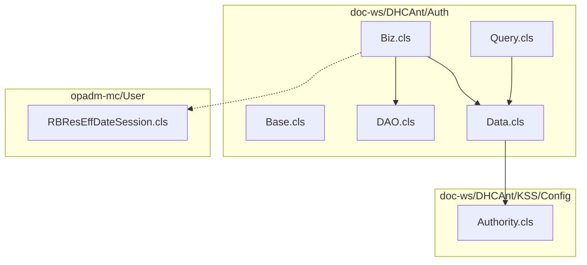
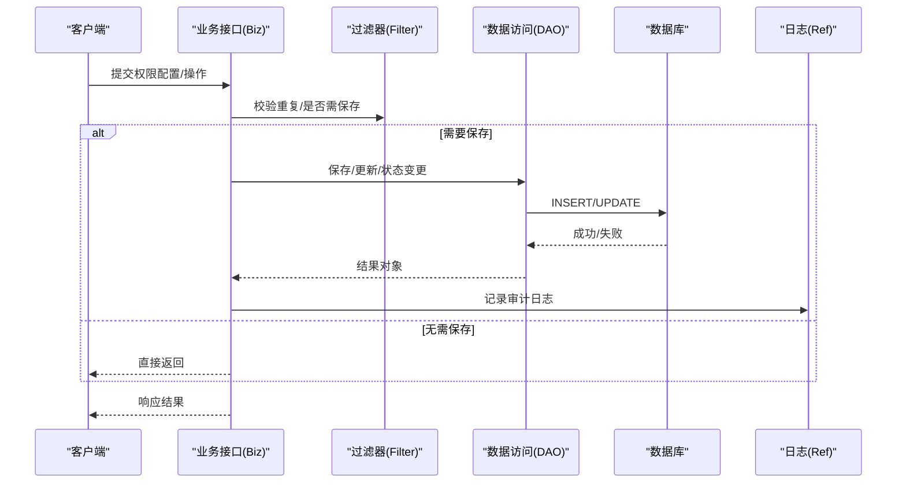
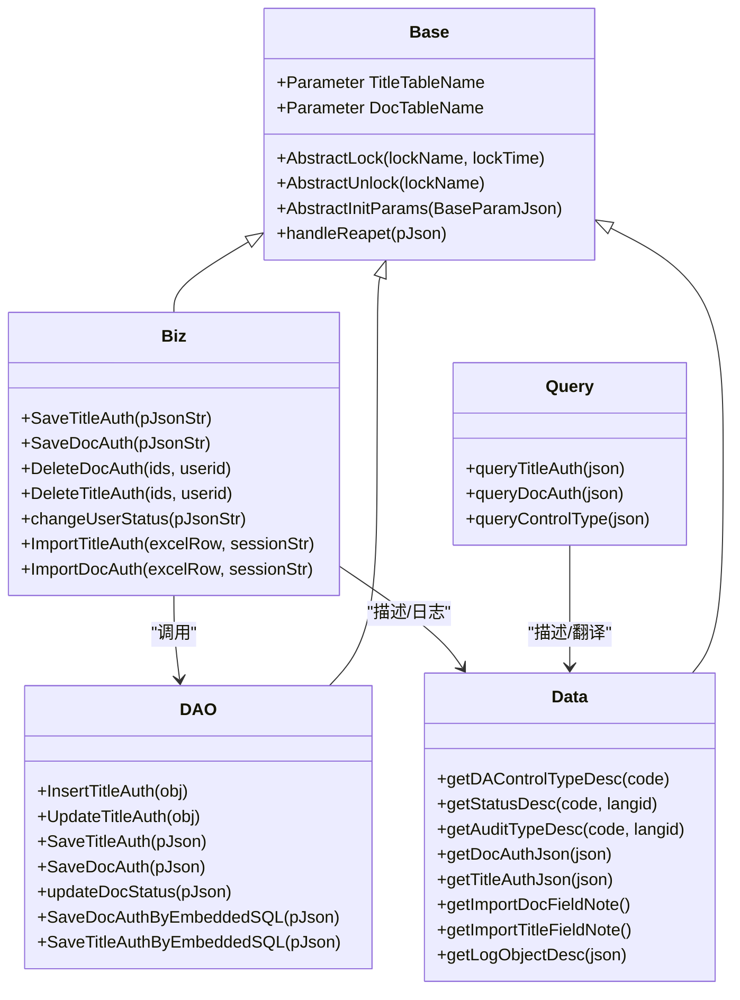
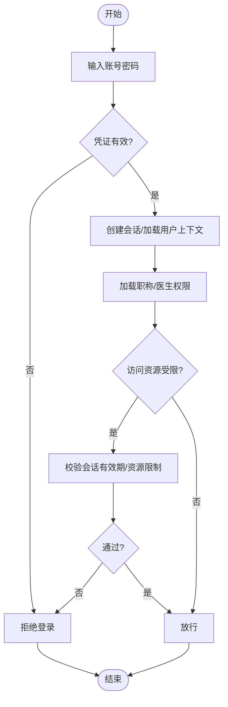
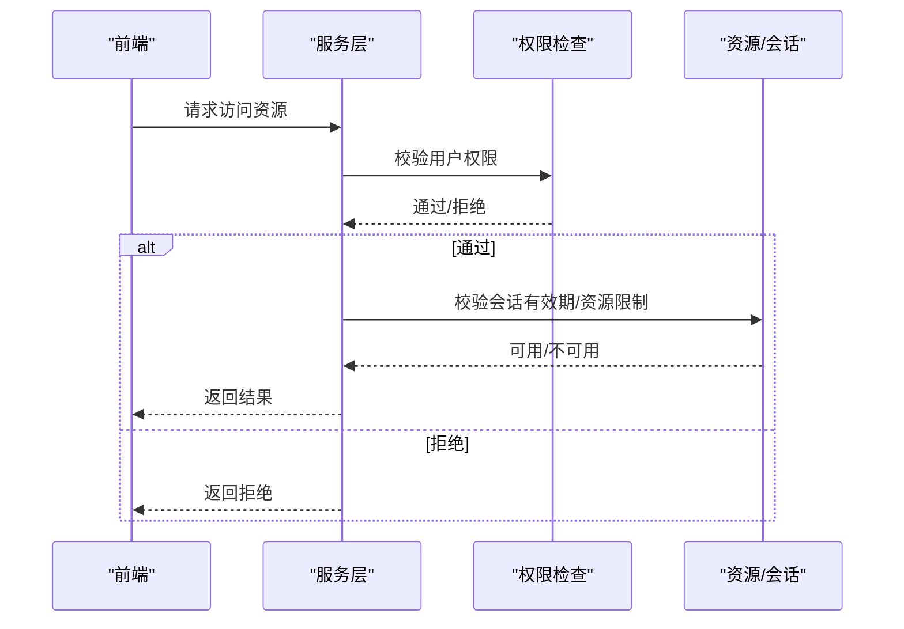
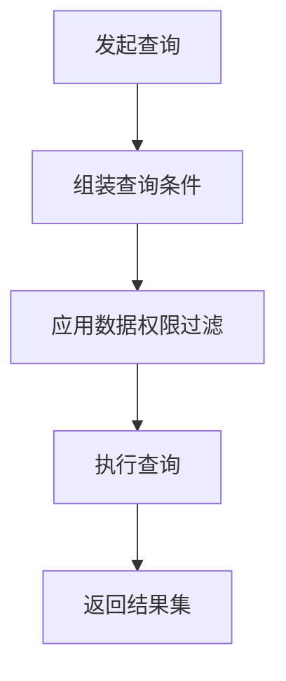
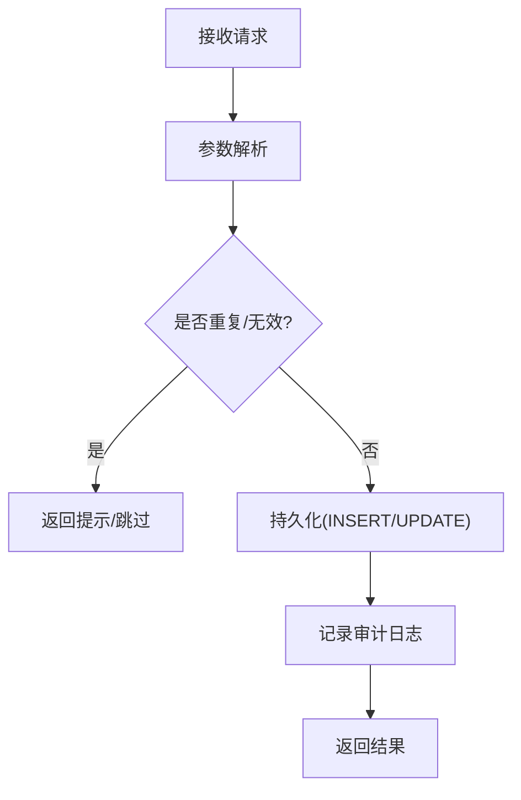
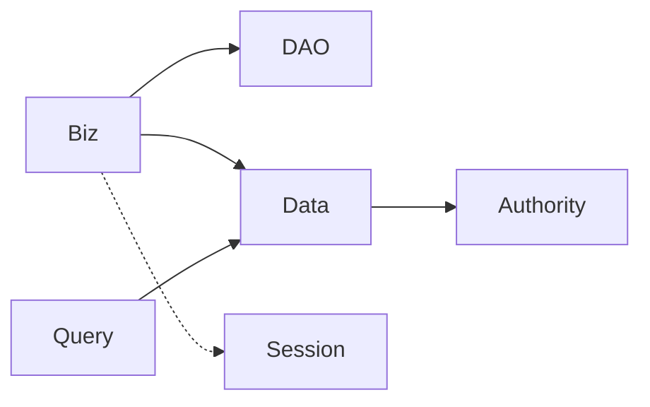

# 身份认证与授权

<cite>
**本文引用的文件**
- [Base.cls](file://src/backend/doc-ws/DHCAnt/Auth/Base.cls)
- [Biz.cls](file://src/backend/doc-ws/DHCAnt/Auth/Biz.cls)
- [DAO.cls](file://src/backend/doc-ws/DHCAnt/Auth/DAO.cls)
- [Data.cls](file://src/backend/doc-ws/DHCAnt/Auth/Data.cls)
- [Query.cls](file://src/backend/doc-ws/DHCAnt/Auth/Query.cls)
- [Authority.cls](file://src/backend/doc-ws/DHCAnt/KSS/Config/Authority.cls)
- [RBResEffDateSession.cls](file://src/backend/opadm-mc/User/RBResEffDateSession.cls)
</cite>

## 目录
1. [简介](#简介)
2. [项目结构](#项目结构)
3. [核心组件](#核心组件)
4. [架构总览](#架构总览)
5. [详细组件分析](#详细组件分析)
6. [依赖关系分析](#依赖关系分析)
7. [性能考虑](#性能考虑)
8. [故障排查指南](#故障排查指南)
9. [结论](#结论)
10. [附录：权限配置示例与常见场景](#附录：权限配置示例与常见场景)

## 简介
本文件聚焦 IRIS HIS 系统的身份认证与授权机制，围绕用户登录验证、会话管理、基于角色的访问控制（RBAC）、功能权限与数据权限的细粒度控制展开。结合仓库中“临床用药”模块的权限体系（职称/医生维度）与会话资源模型，给出可落地的实现方案、流程图与排错指引。

## 项目结构
与认证授权相关的代码主要分布在以下位置：
- doc-ws/DHCAnt/Auth：临床用药领域的权限定义、业务编排、数据访问与查询展示
- doc-ws/DHCAnt/KSS/Config：权限字典与策略配置（如控制类型）
- opadm-mc/User：会话与资源有效期等基础能力（用于会话管理与资源调度）

图表来源
- [Base.cls:1-41](file://src/backend/doc-ws/DHCAnt/Auth/Base.cls#L1-L41)
- [Biz.cls:1-259](file://src/backend/doc-ws/DHCAnt/Auth/Biz.cls#L1-L259)
- [DAO.cls:1-188](file://src/backend/doc-ws/DHCAnt/Auth/DAO.cls#L1-L188)
- [Data.cls:1-168](file://src/backend/doc-ws/DHCAnt/Auth/Data.cls#L1-L168)
- [Query.cls:1-143](file://src/backend/doc-ws/DHCAnt/Auth/Query.cls#L1-L143)
- [Authority.cls](file://src/backend/doc-ws/DHCAnt/KSS/Config/Authority.cls)
- [RBResEffDateSession.cls:1-705](file://src/backend/opadm-mc/User/RBResEffDateSession.cls#L1-L705)

章节来源
- [Base.cls:1-41](file://src/backend/doc-ws/DHCAnt/Auth/Base.cls#L1-L41)
- [Biz.cls:1-259](file://src/backend/doc-ws/DHCAnt/Auth/Biz.cls#L1-L259)
- [DAO.cls:1-188](file://src/backend/doc-ws/DHCAnt/Auth/DAO.cls#L1-L188)
- [Data.cls:1-168](file://src/backend/doc-ws/DHCAnt/Auth/Data.cls#L1-L168)
- [Query.cls:1-143](file://src/backend/doc-ws/DHCAnt/Auth/Query.cls#L1-L143)
- [Authority.cls](file://src/backend/doc-ws/DHCAnt/KSS/Config/Authority.cls)
- [RBResEffDateSession.cls:1-705](file://src/backend/opadm-mc/User/RBResEffDateSession.cls#L1-L705)

## 核心组件
- 基类与表映射：提供表名、类名常量及通用方法占位，统一权限子域的基础能力
- 业务层（Biz）：封装保存/删除/启用停用、导入等业务流程，负责参数校验、日志记录与结果返回
- 数据访问层（DAO）：将 JSON 参数映射为 SQL 字段并执行插入/更新/状态变更
- 数据与展示（Data/Query）：提供描述翻译、列表查询、过滤条件适配、导入模板说明等
- 权限策略配置（Authority）：集中维护控制类型等字典值
- 会话与资源（Session）：提供会话时间片、有效期、限制等能力，支撑资源级访问控制

章节来源
- [Base.cls:1-41](file://src/backend/doc-ws/DHCAnt/Auth/Base.cls#L1-L41)
- [Biz.cls:1-259](file://src/backend/doc-ws/DHCAnt/Auth/Biz.cls#L1-L259)
- [DAO.cls:1-188](file://src/backend/doc-ws/DHCAnt/Auth/DAO.cls#L1-L188)
- [Data.cls:1-168](file://src/backend/doc-ws/DHCAnt/Auth/Data.cls#L1-L168)
- [Query.cls:1-143](file://src/backend/doc-ws/DHCAnt/Auth/Query.cls#L1-L143)
- [Authority.cls](file://src/backend/doc-ws/DHCAnt/KSS/Config/Authority.cls)
- [RBResEffDateSession.cls:1-705](file://src/backend/opadm-mc/User/RBResEffDateSession.cls#L1-L705)

## 架构总览
下图展示了从请求进入、权限判定到数据访问的整体流程，涵盖“职称/医生”双维度的权限模型与 RBAC 思想。

图表来源
- [Biz.cls:1-259](file://src/backend/doc-ws/DHCAnt/Auth/Biz.cls#L1-L259)
- [DAO.cls:1-188](file://src/backend/doc-ws/DHCAnt/Auth/DAO.cls#L1-L188)

章节来源
- [Biz.cls:1-259](file://src/backend/doc-ws/DHCAnt/Auth/Biz.cls#L1-L259)
- [DAO.cls:1-188](file://src/backend/doc-ws/DHCAnt/Auth/DAO.cls#L1-L188)

## 详细组件分析

### 权限模型与职责划分
- 双维度权限
  - 职称维度：按“职称 + 管制分类”授予权限（如处方/医嘱权限），支持审核、临嘱/长嘱优先级等
  - 医生维度：按“具体医生 + 就诊类型 + 院区”授予权限，支持启用/停用、生效时间等
- 控制类型
  - 通过配置中心提供控制类型字典（如填写、禁止、申请单、越级、提示等）
- 审计与日志
  - 所有增删改均记录审计日志，包含对象描述、新旧值、操作人等

图表来源
- [Base.cls:1-41](file://src/backend/doc-ws/DHCAnt/Auth/Base.cls#L1-L41)
- [Biz.cls:1-259](file://src/backend/doc-ws/DHCAnt/Auth/Biz.cls#L1-L259)
- [DAO.cls:1-188](file://src/backend/doc-ws/DHCAnt/Auth/DAO.cls#L1-L188)
- [Data.cls:1-168](file://src/backend/doc-ws/DHCAnt/Auth/Data.cls#L1-L168)
- [Query.cls:1-143](file://src/backend/doc-ws/DHCAnt/Auth/Query.cls#L1-L143)

章节来源
- [Base.cls:1-41](file://src/backend/doc-ws/DHCAnt/Auth/Base.cls#L1-L41)
- [Biz.cls:1-259](file://src/backend/doc-ws/DHCAnt/Auth/Biz.cls#L1-L259)
- [DAO.cls:1-188](file://src/backend/doc-ws/DHCAnt/Auth/DAO.cls#L1-L188)
- [Data.cls:1-168](file://src/backend/doc-ws/DHCAnt/Auth/Data.cls#L1-L168)
- [Query.cls:1-143](file://src/backend/doc-ws/DHCAnt/Auth/Query.cls#L1-L143)

### 登录验证与鉴权流程（RBAC）
- 登录阶段
  - 校验用户名/密码（由平台账户体系负责）
  - 生成会话标识（SessionID），绑定用户上下文
- 鉴权阶段
  - 读取当前用户的角色/职称信息
  - 根据“职称/医生”双维度权限表判断是否具备某功能或数据的访问/操作权限
  - 若涉及资源访问（如诊室/时段），结合会话有效期与资源限制进行二次校验
- 决策输出
  - 允许/拒绝，必要时附加提示信息（如“需上级审核”）

[此图为概念性流程，不直接对应具体源码文件]

### 会话管理机制
- 会话时间片与有效期
  - 通过会话实体定义开始/结束时间、时间片长度、最大预约数、是否超订等
  - 支持按周循环、节假日忽略、诊室/院区等维度限制
- 资源级控制
  - 结合诊室、院区、患者类型等属性，对资源访问进行细粒度控制
- 与权限联动
  - 在资源访问前，先校验用户是否具备该资源的访问权限；再校验会话有效性

图表来源
- [RBResEffDateSession.cls:1-705](file://src/backend/opadm-mc/User/RBResEffDateSession.cls#L1-L705)

章节来源
- [RBResEffDateSession.cls:1-705](file://src/backend/opadm-mc/User/RBResEffDateSession.cls#L1-L705)

### 功能权限与数据权限
- 功能权限
  - 通过控制类型（如填写、禁止、申请单、越级、提示）控制菜单/按钮/接口的可见性与可操作性
- 数据权限
  - 按就诊类型（门诊/住院/急诊）、院区、医生/职称维度限定可访问的数据范围
  - 查询接口内置过滤条件，确保仅返回有权限的数据

图表来源
- [Query.cls:1-143](file://src/backend/doc-ws/DHCAnt/Auth/Query.cls#L1-L143)
- [Data.cls:1-168](file://src/backend/doc-ws/DHCAnt/Auth/Data.cls#L1-L168)

章节来源
- [Query.cls:1-143](file://src/backend/doc-ws/DHCAnt/Auth/Query.cls#L1-L143)
- [Data.cls:1-168](file://src/backend/doc-ws/DHCAnt/Auth/Data.cls#L1-L168)

### 保存/启用/删除权限的业务流程
- 保存职称/医生权限
  - 参数初始化 → 重复性检查 → 是否需要保存 → 写入数据 → 记录审计日志
- 启用/停用
  - 切换状态字段，同时设置启用/停用时间戳
- 删除
  - 批量删除并记录审计日志

图表来源
- [Biz.cls:1-259](file://src/backend/doc-ws/DHCAnt/Auth/Biz.cls#L1-L259)
- [DAO.cls:1-188](file://src/backend/doc-ws/DHCAnt/Auth/DAO.cls#L1-L188)

章节来源
- [Biz.cls:1-259](file://src/backend/doc-ws/DHCAnt/Auth/Biz.cls#L1-L259)
- [DAO.cls:1-188](file://src/backend/doc-ws/DHCAnt/Auth/DAO.cls#L1-L188)

## 依赖关系分析
- 低耦合分层
  - Biz 仅关注流程编排与日志，DAO 专注数据映射与执行，Data/Query 负责展示与翻译
- 外部依赖
  - 权限字典来自 KSS/Config 配置中心
  - 会话/资源能力来自 opadm-mc/User 下的会话实体
- 潜在风险
  - 若权限表与字典不一致，可能导致前端显示与后端逻辑偏差
  - 并发写入时需保证幂等与唯一约束（如重复配置拦截）

图表来源
- [Biz.cls:1-259](file://src/backend/doc-ws/DHCAnt/Auth/Biz.cls#L1-L259)
- [DAO.cls:1-188](file://src/backend/doc-ws/DHCAnt/Auth/DAO.cls#L1-L188)
- [Data.cls:1-168](file://src/backend/doc-ws/DHCAnt/Auth/Data.cls#L1-L168)
- [Authority.cls](file://src/backend/doc-ws/DHCAnt/KSS/Config/Authority.cls)
- [RBResEffDateSession.cls:1-705](file://src/backend/opadm-mc/User/RBResEffDateSession.cls#L1-L705)

章节来源
- [Biz.cls:1-259](file://src/backend/doc-ws/DHCAnt/Auth/Biz.cls#L1-L259)
- [DAO.cls:1-188](file://src/backend/doc-ws/DHCAnt/Auth/DAO.cls#L1-L188)
- [Data.cls:1-168](file://src/backend/doc-ws/DHCAnt/Auth/Data.cls#L1-L168)
- [Authority.cls](file://src/backend/doc-ws/DHCAnt/KSS/Config/Authority.cls)
- [RBResEffDateSession.cls:1-705](file://src/backend/opadm-mc/User/RBResEffDateSession.cls#L1-L705)

## 性能考虑
- 查询优化
  - 使用分页与最小字段集返回，避免全量扫描
  - 利用索引字段（如就诊类型、院区、医生ID）构建高效过滤
- 写入优化
  - 批量导入时采用事务与批处理，减少往返
  - 幂等设计避免重复写入
- 缓存建议
  - 对静态字典（控制类型、就诊类型）进行缓存，降低频繁查库

[本节为通用指导，不直接分析具体文件]

## 故障排查指南
- 常见问题
  - 重复配置：检查“是否已存在”的过滤逻辑与唯一约束
  - 权限未生效：确认启用/停用时间与当前时间关系
  - 数据不一致：核对字典配置与权限表字段映射
- 定位步骤
  - 查看审计日志中的对象描述与新/旧值
  - 检查 DAO 层的 SQL 映射是否正确
  - 校验 Query 层的过滤条件是否符合预期

章节来源
- [Biz.cls:1-259](file://src/backend/doc-ws/DHCAnt/Auth/Biz.cls#L1-L259)
- [Data.cls:132-168](file://src/backend/doc-ws/DHCAnt/Auth/Data.cls#L132-L168)
- [DAO.cls:1-188](file://src/backend/doc-ws/DHCAnt/Auth/DAO.cls#L1-L188)

## 结论
本系统采用“职称/医生”双维度权限模型，结合 RBAC 思想与资源级会话控制，实现了功能与数据的双重细粒度管控。通过清晰的层次划分与完善的审计日志，保障了权限配置的可追溯性与可维护性。建议在后续迭代中引入更灵活的策略引擎与缓存机制，进一步提升扩展性与性能。

## 附录：权限配置示例与常见场景
- 配置示例（以导入为例）
  - 医生权限导入字段：工号、姓名、就诊类型、管制分类代码、用药权限、审核权限、临嘱权限、长嘱权限、院区代码
  - 职称权限导入字段：职称、就诊类型、管制分类代码、用药权限、审核权限、临嘱权限、长嘱权限、院区代码
- 常见场景
  - 门诊医生仅能开具门诊医嘱
  - 高级职称可在特定院区越级审批
  - 新入职医生在启用日期前不可操作
  - 临时禁用某医生的处方权限

章节来源
- [Data.cls:61-130](file://src/backend/doc-ws/DHCAnt/Auth/Data.cls#L61-L130)
- [Biz.cls:203-259](file://src/backend/doc-ws/DHCAnt/Auth/Biz.cls#L203-L259)