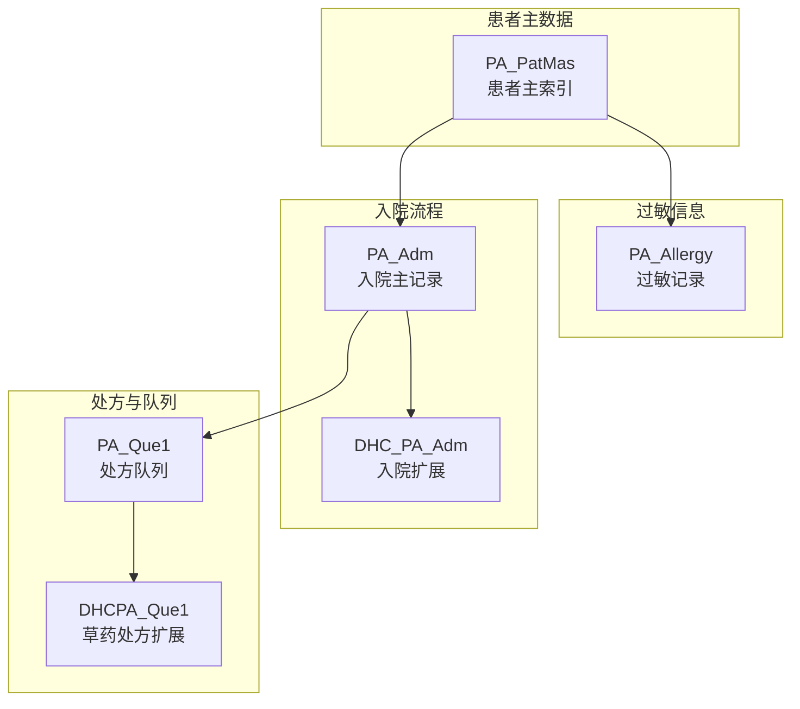
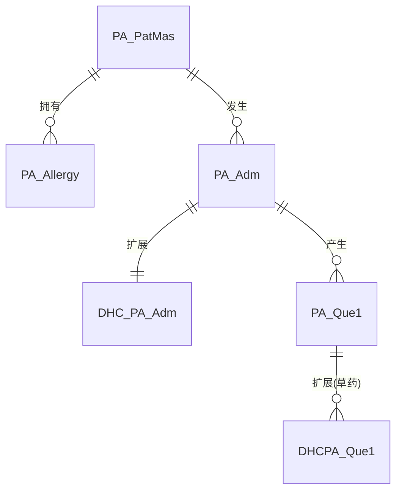
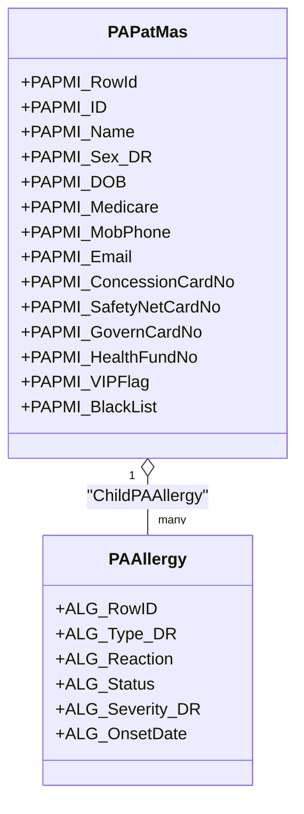
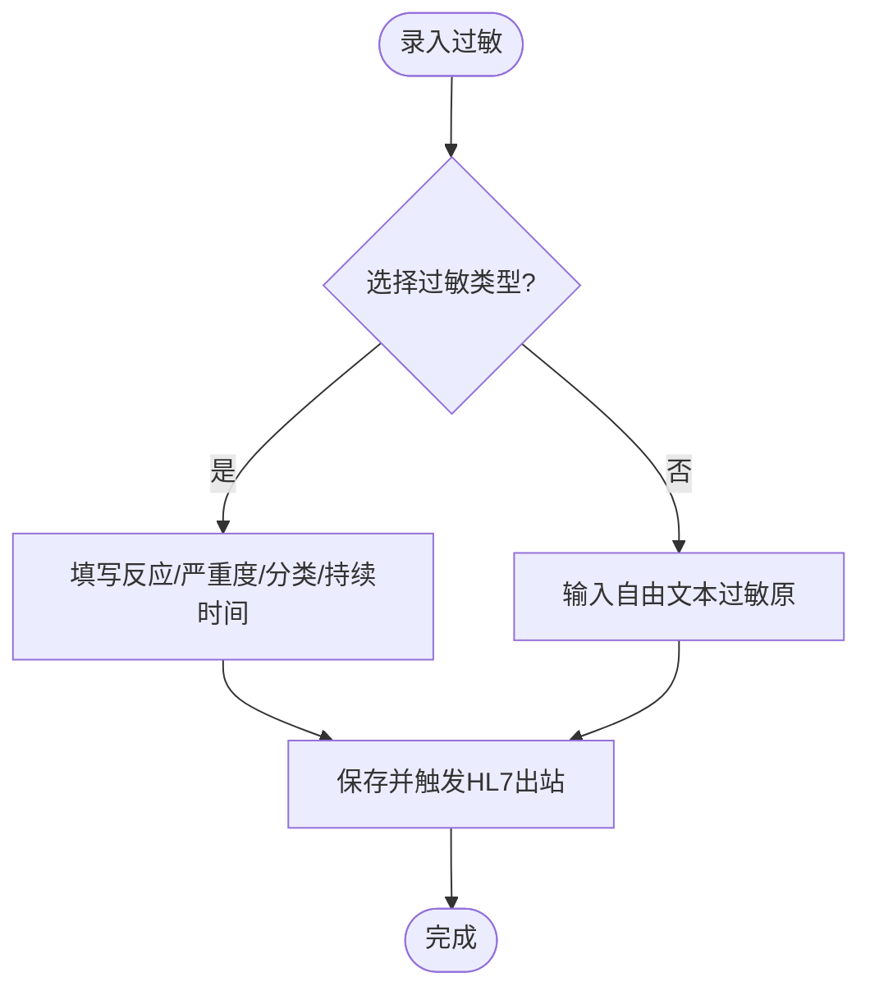
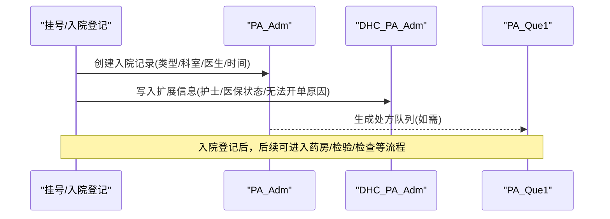
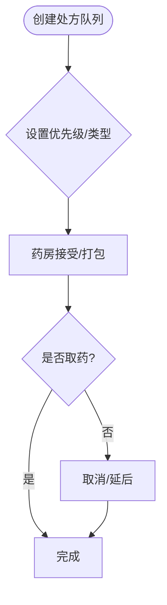
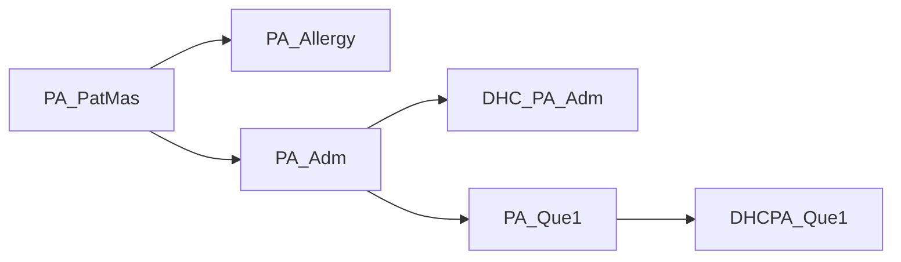

# 患者管理表

<cite>
**本文档引用的文件**
- [PAQue1.cls](file://src/backend/doc-ws/User/PAQue1.cls)
- [DHCPAQue1.cls](file://src/backend/doc-ws/User/DHCPAQue1.cls)
- [PAAllergy.cls](file://src/backend/doc-ws/User/PAAllergy.cls)
- [DHCPAAdm.cls](file://src/backend/doc-ws/User/DHCPAAdm.cls)
- [PAPatMas.cls](file://src/backend/epmi-mc/User/PAPatMas.cls)
- [PAAdm.cls](file://src/backend/opadm-mc/User/PAAdm.cls)
</cite>

## 目录
1. [简介](#简介)
2. [项目结构](#项目结构)
3. [核心组件](#核心组件)
4. [架构总览](#架构总览)
5. [详细组件分析](#详细组件分析)
6. [依赖关系分析](#依赖关系分析)
7. [性能考虑](#性能考虑)
8. [故障排查指南](#故障排查指南)
9. [结论](#结论)
10. [附录](#附录)

## 简介
本文件围绕患者主数据、过敏信息、入院流程与处方队列等关键业务，梳理并说明以下数据库表的数据结构与业务流程：
- PA_Que1（患者基本信息/排队与药房相关）
- PA_Allergy（过敏信息）
- DHC_PA_Adm（入院扩展信息）
- PA_PatMas（患者主索引）
- PA_Adm（入院主记录）
- DHCPA_Que1（草药处方扩展）

文档同时覆盖患者信息维护、过敏史管理、入院登记/科室分配/床位管理等操作的数据支持，并提供查询与统计的SQL示例。最后给出隐私保护与访问控制建议。

## 项目结构
围绕患者管理的核心类与表分布如下：
- 患者主数据：PA_PatMas（PA_PatMas）
- 过敏信息：PA_Allergy（PA_Allergy）
- 入院主记录：PA_Adm（PA_Adm）
- 入院扩展：DHC_PA_Adm（DHC_PA_Adm）
- 处方队列：PA_Que1（PA_Que1）、DHCPA_Que1（DHCPA_Que1）

图表来源
- [PAPatMas.cls:1-120](file://src/backend/epmi-mc/User/PAPatMas.cls#L1-L120)
- [PAAllergy.cls:1-120](file://src/backend/doc-ws/User/PAAllergy.cls#L1-L120)
- [PAAdm.cls:1-120](file://src/backend/opadm-mc/User/PAAdm.cls#L1-L120)
- [DHCPAAdm.cls:1-80](file://src/backend/doc-ws/User/DHCPAAdm.cls#L1-L80)
- [PAQue1.cls:1-120](file://src/backend/doc-ws/User/PAQue1.cls#L1-L120)
- [DHCPAQue1.cls:1-120](file://src/backend/doc-ws/User/DHCPAQue1.cls#L1-L120)

章节来源
- [PAPatMas.cls:1-120](file://src/backend/epmi-mc/User/PAPatMas.cls#L1-L120)
- [PAAllergy.cls:1-120](file://src/backend/doc-ws/User/PAAllergy.cls#L1-L120)
- [PAAdm.cls:1-120](file://src/backend/opadm-mc/User/PAAdm.cls#L1-L120)
- [DHCPAAdm.cls:1-80](file://src/backend/doc-ws/User/DHCPAAdm.cls#L1-L80)
- [PAQue1.cls:1-120](file://src/backend/doc-ws/User/PAQue1.cls#L1-L120)
- [DHCPAQue1.cls:1-120](file://src/backend/doc-ws/User/DHCPAQue1.cls#L1-L120)

## 核心组件
- 患者主索引（PA_PatMas）：承载患者身份、联系方式、医保与保险、语言与地区、VIP/黑名单等基础信息，并与过敏记录建立一对多关系。
- 过敏信息（PA_Allergy）：按患者维度记录过敏原、反应、严重程度、状态、持续时间、是否需特殊餐食等，支持分类与外部系统对接。
- 入院主记录（PA_Adm）：记录一次就诊/住院事件的核心信息，包括类型、来源、科室、医生、时间、状态、房间/病区/床位、转科/转床、费用与结算标志等。
- 入院扩展（DHC_PA_Adm）：对入院流程进行扩展，如主责护士、出院医生、退院/返回标记、无法开单原因、医保结算状态、质控护士等。
- 处方队列（PA_Que1 / DHCPA_Que1）：记录处方进入药房/煎药队列的状态、优先级、接受/打包/取药时间、开始/结束日期、接收科室、频次/用法/用量、代煎参数等；DHCPA_Que1侧重草药处方的扩展字段。

章节来源
- [PAPatMas.cls:1-200](file://src/backend/epmi-mc/User/PAPatMas.cls#L1-L200)
- [PAAllergy.cls:1-140](file://src/backend/doc-ws/User/PAAllergy.cls#L1-L140)
- [PAAdm.cls:1-200](file://src/backend/opadm-mc/User/PAAdm.cls#L1-L200)
- [DHCPAAdm.cls:1-120](file://src/backend/doc-ws/User/DHCPAAdm.cls#L1-L120)
- [PAQue1.cls:1-120](file://src/backend/doc-ws/User/PAQue1.cls#L1-L120)
- [DHCPAQue1.cls:1-120](file://src/backend/doc-ws/User/DHCPAQue1.cls#L1-L120)

## 架构总览
下图展示患者主数据、过敏、入院与处方队列之间的关联与数据流向。

图表来源
- [PAPatMas.cls:1-120](file://src/backend/epmi-mc/User/PAPatMas.cls#L1-L120)
- [PAAllergy.cls:1-120](file://src/backend/doc-ws/User/PAAllergy.cls#L1-L120)
- [PAAdm.cls:1-120](file://src/backend/opadm-mc/User/PAAdm.cls#L1-L120)
- [DHCPAAdm.cls:1-80](file://src/backend/doc-ws/User/DHCPAAdm.cls#L1-L80)
- [PAQue1.cls:1-120](file://src/backend/doc-ws/User/PAQue1.cls#L1-L120)
- [DHCPAQue1.cls:1-120](file://src/backend/doc-ws/User/DHCPAQue1.cls#L1-L120)

## 详细组件分析

### 患者基本信息（PA_PatMas）
- 身份信息：患者编号（含门诊/住院号）、ID、姓名系列、别名、性别、出生日期、估计年龄、语言偏好、国籍/地区、出生地等。
- 联系方式：电话、手机、邮箱、第二电话等。
- 医保与保险：医保号、医保后缀、医保到期日、健康基金号、保险卡持有人、安全网卡号及有效期、政府卡号等。
- 其他：VIP标识、黑名单、备注、紧急联系人/付费责任人、教育程度、特殊患者编号等。
- 关系：与过敏记录为一对多关系。

图表来源
- [PAPatMas.cls:1-200](file://src/backend/epmi-mc/User/PAPatMas.cls#L1-L200)
- [PAAllergy.cls:1-120](file://src/backend/doc-ws/User/PAAllergy.cls#L1-L120)

章节来源
- [PAPatMas.cls:1-200](file://src/backend/epmi-mc/User/PAPatMas.cls#L1-L200)

### 过敏信息（PA_Allergy）
- 过敏原与反应：过敏类型、输入文本、通用药/子分类、补充描述、自由文本等。
- 严重度与分类：严重度、类别、MRC分类、成分等。
- 状态与时间：状态（活动/已解决/非活跃/待确认）、记录日期、起病日期、持续天数/月/年、更新时间。
- 护理与医嘱联动：是否需要协助餐食/菜单、皮肤试验阳性标记、对应医嘱ID。
- 审计与外部：更新用户、医院、外部ID、变更原因等。

图表来源
- [PAAllergy.cls:1-160](file://src/backend/doc-ws/User/PAAllergy.cls#L1-L160)

章节来源
- [PAAllergy.cls:1-160](file://src/backend/doc-ws/User/PAAllergy.cls#L1-L160)

### 入院流程（PA_Adm 与 DHC_PA_Adm）
- 入院主记录（PA_Adm）：包含患者引用、类型（门急诊/住院/急救/新生儿/健康促进）、来源、科室、医生、预计/实际入院时间、状态、隔离/保密、预估住院时长、房间/病区/床位、转科/转床、诊断/手术、费用与结算标志、随访/转诊信息等。
- 入院扩展（DHC_PA_Adm）：主责护士、出院医生、退院/返回标记、无法开单原因与时间、医保结算状态、质控护士、主管医生2等。

图表来源
- [PAAdm.cls:1-200](file://src/backend/opadm-mc/User/PAAdm.cls#L1-L200)
- [DHCPAAdm.cls:1-120](file://src/backend/doc-ws/User/DHCPAAdm.cls#L1-L120)
- [PAQue1.cls:1-120](file://src/backend/doc-ws/User/PAQue1.cls#L1-L120)

章节来源
- [PAAdm.cls:1-200](file://src/backend/opadm-mc/User/PAAdm.cls#L1-L200)
- [DHCPAAdm.cls:1-120](file://src/backend/doc-ws/User/DHCPAAdm.cls#L1-L120)

### 处方队列（PA_Que1 与 DHCPA_Que1）
- PA_Que1：记录处方进入队列后的状态流转（接受、打包、取药、取消），以及优先级、处方号、交易时间、科室、医生、代办人信息等；提供多个索引以优化查询。
- DHCPA_Que1：针对草药处方的扩展，包含处方类型、频次、用法、用量、代煎方式、包装方式、停止时间、诊断、长期医嘱关联、慢病ID、服药方式、水温、取药方式、附加说明、保密标识、重量、翻渣次数、煎药时间与容量等。

图表来源
- [PAQue1.cls:1-120](file://src/backend/doc-ws/User/PAQue1.cls#L1-L120)
- [DHCPAQue1.cls:1-140](file://src/backend/doc-ws/User/DHCPAQue1.cls#L1-L140)

章节来源
- [PAQue1.cls:1-120](file://src/backend/doc-ws/User/PAQue1.cls#L1-L120)
- [DHCPAQue1.cls:1-140](file://src/backend/doc-ws/User/DHCPAQue1.cls#L1-L140)

## 依赖关系分析
- 患者主索引（PA_PatMas）与过敏（PA_Allergy）为“一”对“多”的关系，便于按患者聚合过敏历史。
- 入院主记录（PA_Adm）与扩展（DHC_PA_Adm）为“一对一”，用于区分核心流程与扩展属性。
- 入院（PA_Adm）驱动处方队列（PA_Que1），草药处方通过DHCPA_Que1进一步扩展。
- 多处使用字典/参考表（如科室、医生、病房、药品、频率、用法等），通过DR字段实现规范化。

图表来源
- [PAPatMas.cls:1-120](file://src/backend/epmi-mc/User/PAPatMas.cls#L1-L120)
- [PAAllergy.cls:1-120](file://src/backend/doc-ws/User/PAAllergy.cls#L1-L120)
- [PAAdm.cls:1-120](file://src/backend/opadm-mc/User/PAAdm.cls#L1-L120)
- [DHCPAAdm.cls:1-80](file://src/backend/doc-ws/User/DHCPAAdm.cls#L1-L80)
- [PAQue1.cls:1-120](file://src/backend/doc-ws/User/PAQue1.cls#L1-L120)
- [DHCPAQue1.cls:1-120](file://src/backend/doc-ws/User/DHCPAQue1.cls#L1-L120)

章节来源
- [PAPatMas.cls:1-120](file://src/backend/epmi-mc/User/PAPatMas.cls#L1-L120)
- [PAAllergy.cls:1-120](file://src/backend/doc-ws/User/PAAllergy.cls#L1-L120)
- [PAAdm.cls:1-120](file://src/backend/opadm-mc/User/PAAdm.cls#L1-L120)
- [DHCPAAdm.cls:1-80](file://src/backend/doc-ws/User/DHCPAAdm.cls#L1-L80)
- [PAQue1.cls:1-120](file://src/backend/doc-ws/User/PAQue1.cls#L1-L120)
- [DHCPAQue1.cls:1-120](file://src/backend/doc-ws/User/DHCPAQue1.cls#L1-L120)

## 性能考虑
- 索引策略：各表均定义常用查询路径的索引（如按日期、科室、状态、处方号、入院号等），有利于快速检索与报表统计。
- 存储映射：采用结构化存储与节点存储结合，列表型字段（如备注、描述）使用节点存储，减少大字段对行扫描的影响。
- 计算字段：部分显示字段通过计算字段或视图组合，避免在高频查询中重复计算。
- 建议：对高基数列（如日期、流水号）建立合适索引；对复杂报表可考虑物化视图或汇总表；批量导入时关闭非必要触发器以提升吞吐。

[本节为通用性能建议，不直接分析具体文件]

## 故障排查指南
- 过敏记录未同步：检查插入/更新/删除触发器是否调用HL7出站逻辑；确认外部系统通道可用。
- 入院扩展字段缺失：核对DHC_PA_Adm扩展字段是否由前端或接口正确写入；关注无法开单原因与医保结算状态。
- 处方队列异常：根据状态与时间字段定位卡点（接受/打包/取药/取消），结合优先级与科室筛选问题范围。
- 日志与审计：利用表的“最后更新用户/时间”字段与触发器日志，回溯变更轨迹。

章节来源
- [PAAllergy.cls:140-180](file://src/backend/doc-ws/User/PAAllergy.cls#L140-L180)
- [DHCPAAdm.cls:1-120](file://src/backend/doc-ws/User/DHCPAAdm.cls#L1-L120)
- [PAQue1.cls:90-130](file://src/backend/doc-ws/User/PAQue1.cls#L90-L130)

## 结论
本仓库通过PA_PatMas、PA_Allergy、PA_Adm、DHC_PA_Adm、PA_Que1与DHCPA_Que1等表，构建了从患者主数据到过敏管理、入院流程与处方队列的完整数据模型。借助合理的索引与触发器机制，支撑了日常业务的高效运行与对外集成。建议在现有基础上继续完善权限控制、脱敏策略与审计追踪，以满足更严格的隐私合规要求。

[本节为总结性内容，不直接分析具体文件]

## 附录

### 字段结构速览（关键字段）
- 患者主索引（PA_PatMas）
  - 身份：PAPMI_ID、PAPMI_Name、PAPMI_Sex_DR、PAPMI_DOB
  - 联系：PAPMI_MobPhone、PAPMI_Email、PAPMI_SecondPhone
  - 医保：PAPMI_Medicare、PAPMI_MedicareExpDate、PAPMI_HealthFundNo、PAPMI_ConcessionCardNo、PAPMI_SafetyNetCardNo、PAPMI_GovernCardNo
  - 其他：PAPMI_VIPFlag、PAPMI_BlackList、PAPMI_Remark
- 过敏信息（PA_Allergy）
  - 过敏原：ALG_Type_DR、ALG_Entered、ALG_OthAllergy、ALG_FreeTextAllergy
  - 严重度/分类：ALG_Severity_DR、ALG_Category_DR、ALG_MRCAllType_DR
  - 状态/时间：ALG_Status、ALG_Date、ALG_OnsetDate、ALG_DuratDays/Month/Year
  - 护理联动：ALG_RequireAssistanceMeal/Menu、ALG_SkinTestFlag、ALG_SkinTestOEORI_DR
- 入院主记录（PA_Adm）
  - 基本：PAADM_ADMNo、PAADM_Type、PAADM_DepCode_DR、PAADM_AdmDocCodeDR
  - 时间/状态：PAADM_AdmDate/Time、PAADM_VisitStatus、PAADM_CurrentRoom/Ward/BED
  - 费用/结算：PAADM_BillFlag、PAADM_EstimDischargeDate/Time
- 入院扩展（DHC_PA_Adm）
  - 责任：DHCADM_MainNurse_Dr、DHCADM_DischgDoc_Dr、DHCADM_QualityNurse_Id
  - 状态：DHCADM_Status、DHCADM_IntMedicareStatus
  - 无法开单：DHCADM_UnableOrder/Reason/Date/Time
- 处方队列（PA_Que1 / DHCPA_Que1）
  - 队列：QUE1_No、QUE1_PharmStatus、QUE1_Priority、QUE1_PrescNo
  - 时间：QUE1_DateAccepted/TimeAccepted、QUE1_DatePacked/TimePacked、QUE1_DateCollected/TimeCollected
  - 草药扩展：DHCQue_PrescType/Freq/Instr/Qty/UOM、CookMode/CookML/CookDuratQty、SecrecyFlag、Weight、UseNum

章节来源
- [PAPatMas.cls:1-200](file://src/backend/epmi-mc/User/PAPatMas.cls#L1-L200)
- [PAAllergy.cls:1-140](file://src/backend/doc-ws/User/PAAllergy.cls#L1-L140)
- [PAAdm.cls:1-200](file://src/backend/opadm-mc/User/PAAdm.cls#L1-L200)
- [DHCPAAdm.cls:1-120](file://src/backend/doc-ws/User/DHCPAAdm.cls#L1-L120)
- [PAQue1.cls:1-120](file://src/backend/doc-ws/User/PAQue1.cls#L1-L120)
- [DHCPAQue1.cls:1-140](file://src/backend/doc-ws/User/DHCPAQue1.cls#L1-L140)

### 患者信息查询与统计SQL示例
以下为常见查询思路（请根据实际列名与数据库方言调整）：
- 查询某患者的过敏清单（活动且严重度高）
  - SELECT a.* FROM PA_Allergy a WHERE a.ALG_PAPMI_ParRef = '患者主键' AND a.ALG_Status IN ('Active','ToBeConfirmed') ORDER BY a.ALG_Severity_DR DESC;
- 统计某科室近一月入院人数
  - SELECT COUNT(*) FROM PA_Adm WHERE PAADM_DepCode_DR = '科室代码' AND PAADM_AdmDate BETWEEN '起始日期' AND '截止日期';
- 查询当前在院患者及其床位
  - SELECT p.PAPMI_Name, a.PAADM_CurrentBed_DR, a.PAADM_CurrentWard_DR FROM PA_Adm a JOIN PA_PatMas p ON a.PAADM_PAPMI_DR = p.PAPMI_RowId WHERE a.PAADM_VisitStatus IN ('Admit','Pre-Admission');
- 查询药房队列中待处理处方
  - SELECT * FROM PA_Que1 WHERE QUE1_PharmStatus NOT IN ('已完成','取消') ORDER BY QUE1_Priority, QUE1_TransDate;
- 统计草药处方代煎配置
  - SELECT DHCQue_PrescName, DHCQue_CookMode, DHCQue_CookML, DHCQue_CookDuratQty FROM DHCPA_Que1 WHERE DHCQue_PrescStartDate >= '起始日期';

[以上为概念性SQL示例，需结合实际表结构与数据库方言使用]

### 患者数据隐私保护与访问控制建议
- 最小权限原则：仅授予必要角色对患者敏感字段（身份证、医保号、手机号、邮箱等）的读取/修改权限。
- 字段级脱敏：在查询层对敏感字段进行掩码或脱敏输出，避免明文暴露。
- 审计追踪：开启关键表的变更审计（创建/更新/删除），记录操作人、时间、前后值。
- 传输加密：对外接口（如HL7出站）启用TLS加密，限制来源IP与认证。
- 数据留存策略：制定归档与销毁策略，定期清理过期或冗余数据。
- 访问日志：记录所有对敏感数据的访问行为，支持事后追溯与告警。

[本节为通用安全建议，不直接分析具体文件]