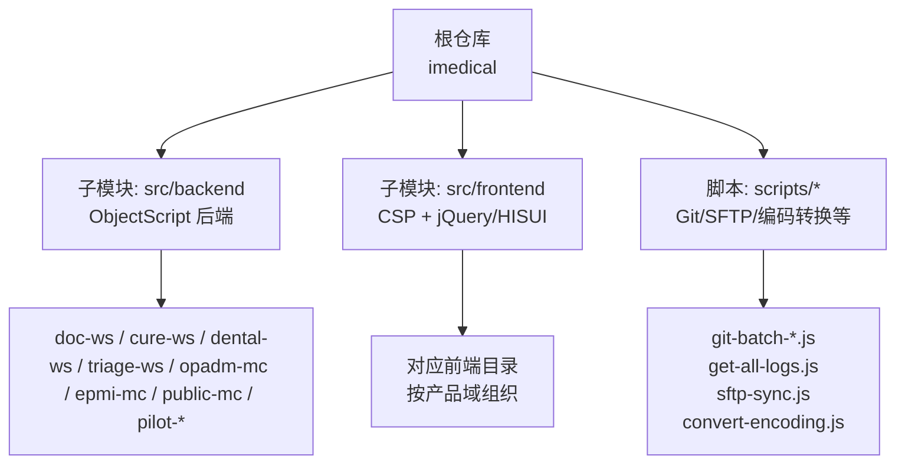
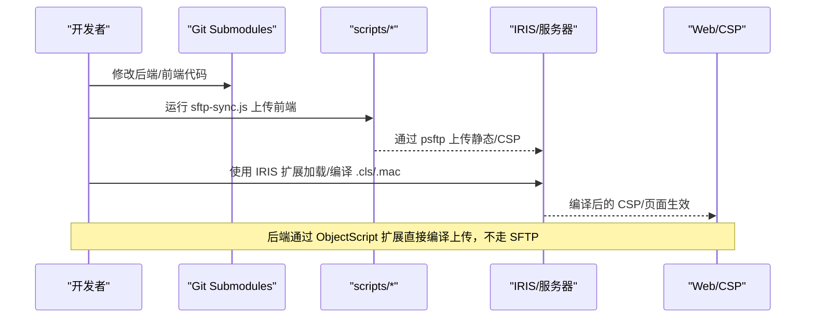
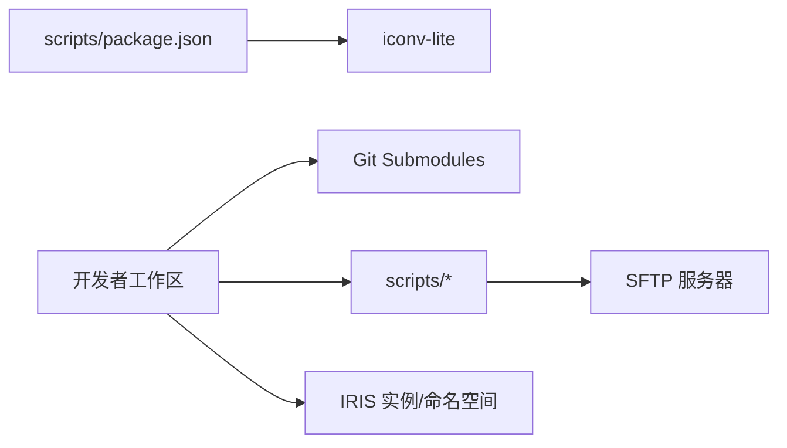

# 更新日志

<cite>
**本文引用的文件**
- [README.md](file://README.md)
- [CONTRIBUTING.md](file://CONTRIBUTING.md)
- [scripts/package.json](file://scripts/package.json)
</cite>

## 目录
1. [简介](#简介)
2. [项目结构](#项目结构)
3. [核心组件](#核心组件)
4. [架构总览](#架构总览)
5. [详细组件分析](#详细组件分析)
6. [依赖分析](#依赖分析)
7. [性能考虑](#性能考虑)
8. [故障排查指南](#故障排查指南)
9. [结论](#结论)
10. [附录](#附录)

## 简介
本更新日志用于记录 IRIS HIS 项目的版本演进、变更说明与兼容性信息，帮助团队与用户了解系统发展脉络、规划升级路径并规避风险。当前仓库未包含按版本划分的发布说明或变更记录，因此本日志以“框架模板”形式提供：
- 版本历史：待补充（建议通过 Git 标签/分支与提交历史生成）
- 变更说明：功能新增、缺陷修复、性能优化、安全更新等分类条目
- 兼容性：向后兼容策略、破坏性变更与迁移指引
- 已知问题与临时方案：记录当前限制与规避方法
- 升级注意事项：部署顺序、配置项变更、依赖升级影响

说明：由于仓库中未发现显式的版本清单或发布说明文件，以下内容为通用模板与基于现有工程信息的实践建议，便于后续持续填充与维护。

## 项目结构
IRIS HIS 采用前后端分离的模块化组织方式：
- 后端：InterSystems IRIS ObjectScript，按产品域划分（医生工作站、治疗、牙科、分诊、门诊挂号、患者主索引、公共模块、试点项目/研究等）
- 前端：CSP + jQuery/HISUI，按产品域划分，统一通过脚本上传至服务器
- 工具脚本：Git 多仓库管理、SFTP 同步、编码转换等辅助脚本

图表来源
- [README.md:9-35](file://README.md#L9-L35)
- [README.md:53-60](file://README.md#L53-L60)

章节来源
- [README.md:9-35](file://README.md#L9-L35)
- [README.md:53-60](file://README.md#L53-L60)

## 核心组件
- 后端服务域：按业务域拆分为多个子系统，便于独立开发、测试与发布
- 前端资源域：与后端一一对应，统一通过脚本上传与编译
- 工具链：围绕 Git Submodule 的多仓库管理与前端部署自动化

章节来源
- [README.md:9-35](file://README.md#L9-L35)
- [README.md:256-278](file://README.md#L256-L278)

## 架构总览
下图展示从本地到服务器的典型发布流程，以及后端代码在 IRIS 中的编译与执行关系。

图表来源
- [README.md:51-52](file://README.md#L51-L52)
- [README.md:256-278](file://README.md#L256-L278)

## 详细组件分析
本节聚焦与“版本发布与变更追踪”相关的工具链与流程，为后续填充版本日志提供基础设施。

### Git 多仓库管理与提测脚本
- git-check-updates.js：检查根仓库与各子模块是否有待更新的提交
- git-batch-pull.js：批量拉取最新代码
- git-batch-branch.js：统一查看/切换/删除分支
- git-batch-stash.js：统一 stash/pop/list
- git-batch-mr.js：批量创建 dev→test 的提测 MR，内置冲突检测与引导解决
- get-all-logs.js：聚合显示各仓库提交历史，支持日期范围与作者过滤

这些脚本通过解析 .gitmodules 自动发现仓库，减少跨仓库操作成本，提升发版效率。

章节来源
- [README.md:302-481](file://README.md#L302-L481)

### 前端部署与编译
- 前端文件通过封装脚本上传至服务器指定路径
- CSP 文件需单独编译后生效；JS/CSS 无需编译
- 连接信息与路径映射由 .vscode/sftp.json 提供

章节来源
- [README.md:256-278](file://README.md#L256-L278)
- [README.md:114-145](file://README.md#L114-L145)

### 后端编译与同步
- 后端代码通过 IRIS ObjectScript 扩展直接编译上传至 IRIS 命名空间
- 支持批量加载与编译 .cls/.mac 文件

章节来源
- [README.md:51-52](file://README.md#L51-L52)
- [README.md:270-278](file://README.md#L270-L278)

### 分支策略与发版流程
- 受保护分支：main、test、dev
- 预发布分支：release/<版本号>
- 临时分支：feature/*、fix/*、hotfix/*
- 提测：dev → test（MR 合并）
- 正式发版：test → release/* → main
- 补丁发布：cherry-pick 策略沿 dev → test → release/* → main

该流程为版本日志的“发布日期/影响范围/升级注意事项”提供了标准化依据。

章节来源
- [CONTRIBUTING.md:31-76](file://CONTRIBUTING.md#L31-L76)
- [CONTRIBUTING.md:147-227](file://CONTRIBUTING.md#L147-L227)

## 依赖分析
- 脚本依赖：scripts/package.json 声明了 iconv-lite 用于编码转换
- 外部依赖：IRIS 环境、GitLab/Gitee 远程仓库、SFTP 服务器

图表来源
- [scripts/package.json:1-10](file://scripts/package.json#L1-L10)
- [README.md:53-60](file://README.md#L53-L60)
- [README.md:114-145](file://README.md#L114-L145)

章节来源
- [scripts/package.json:1-10](file://scripts/package.json#L1-L10)
- [README.md:53-60](file://README.md#L53-L60)
- [README.md:114-145](file://README.md#L114-L145)

## 性能考虑
- 前端：避免不必要的 CSP 重新编译；批量上传时注意网络与磁盘 IO
- 后端：批量加载/编译时关注并发与内存占用；优先增量编译
- 脚本：合理使用并行与缓存，减少重复操作

[本节为通用指导，不直接分析具体文件]

## 故障排查指南
- 前端无法生效：确认是否已上传并编译 CSP；检查 sftp.json 连接与 remotePath
- 后端未生效：确认 ObjectScript 扩展是否正确加载/编译；检查命名空间与路径
[REDACTED: environment-specific example]
- 编码问题：使用 convert-encoding.js 将 GB2312 转换为 UTF-8，避免混合编码污染

章节来源
- [README.md:256-278](file://README.md#L256-L278)
- [README.md:484-509](file://README.md#L484-L509)
- [README.md:390-441](file://README.md#L390-L441)

## 结论
当前仓库未包含按版本划分的发布说明或变更记录。建议结合 Git 标签、分支与提交历史，配合本更新日志模板进行持续维护。通过标准化的分支策略与工具链，可高效产出高质量、可追溯的版本日志，支撑系统的稳定演进与平滑升级。

[本节为总结性内容，不直接分析具体文件]

## 附录
### 版本日志模板（建议）
- 版本：vX.Y.Z
- 发布日期：YYYY-MM-DD
- 影响范围：后端/前端/数据库/第三方接口
- 新增功能：
  - 描述
  - 关联需求/缺陷编号
  - 相关模块/文件
- 缺陷修复：
  - 描述
  - 影响面
  - 验证方式
- 性能改进：
  - 指标变化
  - 优化点
- 安全更新：
  - 漏洞/加固项
  - 影响与缓解措施
- 兼容性说明：
  - 向后兼容
  - 破坏性变更
  - 迁移指南
- 已知问题与临时方案：
  - 问题描述
  - 临时规避
  - 计划修复版本
- 升级注意事项：
  - 前置条件
  - 操作步骤
  - 回滚方案

[本节为模板内容，不直接分析具体文件]