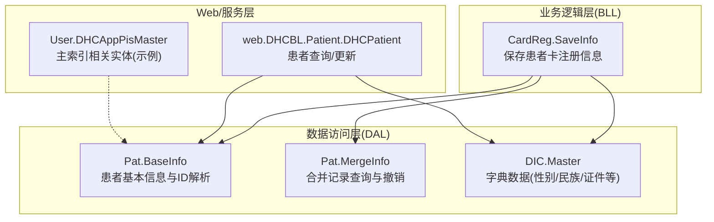
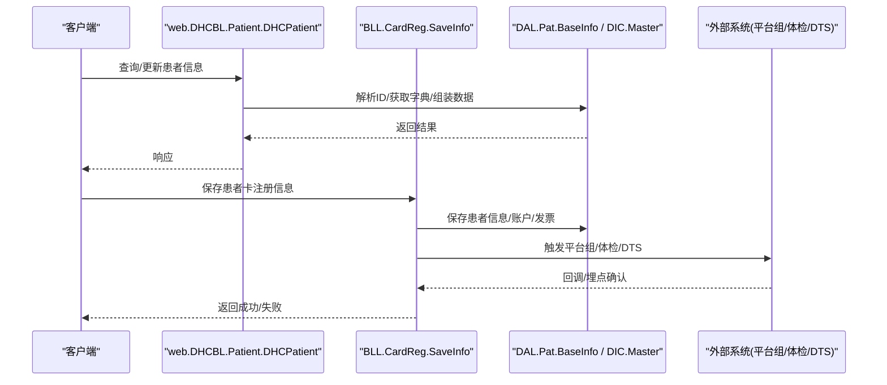
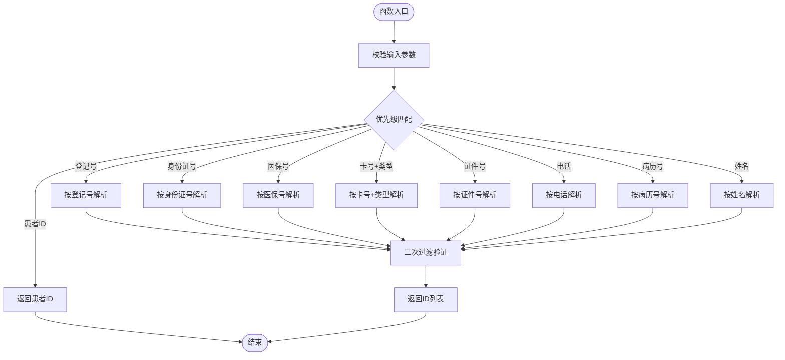
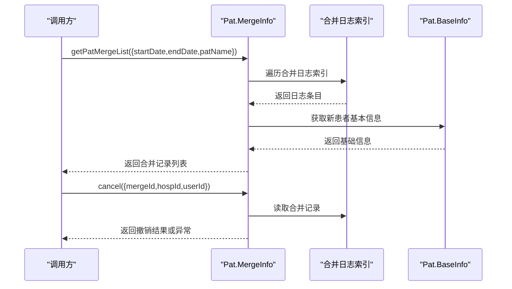
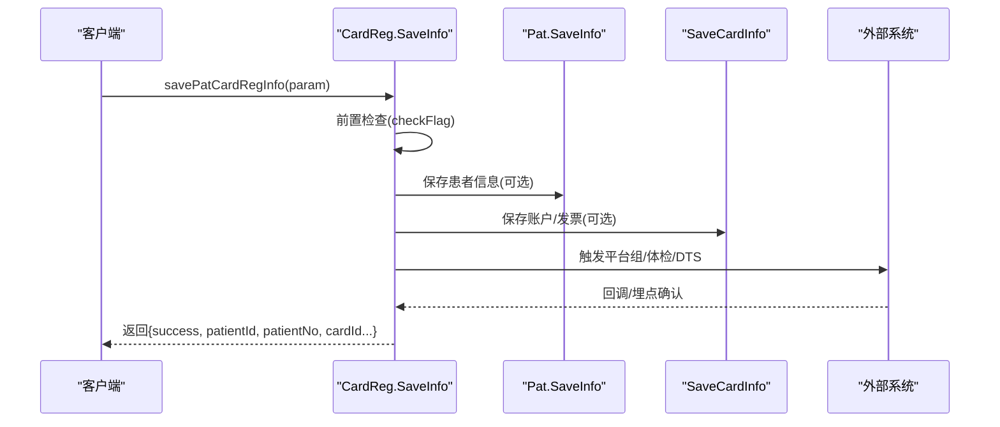
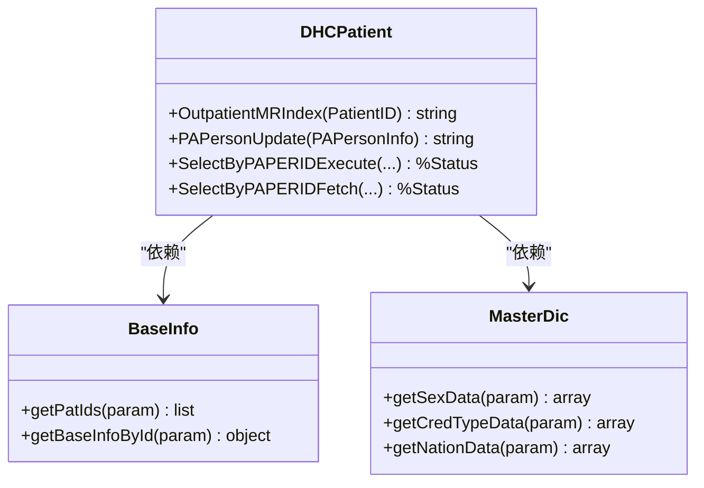
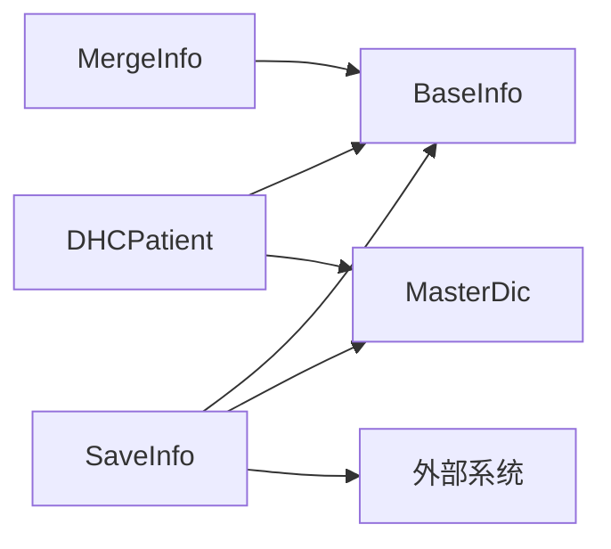

# 患者主索引集成

<cite>
**本文引用的文件**
- [Master.cls](file://src/backend/epmi-mc/DHCDoc/EPMI/DAL/DIC/Master.cls)
- [BaseInfo.cls](file://src/backend/epmi-mc/DHCDoc/EPMI/DAL/Pat/BaseInfo.cls)
- [MergeInfo.cls](file://src/backend/epmi-mc/DHCDoc/EPMI/DAL/Pat/MergeInfo.cls)
- [SaveInfo.cls](file://src/backend/epmi-mc/DHCDoc/EPMI/BLL/CardReg/SaveInfo.cls)
- [DHCPatient.cls](file://src/backend/epmi-mc/web/DHCBL/Patient/DHCPatient.cls)
- [DHCAppPisMaster.cls](file://src/backend/doc-ws/User/DHCAppPisMaster.cls)
</cite>

## 目录
1. [简介](#简介)
2. [项目结构](#项目结构)
3. [核心组件](#核心组件)
4. [架构总览](#架构总览)
5. [详细组件分析](#详细组件分析)
6. [依赖关系分析](#依赖关系分析)
7. [性能考虑](#性能考虑)
8. [故障排查指南](#故障排查指南)
9. [结论](#结论)
10. [附录](#附录)

## 简介
本文件面向“患者主索引（EPMI）集成”的数据交换与业务实现，聚焦以下目标：
- 患者信息同步：从外部系统或院内各子系统采集、校验并持久化患者主数据。
- 主索引维护：提供按多条件检索、去重、合并与撤销合并等能力。
- 患者合并：记录合并日志、支持查询与撤销，保证可追溯性。
- 接口规范：说明HL7 V2.x消息格式与FHIR Patient资源映射建议，给出API调用示例（注册、查询、状态更新）。
- 质量保障：错误处理机制、重试策略与数据一致性保证。
- 性能与监控：优化建议与关键指标。

## 项目结构
围绕EPMI集成的代码主要分布在后端模块中，采用分层组织：
- DAL（数据访问层）：负责患者基础信息、字典数据、合并记录的读取与写入。
- BLL（业务逻辑层）：封装患者卡注册、账户与发票保存、后处理触发等流程。
- Web/服务层：对外暴露查询、更新等能力，如患者信息查询、批量查询等。
- 领域模型与字典：统一字典项（性别、民族、证件类型等）的获取与翻译。

图表来源
- [SaveInfo.cls:24-162](file://src/backend/epmi-mc/DHCDoc/EPMI/BLL/CardReg/SaveInfo.cls#L24-L162)
- [BaseInfo.cls:120-282](file://src/backend/epmi-mc/DHCDoc/EPMI/DAL/Pat/BaseInfo.cls#L120-L282)
- [MergeInfo.cls:10-141](file://src/backend/epmi-mc/DHCDoc/EPMI/DAL/Pat/MergeInfo.cls#L10-L141)
- [Master.cls:8-350](file://src/backend/epmi-mc/DHCDoc/EPMI/DAL/DIC/Master.cls#L8-L350)
- [DHCPatient.cls:343-705](file://src/backend/epmi-mc/web/DHCBL/Patient/DHCPatient.cls#L343-L705)
- [DHCAppPisMaster.cls:1-380](file://src/backend/doc-ws/User/DHCAppPisMaster.cls#L1-L380)

章节来源
- [SaveInfo.cls:24-162](file://src/backend/epmi-mc/DHCDoc/EPMI/BLL/CardReg/SaveInfo.cls#L24-L162)
- [BaseInfo.cls:120-282](file://src/backend/epmi-mc/DHCDoc/EPMI/DAL/Pat/BaseInfo.cls#L120-L282)
- [MergeInfo.cls:10-141](file://src/backend/epmi-mc/DHCDoc/EPMI/DAL/Pat/MergeInfo.cls#L10-L141)
- [Master.cls:8-350](file://src/backend/epmi-mc/DHCDoc/EPMI/DAL/DIC/Master.cls#L8-L350)
- [DHCPatient.cls:343-705](file://src/backend/epmi-mc/web/DHCBL/Patient/DHCPatient.cls#L343-L705)
- [DHCAppPisMaster.cls:1-380](file://src/backend/doc-ws/User/DHCAppPisMaster.cls#L1-L380)

## 核心组件
- 患者基本信息与ID解析（DAL.Pat.BaseInfo）
  - 通过登记号、身份证号、医保号、卡号+类型、证件号、电话、病历号、姓名等多维度解析患者ID，具备优先级与过滤逻辑。
  - 提供按ID获取患者基本信息、年龄计算、地址信息等能力。
- 字典数据（DAL.DIC.Master）
  - 提供性别、民族、证件类型、患者类型、婚姻、职业、级别、密级、关系、合同单位、学历、语言等字典项的获取与翻译。
- 患者合并（DAL.Pat.MergeInfo）
  - 支持按时间范围与姓名筛选合并记录，返回合并详情；支持撤销合并操作。
- 患者卡注册与保存（BLL.CardReg.SaveInfo）
  - 保存前检查、创建大病历、补卡号、账户与发票信息保存、后处理触发（平台组接口、体检接口、DTS埋点等）。
- 患者查询与更新（web.DHCBL.Patient.DHCPatient）
  - 提供多条件查询（身份证、姓名、登记号、卡号、门诊/住院/急诊病历号、电话等），并支持更新患者个人信息及关联字段。
- 主索引相关实体（User.DHCAppPisMaster）
  - 作为主索引域模型的示例，展示主索引实体的属性与存储映射。

章节来源
- [BaseInfo.cls:120-282](file://src/backend/epmi-mc/DHCDoc/EPMI/DAL/Pat/BaseInfo.cls#L120-L282)
- [Master.cls:8-350](file://src/backend/epmi-mc/DHCDoc/EPMI/DAL/DIC/Master.cls#L8-L350)
- [MergeInfo.cls:10-141](file://src/backend/epmi-mc/DHCDoc/EPMI/DAL/Pat/MergeInfo.cls#L10-L141)
- [SaveInfo.cls:24-162](file://src/backend/epmi-mc/DHCDoc/EPMI/BLL/CardReg/SaveInfo.cls#L24-L162)
- [DHCPatient.cls:343-705](file://src/backend/epmi-mc/web/DHCBL/Patient/DHCPatient.cls#L343-L705)
- [DHCAppPisMaster.cls:1-380](file://src/backend/doc-ws/User/DHCAppPisMaster.cls#L1-L380)

## 架构总览
整体架构遵循“接入层—业务层—数据层—外部系统”的分层模式：
- 接入层：Web服务类暴露查询与更新接口。
- 业务层：封装注册、合并、后处理等业务规则。
- 数据层：直接访问全局索引与字典表，完成ID解析与数据组装。
- 外部系统：在保存后触发平台组接口、体检接口、DTS埋点等。

图表来源
- [DHCPatient.cls:343-705](file://src/backend/epmi-mc/web/DHCBL/Patient/DHCPatient.cls#L343-L705)
- [SaveInfo.cls:24-162](file://src/backend/epmi-mc/DHCDoc/EPMI/BLL/CardReg/SaveInfo.cls#L24-L162)
- [BaseInfo.cls:120-282](file://src/backend/epmi-mc/DHCDoc/EPMI/DAL/Pat/BaseInfo.cls#L120-L282)
- [Master.cls:8-350](file://src/backend/epmi-mc/DHCDoc/EPMI/DAL/DIC/Master.cls#L8-L350)

## 详细组件分析

### 组件A：患者基本信息与ID解析（DAL.Pat.BaseInfo）
- 功能要点
  - 多条件ID解析：登记号、身份证号、医保号、卡号+类型、证件号、电话、病历号、姓名。
  - 优先级：患者ID > 登记号 > 身份证号 > 医保号 > 卡号+类型 > 证件号 > 电话 > 病历号 > 姓名。
  - 返回患者基本信息：编号、姓名、出生日期、年龄、性别、民族、证件、保险号、级别、密级、地址等。
  - 年龄计算：支持传入出生时间或年龄描述进行解析。
- 复杂度与性能
  - 基于全局索引的多路遍历与拼接，避免全表扫描；必要时二次过滤提升准确性。
  - 字典翻译与地址信息聚合可能带来额外开销，建议在高频场景缓存字典。
- 错误处理
  - 缺失必要参数时抛出异常；空值快速返回。
- 优化建议
  - 对常用查询条件建立索引；批量查询时使用游标/分页减少内存占用。

图表来源
- [BaseInfo.cls:120-212](file://src/backend/epmi-mc/DHCDoc/EPMI/DAL/Pat/BaseInfo.cls#L120-L212)

章节来源
- [BaseInfo.cls:120-282](file://src/backend/epmi-mc/DHCDoc/EPMI/DAL/Pat/BaseInfo.cls#L120-L282)

### 组件B：患者合并（DAL.Pat.MergeInfo）
- 功能要点
  - 按日期范围与姓名筛选合并记录，输出旧患者与新患者编号、合并原因、创建/取消用户与时间等。
  - 支持撤销合并：调用底层合并反转方法，若失败则抛出异常。
- 数据流
  - 读取合并日志索引，构建临时排序结构，倒序输出最近合并记录。
  - 调用基础信息接口补充新患者详细信息。
- 一致性
  - 撤销操作需保证事务性与幂等性，避免重复撤销。

图表来源
- [MergeInfo.cls:10-141](file://src/backend/epmi-mc/DHCDoc/EPMI/DAL/Pat/MergeInfo.cls#L10-L141)
- [BaseInfo.cls:217-282](file://src/backend/epmi-mc/DHCDoc/EPMI/DAL/Pat/BaseInfo.cls#L217-L282)

章节来源
- [MergeInfo.cls:10-141](file://src/backend/epmi-mc/DHCDoc/EPMI/DAL/Pat/MergeInfo.cls#L10-L141)

### 组件C：患者卡注册与保存（BLL.CardReg.SaveInfo）
- 功能要点
  - 保存前检查：可选开启前置校验。
  - 创建大病历：根据配置决定是否创建。
  - 补卡号：当使用登记号作为卡号时自动补全。
  - 账户与发票：根据配置保存账户信息与发票信息。
  - 后处理触发：平台组接口发送患者与卡片信息、体检接口同步、DTS埋点、安全加密等。
- 事务与一致性
  - 使用事务块包裹保存与后续触发，确保数据一致。
- 错误处理
  - 保存失败抛出异常；账户/发票保存失败返回具体错误码。

图表来源
- [SaveInfo.cls:24-162](file://src/backend/epmi-mc/DHCDoc/EPMI/BLL/CardReg/SaveInfo.cls#L24-L162)

章节来源
- [SaveInfo.cls:24-162](file://src/backend/epmi-mc/DHCDoc/EPMI/BLL/CardReg/SaveInfo.cls#L24-L162)

### 组件D：患者查询与更新（web.DHCBL.Patient.DHCPatient）
- 功能要点
  - 多条件查询：支持身份证、姓名、登记号、卡号、门诊/住院/急诊病历号、电话等。
  - 查询结果包含患者基本信息、字典翻译、地址、过敏史、当前卡信息等。
  - 更新患者信息：支持更新个人基本信息、联系方式、证件、保险号、密级等，并同步到卡表与关联表。
- 性能
  - 使用全局索引进行快速定位；对模糊查询进行关键字匹配与去重。
- 错误处理
  - 更新失败回滚事务；返回错误码便于上层处理。

图表来源
- [DHCPatient.cls:343-705](file://src/backend/epmi-mc/web/DHCBL/Patient/DHCPatient.cls#L343-L705)
- [BaseInfo.cls:120-282](file://src/backend/epmi-mc/DHCDoc/EPMI/DAL/Pat/BaseInfo.cls#L120-L282)
- [Master.cls:8-350](file://src/backend/epmi-mc/DHCDoc/EPMI/DAL/DIC/Master.cls#L8-L350)

章节来源
- [DHCPatient.cls:343-705](file://src/backend/epmi-mc/web/DHCBL/Patient/DHCPatient.cls#L343-L705)

### 组件E：主索引相关实体（User.DHCAppPisMaster）
- 功能要点
  - 定义主索引实体的属性与存储映射，包含申请单号、状态、临床诊断、病史等字段。
  - 提供插入/更新后的触发器，联动状态管理。
- 适用场景
  - 作为主索引域模型的参考，用于扩展与集成其他子系统的主索引数据。

章节来源
- [DHCAppPisMaster.cls:1-380](file://src/backend/doc-ws/User/DHCAppPisMaster.cls#L1-L380)

## 依赖关系分析
- 组件耦合
  - SaveInfo依赖BaseInfo与MasterDic，完成数据解析与字典翻译。
  - DHCPatient依赖BaseInfo与MasterDic，完成查询与更新时的数据组装。
  - MergeInfo依赖BaseInfo，用于合并记录的详情补充。
- 外部依赖
  - 平台组接口、体检接口、DTS埋点在保存后触发，形成异步或同步回调。
- 潜在循环依赖
  - 当前分层清晰，未见明显循环依赖；注意在新增后处理逻辑时保持单向依赖。

图表来源
- [SaveInfo.cls:24-162](file://src/backend/epmi-mc/DHCDoc/EPMI/BLL/CardReg/SaveInfo.cls#L24-L162)
- [BaseInfo.cls:120-282](file://src/backend/epmi-mc/DHCDoc/EPMI/DAL/Pat/BaseInfo.cls#L120-L282)
- [Master.cls:8-350](file://src/backend/epmi-mc/DHCDoc/EPMI/DAL/DIC/Master.cls#L8-L350)
- [DHCPatient.cls:343-705](file://src/backend/epmi-mc/web/DHCBL/Patient/DHCPatient.cls#L343-L705)
- [MergeInfo.cls:10-141](file://src/backend/epmi-mc/DHCDoc/EPMI/DAL/Pat/MergeInfo.cls#L10-L141)

章节来源
- [SaveInfo.cls:24-162](file://src/backend/epmi-mc/DHCDoc/EPMI/BLL/CardReg/SaveInfo.cls#L24-L162)
- [BaseInfo.cls:120-282](file://src/backend/epmi-mc/DHCDoc/EPMI/DAL/Pat/BaseInfo.cls#L120-L282)
- [Master.cls:8-350](file://src/backend/epmi-mc/DHCDoc/EPMI/DAL/DIC/Master.cls#L8-L350)
- [DHCPatient.cls:343-705](file://src/backend/epmi-mc/web/DHCBL/Patient/DHCPatient.cls#L343-L705)
- [MergeInfo.cls:10-141](file://src/backend/epmi-mc/DHCDoc/EPMI/DAL/Pat/MergeInfo.cls#L10-L141)

## 性能考虑
- 查询优化
  - 优先使用精确索引条件（登记号、身份证号、医保号、卡号+类型）以减少遍历。
  - 模糊姓名查询需限制关键字长度与去重，避免死循环与重复结果。
- 字典缓存
  - 对频繁使用的字典项（性别、民族、证件类型等）进行缓存，降低翻译开销。
- 批量处理
  - 合并记录查询使用临时结构与倒序输出，注意内存占用；必要时分页。
- 外部调用
  - 平台组/体检接口调用应设置超时与重试，避免阻塞主流程。

[本节为通用指导，不直接分析具体文件]

## 故障排查指南
- 常见错误
  - 患者不存在：当传入无效ID时抛出异常，需检查输入参数与索引键。
  - 账户/发票保存失败：返回具体错误码，检查账户配置与支付模式。
  - 合并撤销失败：检查合并记录是否存在且未被重复撤销。
- 日志与埋点
  - 保存成功后触发DTS埋点，便于追踪问题链路。
  - 外部接口调用失败时记录回调结果，便于定位网络或服务端问题。
- 重试策略
  - 对网络抖动导致的失败采用指数退避重试；对业务不可重试的错误直接返回。

章节来源
- [SaveInfo.cls:24-162](file://src/backend/epmi-mc/DHCDoc/EPMI/BLL/CardReg/SaveInfo.cls#L24-L162)
- [MergeInfo.cls:123-141](file://src/backend/epmi-mc/DHCDoc/EPMI/DAL/Pat/MergeInfo.cls#L123-L141)

## 结论
本集成方案通过分层架构与明确的数据访问路径，实现了患者主索引的注册、查询、合并与撤销等核心能力。结合字典管理与外部系统触发，保证了数据的完整性与一致性。建议在大规模部署时引入缓存与重试机制，并完善监控指标以支撑运维与排障。

[本节为总结，不直接分析具体文件]

## 附录

### HL7 V2.x消息格式建议
- MSH段：消息头，包含发送/接收应用、消息类型（如ADT^A08）、时间戳。
- PID段：患者标识与人口统计信息，映射至FHIR Patient的identifier、name、birthDate、gender等。
- PV1段：就诊信息，映射至FHIR Encounter的class、type等。
- 备注：实际字段需根据医院EHR与HIS对接规范调整。

[本节为概念性内容，不直接分析具体文件]

### FHIR Patient资源映射建议
- identifier：映射患者登记号、身份证号、医保号、卡号等。
- name：映射患者姓名、别名。
- birthDate：映射出生日期。
- gender：映射性别字典项。
- address：映射现住址、户籍地址、联系地址等。
- contact：映射联系人信息。

[本节为概念性内容，不直接分析具体文件]

### 数据验证规则
- 必填字段：登记号、姓名、出生日期、性别、证件类型与号码。
- 唯一性：身份证号、医保号、卡号需唯一。
- 格式校验：电话号码、邮箱、邮编等格式。
- 字典有效性：所有字典项需在系统中存在且有效。

[本节为概念性内容，不直接分析具体文件]

### API调用示例
- 患者注册
  - 请求体：包含患者信息、地址、支付参数、扩展参数（医院ID、是否创建大病历等）。
  - 响应：成功返回患者ID、登记号、卡ID等；失败返回错误码与消息。
  - 参考路径：[SaveInfo.cls:24-162](file://src/backend/epmi-mc/DHCDoc/EPMI/BLL/CardReg/SaveInfo.cls#L24-L162)
- 信息查询
  - 请求体：支持多条件组合（身份证、姓名、登记号、卡号、病历号、电话）。
  - 响应：返回患者基本信息与字典翻译。
  - 参考路径：[DHCPatient.cls:343-705](file://src/backend/epmi-mc/web/DHCBL/Patient/DHCPatient.cls#L343-L705)
- 状态更新
  - 请求体：更新患者个人信息、证件、保险号、密级等。
  - 响应：返回更新结果；失败回滚事务并返回错误码。
  - 参考路径：[DHCPatient.cls:45-240](file://src/backend/epmi-mc/web/DHCBL/Patient/DHCPatient.cls#L45-L240)

章节来源
- [SaveInfo.cls:24-162](file://src/backend/epmi-mc/DHCDoc/EPMI/BLL/CardReg/SaveInfo.cls#L24-L162)
- [DHCPatient.cls:343-705](file://src/backend/epmi-mc/web/DHCBL/Patient/DHCPatient.cls#L343-L705)

### 监控指标
- 接口成功率与延迟：注册、查询、更新的P95/P99延迟与成功率。
- 外部调用成功率：平台组、体检接口的成功率与超时率。
- 合并记录量：每日合并与撤销数量。
- 字典命中率：字典缓存命中率与翻译耗时。

[本节为通用指导，不直接分析具体文件]