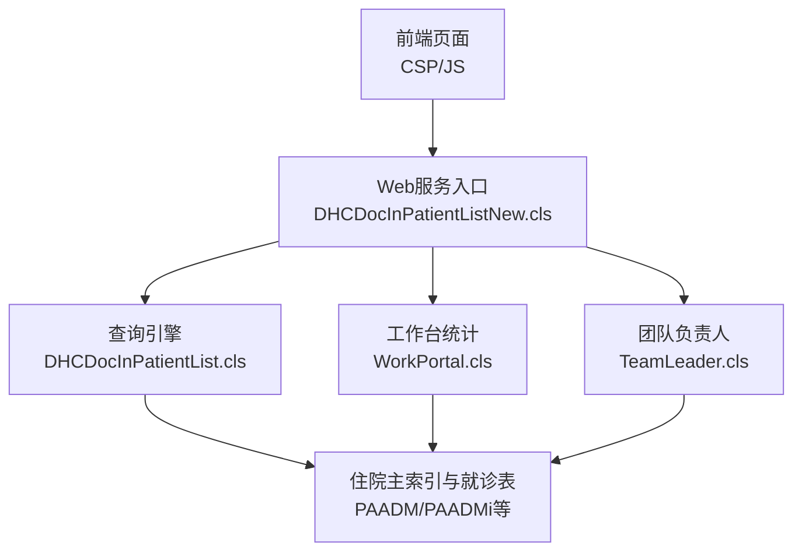
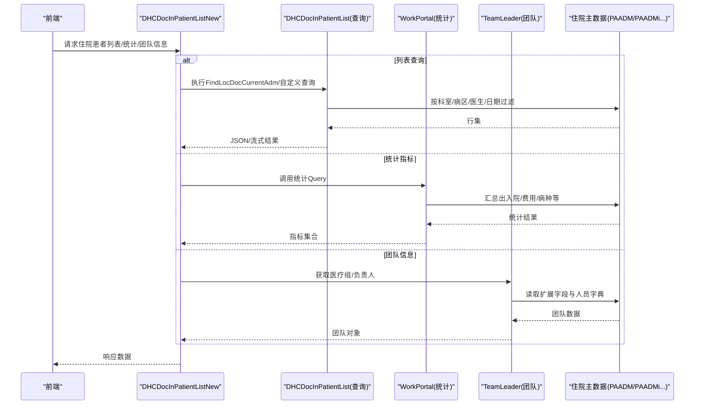
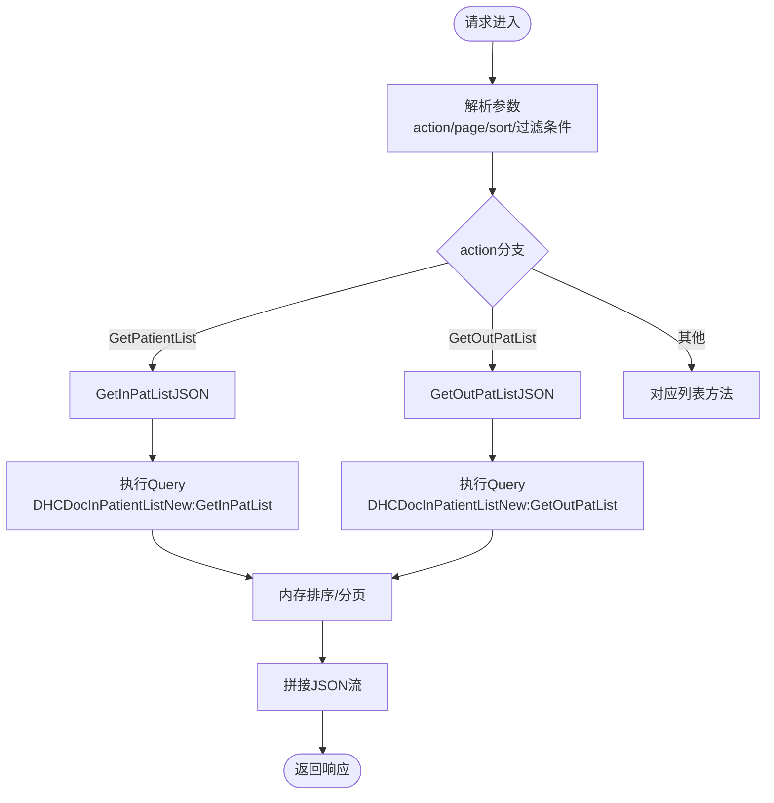
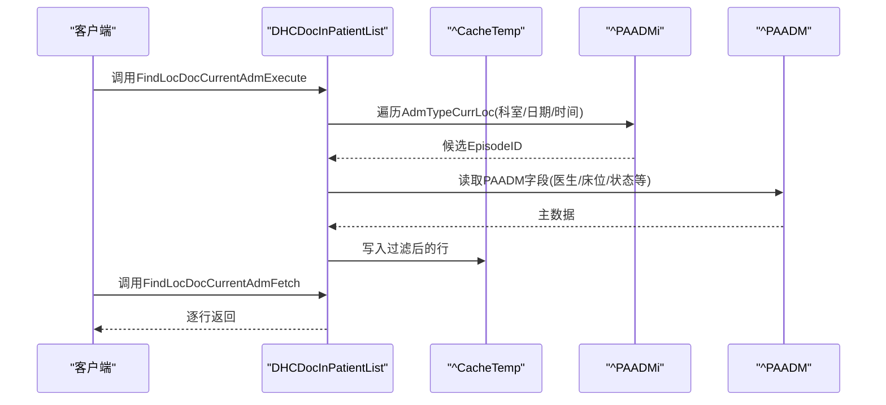
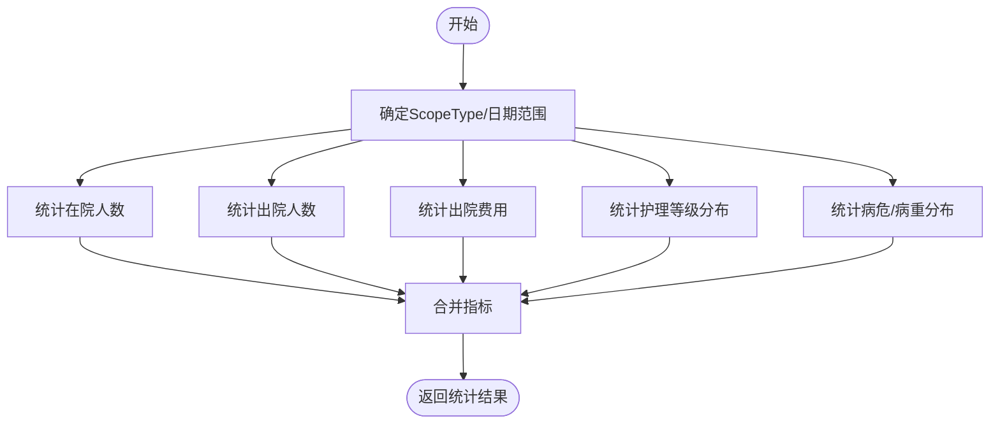
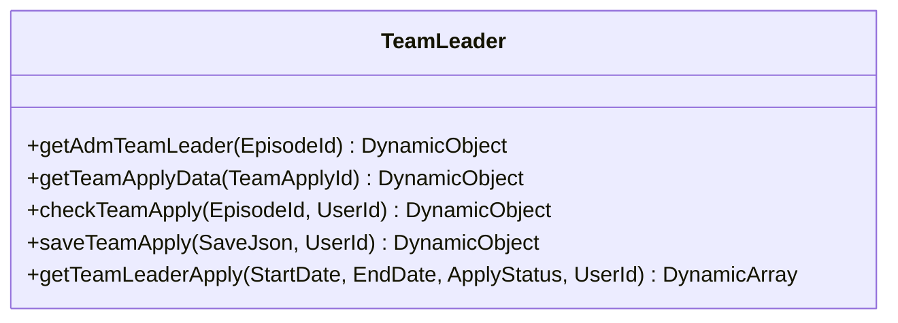
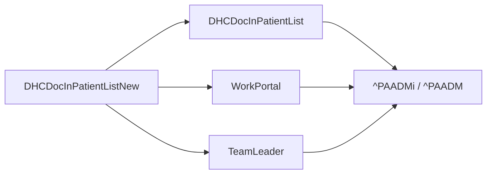

# 住院医生工作流

<cite>
**本文引用的文件**
- [DHCDocInPatientList.cls](file://src/backend/doc-ws/web/DHCDocInPatientList.cls)
- [DHCDocInPatientListNew.cls](file://src/backend/doc-ws/web/DHCDocInPatientListNew.cls)
- [WorkPortal.cls](file://src/backend/doc-ws/DHCDoc/IPDoc/WorkPortal.cls)
- [TeamLeader.cls](file://src/backend/doc-ws/DHCDoc/IPDoc/TeamLeader.cls)
</cite>

## 目录
1. [简介](#简介)
2. [项目结构](#项目结构)
3. [核心组件](#核心组件)
4. [架构总览](#架构总览)
5. [详细组件分析](#详细组件分析)
6. [依赖关系分析](#依赖关系分析)
7. [性能考量](#性能考量)
8. [故障排查指南](#故障排查指南)
9. [结论](#结论)
10. [附录](#附录)

## 简介
本文件面向住院医生工作流，系统化梳理住院患者的完整诊疗流程：入院处理、查房记录、医嘱执行、病程记录等关键业务；并重点说明住院患者列表查询、患者信息查看、医嘱管理等核心实现。同时对比住院与门诊工作流的差异点与特殊处理逻辑，给出权限控制与数据访问模式说明，并提供常见问题排查指引。

## 项目结构
围绕住院医生工作流的核心代码集中在后端 doc-ws 模块中，主要涉及：
- 住院患者列表与查询：web.DHCDocInPatientList、web.DHCDocInPatientListNew
- 工作台统计与指标：DHCDoc.IPDoc.WorkPortal
- 医疗团队负责人管理：DHCDoc.IPDoc.TeamLeader

图表来源
- [DHCDocInPatientListNew.cls:1-272](file://src/backend/doc-ws/web/DHCDocInPatientListNew.cls#L1-L272)
- [DHCDocInPatientList.cls:47-169](file://src/backend/doc-ws/web/DHCDocInPatientList.cls#L47-L169)
- [WorkPortal.cls:8-35](file://src/backend/doc-ws/DHCDoc/IPDoc/WorkPortal.cls#L8-L35)
- [TeamLeader.cls:11-45](file://src/backend/doc-ws/DHCDoc/IPDoc/TeamLeader.cls#L11-L45)

章节来源
- [DHCDocInPatientListNew.cls:1-272](file://src/backend/doc-ws/web/DHCDocInPatientListNew.cls#L1-L272)
- [DHCDocInPatientList.cls:47-169](file://src/backend/doc-ws/web/DHCDocInPatientList.cls#L47-L169)
- [WorkPortal.cls:8-35](file://src/backend/doc-ws/DHCDoc/IPDoc/WorkPortal.cls#L8-L35)
- [TeamLeader.cls:11-45](file://src/backend/doc-ws/DHCDoc/IPDoc/TeamLeader.cls#L11-L45)

## 核心组件
- 住院患者列表查询（新版）：提供分页、多条件检索、排序与JSON输出，覆盖在院、出院、转科、手术、危重、会诊、日间手术等多类场景。
- 住院患者列表查询（旧版）：基于Query的游标式查询，支持按科室、病区、床位、医生、日期范围过滤，以及“本科病人”“全病区病人”等快捷筛选。
- 工作台统计：提供当前在院人数、出入院趋势、费用汇总、病种/护理等级分布、平均住院日等指标。
- 医疗团队负责人：获取就诊对应的医疗组信息，支持团队变更申请校验与保存。

章节来源
- [DHCDocInPatientListNew.cls:39-272](file://src/backend/doc-ws/web/DHCDocInPatientListNew.cls#L39-L272)
- [DHCDocInPatientList.cls:47-169](file://src/backend/doc-ws/web/DHCDocInPatientList.cls#L47-L169)
- [WorkPortal.cls:37-146](file://src/backend/doc-ws/DHCDoc/IPDoc/WorkPortal.cls#L37-L146)
- [TeamLeader.cls:11-183](file://src/backend/doc-ws/DHCDoc/IPDoc/TeamLeader.cls#L11-L183)

## 架构总览
住院医生工作流以“Web服务入口 + 查询/统计服务 + 数据层”的分层组织为主。Web服务负责参数解析、权限上下文读取、结果聚合与返回；查询服务封装复杂过滤与排序；统计服务聚合多维指标；数据层通过系统内置索引与表访问住院主数据。

图表来源
- [DHCDocInPatientListNew.cls:39-272](file://src/backend/doc-ws/web/DHCDocInPatientListNew.cls#L39-L272)
- [DHCDocInPatientList.cls:47-169](file://src/backend/doc-ws/web/DHCDocInPatientList.cls#L47-L169)
- [WorkPortal.cls:8-35](file://src/backend/doc-ws/DHCDoc/IPDoc/WorkPortal.cls#L8-L35)
- [TeamLeader.cls:11-45](file://src/backend/doc-ws/DHCDoc/IPDoc/TeamLeader.cls#L11-L45)

## 详细组件分析

### 住院患者列表查询（新版）
- 功能要点
  - 统一入口OnPage根据action路由到不同查询：GetPatientInfo、GetPatientList、GetOutPatListJSON、GetChangeDeptPatListJSON、GetOperationPatListJSON、GetCriticallyPatListJSON等。
  - 支持分页、排序、多条件过滤（姓名、医保号、床号、医生、转科、出院医嘱、CPWS状态等）。
  - 内部使用%ResultSet执行自定义Query，并将结果组装为JSON流返回。
- 关键方法
  - OnPreHTTP/OnPage：会话过期检查、参数解析、路由分发。
  - GetInPatListJSON/GetOutPatListJSON：在院/出院列表查询与排序输出。
  - GetSortDescOrder/GetOutSortDescOrder：内存排序与分页切片。
- 数据访问
  - 通过%ResultSet调用对应Query，底层依赖PAADM/PAADMi等索引进行高效扫描。
- 权限与上下文
  - 从Session读取LOGON.CTLOCID、LOGON.USERID，用于限定科室与用户范围。

图表来源
- [DHCDocInPatientListNew.cls:12-272](file://src/backend/doc-ws/web/DHCDocInPatientListNew.cls#L12-L272)
- [DHCDocInPatientListNew.cls:398-496](file://src/backend/doc-ws/web/DHCDocInPatientListNew.cls#L398-L496)
- [DHCDocInPatientListNew.cls:498-558](file://src/backend/doc-ws/web/DHCDocInPatientListNew.cls#L498-L558)

章节来源
- [DHCDocInPatientListNew.cls:12-272](file://src/backend/doc-ws/web/DHCDocInPatientListNew.cls#L12-L272)
- [DHCDocInPatientListNew.cls:398-496](file://src/backend/doc-ws/web/DHCDocInPatientListNew.cls#L398-L496)
- [DHCDocInPatientListNew.cls:498-558](file://src/backend/doc-ws/web/DHCDocInPatientListNew.cls#L498-L558)

### 住院患者列表查询（旧版）
- 功能要点
  - 基于Query的FindLocDocCurrentAdm，支持按登录科室、医生、日期范围、是否本科/全病区/指定病区/床位过滤。
  - 输出包含患者基本信息、就诊信息、诊断、床位、出院标志等。
- 关键方法
  - FindLocDocCurrentAdmExecute：构建临时缓存^CacheTemp，遍历索引^PAADMi("AdmTypeCurrLoc",...)，按条件过滤后写入临时表。
  - FindLocDocCurrentAdmFetch：逐行拉取结果。
  - CheckCTLocMedUnit：按科室单元配置限制可操作医生。
- 数据访问
  - 大量依赖^PAADMi系列索引与^PAADM主表，结合^CTLOC、^PAPER等字典表。

图表来源
- [DHCDocInPatientList.cls:47-169](file://src/backend/doc-ws/web/DHCDocInPatientList.cls#L47-L169)
- [DHCDocInPatientList.cls:455-471](file://src/backend/doc-ws/web/DHCDocInPatientList.cls#L455-L471)
- [DHCDocInPatientList.cls:708-762](file://src/backend/doc-ws/web/DHCDocInPatientList.cls#L708-L762)

章节来源
- [DHCDocInPatientList.cls:47-169](file://src/backend/doc-ws/web/DHCDocInPatientList.cls#L47-L169)
- [DHCDocInPatientList.cls:455-471](file://src/backend/doc-ws/web/DHCDocInPatientList.cls#L455-L471)
- [DHCDocInPatientList.cls:708-762](file://src/backend/doc-ws/web/DHCDocInPatientList.cls#L708-L762)

### 工作台统计与指标
- 功能要点
  - 当前在院人数、本科室在院人数、出院人数、手术患者数、费用汇总、护理等级分布、病危/病重分布、平均住院日等。
- 关键方法
  - QueryCurAdmExecute：按ScopeType（本人/本科）遍历当前在院。
  - QueryLocInOutExecute：统计近30天出入院数量。
  - QueryOutFeeExecute：统计出院费用总额。
  - QueryDischgMsgExecute：统计出院人数及原因、超30天住院患者。
  - QueryBedUsePercentExecute：床位使用率（含随机模拟值）。
- 数据访问
  - 依赖^PAADMi系列索引与^DHCPB费用表，部分指标使用模拟数据。

图表来源
- [WorkPortal.cls:8-35](file://src/backend/doc-ws/DHCDoc/IPDoc/WorkPortal.cls#L8-L35)
- [WorkPortal.cls:104-146](file://src/backend/doc-ws/DHCDoc/IPDoc/WorkPortal.cls#L104-L146)
- [WorkPortal.cls:152-174](file://src/backend/doc-ws/DHCDoc/IPDoc/WorkPortal.cls#L152-L174)
- [WorkPortal.cls:180-220](file://src/backend/doc-ws/DHCDoc/IPDoc/WorkPortal.cls#L180-L220)
- [WorkPortal.cls:414-431](file://src/backend/doc-ws/DHCDoc/IPDoc/WorkPortal.cls#L414-L431)

章节来源
- [WorkPortal.cls:8-35](file://src/backend/doc-ws/DHCDoc/IPDoc/WorkPortal.cls#L8-L35)
- [WorkPortal.cls:104-146](file://src/backend/doc-ws/DHCDoc/IPDoc/WorkPortal.cls#L104-L146)
- [WorkPortal.cls:152-174](file://src/backend/doc-ws/DHCDoc/IPDoc/WorkPortal.cls#L152-L174)
- [WorkPortal.cls:180-220](file://src/backend/doc-ws/DHCDoc/IPDoc/WorkPortal.cls#L180-L220)
- [WorkPortal.cls:414-431](file://src/backend/doc-ws/DHCDoc/IPDoc/WorkPortal.cls#L414-L431)

### 医疗团队负责人管理
- 功能要点
  - 根据就诊ID获取医疗组负责人、主管医生等信息。
  - 校验只有医疗组长（四级）可进行团队变更申请。
  - 保存团队变更申请，并在审核通过时同步更新就诊扩展信息。
- 关键方法
  - getAdmTeamLeader：读取PAADM扩展字段并映射到人员字典。
  - checkTeamApply：权限校验与重复申请检查。
  - saveTeamApply：新增/更新申请，必要时回写PAADM扩展字段并记录变更日志。
  - getTeamLeaderApply：按日期与状态查询申请列表。

图表来源
- [TeamLeader.cls:11-45](file://src/backend/doc-ws/DHCDoc/IPDoc/TeamLeader.cls#L11-L45)
- [TeamLeader.cls:65-133](file://src/backend/doc-ws/DHCDoc/IPDoc/TeamLeader.cls#L65-L133)
- [TeamLeader.cls:142-183](file://src/backend/doc-ws/DHCDoc/IPDoc/TeamLeader.cls#L142-L183)

章节来源
- [TeamLeader.cls:11-45](file://src/backend/doc-ws/DHCDoc/IPDoc/TeamLeader.cls#L11-L45)
- [TeamLeader.cls:65-133](file://src/backend/doc-ws/DHCDoc/IPDoc/TeamLeader.cls#L65-L133)
- [TeamLeader.cls:142-183](file://src/backend/doc-ws/DHCDoc/IPDoc/TeamLeader.cls#L142-L183)

## 依赖关系分析
- Web服务入口（DHCDocInPatientListNew）依赖查询服务（DHCDocInPatientList）与统计服务（WorkPortal），并通过%ResultSet调用各自Query。
- 查询服务依赖系统索引^PAADMi与主表^PAADM，以及字典表^CTLOC、^PAPER等。
- 统计服务依赖^PAADMi、^DHCPB等，部分指标使用模拟数据。
- 团队负责人服务依赖PAADM扩展字段与人员字典。

图表来源
- [DHCDocInPatientListNew.cls:398-496](file://src/backend/doc-ws/web/DHCDocInPatientListNew.cls#L398-L496)
- [DHCDocInPatientList.cls:47-169](file://src/backend/doc-ws/web/DHCDocInPatientList.cls#L47-L169)
- [WorkPortal.cls:8-35](file://src/backend/doc-ws/DHCDoc/IPDoc/WorkPortal.cls#L8-L35)
- [TeamLeader.cls:11-45](file://src/backend/doc-ws/DHCDoc/IPDoc/TeamLeader.cls#L11-L45)

章节来源
- [DHCDocInPatientListNew.cls:398-496](file://src/backend/doc-ws/web/DHCDocInPatientListNew.cls#L398-L496)
- [DHCDocInPatientList.cls:47-169](file://src/backend/doc-ws/web/DHCDocInPatientList.cls#L47-L169)
- [WorkPortal.cls:8-35](file://src/backend/doc-ws/DHCDoc/IPDoc/WorkPortal.cls#L8-L35)
- [TeamLeader.cls:11-45](file://src/backend/doc-ws/DHCDoc/IPDoc/TeamLeader.cls#L11-L45)

## 性能考量
- 查询优化
  - 使用^PAADMi索引进行按科室/日期/时间的快速定位，避免全表扫描。
  - 将中间结果写入^CacheTemp或全局数组，减少重复计算。
  - 对大数据量采用流式输出（%Stream.GlobalCharacter）与分页，降低内存占用。
- 排序与分页
  - 内存排序适用于中等规模数据集；超大时可考虑数据库侧排序或分片查询。
- 统计指标
  - 部分指标使用模拟数据，生产环境应替换为真实聚合逻辑。
- 并发与缓存
  - 注意临时变量命名空间隔离（如^CacheTemp键），避免跨会话污染。

[本节为通用性能建议，不直接分析具体文件]

## 故障排查指南
- 列表为空或数据不全
  - 检查登录科室与医生上下文是否正确（LOGON.CTLOCID、LOGON.USERID）。
  - 确认过滤条件（日期范围、病区、床位、医生）是否过严。
  - 核查^PAADMi索引是否存在缺失或损坏。
- 权限问题
  - 使用CheckCTLocMedUnit验证科室单元授权；确保医生在允许范围内。
  - 团队变更申请需满足“医疗组长（四级）”权限，且无有效待审申请。
- 性能问题
  - 大列表分页与排序可能导致延迟，优先使用默认排序（床位/病区）以减少计算。
  - 统计接口若返回模拟数据，需替换为真实聚合逻辑。
- 常见错误码
  - 队列相关：100（就诊ID为空）、101（已被其他医生呼叫）、102（跳过状态异常）。
  - 这些错误码出现在呼叫/跳过状态设置方法中，用于提示前端重试或刷新。

章节来源
- [DHCDocInPatientList.cls:708-762](file://src/backend/doc-ws/web/DHCDocInPatientList.cls#L708-L762)
- [DHCDocInPatientList.cls:656-706](file://src/backend/doc-ws/web/DHCDocInPatientList.cls#L656-L706)
- [TeamLeader.cls:65-133](file://src/backend/doc-ws/DHCDoc/IPDoc/TeamLeader.cls#L65-L133)

## 结论
住院医生工作流以“查询+统计+团队管理”为核心，依托系统索引与主表实现高效的数据访问。新版列表查询提供更灵活的分页与多场景支持，旧版查询保留强大的过滤能力。工作台统计帮助医生掌握科室运行态势，团队负责人管理保障医疗组协作与变更合规。建议在生产环境中完善统计指标的实时聚合，并持续优化查询与排序策略以提升用户体验。

## 附录
- 住院与门诊工作流差异点
  - 住院强调“在院/出院/转科/手术/危重”等多维视图，门诊更侧重“挂号/就诊/处方/检查”。
  - 住院涉及床位、病区、医疗组、护理等级等特有维度；门诊通常不涉及床位与病区。
  - 住院医嘱执行与病程记录与在院状态紧密关联，门诊则以单次就诊为中心。
- 权限与数据访问模式
  - 基于Session的科室与用户上下文进行数据隔离。
  - 通过^PAADMi索引与^PAADM主表进行高效访问；字典表用于描述性信息映射。
  - 团队变更需遵循角色与状态约束，确保数据一致性与审计可追溯。

[本节为概念性总结，不直接分析具体文件]