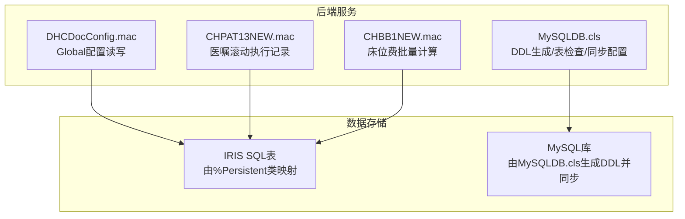
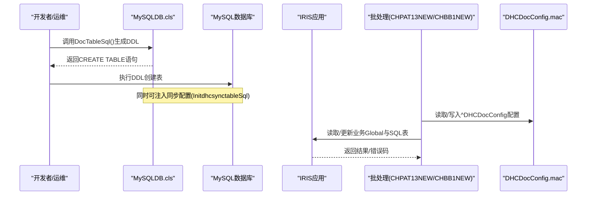
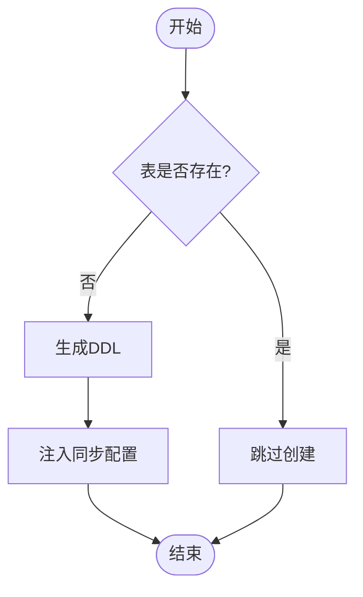
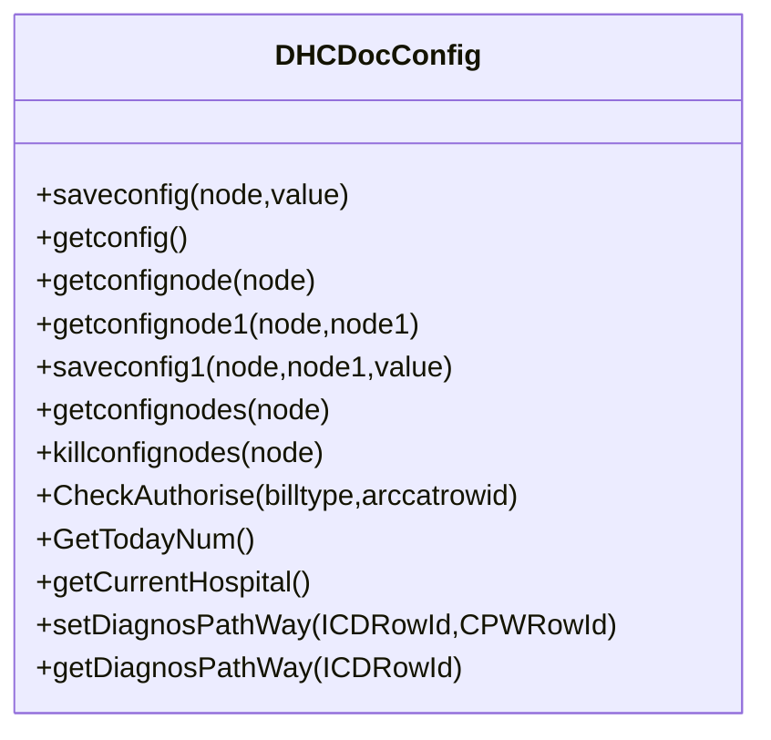
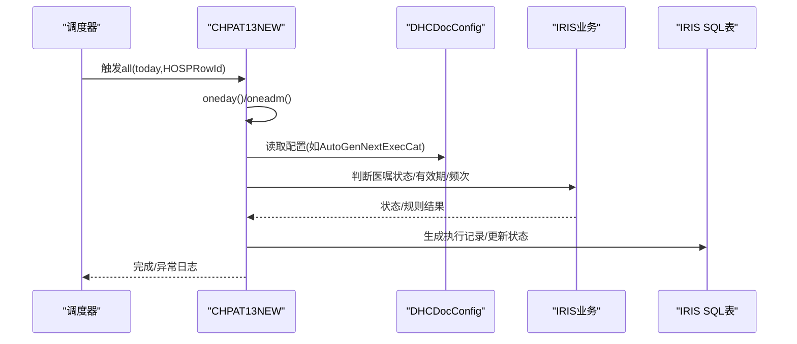
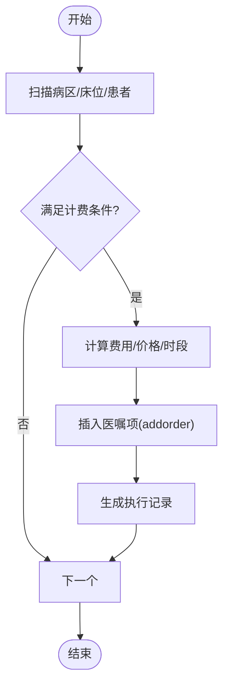
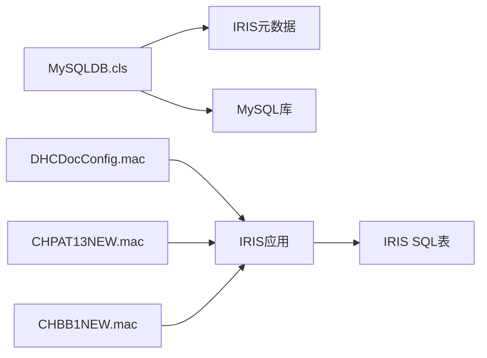
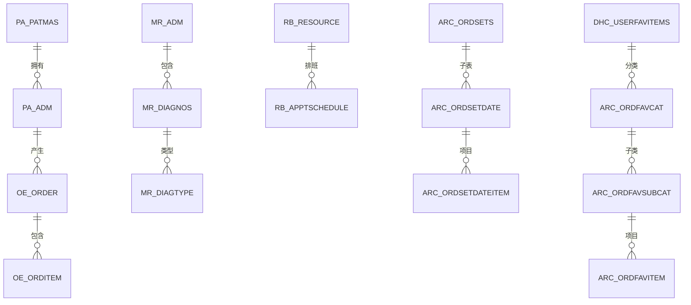

# 数据库设计

<cite>
**本文引用的文件**
- [MySQLDB.cls](file://src/backend/conting-ws/DHCDoc/Interface/StandAlone/MySQLDB.cls)
- [DHCDocConfig.mac](file://src/backend/public-mc/DHCDocConfig.mac)
- [CHPAT13NEW.mac](file://src/backend/public-mc/CHPAT13NEW.mac)
- [CHBB1NEW.mac](file://src/backend/public-mc/CHBB1NEW.mac)
</cite>

## 目录
1. [简介](#简介)
2. [项目结构](#项目结构)
3. [核心组件](#核心组件)
4. [架构总览](#架构总览)
5. [详细组件分析](#详细组件分析)
6. [依赖关系分析](#依赖关系分析)
7. [性能考虑](#性能考虑)
8. [故障排查指南](#故障排查指南)
9. [结论](#结论)
10. [附录](#附录)

## 简介
本文件面向IRIS HIS的数据库设计与运维，聚焦以下方面：
- 数据库架构与核心表结构（含主键、唯一索引、外键约束）
- 实体关系图（ER图）
- Global变量数据结构、访问模式与缓存策略
- 数据生命周期、保留策略与归档规则
- 数据迁移路径与版本管理方案
- 数据安全、隐私要求与访问控制
- SQL查询示例与性能优化建议

本仓库中的数据库相关能力主要由两部分构成：
- 基于IRIS对象持久化（%Persistent + SQLStorage）的SQL表映射（由类定义驱动）
- 通过脚本动态生成MySQL建表语句与同步配置，用于跨系统数据同步与初始化

## 项目结构
与数据库设计直接相关的代码集中在后端模块：
- 应急接口层：提供MySQL建表、检查表存在、生成DDL与同步配置的方法
- 公共批处理与全局配置：Global变量读写、日期时间工具、医嘱滚动与床位费批量计算等
- 业务域对象：大量%Persistent类声明了SQL表名与主键映射，体现IRIS对象到SQL表的映射关系

图表来源
- [MySQLDB.cls:36-1207](file://src/backend/conting-ws/DHCDoc/Interface/StandAlone/MySQLDB.cls#L36-L1207)
- [DHCDocConfig.mac:1-119](file://src/backend/public-mc/DHCDocConfig.mac#L1-L119)
- [CHPAT13NEW.mac:1-134](file://src/backend/public-mc/CHPAT13NEW.mac#L1-L134)
- [CHBB1NEW.mac:1-684](file://src/backend/public-mc/CHBB1NEW.mac#L1-L684)

章节来源
- [MySQLDB.cls:36-1207](file://src/backend/conting-ws/DHCDoc/Interface/StandAlone/MySQLDB.cls#L36-L1207)
- [DHCDocConfig.mac:1-119](file://src/backend/public-mc/DHCDocConfig.mac#L1-L119)
- [CHPAT13NEW.mac:1-134](file://src/backend/public-mc/CHPAT13NEW.mac#L1-L134)
- [CHBB1NEW.mac:1-684](file://src/backend/public-mc/CHBB1NEW.mac#L1-L684)

## 核心组件
- MySQLDB.cls
  - 提供表存在性检查、DDL生成、列/索引/主键信息抽取、同步配置注入等方法
  - 覆盖基础字典、患者、医嘱、模板、排班、设备插件等关键领域表
- DHCDocConfig.mac
  - 提供Global ^DHCDocConfig的读写方法，支持按院区节点存取配置
  - 包含常用日期/时间转换、诊断路径关联、当前院区获取等工具方法
- CHPAT13NEW.mac
  - 实现每日医嘱滚动逻辑：根据医嘱项状态、有效期、频次等生成次日执行记录
  - 涉及长期医嘱、小时医嘱、预停医嘱、自备药与草药取药等场景
- CHBB1NEW.mac
  - 实现住院床位费及相关附加费的批量计算与入账
  - 依据床位类型、费用设置、年龄与入院原因等条件生成计费医嘱项

章节来源
- [MySQLDB.cls:36-1207](file://src/backend/conting-ws/DHCDoc/Interface/StandAlone/MySQLDB.cls#L36-L1207)
- [DHCDocConfig.mac:1-119](file://src/backend/public-mc/DHCDocConfig.mac#L1-L119)
- [CHPAT13NEW.mac:1-134](file://src/backend/public-mc/CHPAT13NEW.mac#L1-L134)
- [CHBB1NEW.mac:1-684](file://src/backend/public-mc/CHBB1NEW.mac#L1-L684)

## 架构总览
IRIS HIS采用“对象持久化 + 外部数据库”的双轨存储：
- IRIS内部：通过%Persistent类将业务实体映射为SQL表，使用SQLRowIdName指定主键列，便于ORM式访问
- 外部MySQL：通过MySQLDB.cls动态生成DDL与同步配置，支撑跨系统数据交换与离线环境部署

图表来源
- [MySQLDB.cls:36-1207](file://src/backend/conting-ws/DHCDoc/Interface/StandAlone/MySQLDB.cls#L36-L1207)
- [DHCDocConfig.mac:1-119](file://src/backend/public-mc/DHCDocConfig.mac#L1-L119)
- [CHPAT13NEW.mac:1-134](file://src/backend/public-mc/CHPAT13NEW.mac#L1-L134)
- [CHBB1NEW.mac:1-684](file://src/backend/public-mc/CHBB1NEW.mac#L1-L684)

## 详细组件分析

### 组件A：MySQLDB.cls（DDL生成与同步）
- 功能要点
  - 表存在性检查：查询INFORMATION_SCHEMA判断目标表是否存在
  - DDL生成：集中输出多领域建表语句（资源、时长、频次、用法、卡类型、患者、挂号职称、模板、排班、设备等）
  - 列/索引/主键抽取：从元数据中解析字段类型、长度、是否自增、默认值、注释，以及主键与索引集合
  - 同步配置注入：维护一张“同步表清单”，绑定业务类型、调用类与方法、说明等，供后续数据导入流程使用
- 关键方法与行为
  - IsTableExist(tableName)：返回是否存在
  - DocTableSql(tNames)：输出完整DDL流
  - InitdhcsynctableSql()：生成INSERT语句，注册待同步表及对应处理方法
  - CreateTableSql(tableName, cesTableName, cols)：按列过滤生成DDL，兼容列裁剪场景

图表来源
- [MySQLDB.cls:16-26](file://src/backend/conting-ws/DHCDoc/Interface/StandAlone/MySQLDB.cls#L16-L26)
- [MySQLDB.cls:36-1207](file://src/backend/conting-ws/DHCDoc/Interface/StandAlone/MySQLDB.cls#L36-L1207)

章节来源
- [MySQLDB.cls:16-26](file://src/backend/conting-ws/DHCDoc/Interface/StandAlone/MySQLDB.cls#L16-L26)
- [MySQLDB.cls:36-1207](file://src/backend/conting-ws/DHCDoc/Interface/StandAlone/MySQLDB.cls#L36-L1207)

### 组件B：DHCDocConfig.mac（Global配置中心）
- 功能要点
  - 提供对^DHCDocConfig节点的统一读写封装，支持院区级节点隔离
  - 内置日期/时间格式化工具、诊断路径关联、当前院区获取等
- 典型用法
  - saveconfig/getconfig：保存/读取全局配置
  - getconfignode/getconfignode1：按节点或院区节点取值
  - getcurrentdate/getsysdate/getformatdate等：统一时间处理
  - setDiagnosPathWay/getDiagnosPathWay：诊断与路径关联

图表来源
- [DHCDocConfig.mac:1-119](file://src/backend/public-mc/DHCDocConfig.mac#L1-L119)

章节来源
- [DHCDocConfig.mac:1-119](file://src/backend/public-mc/DHCDocConfig.mac#L1-L119)

### 组件C：CHPAT13NEW.mac（医嘱滚动）
- 功能要点
  - 遍历当日在院患者，针对符合条件的医嘱项生成次日执行记录
  - 处理长期医嘱、小时医嘱、预停医嘱、自备药与草药自动取药等
  - 结合Global与业务类进行状态判断与执行记录生成
- 关键流程
  - all(today,HOSPRowId)：按院区与日期驱动
  - oneday(today,HOSPRowId)：逐患者处理
  - oneadm(adm,today,HOSPRowId)：逐医嘱项判断与执行记录生成
  - UpdateHourOrderExen/AppStopOrderItemNew/IsStoped等：细化场景处理

图表来源
- [CHPAT13NEW.mac:1-134](file://src/backend/public-mc/CHPAT13NEW.mac#L1-L134)
- [DHCDocConfig.mac:1-119](file://src/backend/public-mc/DHCDocConfig.mac#L1-L119)

章节来源
- [CHPAT13NEW.mac:1-134](file://src/backend/public-mc/CHPAT13NEW.mac#L1-L134)
- [DHCDocConfig.mac:1-119](file://src/backend/public-mc/DHCDocConfig.mac#L1-L119)

### 组件D：CHBB1NEW.mac（床位费批量计算）
- 功能要点
  - 遍历病区/床位/患者，依据床位类型与费用设置生成床位费及附加费医嘱项
  - 支持按医院特殊规则、年龄限制、入院原因、时间段等条件控制
  - 将结果写入IRIS SQL表，并生成执行记录
- 关键流程
  - all(today,HOSPRowId)：按院区与日期驱动
  - CalculateAdmFee/admitbedorder/insertoccupybedorder：核心计费逻辑
  - addorder：统一插入医嘱项并生成执行记录

图表来源
- [CHBB1NEW.mac:1-684](file://src/backend/public-mc/CHBB1NEW.mac#L1-L684)

章节来源
- [CHBB1NEW.mac:1-684](file://src/backend/public-mc/CHBB1NEW.mac#L1-L684)

## 依赖关系分析
- MySQLDB.cls依赖IRIS SQL元数据（INFORMATION_SCHEMA）以动态生成DDL与索引
- DHCDocConfig.mac被多个批处理与业务逻辑引用，作为配置中心
- CHPAT13NEW.mac与CHBB1NEW.mac依赖IRIS对象持久化与SQL表，并通过Global进行状态与配置传递
- 业务域内大量%Persistent类定义了SQL表名与主键映射，形成稳定的数据模型契约

图表来源
- [MySQLDB.cls:36-1207](file://src/backend/conting-ws/DHCDoc/Interface/StandAlone/MySQLDB.cls#L36-L1207)
- [DHCDocConfig.mac:1-119](file://src/backend/public-mc/DHCDocConfig.mac#L1-L119)
- [CHPAT13NEW.mac:1-134](file://src/backend/public-mc/CHPAT13NEW.mac#L1-L134)
- [CHBB1NEW.mac:1-684](file://src/backend/public-mc/CHBB1NEW.mac#L1-L684)

章节来源
- [MySQLDB.cls:36-1207](file://src/backend/conting-ws/DHCDoc/Interface/StandAlone/MySQLDB.cls#L36-L1207)
- [DHCDocConfig.mac:1-119](file://src/backend/public-mc/DHCDocConfig.mac#L1-L119)
- [CHPAT13NEW.mac:1-134](file://src/backend/public-mc/CHPAT13NEW.mac#L1-L134)
- [CHBB1NEW.mac:1-684](file://src/backend/public-mc/CHBB1NEW.mac#L1-L684)

## 性能考虑
- 索引设计
  - 主键与唯一索引：确保实体唯一性与快速定位
  - 复合索引：针对高频查询组合键（如日期+院区+主键）建立索引
  - 外键索引：提升关联查询性能（注意写入开销）
- 批处理优化
  - 分批处理：避免一次性加载过多数据导致内存压力
  - 事务边界：合理划分事务范围，减少锁竞争
  - 日志与监控：记录关键步骤耗时与异常，便于定位瓶颈
- 配置与缓存
  - 使用^DHCDocConfig集中管理配置，减少重复读取
  - 对热点字典数据可采用内存缓存（如会话级或进程级），但需保证一致性

[本节为通用指导，不直接分析具体文件]

## 故障排查指南
- 常见问题
  - 表不存在：使用IsTableExist检查后再执行DDL
  - 同步失败：核对InitdhcsynctableSql注册的表与调用方法是否正确
  - 医嘱滚动异常：检查Global配置与医嘱状态，关注预停与有效期判断
  - 床位费未入账：核查床位类型、费用设置、时间段与年龄限制
- 定位手段
  - 查看批处理日志与异常堆栈
  - 检查Global节点值与SQL表状态
  - 使用元数据查询确认索引与约束

章节来源
- [MySQLDB.cls:16-26](file://src/backend/conting-ws/DHCDoc/Interface/StandAlone/MySQLDB.cls#L16-L26)
- [MySQLDB.cls:1031-1093](file://src/backend/conting-ws/DHCDoc/Interface/StandAlone/MySQLDB.cls#L1031-L1093)
- [CHPAT13NEW.mac:1-134](file://src/backend/public-mc/CHPAT13NEW.mac#L1-L134)
- [CHBB1NEW.mac:1-684](file://src/backend/public-mc/CHBB1NEW.mac#L1-L684)

## 结论
本仓库通过MySQLDB.cls实现了灵活的DDL生成与同步配置管理，结合DHCDocConfig.mac的Global配置中心，以及CHPAT13NEW.mac与CHBB1NEW.mac的批处理能力，构建了稳定可扩展的数据库与数据处理体系。建议在实施中严格遵循索引与约束设计，完善批处理的事务与日志机制，并结合院区维度进行配置隔离与数据治理。

[本节为总结，不直接分析具体文件]

## 附录

### 核心表结构与关系（节选）
以下为MySQLDB.cls中生成的部分核心表及其关键字段与索引（仅列出代表性字段与约束）：
- rb_resource（资源/医生科室）
  - 主键：RES_RowId
  - 唯一索引：DataMasterRES、IndexCTLOCDR
  - 外键：REFERENCE__RES_CTPCP_DR -> ct_careprov(CTPCP_RowId)
- phc_duration（疗程）
  - 主键：PHCDU_RowId
  - 唯一索引：DataMasterPHCDU、IndexPHCDUCode、IndexPHCDUDesc1
- phc_freq（频次）
  - 主键：PHCFR_RowId
  - 唯一索引：DataMasterPHCFR、IndexPHCFRCode
- phc_instruc（用法）
  - 主键：PHCIN_RowId
  - 唯一索引：DataMasterPHCIN、IndexPHCINCode、IndexPHCINDesc1
- dhc_cardtypedef（卡类型）
  - 主键：CTD_RowID
  - 唯一索引：DataMaster
- pac_cardtype（证件类型）
  - 主键：CARD_RowId
  - 唯一索引：DataMaster
- dhc_cardref（卡）
  - 主键：CF_RowID
  - 唯一索引：DataMasterMap
  - 索引：IndexPAPMIDR、indexCFCardNo、indexCFIDCardNo、IndexDate
- pa_patmas（患者基本信息）
  - 主键：PAPMI_ID
  - 唯一索引：DataMasterMap、IndexPAPMIRowId1、IndexGlobalPapmi
  - 索引：IndexName、IndexDVAnumber、IndexPAPMINo、IndexNewFlag、IndexTelH、IndexUpdateDate
- RBC_SessionType（挂号职称字典）
  - 主键：SESS_RowId
  - 唯一索引：DataMaster、IndexCode、IndexDesc
- DHC_RBCSessionTypeService（挂号职称费用）
  - 主键：SER_Childsub,SER_ParRef
  - 唯一索引：DataMaster
- ARC_ItemExternalCodes（检验外部代码关联）
  - 主键：EXT_Childsub,EXT_ParRef
  - 唯一索引：DataMaster、IndexExtCode
- arc_itemexternalinfo（检验外部数据信息）
  - 主键：ID
  - 索引：IndexExtCode、MasterData
- dhc_websysaddins（插件配置）
  - 主键：ID
  - 唯一索引：CodeInd、IDKEY
- DHC_CardHardComManager（读卡设备）
  - 主键：CCM_RowID
  - 唯一索引：DataMaster
- DHC_CardHardDLLFunction（读卡方法）
  - 主键：CDF_CCM_ParRef,CDF_Sub
  - 唯一索引：DataMaster
- arc_ordsets（医嘱套）
  - 主键：ARCOS_RowId
  - 唯一索引：DataMasterARCOS、IndexCode、IndexDesc
  - 外键：REFERENCE__ARCOS_CurVers_DR -> arc_ordsets(ARCOS_RowId)
- arc_ordsetdate（医嘱套子表）
  - 主键：DATE_ParRef,DATE_Childsub
  - 唯一索引：DataMaster、IndexDateFrom
  - 外键：REFERENCE__DATE_ParRef -> arc_ordsets(ARCOS_RowId)
- arc_ordsetdateitem（医嘱套项目表）
  - 主键：ITM_ParRef,ITM_Childsub
  - 唯一索引：DataMaster
- ARC_OrdFavCat/ARC_OrdFavSubCat/ARC_OrdFavItem（医嘱模板分类与项目）
  - 主键：ID
  - 唯一索引：IDKEY、IndexName、IndexSequece、IndexItem
- DHC_UserFavItems（医嘱套类别）
  - 主键：Fav_RowId
  - 唯一索引：DataMaster、IndexItemRowid
- ARC_OrdSetsHosp（医嘱套院区）
  - 主键：HOSP_Childsub,HOSP_ParRef
  - 唯一索引：Datamaster
- ARC_OrdSetDateOS（医嘱套明细中的医嘱）
  - 主键：OS_Childsub,OS_ParRef
  - 唯一索引：DataMaster
- RB_ApptSchedule（排班数据）
  - 主键：AS_ChildSub,AS_RES_ParRef
  - 唯一索引：DataMasterAS、IndexASDate、IndexDate
- CT_LocLinkLocation（关联科室）
  - 主键：LINK_ParRef,LINK_Childsub
  - 外键：REFERENCE_LINK_CTLOC_DR -> CT_Loc(CTLOC_RowID)、REFERENCE_LINK_ParRef -> CT_Loc(CTLOC_RowID)
- phc_cookmode（草药煎药方式）
  - 主键：rowid,hospital
- PHC_InstrucLinkDosage（草药用法关联一次用量）
  - 主键：ILD_RowId
  - 唯一索引：DataMaster
- PHC_Dosage（一次用量）
  - 主键：PHCDO_RowId
  - 唯一索引：DataMasterPHCDO、IndexPHCDOCode、IndexPHCDODesc1
- pa_adm（入院记录）
  - 主键：PAADM_RowID
  - 唯一索引：DataMasterMap、IndexPAPMI、IndexGlobalAdmNo、IndexDate
  - 外键：REFERENCE__PAADM_PAPMI_DR -> pa_patmas(PAPMI_ID)
- mr_adm（病历入院）
  - 主键：MRADM_RowId
  - 唯一索引：DataMasterMap、IndexGlobalAdmNo
- mr_diagnos（诊断）
  - 主键：MRDIA_RowId
  - 唯一索引：DataMasterMap、IndexMRADMDR
  - 外键：REFERENCE__MRDIA_MRADM_DR -> mr_adm(MRADM_RowId)
- mr_diagtype（诊断类型）
  - 主键：TYP_RowId
  - 唯一索引：DataMasterMap、IndexMRDiagnosDR
  - 外键：REFERENCE__TYP_MRDiagnos_DR -> mr_diagnos(MRDIA_RowId)
- oe_order（医嘱主表）
  - 主键：OEORD_RowId
  - 唯一索引：DataMasterMap、IndexOEORDDate、IndexGlobalAdmNo
- oe_orditem（医嘱明细）
  - 主键：OEORI_RowId
  - 唯一索引：DataMasterMap
  - 索引：IndexOrder、IndexArcim、IndexOEORI

章节来源
- [MySQLDB.cls:36-1207](file://src/backend/conting-ws/DHCDoc/Interface/StandAlone/MySQLDB.cls#L36-L1207)

### 实体关系图（ER图）

图表来源
- [MySQLDB.cls:36-1207](file://src/backend/conting-ws/DHCDoc/Interface/StandAlone/MySQLDB.cls#L36-L1207)

### 数据生命周期、保留策略与归档
- 医嘱滚动：CHPAT13NEW.mac负责按日滚动生成执行记录，需确保历史数据可追溯
- 床位费：CHBB1NEW.mac按日批量计算，建议保留原始计算日志与结果快照
- 配置与字典：^DHCDocConfig与基础字典表应定期备份，变更需审计
- 归档建议：对历史订单、诊断、排班等表按时间分区或归档至冷存储，保留期依据合规要求设定

[本节为通用指导，不直接分析具体文件]

### 数据迁移路径与版本管理
- 迁移入口：MySQLDB.cls.InitdhcsynctableSql()注册待同步表与处理方法
- 迁移流程：导出源数据 -> 生成目标DDL -> 执行导入 -> 校验一致性
- 版本管理：对DDL与同步配置进行版本化（如Git管理），发布前进行回滚演练

章节来源
- [MySQLDB.cls:1031-1093](file://src/backend/conting-ws/DHCDoc/Interface/StandAlone/MySQLDB.cls#L1031-L1093)

### 数据安全、隐私与访问控制
- 敏感字段：患者身份、联系方式、身份证号等需加密存储与传输
- 访问控制：基于IRIS用户与角色权限控制SQL表与Global节点访问
- 审计日志：对关键操作（医嘱修改、费用入账、配置变更）记录审计日志
- 合规要求：遵循医疗数据保护法规，最小化数据暴露面

[本节为通用指导，不直接分析具体文件]

### SQL查询示例与性能优化建议
- 查询示例（概念性）
  - 查询某患者在某日的医嘱明细：SELECT * FROM oe_orditem WHERE OEORI_OEORD_DR = ? AND OEORI_Date = ?
  - 查询某资源的排班：SELECT * FROM rb_apptschedule WHERE AS_RES_ParRef = ? AND AS_Date = ?
  - 查询患者基本信息：SELECT * FROM pa_patmas WHERE PAPMI_Global_Papmi = ?
- 优化建议
  - 为高频查询列建立合适索引（如日期、院区、主键）
  - 避免全表扫描，使用分页与条件过滤
  - 批处理中使用批量插入/更新，减少网络往返
  - 监控慢查询，定期分析执行计划

[本节为通用指导，不直接分析具体文件]