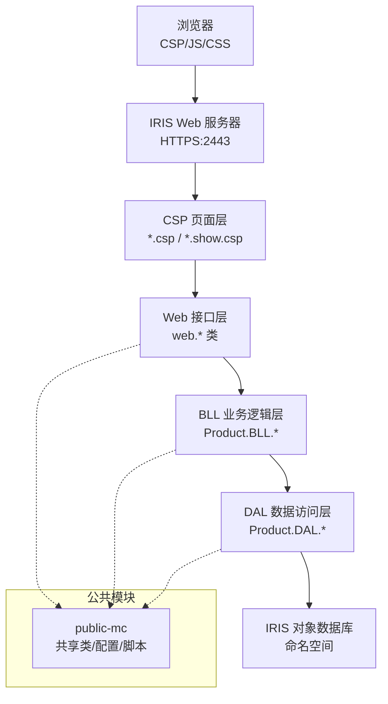
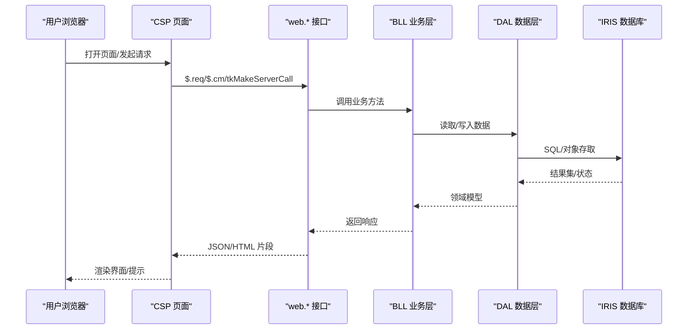
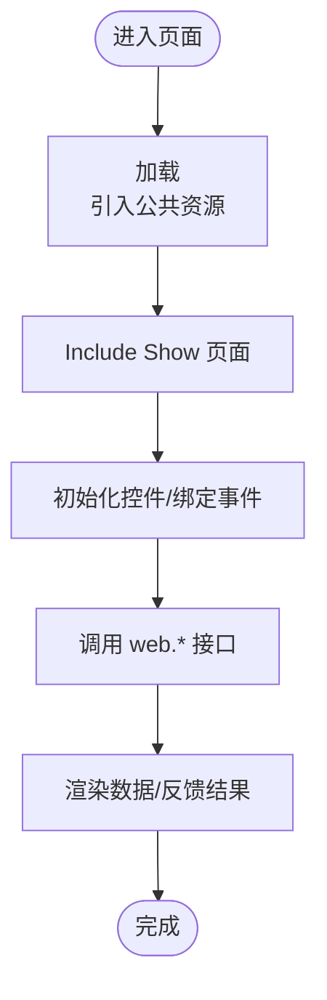
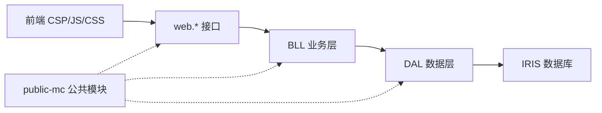
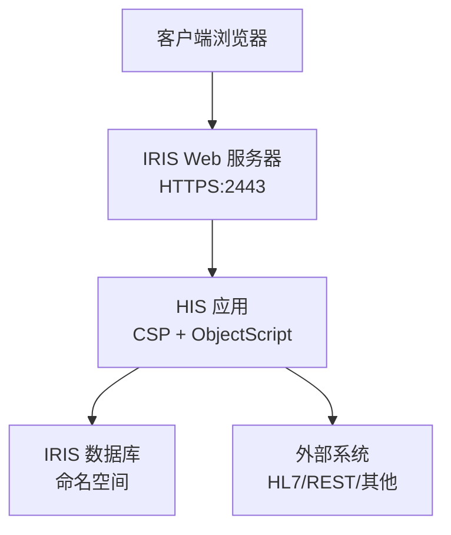
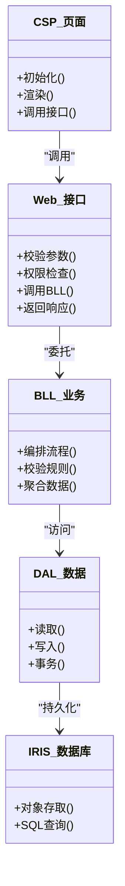
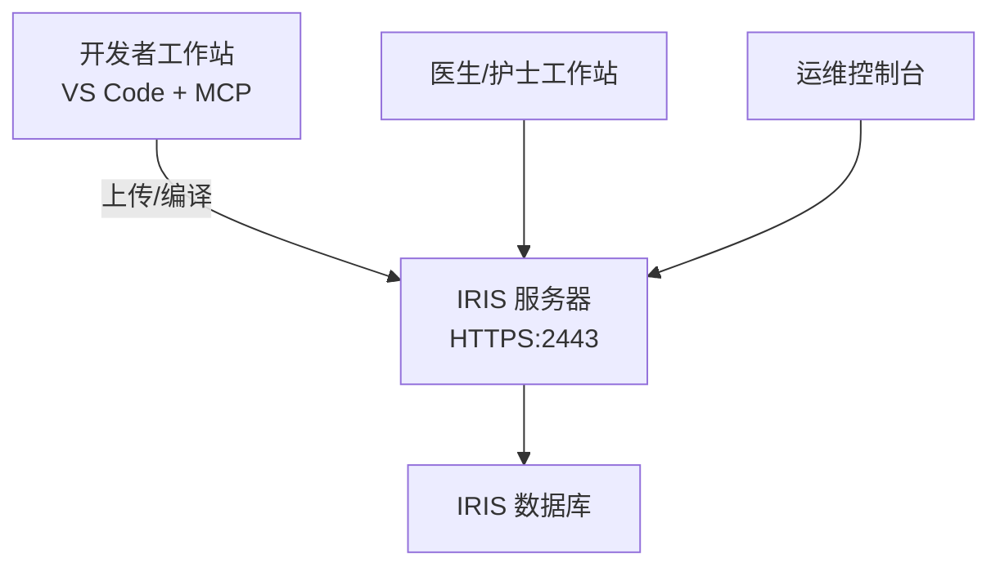

# 系统架构

<cite>
**本文引用的文件**
- [README.md](file://README.md)
- [AGENTS.md](file://AGENTS.md)
- [CONTRIBUTING.md](file://CONTRIBUTING.md)
- [DHCDoc.inc](file://src/backend/public-mc/DHCDoc.inc)
- [major.ctloclist.update.hui.csp](file://src/backend/public-mc/web/major.ctloclist.update.hui.csp)
</cite>

## 目录
1. [简介](#简介)
2. [项目结构](#项目结构)
3. [核心组件](#核心组件)
4. [架构总览](#架构总览)
5. [详细组件分析](#详细组件分析)
6. [依赖关系分析](#依赖关系分析)
7. [性能考虑](#性能考虑)
8. [故障排查指南](#故障排查指南)
9. [结论](#结论)
10. [附录](#附录)

## 简介
本架构文档面向 IRIS HIS（医院信息系统）的整体设计，围绕 MVC 分层（CSP 页面层、ObjectScript 业务逻辑层、IRIS 数据库层）、模块化与子系统边界、数据流向与组件通信机制、配置驱动能力进行系统化阐述。同时给出系统上下文图、组件分解图、部署拓扑图，并总结技术决策、权衡与约束，覆盖安全架构、监控策略与灾难恢复方案，以及技术栈、第三方依赖与版本兼容性说明。

## 项目结构
- 前后端分离：前端为 CSP + jQuery + HISUI（基于 EasyUI 二次封装），后端为 InterSystems IRIS ObjectScript；公共模块通过 public-mc 共享。
- 多产品子模块：doc-ws、cure-ws、dental-ws、epmi-mc、opadm-mc、pilot-project-ws、pilot-study-ws、triage-ws、conting-ws 等，每个产品包含独立的前后端目录。
- 构建与部署：前端通过 psftp 上传后编译 CSP；后端通过 IRIS ObjectScript 扩展批量加载并编译到 IRIS 命名空间 <namespace>。
- Git Submodule：根仓库仅管理两个子模块 src/backend 与 src/frontend，Git 操作需在子模块内执行。

图表来源
- [README.md:1-549](file://README.md#L1-L549)
- [AGENTS.md:65-104](file://AGENTS.md#L65-L104)

章节来源
- [README.md:1-549](file://README.md#L1-L549)
- [AGENTS.md:65-104](file://AGENTS.md#L65-L104)

## 核心组件
- 前端 CSP 页面层：采用主页面 + Show 页面的双文件模式，统一通过 `<DOC:HEAD>` 引入公共资源与样式主题。
- Web 接口层：以 web.* 类暴露给前端调用，作为请求入口与参数校验、会话处理、权限检查的集中点。
- 业务逻辑层（BLL）：按产品域组织，承载业务流程编排、规则校验、跨表聚合等。
- 数据访问层（DAL）：直接操作 IRIS 持久化对象或 SQL，提供稳定的数据读写能力。
- 公共模块（public-mc）：跨产品共享的配置、工具、通用页面与脚本，降低重复实现。
- 运维与脚本：Git 多仓库管理、SFTP 同步、编码转换、日志获取等辅助脚本。

章节来源
- [AGENTS.md:65-104](file://AGENTS.md#L65-L104)
- [README.md:256-278](file://README.md#L256-L278)

## 架构总览
- 分层架构：CSP → web.* → BLL → DAL → IRIS 数据库，严格分层保证可维护性与可扩展性。
- 模块化设计：按产品划分 ws/mc 目录，公共能力下沉至 public-mc，避免耦合扩散。
- 配置驱动：通过 CSP 模板与公共配置项（如页面元素、按钮栏、查询网格列等）驱动界面与行为，减少硬编码。
- 子系统交互：各子系统通过公共模块与标准接口约定协作，必要时通过外部服务集成。

图表来源
- [AGENTS.md:65-104](file://AGENTS.md#L65-L104)
- [README.md:256-278](file://README.md#L256-L278)

## 详细组件分析

### CSP 页面层
- 页面组织：主页面负责初始化与资源引入，Show 页面承载 UI 布局与交互逻辑。
- 公共资源：通过 `<DOC:HEAD>` 注入公共 JS/CSS，支持主题切换与打印等特性。
- 典型示例：`major.ctloclist.update.hui.csp` 展示了标准的 CSP 结构与资源引用方式。

图表来源
- [major.ctloclist.update.hui.csp:1-25](file://src/backend/public-mc/web/major.ctloclist.update.hui.csp#L1-L25)
- [AGENTS.md:89-98](file://AGENTS.md#L89-L98)

章节来源
- [major.ctloclist.update.hui.csp:1-25](file://src/backend/public-mc/web/major.ctloclist.update.hui.csp#L1-L25)
- [AGENTS.md:89-98](file://AGENTS.md#L89-L98)

### Web 接口层（web.*）
- 职责：接收前端请求、参数校验、会话与权限控制、调用 BLL、统一异常与返回格式。
- 调用约定：前端使用 `$.req`/`$.cm`/`tkMakeServerCall` 调用 web.* 类方法。
- 日志与审计：通过公共日志对象记录接口访问与错误信息。

章节来源
- [AGENTS.md:65-104](file://AGENTS.md#L65-L104)
- [DHCDoc.inc:1-8](file://src/backend/public-mc/DHCDoc.inc#L1-L8)

### 业务逻辑层（BLL）
- 职责：编排业务流程、校验业务规则、聚合多源数据、协调 DAL 与外部服务。
- 设计原则：单一职责、可测试、可复用；复杂流程拆分为多个方法或子流程。
- 例外：Order/Diagnos 子系统采用 Service → SERV → BLL → DAL → INTF/COM 六层与门面路由，确保方法名全局唯一与稳定入口。

章节来源
- [AGENTS.md:65-88](file://AGENTS.md#L65-L88)

### 数据访问层（DAL）
- 职责：封装 IRIS 对象存取与 SQL 查询，提供事务、重试、分页、缓存等通用能力。
- 优化：热点数据缓存、批量操作、索引优化、SQL 计划调优。
- 安全：参数化查询、最小权限原则、敏感字段脱敏。

章节来源
- [AGENTS.md:65-88](file://AGENTS.md#L65-L88)

### 公共模块（public-mc）
- 作用：跨产品共享配置、工具、页面与脚本，降低重复实现与维护成本。
- 风险：修改需评估影响范围，遵循变更评审与回归测试。

章节来源
- [AGENTS.md:217-221](file://AGENTS.md#L217-L221)

### 运维与脚本
- Git 多仓库管理：批量拉取、分支管理、MR 创建、日志聚合。
- 前端部署：psftp 上传与 CSP 编译。
- 编码转换：UTF-8 ↔ GB2312 互转，处理历史遗留文件。

章节来源
- [README.md:302-509](file://README.md#L302-L509)

## 依赖关系分析
- 模块内聚与耦合：BLL 依赖 DAL，web.* 依赖 BLL；公共模块被所有产品依赖，形成星型耦合中心。
- 外部依赖：InterSystems IRIS 应用服务器与对象数据库；jQuery/HISUI 前端库；可选的外部服务集成。
- 循环依赖规避：通过接口抽象与门面类解耦，避免产品间直接强耦合。

图表来源
- [AGENTS.md:65-104](file://AGENTS.md#L65-L104)
- [README.md:1-549](file://README.md#L1-L549)

章节来源
- [AGENTS.md:65-104](file://AGENTS.md#L65-L104)
- [README.md:1-549](file://README.md#L1-L549)

## 性能考虑
- 前端缓存：对字典、枚举、配置等低频变化数据启用请求缓存（memory/session/local），合理设置 TTL。
- 后端缓存：热点数据在 DAL/BLL 层引入缓存，注意一致性策略与失效机制。
- 数据库优化：合理使用索引、批处理、分页与只读副本，避免全表扫描与大事务。
- 网络与并发：限制单次请求负载，拆分长耗时任务为异步任务或消息队列（若引入）。

[本节为通用指导，不直接分析具体文件]

## 故障排查指南
- 常见错误定位：
  - 路径映射错误导致 405：检查 `iris_doc_load` 路径是否包含包根通配符。
  - CSP 编译失败：确认已上传并执行编译命令。
  - 中文乱码：确保前端文件 UTF-8 编码。
- 日志与审计：
  - 接口访问日志：通过公共日志对象记录关键请求与异常。
  - 错误日志：统一异常抛出与捕获，便于问题回溯。
- 回滚与恢复：
  - 代码回滚：通过 Git 分支与提交历史快速回退。
  - 数据恢复：基于备份与事务日志恢复关键数据。

章节来源
- [AGENTS.md:291-299](file://AGENTS.md#L291-L299)
- [DHCDoc.inc:1-8](file://src/backend/public-mc/DHCDoc.inc#L1-L8)

## 结论
IRIS HIS 采用清晰的分层与模块化设计，结合配置驱动的 CSP 页面与统一的 web.* 接口，实现了高内聚、低耦合的可维护架构。通过公共模块沉淀通用能力，提升复用率与一致性。配合完善的开发工作流与运维脚本，保障交付质量与效率。未来可在缓存、异步化与可观测性方面持续优化，进一步提升系统性能与稳定性。

[本节为总结性内容，不直接分析具体文件]

## 附录

### 系统上下文图

[此图为概念性示意，不直接映射具体源码文件]

### 组件分解图

[此图为概念性示意，不直接映射具体源码文件]

### 部署拓扑图

[此图为概念性示意，不直接映射具体源码文件]

### 技术栈与依赖
- 后端：InterSystems IRIS、ObjectScript、CSP。
- 前端：jQuery、HISUI（基于 EasyUI）、传统静态资源。
- 开发与部署：MCP 工具、psftp、Node.js 脚本。
- 版本兼容：IRIS 实例与命名空间（<namespace>）、前端 UTF-8 编码、PowerShell 环境。

章节来源
- [README.md:526-549](file://README.md#L526-L549)
- [AGENTS.md:33-47](file://AGENTS.md#L33-L47)

### 安全架构
- 身份认证与会话：通过 IRIS 会话与权限模型控制访问。
- 输入校验与输出编码：在 web.* 层进行参数校验与 XSS 防护。
- 最小权限：DAL 层使用最小权限账户与参数化查询。
- 审计日志：记录关键操作与异常，支持追溯与合规。

[本节为通用指导，不直接分析具体文件]

### 监控策略
- 接口监控：统计 QPS、延迟、错误率，告警阈值设定。
- 数据库监控：慢查询、锁等待、连接数、磁盘使用。
- 前端监控：页面加载时间、错误上报、用户体验指标。

[本节为通用指导，不直接分析具体文件]

### 灾难恢复方案
- 备份策略：定期全量与增量备份，保留周期与存储位置明确。
- 恢复演练：定期演练恢复流程，验证 RTO/RPO 目标。
- 容灾部署：多节点或多机房部署，故障自动切换。

[本节为通用指导，不直接分析具体文件]

### 版本兼容性
- IRIS 版本：确保与现有实例兼容，升级前充分测试。
- 前端库：jQuery/HISUI 版本锁定，避免破坏性更新。
- 操作系统与中间件：Windows/Linux 环境差异与依赖管理。

[本节为通用指导，不直接分析具体文件]