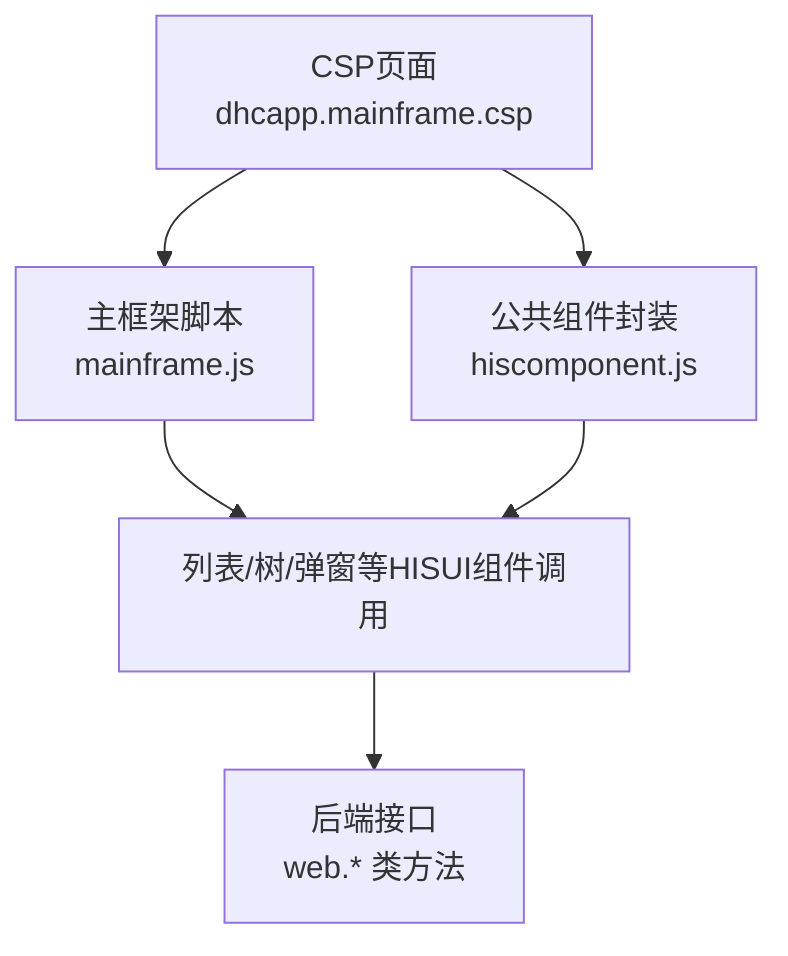
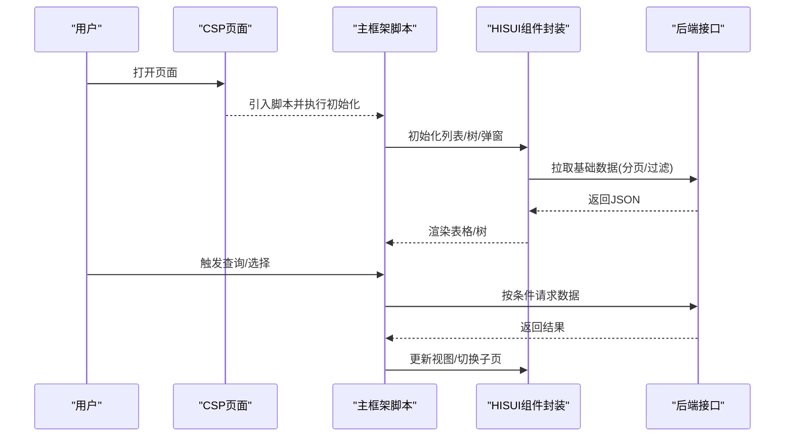
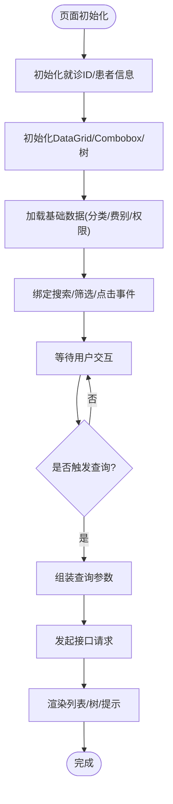
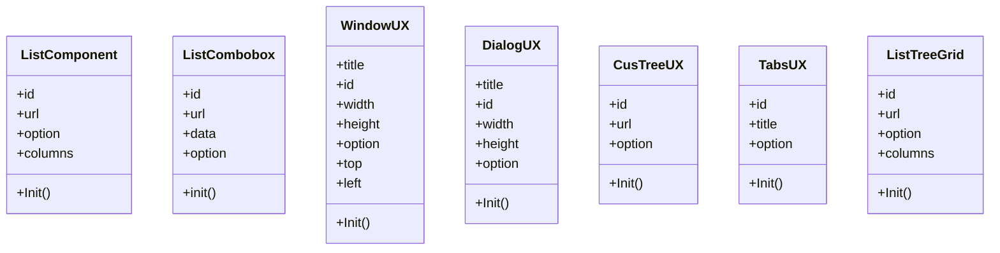

# 前端性能优化

<cite>
**本文引用的文件**
- [dhcapp.mainframe.csp](file://src/frontend/doc-ws/csp/dhcapp.mainframe.csp)
- [mainframe.js](file://src/frontend/doc-ws/scripts/dhcdoc/dhcapp/mainframe.js)
- [hiscomponent.js](file://src/frontend/public-mc/scripts/dhcdoc/common/hiscomponent.js)
</cite>

## 目录
1. [简介](#简介)
2. [项目结构](#项目结构)
3. [核心组件](#核心组件)
4. [架构总览](#架构总览)
5. [详细组件分析](#详细组件分析)
6. [依赖关系分析](#依赖关系分析)
7. [性能考量](#性能考量)
8. [故障排查指南](#故障排查指南)
9. [结论](#结论)
10. [附录](#附录)

## 简介
本文件面向HIS系统中的CSP页面与HISUI组件库，提供一套可落地的前端性能优化方案。内容覆盖：
- 页面加载速度优化（资源拆分、按需加载、首屏关键路径）
- JavaScript执行效率提升（事件合并、防抖节流、减少重排重绘）
- CSS渲染优化（样式分离、避免阻塞、最小化布局抖动）
- 资源压缩与缓存策略（静态资源、接口数据、浏览器缓存）
- HISUI组件库优化（组件懒加载、事件处理优化、DOM操作优化）
- 前端性能监控（响应时间、内存泄漏、网络请求）
- 常见问题定位与解决

## 项目结构
本项目采用多模块前端组织方式，CSP页面位于各业务域下，公共脚本与组件封装集中在public-mc中，通过统一入口引入。典型的主框架页面由CSP负责结构与基础资源引入，JS负责交互与数据加载，HISUI组件封装在公共脚本中供复用。

图表来源
- [dhcapp.mainframe.csp:1-179](file://src/frontend/doc-ws/csp/dhcapp.mainframe.csp#L1-L179)
- [mainframe.js:1-800](file://src/frontend/doc-ws/scripts/dhcdoc/dhcapp/mainframe.js#L1-L800)
- [hiscomponent.js:1-200](file://src/frontend/public-mc/scripts/dhcdoc/common/hiscomponent.js#L1-L200)

章节来源
- [dhcapp.mainframe.csp:1-179](file://src/frontend/doc-ws/csp/dhcapp.mainframe.csp#L1-L179)
- [mainframe.js:1-800](file://src/frontend/doc-ws/scripts/dhcdoc/dhcapp/mainframe.js#L1-L800)
- [hiscomponent.js:1-200](file://src/frontend/public-mc/scripts/dhcdoc/common/hiscomponent.js#L1-L200)

## 核心组件
- CSP主框架页面：负责页面骨架、基础CSS/JS引入、服务端配置注入、区域布局与iframe子页切换。
- 主框架脚本：初始化页面、绑定事件、构建列表与树、发起数据请求、控制子页面路由与刷新。
- HISUI组件封装：对Combobox、DataGrid、Window、Dialog、Tree、Tabs、ListTreeGrid等进行统一封装，简化调用并内置默认参数。

章节来源
- [dhcapp.mainframe.csp:1-179](file://src/frontend/doc-ws/csp/dhcapp.mainframe.csp#L1-L179)
- [mainframe.js:1-800](file://src/frontend/doc-ws/scripts/dhcdoc/dhcapp/mainframe.js#L1-L800)
- [hiscomponent.js:1-200](file://src/frontend/public-mc/scripts/dhcdoc/common/hiscomponent.js#L1-L200)

## 架构总览
下图展示从CSP到JS再到HISUI组件及后端接口的调用链，体现数据流与控制流的关键节点。

图表来源
- [dhcapp.mainframe.csp:1-179](file://src/frontend/doc-ws/csp/dhcapp.mainframe.csp#L1-L179)
- [mainframe.js:1-800](file://src/frontend/doc-ws/scripts/dhcdoc/dhcapp/mainframe.js#L1-L800)
- [hiscomponent.js:1-200](file://src/frontend/public-mc/scripts/dhcdoc/common/hiscomponent.js#L1-L200)

## 详细组件分析

### 主框架页面（CSP）
- 职责：定义页面结构、引入必要CSS/JS、注入服务端配置、承载布局与工具栏、嵌入iframe用于子页面切换。
- 性能要点：
  - 将非关键脚本延迟或异步加载，减少首屏阻塞。
  - 仅引入当前页面必需的资源，避免全局大体积脚本一次性加载。
  - 使用服务端动态注入的配置变量，减少额外请求。

章节来源
- [dhcapp.mainframe.csp:1-179](file://src/frontend/doc-ws/csp/dhcapp.mainframe.csp#L1-L179)

### 主框架脚本（mainframe.js）
- 职责：页面初始化、事件绑定、列表与树构建、数据加载、子页面路由与刷新。
- 关键流程（初始化与数据加载）：

图表来源
- [mainframe.js:42-65](file://src/frontend/doc-ws/scripts/dhcdoc/dhcapp/mainframe.js#L42-L65)
- [mainframe.js:210-268](file://src/frontend/doc-ws/scripts/dhcdoc/dhcapp/mainframe.js#L210-L268)
- [mainframe.js:469-553](file://src/frontend/doc-ws/scripts/dhcdoc/dhcapp/mainframe.js#L469-L553)
- [mainframe.js:555-587](file://src/frontend/doc-ws/scripts/dhcdoc/dhcapp/mainframe.js#L555-L587)

- 性能优化建议：
  - 列表分页与按需加载：合理设置pageSize/pageList，避免一次性加载过多数据。
  - 事件合并与防抖：对频繁输入（如拼音检索）进行防抖，降低请求频率。
  - DOM批量更新：拼接HTML后一次性插入，减少多次重排。
  - 条件渲染：根据角色/权限/配置动态加载模块，减少无用逻辑。
  - iframe切换：仅在必要时加载子页面，避免重复初始化。

章节来源
- [mainframe.js:42-65](file://src/frontend/doc-ws/scripts/dhcdoc/dhcapp/mainframe.js#L42-L65)
- [mainframe.js:210-268](file://src/frontend/doc-ws/scripts/dhcdoc/dhcapp/mainframe.js#L210-L268)
- [mainframe.js:469-553](file://src/frontend/doc-ws/scripts/dhcdoc/dhcapp/mainframe.js#L469-L553)
- [mainframe.js:555-587](file://src/frontend/doc-ws/scripts/dhcdoc/dhcapp/mainframe.js#L555-L587)

### HISUI组件封装（hiscomponent.js）
- 职责：为Combobox、DataGrid、Window、Dialog、Tree、Tabs、ListTreeGrid等提供统一初始化与默认配置，屏蔽底层差异。
- 性能要点：
  - 默认分页与行高自适应：减少首屏渲染压力。
  - 统一加载提示与错误处理：提升用户体验与可观测性。
  - 集中管理组件实例：便于后续扩展懒加载与销毁机制。

图表来源
- [hiscomponent.js:5-23](file://src/frontend/public-mc/scripts/dhcdoc/common/hiscomponent.js#L5-L23)
- [hiscomponent.js:29-61](file://src/frontend/public-mc/scripts/dhcdoc/common/hiscomponent.js#L29-L61)
- [hiscomponent.js:68-97](file://src/frontend/public-mc/scripts/dhcdoc/common/hiscomponent.js#L68-L97)
- [hiscomponent.js:104-128](file://src/frontend/public-mc/scripts/dhcdoc/common/hiscomponent.js#L104-L128)
- [hiscomponent.js:135-151](file://src/frontend/public-mc/scripts/dhcdoc/common/hiscomponent.js#L135-L151)
- [hiscomponent.js:158-172](file://src/frontend/public-mc/scripts/dhcdoc/common/hiscomponent.js#L158-L172)
- [hiscomponent.js:178-200](file://src/frontend/public-mc/scripts/dhcdoc/common/hiscomponent.js#L178-L200)

章节来源
- [hiscomponent.js:1-200](file://src/frontend/public-mc/scripts/dhcdoc/common/hiscomponent.js#L1-L200)

## 依赖关系分析
- CSP页面依赖主框架脚本与公共组件封装；主框架脚本依赖HISUI组件封装以快速构建界面；所有组件最终通过HTTP访问后端接口。
- 耦合点：
  - CSP与JS之间通过全局变量与函数名约定协作。
  - JS与HISUI之间通过统一封装接口调用，降低与底层库的耦合。
  - 组件与后端接口通过URL与参数约定通信。

图表来源
- [dhcapp.mainframe.csp:1-179](file://src/frontend/doc-ws/csp/dhcapp.mainframe.csp#L1-L179)
- [mainframe.js:1-800](file://src/frontend/doc-ws/scripts/dhcdoc/dhcapp/mainframe.js#L1-L800)
- [hiscomponent.js:1-200](file://src/frontend/public-mc/scripts/dhcdoc/common/hiscomponent.js#L1-L200)

章节来源
- [dhcapp.mainframe.csp:1-179](file://src/frontend/doc-ws/csp/dhcapp.mainframe.csp#L1-L179)
- [mainframe.js:1-800](file://src/frontend/doc-ws/scripts/dhcdoc/dhcapp/mainframe.js#L1-L800)
- [hiscomponent.js:1-200](file://src/frontend/public-mc/scripts/dhcdoc/common/hiscomponent.js#L1-L200)

## 性能考量
- 页面加载速度优化
  - 资源拆分与按需加载：将非首屏所需脚本延后加载，减少初始阻塞。
  - 首屏关键路径：优先加载CSS与核心JS，其他资源异步加载。
  - 服务端配置内联：通过CSP注入配置，避免额外请求。
- JavaScript执行效率提升
  - 事件合并与防抖：对高频输入（如搜索框）进行防抖，降低请求与渲染压力。
  - 减少重排重绘：批量更新DOM，避免逐条插入导致的布局抖动。
  - 条件渲染：根据权限/配置动态加载模块，减少无用计算。
- CSS渲染优化
  - 样式分离与最小化：仅引入必要样式，避免全局污染。
  - 避免阻塞：将非关键样式异步加载或使用媒体查询按需引入。
- 资源压缩与缓存策略
  - 静态资源：启用Gzip/Brotli压缩，设置长期缓存与版本化文件名。
  - 接口数据：合理使用HTTP缓存头（ETag/Last-Modified），对只读数据做短期缓存。
  - CDN与就近分发：静态资源走CDN，降低延迟。
- HISUI组件库优化
  - 组件懒加载：对重型组件（如Tree、DataGrid）按需初始化，关闭时销毁实例释放内存。
  - 事件处理优化：合并监听器，避免重复绑定；使用事件委托减少监听数量。
  - DOM操作优化：批量创建节点，减少直接操作DOM的次数；使用虚拟滚动应对大数据集。
- 监控与度量
  - 页面响应时间：记录首屏时间、TTFB、交互可用时间。
  - 内存泄漏检测：定期采集堆快照，关注未释放的事件监听与定时器。
  - 网络请求优化：统计慢请求、失败率与重试次数，优化接口与缓存策略。

[本节为通用指导，不直接分析具体文件]

## 故障排查指南
- 页面卡顿或白屏
  - 检查是否存在大量同步请求或阻塞脚本；确认是否一次性加载过多数据。
  - 查看控制台是否有JavaScript错误或样式冲突。
- 列表加载缓慢
  - 检查分页参数是否合理；确认后端接口是否返回冗余字段。
  - 评估是否在onLoadSuccess中进行复杂计算或DOM操作。
- 内存持续增长
  - 检查是否存在未移除的事件监听、定时器或闭包引用。
  - 确认窗口/对话框关闭时是否正确销毁实例。
- 网络请求异常
  - 检查URL拼接与参数编码；确认跨域与鉴权配置。
  - 对失败请求增加重试与降级策略，提升鲁棒性。

章节来源
- [mainframe.js:210-268](file://src/frontend/doc-ws/scripts/dhcdoc/dhcapp/mainframe.js#L210-L268)
- [hiscomponent.js:29-61](file://src/frontend/public-mc/scripts/dhcdoc/common/hiscomponent.js#L29-L61)

## 结论
通过对CSP页面、主框架脚本与HISUI组件的系统性优化，结合合理的资源加载、事件与DOM优化、缓存策略以及完善的监控体系，可以显著提升HIS前端页面的加载速度与交互流畅度。建议在迭代中持续度量关键指标，逐步消除性能瓶颈。

[本节为总结，不直接分析具体文件]

## 附录
- 常用优化清单
  - 首屏关键资源内联或预加载
  - 非关键脚本异步加载
  - 列表分页与虚拟滚动
  - 事件防抖与节流
  - 批量DOM操作
  - 组件懒加载与销毁
  - 接口缓存与重试
  - 监控埋点与告警

[本节为补充说明，不直接分析具体文件]