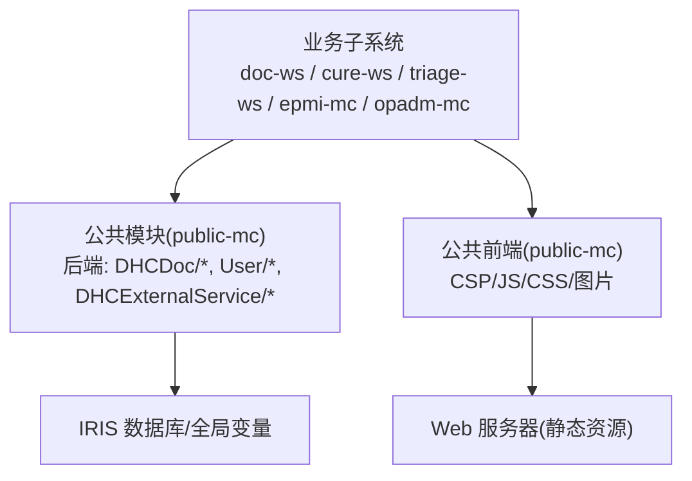
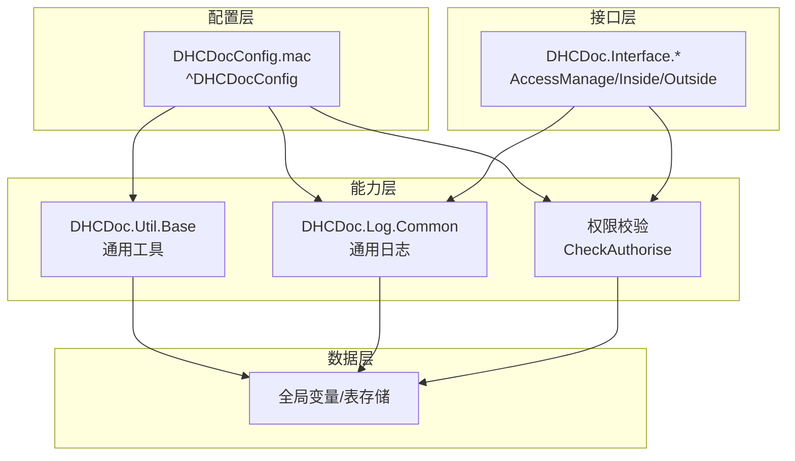
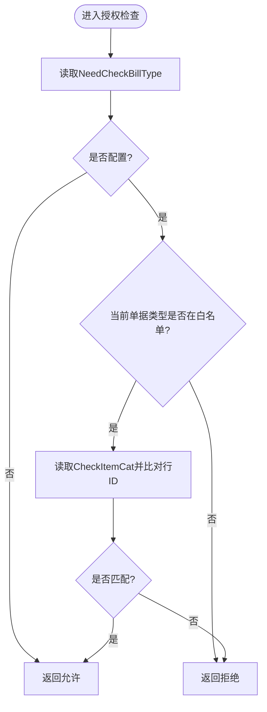
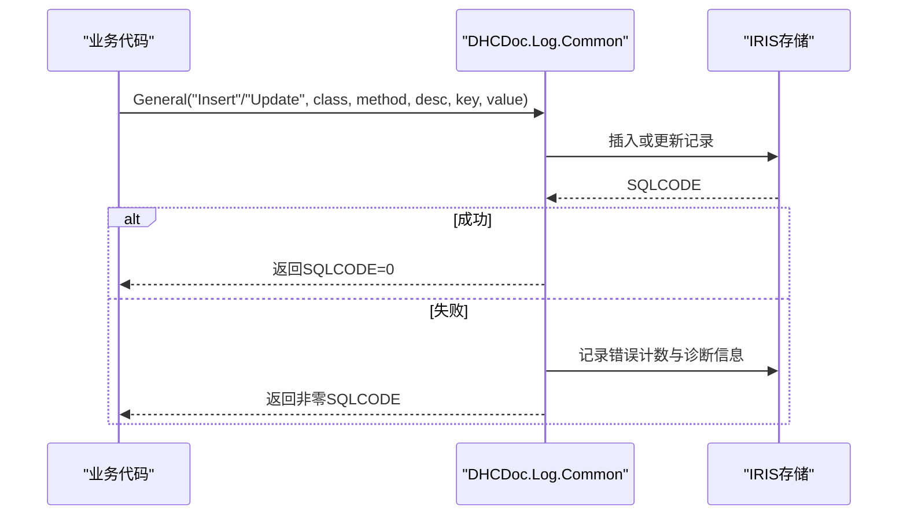
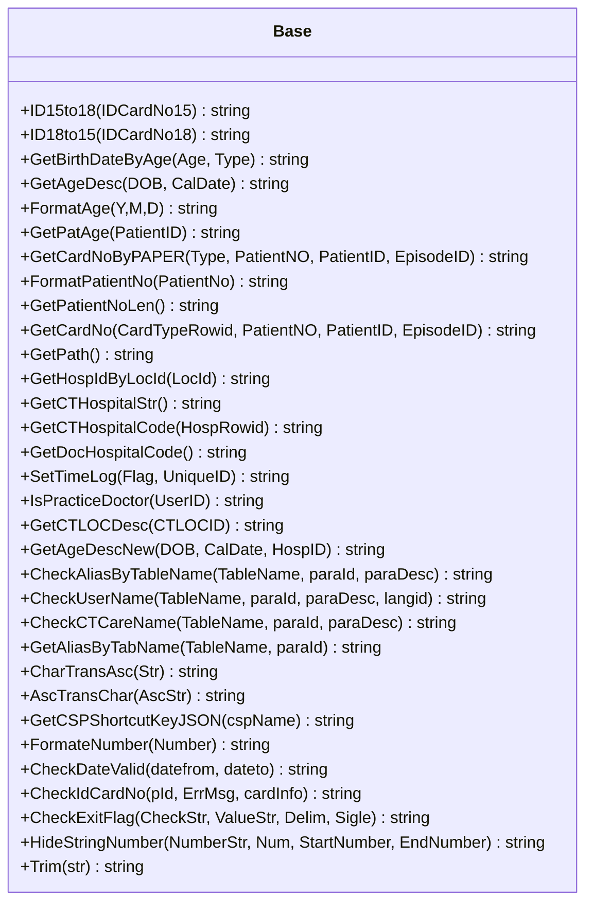
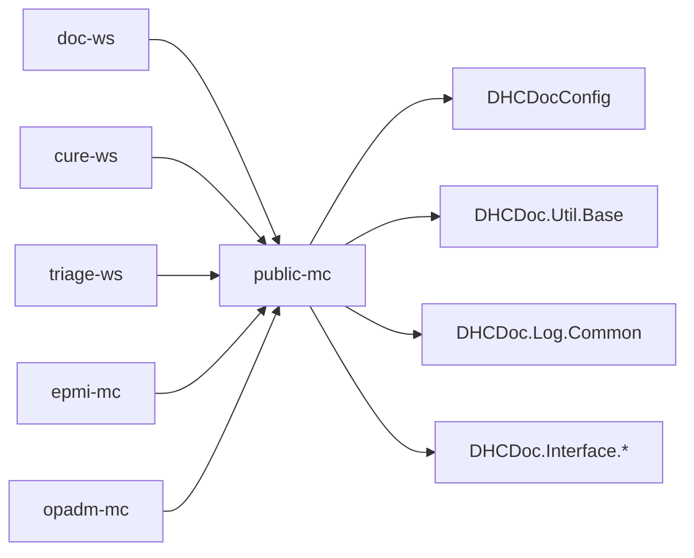

# 公共模块架构

<cite>
**本文引用的文件**
- [README.md](file://README.md)
- [DHCDoc.inc](file://src/backend/public-mc/DHCDoc.inc)
- [DHCDocConfig.mac](file://src/backend/public-mc/DHCDocConfig.mac)
- [Base.cls](file://src/backend/public-mc/DHCDoc/Util/Base.cls)
- [Common.cls](file://src/backend/public-mc/DHCDoc/Log/Common.cls)
</cite>

## 目录
1. [简介](#简介)
2. [项目结构](#项目结构)
3. [核心组件](#核心组件)
4. [架构总览](#架构总览)
5. [详细组件分析](#详细组件分析)
6. [依赖关系分析](#依赖关系分析)
7. [性能考虑](#性能考虑)
8. [故障排查指南](#故障排查指南)
9. [结论](#结论)
10. [附录：接口契约与使用示例](#附录接口契约与使用示例)

## 简介
本文件面向 IRIS HIS 项目的“公共模块”（public-mc），系统阐述其作为多子系统共享基础设施的定位与设计。公共模块提供配置管理、权限控制、日志记录、通用工具类等能力，供医生工作站、治疗系统、分诊系统、患者主索引等子系统复用。文档重点说明：
- 配置驱动的设计理念与安全访问控制
- 公共模块的接口规范与扩展机制
- 各业务模块对公共模块的依赖关系与调用方式
- 架构图、服务目录与接口契约
- 公共 API 的使用示例与最佳实践

## 项目结构
public-mc 位于后端代码根目录下的 public-mc 子模块，包含配置、工具、日志、接口、用户域模型、外部服务适配等目录。前端公共资源位于 src/frontend/public-mc，由所有产品前端共享。后端通过 IRIS ObjectScript 直接编译上传至 IRIS 命名空间，不经过 SFTP；前端资源通过脚本统一上传到服务器路径。

图表来源
- [README.md:10-50](file://README.md#L10-L50)

章节来源
- [README.md:10-50](file://README.md#L10-L50)

## 核心组件
- 配置管理
  - 基于全局变量 ^DHCDocConfig 的轻量配置中心，提供读写、按节点获取、批量枚举与清理等方法，支持按院区维度进行配置隔离（通过类方法封装）。
  - 关键入口：DHCDocConfig.mac 中的 saveconfig/getconfignode/getconfignodes/checkauthorise 等例程。
- 权限控制
  - 在配置中维护需要校验的单据类型与检查项类别，结合业务单据类型与行 ID 进行授权判定。
  - 关键入口：CheckAuthorise 例程。
- 日志记录
  - 通用日志持久化类 DHCDoc.Log.Common，支持插入或更新模式，记录调用类、方法、描述、键值与值，并附带失败计数与错误信息。
  - 关键入口：General 方法。
- 工具类
  - DHCDoc.Util.Base 提供身份证转换、年龄计算、日期时间格式化、医院/科室/用户信息查询、别名匹配、字符串处理等通用能力。
  - 关键入口：ID15to18/GetBirthDateByAge/GetAgeDescNew/CheckIdCardNo/Trim 等方法。
- 接口与外部服务
  - DHCDoc.Interface.* 提供内外接口、访问日志、卡务管理等能力，便于跨系统对接与审计。
- 用户域与页面配置
  - User/* 提供用户相关数据模型与页面配置、快捷键、工作流等支撑。

章节来源
- [DHCDocConfig.mac:1-119](file://src/backend/public-mc/DHCDocConfig.mac#L1-L119)
- [Common.cls:1-138](file://src/backend/public-mc/DHCDoc/Log/Common.cls#L1-L138)
- [Base.cls:1-800](file://src/backend/public-mc/DHCDoc/Util/Base.cls#L1-L800)

## 架构总览
公共模块采用“配置驱动 + 工具复用 + 日志可观测”的分层设计：
- 配置层：集中管理运行期参数与策略开关，避免硬编码，支持院区级隔离。
- 能力层：工具类、日志、权限校验等横切能力，被各业务子系统按需调用。
- 接口层：对外暴露标准化接口（内部/外部），统一鉴权与审计。
- 数据层：通过 IRIS 全局变量与表存储实现配置与日志的持久化。

图表来源
- [DHCDocConfig.mac:1-119](file://src/backend/public-mc/DHCDocConfig.mac#L1-L119)
- [Base.cls:1-800](file://src/backend/public-mc/DHCDoc/Util/Base.cls#L1-L800)
- [Common.cls:1-138](file://src/backend/public-mc/DHCDoc/Log/Common.cls#L1-L138)

## 详细组件分析

### 配置管理系统（DHCDocConfig）
- 设计要点
  - 以全局变量 ^DHCDocConfig 为配置存储，提供保存、读取、按节点获取、批量枚举与清理等基础操作。
  - 通过类方法封装院区节点隔离逻辑，避免业务代码直接操作全局变量导致耦合。
  - 提供 CheckAuthorise 用于按单据类型与检查项类别进行授权判断。
- 关键流程
  - 保存配置：saveconfig(node,value)
  - 读取配置：getconfignode(node)/getconfignodes(node)
  - 授权检查：CheckAuthorise(billtype,arccatrowid)
- 复杂度与影响
  - 配置读取为 O(1) 或 O(n)（n 为子节点数），整体开销低。
  - 授权检查依赖配置项 NeedCheckBillType、CheckItemCat，若未配置则快速返回允许。

图表来源
- [DHCDocConfig.mac:27-38](file://src/backend/public-mc/DHCDocConfig.mac#L27-L38)

章节来源
- [DHCDocConfig.mac:1-119](file://src/backend/public-mc/DHCDocConfig.mac#L1-L119)

### 权限控制（CheckAuthorise）
- 行为说明
  - 当配置 NeedCheckBillType 为空时，默认放行。
  - 若当前单据类型不在需检查列表，直接放行。
  - 否则进一步根据 CheckItemCat 与传入的行 ID 进行匹配校验，决定是否允许。
- 扩展点
  - 可通过新增配置项或调整 CheckItemCat 内容实现细粒度控制。
  - 可在类方法层面增加院区维度过滤，增强多院区场景下的安全性。

章节来源
- [DHCDocConfig.mac:27-38](file://src/backend/public-mc/DHCDocConfig.mac#L27-L38)

### 日志记录（DHCDoc.Log.Common）
- 设计要点
  - 提供 Insert/Update 两种写入模式，按 CallClass/CallMethod/LogKey 唯一键进行去重更新。
  - 记录调用类、方法、描述、键值与值，并自动记录失败次数与诊断信息。
  - 提供索引优化查询性能（LogKey、InsertDate）。
- 使用建议
  - 在关键业务路径（如医嘱执行、计费、打印）前后记录日志，便于问题定位。
  - 合理设置 LogKey，确保幂等更新与高效检索。

图表来源
- [Common.cls:49-87](file://src/backend/public-mc/DHCDoc/Log/Common.cls#L49-L87)

章节来源
- [Common.cls:1-138](file://src/backend/public-mc/DHCDoc/Log/Common.cls#L1-L138)

### 工具类（DHCDoc.Util.Base）
- 功能概览
  - 身份与人口学：身份证号15/18位互转、年龄计算、出生日期推导、年龄描述格式化。
  - 机构与人员：医院/科室/用户信息查询、别名匹配、用户名匹配。
  - 数据格式：日期时间格式化、数字格式化、字符串隐藏与修剪。
  - 其他：快捷键配置读取、时间日志记录、有效期校验等。
- 复杂度与影响
  - 多数方法为 O(1) 或 O(n)（n 为短串长度），性能开销低。
  - 涉及数据库访问的方法（如 GetPatAge、GetCardNoByPAPER）应谨慎使用，避免热点路径频繁调用。

图表来源
- [Base.cls:1-800](file://src/backend/public-mc/DHCDoc/Util/Base.cls#L1-L800)

章节来源
- [Base.cls:1-800](file://src/backend/public-mc/DHCDoc/Util/Base.cls#L1-L800)

### 接口与外部服务（DHCDoc.Interface）
- 职责划分
  - AccessManage：访问管理与审计。
  - Inside/Outside：内部与外部接口适配。
  - CardManage：卡务相关接口。
- 集成方式
  - 通过统一的接口入口进行鉴权、参数校验与日志记录，再转发至具体业务服务。
  - 借助公共日志与配置，实现跨系统的可观测性与策略控制。

章节来源
- [DHCDoc.inc:1-8](file://src/backend/public-mc/DHCDoc.inc#L1-L8)

## 依赖关系分析
- 业务子系统依赖公共模块的方式
  - 通过调用 DHCDoc.Util.Base 的工具方法完成通用数据处理。
  - 通过 DHCDoc.Log.Common 记录关键操作日志。
  - 通过 DHCDocConfig 读取配置并进行权限校验。
  - 通过 DHCDoc.Interface.* 进行跨系统调用与审计。
- 耦合与内聚
  - 公共模块将横切关注点（配置、日志、权限、工具）从业务中解耦，提升内聚性。
  - 业务模块仅依赖稳定的公共接口，降低变更风险。

图表来源
- [README.md:10-50](file://README.md#L10-L50)
- [DHCDocConfig.mac:1-119](file://src/backend/public-mc/DHCDocConfig.mac#L1-L119)
- [Base.cls:1-800](file://src/backend/public-mc/DHCDoc/Util/Base.cls#L1-L800)
- [Common.cls:1-138](file://src/backend/public-mc/DHCDoc/Log/Common.cls#L1-L138)

章节来源
- [README.md:10-50](file://README.md#L10-L50)

## 性能考虑
- 配置读取
  - 优先使用 getconfignode/getconfignodes 进行缓存式读取，避免重复 I/O。
  - 对高频配置项建议在应用层做短期缓存。
- 日志写入
  - 使用 Update 模式减少重复插入，利用索引提升查询效率。
  - 在高并发场景下，可对日志写入进行批处理或异步化（需评估一致性要求）。
- 工具方法
  - 避免在热路径中频繁调用数据库访问方法（如 GetPatAge、GetCardNoByPAPER）。
  - 字符串处理与数值格式化方法开销较低，可放心使用。

## 故障排查指南
- 配置相关问题
  - 现象：授权失败或未按预期放行。
  - 排查：检查 NeedCheckBillType 与 CheckItemCat 配置是否正确；确认传入的单据类型与行 ID 是否符合预期。
  - 参考：CheckAuthorise 逻辑。
- 日志异常
  - 现象：日志未写入或写入失败。
  - 排查：查看 Common 类的错误计数与诊断信息；确认 SQLCODE 与存储可用性。
  - 参考：General 方法的失败处理分支。
- 工具方法报错
  - 现象：身份证号校验失败或年龄计算异常。
  - 排查：检查输入格式与范围；确认语言环境与日期时间格式。
  - 参考：CheckIdCardNo、GetAgeDescNew 等方法。

章节来源
- [DHCDocConfig.mac:27-38](file://src/backend/public-mc/DHCDocConfig.mac#L27-L38)
- [Common.cls:49-87](file://src/backend/public-mc/DHCDoc/Log/Common.cls#L49-L87)
- [Base.cls:646-728](file://src/backend/public-mc/DHCDoc/Util/Base.cls#L646-L728)

## 结论
公共模块通过配置驱动、工具复用与日志可观测，为多子系统提供了稳定、可扩展的基础设施。其清晰的接口规范与良好的内聚性，降低了业务模块的耦合度与维护成本。建议在后续演进中继续强化院区级配置隔离、日志异步化与接口标准化，以提升整体性能与可维护性。

## 附录：接口契约与使用示例

### 配置管理接口（DHCDocConfig）
- 保存配置
  - 方法：saveconfig(node,value)
  - 用途：写入配置节点值。
  - 示例：保存限制时长与医保项目类别。
- 读取配置
  - 方法：getconfignode(node)/getconfignodes(node)
  - 用途：按节点或批量获取配置。
  - 示例：读取 NeedCheckBillType、CheckItemCat。
- 授权检查
  - 方法：CheckAuthorise(billtype,arccatrowid)
  - 用途：根据配置判断是否允许操作。
  - 示例：在医嘱保存前进行授权校验。

章节来源
- [DHCDocConfig.mac:4-38](file://src/backend/public-mc/DHCDocConfig.mac#L4-L38)

### 日志接口（DHCDoc.Log.Common）
- 通用日志
  - 方法：General(InsType, CallClass, CallMethod, LogDesc, LogKey, LogValue)
  - 用途：插入或更新日志记录，失败时记录错误信息。
  - 示例：在关键业务步骤前后记录日志，便于追踪。

章节来源
- [Common.cls:49-87](file://src/backend/public-mc/DHCDoc/Log/Common.cls#L49-L87)

### 工具接口（DHCDoc.Util.Base）
- 身份证转换
  - 方法：ID15to18/ID18to15
  - 用途：15/18位身份证号互转。
  - 示例：在患者登记时统一身份证格式。
- 年龄计算
  - 方法：GetBirthDateByAge/GetAgeDescNew
  - 用途：根据年龄描述或出生日期计算年龄。
  - 示例：在计费或报表中展示年龄。
- 字符串处理
  - 方法：Trim/HideStringNumber
  - 用途：去除空格、隐藏敏感数字。
  - 示例：在输出前对手机号进行脱敏。

章节来源
- [Base.cls:12-45](file://src/backend/public-mc/DHCDoc/Util/Base.cls#L12-L45)
- [Base.cls:54-151](file://src/backend/public-mc/DHCDoc/Util/Base.cls#L54-L151)
- [Base.cls:448-460](file://src/backend/public-mc/DHCDoc/Util/Base.cls#L448-L460)
- [Base.cls:763-800](file://src/backend/public-mc/DHCDoc/Util/Base.cls#L763-L800)

### 最佳实践
- 配置驱动
  - 将策略与开关集中在配置中，避免硬编码；通过类方法封装院区隔离。
- 安全访问控制
  - 在关键业务入口调用 CheckAuthorise；对敏感操作增加二次校验。
- 日志可观测
  - 在关键路径记录日志；使用 Update 模式保证幂等；定期归档与清理。
- 工具复用
  - 优先使用 Base 中的通用方法；避免重复造轮子。
- 接口标准化
  - 通过 Interface 层统一鉴权与审计；保持对外契约稳定。