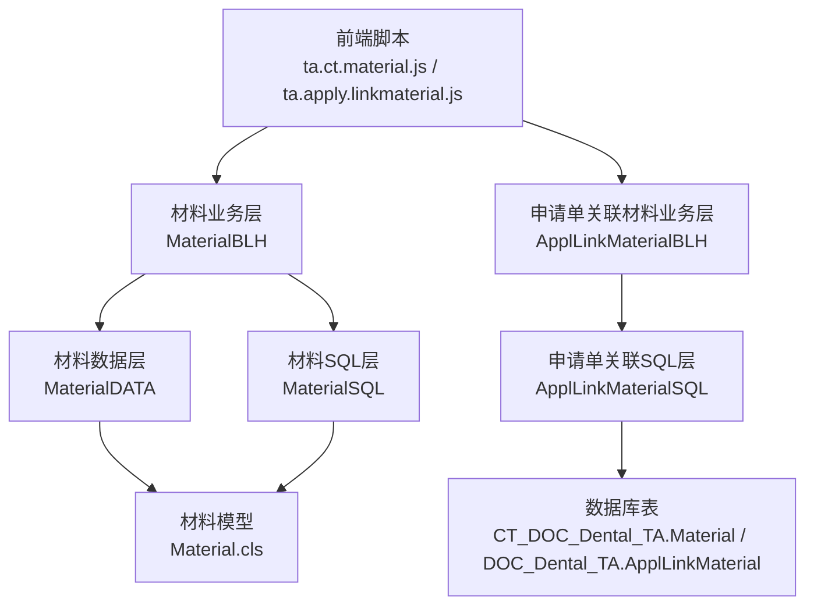
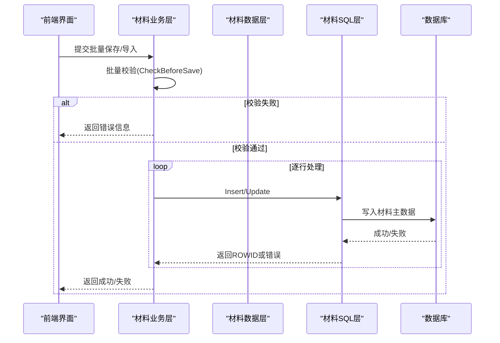
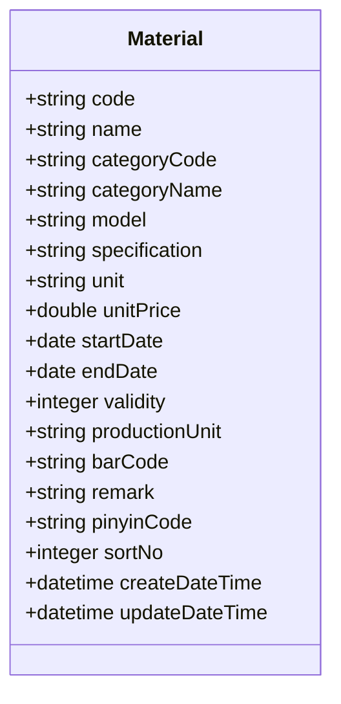
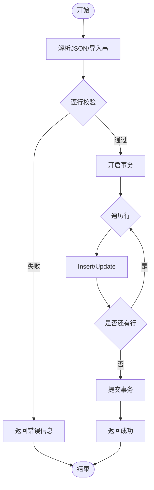
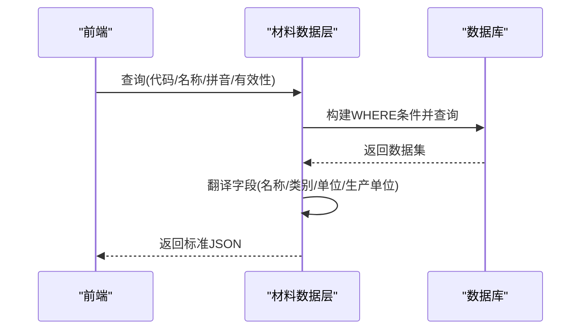
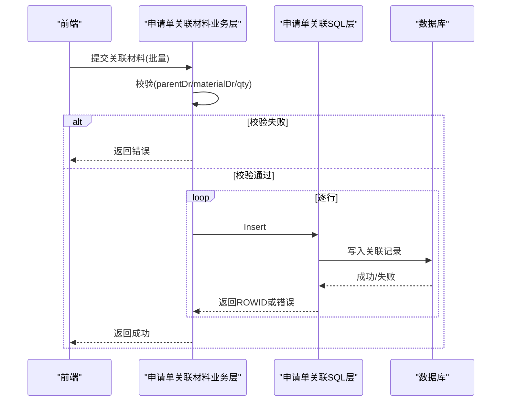
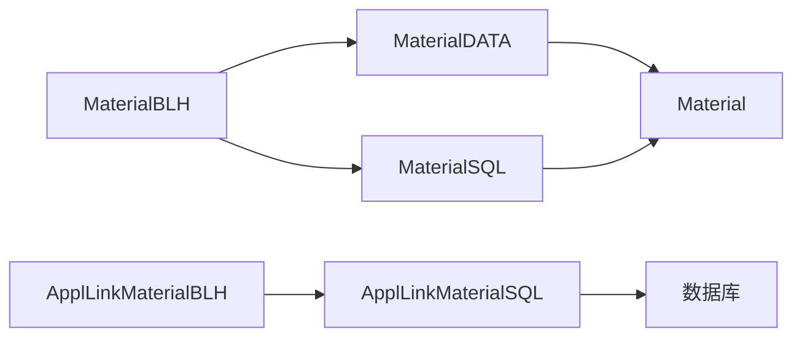

# 牙科材料管理

<cite>
**本文引用的文件**
- [Material.cls](file://src/backend/dental-ws/CT/DOC/Dental/TA/Material.cls)
- [MaterialBLH.cls](file://src/backend/dental-ws/DHCDoc/Dental/TA/CT/MaterialBLH.cls)
- [MaterialDATA.cls](file://src/backend/dental-ws/DHCDoc/Dental/TA/CT/MaterialDATA.cls)
- [MaterialSQL.cls](file://src/backend/dental-ws/DHCDoc/Dental/TA/CT/MaterialSQL.cls)
- [ApplLinkMaterialBLH.cls](file://src/backend/dental-ws/DHCDoc/Dental/TA/ApplLinkMaterialBLH.cls)
- [ApplLinkMaterialDATA.cls](file://src/backend/dental-ws/DHCDoc/Dental/TA/ApplLinkMaterialDATA.cls)
- [ApplLinkMaterialSQL.cls](file://src/backend/dental-ws/DHCDoc/Dental/TA/ApplLinkMaterialSQL.cls)
- [ta.ct.material.js](file://src/frontend/dental-ws/scripts/dhcdoc/dental/ta.ct.material.js)
- [ta.apply.linkmaterial.js](file://src/frontend/dental-ws/scripts/dhcdoc/dental/ta.apply.linkmaterial.js)
</cite>

## 目录
1. [简介](#简介)
2. [项目结构](#项目结构)
3. [核心组件](#核心组件)
4. [架构总览](#架构总览)
5. [详细组件分析](#详细组件分析)
6. [依赖关系分析](#依赖关系分析)
7. [性能考虑](#性能考虑)
8. [故障排查指南](#故障排查指南)
9. [结论](#结论)
10. [附录](#附录)

## 简介
本模块为牙科材料管理提供完整的数据模型、业务逻辑与前后端交互能力，覆盖材料字典维护（分类、规格、价格、有效期等）、技工申请单关联材料、批量导入导出、材料选择与替换建议、以及库存与使用跟踪的基础数据支撑。文档从系统架构、数据流、业务流程、权限与一致性保障等方面展开，帮助读者快速理解并正确使用该模块。

## 项目结构
后端采用分层设计：
- 领域模型层：定义材料主数据实体及索引、计算字段与存储映射。
- 业务逻辑层（BLH）：负责保存校验、批量处理、导入模板、预处理等。
- 数据访问层（SQL）：封装插入、更新、删除、汇总等 SQL 操作。
- 数据查询层（DATA）：提供查询、翻译、排序、过滤等统一返回格式。
- 前端脚本：材料字典维护页面、技工申请单中材料选择与关联。

图表来源
- [Material.cls:1-152](file://src/backend/dental-ws/CT/DOC/Dental/TA/Material.cls#L1-L152)
- [MaterialBLH.cls:1-152](file://src/backend/dental-ws/DHCDoc/Dental/TA/CT/MaterialBLH.cls#L1-L152)
- [MaterialDATA.cls:1-56](file://src/backend/dental-ws/DHCDoc/Dental/TA/CT/MaterialDATA.cls#L1-L56)
- [MaterialSQL.cls:1-84](file://src/backend/dental-ws/DHCDoc/Dental/TA/CT/MaterialSQL.cls#L1-L84)
- [ApplLinkMaterialBLH.cls:1-100](file://src/backend/dental-ws/DHCDoc/Dental/TA/ApplLinkMaterialBLH.cls#L1-L100)
- [ApplLinkMaterialSQL.cls:1-78](file://src/backend/dental-ws/DHCDoc/Dental/TA/ApplLinkMaterialSQL.cls#L1-L78)

章节来源
- [Material.cls:1-152](file://src/backend/dental-ws/CT/DOC/Dental/TA/Material.cls#L1-L152)
- [MaterialBLH.cls:1-152](file://src/backend/dental-ws/DHCDoc/Dental/TA/CT/MaterialBLH.cls#L1-L152)
- [MaterialDATA.cls:1-56](file://src/backend/dental-ws/DHCDoc/Dental/TA/CT/MaterialDATA.cls#L1-L56)
- [MaterialSQL.cls:1-84](file://src/backend/dental-ws/DHCDoc/Dental/TA/CT/MaterialSQL.cls#L1-L84)
- [ApplLinkMaterialBLH.cls:1-100](file://src/backend/dental-ws/DHCDoc/Dental/TA/ApplLinkMaterialBLH.cls#L1-L100)
- [ApplLinkMaterialSQL.cls:1-78](file://src/backend/dental-ws/DHCDoc/Dental/TA/ApplLinkMaterialSQL.cls#L1-L78)

## 核心组件
- 材料主数据模型：包含代码、名称、类别、型号、规格、单位、单价、有效期、生产单位、条形码、备注、拼音码、排序号等，支持按日期区间控制有效性。
- 材料业务层：提供批量保存、导入、模板下载、行级校验与预处理（如自动生成拼音码）。
- 材料数据层：支持按代码/名称/拼音模糊检索、按有效性筛选、多语言翻译与排序。
- 申请单关联材料：将材料与技工申请单建立关联，记录数量、单价、金额，支持逻辑删除与合计金额汇总。
- 前端界面：材料字典维护页、技工申请单中的材料选择与关联编辑。

章节来源
- [Material.cls:1-152](file://src/backend/dental-ws/CT/DOC/Dental/TA/Material.cls#L1-L152)
- [MaterialBLH.cls:1-152](file://src/backend/dental-ws/DHCDoc/Dental/TA/CT/MaterialBLH.cls#L1-L152)
- [MaterialDATA.cls:1-56](file://src/backend/dental-ws/DHCDoc/Dental/TA/CT/MaterialDATA.cls#L1-L56)
- [ApplLinkMaterialBLH.cls:1-100](file://src/backend/dental-ws/DHCDoc/Dental/TA/ApplLinkMaterialBLH.cls#L1-L100)
- [ApplLinkMaterialDATA.cls:1-54](file://src/backend/dental-ws/DHCDoc/Dental/TA/ApplLinkMaterialDATA.cls#L1-L54)
- [ApplLinkMaterialSQL.cls:1-78](file://src/backend/dental-ws/DHCDoc/Dental/TA/ApplLinkMaterialSQL.cls#L1-L78)

## 架构总览
材料管理遵循“模型-业务-数据-接口”的分层模式，前后端通过 JSON 交互，业务层负责校验与事务控制，数据层执行持久化，查询层负责结果集组装与翻译。

图表来源
- [MaterialBLH.cls:1-152](file://src/backend/dental-ws/DHCDoc/Dental/TA/CT/MaterialBLH.cls#L1-L152)
- [MaterialSQL.cls:1-84](file://src/backend/dental-ws/DHCDoc/Dental/TA/CT/MaterialSQL.cls#L1-L84)

章节来源
- [MaterialBLH.cls:1-152](file://src/backend/dental-ws/DHCDoc/Dental/TA/CT/MaterialBLH.cls#L1-L152)
- [MaterialSQL.cls:1-84](file://src/backend/dental-ws/DHCDoc/Dental/TA/CT/MaterialSQL.cls#L1-L84)

## 详细组件分析

### 材料主数据模型（Material）
- 关键字段
  - 唯一标识：code（唯一索引）
  - 基本信息：name、categoryCode、categoryName、model、specification、unit
  - 价格与有效期：unitPrice、startDate、endDate、validity（由开始/结束日期计算）
  - 扩展信息：productionUnit、barCode、remark、pinyinCode、sortNo
  - 审计字段：createUserDR、createDateTime、updateUserDR、updateDateTime
- 有效性计算：根据当前时间与起止日期判断是否有效，用于查询过滤与展示。
- 存储映射：类属性与数据库字段一一对应，包含索引与计算列配置。

图表来源
- [Material.cls:1-152](file://src/backend/dental-ws/CT/DOC/Dental/TA/Material.cls#L1-L152)

章节来源
- [Material.cls:1-152](file://src/backend/dental-ws/CT/DOC/Dental/TA/Material.cls#L1-L152)

### 材料业务层（MaterialBLH）
- 批量保存：接收 JSON 数组，逐行校验后进入事务，任一失败回滚。
- 行级校验：必填项检查（代码、名称、类别、单位、单价）、日期合法性、代码唯一性。
- 导入功能：解析分隔字符串，自动设置无效状态的结束日期，生成拼音码。
- 模板导出：提供示例行以指导导入格式。

图表来源
- [MaterialBLH.cls:1-152](file://src/backend/dental-ws/DHCDoc/Dental/TA/CT/MaterialBLH.cls#L1-L152)

章节来源
- [MaterialBLH.cls:1-152](file://src/backend/dental-ws/DHCDoc/Dental/TA/CT/MaterialBLH.cls#L1-L152)

### 材料数据层（MaterialDATA）
- 查询能力：支持按代码、名称、拼音模糊匹配；按有效性过滤；按排序号排序。
- 多语言翻译：对名称、类别、单位、生产单位进行本地化翻译。
- 统一返回：封装为标准 JSON 结构，便于前端消费。

图表来源
- [MaterialDATA.cls:1-56](file://src/backend/dental-ws/DHCDoc/Dental/TA/CT/MaterialDATA.cls#L1-L56)

章节来源
- [MaterialDATA.cls:1-56](file://src/backend/dental-ws/DHCDoc/Dental/TA/CT/MaterialDATA.cls#L1-L56)

### 材料SQL层（MaterialSQL）
- 插入/更新：填充默认值（如创建时间），处理空日期策略，记录操作人。
- 错误处理：捕获SQL执行异常并返回错误码与消息。
- 事务配合：由业务层控制事务边界，确保批量操作的原子性。

章节来源
- [MaterialSQL.cls:1-84](file://src/backend/dental-ws/DHCDoc/Dental/TA/CT/MaterialSQL.cls#L1-L84)

### 申请单关联材料（ApplLinkMaterial）
- 关联关系：技工申请单（parentDr）与材料（materialDr）的多对一关系，记录数量、单价、金额。
- 业务层：批量保存、行级校验（申请单ID、材料ID、数量合法性）、逻辑删除。
- 数据层：按申请单ID获取关联材料，回填材料基础信息与多语言翻译。
- SQL层：插入关联记录、按父级汇总金额、逻辑删除。

图表来源
- [ApplLinkMaterialBLH.cls:1-100](file://src/backend/dental-ws/DHCDoc/Dental/TA/ApplLinkMaterialBLH.cls#L1-L100)
- [ApplLinkMaterialSQL.cls:1-78](file://src/backend/dental-ws/DHCDoc/Dental/TA/ApplLinkMaterialSQL.cls#L1-L78)

章节来源
- [ApplLinkMaterialBLH.cls:1-100](file://src/backend/dental-ws/DHCDoc/Dental/TA/ApplLinkMaterialBLH.cls#L1-L100)
- [ApplLinkMaterialDATA.cls:1-54](file://src/backend/dental-ws/DHCDoc/Dental/TA/ApplLinkMaterialDATA.cls#L1-L54)
- [ApplLinkMaterialSQL.cls:1-78](file://src/backend/dental-ws/DHCDoc/Dental/TA/ApplLinkMaterialSQL.cls#L1-L78)

### 前端实现要点
- 材料字典维护：提供新增、编辑、批量导入/导出、搜索与分页等功能。
- 技工申请单材料选择：在订单编辑界面选择材料，实时显示名称、单位、价格，支持数量与金额计算。
- 数据同步：前端调用后端接口完成材料字典的CRUD与申请单关联材料的增删改查。

章节来源
- [ta.ct.material.js:1-∞](file://src/frontend/dental-ws/scripts/dhcdoc/dental/ta.ct.material.js)
- [ta.apply.linkmaterial.js:1-∞](file://src/frontend/dental-ws/scripts/dhcdoc/dental/ta.apply.linkmaterial.js)

## 依赖关系分析
- 耦合度
  - 业务层与SQL层解耦：业务层仅调用SQL方法，不直接拼接SQL。
  - 数据层与模型层解耦：查询层通过通用方法读取模型数据并进行翻译。
- 外部依赖
  - 用户与会话：通过会话上下文获取登录医院与用户ID。
  - 多语言服务：翻译名称、类别、单位等字段。
- 潜在循环依赖
  - 当前分层清晰，未发现循环引用。

图表来源
- [MaterialBLH.cls:1-152](file://src/backend/dental-ws/DHCDoc/Dental/TA/CT/MaterialBLH.cls#L1-L152)
- [MaterialSQL.cls:1-84](file://src/backend/dental-ws/DHCDoc/Dental/TA/CT/MaterialSQL.cls#L1-L84)
- [MaterialDATA.cls:1-56](file://src/backend/dental-ws/DHCDoc/Dental/TA/CT/MaterialDATA.cls#L1-L56)
- [ApplLinkMaterialBLH.cls:1-100](file://src/backend/dental-ws/DHCDoc/Dental/TA/ApplLinkMaterialBLH.cls#L1-L100)
- [ApplLinkMaterialSQL.cls:1-78](file://src/backend/dental-ws/DHCDoc/Dental/TA/ApplLinkMaterialSQL.cls#L1-L78)

章节来源
- [MaterialBLH.cls:1-152](file://src/backend/dental-ws/DHCDoc/Dental/TA/CT/MaterialBLH.cls#L1-L152)
- [MaterialSQL.cls:1-84](file://src/backend/dental-ws/DHCDoc/Dental/TA/CT/MaterialSQL.cls#L1-L84)
- [MaterialDATA.cls:1-56](file://src/backend/dental-ws/DHCDoc/Dental/TA/CT/MaterialDATA.cls#L1-L56)
- [ApplLinkMaterialBLH.cls:1-100](file://src/backend/dental-ws/DHCDoc/Dental/TA/ApplLinkMaterialBLH.cls#L1-L100)
- [ApplLinkMaterialSQL.cls:1-78](file://src/backend/dental-ws/DHCDoc/Dental/TA/ApplLinkMaterialSQL.cls#L1-L78)

## 性能考虑
- 查询优化
  - 使用 code 唯一索引加速精确查找。
  - 按 sort_no 排序提升列表展示性能。
  - 有效性过滤减少无效数据返回。
- 批量操作
  - 批量保存使用事务保证一致性与性能。
  - 导入时逐行校验，避免全量失败。
- 缓存建议
  - 对常用字典数据可引入缓存层以减少数据库压力（需结合系统现有缓存机制）。

[本节为通用性能建议，不直接分析具体文件]

## 故障排查指南
- 常见错误
  - 必填项缺失：代码、名称、类别、单位、单价为空将导致校验失败。
  - 日期非法：开始日期大于结束日期将被拒绝。
  - 代码重复：新建时若 code 已存在将提示冲突。
  - 数量非法：申请单关联材料数量必须为正数。
- 定位方法
  - 查看业务层返回的错误码与消息。
  - 检查SQL执行错误码与消息。
  - 确认会话上下文是否正确（医院ID、用户ID）。
- 恢复策略
  - 批量保存失败会回滚，确保数据一致性。
  - 逻辑删除保留历史数据，便于追溯。

章节来源
- [MaterialBLH.cls:47-94](file://src/backend/dental-ws/DHCDoc/Dental/TA/CT/MaterialBLH.cls#L47-L94)
- [ApplLinkMaterialBLH.cls:52-84](file://src/backend/dental-ws/DHCDoc/Dental/TA/ApplLinkMaterialBLH.cls#L52-L84)
- [MaterialSQL.cls:35-39](file://src/backend/dental-ws/DHCDoc/Dental/TA/CT/MaterialSQL.cls#L35-L39)
- [ApplLinkMaterialSQL.cls:35-39](file://src/backend/dental-ws/DHCDoc/Dental/TA/ApplLinkMaterialSQL.cls#L35-L39)

## 结论
牙科材料管理模块通过清晰的层次化设计与严格的校验机制，实现了材料字典的高效维护与技工申请单的精准关联。借助批量操作、导入导出、多语言翻译与有效性控制，满足了复杂业务场景下的数据一致性与可用性需求。建议在后续迭代中引入缓存与更丰富的替换建议算法，进一步提升用户体验与系统性能。

[本节为总结性内容，不直接分析具体文件]

## 附录
- 业务流程说明
  - 材料采购与入库：基于材料字典维护，录入供应商、条形码、单价等信息，作为库存与成本核算基础。
  - 库存管理：结合材料主数据与出入库流水，统计可用库存与预警阈值（需在库存模块扩展）。
  - 使用跟踪：技工申请单关联材料记录用量与金额，形成使用轨迹与成本归集。
- 权限控制建议
  - 基于角色控制材料字典的增删改权限。
  - 限制敏感字段（如单价）的可见性与修改权限。
  - 审计日志记录关键操作人与时间。
- 数据一致性方案
  - 批量操作使用事务，确保原子性。
  - 逻辑删除保留历史，避免数据丢失。
  - 唯一约束与校验规则防止重复与非法数据。

[本节为通用指导内容，不直接分析具体文件]