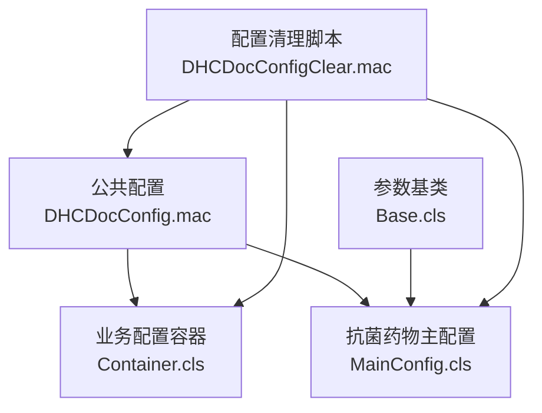
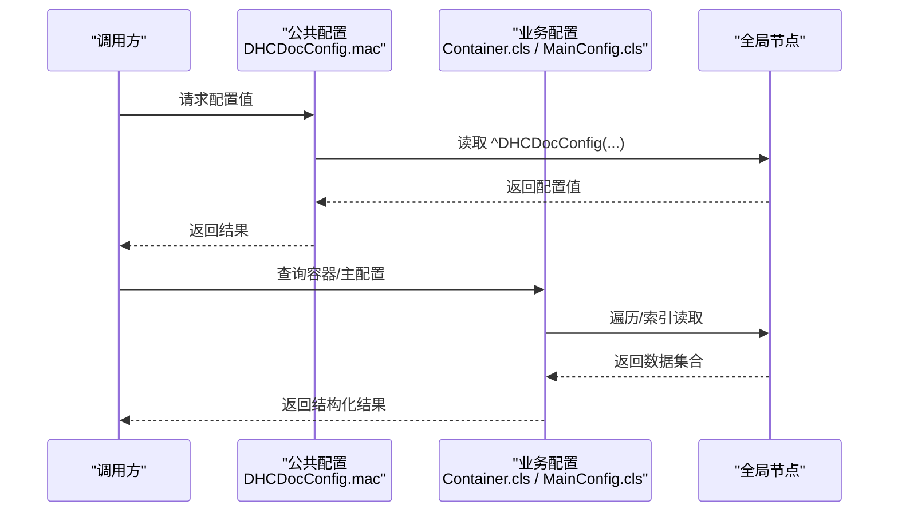
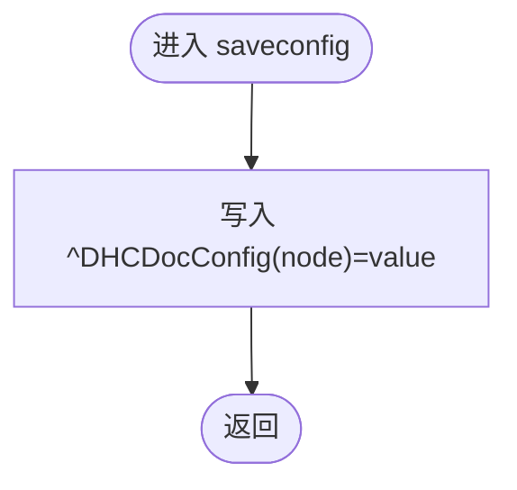
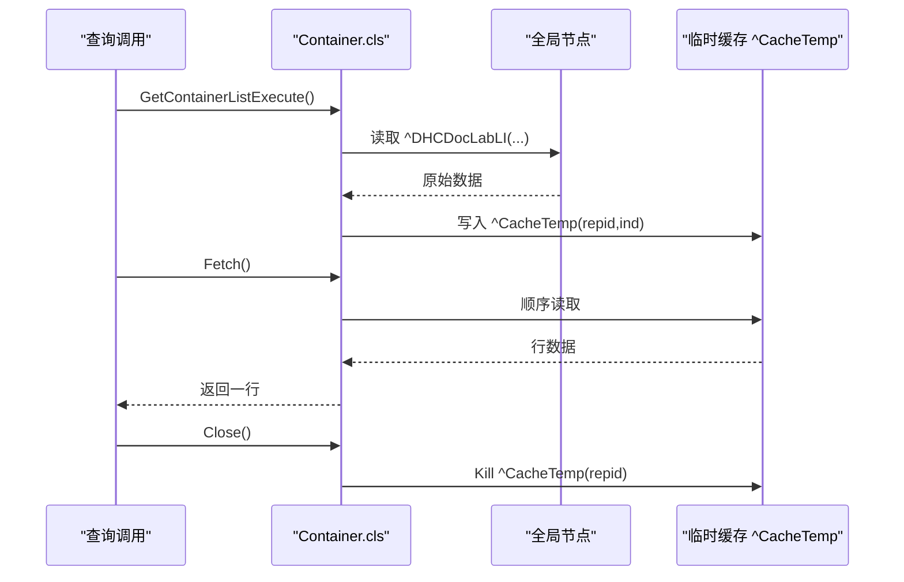
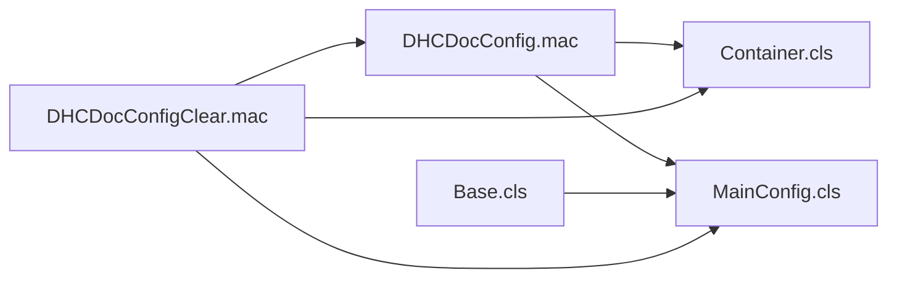

# Global变量设计

<cite>
**本文引用的文件**
- [DHCDocConfig.mac](file://src/backend/public-mc/DHCDocConfig.mac)
- [Container.cls](file://src/backend/doc-ws/DHCDoc/DHCDocConfig/Container.cls)
- [MainConfig.cls](file://src/backend/doc-ws/DHCAnt/Base/MainConfig.cls)
- [Base.cls](file://src/backend/doc-ws/DHCAnt/Param/Base.cls)
- [DHCDocConfigClear.mac](file://src/backend/public-mc/DHCDocConfigClear.mac)
</cite>

## 目录
1. [简介](#简介)
2. [项目结构](#项目结构)
3. [核心组件](#核心组件)
4. [架构总览](#架构总览)
5. [详细组件分析](#详细组件分析)
6. [依赖关系分析](#依赖关系分析)
7. [性能考虑](#性能考虑)
8. [故障排查指南](#故障排查指南)
9. [结论](#结论)
10. [附录](#附录)

## 简介
本设计文档面向IRIS医疗系统中的全局变量（Global）体系，围绕命名规范、层次结构与存储策略进行系统化说明；同时记录读写模式、并发控制与性能优化实践，并给出备份恢复、迁移工具与监控方法。文档基于仓库中实际实现提炼而成，确保可落地、可维护、可扩展。

## 项目结构
系统在全局变量方面采用“公共配置 + 业务域配置”的分层组织方式：
- 公共配置层：提供统一的配置存取入口与通用工具，如医生站配置、日期时间、诊断路径等。
- 业务域配置层：按子系统/领域划分，如检验容器关联、抗菌药物主配置等。
- 清理与维护脚本：集中管理配置的清空、重置与迁移辅助能力。



图表来源
- [DHCDocConfig.mac:1-119](file://src/backend/public-mc/DHCDocConfig.mac#L1-L119)
- [Container.cls:1-241](file://src/backend/doc-ws/DHCDoc/DHCDocConfig/Container.cls#L1-L241)
- [MainConfig.cls:1-260](file://src/backend/doc-ws/DHCAnt/Base/MainConfig.cls#L1-L260)
- [Base.cls:1-56](file://src/backend/doc-ws/DHCAnt/Param/Base.cls#L1-L56)
- [DHCDocConfigClear.mac:1-800](file://src/backend/public-mc/DHCDocConfigClear.mac#L1-L800)

章节来源
- [DHCDocConfig.mac:1-119](file://src/backend/public-mc/DHCDocConfig.mac#L1-L119)
- [Container.cls:1-241](file://src/backend/doc-ws/DHCDoc/DHCDocConfig/Container.cls#L1-L241)
- [MainConfig.cls:1-260](file://src/backend/doc-ws/DHCAnt/Base/MainConfig.cls#L1-L260)
- [Base.cls:1-56](file://src/backend/doc-ws/DHCAnt/Param/Base.cls#L1-L56)
- [DHCDocConfigClear.mac:1-800](file://src/backend/public-mc/DHCDocConfigClear.mac#L1-L800)

## 核心组件
- 公共配置接口（DHCDocConfig.mac）
  - 提供统一的全局配置节点读写封装，避免直接散点访问全局变量，便于后续扩展院区隔离与权限校验。
  - 包含常用工具方法：日期时间格式化、诊断路径设置、当前院区获取等。
- 检验容器配置（Container.cls）
  - 以查询形式暴露容器列表、血型标志、容器与医嘱项绑定等能力，内部使用临时缓存节点提升批量读取性能。
- 抗菌药物主配置（MainConfig.cls）
  - 通过持久化类映射到全局节点，并提供多维度索引，支持按医院、类型、代码等多条件检索。
- 参数基类（Base.cls）
  - 定义各模块表名常量及抽象锁/初始化接口，为后续并发控制与参数初始化提供统一契约。
- 配置清理脚本（DHCDocConfigClear.mac）
  - 提供按模块/院区维度的配置清理能力，覆盖医生站、挂号、排班、处方、草药、安全组授权等大量全局节点。

章节来源
- [DHCDocConfig.mac:1-119](file://src/backend/public-mc/DHCDocConfig.mac#L1-L119)
- [Container.cls:1-241](file://src/backend/doc-ws/DHCDoc/DHCDocConfig/Container.cls#L1-L241)
- [MainConfig.cls:1-260](file://src/backend/doc-ws/DHCAnt/Base/MainConfig.cls#L1-L260)
- [Base.cls:1-56](file://src/backend/doc-ws/DHCAnt/Param/Base.cls#L1-L56)
- [DHCDocConfigClear.mac:1-800](file://src/backend/public-mc/DHCDocConfigClear.mac#L1-L800)

## 架构总览
全局变量的访问遵循“统一入口 + 领域封装 + 索引优化”的架构原则：
- 统一入口：公共配置模块对外暴露saveconfig/getconfig等方法，屏蔽底层全局节点细节。
- 领域封装：业务模块通过类或宏封装具体全局节点的读写逻辑，保证内聚性。
- 索引优化：对高频查询场景构建多级索引节点，减少全量扫描。



图表来源
- [DHCDocConfig.mac:1-119](file://src/backend/public-mc/DHCDocConfig.mac#L1-L119)
- [Container.cls:1-241](file://src/backend/doc-ws/DHCDoc/DHCDocConfig/Container.cls#L1-L241)
- [MainConfig.cls:1-260](file://src/backend/doc-ws/DHCAnt/Base/MainConfig.cls#L1-L260)

## 详细组件分析

### 公共配置模块（DHCDocConfig.mac）
- 职责
  - 提供全局配置的统一读写方法，包括保存、读取、节点枚举与删除。
  - 提供常用工具方法：日期时间处理、诊断路径设置、当前院区获取等。
- 关键节点
  - ^DHCDocConfig：医生站全局配置根节点，支持单级与多级子节点。
  - ^MRC("CPW",...)：诊断路径相关节点。
- 设计要点
  - 所有配置节点不直接暴露给业务层，统一通过方法访问，便于后续加入院区隔离、权限校验与审计。
  - 提供批量枚举与清理方法，降低维护成本。



图表来源
- [DHCDocConfig.mac:4-6](file://src/backend/public-mc/DHCDocConfig.mac#L4-L6)

章节来源
- [DHCDocConfig.mac:1-119](file://src/backend/public-mc/DHCDocConfig.mac#L1-L119)

### 检验容器配置（Container.cls）
- 职责
  - 提供容器列表、血型标志、容器与医嘱项绑定的查询能力。
  - 使用临时缓存节点 ^CacheTemp 提升批量读取性能。
- 关键节点
  - ^DHCDocLabLI("CON",...)：容器与医嘱项绑定数据。
  - ^CacheTemp(repid,ind)：查询过程中的临时缓存。
- 设计要点
  - 查询执行阶段将结果分批写入临时节点，Fetch阶段顺序读取，避免大对象在内存中长时间驻留。
  - Close阶段及时释放临时节点，防止资源泄漏。



图表来源
- [Container.cls:11-81](file://src/backend/doc-ws/DHCDoc/DHCDocConfig/Container.cls#L11-L81)
- [Container.cls:87-131](file://src/backend/doc-ws/DHCDoc/DHCDocConfig/Container.cls#L87-L131)
- [Container.cls:140-190](file://src/backend/doc-ws/DHCDoc/DHCDocConfig/Container.cls#L140-L190)

章节来源
- [Container.cls:1-241](file://src/backend/doc-ws/DHCDoc/DHCDocConfig/Container.cls#L1-L241)

### 抗菌药物主配置（MainConfig.cls）
- 职责
  - 定义抗菌药物全局开关与参数的主配置模型，并通过SQL映射持久化到全局节点。
- 关键节点
  - ^DHCAntBaseMainConfigD：主数据节点。
  - ^DHCAntBaseMainConfigI：多维索引节点（按代码、医院、类型、父级等）。
- 设计要点
  - 使用多索引提升查询效率，支持按医院、类型、代码组合检索。
  - 通过RowId与Subscript建立高效定位，减少全表扫描。

```mermaid
classDiagram
class MainConfig {
+MCG_Type
+MCG_ParentCode
+MCG_Code
+MCG_Desc
+MCG_Active
+MCG_DateFrom
+MCG_DateTo
+MCG_ControlType
+MCG_ControlValue
+MCG_ProcessNext
+MCG_StrB
+MCG_StrC
+MCG_StrD
+MCG_Hosp
}
MainConfig --> "持久化" : "^DHCAntBaseMainConfigD"
MainConfig --> "索引" : "^DHCAntBaseMainConfigI"
```

图表来源
- [MainConfig.cls:1-260](file://src/backend/doc-ws/DHCAnt/Base/MainConfig.cls#L1-L260)

章节来源
- [MainConfig.cls:1-260](file://src/backend/doc-ws/DHCAnt/Base/MainConfig.cls#L1-L260)

### 参数基类（Base.cls）
- 职责
  - 定义各模块表名常量，提供抽象锁与参数初始化接口，作为领域参数的统一基类。
- 设计要点
  - 抽象锁接口便于后续引入分布式锁或进程级锁，保障并发安全。
  - 参数初始化接口支持从JSON等格式加载基础参数，便于配置迁移与版本升级。

章节来源
- [Base.cls:1-56](file://src/backend/doc-ws/DHCAnt/Param/Base.cls#L1-L56)

### 配置清理脚本（DHCDocConfigClear.mac）
- 职责
  - 提供按模块/院区维度的配置清理能力，覆盖医生站、挂号、排班、处方、草药、安全组授权等大量全局节点。
- 设计要点
  - 清理过程分步骤、分模块，避免误删业务数据。
  - 针对历史兼容提供旧版清理方法，逐步淘汰。

章节来源
- [DHCDocConfigClear.mac:1-800](file://src/backend/public-mc/DHCDocConfigClear.mac#L1-L800)

## 依赖关系分析
- 公共配置模块被业务模块广泛引用，形成稳定的配置访问契约。
- 业务模块通过类封装全局节点访问，降低耦合度，提高可测试性。
- 清理脚本依赖公共配置与业务模块的节点约定，确保一致性。



图表来源
- [DHCDocConfig.mac:1-119](file://src/backend/public-mc/DHCDocConfig.mac#L1-L119)
- [Container.cls:1-241](file://src/backend/doc-ws/DHCDoc/DHCDocConfig/Container.cls#L1-L241)
- [MainConfig.cls:1-260](file://src/backend/doc-ws/DHCAnt/Base/MainConfig.cls#L1-L260)
- [Base.cls:1-56](file://src/backend/doc-ws/DHCAnt/Param/Base.cls#L1-L56)
- [DHCDocConfigClear.mac:1-800](file://src/backend/public-mc/DHCDocConfigClear.mac#L1-L800)

章节来源
- [DHCDocConfig.mac:1-119](file://src/backend/public-mc/DHCDocConfig.mac#L1-L119)
- [Container.cls:1-241](file://src/backend/doc-ws/DHCDoc/DHCDocConfig/Container.cls#L1-L241)
- [MainConfig.cls:1-260](file://src/backend/doc-ws/DHCAnt/Base/MainConfig.cls#L1-L260)
- [Base.cls:1-56](file://src/backend/doc-ws/DHCAnt/Param/Base.cls#L1-L56)
- [DHCDocConfigClear.mac:1-800](file://src/backend/public-mc/DHCDocConfigClear.mac#L1-L800)

## 性能考虑
- 批量读取优化
  - 使用临时缓存节点 ^CacheTemp 分批写入与顺序读取，降低内存占用与网络往返。
- 索引优化
  - 对高频查询场景构建多级索引节点，如按医院、类型、代码的组合索引，减少全量扫描。
- 资源释放
  - 查询结束后及时释放临时节点，避免内存泄漏。
- 配置访问收敛
  - 通过统一入口访问全局变量，便于后续加入缓存、限流与审计。

[本节为通用性能建议，无需特定文件来源]

## 故障排查指南
- 常见问题
  - 配置未生效：检查是否通过统一入口写入，确认院区节点是否正确拼接。
  - 查询缓慢：检查是否存在缺失索引，或是否进行了全量扫描。
  - 内存溢出：检查临时缓存节点是否在Close时正确释放。
  - 并发冲突：在写多读少场景下，结合抽象锁接口实现进程级或分布式锁。
- 排查步骤
  - 使用清理脚本验证节点结构是否符合预期。
  - 通过索引节点反查数据分布，定位热点键。
  - 在关键路径增加日志与耗时统计，定位瓶颈。

章节来源
- [DHCDocConfigClear.mac:1-800](file://src/backend/public-mc/DHCDocConfigClear.mac#L1-L800)
- [Base.cls:40-53](file://src/backend/doc-ws/DHCAnt/Param/Base.cls#L40-L53)

## 结论
本设计通过统一入口、领域封装与索引优化，构建了稳定、高效、可维护的全局变量体系。配合清理脚本与监控手段，可有效支撑多院区、多业务域的复杂配置管理需求。建议在后续演进中持续完善并发控制、缓存策略与审计能力，进一步提升系统的可靠性与可观测性。

[本节为总结性内容，无需特定文件来源]

## 附录

### 命名规范
- 根节点命名
  - 公共配置：^DHCDocConfig
  - 业务配置：按领域前缀，如 ^DHCDocLabLI、^DHCAntBaseMainConfigD
- 层级结构
  - 一级：业务域或功能模块
  - 二级：实体或配置项
  - 三级：院区、用户、时间等维度
- 索引节点
  - 以“I”结尾，如 ^DHCAntBaseMainConfigI
  - 多级索引键顺序应匹配常见查询模式

### 层次结构与存储策略
- 存储策略
  - 热数据：使用全局节点直存，必要时加缓存层
  - 冷数据：归档至SQL或其他持久化介质
- 层次结构
  - 公共配置 -> 业务配置 -> 院区/用户维度
- 索引策略
  - 按查询模式构建复合索引，避免全量扫描

### 读写模式与并发控制
- 读模式
  - 优先走索引节点，批量读取使用临时缓存
- 写模式
  - 通过统一入口写入，必要时加锁保护
- 并发控制
  - 使用抽象锁接口实现进程级或分布式锁，避免竞态条件

### 备份恢复与迁移工具
- 备份
  - 定期导出全局节点快照，保留版本信息
- 恢复
  - 提供回滚脚本，按版本号恢复配置
- 迁移
  - 使用参数基类的初始化接口，从JSON等格式加载新配置

### 监控方法
- 指标采集
  - 配置读写次数、延迟、错误率
- 告警规则
  - 异常增长、长时间锁定、索引缺失
- 可视化
  - 配置拓扑图、热点键分布、变更审计

### 最佳实践
- 统一入口访问全局变量
- 小步快跑，频繁提交配置变更
- 严格区分生产与测试环境
- 变更前进行影响评估与回滚演练

### 常见问题解决方案
- 配置不一致：通过清理脚本重建，再导入标准配置
- 性能退化：检查索引与缓存命中率
- 并发冲突：引入锁机制，拆分热点键

[本节为通用指导，无需特定文件来源]