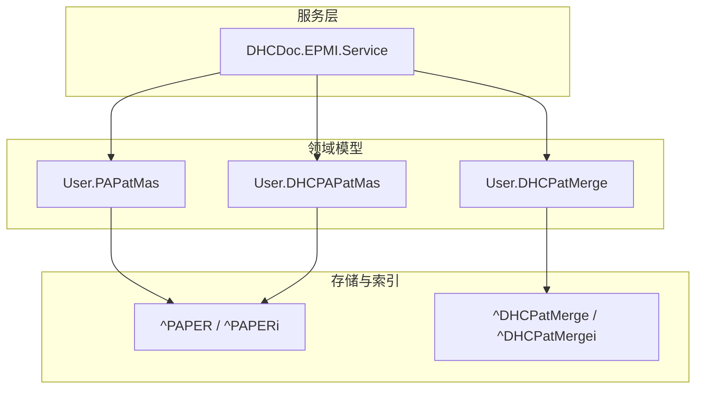
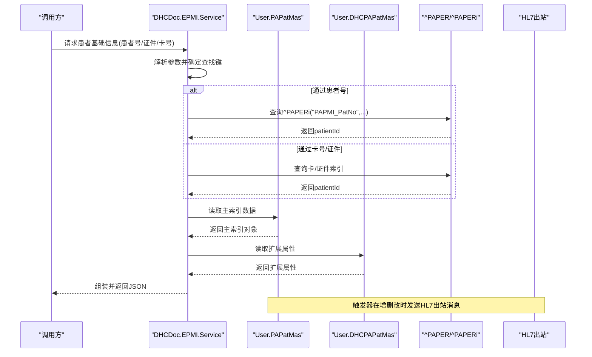
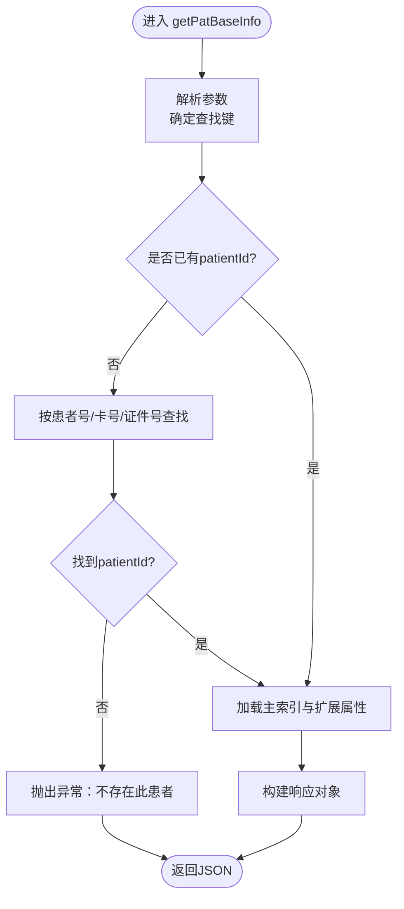
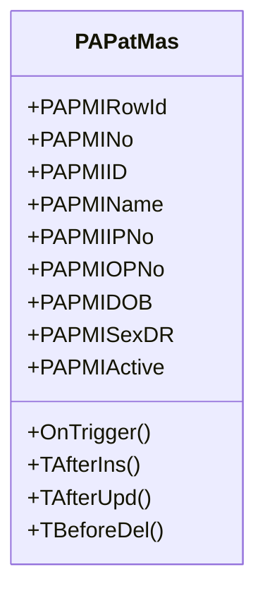
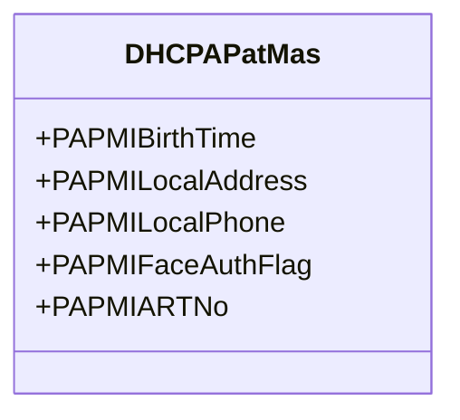
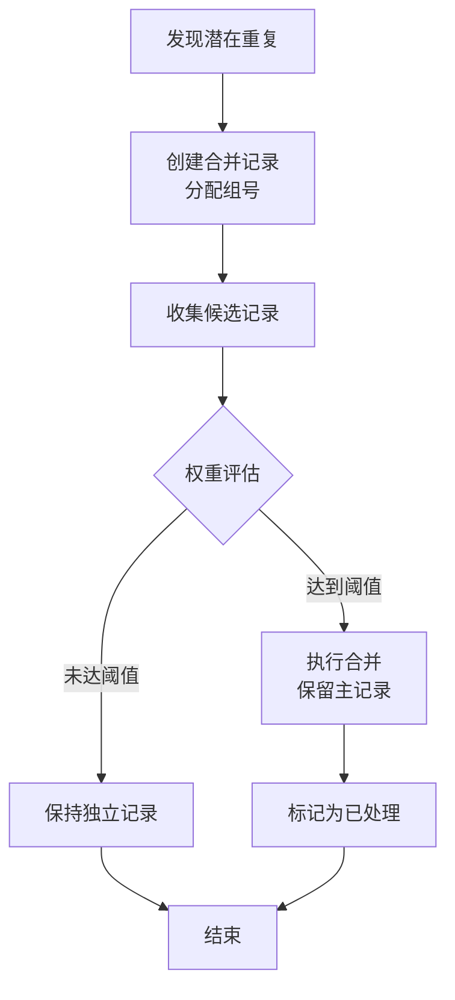
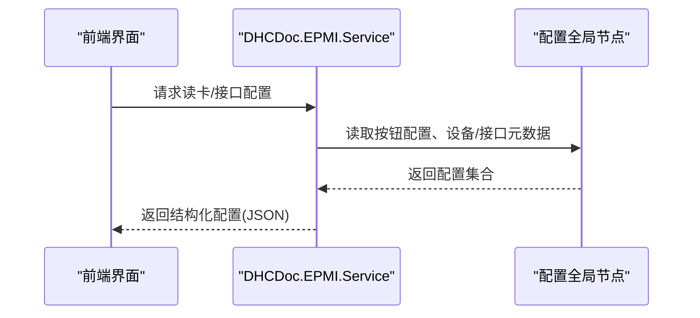
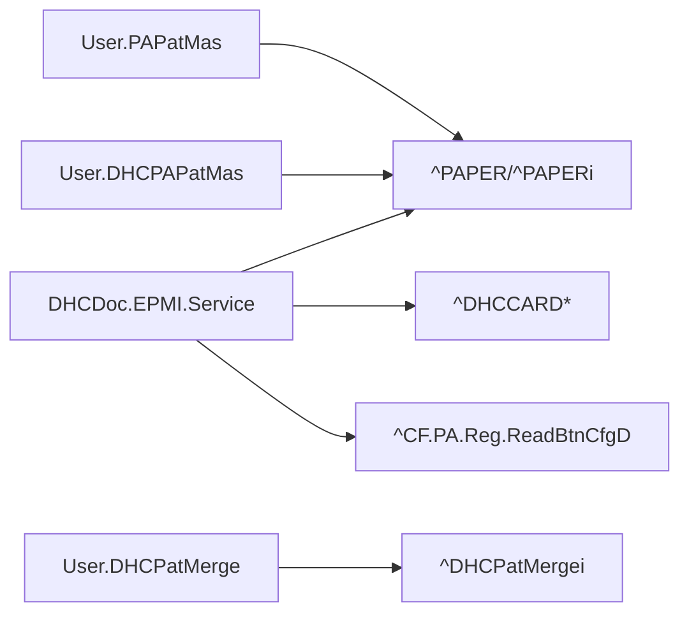
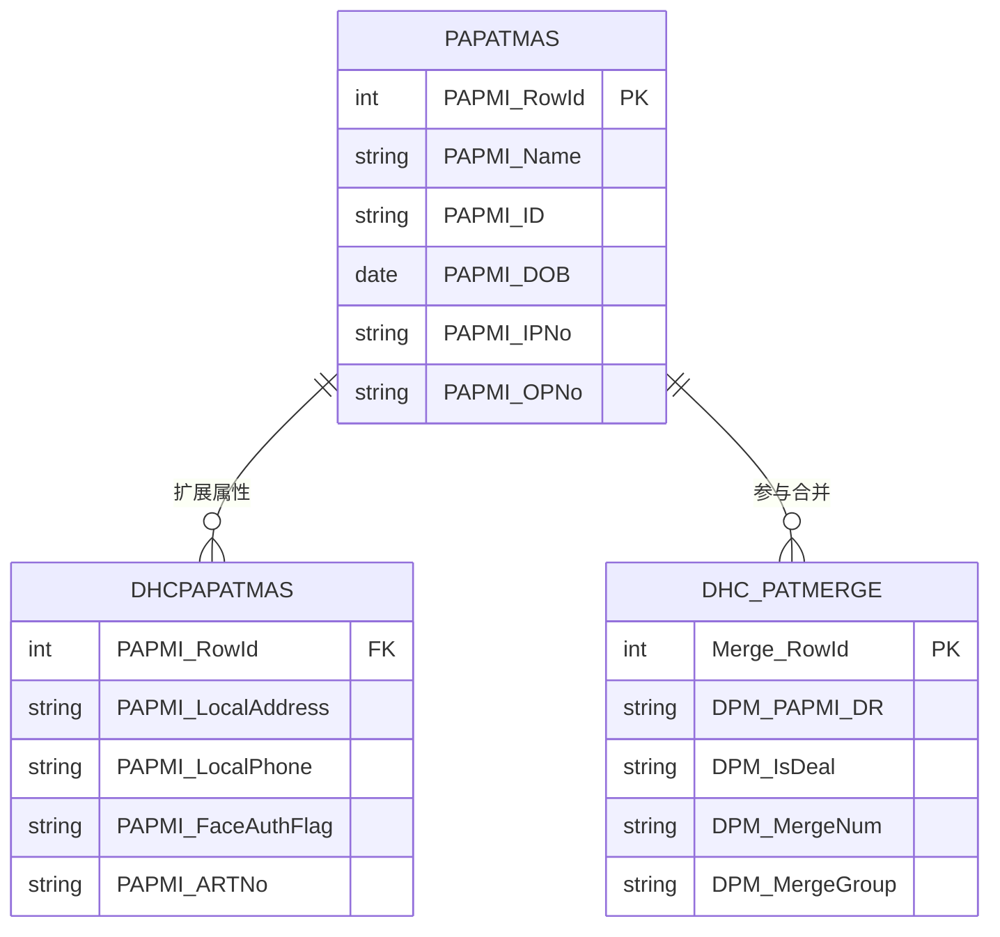

# 患者主索引模块架构

<cite>
**本文引用的文件**
- [Service.cls](file://src/backend/epmi-mc/DHCDoc/EPMI/Service.cls)
- [PAPatMas.cls](file://src/backend/epmi-mc/User/PAPatMas.cls)
- [DHCPAPatMas.cls](file://src/backend/epmi-mc/User/DHCPAPatMas.cls)
- [DHCPatMerge.cls](file://src/backend/epmi-mc/User/DHCPatMerge.cls)
</cite>

## 目录
1. [简介](#简介)
2. [项目结构](#项目结构)
3. [核心组件](#核心组件)
4. [架构总览](#架构总览)
5. [详细组件分析](#详细组件分析)
6. [依赖关系分析](#依赖关系分析)
7. [性能考虑](#性能考虑)
8. [故障排查指南](#故障排查指南)
9. [结论](#结论)
10. [附录](#附录)

## 简介
本文件围绕 epmi-mc 模块的患者主索引（EPMI）能力，系统阐述患者信息管理、主索引维护与数据整合的核心机制。重点覆盖：
- 患者唯一标识生成与查询策略
- 患者记录合并与去重流程
- 主索引与各业务系统的数据同步与一致性保障
- 患者信息变更追踪与历史版本管理
- 配置管理与审计日志
- 数据模型定义与API使用示例

## 项目结构
epmi-mc 模块采用分层组织：
- 服务层：提供对外接口与业务流程编排（如获取患者基本信息、读卡配置等）
- 领域模型：患者主索引实体、扩展属性、合并记录等
- 存储映射：通过持久化类与SQLMap将对象映射到全局节点或数据库表
- 集成点：与卡介质、外部接口、HL7出站消息等交互

图表来源
- [Service.cls:1-368](file://src/backend/epmi-mc/DHCDoc/EPMI/Service.cls#L1-L368)
- [PAPatMas.cls:1-800](file://src/backend/epmi-mc/User/PAPatMas.cls#L1-L800)
- [DHCPAPatMas.cls:1-585](file://src/backend/epmi-mc/User/DHCPAPatMas.cls#L1-L585)
- [DHCPatMerge.cls:1-104](file://src/backend/epmi-mc/User/DHCPatMerge.cls#L1-L104)

章节来源
- [Service.cls:1-368](file://src/backend/epmi-mc/DHCDoc/EPMI/Service.cls#L1-L368)
- [PAPatMas.cls:1-800](file://src/backend/epmi-mc/User/PAPatMas.cls#L1-L800)
- [DHCPAPatMas.cls:1-585](file://src/backend/epmi-mc/User/DHCPAPatMas.cls#L1-L585)
- [DHCPatMerge.cls:1-104](file://src/backend/epmi-mc/User/DHCPatMerge.cls#L1-L104)

## 核心组件
- 患者主索引服务（DHCDoc.EPMI.Service）
  - 负责根据多种键（患者号、证件号、卡号+安全码等）解析并返回患者基础信息
  - 提供读卡设备与外部接口的配置查询，支撑前端采集与识别
- 患者主索引实体（User.PAPatMas）
  - 定义患者主索引核心字段（姓名、性别、出生日期、ID、门诊/住院号等）
  - 内置触发器，实现插入/更新/删除时的动作与HL7出站消息发送
- 患者主索引扩展（User.DHCPAPatMas）
  - 承载扩展属性（如本地地址、紧急联系人、密级、人脸认证标志等）
  - 通过SQLMap映射到全局节点，便于高性能读写
- 患者合并记录（User.DHCPatMerge）
  - 记录待合并/已合并的患者主索引条目、组号、权重系数与处理状态
  - 提供按患者ID与合并组的索引，支持批量合并与回溯

章节来源
- [Service.cls:1-368](file://src/backend/epmi-mc/DHCDoc/EPMI/Service.cls#L1-L368)
- [PAPatMas.cls:1-800](file://src/backend/epmi-mc/User/PAPatMas.cls#L1-L800)
- [DHCPAPatMas.cls:1-585](file://src/backend/epmi-mc/User/DHCPAPatMas.cls#L1-L585)
- [DHCPatMerge.cls:1-104](file://src/backend/epmi-mc/User/DHCPatMerge.cls#L1-L104)

## 架构总览
下图展示从调用方到服务层、再到主索引实体与存储的完整链路，以及HL7出站通道。

图表来源
- [Service.cls:1-368](file://src/backend/epmi-mc/DHCDoc/EPMI/Service.cls#L1-L368)
- [PAPatMas.cls:296-332](file://src/backend/epmi-mc/User/PAPatMas.cls#L296-L332)

## 详细组件分析

### 患者基础信息查询流程（getPatBaseInfo）
- 输入：包含患者号、卡号、证件类型、安全码等参数的动态对象
- 处理：
  - 优先通过patientId直接定位；否则按患者号、卡号+安全码、证件号等多路查找
  - 从全局节点读取姓名、性别、年龄、手机号、医保卡号等
  - 若未传入卡信息，则自动补充默认卡
- 输出：患者基础信息的JSON对象

图表来源
- [Service.cls:5-33](file://src/backend/epmi-mc/DHCDoc/EPMI/Service.cls#L5-L33)
- [Service.cls:35-105](file://src/backend/epmi-mc/DHCDoc/EPMI/Service.cls#L35-L105)

章节来源
- [Service.cls:5-105](file://src/backend/epmi-mc/DHCDoc/EPMI/Service.cls#L5-L105)

### 患者主索引实体（User.PAPatMas）
- 职责：定义患者主索引核心字段、计算字段与关系
- 关键特性：
  - 主键与索引：RowIDBasedIDKeyIndex 作为主键；DOB/DOB2 等索引用于快速检索
  - 触发器：插入/更新/删除前后触发统一动作，并发送HL7出站消息，保证跨系统一致性
  - 存储映射：通过SQLMap将字段映射到^PAPER与^PAPERi全局节点，提升访问效率

图表来源
- [PAPatMas.cls:1-150](file://src/backend/epmi-mc/User/PAPatMas.cls#L1-L150)
- [PAPatMas.cls:296-332](file://src/backend/epmi-mc/User/PAPatMas.cls#L296-L332)

章节来源
- [PAPatMas.cls:1-150](file://src/backend/epmi-mc/User/PAPatMas.cls#L1-L150)
- [PAPatMas.cls:296-332](file://src/backend/epmi-mc/User/PAPatMas.cls#L296-L332)

### 患者主索引扩展（User.DHCPAPatMas）
- 职责：承载扩展属性（如本地地址、紧急联系人、密级、人脸认证标志等）
- 存储：通过SQLMap映射到^PAPER全局节点，并提供ARTNo索引以加速查询

图表来源
- [DHCPAPatMas.cls:1-210](file://src/backend/epmi-mc/User/DHCPAPatMas.cls#L1-L210)
- [DHCPAPatMas.cls:562-579](file://src/backend/epmi-mc/User/DHCPAPatMas.cls#L562-L579)

章节来源
- [DHCPAPatMas.cls:1-210](file://src/backend/epmi-mc/User/DHCPAPatMas.cls#L1-L210)
- [DHCPAPatMas.cls:562-579](file://src/backend/epmi-mc/User/DHCPAPatMas.cls#L562-L579)

### 患者合并与去重（User.DHCPatMerge）
- 职责：记录待合并/已合并的主索引条目，支持按组号聚合与权重评估
- 关键设计：
  - 字段：患者ID、处理标志、权重系数、组号
  - 索引：按患者ID与组号的二级索引，便于批量处理与回溯
  - 流程：发现重复候选 -> 入组 -> 评估权重 -> 执行合并 -> 标记处理完成

图表来源
- [DHCPatMerge.cls:1-104](file://src/backend/epmi-mc/User/DHCPatMerge.cls#L1-L104)

章节来源
- [DHCPatMerge.cls:1-104](file://src/backend/epmi-mc/User/DHCPatMerge.cls#L1-L104)

### 读卡与外部接口配置（getCardHardOutData）
- 功能：根据按钮ID、卡类型、链接类型等条件，返回可用的硬件设备与外部接口列表
- 关键点：
  - 支持按医院、语言、有效期过滤
  - 对硬件设备与外部接口分别建模，附带厂商、型号、版本等元信息
  - 可关联支持的卡类型集合，便于前端动态渲染

图表来源
- [Service.cls:174-318](file://src/backend/epmi-mc/DHCDoc/EPMI/Service.cls#L174-L318)

章节来源
- [Service.cls:174-318](file://src/backend/epmi-mc/DHCDoc/EPMI/Service.cls#L174-L318)

## 依赖关系分析
- 服务层依赖：
  - 全局节点：^PAPER、^PAPERi、^DHCCARD*、^CF.PA.Reg.ReadBtnCfgD 等
  - 工具类：加密、字符串处理、数组操作等
- 实体层依赖：
  - 主索引实体与扩展实体共享^PAPER全局节点
  - 合并记录使用^DHCPatMerge及其索引
- 外部集成：
  - HL7出站消息：在患者主索引增删改时触发，确保下游系统同步

图表来源
- [Service.cls:1-368](file://src/backend/epmi-mc/DHCDoc/EPMI/Service.cls#L1-L368)
- [PAPatMas.cls:334-763](file://src/backend/epmi-mc/User/PAPatMas.cls#L334-L763)
- [DHCPAPatMas.cls:210-581](file://src/backend/epmi-mc/User/DHCPAPatMas.cls#L210-L581)
- [DHCPatMerge.cls:16-101](file://src/backend/epmi-mc/User/DHCPatMerge.cls#L16-L101)

章节来源
- [Service.cls:1-368](file://src/backend/epmi-mc/DHCDoc/EPMI/Service.cls#L1-L368)
- [PAPatMas.cls:334-763](file://src/backend/epmi-mc/User/PAPatMas.cls#L334-L763)
- [DHCPAPatMas.cls:210-581](file://src/backend/epmi-mc/User/DHCPAPatMas.cls#L210-L581)
- [DHCPatMerge.cls:16-101](file://src/backend/epmi-mc/User/DHCPatMerge.cls#L16-L101)

## 性能考虑
- 索引优化：
  - 使用^PAPERi建立多键索引（如按患者号、出生日期、ARTNo），降低查询复杂度
  - 合并记录按患者ID与组号建立索引，支持批量扫描
- 存储策略：
  - 全局节点存储减少IO开销，适合高频读场景
  - 合理设置ExtentSize与StreamLocation，避免碎片化
- 并发与事务：
  - 触发器内操作需轻量，避免长事务阻塞
  - 合并流程建议分批处理，结合权重阈值控制

[本节为通用性能指导，不直接分析具体文件]

## 故障排查指南
- 常见问题：
  - 找不到患者：检查参数是否正确（患者号/卡号/证件号），确认索引是否存在
  - 读卡配置为空：核对按钮配置、医院权限、有效期与语言设置
  - HL7未发出：检查触发器是否生效、出站通道是否正常
- 定位方法：
  - 查看全局节点内容（^PAPER、^PAPERi、^DHCCARD*）
  - 检查触发器逻辑与HL7出站队列
  - 使用调试日志记录关键变量与返回值

章节来源
- [PAPatMas.cls:296-332](file://src/backend/epmi-mc/User/PAPatMas.cls#L296-L332)
- [Service.cls:174-318](file://src/backend/epmi-mc/DHCDoc/EPMI/Service.cls#L174-L318)

## 结论
epmi-mc 模块通过清晰的分层设计与高效的全局节点存储，实现了患者主索引的集中化管理。服务层提供灵活的查询与配置能力，实体层通过触发器与HL7出站保障跨系统一致性，合并记录支持去重与治理。整体架构兼顾性能与可维护性，适用于多业务系统集成的患者主索引场景。

[本节为总结性内容，不直接分析具体文件]

## 附录

### 数据模型定义（实体关系图）

图表来源
- [PAPatMas.cls:1-150](file://src/backend/epmi-mc/User/PAPatMas.cls#L1-L150)
- [DHCPAPatMas.cls:1-210](file://src/backend/epmi-mc/User/DHCPAPatMas.cls#L1-L210)
- [DHCPatMerge.cls:1-104](file://src/backend/epmi-mc/User/DHCPatMerge.cls#L1-L104)

### API使用示例（路径引用）
- 获取患者基础信息
  - 方法：DHCDoc.EPMI.Service.getPatBaseInfo
  - 参考路径：[Service.cls:5-33](file://src/backend/epmi-mc/DHCDoc/EPMI/Service.cls#L5-L33)
- 根据卡号获取患者ID
  - 方法：DHCDoc.EPMI.Service.getPatIdByCard
  - 参考路径：[Service.cls:59-87](file://src/backend/epmi-mc/DHCDoc/EPMI/Service.cls#L59-L87)
- 根据证件号获取患者ID
  - 方法：DHCDoc.EPMI.Service.getPatIdByCredNo
  - 参考路径：[Service.cls:89-105](file://src/backend/epmi-mc/DHCDoc/EPMI/Service.cls#L89-L105)
- 获取读卡设备与外部接口配置
  - 方法：DHCDoc.EPMI.Service.getCardHardOutData
  - 参考路径：[Service.cls:174-318](file://src/backend/epmi-mc/DHCDoc/EPMI/Service.cls#L174-L318)

章节来源
- [Service.cls:5-33](file://src/backend/epmi-mc/DHCDoc/EPMI/Service.cls#L5-L33)
- [Service.cls:59-105](file://src/backend/epmi-mc/DHCDoc/EPMI/Service.cls#L59-L105)
- [Service.cls:174-318](file://src/backend/epmi-mc/DHCDoc/EPMI/Service.cls#L174-L318)