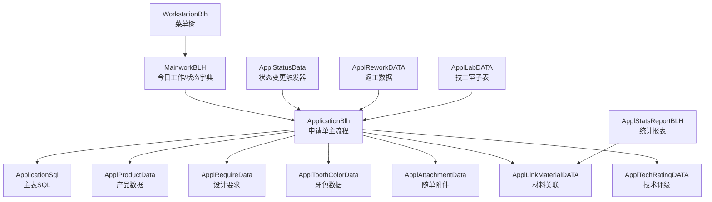
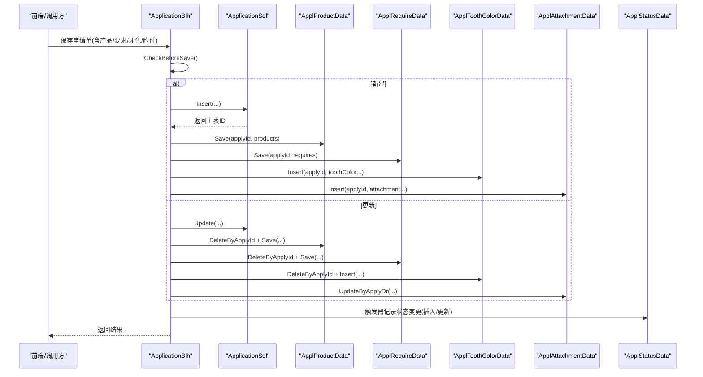
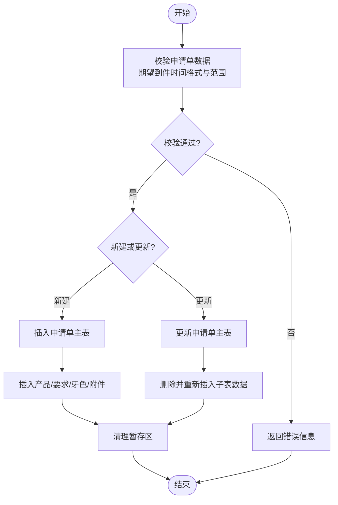
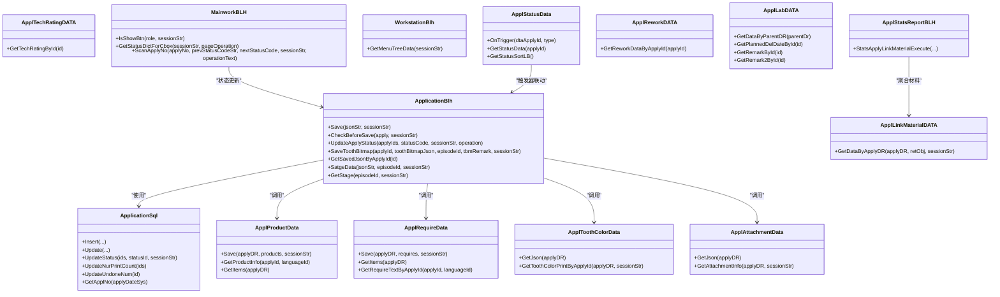

# 牙科系统接口

<cite>
**本文引用的文件**
- [ApplicationBlh.cls](file://src/backend/dental-ws/DHCDoc/Dental/TA/ApplicationBlh.cls)
- [ApplicationSql.cls](file://src/backend/dental-ws/DHCDoc/Dental/TA/ApplicationSql.cls)
- [ApplProductData.cls](file://src/backend/dental-ws/DHCDoc/Dental/TA/ApplProductData.cls)
- [ApplRequireData.cls](file://src/backend/dental-ws/DHCDoc/Dental/TA/ApplRequireData.cls)
- [ApplToothColorData.cls](file://src/backend/dental-ws/DHCDoc/Dental/TA/ApplToothColorData.cls)
- [ApplAttachmentData.cls](file://src/backend/dental-ws/DHCDoc/Dental/TA/ApplAttachmentData.cls)
- [ApplLinkMaterialDATA.cls](file://src/backend/dental-ws/DHCDoc/Dental/TA/ApplLinkMaterialDATA.cls)
- [ApplTechRatingDATA.cls](file://src/backend/dental-ws/DHCDoc/Dental/TA/ApplTechRatingDATA.cls)
- [MainworkBLH.cls](file://src/backend/dental-ws/DHCDoc/Dental/TA/MainworkBLH.cls)
- [WorkstationBlh.cls](file://src/backend/dental-ws/DHCDoc/Dental/TA/WorkstationBlh.cls)
- [ApplStatusData.cls](file://src/backend/dental-ws/DHCDoc/Dental/TA/ApplStatusData.cls)
- [ApplReworkDATA.cls](file://src/backend/dental-ws/DHCDoc/Dental/TA/ApplReworkDATA.cls)
- [ApplLabDATA.cls](file://src/backend/dental-ws/DHCDoc/Dental/TA/ApplLabDATA.cls)
- [ApplStatsReportBLH.cls](file://src/backend/dental-ws/DHCDoc/Dental/TA/ApplStatsReportBLH.cls)
</cite>

## 目录
1. [简介](#简介)
2. [项目结构](#项目结构)
3. [核心组件](#核心组件)
4. [架构总览](#架构总览)
5. [详细组件分析](#详细组件分析)
6. [依赖关系分析](#依赖关系分析)
7. [性能考虑](#性能考虑)
8. [故障排查指南](#故障排查指南)
9. [结论](#结论)
10. [附录](#附录)

## 简介
本文件面向牙科系统Web服务接口的技术文档，聚焦技工申请单、牙齿定位图、材料管理、技术评级等核心能力。内容覆盖：
- 技工申请单的创建、更新、状态流转与暂存/恢复
- 牙齿位点编码与牙色、随单附件的关联方式
- 产品与设计要求的多条目保存与查询
- 材料与技工单的关联及统计汇总
- 返工记录、技工室子表数据、工作菜单与今日工作
- 与设备系统的集成思路与数据同步机制（基于现有触发器与SQL写入）

## 项目结构
后端采用按业务域划分的类组织方式，核心位于 dental-ws 下的 DHCDoc.Dental.TA 包：
- ApplicationBlh：申请单主流程（保存、校验、状态更新、牙位图、暂存）
- SQL层：ApplicationSql 负责主表增删改查与编号生成
- 子领域数据：产品、设计要求、牙色、随单附件、材料关联、技术评级、返工、技工室子表
- 工作台与工作流：MainworkBLH、WorkstationBlh、ApplStatusData
- 报表与统计：ApplStatsReportBLH

图表来源
- [ApplicationBlh.cls:1-302](file://src/backend/dental-ws/DHCDoc/Dental/TA/ApplicationBlh.cls#L1-L302)
- [ApplicationSql.cls:1-148](file://src/backend/dental-ws/DHCDoc/Dental/TA/ApplicationSql.cls#L1-L148)
- [ApplProductData.cls:1-97](file://src/backend/dental-ws/DHCDoc/Dental/TA/ApplProductData.cls#L1-L97)
- [ApplRequireData.cls:1-114](file://src/backend/dental-ws/DHCDoc/Dental/TA/ApplRequireData.cls#L1-L114)
- [ApplToothColorData.cls:1-79](file://src/backend/dental-ws/DHCDoc/Dental/TA/ApplToothColorData.cls#L1-L79)
- [ApplAttachmentData.cls:1-56](file://src/backend/dental-ws/DHCDoc/Dental/TA/ApplAttachmentData.cls#L1-L56)
- [ApplLinkMaterialDATA.cls:1-54](file://src/backend/dental-ws/DHCDoc/Dental/TA/ApplLinkMaterialDATA.cls#L1-L54)
- [ApplTechRatingDATA.cls:1-12](file://src/backend/dental-ws/DHCDoc/Dental/TA/ApplTechRatingDATA.cls#L1-L12)
- [MainworkBLH.cls:1-102](file://src/backend/dental-ws/DHCDoc/Dental/TA/MainworkBLH.cls#L1-L102)
- [WorkstationBlh.cls:1-76](file://src/backend/dental-ws/DHCDoc/Dental/TA/WorkstationBlh.cls#L1-L76)
- [ApplStatusData.cls:1-157](file://src/backend/dental-ws/DHCDoc/Dental/TA/ApplStatusData.cls#L1-L157)
- [ApplReworkDATA.cls:1-22](file://src/backend/dental-ws/DHCDoc/Dental/TA/ApplReworkDATA.cls#L1-L22)
- [ApplLabDATA.cls:1-66](file://src/backend/dental-ws/DHCDoc/Dental/TA/ApplLabDATA.cls#L1-L66)
- [ApplStatsReportBLH.cls:1-243](file://src/backend/dental-ws/DHCDoc/Dental/TA/ApplStatsReportBLH.cls#L1-L243)

章节来源
- [ApplicationBlh.cls:1-302](file://src/backend/dental-ws/DHCDoc/Dental/TA/ApplicationBlh.cls#L1-L302)
- [ApplicationSql.cls:1-148](file://src/backend/dental-ws/DHCDoc/Dental/TA/ApplicationSql.cls#L1-L148)

## 核心组件
- 申请单主流程（ApplicationBlh）
  - 保存申请单：支持新建与更新；批量插入产品、设计要求、牙色、随单附件；事务控制
  - 保存前校验：期望到件时间格式与合法性校验
  - 牙位图：保存与获取
  - 状态更新：通过字典码映射并批量更新
  - 暂存/恢复：按就诊ID+用户维度存储JSON快照
- 主表SQL（ApplicationSql）
  - 新增/更新申请单、批量状态更新、打印次数与返工计数、申请单号生成
- 产品数据（ApplProductData）
  - 批量保存产品项；获取产品信息与层级描述；获取明细列表
- 设计要求（ApplRequireData）
  - 批量保存要求项；获取明细；按类型聚合文本描述
- 牙色数据（ApplToothColorData）
  - 获取JSON；打印视图格式化（含复选框符号与字典名称）
- 随单附件（ApplAttachmentData）
  - 获取JSON；拼接多字段为可读文本
- 材料关联（ApplLinkMaterialDATA）
  - 按申请单查询关联材料，填充字典信息（代码、名称、类别、单位）
- 技术评级（ApplTechRatingDATA）
  - 按申请单ID获取技术评级数据
- 今日工作（MainworkBLH）
  - 按钮显示判断；状态字典查询；扫码式状态切换（ScanApplyNo）
- 工作菜单（WorkstationBlh）
  - 构建“口腔技工申请”菜单树（今日工作、技工申请子节点）
- 状态变更触发器（ApplStatusData）
  - 申请单插入/更新时自动记录状态变更日志，并初始化技工室子表
- 返工数据（ApplReworkDATA）
  - 按申请单ID获取返工记录
- 技工室子表（ApplLabDATA）
  - 根据父单ID获取技工室数据、计划交货日期、备注等
- 统计报表（ApplStatsReportBLH）
  - 统计申请单与关联材料，支持按患者、日期、状态、科室、医生等多条件过滤

章节来源
- [ApplicationBlh.cls:1-302](file://src/backend/dental-ws/DHCDoc/Dental/TA/ApplicationBlh.cls#L1-L302)
- [ApplicationSql.cls:1-148](file://src/backend/dental-ws/DHCDoc/Dental/TA/ApplicationSql.cls#L1-L148)
- [ApplProductData.cls:1-97](file://src/backend/dental-ws/DHCDoc/Dental/TA/ApplProductData.cls#L1-L97)
- [ApplRequireData.cls:1-114](file://src/backend/dental-ws/DHCDoc/Dental/TA/ApplRequireData.cls#L1-L114)
- [ApplToothColorData.cls:1-79](file://src/backend/dental-ws/DHCDoc/Dental/TA/ApplToothColorData.cls#L1-L79)
- [ApplAttachmentData.cls:1-56](file://src/backend/dental-ws/DHCDoc/Dental/TA/ApplAttachmentData.cls#L1-L56)
- [ApplLinkMaterialDATA.cls:1-54](file://src/backend/dental-ws/DHCDoc/Dental/TA/ApplLinkMaterialDATA.cls#L1-L54)
- [ApplTechRatingDATA.cls:1-12](file://src/backend/dental-ws/DHCDoc/Dental/TA/ApplTechRatingDATA.cls#L1-L12)
- [MainworkBLH.cls:1-102](file://src/backend/dental-ws/DHCDoc/Dental/TA/MainworkBLH.cls#L1-L102)
- [WorkstationBlh.cls:1-76](file://src/backend/dental-ws/DHCDoc/Dental/TA/WorkstationBlh.cls#L1-L76)
- [ApplStatusData.cls:1-157](file://src/backend/dental-ws/DHCDoc/Dental/TA/ApplStatusData.cls#L1-L157)
- [ApplReworkDATA.cls:1-22](file://src/backend/dental-ws/DHCDoc/Dental/TA/ApplReworkDATA.cls#L1-L22)
- [ApplLabDATA.cls:1-66](file://src/backend/dental-ws/DHCDoc/Dental/TA/ApplLabDATA.cls#L1-L66)
- [ApplStatsReportBLH.cls:1-243](file://src/backend/dental-ws/DHCDoc/Dental/TA/ApplStatsReportBLH.cls#L1-L243)

## 架构总览
整体以“申请单”为中心，围绕其扩展产品、设计要求、牙色、附件、材料、技术评级、返工、技工室子表等子实体。状态流转由字典驱动，并通过触发器记录审计日志。统计报表聚合多表数据，支持多维筛选。

图表来源
- [ApplicationBlh.cls:1-302](file://src/backend/dental-ws/DHCDoc/Dental/TA/ApplicationBlh.cls#L1-L302)
- [ApplicationSql.cls:1-148](file://src/backend/dental-ws/DHCDoc/Dental/TA/ApplicationSql.cls#L1-L148)
- [ApplProductData.cls:1-97](file://src/backend/dental-ws/DHCDoc/Dental/TA/ApplProductData.cls#L1-L97)
- [ApplRequireData.cls:1-114](file://src/backend/dental-ws/DHCDoc/Dental/TA/ApplRequireData.cls#L1-L114)
- [ApplToothColorData.cls:1-79](file://src/backend/dental-ws/DHCDoc/Dental/TA/ApplToothColorData.cls#L1-L79)
- [ApplAttachmentData.cls:1-56](file://src/backend/dental-ws/DHCDoc/Dental/TA/ApplAttachmentData.cls#L1-L56)
- [ApplStatusData.cls:1-157](file://src/backend/dental-ws/DHCDoc/Dental/TA/ApplStatusData.cls#L1-L157)

## 详细组件分析

### 申请单主流程（ApplicationBlh）
- 保存申请单
  - 输入：JSON包含 apply、product、require、toothColor、attachment
  - 校验：期望到件时间格式与范围
  - 新建：插入主表后，依次插入产品、要求、牙色、附件
  - 更新：先删除再插入子表数据，保证一致性
  - 事务：失败回滚，成功清理暂存区
- 牙位图
  - 保存：委托 web.DHCDocToothBitMap.Save
  - 获取：委托 web.DHCDocToothBitMap.GetTBMJsonData
- 状态更新
  - 将状态码转换为内部DR，批量更新申请单状态
- 暂存/恢复
  - 按 episodeId + userId 维度存储JSON快照，支持恢复

图表来源
- [ApplicationBlh.cls:1-302](file://src/backend/dental-ws/DHCDoc/Dental/TA/ApplicationBlh.cls#L1-L302)
- [ApplicationSql.cls:1-148](file://src/backend/dental-ws/DHCDoc/Dental/TA/ApplicationSql.cls#L1-L148)

章节来源
- [ApplicationBlh.cls:1-302](file://src/backend/dental-ws/DHCDoc/Dental/TA/ApplicationBlh.cls#L1-L302)

### 主表SQL（ApplicationSql）
- 新增申请单：生成申请单号、默认状态、预期技工、创建人/地点、时间戳
- 更新申请单：更新期望时间、内容、紧急标志、处理单元、备注、效果值等
- 批量状态更新：支持INLIST批量修改状态
- 打印次数与返工计数：原子自增
- 申请单号生成：按日期索引递增

章节来源
- [ApplicationSql.cls:1-148](file://src/backend/dental-ws/DHCDoc/Dental/TA/ApplicationSql.cls#L1-L148)

### 产品数据（ApplProductData）
- 批量保存：遍历产品数组，解析层级字典，插入产品表
- 获取产品信息：组合二级/四级分类名称形成展示字符串
- 获取明细：返回每个产品的层级、位点、隔膜类型/厚度、分类、备注等

章节来源
- [ApplProductData.cls:1-97](file://src/backend/dental-ws/DHCDoc/Dental/TA/ApplProductData.cls#L1-L97)

### 设计要求（ApplRequireData）
- 批量保存：解析层级字典，插入要求表
- 获取明细：返回要求项及其描述
- 文本聚合：按类型聚合多级字典名称，用分隔符连接

章节来源
- [ApplRequireData.cls:1-114](file://src/backend/dental-ws/DHCDoc/Dental/TA/ApplRequireData.cls#L1-L114)

### 牙色数据（ApplToothColorData）
- JSON获取：读取主键索引，组装牙色相关字段
- 打印视图：将字典DR转为名称，布尔字段转为勾选符号，输出结构化对象

章节来源
- [ApplToothColorData.cls:1-79](file://src/backend/dental-ws/DHCDoc/Dental/TA/ApplToothColorData.cls#L1-L79)

### 随单附件（ApplAttachmentData）
- JSON获取：读取咬合记录、托盘、石膏模、旧牙、其他附件数量
- 文本拼接：将各字段翻译为中文提示并拼接

章节来源
- [ApplAttachmentData.cls:1-56](file://src/backend/dental-ws/DHCDoc/Dental/TA/ApplAttachmentData.cls#L1-L56)

### 材料关联（ApplLinkMaterialDATA）
- 按申请单查询关联材料，填充材料字典信息（代码、名称、类别、单位），便于统计与展示

章节来源
- [ApplLinkMaterialDATA.cls:1-54](file://src/backend/dental-ws/DHCDoc/Dental/TA/ApplLinkMaterialDATA.cls#L1-L54)

### 技术评级（ApplTechRatingDATA）
- 按申请单ID获取技术评级数据，用于质量评估与统计

章节来源
- [ApplTechRatingDATA.cls:1-12](file://src/backend/dental-ws/DHCDoc/Dental/TA/ApplTechRatingDATA.cls#L1-L12)

### 今日工作（MainworkBLH）
- 按钮显示：根据登录组角色判断是否显示特定操作按钮
- 状态字典：按目录加载有效状态，支持页面权限过滤与语言化
- 扫码状态切换：根据当前状态允许切换到下一状态，调用 ApplicationBlh.UpdateApplyStatus

章节来源
- [MainworkBLH.cls:1-102](file://src/backend/dental-ws/DHCDoc/Dental/TA/MainworkBLH.cls#L1-L102)

### 工作菜单（WorkstationBlh）
- 构建菜单树：包含“今日工作”和“技工申请”两个一级节点，“技工申请”下挂载状态字典对应的页面链接

章节来源
- [WorkstationBlh.cls:1-76](file://src/backend/dental-ws/DHCDoc/Dental/TA/WorkstationBlh.cls#L1-L76)

### 状态变更触发器（ApplStatusData）
- 插入后：记录初始状态、操作人、IP、堆栈，并插入技工室子表
- 更新后：若状态变化，记录新状态与操作人
- 状态历史：按申请单ID获取完整状态变更链，补齐未到达的状态序列

章节来源
- [ApplStatusData.cls:1-157](file://src/backend/dental-ws/DHCDoc/Dental/TA/ApplStatusData.cls#L1-L157)

### 返工数据（ApplReworkDATA）
- 按申请单ID获取返工记录，包含创建人姓名等信息

章节来源
- [ApplReworkDATA.cls:1-22](file://src/backend/dental-ws/DHCDoc/Dental/TA/ApplReworkDATA.cls#L1-L22)

### 技工室子表（ApplLabDATA）
- 根据父单ID获取技工室数据、计划交货日期、备注、备注2

章节来源
- [ApplLabDATA.cls:1-66](file://src/backend/dental-ws/DHCDoc/Dental/TA/ApplLabDATA.cls#L1-L66)

### 统计报表（ApplStatsReportBLH）
- 统计申请单与关联材料，支持按患者、日期、状态、科室、医生、姓名等条件过滤
- 计算总金额、总数量、申请单数，并输出每行材料明细

章节来源
- [ApplStatsReportBLH.cls:1-243](file://src/backend/dental-ws/DHCDoc/Dental/TA/ApplStatsReportBLH.cls#L1-L243)

## 依赖关系分析
- ApplicationBlh 依赖 ApplicationSql 进行主表持久化，并协调多个子领域数据类完成复合写入
- MainworkBLH 依赖字典服务与 ApplicationBlh 实现状态流转
- ApplStatusData 作为触发器，依赖字典与用户服务，确保审计与子表初始化
- ApplStatsReportBLH 聚合 Application、ApplLab、ApplLinkMaterial 等数据源，提供跨表统计

图表来源
- [ApplicationBlh.cls:1-302](file://src/backend/dental-ws/DHCDoc/Dental/TA/ApplicationBlh.cls#L1-L302)
- [ApplicationSql.cls:1-148](file://src/backend/dental-ws/DHCDoc/Dental/TA/ApplicationSql.cls#L1-L148)
- [ApplProductData.cls:1-97](file://src/backend/dental-ws/DHCDoc/Dental/TA/ApplProductData.cls#L1-L97)
- [ApplRequireData.cls:1-114](file://src/backend/dental-ws/DHCDoc/Dental/TA/ApplRequireData.cls#L1-L114)
- [ApplToothColorData.cls:1-79](file://src/backend/dental-ws/DHCDoc/Dental/TA/ApplToothColorData.cls#L1-L79)
- [ApplAttachmentData.cls:1-56](file://src/backend/dental-ws/DHCDoc/Dental/TA/ApplAttachmentData.cls#L1-L56)
- [ApplLinkMaterialDATA.cls:1-54](file://src/backend/dental-ws/DHCDoc/Dental/TA/ApplLinkMaterialDATA.cls#L1-L54)
- [ApplTechRatingDATA.cls:1-12](file://src/backend/dental-ws/DHCDoc/Dental/TA/ApplTechRatingDATA.cls#L1-L12)
- [MainworkBLH.cls:1-102](file://src/backend/dental-ws/DHCDoc/Dental/TA/MainworkBLH.cls#L1-L102)
- [WorkstationBlh.cls:1-76](file://src/backend/dental-ws/DHCDoc/Dental/TA/WorkstationBlh.cls#L1-L76)
- [ApplStatusData.cls:1-157](file://src/backend/dental-ws/DHCDoc/Dental/TA/ApplStatusData.cls#L1-L157)
- [ApplReworkDATA.cls:1-22](file://src/backend/dental-ws/DHCDoc/Dental/TA/ApplReworkDATA.cls#L1-L22)
- [ApplLabDATA.cls:1-66](file://src/backend/dental-ws/DHCDoc/Dental/TA/ApplLabDATA.cls#L1-L66)
- [ApplStatsReportBLH.cls:1-243](file://src/backend/dental-ws/DHCDoc/Dental/TA/ApplStatsReportBLH.cls#L1-L243)

## 性能考虑
- 批量写入：产品与设计要求采用循环批量插入，注意事务边界与错误回滚
- 索引利用：多处使用索引查找（如 idxApplyDR、idxApplyNo、idxPatient、idxPDDPar），提升查询效率
- 状态历史：触发器记录状态变更，避免重复写入；排序列表预计算减少运行时开销
- 统计报表：按日期区间与索引扫描，结合内存数组聚合，减少多次数据库往返

[本节为通用性能建议，不直接分析具体文件]

## 故障排查指南
- 保存失败
  - 检查期望到件时间格式与范围（YYYY-MM-DD HH:mm，且不小于当天）
  - 查看子表插入返回值，定位具体失败环节（产品/要求/牙色/附件）
- 状态更新失败
  - 确认状态码是否存在于字典；检查当前状态是否允许切换到目标状态
- 材料统计为空
  - 确认申请单是否存在关联材料；检查过滤条件（日期、状态、科室、医生、姓名）
- 牙位图异常
  - 确认委托方法参数正确；检查就诊ID与申请单ID对应关系

章节来源
- [ApplicationBlh.cls:148-186](file://src/backend/dental-ws/DHCDoc/Dental/TA/ApplicationBlh.cls#L148-L186)
- [MainworkBLH.cls:69-99](file://src/backend/dental-ws/DHCDoc/Dental/TA/MainworkBLH.cls#L69-L99)
- [ApplStatsReportBLH.cls:130-174](file://src/backend/dental-ws/DHCDoc/Dental/TA/ApplStatsReportBLH.cls#L130-L174)

## 结论
该牙科系统以申请单为核心，围绕产品、设计要求、牙色、附件、材料、技术评级、返工、技工室子表等子实体，构建了完整的技工业务流程。通过字典驱动的状态管理与触发器审计，保证了流程的可追溯性与一致性。统计报表提供了多维度的数据分析能力，支持运营与质量管理。

[本节为总结性内容，不直接分析具体文件]

## 附录

### API定义与调用示例（基于类方法）
- 保存申请单
  - 入口：ApplicationBlh.Save
  - 输入：JSON包含 apply、product.items、require.items、toothColor、attachment
  - 输出：状态码与消息
  - 参考路径：[ApplicationBlh.cls:6-146](file://src/backend/dental-ws/DHCDoc/Dental/TA/ApplicationBlh.cls#L6-L146)
- 获取已保存申请单JSON
  - 入口：ApplicationBlh.GetSavedJsonByApplyId
  - 输入：applyId
  - 输出：JSON（apply、product、require、effect、toothColor、attachment、toothBitmap）
  - 参考路径：[ApplicationBlh.cls:219-270](file://src/backend/dental-ws/DHCDoc/Dental/TA/ApplicationBlh.cls#L219-L270)
- 保存牙位图
  - 入口：ApplicationBlh.SaveToothBitmap
  - 输入：applyId、toothBitmapJson、episodeId、tbmRemark
  - 输出：状态码
  - 参考路径：[ApplicationBlh.cls:188-196](file://src/backend/dental-ws/DHCDoc/Dental/TA/ApplicationBlh.cls#L188-L196)
- 获取牙位图
  - 入口：ApplicationBlh.GetToothBitmap
  - 输入：applyId
  - 输出：JSON
  - 参考路径：[ApplicationBlh.cls:198-203](file://src/backend/dental-ws/DHCDoc/Dental/TA/ApplicationBlh.cls#L198-L203)
- 更新申请单状态
  - 入口：ApplicationBlh.UpdateApplyStatus
  - 输入：applyIds、statusCode、sessionStr、operation
  - 输出：状态码
  - 参考路径：[ApplicationBlh.cls:205-217](file://src/backend/dental-ws/DHCDoc/Dental/TA/ApplicationBlh.cls#L205-L217)
- 暂存数据
  - 入口：ApplicationBlh.SatgeData
  - 输入：jsonStr、episodeId、sessionStr
  - 输出：无
  - 参考路径：[ApplicationBlh.cls:280-286](file://src/backend/dental-ws/DHCDoc/Dental/TA/ApplicationBlh.cls#L280-L286)
- 获取暂存数据
  - 入口：ApplicationBlh.GetStage
  - 输入：episodeId、sessionStr
  - 输出：JSON字符串
  - 参考路径：[ApplicationBlh.cls:288-299](file://src/backend/dental-ws/DHCDoc/Dental/TA/ApplicationBlh.cls#L288-L299)
- 获取状态字典（今日工作）
  - 入口：MainworkBLH.GetStatusDictForCbox
  - 输入：sessionStr、pageOperation
  - 输出：状态列表（含名称、显示名、页面链接）
  - 参考路径：[MainworkBLH.cls:23-67](file://src/backend/dental-ws/DHCDoc/Dental/TA/MainworkBLH.cls#L23-L67)
- 扫码状态切换
  - 入口：MainworkBLH.ScanApplyNo
  - 输入：applyNo、prevStatusCodeStr、nextStatusCode、sessionStr、operationText
  - 输出：成功/失败消息
  - 参考路径：[MainworkBLH.cls:69-99](file://src/backend/dental-ws/DHCDoc/Dental/TA/MainworkBLH.cls#L69-L99)
- 获取菜单树
  - 入口：WorkstationBlh.GetMenuTreeData
  - 输入：sessionStr
  - 输出：菜单JSON
  - 参考路径：[WorkstationBlh.cls:6-73](file://src/backend/dental-ws/DHCDoc/Dental/TA/WorkstationBlh.cls#L6-L73)
- 获取材料关联
  - 入口：ApplLinkMaterialDATA.GetDataByApplyDR
  - 输入：applyDR、retObj、sessionStr
  - 输出：材料列表（含代码、名称、类别、单位）
  - 参考路径：[ApplLinkMaterialDATA.cls:6-51](file://src/backend/dental-ws/DHCDoc/Dental/TA/ApplLinkMaterialDATA.cls#L6-L51)
- 获取技术评级
  - 入口：ApplTechRatingDATA.GetTechRatingById
  - 输入：id
  - 输出：技术评级数据
  - 参考路径：[ApplTechRatingDATA.cls:4-9](file://src/backend/dental-ws/DHCDoc/Dental/TA/ApplTechRatingDATA.cls#L4-L9)
- 获取返工数据
  - 入口：ApplReworkDATA.GetReworkDataByApplyId
  - 输入：applyId
  - 输出：返工记录
  - 参考路径：[ApplReworkDATA.cls:5-19](file://src/backend/dental-ws/DHCDoc/Dental/TA/ApplReworkDATA.cls#L5-L19)
- 获取技工室数据
  - 入口：ApplLabDATA.GetDataByParentDR
  - 输入：parentDr
  - 输出：技工室子表数据
  - 参考路径：[ApplLabDATA.cls:17-30](file://src/backend/dental-ws/DHCDoc/Dental/TA/ApplLabDATA.cls#L17-L30)
- 统计申请单与材料
  - 入口：ApplStatsReportBLH.StatsApplyLinkMaterialExecute
  - 输入：patientNo、sttDate、endDate、statusDrStr、qApplyLocDR、qApplyNo、qProcessUnitDR、expStr、qApplyDocDR、sessionStr
  - 输出：统计行（含金额、数量、材料明细）
  - 参考路径：[ApplStatsReportBLH.cls:11-128](file://src/backend/dental-ws/DHCDoc/Dental/TA/ApplStatsReportBLH.cls#L11-L128)

### 牙科特有数据处理说明
- 牙齿位点编码
  - 产品项中包含 toothPositionDR，表示牙齿位点；在统计与展示中可结合字典进行名称转换
  - 参考路径：[ApplProductData.cls:60-88](file://src/backend/dental-ws/DHCDoc/Dental/TA/ApplProductData.cls#L60-L88)
- 材料关联
  - 通过 ApplLinkMaterialDATA 获取材料代码、名称、类别、单位，便于成本核算与库存管理
  - 参考路径：[ApplLinkMaterialDATA.cls:6-51](file://src/backend/dental-ws/DHCDoc/Dental/TA/ApplLinkMaterialDATA.cls#L6-L51)
- 技术评级
  - 通过 ApplTechRatingDATA 获取技术评级ID，用于质量评估与统计
  - 参考路径：[ApplTechRatingDATA.cls:4-9](file://src/backend/dental-ws/DHCDoc/Dental/TA/ApplTechRatingDATA.cls#L4-L9)

### 与设备系统集成与数据同步
- 数据写入点
  - 申请单主表与子表通过 ApplicationSql 直接写入，确保数据一致性
  - 状态变更通过触发器记录审计日志，并初始化技工室子表
- 同步机制
  - 触发器 OnAfterIns/OnAfterUpd 自动记录状态变更，保证审计与下游系统可追踪
  - 统计报表通过索引与聚合逻辑，实时反映最新数据
- 扩展建议
  - 可在触发器或业务层增加对外事件发布，供设备系统订阅
  - 对关键数据（如材料用量、计划交货日期）增加版本化与变更通知

章节来源
- [ApplStatusData.cls:5-54](file://src/backend/dental-ws/DHCDoc/Dental/TA/ApplStatusData.cls#L5-L54)
- [ApplStatsReportBLH.cls:11-128](file://src/backend/dental-ws/DHCDoc/Dental/TA/ApplStatsReportBLH.cls#L11-L128)
- [ApplicationSql.cls:1-148](file://src/backend/dental-ws/DHCDoc/Dental/TA/ApplicationSql.cls#L1-L148)