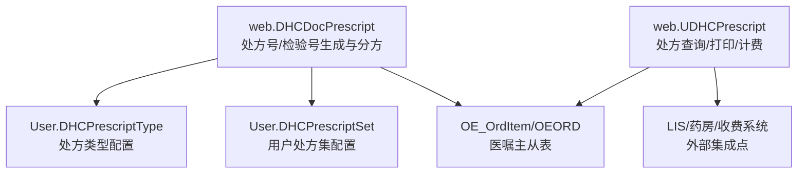
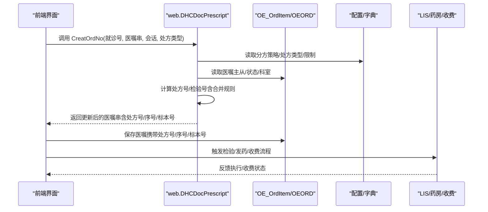
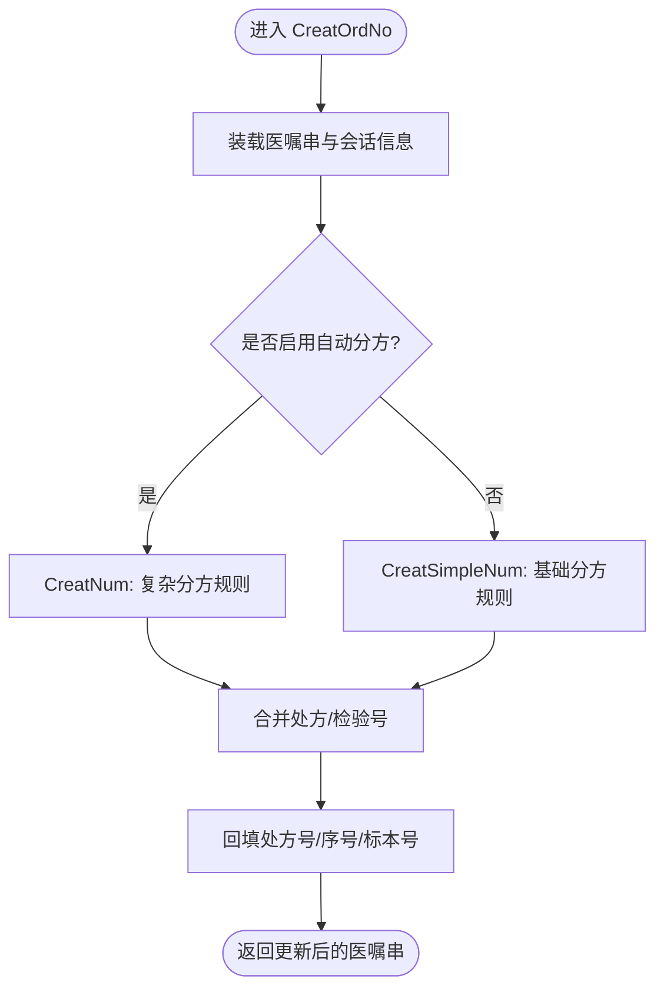
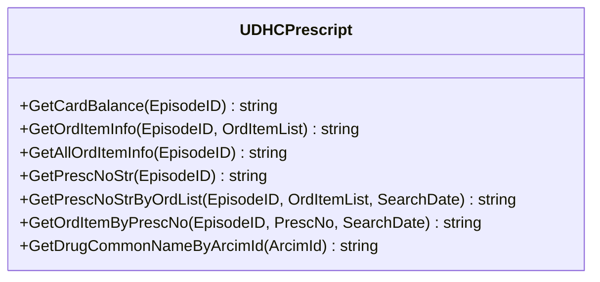
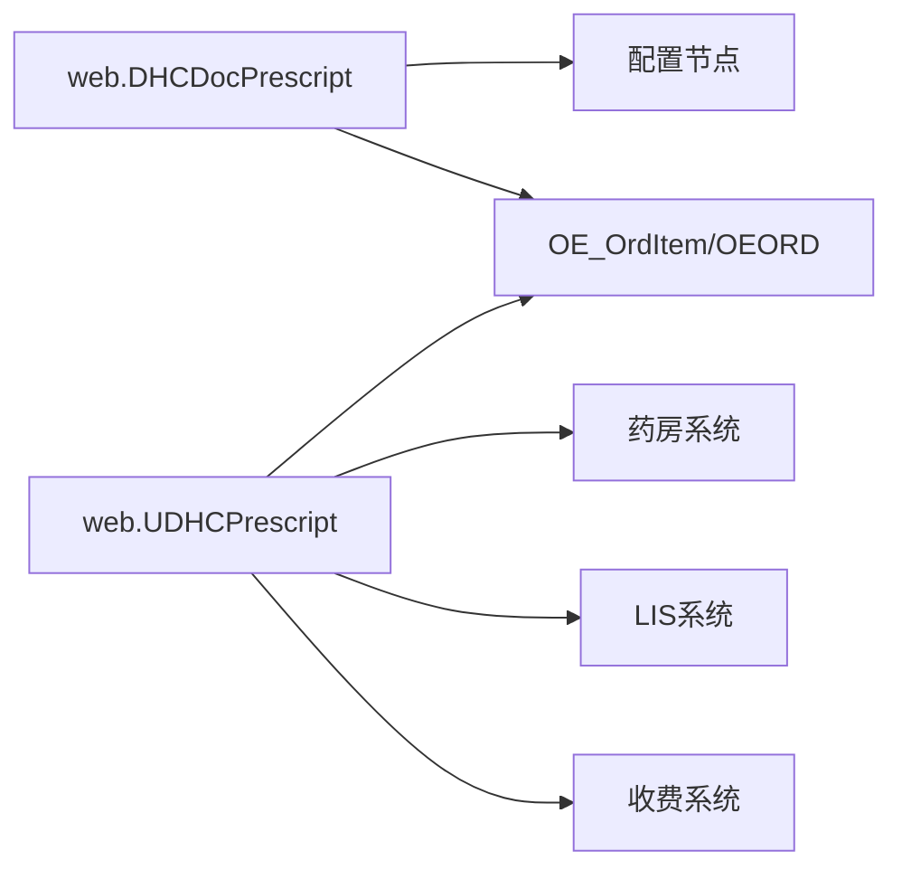

# 处方管理

<cite>
**本文引用的文件**
- [DHCDocPrescript.cls](file://src/backend/doc-ws/web/DHCDocPrescript.cls)
- [UDHCPrescript.cls](file://src/backend/doc-ws/web/UDHCPrescript.cls)
- [DHCPrescriptType.cls](file://src/backend/doc-ws/User/DHCPrescriptType.cls)
- [DHCPrescriptSet.cls](file://src/backend/doc-ws/User/DHCPrescriptSet.cls)
</cite>

## 目录
1. [简介](#简介)
2. [项目结构](#项目结构)
3. [核心组件](#核心组件)
4. [架构总览](#架构总览)
5. [详细组件分析](#详细组件分析)
6. [依赖关系分析](#依赖关系分析)
7. [性能考虑](#性能考虑)
8. [故障排查指南](#故障排查指南)
9. [结论](#结论)
10. [附录](#附录)

## 简介
本模块围绕处方的创建、审核、打印与跟踪展开，覆盖处方类型、药品管理、剂量计算、配伍禁忌检查以及与药房、收费系统的集成。文档面向不同技术背景的读者，提供从高层架构到代码级流程的完整说明，并给出配置项与报表能力的使用指引。

## 项目结构
处方管理相关后端逻辑主要位于 doc-ws 域：
- web.DHCDocPrescript：处方号/检验号生成、分方合并、医嘱串处理的核心入口
- web.UDHCPrescript：处方查询、打印信息组装、费用与余额校验等辅助能力
- User.DHCPrescriptType / User.DHCPrescriptSet：处方类型与用户级处方集配置

图表来源
- [DHCDocPrescript.cls:22-80](file://src/backend/doc-ws/web/DHCDocPrescript.cls#L22-L80)
- [UDHCPrescript.cls:121-284](file://src/backend/doc-ws/web/UDHCPrescript.cls#L121-L284)
- [DHCPrescriptType.cls:1-105](file://src/backend/doc-ws/User/DHCPrescriptType.cls#L1-L105)
- [DHCPrescriptSet.cls:1-73](file://src/backend/doc-ws/User/DHCPrescriptSet.cls#L1-L73)

章节来源
- [DHCDocPrescript.cls:22-80](file://src/backend/doc-ws/web/DHCDocPrescript.cls#L22-L80)
- [UDHCPrescript.cls:121-284](file://src/backend/doc-ws/web/UDHCPrescript.cls#L121-L284)
- [DHCPrescriptType.cls:1-105](file://src/backend/doc-ws/User/DHCPrescriptType.cls#L1-L105)
- [DHCPrescriptSet.cls:1-73](file://src/backend/doc-ws/User/DHCPrescriptSet.cls#L1-L73)

## 核心组件
- 处方号/检验号生成与分方（web.DHCDocPrescript）
  - 入口方法负责装载待保存医嘱串、计算处方号/检验号、回写结果并返回更新后的医嘱串
  - 支持西药分方与草药分方两条路径；支持自动分方与简单分方两种策略
  - 关键数据：OEORI_PrescNo、OEORI_PrescSeqNo、OEORI_LabEpisodeNo、OEORI_RecDep_DR、OEORI_OrdDept_DR
- 处方查询与打印（web.UDHCPrescript）
  - 提供按处方号获取明细、汇总金额、收费状态、患者余额提示等
  - 支持将处方内容组织为打印文本，区分药品、检验、检查与其他项目
- 处方类型与用户处方集（User.*）
  - 处方类型定义允许标志、警告标志、数量/金额限制、计费类别等
  - 用户处方集用于限定可开立的医嘱分类集合

章节来源
- [DHCDocPrescript.cls:22-80](file://src/backend/doc-ws/web/DHCDocPrescript.cls#L22-L80)
- [UDHCPrescript.cls:121-284](file://src/backend/doc-ws/web/UDHCPrescript.cls#L121-L284)
- [DHCPrescriptType.cls:1-105](file://src/backend/doc-ws/User/DHCPrescriptType.cls#L1-L105)
- [DHCPrescriptSet.cls:1-73](file://src/backend/doc-ws/User/DHCPrescriptSet.cls#L1-L73)

## 架构总览
处方管理的核心流程包括：
- 创建：医生录入医嘱后，调用处方号/检验号生成接口，完成分方与编号分配
- 审核：根据医嘱状态与执行/收费状态进行控制，确保合规
- 打印：按处方维度聚合医嘱明细，输出打印文本或驱动打印
- 跟踪：通过处方号关联医嘱子项，追踪执行、发药、收费进度

图表来源
- [DHCDocPrescript.cls:22-80](file://src/backend/doc-ws/web/DHCDocPrescript.cls#L22-L80)
- [UDHCPrescript.cls:443-577](file://src/backend/doc-ws/web/UDHCPrescript.cls#L443-L577)

## 详细组件分析

### 组件A：web.DHCDocPrescript（处方号/检验号生成与分方）
- 职责
  - 接收待保存医嘱串，解析主子关系，计算处方号、处方序号、检验标本号
  - 支持“自动分方”和“简单分方”两种策略
  - 对检验项目进行合管/拆分，避免重复与冲突
  - 将结果回填至医嘱串或数据库记录，并返回给前端
- 关键流程
  - 初始化医嘱数组、加载配置、计算分方键值（科室、日期、处方类型、费别、用法组、皮试标识、PIVA、免费药等）
  - 两次循环：第一次准备合并信息，第二次实际合并并生成编号
  - 重置处方序号，保证同一处方内序号连续
  - 草药分方走独立分支，生成统一处方号并标注序列
- 数据结构与复杂度
  - 使用临时数组与全局缓存维护合并队列与计数，时间复杂度近似 O(N) 遍历医嘱项
  - 空间复杂度受合并队列规模影响，通常与同批次医嘱量线性相关
- 错误处理
  - 并发锁保护插入过程，失败时记录日志并返回空串
  - 针对已收费/已打印/已执行等状态进行跳过或强制不合并
- 优化建议
  - 对高频合并键进行索引化缓存，减少重复计算
  - 对大处方批量处理时分片提交，降低内存峰值

图表来源
- [DHCDocPrescript.cls:22-80](file://src/backend/doc-ws/web/DHCDocPrescript.cls#L22-L80)
- [DHCDocPrescript.cls:206-310](file://src/backend/doc-ws/web/DHCDocPrescript.cls#L206-L310)
- [DHCDocPrescript.cls:311-554](file://src/backend/doc-ws/web/DHCDocPrescript.cls#L311-L554)

章节来源
- [DHCDocPrescript.cls:22-80](file://src/backend/doc-ws/web/DHCDocPrescript.cls#L22-L80)
- [DHCDocPrescript.cls:206-310](file://src/backend/doc-ws/web/DHCDocPrescript.cls#L206-L310)
- [DHCDocPrescript.cls:311-554](file://src/backend/doc-ws/web/DHCDocPrescript.cls#L311-L554)

### 组件B：web.UDHCPrescript（处方查询、打印与计费）
- 职责
  - 按处方号或就诊号查询处方明细，组装打印文本
  - 计算未收费用、患者余额提示，区分药品/检验/检查/其他
  - 获取通用名、规格、频次、疗程、用法用量等信息
- 关键方法
  - GetCardBalance：查询患者卡余额
  - GetOrdItemInfo/GetAllOrdItemInfo：获取医嘱项信息与汇总
  - GetPrescNoStr/GetPrescNoStrByOrdList：按处方号列表生成展示字符串
  - GetOrdItemByPrescNo：按处方号拉取药品类医嘱明细，计算总量与价格
- 打印与计费集成
  - 依据医嘱状态与收费标记，生成“已收费/未收费”提示
  - 结合药房/收费系统状态，提示交方地点与注意事项

图表来源
- [UDHCPrescript.cls:5-18](file://src/backend/doc-ws/web/UDHCPrescript.cls#L5-L18)
- [UDHCPrescript.cls:121-284](file://src/backend/doc-ws/web/UDHCPrescript.cls#L121-L284)
- [UDHCPrescript.cls:443-577](file://src/backend/doc-ws/web/UDHCPrescript.cls#L443-L577)
- [UDHCPrescript.cls:581-765](file://src/backend/doc-ws/web/UDHCPrescript.cls#L581-L765)
- [UDHCPrescript.cls:767-800](file://src/backend/doc-ws/web/UDHCPrescript.cls#L767-L800)

章节来源
- [UDHCPrescript.cls:5-18](file://src/backend/doc-ws/web/UDHCPrescript.cls#L5-L18)
- [UDHCPrescript.cls:121-284](file://src/backend/doc-ws/web/UDHCPrescript.cls#L121-L284)
- [UDHCPrescript.cls:443-577](file://src/backend/doc-ws/web/UDHCPrescript.cls#L443-L577)
- [UDHCPrescript.cls:581-765](file://src/backend/doc-ws/web/UDHCPrescript.cls#L581-L765)
- [UDHCPrescript.cls:767-800](file://src/backend/doc-ws/web/UDHCPrescript.cls#L767-L800)

### 组件C：User.DHCPrescriptType（处方类型配置）
- 字段含义
  - PTCode/PTDescription：处方类型代码与描述
  - PTAllowFlag/PTWarnFlag：是否允许开具、是否警告
  - PTLimitSum/PTLimitCount/PTLimitQty/PTLimitType：金额/次数/数量/类型限制
  - PTBillType：计费类别
  - PTIsSpecDis/PTHospDr：特殊显示与医院/医生维度配置
- 用途
  - 在分方与限额校验中作为规则来源，决定处方拆分与限制策略

章节来源
- [DHCPrescriptType.cls:1-105](file://src/backend/doc-ws/User/DHCPrescriptType.cls#L1-L105)

### 组件D：User.DHCPrescriptSet（用户处方集配置）
- 字段含义
  - PSCode/PSDesc/PSType：处方集代码、描述、类型
  - PSCreatUser/PSActive：创建者与有效性
  - PSItemCatStr：子类定义（医嘱分类集合）
  - PSHospDr：医院维度绑定
- 用途
  - 控制用户在特定场景下可开立的医嘱范围，配合权限与安全策略

章节来源
- [DHCPrescriptSet.cls:1-73](file://src/backend/doc-ws/User/DHCPrescriptSet.cls#L1-L73)

## 依赖关系分析
- 内部依赖
  - DHCDocPrescript 依赖配置节点（如 PrescByAuto、PrescByInstr、SkinTestInstr、PrescByLinkOrder）
  - UDHCPrescript 依赖计费与价格服务、药房与LIS状态查询
  - 两者均依赖 OE_OrdItem/OEORD 主从表结构与状态字典
- 外部集成
  - 药房：发药数量、库存、协议单位换算
  - LIS：检验合管、标本号、报告与注意事项
  - 收费：收费状态、余额、结算中心提示

图表来源
- [DHCDocPrescript.cls:22-80](file://src/backend/doc-ws/web/DHCDocPrescript.cls#L22-L80)
- [UDHCPrescript.cls:121-284](file://src/backend/doc-ws/web/UDHCPrescript.cls#L121-L284)

章节来源
- [DHCDocPrescript.cls:22-80](file://src/backend/doc-ws/web/DHCDocPrescript.cls#L22-L80)
- [UDHCPrescript.cls:121-284](file://src/backend/doc-ws/web/UDHCPrescript.cls#L121-L284)

## 性能考虑
- 分方合并算法采用两遍扫描与队列缓存，适合大批量医嘱一次性处理
- 对高频合并键（科室+日期+处方类型+费别+用法组等）进行缓存，减少重复计算
- 并发安全通过全局锁保护插入阶段，避免重复编号与数据竞争
- 大处方建议分批提交，降低内存占用与事务时长

[本节为通用性能指导，无需具体文件引用]

## 故障排查指南
- 常见问题
  - 处方号未生成：检查分方策略配置、医嘱状态是否为有效可分方状态
  - 检验号重复或遗漏：核对合管规则（标本类型、容器、通知临床、测试组、血糖分组）
  - 打印信息不完整：确认医嘱状态非执行/未核实，且已正确填充剂量、频次、用法用量
  - 费用提示异常：核查收费状态、患者余额与结算中心要求
- 定位方法
  - 查看日志记录（如并发插入失败日志）
  - 检查临时缓存与合并队列（que1、que2、RepeatOrdList 等）
  - 核对 OE_OrdItem 主从表字段（处方号、序号、标本号、接受/执行科室）

章节来源
- [DHCDocPrescript.cls:22-80](file://src/backend/doc-ws/web/DHCDocPrescript.cls#L22-L80)
- [UDHCPrescript.cls:121-284](file://src/backend/doc-ws/web/UDHCPrescript.cls#L121-L284)

## 结论
本模块以 web.DHCDocPrescript 为核心实现处方的创建与分方，web.UDHCPrescript 提供查询、打印与计费辅助能力，配合 User.* 配置实现灵活的处方类型与权限控制。通过严格的合并规则与状态检查，保障处方数据的准确性与合规性，并与药房、LIS、收费系统形成稳定集成。

[本节为总结性内容，无需具体文件引用]

## 附录

### 处方类型与限制
- 处方类型：普通、麻精一、精二、小儿等，由配置与医嘱属性共同决定
- 限制策略：金额上限、次数上限、数量上限、类型限制，可在类型配置中设置
- 用户处方集：限定可开立的医嘱分类集合，提升安全性与合规性

章节来源
- [DHCPrescriptType.cls:1-105](file://src/backend/doc-ws/User/DHCPrescriptType.cls#L1-L105)
- [DHCPrescriptSet.cls:1-73](file://src/backend/doc-ws/User/DHCPrescriptSet.cls#L1-L73)

### 剂量计算与单位换算
- 剂量计算：基于剂量单位、剂型、频次与疗程自动计算包装数量
- 单位换算：协议单位与计费单位之间的换算因子
- 参考路径：GetOrdPackQtyByDsp、CalDose、UOMFac 等方法

章节来源
- [UDHCPrescript.cls:47-81](file://src/backend/doc-ws/web/UDHCPrescript.cls#L47-L81)
- [UDHCPrescript.cls:789-800](file://src/backend/doc-ws/web/UDHCPrescript.cls#L789-L800)

### 配伍禁忌与安全检查
- 皮试标识：根据配置与医嘱项判断是否需要皮试，并在打印中体现
- 过敏与禁忌：通过通用名与药学项信息辅助识别
- 安全提示：打印文本中包含注意事项与报告信息

章节来源
- [UDHCPrescript.cls:121-284](file://src/backend/doc-ws/web/UDHCPrescript.cls#L121-L284)
- [UDHCPrescript.cls:581-765](file://src/backend/doc-ws/web/UDHCPrescript.cls#L581-L765)

### 与药房、收费系统的集成接口
- 药房：发药数量、库存、协议单位、OTC标识
- LIS：检验合管、标本号、报告、注意事项
- 收费：收费状态、余额、结算中心提示、未收费用汇总

章节来源
- [UDHCPrescript.cls:121-284](file://src/backend/doc-ws/web/UDHCPrescript.cls#L121-L284)
- [UDHCPrescript.cls:443-577](file://src/backend/doc-ws/web/UDHCPrescript.cls#L443-L577)

### 报表与统计
- 处方号列表：按就诊号或医嘱列表生成处方号串，便于统计与导出
- 执行统计：按处方号统计执行次数，支持时间段筛选
- 费用统计：汇总未收费用与患者余额差异，辅助财务对账

章节来源
- [UDHCPrescript.cls:443-577](file://src/backend/doc-ws/web/UDHCPrescript.cls#L443-L577)
- [UDHCPrescript.cls:581-765](file://src/backend/doc-ws/web/UDHCPrescript.cls#L581-L765)