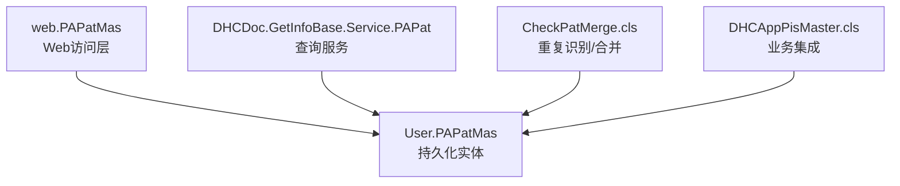
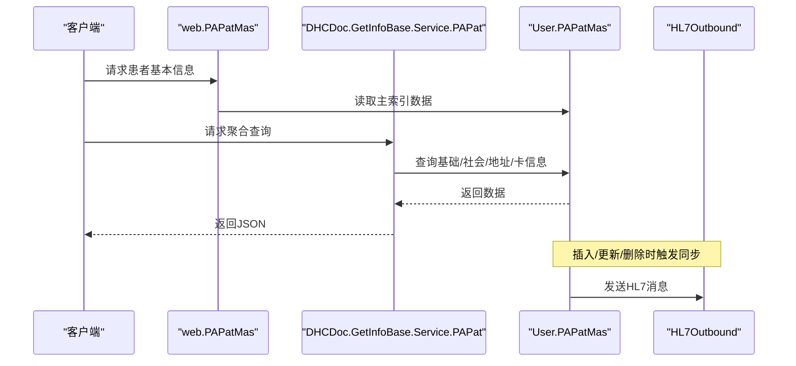
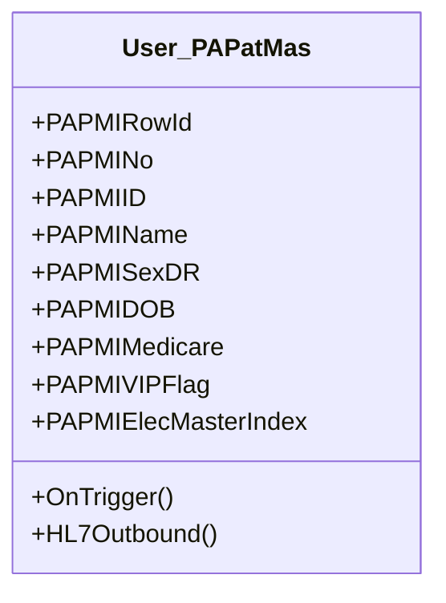
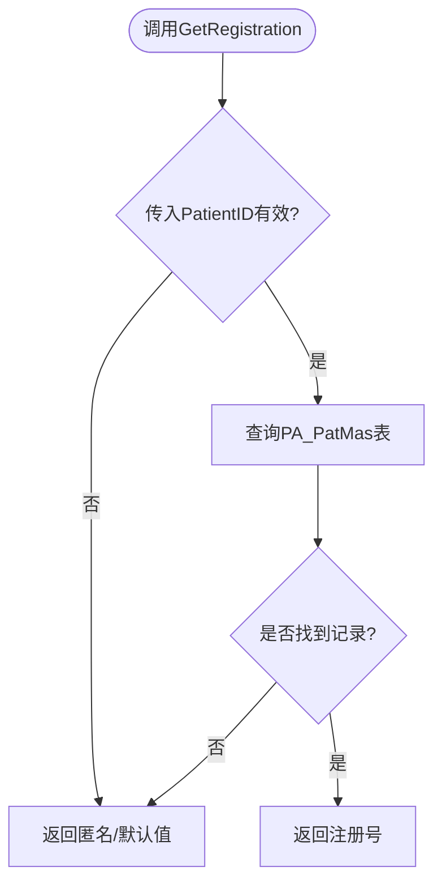
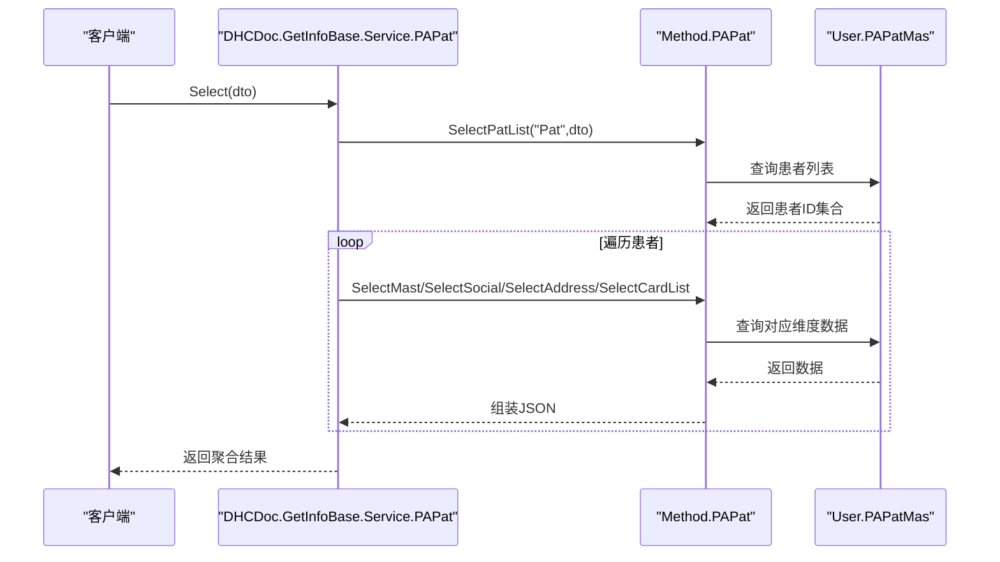
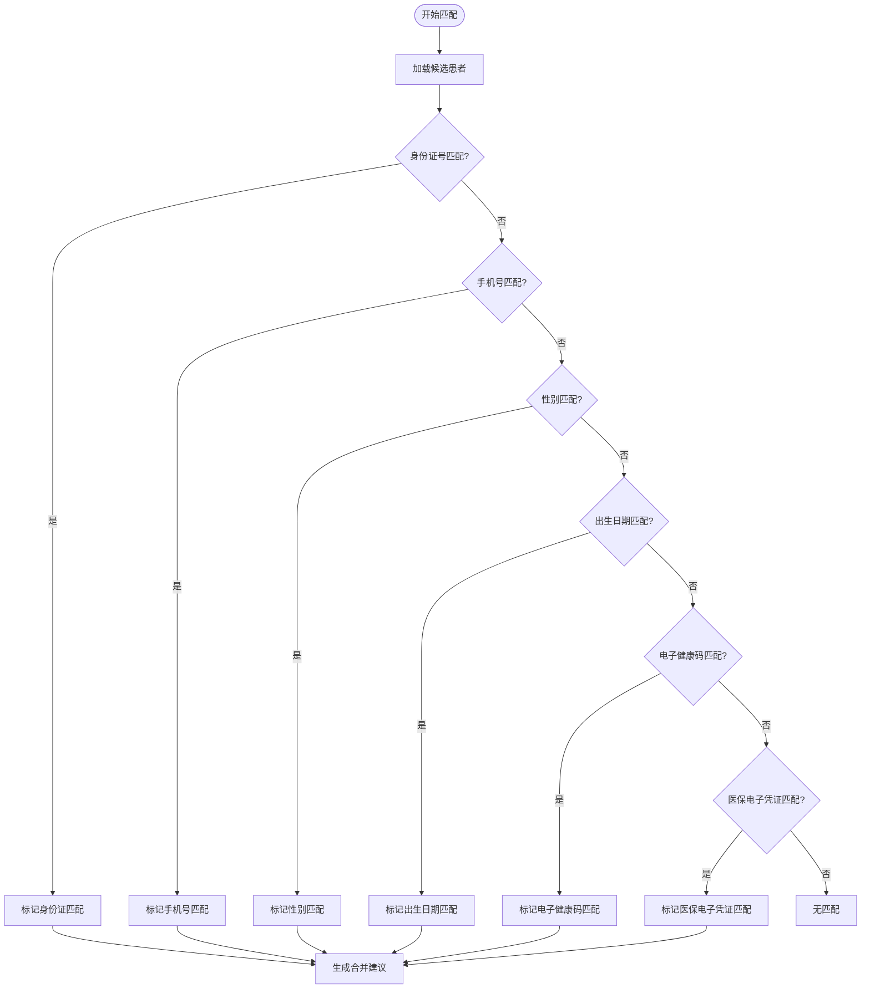
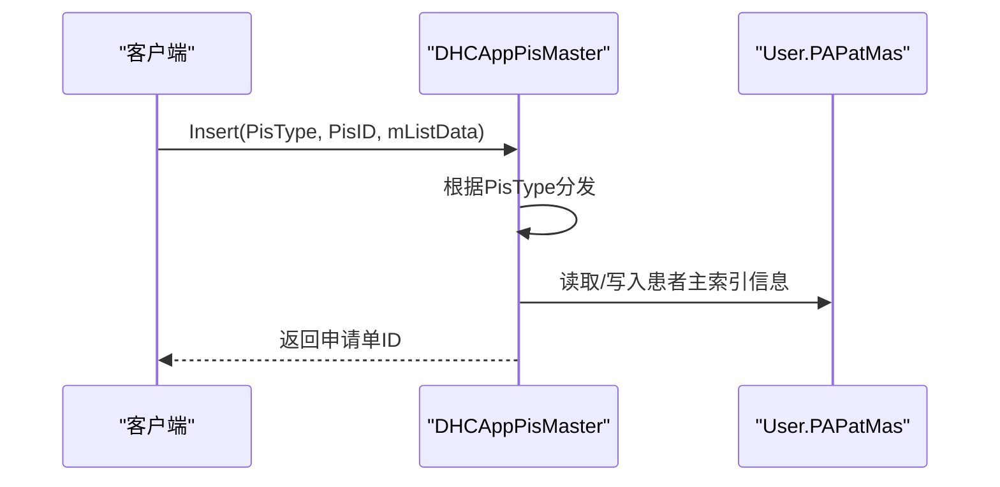
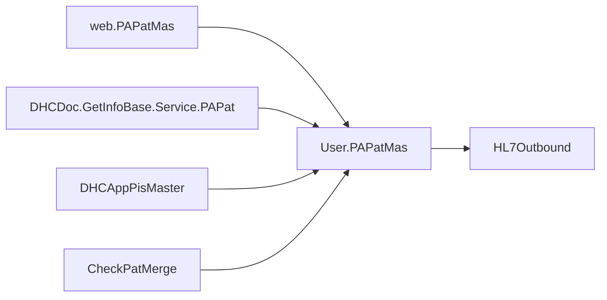

# 患者主索引接口

<cite>
**本文引用的文件**
- [PAPatMas.cls](file://src/backend/epmi-mc/User/PAPatMas.cls)
- [PAPatMas.cls（Web）](file://src/backend/epmi-mc/web/PAPatMas.cls)
- [PAPat.cls（服务）](file://src/backend/public-mc/DHCDoc/GetInfoBase/Service/PAPat.cls)
- [CheckPatMerge.cls](file://src/backend/epmi-mc/CF/DHCDoc/OPDoc/CheckPatMerge.cls)
- [DHCAppPisMaster.cls](file://src/backend/doc-ws/web/DHCAppPisMaster.cls)
</cite>

## 目录
1. [简介](#简介)
2. [项目结构](#项目结构)
3. [核心组件](#核心组件)
4. [架构总览](#架构总览)
5. [详细组件分析](#详细组件分析)
6. [依赖关系分析](#依赖关系分析)
7. [性能考虑](#性能考虑)
8. [故障排查指南](#故障排查指南)
9. [结论](#结论)
10. [附录：API参考与调用示例](#附录api参考与调用示例)

## 简介
本文件面向“患者主索引”Web服务接口的技术文档，聚焦以下目标：
- 患者基本信息增删改查的接口规范
- 多源数据合并、重复患者识别的业务逻辑与接口
- 患者身份验证、信息更新同步、隐私保护等安全机制
- 患者管理员工作流中的具体API调用示例
- 与其他HIS模块的患者数据同步策略

本仓库中患者主索引的核心实体定义位于持久化类，查询与服务封装在公共服务层，重复识别与合并逻辑集中在专用检查类中。

## 项目结构
围绕患者主索引的相关代码主要分布在以下位置：
- 患者主数据模型：epmi-mc/User/PAPatMas.cls（持久化实体，含字段、索引、触发器）
- Web访问层：epmi-mc/web/PAPatMas.cls（提供查询、状态、展示等Web方法）
- 信息查询服务：public-mc/DHCDoc/GetInfoBase/Service/PAPat.cls（统一检索入口，聚合基础、社会属性、地址、卡信息等）
- 重复识别与合并：epmi-mc/CF/DHCDoc/OPDoc/CheckPatMerge.cls（按身份证号、手机号、性别、出生日期、电子健康码、医保电子凭证等维度进行匹配与合并建议）
- 业务集成点：doc-ws/web/DHCAppPisMaster.cls（病理申请等业务流程中会读取患者主索引信息）

图表来源
- [PAPatMas.cls（Web）:121-130](file://src/backend/epmi-mc/web/PAPatMas.cls#L121-L130)
- [PAPatMas.cls:294-332](file://src/backend/epmi-mc/User/PAPatMas.cls#L294-L332)
- [PAPat.cls（服务）:32-79](file://src/backend/public-mc/DHCDoc/GetInfoBase/Service/PAPat.cls#L32-L79)
- [CheckPatMerge.cls:212-291](file://src/backend/epmi-mc/CF/DHCDoc/OPDoc/CheckPatMerge.cls#L212-L291)
- [DHCAppPisMaster.cls:13-33](file://src/backend/doc-ws/web/DHCAppPisMaster.cls#L13-L33)

章节来源
- [PAPatMas.cls:294-332](file://src/backend/epmi-mc/User/PAPatMas.cls#L294-L332)
- [PAPatMas.cls（Web）:121-130](file://src/backend/epmi-mc/web/PAPatMas.cls#L121-L130)
- [PAPat.cls（服务）:32-79](file://src/backend/public-mc/DHCDoc/GetInfoBase/Service/PAPat.cls#L32-L79)
- [CheckPatMerge.cls:212-291](file://src/backend/epmi-mc/CF/DHCDoc/OPDoc/CheckPatMerge.cls#L212-L291)
- [DHCAppPisMaster.cls:13-33](file://src/backend/doc-ws/web/DHCAppPisMaster.cls#L13-L33)

## 核心组件
- 患者主数据实体（User.PAPatMas）
  - 承载患者主索引的核心字段：姓名、性别、出生日期、证件号、医保相关、联系方式、VIP标识、健康卡平台主索引等
  - 提供索引与存储映射，支持高效检索与全局索引
  - 通过触发器在插入、更新、删除时执行动作并输出HL7消息，用于跨系统同步
- Web访问层（web.PAPatMas）
  - 提供注册号获取、VIP状态、名称显示、历史查询等Web方法
  - 作为前端或外部系统访问患者主数据的便捷入口
- 查询服务（DHCDoc.GetInfoBase.Service.PAPat）
  - 统一对外暴露Select、SelectPat、SelectMast、SelectSocial、SelectAddress、SelectCardList等方法
  - 组合基础信息、社会属性、地址、卡列表等多维数据，返回结构化JSON
- 重复识别与合并（CheckPatMerge）
  - 基于多字段匹配（身份证号、手机号、性别、出生日期、电子健康码、医保电子凭证等）生成合并建议
  - 将匹配结果写入临时结构，供后续合并流程使用
- 业务集成（DHCAppPisMaster）
  - 在病理申请等业务中读取患者主索引信息，确保业务单据关联到正确的患者主记录

章节来源
- [PAPatMas.cls:10-274](file://src/backend/epmi-mc/User/PAPatMas.cls#L10-L274)
- [PAPatMas.cls（Web）:121-130](file://src/backend/epmi-mc/web/PAPatMas.cls#L121-L130)
- [PAPat.cls（服务）:32-132](file://src/backend/public-mc/DHCDoc/GetInfoBase/Service/PAPat.cls#L32-L132)
- [CheckPatMerge.cls:212-291](file://src/backend/epmi-mc/CF/DHCDoc/OPDoc/CheckPatMerge.cls#L212-L291)
- [DHCAppPisMaster.cls:13-33](file://src/backend/doc-ws/web/DHCAppPisMaster.cls#L13-L33)

## 架构总览
患者主索引的Web服务采用分层设计：
- 接入层：Web方法或服务类暴露REST/内部调用接口
- 服务层：查询服务聚合多维度数据，提供统一的查询入口
- 数据层：持久化实体负责数据存储、索引与触发器
- 集成层：触发器与HL7输出实现与其他HIS模块的数据同步

图表来源
- [PAPatMas.cls（Web）:121-130](file://src/backend/epmi-mc/web/PAPatMas.cls#L121-L130)
- [PAPat.cls（服务）:32-79](file://src/backend/public-mc/DHCDoc/GetInfoBase/Service/PAPat.cls#L32-L79)
- [PAPatMas.cls:296-332](file://src/backend/epmi-mc/User/PAPatMas.cls#L296-L332)

## 详细组件分析

### 患者主数据实体（User.PAPatMas）
- 职责
  - 定义患者主索引的完整数据模型，包括身份信息、联系方式、医保信息、VIP标识、健康卡平台主索引等
  - 提供索引与存储映射，支持按DOB、RowId等快速检索
  - 通过触发器在CRUD操作时执行审计与同步
- 关键特性
  - 计算字段：如综合显示名、姓氏、查找显示等，提升查询与展示效率
  - 触发器：插入后、更新后、删除前/后分别执行动作并输出HL7消息，保证跨系统一致性
- 复杂度与优化
  - 大量字段与索引带来较高维护成本，建议在批量操作时注意事务边界与索引维护开销
  - 触发器可能引入额外I/O，需评估对写入性能的影响

图表来源
- [PAPatMas.cls:10-274](file://src/backend/epmi-mc/User/PAPatMas.cls#L10-L274)
- [PAPatMas.cls:296-332](file://src/backend/epmi-mc/User/PAPatMas.cls#L296-L332)

章节来源
- [PAPatMas.cls:10-274](file://src/backend/epmi-mc/User/PAPatMas.cls#L10-L274)
- [PAPatMas.cls:296-332](file://src/backend/epmi-mc/User/PAPatMas.cls#L296-L332)

### Web访问层（web.PAPatMas）
- 职责
  - 提供注册号获取、VIP状态、名称显示、历史查询等Web方法
  - 简化上层调用，屏蔽底层细节
- 典型方法
  - GetRegistration：根据PatientID获取注册号
  - GetVIPStatus：获取VIP状态
  - FindPatient：按PatientID查询基本详情
- 注意事项
  - 返回匿名或空值时需做降级处理，避免前端异常

图表来源
- [PAPatMas.cls（Web）:121-130](file://src/backend/epmi-mc/web/PAPatMas.cls#L121-L130)

章节来源
- [PAPatMas.cls（Web）:121-130](file://src/backend/epmi-mc/web/PAPatMas.cls#L121-L130)

### 查询服务（DHCDoc.GetInfoBase.Service.PAPat）
- 职责
  - 统一对外暴露查询接口，聚合基础信息、社会属性、地址、卡列表等
  - 支持多种查询条件（卡号、登记号、出生日期、姓名、证件号、电话、患者ID），支持List对象格式入参
- 典型方法
  - Select：检索患者基本信息，支持复杂条件
  - SelectPat：按患者ID查询当前所有基本信息
  - SelectMast/SelectSocial/SelectAddress/SelectCardList：分维度查询
- 数据组装
  - 将各维度数据合并为统一JSON结构，便于前端消费

图表来源
- [PAPat.cls（服务）:32-79](file://src/backend/public-mc/DHCDoc/GetInfoBase/Service/PAPat.cls#L32-L79)

章节来源
- [PAPat.cls（服务）:32-132](file://src/backend/public-mc/DHCDoc/GetInfoBase/Service/PAPat.cls#L32-L132)

### 重复识别与合并（CheckPatMerge）
- 职责
  - 基于多字段匹配（身份证号、手机号、性别、出生日期、电子健康码、医保电子凭证等）生成合并建议
  - 将匹配结果写入临时结构，供后续合并流程使用
- 业务逻辑
  - 对每个候选患者，逐项比对关键字段，累计匹配度
  - 输出合并建议串，包含匹配字段与原因说明
- 风险与治理
  - 误匹配可能导致错误合并，需在合并前增加人工确认或二次校验
  - 建议记录合并日志，便于追溯与回滚

图表来源
- [CheckPatMerge.cls:212-291](file://src/backend/epmi-mc/CF/DHCDoc/OPDoc/CheckPatMerge.cls#L212-L291)

章节来源
- [CheckPatMerge.cls:212-291](file://src/backend/epmi-mc/CF/DHCDoc/OPDoc/CheckPatMerge.cls#L212-L291)

### 业务集成（DHCAppPisMaster）
- 职责
  - 在病理申请等业务中读取患者主索引信息，确保业务单据关联到正确的患者主记录
- 典型流程
  - 根据申请类型分发到不同插入/更新方法
  - 在事务中依次写入主表、医嘱、标本等子表，失败时回滚
- 与主索引的关系
  - 业务单据通过患者ID关联到主索引，保证数据一致性与可追溯性

图表来源
- [DHCAppPisMaster.cls:13-33](file://src/backend/doc-ws/web/DHCAppPisMaster.cls#L13-L33)

章节来源
- [DHCAppPisMaster.cls:13-33](file://src/backend/doc-ws/web/DHCAppPisMaster.cls#L13-L33)

## 依赖关系分析
- 组件耦合
  - Web访问层依赖持久化实体，查询服务依赖持久化实体，业务集成依赖持久化实体
  - 重复识别与合并不直接修改主索引，但影响合并决策
- 外部依赖
  - HL7Outbound：用于跨系统同步患者主数据
- 潜在循环依赖
  - 当前结构中未发现循环依赖，但需注意触发器与业务集成的调用链

图表来源
- [PAPatMas.cls（Web）:121-130](file://src/backend/epmi-mc/web/PAPatMas.cls#L121-L130)
- [PAPat.cls（服务）:32-79](file://src/backend/public-mc/DHCDoc/GetInfoBase/Service/PAPat.cls#L32-L79)
- [DHCAppPisMaster.cls:13-33](file://src/backend/doc-ws/web/DHCAppPisMaster.cls#L13-L33)
- [CheckPatMerge.cls:212-291](file://src/backend/epmi-mc/CF/DHCDoc/OPDoc/CheckPatMerge.cls#L212-L291)
- [PAPatMas.cls:296-332](file://src/backend/epmi-mc/User/PAPatMas.cls#L296-L332)

章节来源
- [PAPatMas.cls:296-332](file://src/backend/epmi-mc/User/PAPatMas.cls#L296-L332)
- [PAPatMas.cls（Web）:121-130](file://src/backend/epmi-mc/web/PAPatMas.cls#L121-L130)
- [PAPat.cls（服务）:32-79](file://src/backend/public-mc/DHCDoc/GetInfoBase/Service/PAPat.cls#L32-L79)
- [CheckPatMerge.cls:212-291](file://src/backend/epmi-mc/CF/DHCDoc/OPDoc/CheckPatMerge.cls#L212-L291)
- [DHCAppPisMaster.cls:13-33](file://src/backend/doc-ws/web/DHCAppPisMaster.cls#L13-L33)

## 性能考虑
- 索引与查询
  - 利用DOB、RowId等索引提升查询性能
  - 复杂查询建议使用查询服务的聚合方法，减少多次往返
- 触发器与同步
  - 触发器在CRUD时执行，可能引入额外I/O；建议在高并发写入场景下评估批处理与异步同步策略
- 合并算法
  - 重复识别涉及多字段比对，建议在候选集较小的范围内执行，避免全库扫描

[本节为通用性能建议，不直接分析具体文件]

## 故障排查指南
- 常见问题
  - 查询返回匿名或空值：检查PatientID有效性及数据库记录是否存在
  - 合并建议不准确：核对匹配字段（身份证号、手机号、性别、出生日期、电子健康码、医保电子凭证）的一致性与完整性
  - 同步失败：检查HL7Outbound配置与网络连通性
- 定位步骤
  - 使用查询服务逐步缩小范围，先查基础信息，再查社会属性、地址、卡列表
  - 查看触发器日志与HL7输出，确认同步链路
  - 对合并建议进行人工复核，必要时调整匹配规则

章节来源
- [PAPatMas.cls（Web）:121-130](file://src/backend/epmi-mc/web/PAPatMas.cls#L121-L130)
- [PAPat.cls（服务）:32-79](file://src/backend/public-mc/DHCDoc/GetInfoBase/Service/PAPat.cls#L32-L79)
- [CheckPatMerge.cls:212-291](file://src/backend/epmi-mc/CF/DHCDoc/OPDoc/CheckPatMerge.cls#L212-L291)
- [PAPatMas.cls:296-332](file://src/backend/epmi-mc/User/PAPatMas.cls#L296-L332)

## 结论
本仓库通过持久化实体、Web访问层、查询服务与重复识别模块共同实现了患者主索引的核心能力。触发器与HL7输出保障了跨系统同步，查询服务提供了统一的聚合接口。建议在大规模部署时关注性能与准确性，结合人工复核与日志追踪，确保主索引的权威性与一致性。

[本节为总结性内容，不直接分析具体文件]

## 附录：API参考与调用示例

### 患者基本信息查询
- 接口：DHCDoc.GetInfoBase.Service.PAPat.Select
- 入参：支持卡号、登记号、出生日期、姓名、证件号、电话、患者ID等，支持List对象格式
- 出参：患者基本信息数组
- 示例路径：[PAPat.cls（服务）:32-51](file://src/backend/public-mc/DHCDoc/GetInfoBase/Service/PAPat.cls#L32-L51)

### 按患者ID查询全部基本信息
- 接口：DHCDoc.GetInfoBase.Service.PAPat.SelectPat
- 入参：PatientID
- 出参：基础、社会属性、地址、卡列表聚合JSON
- 示例路径：[PAPat.cls（服务）:61-79](file://src/backend/public-mc/DHCDoc/GetInfoBase/Service/PAPat.cls#L61-L79)

### 分维度查询
- 接口：SelectMast/SelectSocial/SelectAddress/SelectCardList
- 入参：PatientID/PatientNo
- 出参：对应维度数据JSON
- 示例路径：[PAPat.cls（服务）:88-132](file://src/backend/public-mc/DHCDoc/GetInfoBase/Service/PAPat.cls#L88-L132)

### 注册号与VIP状态
- 接口：web.PAPatMas.GetRegistration / GetVIPStatus
- 入参：PatientID
- 出参：注册号/VIP状态
- 示例路径：[PAPatMas.cls（Web）:121-143](file://src/backend/epmi-mc/web/PAPatMas.cls#L121-L143)

### 重复识别与合并建议
- 接口：CheckPatMerge（内部方法）
- 入参：候选患者集合
- 出参：合并建议串（包含匹配字段与原因）
- 示例路径：[CheckPatMerge.cls:212-291](file://src/backend/epmi-mc/CF/DHCDoc/OPDoc/CheckPatMerge.cls#L212-L291)

### 患者管理员工作流示例
- 步骤1：调用Select查询患者基本信息
- 步骤2：若发现重复，调用CheckPatMerge生成合并建议
- 步骤3：人工确认后执行合并（由合并流程完成）
- 步骤4：通过HL7Outbound同步至其他HIS模块
- 示例路径：
  - [PAPat.cls（服务）:32-79](file://src/backend/public-mc/DHCDoc/GetInfoBase/Service/PAPat.cls#L32-L79)
  - [CheckPatMerge.cls:212-291](file://src/backend/epmi-mc/CF/DHCDoc/OPDoc/CheckPatMerge.cls#L212-L291)
  - [PAPatMas.cls:296-332](file://src/backend/epmi-mc/User/PAPatMas.cls#L296-L332)

### 与其他HIS模块的患者数据同步策略
- 触发器驱动：插入/更新/删除时触发HL7Outbound
- 同步内容：患者主索引关键字段（姓名、性别、出生日期、证件号、医保信息等）
- 策略建议：
  - 高并发写入时采用批处理与异步同步
  - 失败重试与死信队列保障可靠性
  - 变更日志与审计追踪便于问题定位
- 示例路径：[PAPatMas.cls:296-332](file://src/backend/epmi-mc/User/PAPatMas.cls#L296-L332)

章节来源
- [PAPat.cls（服务）:32-132](file://src/backend/public-mc/DHCDoc/GetInfoBase/Service/PAPat.cls#L32-L132)
- [PAPatMas.cls（Web）:121-143](file://src/backend/epmi-mc/web/PAPatMas.cls#L121-L143)
- [CheckPatMerge.cls:212-291](file://src/backend/epmi-mc/CF/DHCDoc/OPDoc/CheckPatMerge.cls#L212-L291)
- [PAPatMas.cls:296-332](file://src/backend/epmi-mc/User/PAPatMas.cls#L296-L332)