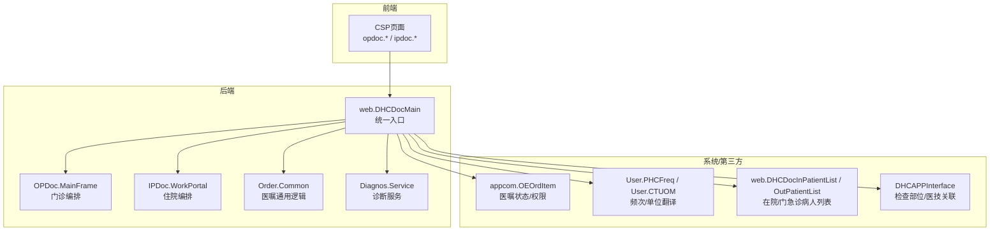
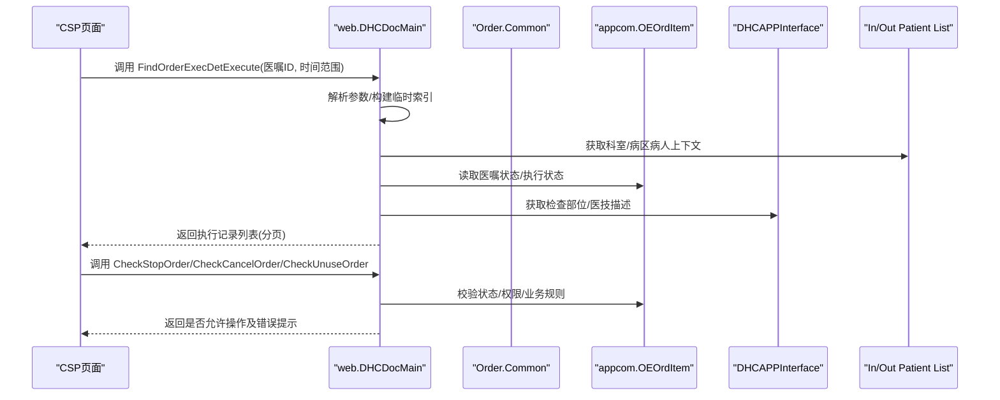
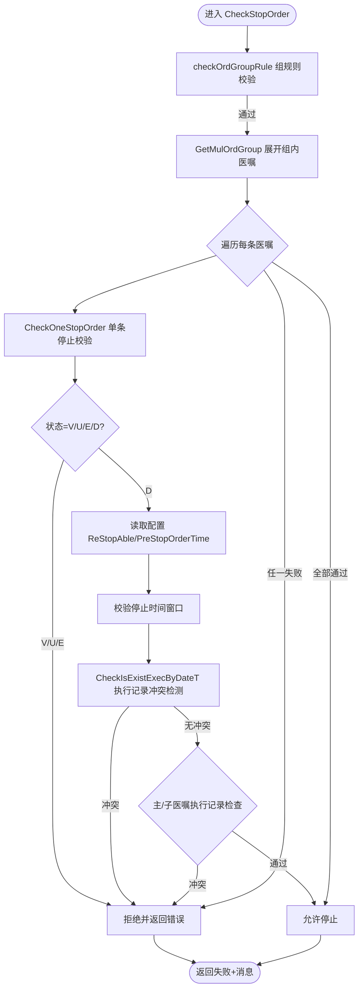
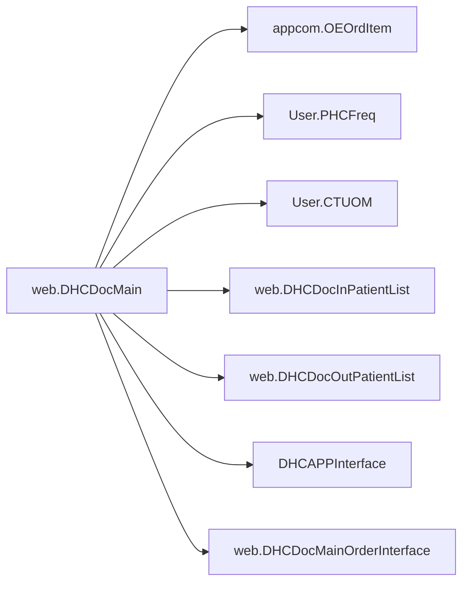

# 医生工作站 (doc-ws)

<cite>
**本文引用的文件**
- [DHCDocMain.cls](file://src/backend/doc-ws/web/DHCDocMain.cls)
- [OPDoc/MainFrame.cls](file://src/backend/doc-ws/DHCDoc/OPDoc/MainFrame.cls)
- [IPDoc/WorkPortal.cls](file://src/backend/doc-ws/DHCDoc/IPDoc/WorkPortal.cls)
- [Order/Common.cls](file://src/backend/doc-ws/DHCDoc/Order/Common.cls)
- [web.DHCDocMainOrderInterface.cls](file://src/backend/doc-ws/web/DHCDocMainOrderInterface.cls)
- [web.DHCDocInPatientList.cls](file://src/backend/doc-ws/web/DHCDocInPatientList.cls)
- [web.DHCDocOutPatientList.cls](file://src/backend/doc-ws/web/DHCDocOutPatientList.cls)
- [appcom.OEOrdItem.cls](file://src/backend/appcom/OEOrdItem.cls)
- [User.PHCFreq.cls](file://src/backend/User/PHCFreq.cls)
- [User.CTUOM.cls](file://src/backend/User/CTUOM.cls)
- [DHCAPPInterface.cls](file://src/backend/doc-ws/web/DHCAPPInterface.cls)
- [DHCDocCure.Apply.cls](file://src/backend/cure-ws/DHCDoc/DHCDocCure/DHCDocCureApply.cls)
</cite>

## 目录
1. [简介](#简介)
2. [项目结构](#项目结构)
3. [核心组件](#核心组件)
4. [架构总览](#架构总览)
5. [详细组件分析](#详细组件分析)
6. [依赖关系分析](#依赖关系分析)
7. [性能考虑](#性能考虑)
8. [故障排查指南](#故障排查指南)
9. [结论](#结论)
10. [附录](#附录)

## 简介
本模块为医生工作站的“医嘱、诊断、处方”等核心业务提供后端支撑，覆盖门诊与住院两大场景。重点围绕 DHCDocMain 主控制器展开，说明其如何统一承载医嘱执行查询、费用明细查询、患者列表聚合、医嘱信息组装、权限校验（停止/撤销/作废）、复制医嘱数据生成等能力；并说明 CSP 页面与 ObjectScript 类的交互模式、数据流转机制、扩展点与最佳实践。

## 项目结构
- 后端核心：
  - web.DHCDocMain：统一入口类，封装大量 Query/ClassMethod，供前端 CSP 通过 REST/Query 调用。
  - OPDoc/IPDoc：门诊/住院门户与流程控制类，负责不同场景的编排与跳转。
  - Order/*：订单/医嘱通用逻辑、服务层、接口层等。
  - Diagnos/*：诊断相关服务与配置。
- 前端界面：
  - src/frontend/doc-ws/csp：大量 CSP 页面，负责渲染医生工作台、医嘱录入/查看、诊断录入、处方打印等。

图表来源
- [DHCDocMain.cls:1-800](file://src/backend/doc-ws/web/DHCDocMain.cls#L1-L800)
- [DHCDocMain.cls:801-1600](file://src/backend/doc-ws/web/DHCDocMain.cls#L801-L1600)
- [DHCDocMain.cls:1601-2400](file://src/backend/doc-ws/web/DHCDocMain.cls#L1601-L2400)

章节来源
- [DHCDocMain.cls:1-800](file://src/backend/doc-ws/web/DHCDocMain.cls#L1-L800)
- [DHCDocMain.cls:801-1600](file://src/backend/doc-ws/web/DHCDocMain.cls#L801-L1600)
- [DHCDocMain.cls:1601-2400](file://src/backend/doc-ws/web/DHCDocMain.cls#L1601-L2400)

## 核心组件
- web.DHCDocMain：统一控制器，提供：
  - 医嘱执行记录查询 FindOrderExecDetExecute
  - 医嘱费用明细查询 FindOrderFeeExecute
  - 当前/历史在院病人列表 FindCurrentAdmProxyExecute / FindDischgAdmProxyExecute
  - 医嘱信息组装 OrderInfo
  - 医嘱复制 CreateCopyItem / GetCopyItemData
  - 权限校验 CheckStopOrder / CheckCancelOrder / CheckUnuseOrder / ForceDealOrder
  - 小时医嘱结束时间校验 CheckUpdateHour
  - 其他辅助方法（语言化、图标、隐藏菜单判断等）
- OPDoc.MainFrame：门诊工作流编排（患者选择、医嘱录入、诊断、处方等）。
- IPDoc.WorkPortal：住院工作流编排（床旁视图、医嘱执行、治疗单等）。
- Order.Common：医嘱类型识别、长期/短期判定、频次计算等通用能力。
- 诊断服务 Diagnos.Service：诊断模板、条目、ICD 映射等。

章节来源
- [DHCDocMain.cls:1-800](file://src/backend/doc-ws/web/DHCDocMain.cls#L1-L800)
- [DHCDocMain.cls:801-1600](file://src/backend/doc-ws/web/DHCDocMain.cls#L801-L1600)
- [DHCDocMain.cls:1601-2400](file://src/backend/doc-ws/web/DHCDocMain.cls#L1601-L2400)
- [Order/Common.cls](file://src/backend/doc-ws/DHCDoc/Order/Common.cls)
- [Diagnos/Service.cls](file://src/backend/doc-ws/DHCDoc/Diagnos/Service.cls)

## 架构总览
医生工作站采用“CSP 页面 + ObjectScript 类”的分层架构：
- 前端 CSP 通过 AJAX/REST 调用后端 ClassMethod 或 SQLQuery。
- DHCDocMain 作为统一入口，协调各子系统（医嘱、诊断、计费、医技、护理等），完成数据聚合、权限校验与业务规则处理。
- 数据源包括 HIS/EMR 核心表（OEORD、PAADM、PAPER、ARCIM、PHCFR、CTLOC 等）以及缓存临时表（^CacheTemp、^TMP）。

图表来源
- [DHCDocMain.cls:1-800](file://src/backend/doc-ws/web/DHCDocMain.cls#L1-L800)
- [DHCDocMain.cls:1601-2400](file://src/backend/doc-ws/web/DHCDocMain.cls#L1601-L2400)
- [DHCDocMain.cls:801-1600](file://src/backend/doc-ws/web/DHCDocMain.cls#L801-L1600)

## 详细组件分析

### DHCDocMain 主控制器
职责与关键点：
- 统一对外暴露 Query/ClassMethod，屏蔽底层复杂表结构与业务规则。
- 支持多场景：门诊/住院、护士/医生视角、按病区/本科/单元过滤。
- 内置丰富的权限与业务规则校验（停止/撤销/作废、结算状态、会诊/手麻/输血等外部系统联动）。
- 提供医嘱复制数据生成，便于快速开单与模板复用。

关键方法与数据流：
- FindOrderExecDetExecute：按医嘱ID与时间范围查询执行记录，整合执行状态、账单状态、免费原因、发退药数量、可欠费执行标志、申请撤销状态、备注、检查部位等。
- FindOrderFeeExecute：按医嘱/执行记录查询费用明细，处理金额正负、退费标记、原始单据等。
- FindCurrentAdmProxyExecute / FindDischgAdmProxyExecute：聚合在院/出院病人列表，支持多种筛选条件与排序（床号/空床）。
- OrderInfo：组装医嘱展示所需字段（名称、用法、频次、时长、优先级、停开时间、开单/停单医生、科室、通知标识等）。
- CreateCopyItem / GetCopyItemData：抽取原医嘱属性，按策略复制（计费、备注、包装量、优先级等），支持虚拟长期与周频次计算。
- CheckStopOrder / CheckCancelOrder / CheckUnuseOrder / ForceDealOrder：集中实现停止/撤销/作废的权限与规则校验，包含会诊、手麻、输血、拆账、已治疗、条码扫描、配液/备药等限制。
- CheckUpdateHour：小时医嘱结束时间校验，确保不与前/后执行记录冲突，且受医院配置控制。

图表来源
- [DHCDocMain.cls:1601-2400](file://src/backend/doc-ws/web/DHCDocMain.cls#L1601-L2400)
- [appcom.OEOrdItem.cls](file://src/backend/appcom/OEOrdItem.cls)

章节来源
- [DHCDocMain.cls:1-800](file://src/backend/doc-ws/web/DHCDocMain.cls#L1-L800)
- [DHCDocMain.cls:801-1600](file://src/backend/doc-ws/web/DHCDocMain.cls#L801-L1600)
- [DHCDocMain.cls:1601-2400](file://src/backend/doc-ws/web/DHCDocMain.cls#L1601-L2400)

### 门诊工作流（OPDoc）
- MainFrame：门诊主框架，串联患者选择、医嘱录入、诊断、处方、打印等步骤。
- 与 DHCDocMain 的协作：
  - 通过 OrderInfo 获取医嘱展示信息。
  - 通过权限校验方法决定按钮可见性（停止/撤销/作废）。
  - 通过 FindCurrentAdmProxyExecute 拉取门诊/在院病人列表。

章节来源
- [OPDoc/MainFrame.cls](file://src/backend/doc-ws/DHCDoc/OPDoc/MainFrame.cls)
- [DHCDocMain.cls:801-1600](file://src/backend/doc-ws/web/DHCDocMain.cls#L801-L1600)

### 住院工作流（IPDoc）
- WorkPortal：住院工作门户，集成床旁视图、医嘱执行、治疗单、评估单等。
- 与 DHCDocMain 的协作：
  - 使用 FindCurrentAdmProxyExecute 获取在院病人并按床号排序。
  - 使用 FindOrderExecDetExecute 展示执行记录与状态。
  - 使用权限校验方法控制操作按钮。

章节来源
- [IPDoc/WorkPortal.cls](file://src/backend/doc-ws/DHCDoc/IPDoc/WorkPortal.cls)
- [DHCDocMain.cls:801-1600](file://src/backend/doc-ws/web/DHCDocMain.cls#L801-L1600)

### 医嘱管理（Order）
- Common：提供医嘱类型识别、长期/短期判定、频次计算等通用能力。
- 与 DHCDocMain 的协作：
  - 在 OrderInfo 中计算频次/时长/优先级等显示信息。
  - 在复制医嘱时根据类型调整默认频次与包装量。

章节来源
- [Order/Common.cls](file://src/backend/doc-ws/DHCDoc/Order/Common.cls)
- [DHCDocMain.cls:1601-2400](file://src/backend/doc-ws/web/DHCDocMain.cls#L1601-L2400)

### 诊断管理（Diagnos）
- Service：诊断模板、条目维护、ICD 映射、常用诊断等。
- 与 DHCDocMain 的协作：
  - 在患者基本信息中携带诊断摘要。
  - 在医嘱/处方关联诊断时进行一致性校验。

章节来源
- [Diagnos/Service.cls](file://src/backend/doc-ws/DHCDoc/Diagnos/Service.cls)

### 处方管理
- 通过 OrderInfo 与权限校验方法，结合药房/医保/保险规则，控制处方开立、修改、撤销。
- 与计费/保险系统的对接由 Order.Common 与外部接口完成。

章节来源
- [DHCDocMain.cls:1601-2400](file://src/backend/doc-ws/web/DHCDocMain.cls#L1601-L2400)
- [Order/Common.cls](file://src/backend/doc-ws/DHCDoc/Order/Common.cls)

## 依赖关系分析
- DHCDocMain 依赖：
  - appcom.OEOrdItem：医嘱状态、执行状态、权限校验。
  - User.PHCFreq / User.CTUOM：频次与单位翻译。
  - web.DHCDocInPatientList / OutPatientList：在院/门急诊病人列表。
  - DHCAPPInterface：检查部位/医技关联描述。
  - web.DHCDocMainOrderInterface：患者年龄、出院时间、账单信息等。
- 耦合点：
  - 医嘱状态与权限强依赖 appcom.OEOrdItem。
  - 病人列表与排序依赖 In/Out Patient List。
  - 医技/检查部位依赖 DHCAPPInterface。

图表来源
- [DHCDocMain.cls:1-800](file://src/backend/doc-ws/web/DHCDocMain.cls#L1-L800)
- [DHCDocMain.cls:801-1600](file://src/backend/doc-ws/web/DHCDocMain.cls#L801-L1600)
- [DHCDocMain.cls:1601-2400](file://src/backend/doc-ws/web/DHCDocMain.cls#L1601-L2400)

章节来源
- [DHCDocMain.cls:1-800](file://src/backend/doc-ws/web/DHCDocMain.cls#L1-L800)
- [DHCDocMain.cls:801-1600](file://src/backend/doc-ws/web/DHCDocMain.cls#L801-L1600)
- [DHCDocMain.cls:1601-2400](file://src/backend/doc-ws/web/DHCDocMain.cls#L1601-L2400)

## 性能考虑
- 使用 ^CacheTemp 与 ^TMP 临时表减少重复查询，提升列表与执行记录加载速度。
- 分页与过滤：前端传入 start/limit，后端按需截断结果，避免全量返回。
- 批量处理：对多条医嘱的复制/权限校验采用循环与分组优化。
- 语言化与翻译：集中使用 GetTranByDesc/Translate，减少多次字典查询。
- 建议：
  - 对高频查询建立合理索引（如 OEORD、PAADM、PAPER）。
  - 将复杂计算下沉到存储过程或视图，减少对象实例化开销。
  - 对大列表采用懒加载与虚拟滚动。

[本节为通用指导，无需具体文件引用]

## 故障排查指南
常见问题与定位要点：
- 停止/撤销/作废失败：
  - 检查医嘱状态是否为 V/U/E/D，是否符合配置（ReStopAble、PreStopOrderTime）。
  - 检查是否存在执行记录冲突（CheckIsExistExecByDateT）。
  - 检查会诊/手麻/输血/拆账/已治疗/条码扫描/配液/备药等外部限制。
  - 参考路径：[CheckStopOrder/CheckCancelOrder/CheckUnuseOrder:1756-2306](file://src/backend/doc-ws/web/DHCDocMain.cls#L1756-L2306)
- 小时医嘱结束时间异常：
  - 检查前/后执行记录的结束时间与要求执行时间，确保不冲突。
  - 参考路径：[CheckUpdateHour:205-293](file://src/backend/doc-ws/web/DHCDocMain.cls#L205-L293)
- 医嘱复制为空：
  - 检查绑定来源、医护类型、链接医嘱等限制。
  - 参考路径：[CreateCopyItem:1511-1711](file://src/backend/doc-ws/web/DHCDocMain.cls#L1511-L1711)
- 病人列表为空或排序异常：
  - 检查登录用户科室/病区/单元权限，确认筛选条件。
  - 参考路径：[FindCurrentAdmProxyExecute:911-1274](file://src/backend/doc-ws/web/DHCDocMain.cls#L911-L1274)

章节来源
- [DHCDocMain.cls:1601-2400](file://src/backend/doc-ws/web/DHCDocMain.cls#L1601-L2400)
- [DHCDocMain.cls:801-1600](file://src/backend/doc-ws/web/DHCDocMain.cls#L801-L1600)

## 结论
DHCDocMain 作为医生工作站的核心控制器，统一封装了医嘱、诊断、处方相关的查询、权限校验与业务规则，支撑门诊与住院两大场景。通过 CSP 与 ObjectScript 的清晰分层，实现了高内聚、低耦合的可扩展架构。建议在后续扩展中遵循现有模式：新增功能以 ClassMethod/Query 形式接入 DHCDocMain，复用权限与规则校验，保持前后端契约稳定。

[本节为总结，无需具体文件引用]

## 附录

### CSP 与后端交互模式
- 前端 CSP 通过 AJAX/REST 调用 DHCDocMain 的 ClassMethod 或 SQLQuery。
- 典型调用：
  - 医嘱执行记录：FindOrderExecDetExecute
  - 费用明细：FindOrderFeeExecute
  - 病人列表：FindCurrentAdmProxyExecute / FindDischgAdmProxyExecute
  - 权限校验：CheckStopOrder / CheckCancelOrder / CheckUnuseOrder
  - 医嘱信息：OrderInfo
  - 复制医嘱：CreateCopyItem / GetCopyItemData

章节来源
- [DHCDocMain.cls:1-800](file://src/backend/doc-ws/web/DHCDocMain.cls#L1-L800)
- [DHCDocMain.cls:801-1600](file://src/backend/doc-ws/web/DHCDocMain.cls#L801-L1600)
- [DHCDocMain.cls:1601-2400](file://src/backend/doc-ws/web/DHCDocMain.cls#L1601-L2400)

### 扩展示例（如何新增功能）
- 新增一个“医嘱备注添加”的校验与保存：
  - 在 DHCDocMain 新增 ClassMethod CheckAddNoteOrder（已有基础逻辑，可在此基础上扩展）。
  - 在前端 CSP 增加按钮与回调，调用该 ClassMethod。
  - 若涉及外部系统（如会诊/手麻），在 CheckOneCancelOrdCommon 中增加相应检查。
- 参考路径：
  - [CheckAddNoteOrder:2352-2391](file://src/backend/doc-ws/web/DHCDocMain.cls#L2352-L2391)
  - [CheckOneCancelOrdCommon:2003-2241](file://src/backend/doc-ws/web/DHCDocMain.cls#L2003-L2241)

章节来源
- [DHCDocMain.cls:1601-2400](file://src/backend/doc-ws/web/DHCDocMain.cls#L1601-L2400)

### 权限控制、数据验证与业务规则
- 权限控制：
  - 基于科室/病区/单元、医护类型、开单人身份进行授权。
  - 支持强制撤销/作废的配置开关。
- 数据验证：
  - 频次/单位翻译、价格/金额正负、日期/时间格式转换。
  - 检查部位/医技关联描述获取。
- 业务规则：
  - 会诊/手麻/输血/拆账/已治疗/条码扫描/配液/备药等限制。
  - 结算状态（医疗/财务/最终）对操作的约束。
- 参考路径：
  - [CheckStopOrder/CheckCancelOrder/CheckUnuseOrder:1756-2306](file://src/backend/doc-ws/web/DHCDocMain.cls#L1756-L2306)
  - [OrderInfo:1289-1387](file://src/backend/doc-ws/web/DHCDocMain.cls#L1289-L1387)

章节来源
- [DHCDocMain.cls:1601-2400](file://src/backend/doc-ws/web/DHCDocMain.cls#L1601-L2400)
- [DHCDocMain.cls:801-1600](file://src/backend/doc-ws/web/DHCDocMain.cls#L801-L1600)