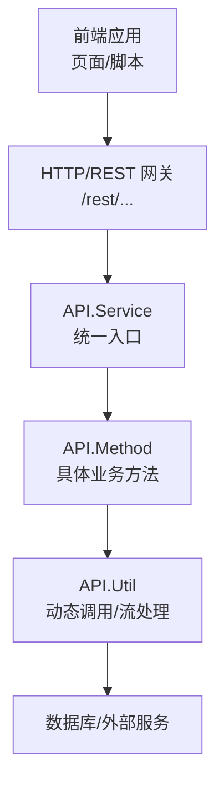
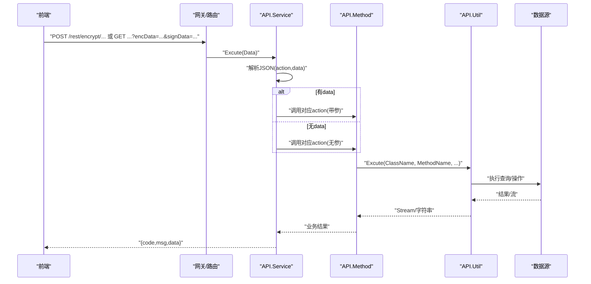
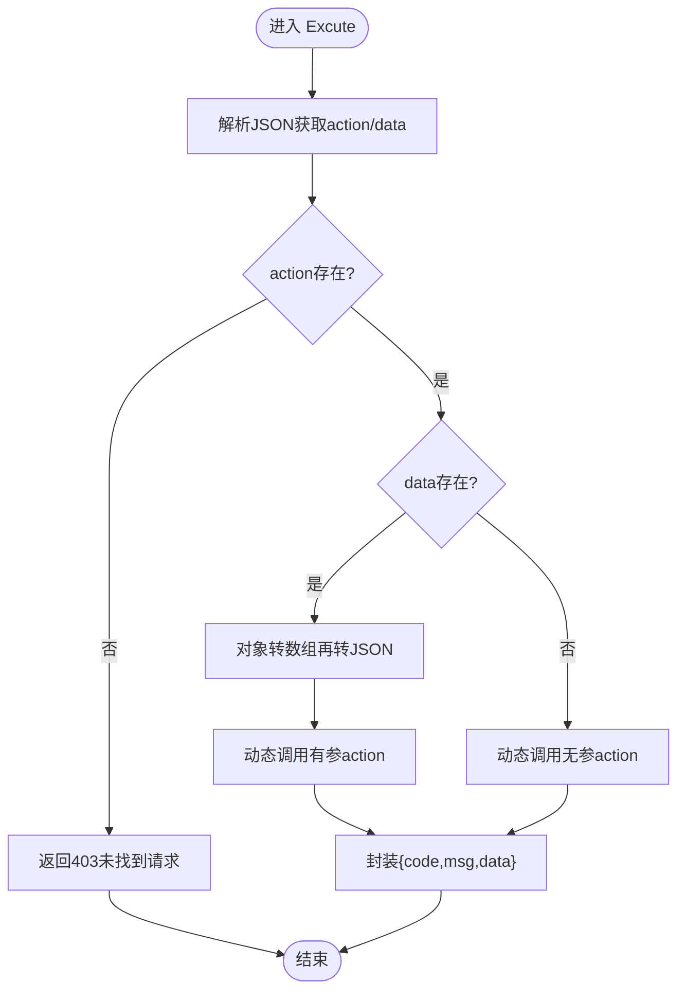
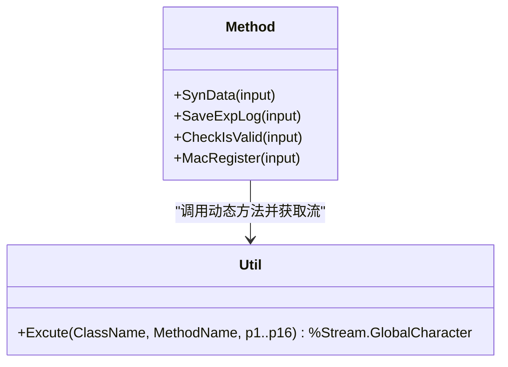
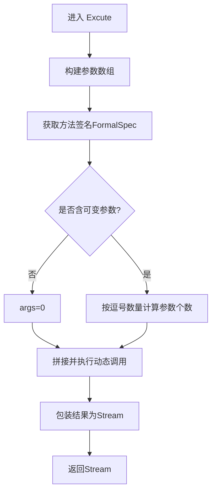
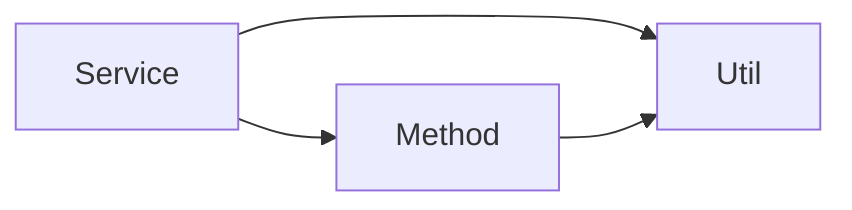

# 前后端集成

<cite>
**本文引用的文件**
- [Service.cls](file://src/backend/conting-ws/DHCDoc/Interface/StandAlone/API/Service.cls)
- [Method.cls](file://src/backend/conting-ws/DHCDoc/Interface/StandAlone/API/Method.cls)
- [Util.cls](file://src/backend/conting-ws/DHCDoc/Interface/StandAlone/API/Util.cls)
</cite>

## 目录
1. [简介](#简介)
2. [项目结构](#项目结构)
3. [核心组件](#核心组件)
4. [架构总览](#架构总览)
5. [详细组件分析](#详细组件分析)
6. [依赖关系分析](#依赖关系分析)
7. [性能考虑](#性能考虑)
8. [故障排查指南](#故障排查指南)
9. [结论](#结论)
10. [附录](#附录)

## 简介
本文件面向医疗信息系统的前后端集成，聚焦于前端与 ObjectScript 后端的通信机制与数据交换格式。基于仓库中“应急系统对接 HIS”的接口实现，文档说明：
- AJAX 请求封装与 RESTful API 调用方式
- 统一响应结构与错误码约定
- 数据序列化（JSON）与流式数据传输
- 安全机制（SM4 加密、SM3 签名、时间戳与 AppId）
- 大文件下载的分块读取与进度展示建议
- 调试与监控方法、缓存策略与性能优化建议
- 安全注意事项（XSS 防护、CSRF 保护）

## 项目结构
本项目采用前后端分离的组织方式：
- 后端位于 src/backend，包含多个业务子系统；本文重点为 conting-ws 下的 StandAlone API 模块，提供统一的入口与服务编排。
- 前端位于 src/frontend，按子系统划分 csp、scripts、css 等目录，负责页面渲染与网络交互。

图表来源
- [Service.cls:9-36](file://src/backend/conting-ws/DHCDoc/Interface/StandAlone/API/Service.cls#L9-L36)
- [Method.cls:16-37](file://src/backend/conting-ws/DHCDoc/Interface/StandAlone/API/Method.cls#L16-L37)
- [Util.cls:8-43](file://src/backend/conting-ws/DHCDoc/Interface/StandAlone/API/Util.cls#L8-L43)

章节来源
- [Service.cls:1-158](file://src/backend/conting-ws/DHCDoc/Interface/StandAlone/API/Service.cls#L1-L158)
- [Method.cls:1-95](file://src/backend/conting-ws/DHCDoc/Interface/StandAlone/API/Method.cls#L1-L95)
- [Util.cls:1-46](file://src/backend/conting-ws/DHCDoc/Interface/StandAlone/API/Util.cls#L1-L46)

## 核心组件
- API.Service：统一入口类，解析请求、路由到具体 action，并格式化返回结果；提供加密链接生成与测试能力。
- API.Method：承载具体业务方法（如数据同步、日志写入、终端校验与注册）。
- API.Util：通用工具，支持动态调用指定类的指定方法，并将返回值包装为流对象以便分块传输。

章节来源
- [Service.cls:9-54](file://src/backend/conting-ws/DHCDoc/Interface/StandAlone/API/Service.cls#L9-L54)
- [Method.cls:16-92](file://src/backend/conting-ws/DHCDoc/Interface/StandAlone/API/Method.cls#L16-L92)
- [Util.cls:8-43](file://src/backend/conting-ws/DHCDoc/Interface/StandAlone/API/Util.cls#L8-L43)

## 架构总览
下图展示了从前端发起请求到后端执行并返回数据的完整流程，包括参数解析、动态调用、流式输出与统一响应封装。

图表来源
- [Service.cls:9-36](file://src/backend/conting-ws/DHCDoc/Interface/StandAlone/API/Service.cls#L9-L36)
- [Method.cls:16-37](file://src/backend/conting-ws/DHCDoc/Interface/StandAlone/API/Method.cls#L16-L37)
- [Util.cls:8-43](file://src/backend/conting-ws/DHCDoc/Interface/StandAlone/API/Util.cls#L8-L43)

## 详细组件分析

### API.Service：统一入口与安全
- 请求处理
  - 接收 JSON 负载，解析出 action 与 data，若 data 为对象则序列化为数组再转回 JSON，便于后续动态调用。
  - 通过动态表达式调用对应 action 方法，支持带参与无参两种模式。
- 响应封装
  - 统一返回结构包含 code、msg、data，便于前端统一处理成功与失败分支。
- 安全与鉴权
  - 提供 GenUrl 用于生成加密链接，使用 SM4 对数据进行对称加密，SM3 计算签名，附带 timestamp、appId、version、encType、signType 等字段，确保传输机密性与完整性。
  - 提供 GetTestUrl 与 TestSQL 用于开发期连通性验证。

图表来源
- [Service.cls:9-36](file://src/backend/conting-ws/DHCDoc/Interface/StandAlone/API/Service.cls#L9-L36)
- [Service.cls:46-54](file://src/backend/conting-ws/DHCDoc/Interface/StandAlone/API/Service.cls#L46-L54)
- [Service.cls:116-133](file://src/backend/conting-ws/DHCDoc/Interface/StandAlone/API/Service.cls#L116-L133)

章节来源
- [Service.cls:9-54](file://src/backend/conting-ws/DHCDoc/Interface/StandAlone/API/Service.cls#L9-L54)
- [Service.cls:116-133](file://src/backend/conting-ws/DHCDoc/Interface/StandAlone/API/Service.cls#L116-L133)

### API.Method：业务方法与数据导出
- 数据同步导出
  - SynData 将输入 JSON 解析为数组，提取 classname、methodname、index、num，调用 Util.Excute 获取流并按固定长度分块读取输出，适合大文件/大数据集下载。
- 日志与终端管理
  - SaveExpLog 写入日志表，CheckIsValid 校验终端有效性，MacRegister 进行终端注册。

图表来源
- [Method.cls:16-37](file://src/backend/conting-ws/DHCDoc/Interface/StandAlone/API/Method.cls#L16-L37)
- [Method.cls:47-92](file://src/backend/conting-ws/DHCDoc/Interface/StandAlone/API/Method.cls#L47-L92)
- [Util.cls:8-43](file://src/backend/conting-ws/DHCDoc/Interface/StandAlone/API/Util.cls#L8-L43)

章节来源
- [Method.cls:16-92](file://src/backend/conting-ws/DHCDoc/Interface/StandAlone/API/Method.cls#L16-L92)
- [Util.cls:8-43](file://src/backend/conting-ws/DHCDoc/Interface/StandAlone/API/Util.cls#L8-L43)

### API.Util：动态调用与流处理
- 动态调用
  - 根据传入的 ClassName 与 MethodName，反射获取方法签名 FormalSpec，据此决定参数个数，拼接执行语句并调用目标方法。
- 流处理
  - 将返回值包装为 %Stream.GlobalCharacter，若返回值为 Stream 类型则拷贝内容，否则写入字符串，便于上层分块读取与传输。

图表来源
- [Util.cls:8-43](file://src/backend/conting-ws/DHCDoc/Interface/StandAlone/API/Util.cls#L8-L43)

章节来源
- [Util.cls:8-43](file://src/backend/conting-ws/DHCDoc/Interface/StandAlone/API/Util.cls#L8-L43)

## 依赖关系分析
- Service 依赖 Method 与 Util，形成“入口-业务-工具”的分层结构，职责清晰、耦合度低。
- Method 依赖 Util 进行动态调用，避免在入口处硬编码业务逻辑。
- Util 通过反射机制降低对具体类的强依赖，提高扩展性。

图表来源
- [Service.cls:9-36](file://src/backend/conting-ws/DHCDoc/Interface/StandAlone/API/Service.cls#L9-L36)
- [Method.cls:16-37](file://src/backend/conting-ws/DHCDoc/Interface/StandAlone/API/Method.cls#L16-L37)
- [Util.cls:8-43](file://src/backend/conting-ws/DHCDoc/Interface/StandAlone/API/Util.cls#L8-L43)

章节来源
- [Service.cls:9-36](file://src/backend/conting-ws/DHCDoc/Interface/StandAlone/API/Service.cls#L9-L36)
- [Method.cls:16-37](file://src/backend/conting-ws/DHCDoc/Interface/StandAlone/API/Method.cls#L16-L37)
- [Util.cls:8-43](file://src/backend/conting-ws/DHCDoc/Interface/StandAlone/API/Util.cls#L8-L43)

## 性能考虑
- 大文件/大数据下载
  - 使用流式输出与分块读取（例如每次读取固定长度），避免一次性加载全部数据导致内存峰值过高。
  - 前端可结合 XMLHttpRequest 或 Fetch 的 ReadableStream 实现进度条与断点续传。
- 动态调用的开销
  - 反射与字符串拼接会带来一定开销，建议在高频路径中对关键方法进行静态化或缓存方法元信息。
- 网络传输
  - 启用压缩（如 gzip）以减少传输体积；合理设置超时与重试策略。
- 并发与限流
  - 在高并发场景下，对热点接口增加限流与熔断，防止雪崩。

[本节为通用性能建议，不直接分析具体文件]

## 故障排查指南
- 统一错误码
  - 所有接口返回统一结构 {code, msg, data}，前端应依据 code 判断成功与失败，并通过 msg 提示用户或记录日志。
- 常见错误定位
  - 检查 action 是否存在、data 是否为空或格式不正确。
  - 检查动态调用时 Class/Method 名称是否正确，参数个数与类型是否匹配。
  - 检查流读取是否完整，是否存在分块边界问题。
- 调试建议
  - 使用浏览器开发者工具的 Network 面板查看请求与响应，关注状态码与响应体结构。
  - 在后端侧打印或记录异常堆栈与输入参数，便于快速定位问题。
- 日志与追踪
  - 利用 SaveExpLog 记录关键操作的日志，包含终端号、状态与消息，便于审计与回溯。

章节来源
- [Service.cls:46-54](file://src/backend/conting-ws/DHCDoc/Interface/StandAlone/API/Service.cls#L46-L54)
- [Method.cls:47-92](file://src/backend/conting-ws/DHCDoc/Interface/StandAlone/API/Method.cls#L47-L92)

## 结论
本集成方案通过统一的入口与安全机制，实现了前后端的高效通信与可扩展的业务编排。借助流式传输与统一响应结构，系统在大数据量场景下具备良好的性能与稳定性。建议在前端侧完善错误处理、进度显示与缓存策略，并在生产环境加强安全加固与监控告警。

[本节为总结性内容，不直接分析具体文件]

## 附录

### 数据序列化与响应格式
- 请求体：JSON，至少包含 action 与可选 data。
- 响应体：JSON，包含 code、msg、data。
- 大文件：通过流式分块传输，前端需按块累积并更新进度。

章节来源
- [Service.cls:9-36](file://src/backend/conting-ws/DHCDoc/Interface/StandAlone/API/Service.cls#L9-L36)
- [Service.cls:46-54](file://src/backend/conting-ws/DHCDoc/Interface/StandAlone/API/Service.cls#L46-L54)
- [Method.cls:16-37](file://src/backend/conting-ws/DHCDoc/Interface/StandAlone/API/Method.cls#L16-L37)

### 安全机制与最佳实践
- 加密与签名
  - 使用 SM4 对请求数据进行对称加密，SM3 计算签名，附带 timestamp、appId、version、encType、signType，确保机密性与完整性。
- XSS 防护
  - 前端对用户输入进行转义后再渲染，避免注入恶意脚本。
- CSRF 保护
  - 在服务端启用 CSRF 令牌校验，或使用同源策略与 SameSite Cookie 限制跨站请求。
- 会话管理
  - 建议使用安全的 HttpOnly Cookie 存储会话标识，服务端维护会话状态并设置合理的过期时间。

章节来源
- [Service.cls:116-133](file://src/backend/conting-ws/DHCDoc/Interface/StandAlone/API/Service.cls#L116-L133)

### 接口调用最佳实践
- 统一封装
  - 在前端封装统一的请求函数，自动附加认证头、错误处理与重试逻辑。
- 分页与增量
  - 对于列表数据，采用分页或增量拉取，减少首屏加载时间。
- 缓存策略
  - 对静态资源与低频变化的字典数据使用浏览器缓存或服务端缓存，提升响应速度。
- 降级与容错
  - 对关键接口实现降级策略，当依赖服务不可用时返回友好提示或默认数据。

[本节为通用实践建议，不直接分析具体文件]

### WebSocket 实时通信
- 当前代码库未提供 WebSocket 相关实现。如需实时通信，可在网关层引入 WebSocket 服务，复用现有鉴权与日志体系，保持与 REST 一致的安全策略。

[本节为概念性说明，不直接分析具体文件]

### 调试工具与监控
- 浏览器 Network 面板：查看请求 URL、方法、头部、载荷与响应。
- 控制台日志：在前端关键路径打印请求与响应摘要，便于快速定位问题。
- 后端日志：通过日志表记录关键操作，结合终端号与状态进行审计。

[本节为通用调试建议，不直接分析具体文件]