# 治疗系统模块架构

<cite>
**本文引用的文件**
- [README.md](file://README.md)
- [DHCDocCureApp.cls](file://src/backend/cure-ws/User/DHCDocCureApp.cls)
- [DHCDocCureRecode.cls](file://src/backend/cure-ws/User/DHCDocCureRecode.cls)
- [DHCDocCureAssessment.cls](file://src/backend/cure-ws/User/DHCDocCureAssessment.cls)
- [DHCDocCureQueue.cls](file://src/backend/cure-ws/User/DHCDocCureQueue.cls)
- [DHCDocCureItemSet.cls](file://src/backend/cure-ws/User/DHCDocCureItemSet.cls)
- [DHCDocCureRBCResSchdule.cls](file://src/backend/cure-ws/User/DHCDocCureRBCResSchdule.cls)
- [DHCDocCureTriage.cls](file://src/backend/cure-ws/User/DHCDocCureTriage.cls)
- [DHCDocCureAssScale.cls](file://src/backend/cure-ws/User/DHCDocCureAssScale.cls)
</cite>

## 目录
1. [简介](#简介)
2. [项目结构](#项目结构)
3. [核心组件](#核心组件)
4. [架构总览](#架构总览)
5. [详细组件分析](#详细组件分析)
6. [依赖关系分析](#依赖关系分析)
7. [性能与扩展性](#性能与扩展性)
8. [故障排查指南](#故障排查指南)
9. [结论](#结论)
10. [附录：业务流程与数据模型](#附录业务流程与数据模型)

## 简介
本文件面向治疗系统（cure-ws）的架构与实现，围绕治疗计划管理、治疗执行跟踪、评估量表管理等核心能力，完整阐述“治疗申请—治疗执行—效果评估”的业务闭环；并说明资源管理、排班调度、工作量统计的实现机制，以及与医生工作站的数据集成方式。文档包含流程图、状态转换图与数据库关系图，帮助读者快速理解系统设计与落地细节。

## 项目结构
- 后端采用 InterSystems IRIS ObjectScript，按产品域划分模块，治疗系统位于 src/backend/cure-ws。
- 前端位于 src/frontend/cure-ws，通过 CSP + jQuery/HISUI 提供界面。
- 治疗系统以“申请单”为中心，串联预约、分诊、执行、记录、评估等子流程，并通过队列与排班进行资源调度。

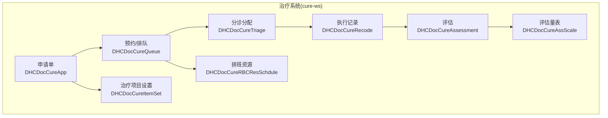

**图表来源**
- [DHCDocCureApp.cls:1-439](file://src/backend/cure-ws/User/DHCDocCureApp.cls#L1-L439)
- [DHCDocCureQueue.cls:1-320](file://src/backend/cure-ws/User/DHCDocCureQueue.cls#L1-L320)
- [DHCDocCureTriage.cls:1-181](file://src/backend/cure-ws/User/DHCDocCureTriage.cls#L1-L181)
- [DHCDocCureRecode.cls:1-365](file://src/backend/cure-ws/User/DHCDocCureRecode.cls#L1-L365)
- [DHCDocCureAssessment.cls:1-164](file://src/backend/cure-ws/User/DHCDocCureAssessment.cls#L1-L164)
- [DHCDocCureRBCResSchdule.cls:1-414](file://src/backend/cure-ws/User/DHCDocCureRBCResSchdule.cls#L1-L414)
- [DHCDocCureItemSet.cls:1-252](file://src/backend/cure-ws/User/DHCDocCureItemSet.cls#L1-L252)
- [DHCDocCureAssScale.cls:1-96](file://src/backend/cure-ws/User/DHCDocCureAssScale.cls#L1-L96)

**章节来源**
- [README.md:1-549](file://README.md#L1-L549)

## 核心组件
- 治疗申请单（DHCDocCureApp）：承载患者、医嘱关联、治疗方案、状态机（申请/取消/完成/已分配）、来源入口（医嘱录入/菜单）、部位图片与备注、呼叫锁定等。
- 预约与队列（DHCDocCureQueue）：维护预约日期/时间、科室、患者、排队序号、呼叫状态、服务组、时间段占用等，并在插入/更新时触发分配逻辑。
- 分诊与分配（DHCDocCureTriage）：将申请单分配到具体资源，记录分诊/接收/取消状态及操作人时间。
- 执行与记录（DHCDocCureRecode）：记录每次治疗的标题、内容、反应、效果、起止时间、模板ID、JSON扩展、执行批次号、外部执行号、关联队列等。
- 评估（DHCDocCureAssessment）：与治疗申请单关联，支持暂存/提交、有效/无效、关联执行记录、模板ID与数据源类型（BL/ASS/NUR/CDSS）。
- 资源与排班（DHCDocCureRBCResSchdule）：定义资源计划、科室、资源、时段、最大预约数、自动预约数、截止缴费/预约时间、是否分时段及间隔、预留号等。
- 治疗项目设置（DHCDocCureItemSet）：绑定治疗项目与服务组、控制自动预约/直接执行开关、适应症/禁忌、关联评估/记录模板、院区等。
- 评估量表（DHCDocCureAssScale）：定义量表代码、描述、表单HTML/流、分类、激活标志、是否计分等。

**章节来源**
- [DHCDocCureApp.cls:1-439](file://src/backend/cure-ws/User/DHCDocCureApp.cls#L1-L439)
- [DHCDocCureQueue.cls:1-320](file://src/backend/cure-ws/User/DHCDocCureQueue.cls#L1-L320)
- [DHCDocCureTriage.cls:1-181](file://src/backend/cure-ws/User/DHCDocCureTriage.cls#L1-L181)
- [DHCDocCureRecode.cls:1-365](file://src/backend/cure-ws/User/DHCDocCureRecode.cls#L1-L365)
- [DHCDocCureAssessment.cls:1-164](file://src/backend/cure-ws/User/DHCDocCureAssessment.cls#L1-L164)
- [DHCDocCureRBCResSchdule.cls:1-414](file://src/backend/cure-ws/User/DHCDocCureRBCResSchdule.cls#L1-L414)
- [DHCDocCureItemSet.cls:1-252](file://src/backend/cure-ws/User/DHCDocCureItemSet.cls#L1-L252)
- [DHCDocCureAssScale.cls:1-96](file://src/backend/cure-ws/User/DHCDocCureAssScale.cls#L1-L96)

## 架构总览
治疗系统以“申请单”为业务主键，贯穿“申请—预约—分诊—执行—记录—评估”全链路。排班资源作为供给侧，驱动预约与队列生成；项目设置决定可预约性与执行策略；评估量表支撑疗效评价。

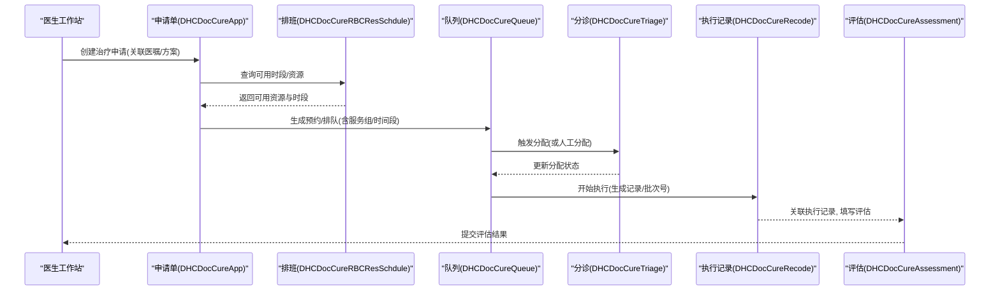

**图表来源**
- [DHCDocCureApp.cls:1-439](file://src/backend/cure-ws/User/DHCDocCureApp.cls#L1-L439)
- [DHCDocCureRBCResSchdule.cls:1-414](file://src/backend/cure-ws/User/DHCDocCureRBCResSchdule.cls#L1-L414)
- [DHCDocCureQueue.cls:1-320](file://src/backend/cure-ws/User/DHCDocCureQueue.cls#L1-L320)
- [DHCDocCureTriage.cls:1-181](file://src/backend/cure-ws/User/DHCDocCureTriage.cls#L1-L181)
- [DHCDocCureRecode.cls:1-365](file://src/backend/cure-ws/User/DHCDocCureRecode.cls#L1-L365)
- [DHCDocCureAssessment.cls:1-164](file://src/backend/cure-ws/User/DHCDocCureAssessment.cls#L1-L164)

## 详细组件分析

### 治疗申请单（DHCDocCureApp）
- 职责：承载治疗申请的核心信息，包括就诊指针、医嘱关联、治疗方案、状态机（申请/取消/完成/已分配）、申请人/更新时间、备注、是否直接执行/预约直接执行、部位图片与备注、呼叫锁定、治疗科室、来源入口等。
- 关键索引：按就诊、申请单号、申请日期、是否直接执行、呼叫状态、医嘱项、患者主索引、治疗科室+日期、状态等多维索引，便于检索与统计。
- 关系：一对多关联到预约到达、分诊、执行记录、执行变更、治疗项目明细、医嘱、评估等。

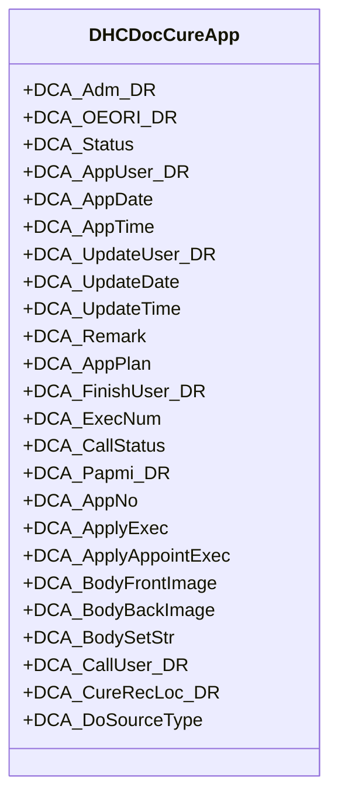

**图表来源**
- [DHCDocCureApp.cls:1-439](file://src/backend/cure-ws/User/DHCDocCureApp.cls#L1-L439)

**章节来源**
- [DHCDocCureApp.cls:1-439](file://src/backend/cure-ws/User/DHCDocCureApp.cls#L1-L439)

### 预约与队列（DHCDocCureQueue）
- 职责：维护预约日期/时间、患者姓名、排队序号、科室、状态、最后状态变更时间与人员、患者主索引、关联申请、报告号、呼叫状态/用户、请求来源（手工/接口/长期任务）、时间段占用、设备指定治疗师、服务组等。
- 触发器：插入/更新后调用分配逻辑，驱动后续分诊与资源占用。
- 索引：按日期+科室、日期+患者、患者、排班、排班+序号等多维索引优化查询。

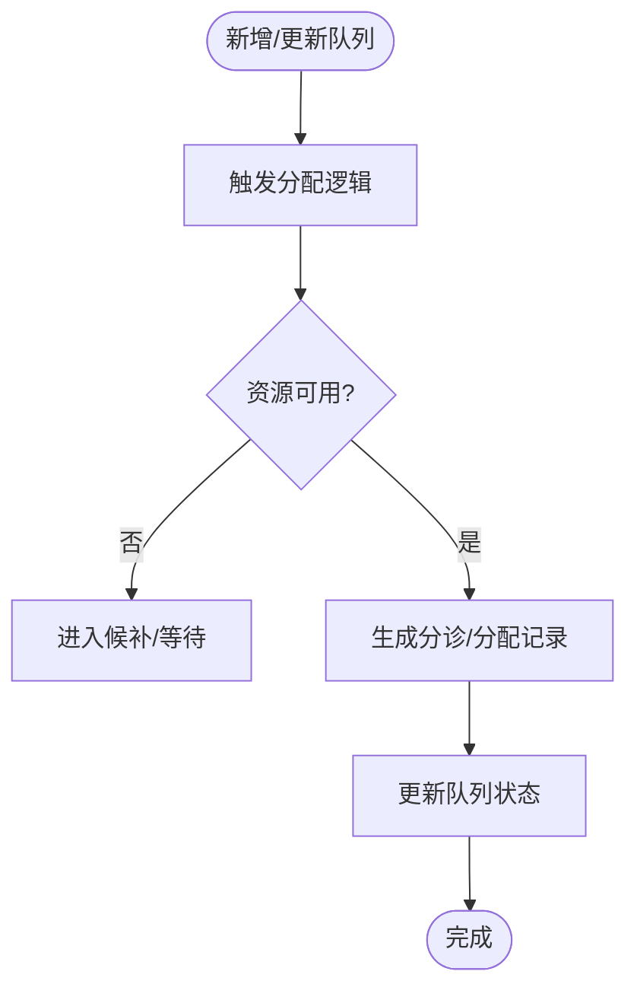

**图表来源**
- [DHCDocCureQueue.cls:1-320](file://src/backend/cure-ws/User/DHCDocCureQueue.cls#L1-L320)

**章节来源**
- [DHCDocCureQueue.cls:1-320](file://src/backend/cure-ws/User/DHCDocCureQueue.cls#L1-L320)

### 分诊与分配（DHCDocCureTriage）
- 职责：将申请单分配到具体资源，记录分诊人/时间、状态（已分配/已接收/取消）、取消与接收操作人及时间。
- 关系：父级为申请单，子级可关联资源分配。

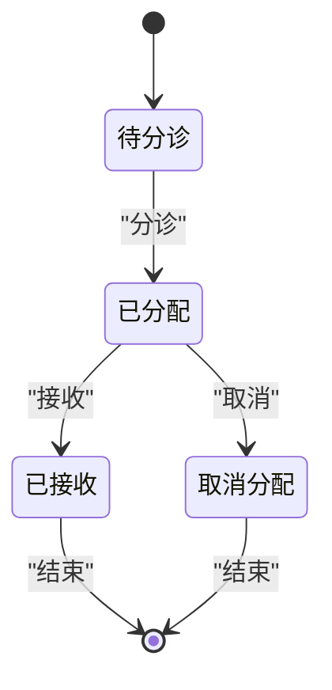

**图表来源**
- [DHCDocCureTriage.cls:1-181](file://src/backend/cure-ws/User/DHCDocCureTriage.cls#L1-L181)

**章节来源**
- [DHCDocCureTriage.cls:1-181](file://src/backend/cure-ws/User/DHCDocCureTriage.cls#L1-L181)

### 执行与记录（DHCDocCureRecode）
- 职责：记录每次治疗的标题、内容、反应、效果、起止时间、模板ID、JSON扩展、关联部位/穴位、复核人工号、执行日期/时间（与执行记录一致）、关联队列（用于统计）、执行批次号、外部执行号、结束人等。
- 关系：父级为申请单，子级可关联变更记录与图片。

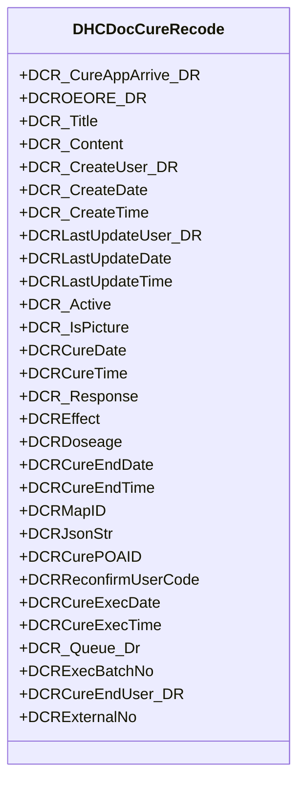

**图表来源**
- [DHCDocCureRecode.cls:1-365](file://src/backend/cure-ws/User/DHCDocCureRecode.cls#L1-L365)

**章节来源**
- [DHCDocCureRecode.cls:1-365](file://src/backend/cure-ws/User/DHCDocCureRecode.cls#L1-L365)

### 评估（DHCDocCureAssessment）
- 职责：与治疗申请单关联，记录评估内容、创建/更新时间与人员、提交状态（暂存/提交）、有效状态、关联执行记录、JSON内容、模板ID与数据源类型（BL/ASS/NUR/CDSS）。
- 索引：按执行记录建立索引，便于回溯评估与执行的对应关系。

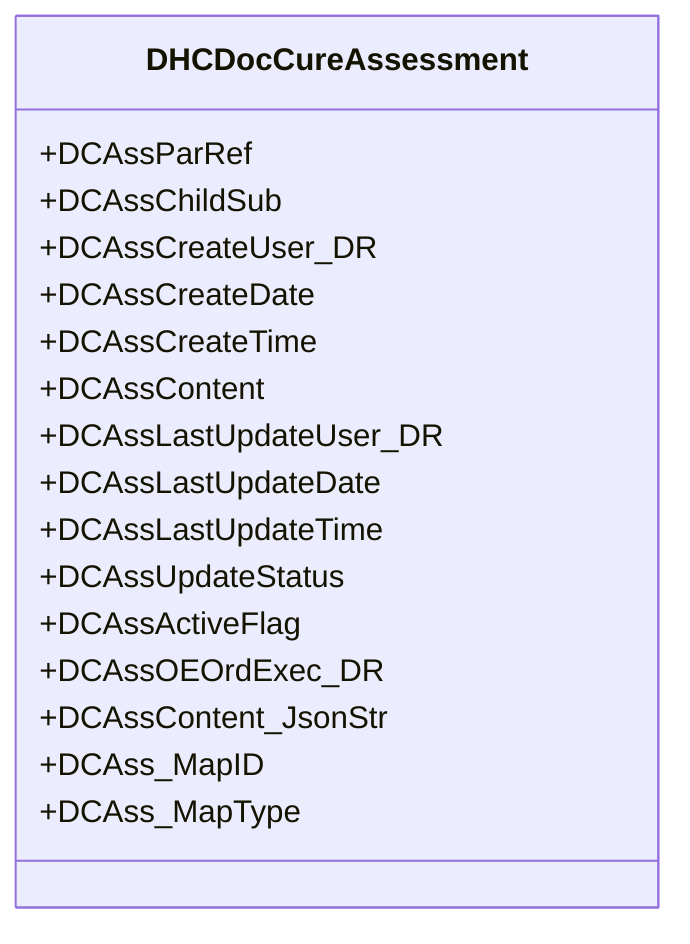

**图表来源**
- [DHCDocCureAssessment.cls:1-164](file://src/backend/cure-ws/User/DHCDocCureAssessment.cls#L1-L164)

**章节来源**
- [DHCDocCureAssessment.cls:1-164](file://src/backend/cure-ws/User/DHCDocCureAssessment.cls#L1-L164)

### 资源与排班（DHCDocCureRBCResSchdule）
- 职责：定义资源计划、科室、资源、日期、时段、开始/结束时间、服务组、状态、最大预约数、自动预约数、截止缴费/预约时间、允许病人类型、自动预约开关、序列号串、是否分时段及间隔、预留号、登记号串/信息等。
- 索引：按日期、服务组+资源、科室+日期+资源、资源计划、服务组+日期、服务组+时间等多维索引，提升排班与预约查询效率。

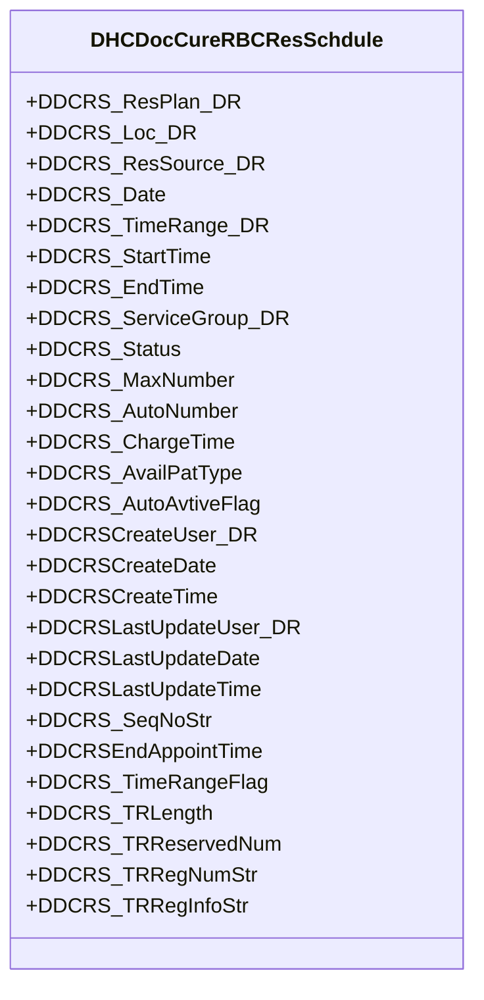

**图表来源**
- [DHCDocCureRBCResSchdule.cls:1-414](file://src/backend/cure-ws/User/DHCDocCureRBCResSchdule.cls#L1-L414)

**章节来源**
- [DHCDocCureRBCResSchdule.cls:1-414](file://src/backend/cure-ws/User/DHCDocCureRBCResSchdule.cls#L1-L414)

### 治疗项目设置（DHCDocCureItemSet）
- 职责：绑定治疗项目与服务组，控制自动预约/手动申请/门诊或住院直接执行、激活状态、院区、关联评估/记录模板、突出颜色、使用时长、更新日期/时间等。
- 索引：按院区+项目、项目、关联评估模板、更新日期等索引，便于配置检索与生效范围控制。

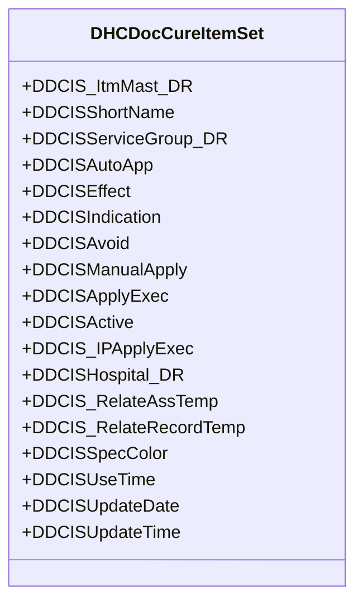

**图表来源**
- [DHCDocCureItemSet.cls:1-252](file://src/backend/cure-ws/User/DHCDocCureItemSet.cls#L1-L252)

**章节来源**
- [DHCDocCureItemSet.cls:1-252](file://src/backend/cure-ws/User/DHCDocCureItemSet.cls#L1-L252)

### 评估量表（DHCDocCureAssScale）
- 职责：定义量表代码、描述、表单HTML/流、分类、加锁标志、医院、激活标志、是否计分等。
- 索引：按代码、描述、分类、医院+代码、医院+描述等索引，便于量表管理与加载。

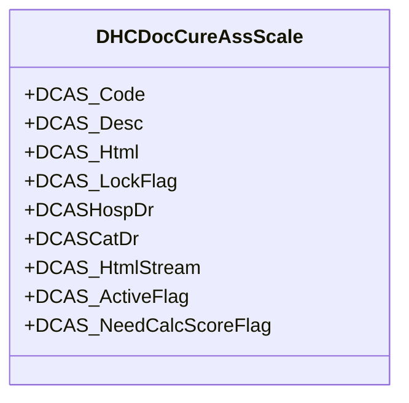

**图表来源**
- [DHCDocCureAssScale.cls:1-96](file://src/backend/cure-ws/User/DHCDocCureAssScale.cls#L1-L96)

**章节来源**
- [DHCDocCureAssScale.cls:1-96](file://src/backend/cure-ws/User/DHCDocCureAssScale.cls#L1-L96)

## 依赖关系分析
- 申请单依赖项目设置决定可预约与执行策略；依赖排班获取可用资源与时段。
- 队列依赖排班与服务组，驱动分诊与资源占用。
- 分诊依赖队列与资源，产出分配结果。
- 执行记录依赖队列与申请单，形成执行轨迹与统计基础。
- 评估依赖申请单与执行记录，形成疗效评价闭环。

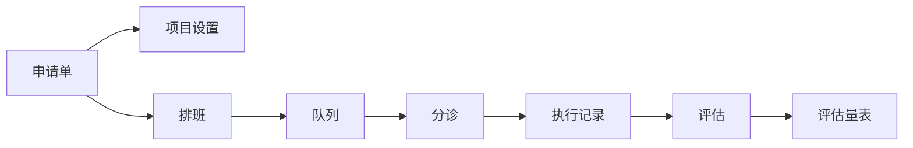

**图表来源**
- [DHCDocCureApp.cls:1-439](file://src/backend/cure-ws/User/DHCDocCureApp.cls#L1-L439)
- [DHCDocCureItemSet.cls:1-252](file://src/backend/cure-ws/User/DHCDocCureItemSet.cls#L1-L252)
- [DHCDocCureRBCResSchdule.cls:1-414](file://src/backend/cure-ws/User/DHCDocCureRBCResSchdule.cls#L1-L414)
- [DHCDocCureQueue.cls:1-320](file://src/backend/cure-ws/User/DHCDocCureQueue.cls#L1-L320)
- [DHCDocCureTriage.cls:1-181](file://src/backend/cure-ws/User/DHCDocCureTriage.cls#L1-L181)
- [DHCDocCureRecode.cls:1-365](file://src/backend/cure-ws/User/DHCDocCureRecode.cls#L1-L365)
- [DHCDocCureAssessment.cls:1-164](file://src/backend/cure-ws/User/DHCDocCureAssessment.cls#L1-L164)
- [DHCDocCureAssScale.cls:1-96](file://src/backend/cure-ws/User/DHCDocCureAssScale.cls#L1-L96)

**章节来源**
- [DHCDocCureApp.cls:1-439](file://src/backend/cure-ws/User/DHCDocCureApp.cls#L1-L439)
- [DHCDocCureQueue.cls:1-320](file://src/backend/cure-ws/User/DHCDocCureQueue.cls#L1-L320)
- [DHCDocCureTriage.cls:1-181](file://src/backend/cure-ws/User/DHCDocCureTriage.cls#L1-L181)
- [DHCDocCureRecode.cls:1-365](file://src/backend/cure-ws/User/DHCDocCureRecode.cls#L1-L365)
- [DHCDocCureAssessment.cls:1-164](file://src/backend/cure-ws/User/DHCDocCureAssessment.cls#L1-L164)
- [DHCDocCureRBCResSchdule.cls:1-414](file://src/backend/cure-ws/User/DHCDocCureRBCResSchdule.cls#L1-L414)
- [DHCDocCureItemSet.cls:1-252](file://src/backend/cure-ws/User/DHCDocCureItemSet.cls#L1-L252)
- [DHCDocCureAssScale.cls:1-96](file://src/backend/cure-ws/User/DHCDocCureAssScale.cls#L1-L96)

## 性能与扩展性
- 索引设计：各实体均提供多维度索引（如申请单按就诊/申请单号/日期/状态/科室；队列按日期+科室/患者；排班按日期/服务组+资源/科室+日期+资源），显著提升查询与统计性能。
- 存储策略：对象持久化配合SQL映射，兼顾事务与报表查询；大字段（如JSON/HTML/图片）采用流式存储，避免行膨胀。
- 触发器与回调：队列在插入/更新时触发分配逻辑，保证资源占用与状态一致性。
- 可扩展点：
  - 项目设置中的“自动预约/直接执行”开关，便于不同场景灵活控制。
  - 评估模板与量表解耦，支持多数据源（BL/ASS/NUR/CDSS）接入。
  - 队列与服务组绑定，支持按服务组维度进行排班与统计。

[本节为通用性能讨论，不直接分析具体文件]

## 故障排查指南
- 队列未生成或无法分配：检查排班是否启用、资源是否可用、服务组是否正确绑定；查看队列插入/更新触发器是否被调用。
- 分诊状态异常：核对分诊状态流转（已分配/已接收/取消）与操作人时间戳；确认资源释放逻辑。
- 执行记录缺失：核对执行批次号、外部执行号、关联队列与申请单；检查JSON扩展与模板ID是否完整。
- 评估未提交或无效：检查评估提交状态与有效标志；确认模板ID与数据源类型匹配。
- 性能问题：定位慢查询，优先检查索引命中情况；对高频条件（如日期+科室/患者）确保有复合索引。

**章节来源**
- [DHCDocCureQueue.cls:83-101](file://src/backend/cure-ws/User/DHCDocCureQueue.cls#L83-L101)
- [DHCDocCureTriage.cls:1-181](file://src/backend/cure-ws/User/DHCDocCureTriage.cls#L1-L181)
- [DHCDocCureRecode.cls:1-365](file://src/backend/cure-ws/User/DHCDocCureRecode.cls#L1-L365)
- [DHCDocCureAssessment.cls:1-164](file://src/backend/cure-ws/User/DHCDocCureAssessment.cls#L1-L164)

## 结论
治疗系统以申请单为核心，结合排班与队列实现资源调度，通过分诊与执行记录形成闭环，并以评估量表完成疗效评价。系统通过多维索引、触发器与模板化配置，兼顾了灵活性、可拓展性与性能。与医生工作站的集成体现在申请单与医嘱的关联、执行记录的追溯以及评估数据的回写。

[本节为总结性内容，不直接分析具体文件]

## 附录：业务流程与数据模型

### 治疗业务流程图
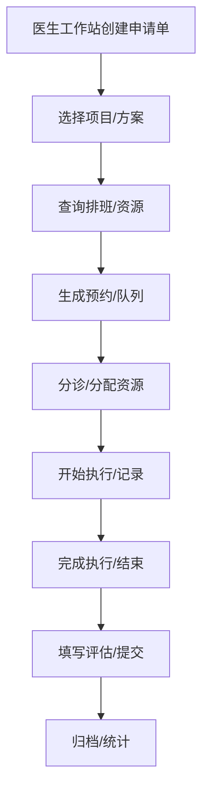

[该图为概念流程示意，不直接映射具体文件]

### 状态转换图（申请单）
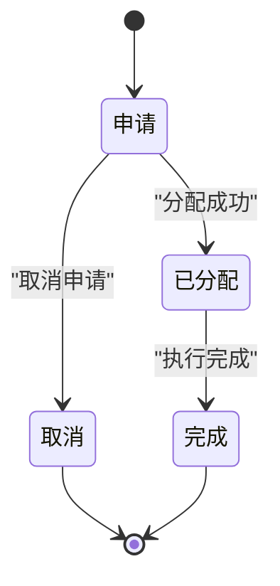

**图表来源**
- [DHCDocCureApp.cls:27-28](file://src/backend/cure-ws/User/DHCDocCureApp.cls#L27-L28)

### 数据库关系图（ER）
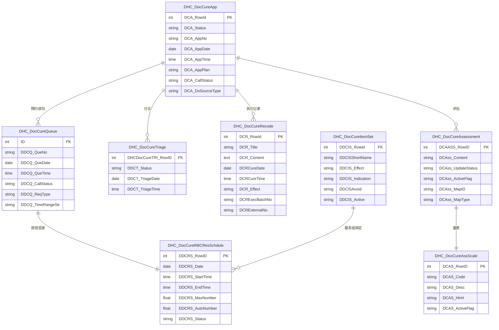

**图表来源**
- [DHCDocCureApp.cls:1-439](file://src/backend/cure-ws/User/DHCDocCureApp.cls#L1-L439)
- [DHCDocCureQueue.cls:1-320](file://src/backend/cure-ws/User/DHCDocCureQueue.cls#L1-L320)
- [DHCDocCureTriage.cls:1-181](file://src/backend/cure-ws/User/DHCDocCureTriage.cls#L1-L181)
- [DHCDocCureRecode.cls:1-365](file://src/backend/cure-ws/User/DHCDocCureRecode.cls#L1-L365)
- [DHCDocCureAssessment.cls:1-164](file://src/backend/cure-ws/User/DHCDocCureAssessment.cls#L1-L164)
- [DHCDocCureRBCResSchdule.cls:1-414](file://src/backend/cure-ws/User/DHCDocCureRBCResSchdule.cls#L1-L414)
- [DHCDocCureItemSet.cls:1-252](file://src/backend/cure-ws/User/DHCDocCureItemSet.cls#L1-L252)
- [DHCDocCureAssScale.cls:1-96](file://src/backend/cure-ws/User/DHCDocCureAssScale.cls#L1-L96)

### 治疗业务对象模型与使用示例
- 申请单：创建时携带患者、医嘱、治疗方案；根据项目设置决定是否自动预约或直接执行；状态机驱动后续流程。
- 排班：维护资源可用时段与容量；支持分时段、预留号、截止缴费/预约时间控制。
- 队列：生成排队序号与时间段占用；触发分配逻辑，进入分诊。
- 分诊：将申请单分配至具体资源，记录状态与操作人时间。
- 执行记录：记录治疗过程、反应、效果、起止时间、模板与JSON扩展；支持批次号与外部执行号对接。
- 评估：基于模板与量表，关联执行记录，支持暂存/提交与有效性控制。

使用示例（概念性）：
- 医生在医生工作站创建治疗申请，系统根据项目设置与排班生成预约队列。
- 分诊台完成资源分配，患者进入队列等待。
- 治疗师开始执行，生成执行记录并填写内容与效果。
- 完成后进行评估，提交结果并归档。

[本节为概念性说明，不直接分析具体文件]