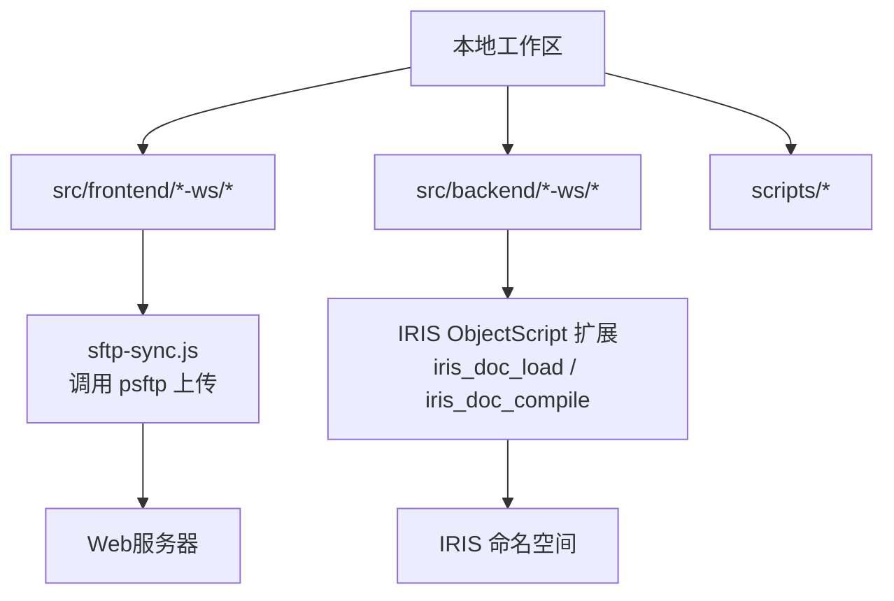
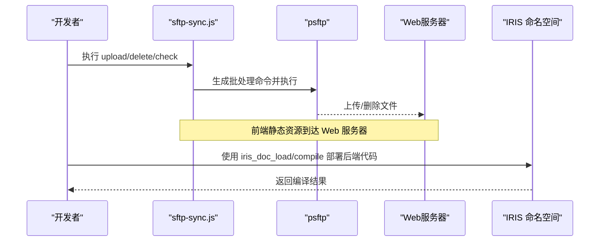
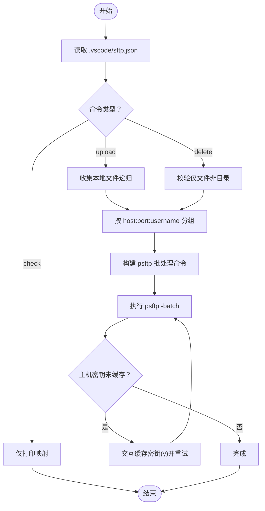
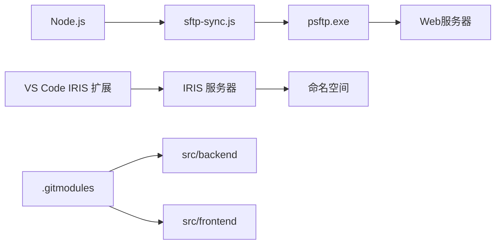

# 部署流程

<cite>
**本文引用的文件**
- [README.md](file://README.md)
- [AGENTS.md](file://AGENTS.md)
- [.gitmodules](file://.gitmodules)
- [sftp-sync.js](file://scripts/sftp-sync.js)
- [DHCDocConfig.mac](file://src/backend/public-mc/DHCDocConfig.mac)
</cite>

## 目录
1. [简介](#简介)
2. [项目结构](#项目结构)
3. [核心组件](#核心组件)
4. [架构总览](#架构总览)
5. [详细组件分析](#详细组件分析)
6. [依赖关系分析](#依赖关系分析)
7. [性能考虑](#性能考虑)
8. [故障排查指南](#故障排查指南)
9. [结论](#结论)
10. [附录](#附录)

## 简介
本文件面向IRIS HIS系统的生产环境部署，聚焦以下目标：
- 前端文件通过SFTP同步到Web服务器的完整流程（配置、映射规则、批量上传与删除）
- 后端ObjectScript代码的编译与部署机制（含CSP文件的特殊处理要求）
- 生产环境部署步骤、版本管理策略与回滚方案
- 完整的部署检查清单与验证方法

## 项目结构
仓库采用“根仓库 + Git子模块”的双仓库模式：
- 根仓库：管理与脚本（如SFTP同步、Git多仓库操作等）
- src/backend：所有后端ObjectScript代码（.cls/.mac），通过IRIS ObjectScript扩展直接编译上传至IRIS命名空间，不走SFTP
- src/frontend：所有前端资源（CSP/JS/CSS/图片），通过psftp命令统一上传到Web服务器指定路径

图示来源
- [README.md:6-51](file://README.md#L6-L51)
- [AGENTS.md:44-61](file://AGENTS.md#L44-L61)
- [sftp-sync.js:1-25](file://scripts/sftp-sync.js#L1-L25)

章节来源
- [README.md:6-51](file://README.md#L6-L51)
- [AGENTS.md:44-61](file://AGENTS.md#L44-L61)
- [.gitmodules:1-7](file://.gitmodules#L1-L7)

## 核心组件
- 前端SFTP同步脚本：scripts/sftp-sync.js，负责读取连接信息、解析本地→远程映射、批量上传/删除、CSP编译提示
- IRIS MCP工具：用于后端代码批量加载与编译（iris_doc_load、iris_doc_compile）
- VS Code配置模板：.vscode/settings.json.template、.vscode/sftp.json.template，提供连接与导出参数模板
- 公共配置宏：src/backend/public-mc/DHCDocConfig.mac，提供配置读写能力（部署中常用于配置项维护）

章节来源
- [sftp-sync.js:1-25](file://scripts/sftp-sync.js#L1-L25)
- [AGENTS.md:44-61](file://AGENTS.md#L44-L61)
- [README.md:98-206](file://README.md#L98-L206)
- [DHCDocConfig.mac:1-119](file://src/backend/public-mc/DHCDocConfig.mac#L1-L119)

## 架构总览
前后端分离部署，关键交互如下：
- 前端：本地修改 → sftp-sync.js 通过 psftp 上传到 Web 服务器静态目录 → 浏览器访问时由IRIS Web服务提供页面
- 后端：本地修改 → IRIS ObjectScript 扩展将 .cls/.mac 编译并部署到IRIS命名空间 → 业务逻辑生效
- CSP页面：上传后需单独执行编译，否则不会生效

图示来源
- [sftp-sync.js:111-164](file://scripts/sftp-sync.js#L111-L164)
- [AGENTS.md:44-61](file://AGENTS.md#L44-L61)
- [README.md:256-277](file://README.md#L256-L277)

## 详细组件分析

### 前端SFTP同步脚本（sftp-sync.js）
职责与行为：
- 从 .vscode/sftp.json 读取多个通道配置（host/port/username/password/remotePath/context）
- 根据本地路径匹配最合适的 context（最长前缀匹配），计算远程路径
- 支持三种命令：
  - upload：递归收集目录文件，按连接分组，批量 put 上传
  - delete：仅支持文件删除（不支持目录），批量 rm 删除
  - check：打印本地→远程映射，不执行任何操作
- 自动处理首次连接主机密钥缓存问题（交互式应答 y 后重试）
- 对上传的 .csp 文件，输出对应的 iris_doc_compile 编译命令提示

图示来源
- [sftp-sync.js:53-95](file://scripts/sftp-sync.js#L53-L95)
- [sftp-sync.js:111-164](file://scripts/sftp-sync.js#L111-L164)
- [sftp-sync.js:181-227](file://scripts/sftp-sync.js#L181-L227)
- [sftp-sync.js:229-258](file://scripts/sftp-sync.js#L229-L258)
- [sftp-sync.js:260-270](file://scripts/sftp-sync.js#L260-L270)

章节来源
- [sftp-sync.js:1-291](file://scripts/sftp-sync.js#L1-L291)

### 后端ObjectScript编译与部署
[REDACTED: environment-specific example]
[REDACTED: environment-specific example]
- 路径映射关键点：
  - 必须使用绝对路径并在包根目录名中插入通配符（例如 D*oc），确保文档名包含完整包前缀（如 DHCDoc.Order.BLL.V9.Web.cls）
  - 若路径不含元字符或基准目录错误，会导致文档名退化为纯文件名，引发HTTP 405等错误
[REDACTED: environment-specific example]

章节来源
- [AGENTS.md:44-61](file://AGENTS.md#L44-L61)
- [AGENTS.md:187-209](file://AGENTS.md#L187-L209)
- [README.md:256-277](file://README.md#L256-L277)

### CSP文件特殊处理
- 上传后必须编译：.csp 文件通过 psftp 上传后，需要调用 iris_doc_compile(doc="/imedical/web/csp/xxx.csp") 才能生效
- 脚本会自动检测上传的 .csp 并输出对应编译命令提示
- .js/.css 无需编译，直接生效

章节来源
- [README.md:256-268](file://README.md#L256-L268)
- [sftp-sync.js:218-227](file://scripts/sftp-sync.js#L218-L227)
- [AGENTS.md:187-209](file://AGENTS.md#L187-L209)

### 配置文件与映射规则
- SFTP连接信息：位于 .vscode/sftp.json（从模板复制并填写密码）
- 映射规则：
  - 本地 src/frontend/<产品目录>/ 下的相对路径 → 远程 <remote-path> 下相同相对路径
  - 示例：src\frontend\doc-ws\scripts\dhcdoc\diagnos\v9\entry.page.js → <remote-path>
- 后端导出设置：.vscode/settings.json 中的 objectscript.export 配置导出路径与命名空间

章节来源
- [README.md:37-51](file://README.md#L37-L51)
- [README.md:98-206](file://README.md#L98-L206)
- [sftp-sync.js:6-24](file://scripts/sftp-sync.js#L6-L24)

## 依赖关系分析
- 前端部署依赖：
  - Node.js 运行环境（执行 sftp-sync.js）
  - PuTTY 的 psftp 可执行文件（加入系统PATH）
  - .vscode/sftp.json 连接配置
- 后端部署依赖：
  - IRIS ObjectScript 扩展（MCP工具）
  - IRIS 服务器可达（HTTPS端口）
  - 命名空间 <namespace> 权限
- 子模块依赖：
  - src/backend 与 src/frontend 作为独立Git子模块，需在各自目录内执行Git操作

图示来源
- [sftp-sync.js:111-164](file://scripts/sftp-sync.js#L111-L164)
- [AGENTS.md:44-61](file://AGENTS.md#L44-L61)
- [.gitmodules:1-7](file://.gitmodules#L1-L7)

章节来源
- [sftp-sync.js:111-164](file://scripts/sftp-sync.js#L111-L164)
- [AGENTS.md:44-61](file://AGENTS.md#L44-L61)
- [.gitmodules:1-7](file://.gitmodules#L1-L7)

## 性能考虑
- 批量上传优化：sftp-sync.js 按连接信息分组，同一会话内批量执行，减少连接开销
- 首次连接密钥缓存：自动探测并缓存主机密钥，避免后续交互阻塞
- 后端批量编译：iris_doc_load 支持通配符批量加载与编译，提升效率
- 建议：
  - 尽量合并变更批次，减少多次上传/编译
  - 大目录上传时先使用 check 命令预览映射，确认无误再执行 upload
  - 后端编译前确保路径映射正确，避免重复失败

[本节为通用指导，无需特定文件引用]

## 故障排查指南
常见问题与解决：
- 主机密钥未缓存：首次连接提示失败，脚本会尝试交互缓存；若失败，手动执行 echo y | psftp -P <端口> <用户名>@<主机>
- psftp 启动失败：确认已安装 PuTTY 并加入系统PATH
- CSP编译失败：上传后未执行编译，需调用 iris_doc_compile(doc="/imedical/web/csp/xxx.csp")
- 后端加载失败（total=0或HTTP 405）：路径缺少通配符或基准目录错误，需在包根目录名中插入通配符（如 D*oc）
- 中文乱码：确保前端文件以UTF-8编码保存

章节来源
- [sftp-sync.js:111-164](file://scripts/sftp-sync.js#L111-L164)
- [AGENTS.md:291-299](file://AGENTS.md#L291-L299)
- [README.md:256-277](file://README.md#L256-L277)

## 结论
本部署流程通过标准化脚本与工具链，实现了前后端代码的高效同步与编译：
- 前端：基于 sftp-sync.js 的批量上传与删除，配合CSP编译提示，确保页面及时生效
- 后端：通过IRIS ObjectScript扩展的批量加载与编译，保证业务逻辑快速更新
- 生产环境：建议结合版本控制（Git标签/分支）、自动化脚本与回滚预案，确保部署安全可控

[本节为总结性内容，无需特定文件引用]

## 附录

### 生产环境部署步骤
1. 准备阶段
   - 确认 .vscode/sftp.json 与 .vscode/settings.json 配置正确
   - 验证网络连接（Web服务器与IRIS服务器）
2. 前端部署
   - 使用 node scripts/sftp-sync.js upload <文件或目录> 上传
   - 对 .csp 文件执行 iris_doc_compile(doc="/imedical/web/csp/xxx.csp")
3. 后端部署
[REDACTED: environment-specific example]
   - 必要时使用 iris_doc_compile 单独编译
4. 验证阶段
   - 访问前端页面确认功能正常
   - 调用后端接口验证业务逻辑

章节来源
- [README.md:98-206](file://README.md#L98-L206)
- [README.md:256-277](file://README.md#L256-L277)
- [AGENTS.md:44-61](file://AGENTS.md#L44-L61)

### 版本管理策略
- 分支策略：dev → test → release/* → main
- 提交规范：在对应子模块目录内执行Git操作，遵循提交日志格式
- 提测流程：使用 git-batch-mr.js 创建MR，支持冲突检测与自动创建

章节来源
- [AGENTS.md:225-232](file://AGENTS.md#L225-L232)
- [README.md:279-300](file://README.md#L279-L300)

### 回滚方案
- 前端回滚：通过Git切换至稳定版本的前端代码，重新执行上传
- 后端回滚：通过Git切换至稳定版本的ObjectScript代码，重新执行批量加载与编译
- 数据回滚：谨慎操作，建议通过数据库备份恢复

[本节为通用指导，无需特定文件引用]

### 部署检查清单
- 配置文件
  - [ ] .vscode/sftp.json 存在且配置正确
  - [ ] .vscode/settings.json 中IRIS连接信息正确
- 环境依赖
  - [ ] Node.js 可用
  - [ ] Psftp 可执行且在PATH中
  - [ ] IRIS服务器可达
- 前端部署
  - [ ] 使用 sftp-sync.js 上传成功
  - [ ] CSP文件已编译
- 后端部署
  - [ ] 使用 iris_doc_load 批量加载成功
  - [ ] 必要时代码已单独编译
- 验证测试
  - [ ] 前端页面访问正常
  - [ ] 后端接口调用正常

[本节为通用检查清单，无需特定文件引用]

### 验证方法
- 前端验证：
  - 访问相关页面，检查UI显示与交互
  - 查看浏览器控制台是否有错误
- 后端验证：
  - 调用关键接口，检查返回数据
  - 查看IRIS日志确认无异常
- 配置验证：
  - 使用 DHCDocConfig.mac 中的配置读取方法验证配置项

章节来源
- [DHCDocConfig.mac:1-119](file://src/backend/public-mc/DHCDocConfig.mac#L1-L119)