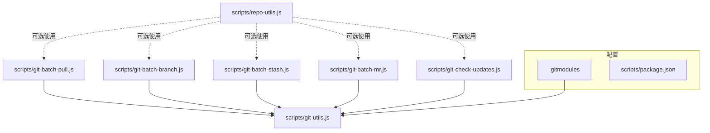
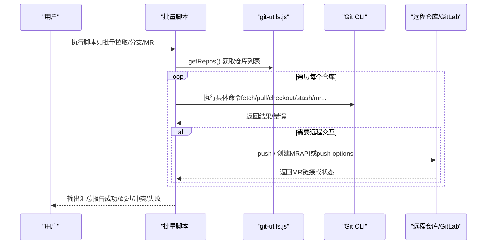
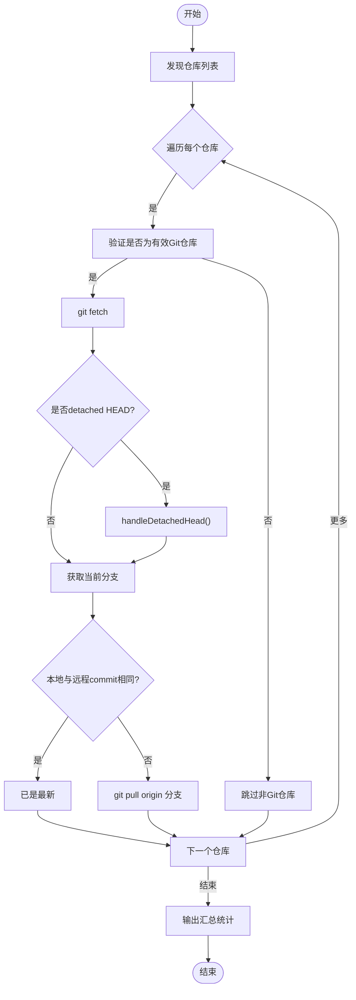
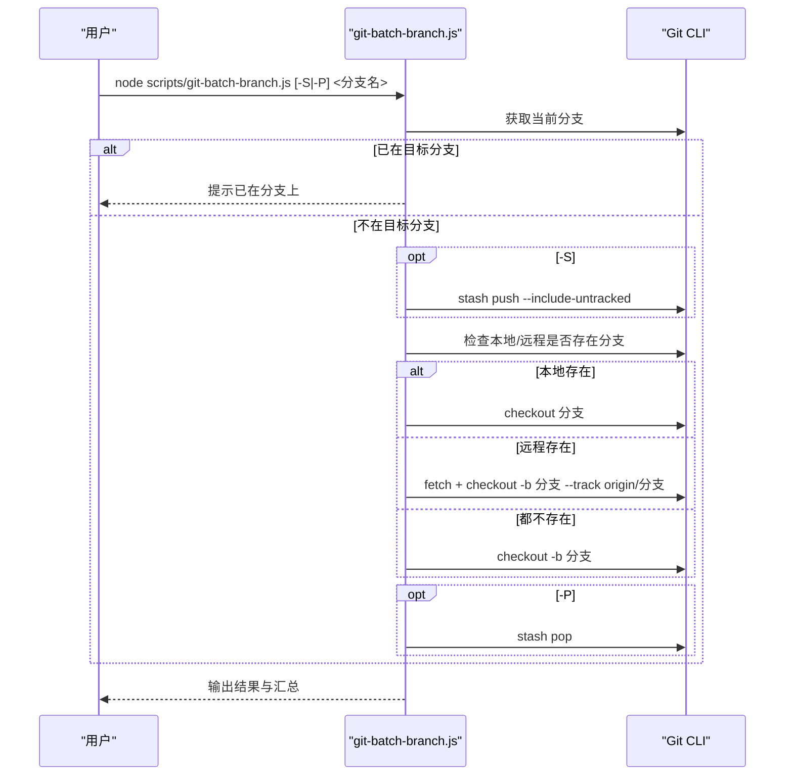
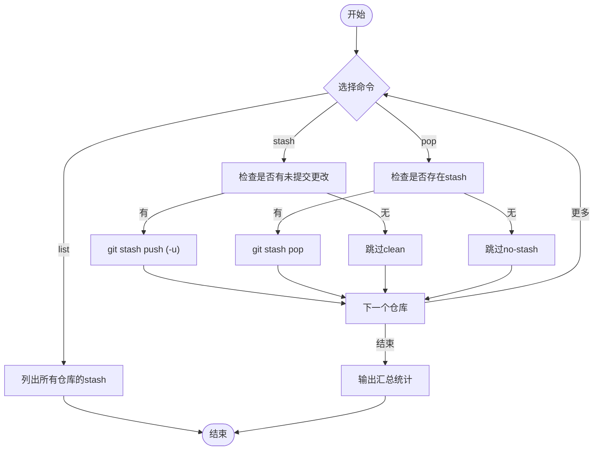
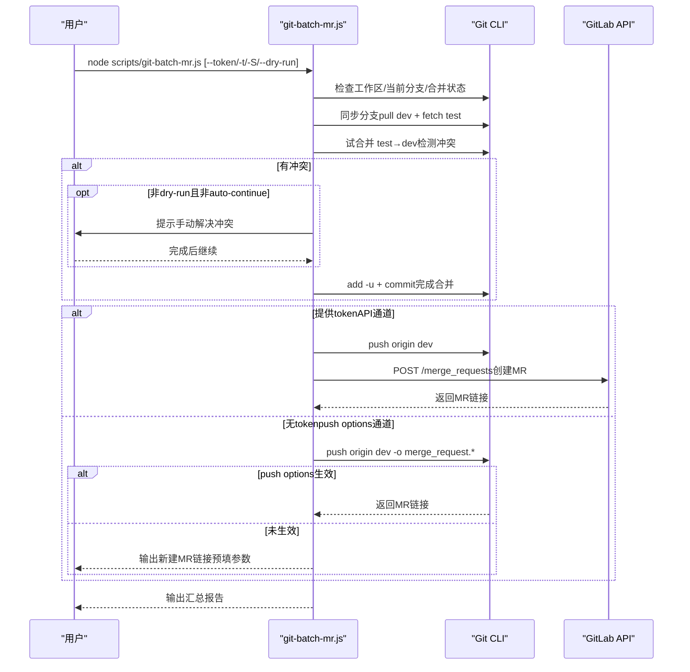
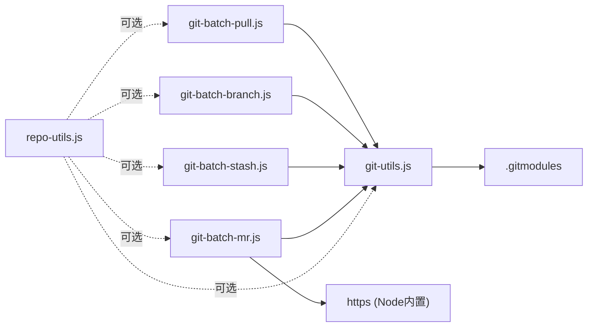

# Git管理脚本

<cite>
**本文引用的文件**
- [git-batch-pull.js](file://scripts/git-batch-pull.js)
- [git-batch-branch.js](file://scripts/git-batch-branch.js)
- [git-batch-stash.js](file://scripts/git-batch-stash.js)
- [git-batch-mr.js](file://scripts/git-batch-mr.js)
- [git-check-updates.js](file://scripts/git-check-updates.js)
- [git-utils.js](file://scripts/git-utils.js)
- [repo-utils.js](file://scripts/repo-utils.js)
- [.gitmodules](file://.gitmodules)
- [package.json](file://scripts/package.json)
</cite>

## 更新摘要
**所做更改**
- 更新了MR创建脚本的冲突检测和双通道MR创建功能
- 增强了分支管理脚本的stash集成能力
- 改进了错误处理和用户交互流程
- 添加了更详细的操作日志和状态报告

## 目录
1. [简介](#简介)
2. [项目结构](#项目结构)
3. [核心组件](#核心组件)
4. [架构总览](#架构总览)
5. [详细组件分析](#详细组件分析)
6. [依赖关系分析](#依赖关系分析)
7. [性能与可靠性](#性能与可靠性)
8. [故障排除指南](#故障排除指南)
9. [结论](#结论)
10. [附录：常用命令速查](#附录常用命令速查)

## 简介
本仓库提供一组用于批量管理多仓库（根仓库 + 子模块）的 Node.js 脚本，覆盖以下场景：
- 批量拉取更新（git-batch-pull.js）
- 分支批量创建、切换、删除（git-batch-branch.js）
- 临时更改保存与恢复（git-batch-stash.js）
- 自动化提测 MR 创建（git-batch-mr.js）
- 变更监控与差异检查（git-check-updates.js）
- 通用工具函数（git-utils.js、repo-utils.js）

这些脚本通过统一入口发现所有 Git 仓库（包括 .gitmodules 中的子模块），并以一致的方式执行操作，输出结构化汇总结果，便于在大型多仓库项目中高效协作。

## 项目结构
脚本位于 scripts 目录下，按职责拆分：
- git-batch-pull.js：批量拉取各仓库到最新
- git-batch-branch.js：批量分支管理（查看/切换/创建/删除）
- git-batch-stash.js：批量 stash 管理（push/pop/list）
- git-batch-mr.js：批量创建提测 MR（dev → test），支持冲突检测与自动/手动创建
- git-check-updates.js：批量检查远程是否有新提交并展示差异
- git-utils.js：公共工具（解析 .gitmodules、获取仓库列表、处理 detached HEAD 等）
- repo-utils.js：递归查找 Git 仓库（备用方案）

**图表来源**
- [git-batch-pull.js:1-10](file://scripts/git-batch-pull.js#L1-L10)
- [git-batch-branch.js:1-10](file://scripts/git-batch-branch.js#L1-L10)
- [git-batch-stash.js:1-7](file://scripts/git-batch-stash.js#L1-L7)
- [git-batch-mr.js:1-10](file://scripts/git-batch-mr.js#L1-L10)
- [git-check-updates.js:1-10](file://scripts/git-check-updates.js#L1-L10)
- [git-utils.js:1-10](file://scripts/git-utils.js#L1-L10)
- [repo-utils.js:1-10](file://scripts/repo-utils.js#L1-L10)
- [.gitmodules:1-7](file://.gitmodules#L1-L7)
- [package.json:1-10](file://scripts/package.json#L1-L10)

**章节来源**
- [git-batch-pull.js:1-116](file://scripts/git-batch-pull.js#L1-L116)
- [git-batch-branch.js:1-338](file://scripts/git-batch-branch.js#L1-L338)
- [git-batch-stash.js:1-251](file://scripts/git-batch-stash.js#L1-L251)
- [git-batch-mr.js:1-718](file://scripts/git-batch-mr.js#L1-L718)
- [git-check-updates.js:1-155](file://scripts/git-check-updates.js#L1-L155)
- [git-utils.js:1-155](file://scripts/git-utils.js#L1-L155)
- [repo-utils.js:1-60](file://scripts/repo-utils.js#L1-L60)
- [.gitmodules:1-7](file://.gitmodules#L1-L7)
- [package.json:1-10](file://scripts/package.json#L1-L10)

## 核心组件
- 仓库发现：基于 .gitmodules 解析子模块路径，并将根仓库与有效子模块合并为待操作仓库列表；同时提供递归扫描能力作为备选。
- 命令执行：统一封装 child_process.exec，并通过 util.promisify 转为 Promise 风格。
- 状态判断：检测 detached HEAD、当前分支、远程分支存在性、未提交更改、进行中的合并等。
- 交互与提示：提供帮助信息、进度提示、汇总报告，必要时引导用户解决冲突或点击链接创建 MR。
- 错误处理：对每个仓库的操作结果收集并汇总，区分成功、跳过、冲突、失败等状态，并在有错误时退出码非零。

**章节来源**
- [git-utils.js:14-60](file://scripts/git-utils.js#L14-L60)
- [git-utils.js:67-154](file://scripts/git-utils.js#L67-L154)
- [repo-utils.js:16-59](file://scripts/repo-utils.js#L16-L59)

## 架构总览
整体流程以"发现仓库 → 遍历执行 → 汇总报告"为主线，各脚本复用 git-utils.js 提供的仓库发现与分支处理能力，保证行为一致。MR 脚本额外集成 GitLab REST API 调用，实现全自动创建 MR 或降级为手动链接。

**图表来源**
- [git-batch-pull.js:72-110](file://scripts/git-batch-pull.js#L72-L110)
- [git-batch-branch.js:233-332](file://scripts/git-batch-branch.js#L233-L332)
- [git-batch-stash.js:189-244](file://scripts/git-batch-stash.js#L189-L244)
- [git-batch-mr.js:378-561](file://scripts/git-batch-mr.js#L378-L561)
- [git-utils.js:35-60](file://scripts/git-utils.js#L35-L60)

## 详细组件分析

### 批量拉取脚本（git-batch-pull.js）
功能要点
- 自动发现所有仓库（含子模块），逐个执行 fetch 与 pull。
- 处理 detached HEAD：若处于分离头状态，尝试关联到合适的本地分支并跟踪远程分支。
- 比较本地与远程 commit，若已最新则跳过；否则执行 pull 并输出日志。
- 汇总统计：成功、已是最新、跳过、失败数量，并在有失败时非零退出。

典型流程

**图表来源**
- [git-batch-pull.js:17-67](file://scripts/git-batch-pull.js#L17-L67)
- [git-batch-pull.js:72-110](file://scripts/git-batch-pull.js#L72-L110)
- [git-utils.js:117-154](file://scripts/git-utils.js#L117-L154)

使用建议
- 适用于日常同步多个子模块到最新，确保工作区与远程一致。
- 若出现冲突，先解决冲突后再运行一次。

**章节来源**
- [git-batch-pull.js:1-116](file://scripts/git-batch-pull.js#L1-L116)
- [git-utils.js:117-154](file://scripts/git-utils.js#L117-L154)

### 分支管理脚本（git-batch-branch.js）
功能要点
- 无参数：显示所有仓库当前分支状态及统计。
- 指定分支名：在所有仓库切换到该分支；若本地不存在且远程存在则自动创建并跟踪；若都不存在则自动创建新分支。
- **-S/--stash**：切换前自动 stash push（包含未跟踪文件）。
- **-P/--pop**：切换后自动 stash pop（可单独使用以恢复已有 stash）。
- -d/--delete：批量删除指定本地分支（当前分支不会被删除）。

关键逻辑
- 切换前检查是否已在目标分支，避免重复操作。
- 切换失败时回滚 stash（如果之前做了 stash）。
- 删除分支时保护当前分支，不存在则跳过。

**图表来源**
- [git-batch-branch.js:99-164](file://scripts/git-batch-branch.js#L99-L164)
- [git-batch-branch.js:206-228](file://scripts/git-batch-branch.js#L206-L228)
- [git-batch-branch.js:233-332](file://scripts/git-batch-branch.js#L233-L332)

最佳实践
- 切换分支前建议使用 -S 自动 stash，避免冲突导致切换失败。
- 批量删除分支前确认不是当前分支，脚本会保护当前分支。

**章节来源**
- [git-batch-branch.js:1-338](file://scripts/git-batch-branch.js#L1-L338)

### Stash 管理脚本（git-batch-stash.js）
功能要点
- stash：对所有有未提交更改的仓库执行 stash push（可选择包含未跟踪文件）。
- pop：对所有存在 stash 记录的仓库执行 stash pop。
- list：列出所有仓库的 stash 记录。
- 智能跳过：无更改或无 stash 时跳过，减少无效操作。

算法流程

**图表来源**
- [git-batch-stash.js:81-134](file://scripts/git-batch-stash.js#L81-L134)
- [git-batch-stash.js:140-159](file://scripts/git-batch-stash.js#L140-L159)
- [git-batch-stash.js:189-244](file://scripts/git-batch-stash.js#L189-L244)

注意事项
- stash 时可选择包含未跟踪文件（-u），适合需要一并备份临时文件的场景。
- pop 冲突时会输出 stderr 详情，需根据提示手动解决。

**章节来源**
- [git-batch-stash.js:1-251](file://scripts/git-batch-stash.js#L1-L251)

### MR 创建脚本（git-batch-mr.js）
功能要点
- 默认源分支 dev，目标分支 test。
- 前置检查：工作区必须干净或使用 -S 自动 stash；当前分支必须是 dev；无进行中的合并冲突。
- 步骤A：同步分支（pull dev + fetch test），并判断 dev 内容是否已全部包含在 test（无需提测）。
- 步骤B：**增强的冲突检测**（试合并 test → dev），若有冲突：
  - 支持交互式解决冲突（校验文件残留冲突标记，自动 add -u 并提交）。
  - 支持 --auto-continue：检测到冲突直接回滚并跳过该仓库。
  - 支持 --dry-run：仅检测冲突，不推送、不创建 MR。
- 步骤C：**双通道MR创建**：
[REDACTED: environment-specific example]
  - **方式二**：使用 git push options（-o merge_request.create），当远程已是最新时无法生效，脚本会输出预填参数的新建 MR 链接供手动点击。

**图表来源**
- [git-batch-mr.js:378-561](file://scripts/git-batch-mr.js#L378-L561)
- [git-batch-mr.js:279-351](file://scripts/git-batch-mr.js#L279-L351)
- [git-batch-mr.js:568-589](file://scripts/git-batch-mr.js#L568-L589)

最佳实践
[REDACTED: environment-specific example]
- 遇到冲突时使用交互式解决，或启用 --auto-continue 跳过冲突仓库。
- 使用 --dry-run 提前发现冲突，避免误推送。

**章节来源**
- [git-batch-mr.js:1-718](file://scripts/git-batch-mr.js#L1-L718)

### 更新检查脚本（git-check-updates.js）
功能要点
- 对每个仓库执行 fetch，并比较本地与远程分支的 commit。
- 若本地落后于远程，显示待更新提交数与 log 摘要。
- 若本地与远程分歧（diverged），提示需合并或 rebase。
- 汇总输出：哪些仓库需要更新、哪些已是最新。

适用场景
- 快速了解多仓库的更新情况，决定是否需要拉取或合并。

**章节来源**
- [git-check-updates.js:1-155](file://scripts/git-check-updates.js#L1-L155)

### 通用工具函数（git-utils.js）
主要能力
- parseGitModules：从 .gitmodules 解析子模块路径。
- getRepos：返回根仓库 + 所有有效子模块的路径数组。
- isDetachedHead：检测是否处于 detached HEAD。
- handleDetachedHead：找到关联远程分支并切换到本地分支（必要时创建并跟踪）。
- getRemoteBranchForCommit / getDefaultBranch：辅助定位分支。

使用示例（概念说明）
- 在任意脚本中引入 getRepos() 即可获取待操作仓库列表。
- 在需要处理分离头时调用 handleDetachedHead()，确保后续操作基于分支而非 commit。

**章节来源**
- [git-utils.js:14-60](file://scripts/git-utils.js#L14-L60)
- [git-utils.js:67-154](file://scripts/git-utils.js#L67-L154)

## 依赖关系分析
- 脚本间耦合度低，主要通过 git-utils.js 共享仓库发现与分支处理能力。
- MR 脚本额外依赖 https 模块调用 GitLab REST API，并支持通过命令行参数或环境变量注入 token。
- 子模块由 .gitmodules 定义，脚本在执行前会验证子模块目录是否存在 .git，避免无效路径。

**图表来源**
- [git-batch-pull.js:1-10](file://scripts/git-batch-pull.js#L1-L10)
- [git-batch-branch.js:1-10](file://scripts/git-batch-branch.js#L1-L10)
- [git-batch-stash.js:1-7](file://scripts/git-batch-stash.js#L1-L7)
- [git-batch-mr.js:1-10](file://scripts/git-batch-mr.js#L1-L10)
- [git-utils.js:1-10](file://scripts/git-utils.js#L1-L10)
- [.gitmodules:1-7](file://.gitmodules#L1-L7)
- [repo-utils.js:1-10](file://scripts/repo-utils.js#L1-L10)

**章节来源**
- [git-batch-mr.js:279-351](file://scripts/git-batch-mr.js#L279-L351)
- [git-utils.js:35-60](file://scripts/git-utils.js#L35-L60)
- [.gitmodules:1-7](file://.gitmodules#L1-L7)

## 性能与可靠性
- 并发控制：当前脚本采用串行遍历，保证顺序可控与资源占用稳定；如需提升吞吐，可在未来改为有限并发。
- 网络超时：MR 脚本对 GitLab API 请求设置了 30s 超时，避免长时间阻塞。
- 缓冲区大小：MR 脚本执行 git 命令时增大 maxBuffer，防止大输出截断。
- 健壮性：对每个仓库的操作均捕获异常并记录状态，汇总时区分成功/跳过/冲突/失败，便于快速定位问题。

[本节为通用指导，不直接分析具体文件]

## 故障排除指南
常见问题与处理
- 未找到任何 Git 仓库：
  - 确认 .gitmodules 正确且子模块已初始化；或确保当前目录为根仓库。
  - 参考：[git-batch-pull.js:72-78](file://scripts/git-batch-pull.js#L72-L78)、[git-batch-branch.js:247-251](file://scripts/git-batch-branch.js#L247-L251)、[git-batch-stash.js:205-209](file://scripts/git-batch-stash.js#L205-L209)、[git-batch-mr.js:679-683](file://scripts/git-batch-mr.js#L679-L683)、[git-check-updates.js:135-140](file://scripts/git-check-updates.js#L135-L140)
- detached HEAD：
  - 脚本会自动尝试关联分支；若失败，请手动 checkout 到合适分支。
  - 参考：[git-utils.js:117-154](file://scripts/git-utils.js#L117-L154)
- 分支切换失败：
  - 使用 -S 先 stash，再切换；失败时脚本会尝试 pop 恢复。
  - 参考：[git-batch-branch.js:109-164](file://scripts/git-batch-branch.js#L109-L164)
- stash pop 冲突：
  - 根据 stderr 提示解决冲突后再次 pop。
  - 参考：[git-batch-stash.js:121-134](file://scripts/git-batch-stash.js#L121-L134)
- MR 创建失败：
  - 未提供 token 且远程已是最新时，push options 不会生效，需点击脚本输出的新建 MR 链接。
[REDACTED: environment-specific example]
  - 参考：[git-batch-mr.js:519-551](file://scripts/git-batch-mr.js#L519-L551)、[git-batch-mr.js:658-677](file://scripts/git-batch-mr.js#L658-L677)
- 冲突检测与解决：
  - 使用 --dry-run 提前发现冲突；交互式模式下脚本会校验文件残留冲突标记，确保完全解决。
  - 参考：[git-batch-mr.js:455-514](file://scripts/git-batch-mr.js#L455-L514)

**章节来源**
- [git-batch-pull.js:72-110](file://scripts/git-batch-pull.js#L72-L110)
- [git-batch-branch.js:109-164](file://scripts/git-batch-branch.js#L109-L164)
- [git-batch-stash.js:121-134](file://scripts/git-batch-stash.js#L121-L134)
- [git-batch-mr.js:455-551](file://scripts/git-batch-mr.js#L455-L551)
- [git-utils.js:117-154](file://scripts/git-utils.js#L117-L154)

## 结论
本套 Git 管理脚本通过统一的仓库发现与命令封装，提供了批量拉取、分支管理、stash 管理、MR 创建与更新检查等核心能力，显著提升了多仓库项目的协作效率。**最新更新**包括增强的冲突检测机制、双通道MR创建支持和改进的stash集成能力。建议在日常工作中：
- 使用 git-batch-pull.js 同步更新，保持各子模块一致。
- 使用 git-batch-branch.js 批量切换/创建/删除分支，配合 -S/-P 安全操作。
- 使用 git-batch-stash.js 一键保存/恢复临时更改。
- 使用 git-batch-mr.js 自动化提测流程，优先配置 token 实现全自动 MR 创建。
- 使用 git-check-updates.js 快速了解各仓库更新状态。

[本节为总结，不直接分析具体文件]

## 附录：常用命令速查
- 批量拉取更新
  - node scripts/git-batch-pull.js
- 分支管理
  - node scripts/git-batch-branch.js                          # 查看所有仓库分支状态
  - node scripts/git-batch-branch.js feature/xxx             # 切换/创建分支
  - node scripts/git-batch-branch.js -S -P feature/xxx       # stash → 切换 → pop
  - node scripts/git-batch-branch.js -d feature/old          # 删除本地分支
- Stash 管理
  - node scripts/git-batch-stash.js stash                    # 一键 stash
  - node scripts/git-batch-stash.js stash -u                 # 包含未跟踪文件
  - node scripts/git-batch-stash.js pop                      # 一键 pop
  - node scripts/git-batch-stash.js list                     # 查看 stash 列表
- MR 创建
  - node scripts/git-batch-mr.js                             # 标准提测
[REDACTED: environment-specific example]
  - node scripts/git-batch-mr.js -t "chore: v1.2.0 提测"     # 自定义标题
  - node scripts/git-batch-mr.js --dry-run                   # 仅检测冲突
  - node scripts/git-batch-mr.js -S                          # 自动 stash/pop
- 更新检查
  - node scripts/git-check-updates.js                        # 检查各仓库更新

[本节为概览，不直接分析具体文件]