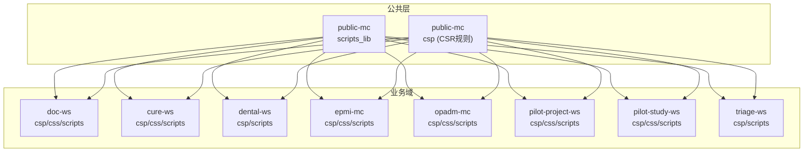
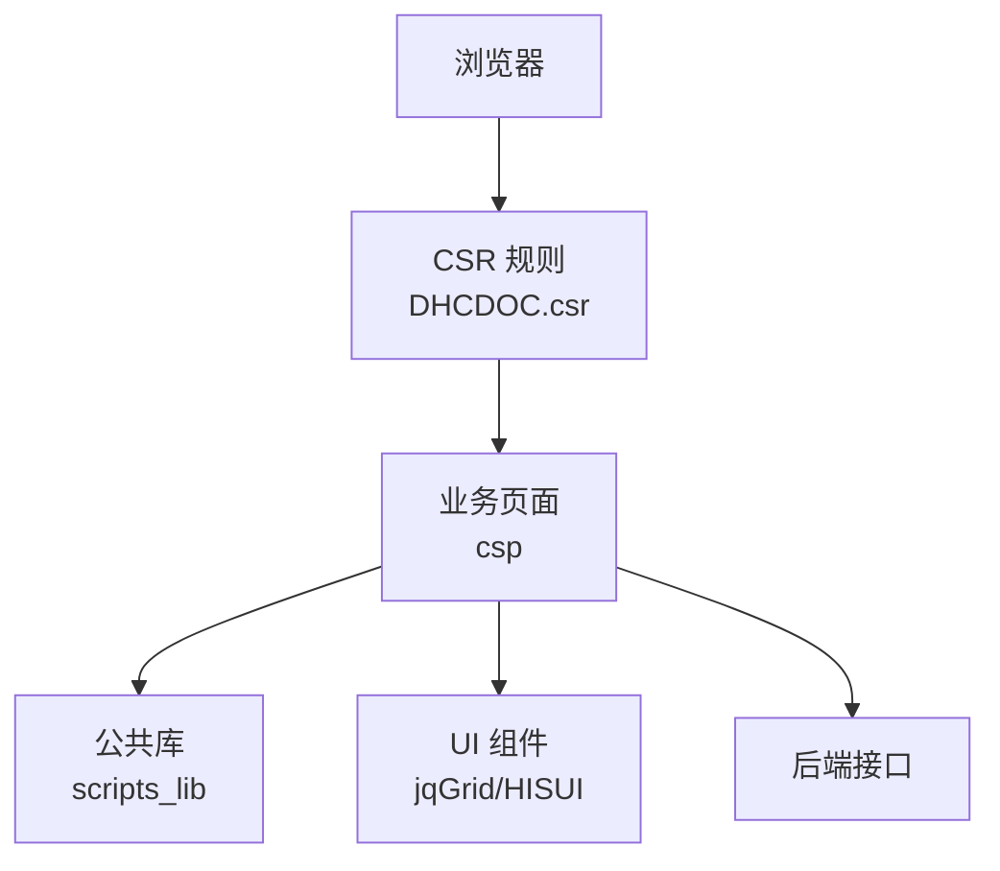
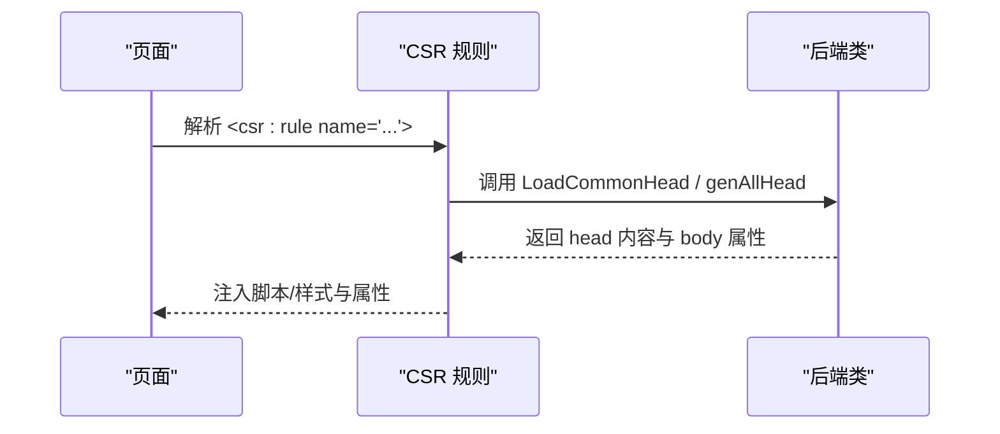
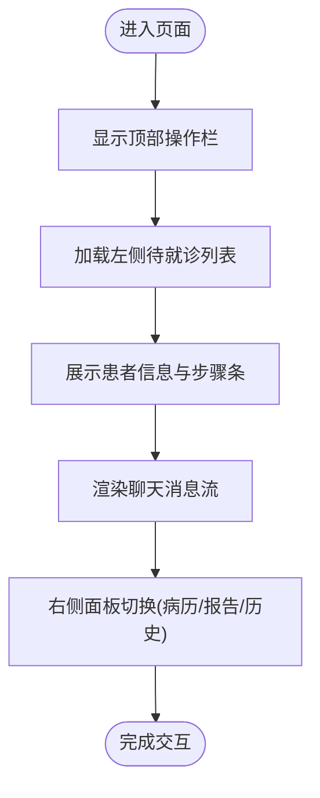
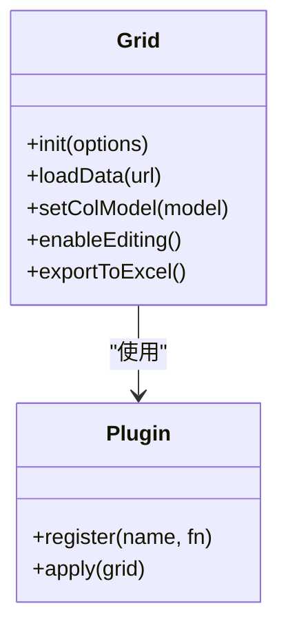
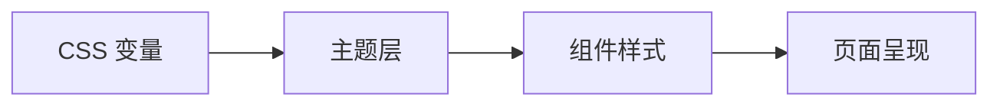
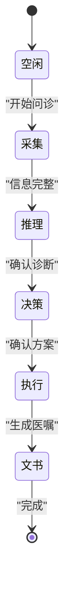
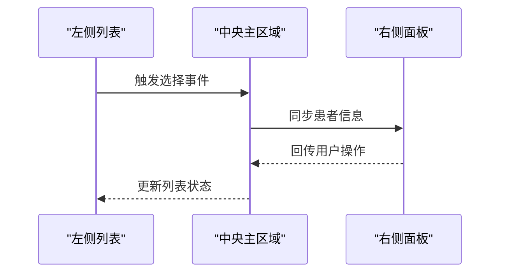
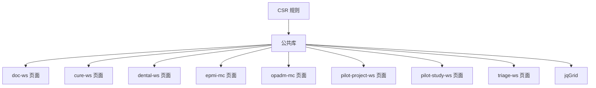

# 前端架构

<cite>
**本文引用的文件**
- [DHCDOC.csr](file://src/frontend/public-mc/csp/DHCDOC.csr)
- [cdss-prototype.html](file://prototype/cdss-prototype.html)
- [jquery.jqGrid-4.6.0](file://src/frontend/public-mc/scripts_lib/jquery.jqGrid-4.6.0)
</cite>

## 目录
1. [简介](#简介)
2. [项目结构](#项目结构)
3. [核心组件](#核心组件)
4. [架构总览](#架构总览)
5. [详细组件分析](#详细组件分析)
6. [依赖关系分析](#依赖关系分析)
7. [性能考虑](#性能考虑)
8. [故障排查指南](#故障排查指南)
9. [结论](#结论)
10. [附录](#附录)

## 简介
本文件面向医疗信息系统的前端架构，聚焦CSP页面结构、UI组件库（HISUI）、交互设计与样式规范。文档说明前端模块化组织方式、资源管理机制、页面间通信模式；记录jQuery插件使用、自定义组件开发、响应式设计与可访问性合规；涵盖组件状态管理、动画与过渡效果；提供样式定制与主题支持；并给出跨浏览器兼容性与性能优化建议，以及组件组合模式与与其他UI元素的集成方法。

## 项目结构
前端采用按业务域划分的目录组织：每个子系统（如 doc-ws、public-mc、cure-ws 等）均包含 csp（服务端渲染页面）、css（样式）、scripts（脚本）、images（静态资源）。公共能力集中在 public-mc 的 scripts_lib 中，供各子系统复用。CSP 通过 CSR 规则统一注入公共头与资源，保证多模块一致的资源加载策略与全局配置。

图表来源
- [DHCDOC.csr:1-44](file://src/frontend/public-mc/csp/DHCDOC.csr#L1-L44)

章节来源
- [DHCDOC.csr:1-44](file://src/frontend/public-mc/csp/DHCDOC.csr#L1-L44)

## 核心组件
- CSP 公共头注入：通过 CSR 规则在页面头部统一引入公共资源与配置，减少重复代码，确保一致性。
- 原型界面与交互：基于 HTML/CSS/JS 的原型页面展示了三栏布局、步骤导航、聊天消息流、卡片化信息展示、弹窗与筛选面板等典型交互。
- 表格与数据展示：使用 jQuery jqGrid 作为通用表格组件，提供分页、排序、筛选、编辑等能力。
- 样式与主题：通过 CSS 变量定义主题色板与阴影、圆角等设计令牌，便于统一风格与快速定制。

章节来源
- [DHCDOC.csr:1-44](file://src/frontend/public-mc/csp/DHCDOC.csr#L1-L44)
- [cdss-prototype.html:1-800](file://prototype/cdss-prototype.html#L1-L800)
- [jquery.jqGrid-4.6.0](file://src/frontend/public-mc/scripts_lib/jquery.jqGrid-4.6.0)

## 架构总览
整体架构遵循“公共能力下沉 + 业务域内聚”的原则：
- 公共能力：CSR 规则集中管理页面头资源注入；scripts_lib 提供通用 UI 组件与工具库。
- 业务域：各子系统以 csp 为入口，结合本地 css 与 scripts 实现领域功能。
- 资源管理：通过 CSR 规则与模块参数控制是否启用调试、打印、外部域名、CSS 覆盖等。
- 页面通信：原型页面通过 DOM 事件与函数调用驱动交互；实际系统中可通过后端接口或事件总线进行跨组件通信。

图表来源
- [DHCDOC.csr:1-44](file://src/frontend/public-mc/csp/DHCDOC.csr#L1-L44)
- [jquery.jqGrid-4.6.0](file://src/frontend/public-mc/scripts_lib/jquery.jqGrid-4.6.0)

## 详细组件分析

### CSP 公共头与资源注入
- 作用：在页面头部统一引入公共脚本与样式，支持模块开关、调试模式、打印模式、产品域名、医疗步骤码、require 列表与 CSS 覆盖。
- 关键点：CSR 规则匹配 HEAD/ANTHEAD 片段，调用后端类生成 head 内容，返回 docBodyAttr 供后续使用。
- 扩展点：新增公共库或样式时，优先通过 CSR 规则注册，避免在各页面重复引入。

图表来源
- [DHCDOC.csr:1-44](file://src/frontend/public-mc/csp/DHCDOC.csr#L1-L44)

章节来源
- [DHCDOC.csr:1-44](file://src/frontend/public-mc/csp/DHCDOC.csr#L1-L44)

### 原型界面与交互设计
- 布局：顶部操作栏、左侧窄栏（待就诊列表与筛选）、中间主区域（患者信息与步骤导航、聊天消息流）、右侧面板（病历预览、报告、历史就诊）。
- 交互：步骤条切换、消息气泡、卡片选择、弹窗与筛选面板、语音录制指示器、AI 状态提示。
- 可访问性：语义化标签、键盘可达按钮、对比度良好的颜色、ARIA 友好结构（可扩展）。
- 响应式：使用 Flexbox/Grid 与相对单位，适配不同屏幕尺寸。

图表来源
- [cdss-prototype.html:1-800](file://prototype/cdss-prototype.html#L1-L800)

章节来源
- [cdss-prototype.html:1-800](file://prototype/cdss-prototype.html#L1-L800)

### 表格组件（jQuery jqGrid）
- 能力：分页、排序、搜索、行编辑、批量操作、列配置、导出。
- 集成：通过 scripts_lib 引入，配合 CSR 规则统一加载；可在各业务页面按需实例化。
- 扩展：通过 plugins 目录扩展功能；通过 CSS 目录定制外观。

图表来源
- [jquery.jqGrid-4.6.0](file://src/frontend/public-mc/scripts_lib/jquery.jqGrid-4.6.0)

章节来源
- [jquery.jqGrid-4.6.0](file://src/frontend/public-mc/scripts_lib/jquery.jqGrid-4.6.0)

### 样式系统与主题支持
- 设计令牌：通过 CSS 变量定义背景、表面、边框、文本、强调色、成功/警告/危险、阴影、字体等。
- 主题定制：修改根变量即可切换主题；支持明暗模式扩展。
- 组件样式：按钮、输入框、卡片、消息气泡、步骤条、弹窗等均有统一风格。
- 可访问性：高对比度、焦点可见、语义化结构。

图表来源
- [cdss-prototype.html:1-800](file://prototype/cdss-prototype.html#L1-L800)

章节来源
- [cdss-prototype.html:1-800](file://prototype/cdss-prototype.html#L1-L800)

### 组件状态管理与动画
- 状态管理：原型页面通过 DOM 元素与局部变量维护状态（如步骤、选中项、筛选条件），可扩展为集中式状态容器。
- 动画与过渡：按钮悬停、消息气泡、语音录制指示器、脉冲动画等提升交互反馈。
- 最佳实践：将状态与视图分离，使用事件驱动更新，避免直接操作 DOM 造成耦合。

图表来源
- [cdss-prototype.html:1-800](file://prototype/cdss-prototype.html#L1-L800)

章节来源
- [cdss-prototype.html:1-800](file://prototype/cdss-prototype.html#L1-L800)

### 页面间通信模式
- 同页通信：通过 DOM 事件与函数调用协调左右面板与主区域。
- 跨页通信：可使用 localStorage/sessionStorage、postMessage（iframe）、或后端事件通道（WebSocket/轮询）。
- 建议：在复杂场景中引入轻量事件总线，解耦组件依赖。

图表来源
- [cdss-prototype.html:1-800](file://prototype/cdss-prototype.html#L1-L800)

章节来源
- [cdss-prototype.html:1-800](file://prototype/cdss-prototype.html#L1-L800)

## 依赖关系分析
- 公共依赖：CSR 规则负责注入公共脚本与样式；scripts_lib 提供通用 UI 与工具。
- 业务依赖：各子系统 csp 页面依赖公共库与本地脚本；表格组件依赖 jqGrid。
- 潜在风险：版本不一致导致兼容性问题；过多全局变量造成命名冲突。

图表来源
- [DHCDOC.csr:1-44](file://src/frontend/public-mc/csp/DHCDOC.csr#L1-L44)
- [jquery.jqGrid-4.6.0](file://src/frontend/public-mc/scripts_lib/jquery.jqGrid-4.6.0)

章节来源
- [DHCDOC.csr:1-44](file://src/frontend/public-mc/csp/DHCDOC.csr#L1-L44)
- [jquery.jqGrid-4.6.0](file://src/frontend/public-mc/scripts_lib/jquery.jqGrid-4.6.0)

## 性能考虑
- 资源加载：通过 CSR 规则按需引入脚本与样式，减少首屏体积；启用缓存策略。
- 渲染优化：虚拟滚动与分页用于大数据表格；懒加载右侧面板内容。
- 动画性能：使用 CSS transform 与 opacity 实现流畅动画；避免重排重绘。
- 兼容性：针对 IE/Edge/Chrome/Firefox/Safari 进行测试；必要时添加 polyfill。

## 故障排查指南
- 资源未加载：检查 CSR 规则是否正确注入；确认路径与域名配置。
- 组件异常：查看控制台错误；验证 jqGrid 初始化参数与列模型。
- 样式错乱：核对 CSS 变量与主题覆盖；检查浏览器开发者工具的样式计算。
- 交互失效：确认事件绑定与作用域；使用断点调试关键流程。

章节来源
- [DHCDOC.csr:1-44](file://src/frontend/public-mc/csp/DHCDOC.csr#L1-L44)
- [jquery.jqGrid-4.6.0](file://src/frontend/public-mc/scripts_lib/jquery.jqGrid-4.6.0)

## 结论
本前端架构通过 CSR 规则统一资源注入、公共库下沉与业务域内聚，实现了模块化组织与一致的页面体验。原型界面提供了丰富的交互范式与样式系统，jqGrid 作为表格能力支撑数据展示。建议在复杂场景中引入集中式状态管理与事件总线，进一步提升可维护性与扩展性。同时，持续优化资源加载与渲染性能，确保跨浏览器兼容与可访问性合规。

## 附录
- 术语
  - CSP：服务端页面模板
  - CSR：客户端服务规则（此处指服务端 CSR 规则）
  - HISUI：医院信息系统 UI 组件库（本项目中的公共 UI 能力）
- 参考
  - 公共头注入：[DHCDOC.csr:1-44](file://src/frontend/public-mc/csp/DHCDOC.csr#L1-L44)
  - 原型界面与交互：[cdss-prototype.html:1-800](file://prototype/cdss-prototype.html#L1-L800)
  - 表格组件：[jquery.jqGrid-4.6.0](file://src/frontend/public-mc/scripts_lib/jquery.jqGrid-4.6.0)