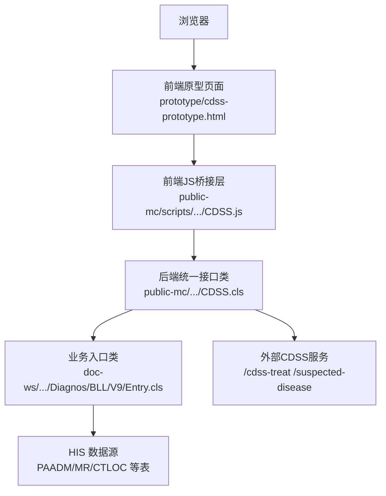
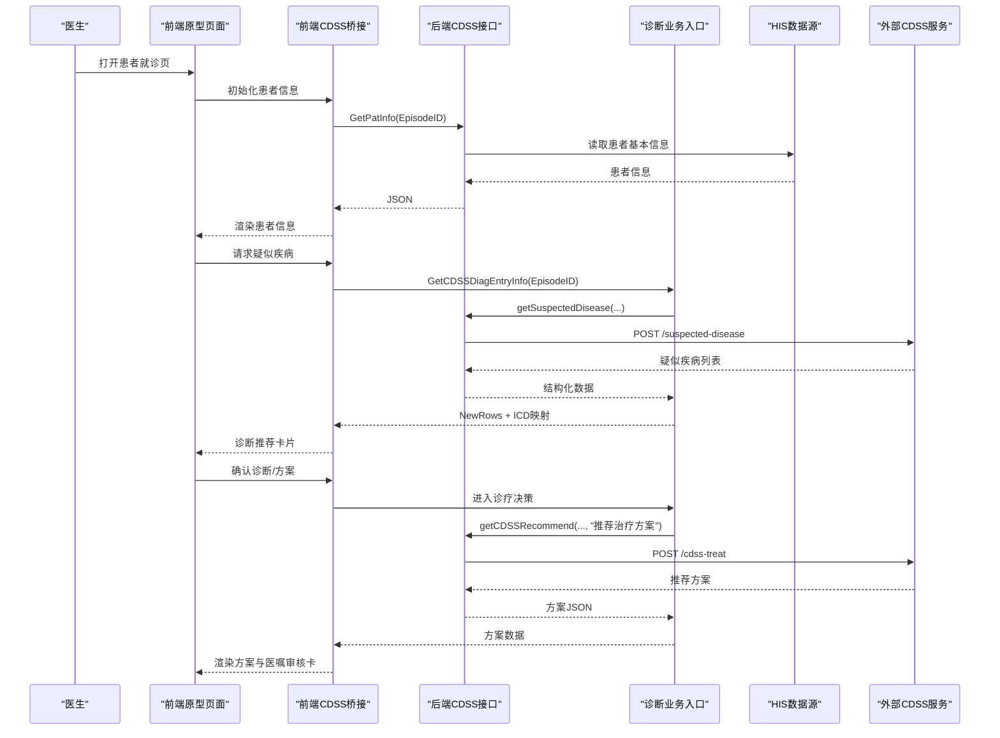
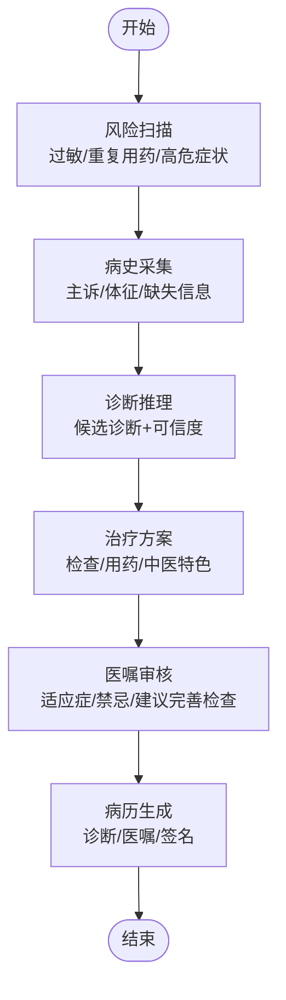
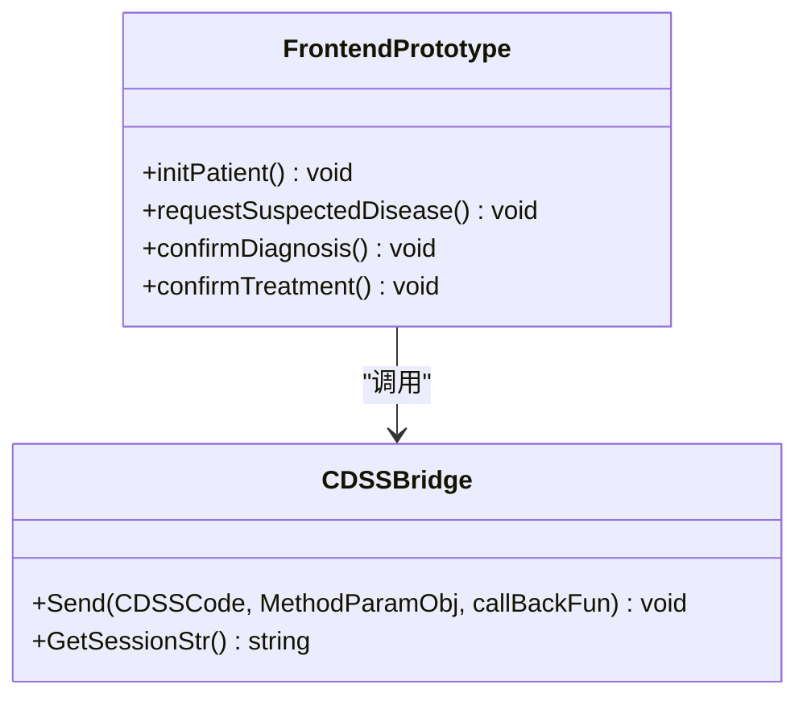
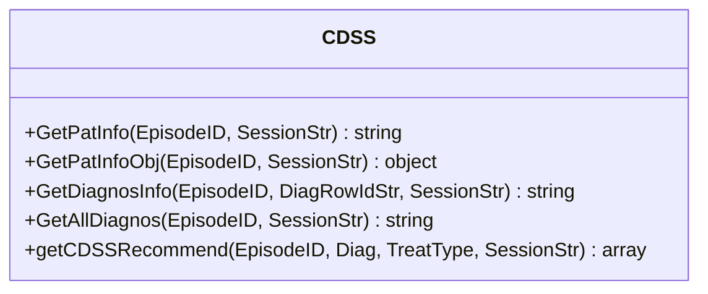
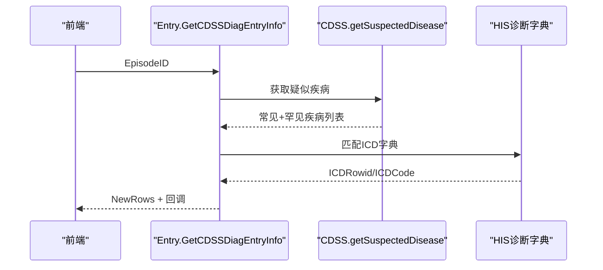
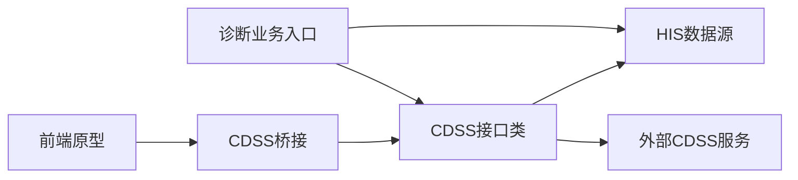

# 临床决策支持系统原型

<cite>
**本文引用的文件**
- [README.md](file://README.md)
- [cdss-prototype.html](file://prototype/cdss-prototype.html)
- [CDSS.cls](file://src/backend/public-mc/DHCDoc/Interface/Inside/CDSS.cls)
- [Entry.cls](file://src/backend/doc-ws/DHCDoc/Diagnos/BLL/V9/Entry.cls)
- [diagnosentry.v8.csp](file://src/frontend/doc-ws/csp/diagnosentry.v8.csp)
- [CDSS.js (iMedical)](file://src/frontend/public-mc/scripts/dhcdoc/interface/iMedical/CDSS.js)
- [CDSS.js (HuiMei)](file://src/frontend/public-mc/scripts/dhcdoc/interface/HuiMei/CDSS.js)
</cite>

## 目录
1. [简介](#简介)
2. [项目结构](#项目结构)
3. [核心组件](#核心组件)
4. [架构总览](#架构总览)
5. [详细组件分析](#详细组件分析)
6. [依赖关系分析](#依赖关系分析)
7. [性能与可用性考虑](#性能与可用性考虑)
8. [故障排查指南](#故障排查指南)
9. [结论](#结论)
10. [附录](#附录)

## 简介
本仓库为多产品 HIS（医院信息系统）工程，后端基于 InterSystems IRIS ObjectScript，前端采用传统 jQuery + HISUI。其中包含一个“门诊 AI 诊疗系统”的纯前端原型页面，用于演示以智能体编排为核心的临床决策支持流程：风险扫描、病史采集、诊断推理、治疗方案推荐、医嘱审核与执行、病历生成等。同时，后端提供了统一的 CDSS 接口类，负责从 HIS 数据源抽取患者、诊断、医嘱等信息，并调用外部 CDSS 服务进行推理与推荐。

该原型的目标是：
- 以可视化方式展示医生在门诊场景下的 AI 辅助决策流程
- 通过前后端解耦的接口设计，将 HIS 数据与外部 CDSS 能力集成
- 提供可扩展的智能体卡片模型，便于后续扩展更多专业智能体（如中医、检验检查、用药安全等）

## 项目结构
整体结构按“后端/前端”划分，并按产品线组织子模块。原型页面位于根目录 prototype 下；后端统一接口集中在 public-mc 的 CDSS 类中；前端通过 CSP 页面与 JS 脚本调用后端接口。

图表来源
- [cdss-prototype.html:457-800](file://prototype/cdss-prototype.html#L457-L800)
- [CDSS.js (iMedical):1-40](file://src/frontend/public-mc/scripts/dhcdoc/interface/iMedical/CDSS.js#L1-L40)
- [CDSS.cls:1-200](file://src/backend/public-mc/DHCDoc/Interface/Inside/CDSS.cls#L1-L200)
- [Entry.cls:182-247](file://src/backend/doc-ws/DHCDoc/Diagnos/BLL/V9/Entry.cls#L182-L247)

章节来源
- [README.md:1-549](file://README.md#L1-L549)

## 核心组件
- 前端原型页面：提供完整的门诊就诊交互界面，包括患者队列、步骤导航、聊天式对话、智能体卡片、风险扫描提示、诊断选择、治疗方案推荐、医嘱审核与执行、病历预览等。
- 前端CDSS桥接：封装对后端的调用，统一会话上下文传递，并将结果转发给CDSS中间件或回调处理。
- 后端CDSS接口类：统一输出患者信息、诊断列表、疑似疾病、推荐检验检查/治疗方案等，并负责与外部CDSS服务通信。
- 诊断业务入口：对接CDSS疑似疾病接口，匹配HIS诊断字典，构建录入行并走录入校验流程。
- 诊断CSP页面：承载诊断录入界面，并在保存/复制时回写CDSS所需数据。

章节来源
- [cdss-prototype.html:457-800](file://prototype/cdss-prototype.html#L457-L800)
- [CDSS.js (iMedical):1-40](file://src/frontend/public-mc/scripts/dhcdoc/interface/iMedical/CDSS.js#L1-L40)
- [CDSS.cls:1-200](file://src/backend/public-mc/DHCDoc/Interface/Inside/CDSS.cls#L1-L200)
- [Entry.cls:182-247](file://src/backend/doc-ws/DHCDoc/Diagnos/BLL/V9/Entry.cls#L182-L247)
- [diagnosentry.v8.csp:243-270](file://src/frontend/doc-ws/csp/diagnosentry.v8.csp#L243-L270)

## 架构总览
系统采用“前端原型 + 后端统一接口 + 外部CDSS服务”的分层架构。前端原型通过JS桥接层调用后端CDSS接口，后端从HIS读取患者与诊断数据，并调用外部CDSS服务获取诊断推荐与治疗方案。

图表来源
- [CDSS.cls:887-911](file://src/backend/public-mc/DHCDoc/Interface/Inside/CDSS.cls#L887-L911)
- [Entry.cls:182-247](file://src/backend/doc-ws/DHCDoc/Diagnos/BLL/V9/Entry.cls#L182-L247)
- [CDSS.js (iMedical):1-40](file://src/frontend/public-mc/scripts/dhcdoc/interface/iMedical/CDSS.js#L1-L40)
- [cdss-prototype.html:602-800](file://prototype/cdss-prototype.html#L602-L800)

## 详细组件分析

### 前端原型页面（cdss-prototype.html）
- 功能要点：
  - 顶部状态栏显示科室、时间、接诊统计与医生信息
  - 左侧患者队列与筛选弹窗，支持按状态、日期、号别等过滤
  - 中央聊天区以“智能体卡片”形式呈现风险扫描、病史采集、诊断推理、治疗方案、医嘱审核等阶段
  - 右侧面板提供病历预览、报告查看、历次就诊记录
  - 底部输入区支持快捷问题与语音输入
- 交互流程：
  - 初始由“任务编排智能体”发起风险扫描，随后“病史采集智能体”确认信息完整性
  - “诊断智能体”给出候选诊断与可信度，医生可多选确认
  - “治疗智能体”根据过敏史与指南推荐检查与用药，支持中医特色治疗
  - “医嘱智能体”对当前方案进行检查与提示，最终进入医嘱执行与病历生成

图表来源
- [cdss-prototype.html:602-800](file://prototype/cdss-prototype.html#L602-L800)

章节来源
- [cdss-prototype.html:457-800](file://prototype/cdss-prototype.html#L457-L800)

### 前端CDSS桥接层（CDSS.js）
- iMedical 版本：
  - 通过 websys_getMenuWin 获取CDSS中间件对象
  - Send 方法统一封装 ClassName、SessionStr，调用后端 DHCDoc.Interface.Inside.CDSS
  - 支持回调函数，将结果交给 TriggerDHCDSS 或自定义回调
- HuiMei 版本：
  - 提供病人切换、诊断同步、医嘱拦截与同步等方法
  - 与后端接口对齐，确保诊断与医嘱变更能实时反馈到CDSS

图表来源
- [CDSS.js (iMedical):1-40](file://src/frontend/public-mc/scripts/dhcdoc/interface/iMedical/CDSS.js#L1-L40)
- [CDSS.js (HuiMei):129-154](file://src/frontend/public-mc/scripts/dhcdoc/interface/HuiMei/CDSS.js#L129-L154)

章节来源
- [CDSS.js (iMedical):1-40](file://src/frontend/public-mc/scripts/dhcdoc/interface/iMedical/CDSS.js#L1-L40)
- [CDSS.js (HuiMei):129-154](file://src/frontend/public-mc/scripts/dhcdoc/interface/HuiMei/CDSS.js#L129-L154)

### 后端CDSS接口类（CDSS.cls）
- 主要职责：
  - 统一输出患者信息（GetPatInfo/GetPatInfoObj）
  - 输出诊断列表（GetAllDiagnos/GetDiagnosInfo/RecurDiagByID）
  - 获取疑似疾病（getSuspectedDisease，具体实现未在本片段显示，但被 Entry.cls 调用）
  - 获取推荐检验检查/治疗方案（getCDSSRecommend），调用外部服务 /cdss-treat
- 数据流：
  - 从 SessionStr 解析用户、科室、院区
  - 从 PAADM/PAPER/CTLOC 等表读取患者与就诊信息
  - 组装 JSON 返回给前端或上层业务

图表来源
- [CDSS.cls:1-200](file://src/backend/public-mc/DHCDoc/Interface/Inside/CDSS.cls#L1-L200)
- [CDSS.cls:887-911](file://src/backend/public-mc/DHCDoc/Interface/Inside/CDSS.cls#L887-L911)

章节来源
- [CDSS.cls:1-200](file://src/backend/public-mc/DHCDoc/Interface/Inside/CDSS.cls#L1-L200)
- [CDSS.cls:887-911](file://src/backend/public-mc/DHCDoc/Interface/Inside/CDSS.cls#L887-L911)

### 诊断业务入口（Entry.cls）
- 功能要点：
  - 获取CDSS诊断推荐录入信息（GetCDSSDiagEntryInfo）
  - 调用CDSS疑似疾病接口，合并常见与罕见疾病，罕见项标记 RareFlag
  - 按疾病信息匹配HIS诊断字典，获取ICDRowid，构建NewRows
  - 走录入校验流程，返回前端所需的 rows 与回调函数
- 数据流：
  - 从CDSS返回的疾病名称、权重、症状、危急/感染/急诊标志
  - 匹配字典后填充 ICDRowid、ICDCode
  - 组装 BaseParam 并调用 Entry.GetICDEntryInfo

图表来源
- [Entry.cls:182-247](file://src/backend/doc-ws/DHCDoc/Diagnos/BLL/V9/Entry.cls#L182-L247)

章节来源
- [Entry.cls:182-247](file://src/backend/doc-ws/DHCDoc/Diagnos/BLL/V9/Entry.cls#L182-L247)

### 诊断CSP页面（diagnosentry.v8.csp）
- 功能要点：
  - 加载诊断录入配置与状态
  - 复制诊断时准备 copyOeoris 与 copyCDSSData
  - 基础平台反馈需转码（GB18030→UTF8）
  - 设置中医科标志与参数，区分西医/中医/证型
- 与CDSS集成：
  - 保存/复制诊断时回写CDSS所需数据，保证诊断变更能被CDSS感知

章节来源
- [diagnosentry.v8.csp:243-270](file://src/frontend/doc-ws/csp/diagnosentry.v8.csp#L243-L270)

## 依赖关系分析
- 前端依赖：
  - 原型页面依赖CDSS桥接层进行数据交互
  - 桥接层依赖后端统一接口类，传递会话上下文
- 后端依赖：
  - CDSS接口类依赖HIS数据表（PAADM、PAPER、CTLOC、MR等）
  - 诊断业务入口依赖CDSS接口类与HIS诊断字典
  - 治疗方案推荐依赖外部CDSS服务（/cdss-treat）
- 外部依赖：
  - 外部CDSS服务提供疑似疾病与治疗方案推荐

图表来源
- [CDSS.cls:1-200](file://src/backend/public-mc/DHCDoc/Interface/Inside/CDSS.cls#L1-L200)
- [Entry.cls:182-247](file://src/backend/doc-ws/DHCDoc/Diagnos/BLL/V9/Entry.cls#L182-L247)
- [CDSS.js (iMedical):1-40](file://src/frontend/public-mc/scripts/dhcdoc/interface/iMedical/CDSS.js#L1-L40)

章节来源
- [CDSS.cls:1-200](file://src/backend/public-mc/DHCDoc/Interface/Inside/CDSS.cls#L1-L200)
- [Entry.cls:182-247](file://src/backend/doc-ws/DHCDoc/Diagnos/BLL/V9/Entry.cls#L182-L247)
- [CDSS.js (iMedical):1-40](file://src/frontend/public-mc/scripts/dhcdoc/interface/iMedical/CDSS.js#L1-L40)

## 性能与可用性考虑
- 前端：
  - 使用轻量级HTML/CSS/JS原型，避免重型框架，提升加载速度
  - 聊天式交互减少页面跳转，提高医生操作效率
- 后端：
  - 统一接口类集中管理数据抽取与外部服务调用，便于缓存与重试策略
  - 诊断推荐与治疗方案推荐分离，降低单次请求复杂度
- 外部服务：
  - 建议对CDSS服务增加超时与降级机制，保证HIS主流程不受影响
  - 对高频查询（如患者信息、诊断列表）可引入本地缓存

[本节为通用指导，不直接分析具体文件]

## 故障排查指南
- 前端无法获取CDSS数据：
  - 检查CDSS桥接层是否正确传递 SessionStr 与 ClassName
  - 确认 websys_getMenuWin 是否可用，CDSS中间件是否已初始化
- 后端接口报错：
  - 检查 EpisodeID 是否为空，SessionStr 是否有效
  - 核对外部CDSS服务地址与端口，确认网络连通性
- 诊断推荐为空：
  - 检查疑似疾病接口返回数据结构，确认 MatchCode 是否存在
  - 验证HIS诊断字典匹配逻辑，确保 ICDRowid 正确映射
- 医嘱审核异常：
  - 检查过敏史与禁忌规则是否完整
  - 确认推荐方案中的药物剂量与疗程是否符合规范

章节来源
- [CDSS.js (iMedical):1-40](file://src/frontend/public-mc/scripts/dhcdoc/interface/iMedical/CDSS.js#L1-L40)
- [CDSS.cls:1-200](file://src/backend/public-mc/DHCDoc/Interface/Inside/CDSS.cls#L1-L200)
- [Entry.cls:182-247](file://src/backend/doc-ws/DHCDoc/Diagnos/BLL/V9/Entry.cls#L182-L247)

## 结论
本原型以“智能体编排”为核心，将风险扫描、病史采集、诊断推理、治疗方案推荐、医嘱审核与病历生成串联成流畅的门诊就诊流程。后端通过统一接口类屏蔽HIS数据差异，并对外部CDSS服务进行封装，便于扩展与维护。前端原型直观展示了AI辅助决策的价值，为后续功能落地提供了清晰的交互蓝图。

[本节为总结性内容，不直接分析具体文件]

## 附录
- 开发工作流参考 README 中的“快速开始”与“开发工作流”章节
- 部署与配置请参考 .vscode 模板与 scripts 目录中的工具脚本

章节来源
- [README.md:62-278](file://README.md#L62-L278)