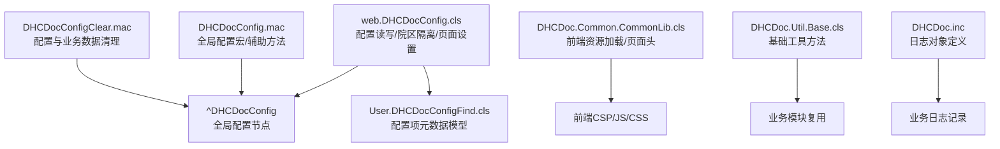
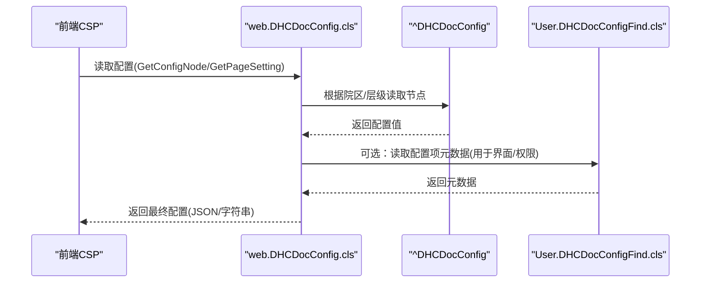
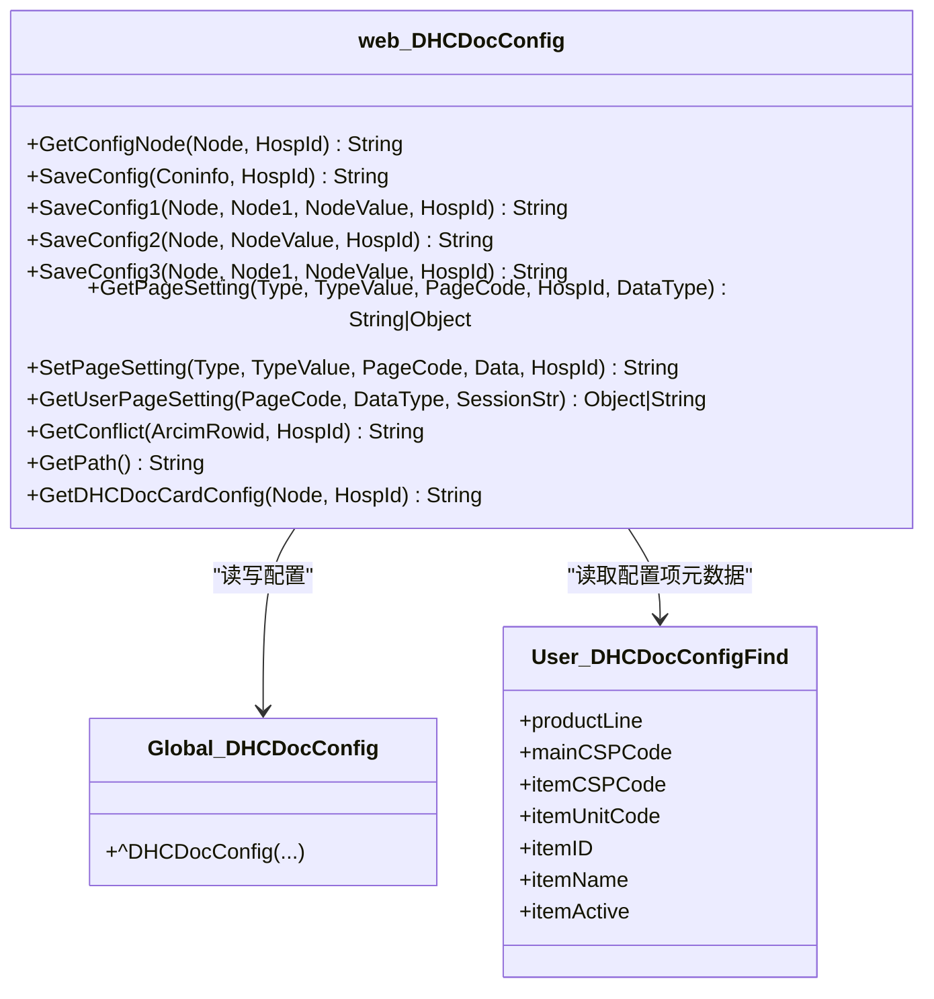
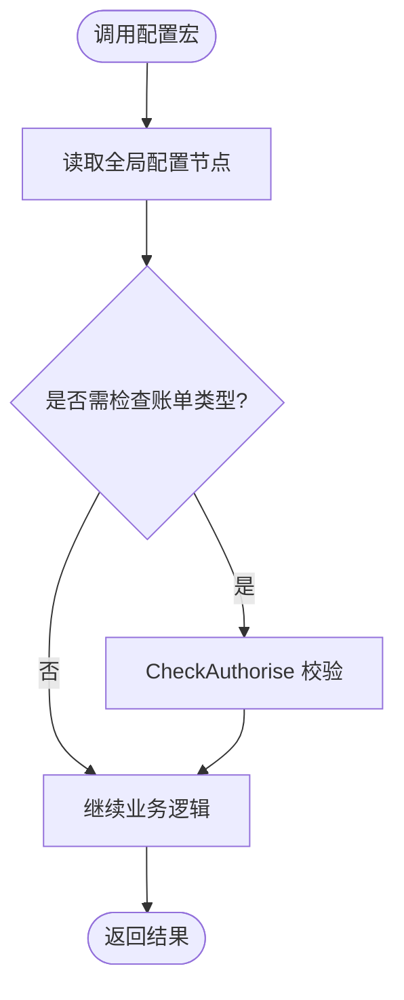
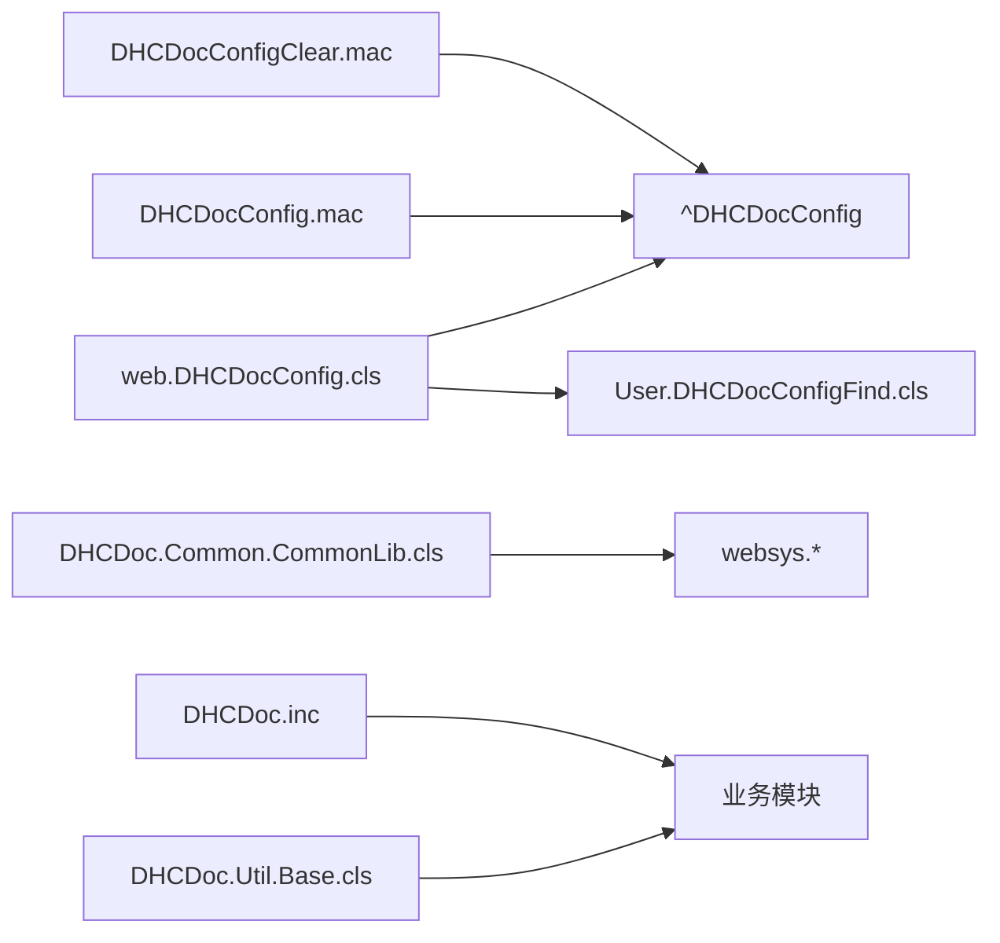

# 公共模块

<cite>
**本文引用的文件**
- [DHCDocConfig.mac](file://src/backend/public-mc/DHCDocConfig.mac)
- [DHCDoc.inc](file://src/backend/public-mc/DHCDoc.inc)
- [DHCDocConfigClear.mac](file://src/backend/public-mc/DHCDocConfigClear.mac)
- [web.DHCDocConfig.cls](file://src/backend/public-mc/web/DHCDocConfig.cls)
- [User.DHCDocConfigFind.cls](file://src/backend/public-mc/User/DHCDocConfigFind.cls)
- [DHCDoc.Util.Base.cls](file://src/backend/public-mc/DHCDoc/Util/Base.cls)
- [DHCDoc.Common.CommonLib.cls](file://src/backend/public-mc/DHCDoc/Common/CommonLib.cls)
</cite>

## 目录
1. [简介](#简介)
2. [项目结构](#项目结构)
3. [核心组件](#核心组件)
4. [架构总览](#架构总览)
5. [详细组件分析](#详细组件分析)
6. [依赖关系分析](#依赖关系分析)
7. [性能考虑](#性能考虑)
8. [故障排查指南](#故障排查指南)
9. [结论](#结论)
10. [附录](#附录)

## 简介
本章节面向医疗信息系统中的“公共模块”，重点说明配置管理系统（DHCDocConfig）的设计与使用，包括配置结构设计、权限控制机制、动态配置能力；并介绍基础工具类库、通用函数库、数据处理工具、日志记录等公共能力。同时给出这些组件在各业务模块的复用方式、扩展点使用方法、具体示例、最佳实践与性能优化建议。

## 项目结构
公共模块主要位于后端 public-mc 目录下，围绕配置管理、工具类、前端资源加载、数据清理等职责进行组织：
- 配置管理
  - 全局配置宏与接口：DHCDocConfig.mac
  - 配置持久化与多院区隔离：web.DHCDocConfig.cls
  - 配置项元数据模型：User.DHCDocConfigFind.cls
  - 配置清理脚本：DHCDocConfigClear.mac
- 工具与通用库
  - 基础工具类：DHCDoc.Util.Base.cls
  - 前端资源加载与页面头生成：DHCDoc.Common.CommonLib.cls
- 日志与集成
  - 日志对象定义：DHCDoc.inc

图表来源
- [web.DHCDocConfig.cls:21-44](file://src/backend/public-mc/web/DHCDocConfig.cls#L21-L44)
- [DHCDocConfig.mac:1-26](file://src/backend/public-mc/DHCDocConfig.mac#L1-L26)
- [DHCDocConfigClear.mac:365-527](file://src/backend/public-mc/DHCDocConfigClear.mac#L365-L527)
- [DHCDoc.Common.CommonLib.cls:106-187](file://src/backend/public-mc/DHCDoc/Common/CommonLib.cls#L106-L187)
- [DHCDoc.Util.Base.cls:1-120](file://src/backend/public-mc/DHCDoc/Util/Base.cls#L1-L120)
- [DHCDoc.inc:1-8](file://src/backend/public-mc/DHCDoc.inc#L1-L8)

章节来源
- [web.DHCDocConfig.cls:21-44](file://src/backend/public-mc/web/DHCDocConfig.cls#L21-L44)
- [DHCDocConfig.mac:1-26](file://src/backend/public-mc/DHCDocConfig.mac#L1-L26)
- [DHCDocConfigClear.mac:365-527](file://src/backend/public-mc/DHCDocConfigClear.mac#L365-L527)
- [DHCDoc.Common.CommonLib.cls:106-187](file://src/backend/public-mc/DHCDoc/Common/CommonLib.cls#L106-L187)
- [DHCDoc.Util.Base.cls:1-120](file://src/backend/public-mc/DHCDoc/Util/Base.cls#L1-L120)
- [DHCDoc.inc:1-8](file://src/backend/public-mc/DHCDoc.inc#L1-L8)

## 核心组件
- 配置管理系统（DHCDocConfig）
  - 提供全局配置节点的读取与写入，支持按院区隔离（HospDr_前缀），支持多级子节点与批量保存。
  - 提供页面级用户/安全组配置合并与覆盖策略，支持JSON对象存取与序列化。
  - 提供互斥规则查询、路径获取、卡配置等扩展能力。
- 配置项元数据（User.DHCDocConfigFind）
  - 以持久化实体描述配置项的归属（产品线、主页面、单元、元素ID/名称等），便于界面展示与权限控制。
- 基础工具类（DHCDoc.Util.Base）
  - 身份证号转换与校验、年龄计算、日期有效性检查、字符串处理、别名匹配等通用方法。
- 前端资源加载（DHCDoc.Common.CommonLib）
  - 统一注入Bootstrap、EasyUI、打印与读卡插件、接口中间层JS等，简化页面初始化。
- 日志记录（DHCDoc.inc）
  - 定义日志对象引用，供业务模块统一记录接口与操作日志。

章节来源
- [web.DHCDocConfig.cls:21-44](file://src/backend/public-mc/web/DHCDocConfig.cls#L21-L44)
- [User.DHCDocConfigFind.cls:1-55](file://src/backend/public-mc/User/DHCDocConfigFind.cls#L1-L55)
- [DHCDoc.Util.Base.cls:12-45](file://src/backend/public-mc/DHCDoc/Util/Base.cls#L12-L45)
- [DHCDoc.Common.CommonLib.cls:106-187](file://src/backend/public-mc/DHCDoc/Common/CommonLib.cls#L106-L187)
- [DHCDoc.inc:1-8](file://src/backend/public-mc/DHCDoc.inc#L1-L8)

## 架构总览
配置系统采用“全局Global + 院区隔离 + 页面级配置”的分层设计：
- 全局配置：通过 ^DHCDocConfig 存储，提供跨会话共享能力。
- 院区隔离：通过 HospDr_ 前缀区分不同院区的配置，避免冲突。
- 页面级配置：基于 Type/TypeValue/PageCode 维度，支持用户与安全组两级合并，个人配置覆盖安全组。

图表来源
- [web.DHCDocConfig.cls:21-44](file://src/backend/public-mc/web/DHCDocConfig.cls#L21-L44)
- [web.DHCDocConfig.cls:371-426](file://src/backend/public-mc/web/DHCDocConfig.cls#L371-L426)
- [User.DHCDocConfigFind.cls:1-55](file://src/backend/public-mc/User/DHCDocConfigFind.cls#L1-L55)

## 详细组件分析

### 配置管理系统（web.DHCDocConfig.cls）
- 关键能力
  - 院区隔离读取/写入：GetConfigNode/SaveConfig/SaveConfig1/SaveConfig2/SaveConfig3 等方法自动拼接 HospDr_ 前缀。
  - 多级节点：支持 Node、Node1、Node2 等多级键，便于结构化配置。
  - 页面设置：SetPageSetting/GetPageSetting/ClearPageSetting 支持 JSON 对象存取与合并，支持用户与安全组两级覆盖。
  - 其他扩展：GetConflict 医嘱互斥查询、GetPath 报告路径、GetDHCDocCardConfig 卡片配置等。
- 数据结构
  - 全局配置节点：^DHCDocConfig(HospCodeNode, Node[, SubNode][, SubNode2])
  - 页面设置节点：^DHCDocConfig(HospCodeNode, Type, TypeValue, PageCode)
- 权限控制
  - 结合 User.DHCDocConfigFind 的配置项元数据，可在界面层实现功能开关与可见性控制。
  - 页面设置中可包含工作流授权等字段，在获取时进行权限校验（如 OPWorkflow）。

图表来源
- [web.DHCDocConfig.cls:21-44](file://src/backend/public-mc/web/DHCDocConfig.cls#L21-L44)
- [web.DHCDocConfig.cls:139-223](file://src/backend/public-mc/web/DHCDocConfig.cls#L139-L223)
- [web.DHCDocConfig.cls:371-426](file://src/backend/public-mc/web/DHCDocConfig.cls#L371-L426)
- [User.DHCDocConfigFind.cls:1-55](file://src/backend/public-mc/User/DHCDocConfigFind.cls#L1-L55)

章节来源
- [web.DHCDocConfig.cls:21-44](file://src/backend/public-mc/web/DHCDocConfig.cls#L21-L44)
- [web.DHCDocConfig.cls:139-223](file://src/backend/public-mc/web/DHCDocConfig.cls#L139-L223)
- [web.DHCDocConfig.cls:371-426](file://src/backend/public-mc/web/DHCDocConfig.cls#L371-L426)
- [User.DHCDocConfigFind.cls:1-55](file://src/backend/public-mc/User/DHCDocConfigFind.cls#L1-L55)

### 配置宏与辅助方法（DHCDocConfig.mac）
- 作用
  - 提供全局配置节点的快速读写方法（saveconfig/getconfignode 等）。
  - 提供常用时间、日期、诊断路径、当前医院等辅助方法。
  - 提供 CheckAuthorise 用于账单类型与子类检查的权限控制逻辑。
- 使用场景
  - 在需要轻量访问全局配置的旧代码或宏中直接调用。
  - 与 web.DHCDocConfig.cls 配合，实现新旧兼容。

图表来源
- [DHCDocConfig.mac:27-38](file://src/backend/public-mc/DHCDocConfig.mac#L27-L38)
- [DHCDocConfig.mac:1-26](file://src/backend/public-mc/DHCDocConfig.mac#L1-L26)

章节来源
- [DHCDocConfig.mac:1-26](file://src/backend/public-mc/DHCDocConfig.mac#L1-L26)
- [DHCDocConfig.mac:27-38](file://src/backend/public-mc/DHCDocConfig.mac#L27-L38)

### 配置项元数据模型（User.DHCDocConfigFind.cls）
- 作用
  - 描述配置项的归属与显示信息，包括产品线、主页面、单元、元素ID/名称、是否激活等。
  - 为界面展示、权限控制、搜索定位提供数据支撑。
- 索引与存储
  - 针对 productLine、mainCSPCode、itemCSPCode、itemUnitCode、itemName、itemID 建立索引，提升查询效率。
  - 持久化存储于 SQLUser.DHCDoc_ConfigFind。

章节来源
- [User.DHCDocConfigFind.cls:1-55](file://src/backend/public-mc/User/DHCDocConfigFind.cls#L1-L55)
- [User.DHCDocConfigFind.cls:55-216](file://src/backend/public-mc/User/DHCDocConfigFind.cls#L55-L216)

### 配置清理与维护（DHCDocConfigClear.mac）
- 作用
  - 提供医生站相关配置与业务数据的批量清理能力，包括挂号、排班、医嘱、模板、安全组授权等。
  - 支持按院区属性清理，确保多院区环境下的数据一致性。
- 使用建议
  - 上线前或迁移后执行，谨慎操作，避免误删生产数据。
  - 与 web.DHCDocConfig.ClearDocConfig 等入口配合使用。

章节来源
- [DHCDocConfigClear.mac:365-527](file://src/backend/public-mc/DHCDocConfigClear.mac#L365-L527)

### 基础工具类（DHCDoc.Util.Base.cls）
- 能力概览
  - 身份证号码15位与18位转换、校验与解析。
  - 年龄计算与格式化、出生日期推导。
  - 登记号格式化与长度获取。
  - 科室/医院代码获取、别名匹配、用户名匹配。
  - 字符串ASCII转换、隐藏敏感数字、日期有效性检查等。
- 使用建议
  - 在业务模块中优先复用此类方法，避免重复实现。
  - 注意参数校验与异常分支，保证健壮性。

章节来源
- [DHCDoc.Util.Base.cls:12-45](file://src/backend/public-mc/DHCDoc/Util/Base.cls#L12-L45)
- [DHCDoc.Util.Base.cls:54-117](file://src/backend/public-mc/DHCDoc/Util/Base.cls#L54-L117)
- [DHCDoc.Util.Base.cls:222-250](file://src/backend/public-mc/DHCDoc/Util/Base.cls#L222-L250)
- [DHCDoc.Util.Base.cls:634-728](file://src/backend/public-mc/DHCDoc/Util/Base.cls#L634-L728)

### 前端资源加载（DHCDoc.Common.CommonLib.cls）
- 能力概览
  - 统一注入 Bootstrap、EasyUI、FontAwesome 等前端库。
  - 生成页面头部，包含主题、语言、菜单标题等。
  - 按需加载打印与读卡插件、接口中间层JS，减少冗余加载。
- 使用建议
  - 在CSP页面中调用 LoadCommonHead/genAllHead 完成资源初始化。
  - 根据模块需求选择是否需要打印/读卡环境。

章节来源
- [DHCDoc.Common.CommonLib.cls:106-187](file://src/backend/public-mc/DHCDoc/Common/CommonLib.cls#L106-L187)
- [DHCDoc.Common.CommonLib.cls:189-258](file://src/backend/public-mc/DHCDoc/Common/CommonLib.cls#L189-L258)

### 日志记录（DHCDoc.inc）
- 作用
  - 定义日志对象 DocLogObj，指向 web.DHCDocInterfaceLog，供业务模块统一记录接口与操作日志。
- 使用建议
  - 在业务模块中通过 ##class(web.DHCDocInterfaceLog) 进行日志记录，保持日志格式一致。

章节来源
- [DHCDoc.inc:1-8](file://src/backend/public-mc/DHCDoc.inc#L1-L8)

## 依赖关系分析
- web.DHCDocConfig.cls 依赖全局配置节点 ^DHCDocConfig，并通过院区隔离前缀实现多租户配置。
- User.DHCDocConfigFind.cls 提供配置项元数据，供界面与权限控制使用。
- DHCDocConfig.mac 提供全局配置宏方法，与 web.DHCDocConfig.cls 互补。
- DHCDocConfigClear.mac 依赖多个业务表与全局节点，用于清理配置与业务数据。
- DHCDoc.Common.CommonLib.cls 依赖 websys 配置与插件体系，负责前端资源加载。
- DHCDoc.Util.Base.cls 提供通用方法，被各业务模块广泛复用。

图表来源
- [web.DHCDocConfig.cls:21-44](file://src/backend/public-mc/web/DHCDocConfig.cls#L21-L44)
- [DHCDocConfig.mac:1-26](file://src/backend/public-mc/DHCDocConfig.mac#L1-L26)
- [DHCDocConfigClear.mac:365-527](file://src/backend/public-mc/DHCDocConfigClear.mac#L365-L527)
- [DHCDoc.Common.CommonLib.cls:106-187](file://src/backend/public-mc/DHCDoc/Common/CommonLib.cls#L106-L187)
- [DHCDoc.Util.Base.cls:1-120](file://src/backend/public-mc/DHCDoc/Util/Base.cls#L1-L120)
- [DHCDoc.inc:1-8](file://src/backend/public-mc/DHCDoc.inc#L1-L8)

章节来源
- [web.DHCDocConfig.cls:21-44](file://src/backend/public-mc/web/DHCDocConfig.cls#L21-L44)
- [DHCDocConfig.mac:1-26](file://src/backend/public-mc/DHCDocConfig.mac#L1-L26)
- [DHCDocConfigClear.mac:365-527](file://src/backend/public-mc/DHCDocConfigClear.mac#L365-L527)
- [DHCDoc.Common.CommonLib.cls:106-187](file://src/backend/public-mc/DHCDoc/Common/CommonLib.cls#L106-L187)
- [DHCDoc.Util.Base.cls:1-120](file://src/backend/public-mc/DHCDoc/Util/Base.cls#L1-L120)
- [DHCDoc.inc:1-8](file://src/backend/public-mc/DHCDoc.inc#L1-L8)

## 性能考虑
- 配置读取
  - 优先使用 GetConfigNode/GetPageSetting 等封装方法，避免直接操作全局节点，减少错误与重复逻辑。
  - 对于高频读取的配置，建议在会话或缓存层做短期缓存，降低数据库与全局节点访问压力。
- 配置写入
  - 批量保存时使用 SaveConfig/SaveConfigNew 等方法，减少多次I/O。
  - 院区隔离前缀拼接由方法内部完成，避免业务层重复计算。
- 页面设置
  - 使用 JSON 对象存取，减少序列化/反序列化开销；仅在必要时转换为字符串。
  - 用户与安全组配置合并逻辑已内置，避免业务层重复实现。
- 前端资源加载
  - 按需加载打印与读卡插件，避免不必要的JS/CSS加载。
  - 使用 genAllHead/LodCommonHead 统一注入，减少重复代码。
- 工具方法
  - 复用 Base 类中的通用方法，避免重复实现导致的性能差异与不一致。

[本节为通用指导，不直接分析具体文件]

## 故障排查指南
- 配置未生效
  - 检查是否传入正确的 HospId，确认院区隔离前缀是否正确拼接。
  - 检查页面设置键（Type/TypeValue/PageCode）是否一致，确认 JSON 数据是否正确合并。
- 权限控制异常
  - 检查 User.DHCDocConfigFind 中 itemActive 与相关元数据是否配置正确。
  - 检查 CheckAuthorise 逻辑是否符合预期（账单类型与子类）。
- 清理数据失败
  - 确认执行顺序与环境，避免误删生产数据。
  - 检查是否有外部依赖表或索引影响清理效果。
- 前端资源加载问题
  - 检查 CSP 页面是否正确调用 LoadCommonHead/genAllHead。
  - 检查插件依赖是否完整，打印/读卡环境是否按需加载。

章节来源
- [web.DHCDocConfig.cls:21-44](file://src/backend/public-mc/web/DHCDocConfig.cls#L21-L44)
- [web.DHCDocConfig.cls:371-426](file://src/backend/public-mc/web/DHCDocConfig.cls#L371-L426)
- [DHCDocConfig.mac:27-38](file://src/backend/public-mc/DHCDocConfig.mac#L27-L38)
- [DHCDocConfigClear.mac:365-527](file://src/backend/public-mc/DHCDocConfigClear.mac#L365-L527)
- [DHCDoc.Common.CommonLib.cls:106-187](file://src/backend/public-mc/DHCDoc/Common/CommonLib.cls#L106-L187)

## 结论
公共模块通过配置管理系统（DHCDocConfig）实现了灵活、可扩展、多院区隔离的配置能力，并结合工具类库与前端资源加载器，为各业务模块提供了稳定、高效的复用基础。建议在实际使用中遵循最佳实践，合理利用院区隔离、页面设置合并、批量写入与缓存策略，以提升系统性能与可维护性。

[本节为总结，不直接分析具体文件]

## 附录
- 使用示例（路径引用）
  - 读取全局配置：参考 [web.DHCDocConfig.cls:21-44](file://src/backend/public-mc/web/DHCDocConfig.cls#L21-L44)
  - 保存多级配置：参考 [web.DHCDocConfig.cls:139-223](file://src/backend/public-mc/web/DHCDocConfig.cls#L139-L223)
  - 页面设置存取：参考 [web.DHCDocConfig.cls:371-426](file://src/backend/public-mc/web/DHCDocConfig.cls#L371-L426)
  - 配置项元数据：参考 [User.DHCDocConfigFind.cls:1-55](file://src/backend/public-mc/User/DHCDocConfigFind.cls#L1-L55)
  - 基础工具方法：参考 [DHCDoc.Util.Base.cls:12-45](file://src/backend/public-mc/DHCDoc/Util/Base.cls#L12-L45)
  - 前端资源加载：参考 [DHCDoc.Common.CommonLib.cls:106-187](file://src/backend/public-mc/DHCDoc/Common/CommonLib.cls#L106-L187)
  - 日志对象定义：参考 [DHCDoc.inc:1-8](file://src/backend/public-mc/DHCDoc.inc#L1-L8)

[本节为附录，不直接分析具体文件]