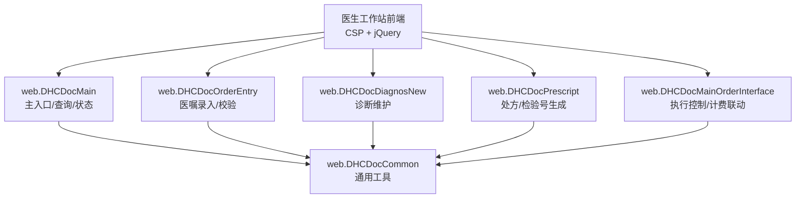
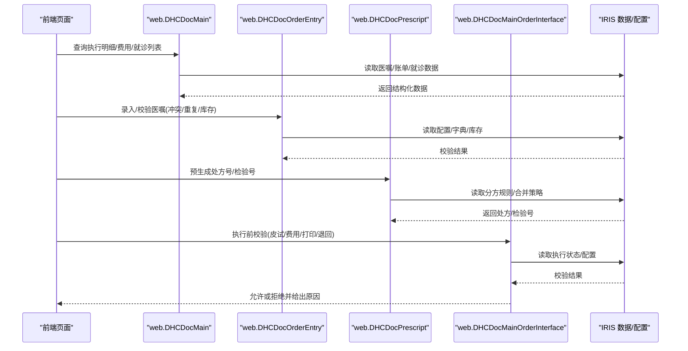
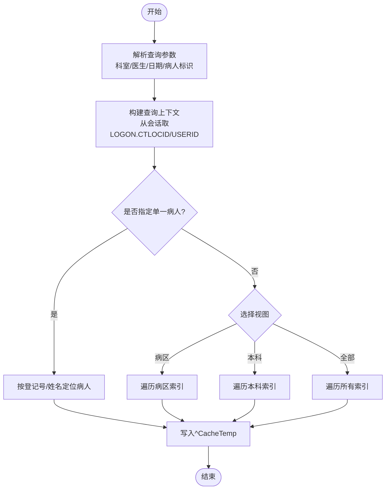
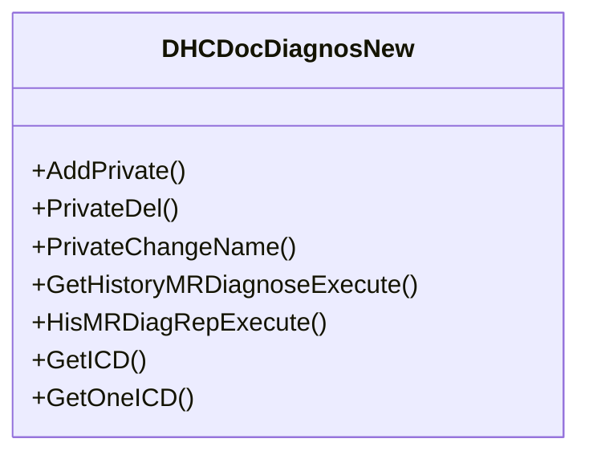
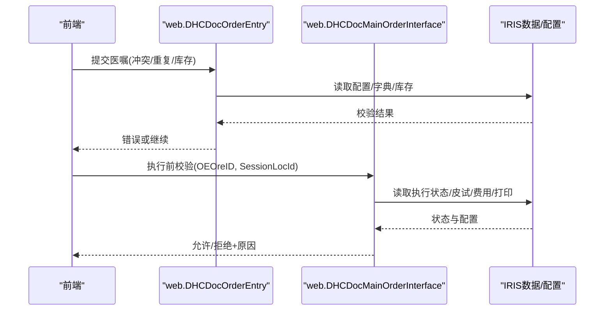
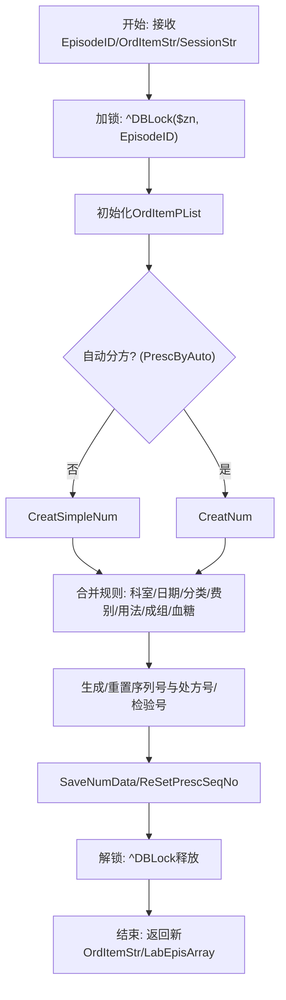
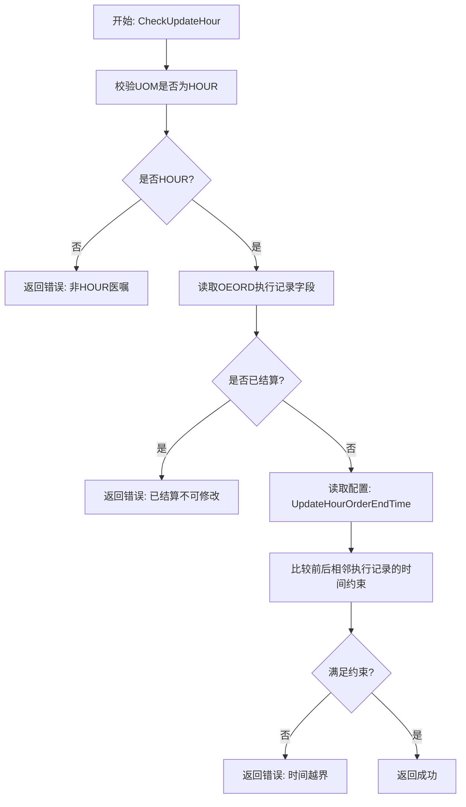
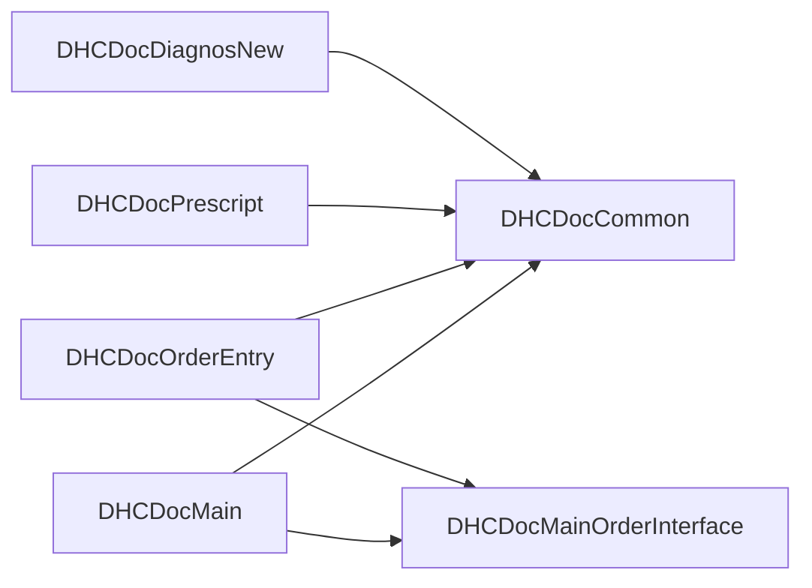

# 医生工作站接口

<cite>
**本文引用的文件**
- [DHCDocMain.cls](file://src/backend/doc-ws/web/DHCDocMain.cls)
- [DHCDocCommon.cls](file://src/backend/doc-ws/web/DHCDocCommon.cls)
- [DHCDocDiagnosNew.cls](file://src/backend/doc-ws/web/DHCDocDiagnosNew.cls)
- [DHCDocPrescript.cls](file://src/backend/doc-ws/web/DHCDocPrescript.cls)
- [DHCDocOrderEntry.cls](file://src/backend/doc-ws/web/DHCDocOrderEntry.cls)
- [DHCDocMainOrderInterface.cls](file://src/backend/doc-ws/web/DHCDocMainOrderInterface.cls)
- [README.md](file://README.md)
</cite>

## 目录
1. [简介](#简介)
2. [项目结构](#项目结构)
3. [核心组件](#核心组件)
4. [架构总览](#架构总览)
5. [详细组件分析](#详细组件分析)
6. [依赖关系分析](#依赖关系分析)
7. [性能考虑](#性能考虑)
8. [故障排查指南](#故障排查指南)
9. [结论](#结论)
10. [附录](#附录)

## 简介
本文件面向“医生工作站Web服务接口”的集成与使用，聚焦门诊与住院医生工作流的核心能力：患者信息查询、诊断录入、医嘱管理（含冲突检查、库存校验、重复项提示）、处方管理（处方号/检验号生成与合并规则）等。文档以代码实现为依据，说明各接口的职责边界、数据流转、权限与认证要点、错误处理机制及版本兼容性注意事项，并提供调用示例与流程图帮助理解。

## 项目结构
后端采用 InterSystems IRIS ObjectScript 实现，医生工作站相关逻辑集中在 doc-ws/web 目录下的多个类中；前端通过 CSP/JQuery 访问这些服务。整体遵循“按业务域拆分类”的组织方式，如主流程、公共方法、诊断、处方、医嘱录入与执行控制等。

图表来源
- [README.md:10-35](file://README.md#L10-L35)
- [DHCDocMain.cls:1-10](file://src/backend/doc-ws/web/DHCDocMain.cls#L1-L10)
- [DHCDocOrderEntry.cls:1-10](file://src/backend/doc-ws/web/DHCDocOrderEntry.cls#L1-L10)
- [DHCDocDiagnosNew.cls:1-10](file://src/backend/doc-ws/web/DHCDocDiagnosNew.cls#L1-L10)
- [DHCDocPrescript.cls:1-10](file://src/backend/doc-ws/web/DHCDocPrescript.cls#L1-L10)
- [DHCDocMainOrderInterface.cls:1-10](file://src/backend/doc-ws/web/DHCDocMainOrderInterface.cls#L1-L10)

章节来源
- [README.md:10-35](file://README.md#L10-L35)

## 核心组件
- web.DHCDocMain：主流程与查询聚合，包含执行明细查询、费用明细查询、当前就诊列表、停嘱权限校验、小时医嘱时间修改校验等。
- web.DHCDocOrderEntry：医嘱录入控制与校验，包括剂量计算、冲突检查、重复项判断、库存校验、出院/死亡类医嘱识别等。
- web.DHCDocDiagnosNew：诊断维护，支持私有模板、历史诊断查询、ICD 获取与保存、诊断类型枚举等。
- web.DHCDocPrescript：处方与检验号预生成，支持西药/草药分方、复杂合并规则、标本号合并、序列号生成等。
- web.DHCDocMainOrderInterface：医嘱执行前置校验与业务联动，包括皮试结果、费用控制、打印条码要求、退单/退回判定、可执行性判断等。
- web.DHCDocCommon：通用工具方法，如年龄/出生日期换算、卡号查询、科室/医院信息、时间日志等。

章节来源
- [DHCDocMain.cls:1-10](file://src/backend/doc-ws/web/DHCDocMain.cls#L1-L10)
- [DHCDocOrderEntry.cls:1-10](file://src/backend/doc-ws/web/DHCDocOrderEntry.cls#L1-L10)
- [DHCDocDiagnosNew.cls:1-10](file://src/backend/doc-ws/web/DHCDocDiagnosNew.cls#L1-L10)
- [DHCDocPrescript.cls:1-10](file://src/backend/doc-ws/web/DHCDocPrescript.cls#L1-L10)
- [DHCDocMainOrderInterface.cls:1-10](file://src/backend/doc-ws/web/DHCDocMainOrderInterface.cls#L1-L10)
- [DHCDocCommon.cls:1-10](file://src/backend/doc-ws/web/DHCDocCommon.cls#L1-L10)

## 架构总览
医生工作站 Web 服务基于 IRIS CSP 暴露，前端通过页面脚本发起请求，后端类方法作为服务入口，内部再调用数据库表、配置与外部系统（如 LIS/PACS、护理执行、计费）。

图表来源
- [DHCDocMain.cls:1-10](file://src/backend/doc-ws/web/DHCDocMain.cls#L1-L10)
- [DHCDocOrderEntry.cls:1-10](file://src/backend/doc-ws/web/DHCDocOrderEntry.cls#L1-L10)
- [DHCDocPrescript.cls:1-10](file://src/backend/doc-ws/web/DHCDocPrescript.cls#L1-L10)
- [DHCDocMainOrderInterface.cls:1-10](file://src/backend/doc-ws/web/DHCDocMainOrderInterface.cls#L1-L10)

## 详细组件分析

### 患者信息查询与就诊列表
- 功能要点
  - 根据登录科室/医生、日期范围、病人编号/姓名等条件查询当前就诊列表。
  - 支持病区/本科/全病区等不同视图过滤。
  - 输出就诊关键信息（如就诊号、到达/离开时间、床号、优先级等）。
- 典型调用路径
  - 前端调用 DHCDocMain.FindLocDocCurrentAdmExecute 进行查询。
  - 内部根据会话信息（LOGON.CTLOCID、LOGON.USERID）构建查询上下文，遍历 PAADMi 索引并按条件筛选。
- 数据流向
  - 输入：LocID、UserID、PatientNo、SurName、StartDate、EndDate、ArrivedQue、MedUnit 等。
  - 处理：按病区/医生/日期维度聚合，必要时结合护士站/产房特殊逻辑。
  - 输出：缓存临时表 ^CacheTemp 中的行集合，供分页拉取。
- 权限与安全
  - 依赖会话 LOGON.CTLOCID、LOGON.USERID 限定可见范围。
- 错误处理
  - 参数为空时直接返回空结果集。
  - 未找到对应医生或病区时返回空结果。

图表来源
- [DHCDocMain.cls:475-766](file://src/backend/doc-ws/web/DHCDocMain.cls#L475-L766)

章节来源
- [DHCDocMain.cls:475-766](file://src/backend/doc-ws/web/DHCDocMain.cls#L475-L766)

### 诊断录入与管理
- 功能要点
  - 支持私有诊断模板增删改查、按用户/科室维度组织。
  - 历史诊断查询（支持 ICD 类型过滤、分组展示、排序）。
  - ICD 条目获取与保存，支持综合征组合、活动期过滤、翻译描述。
- 典型调用路径
  - 新增/删除/改名：AddPrivate / PrivateDel / PrivateChangeName。
  - 历史查询：GetHistoryMRDiagnoseExecute / HisMRDiagRepExecute。
  - ICD 获取：GetICD / GetOneICD。
- 数据流向
  - 输入：USERID、CTLOCID、INDEXNum、PatientID、ICDType、CurDep 等。
  - 处理：读取 MR/MRC 字典、活动期、分组、翻译，组装结果。
  - 输出：字符串拼接或 Query 结果集。
- 权限与安全
  - 私有模板按 USERID/CTLOCID 隔离。
- 错误处理
  - 名称重复检测、SQLCODE 回传。

图表来源
- [DHCDocDiagnosNew.cls:16-75](file://src/backend/doc-ws/web/DHCDocDiagnosNew.cls#L16-L75)
- [DHCDocDiagnosNew.cls:319-430](file://src/backend/doc-ws/web/DHCDocDiagnosNew.cls#L319-L430)
- [DHCDocDiagnosNew.cls:445-538](file://src/backend/doc-ws/web/DHCDocDiagnosNew.cls#L445-L538)
- [DHCDocDiagnosNew.cls:169-277](file://src/backend/doc-ws/web/DHCDocDiagnosNew.cls#L169-L277)

章节来源
- [DHCDocDiagnosNew.cls:16-75](file://src/backend/doc-ws/web/DHCDocDiagnosNew.cls#L16-L75)
- [DHCDocDiagnosNew.cls:319-430](file://src/backend/doc-ws/web/DHCDocDiagnosNew.cls#L319-L430)
- [DHCDocDiagnosNew.cls:445-538](file://src/backend/doc-ws/web/DHCDocDiagnosNew.cls#L445-L538)
- [DHCDocDiagnosNew.cls:169-277](file://src/backend/doc-ws/web/DHCDocDiagnosNew.cls#L169-L277)

### 医嘱管理与执行控制
- 功能要点
  - 医嘱录入：冲突检查、重复项提示、库存校验、剂量计算、出院/死亡类识别。
  - 执行控制：皮试阳性拦截、费用不足拦截、打印条码要求、退单/退回判定、可执行性综合判断。
- 典型调用路径
  - 冲突检查：CheckConflict。
  - 重复项：FindSameOrderItem / FindSameOutOrderItem。
  - 库存校验：CheckStockEnough。
  - 执行前校验：IsCanExecOrdArrear / CheckFeeControl。
- 数据流向
  - 输入：EpisodeID、ARCIMRowid、OEOreID、SessionLocId、execDate/execTime 等。
  - 处理：读取 OE_OrdItem/OEORD、配置表、护理执行、计费模块。
  - 输出：布尔/错误码与消息。
- 权限与安全
  - 依据会话与科室/医生角色限制操作。
- 错误处理
  - 返回具体错误码（如费用不足、皮试异常、未打印条码等），便于前端提示。

图表来源
- [DHCDocOrderEntry.cls:178-351](file://src/backend/doc-ws/web/DHCDocOrderEntry.cls#L178-L351)
- [DHCDocMainOrderInterface.cls:526-734](file://src/backend/doc-ws/web/DHCDocMainOrderInterface.cls#L526-L734)

章节来源
- [DHCDocOrderEntry.cls:178-351](file://src/backend/doc-ws/web/DHCDocOrderEntry.cls#L178-L351)
- [DHCDocMainOrderInterface.cls:526-734](file://src/backend/doc-ws/web/DHCDocMainOrderInterface.cls#L526-L734)

### 处方管理与生成
- 功能要点
  - 预生成处方号/检验号，支持西药/草药分方。
  - 复杂合并规则：按接收科室、开始日期、处方分类、费别、用法组、成组医嘱、血糖分组、通知临床等维度合并。
  - 序列号生成与重置，检验号合并与去重。
- 典型调用路径
  - 入口：CreatOrdNo。
  - 规则计算：CreatSimpleNum / CreatNum。
  - 结果整理：SaveNumData / ReSetPrescSeqNo。
  - 合并算法：MergeLabQue / MergePrescQue / MergePrescGroupQue。
- 数据流向
  - 输入：EpisodeID、OrdItemStr、SessionStr、PrescType。
  - 处理：解析 OrdItemPList，应用配置规则，生成/合并处方号与检验号。
  - 输出：更新后的 OrdItemStr、LabEpisArray。
- 并发与一致性
  - 使用锁 ^DBLock($zn, EpisodeID) 保证同一就诊的并发安全。
- 错误处理
  - 并发失败记录日志；返回空串表示失败。

图表来源
- [DHCDocPrescript.cls:22-75](file://src/backend/doc-ws/web/DHCDocPrescript.cls#L22-L75)
- [DHCDocPrescript.cls:206-310](file://src/backend/doc-ws/web/DHCDocPrescript.cls#L206-L310)
- [DHCDocPrescript.cls:311-554](file://src/backend/doc-ws/web/DHCDocPrescript.cls#L311-L554)
- [DHCDocPrescript.cls:581-770](file://src/backend/doc-ws/web/DHCDocPrescript.cls#L581-L770)
- [DHCDocPrescript.cls:773-800](file://src/backend/doc-ws/web/DHCDocPrescript.cls#L773-L800)

章节来源
- [DHCDocPrescript.cls:22-75](file://src/backend/doc-ws/web/DHCDocPrescript.cls#L22-L75)
- [DHCDocPrescript.cls:206-310](file://src/backend/doc-ws/web/DHCDocPrescript.cls#L206-L310)
- [DHCDocPrescript.cls:311-554](file://src/backend/doc-ws/web/DHCDocPrescript.cls#L311-L554)
- [DHCDocPrescript.cls:581-770](file://src/backend/doc-ws/web/DHCDocPrescript.cls#L581-L770)
- [DHCDocPrescript.cls:773-800](file://src/backend/doc-ws/web/DHCDocPrescript.cls#L773-L800)

### 小时医嘱时间修改校验
- 功能要点
  - 仅 HOUR 单位医嘱可修改结束时间。
  - 已结算执行记录不可修改。
  - 结束时间需满足前后相邻执行记录的约束，且受医嘱停止时间限制。
- 典型调用路径
  - CheckUpdateHour(oeore, endTime, HospId)。
- 数据流向
  - 输入：执行记录 rowid、目标结束时间、医院 ID。
  - 处理：读取 ARCIM/UOM、OEORD 字段、配置节点 UpdateHourOrderEndTime。
  - 输出：成功或中文提示信息。
- 错误处理
  - 返回明确的中文提示，如“不是HOUR医嘱”“已经结算的执行记录不能修改时间”等。

图表来源
- [DHCDocMain.cls:208-293](file://src/backend/doc-ws/web/DHCDocMain.cls#L208-L293)

章节来源
- [DHCDocMain.cls:208-293](file://src/backend/doc-ws/web/DHCDocMain.cls#L208-L293)

### 停嘱权限校验
- 功能要点
  - 校验当前用户是否有权停止指定医嘱项。
  - 若无权，返回被停医嘱名称以便前端提示。
- 典型调用路径
  - CheckStopPermission(ids)。
- 数据流向
  - 输入：医嘱项 rowid 列表。
  - 处理：逐条调用 appcom.OEOrdItem.CheckStopPermission。
  - 输出：成功或错误消息。

章节来源
- [DHCDocMain.cls:295-315](file://src/backend/doc-ws/web/DHCDocMain.cls#L295-L315)

## 依赖关系分析
- 组件耦合
  - DHCDocMain 依赖 DHCDocCommon 提供通用工具，依赖 DHCDocMainOrderInterface 进行执行控制。
  - DHCDocOrderEntry 与 DHCDocMainOrderInterface 在“执行前校验”环节形成协作。
  - DHCDocPrescript 依赖配置与字典，同时与 DHCDocOrderEntry 共享部分规则（如药房/检验项分类）。
- 外部依赖
  - 护理执行（Nur.NIS.Service.*）用于打印条码要求、执行状态。
  - 计费/欠费管理（UDHCJFARREARSMANAGE）用于费用控制。
  - LIS/PACS 通过接口方法（如 DHCDocInterfaceMethod）获取检验/影像相关信息。
- 潜在循环依赖
  - 通过统一基类 RegisteredObject 与公共方法解耦，避免直接循环引用。

图表来源
- [DHCDocMain.cls:1-10](file://src/backend/doc-ws/web/DHCDocMain.cls#L1-L10)
- [DHCDocOrderEntry.cls:1-10](file://src/backend/doc-ws/web/DHCDocOrderEntry.cls#L1-L10)
- [DHCDocPrescript.cls:1-10](file://src/backend/doc-ws/web/DHCDocPrescript.cls#L1-L10)
- [DHCDocDiagnosNew.cls:1-10](file://src/backend/doc-ws/web/DHCDocDiagnosNew.cls#L1-L10)
- [DHCDocCommon.cls:1-10](file://src/backend/doc-ws/web/DHCDocCommon.cls#L1-L10)

章节来源
- [DHCDocMain.cls:1-10](file://src/backend/doc-ws/web/DHCDocMain.cls#L1-L10)
- [DHCDocOrderEntry.cls:1-10](file://src/backend/doc-ws/web/DHCDocOrderEntry.cls#L1-L10)
- [DHCDocPrescript.cls:1-10](file://src/backend/doc-ws/web/DHCDocPrescript.cls#L1-L10)
- [DHCDocDiagnosNew.cls:1-10](file://src/backend/doc-ws/web/DHCDocDiagnosNew.cls#L1-L10)
- [DHCDocCommon.cls:1-10](file://src/backend/doc-ws/web/DHCDocCommon.cls#L1-L10)

## 性能考虑
- 查询优化
  - 使用 ^CacheTemp 缓存中间结果，减少重复计算。
  - 利用索引（如 PAADMi、OEORDi）加速遍历。
- 并发控制
  - 处方生成使用 ^DBLock 锁定就诊级资源，避免并发冲突。
- 批量处理
  - 对大量医嘱项的分方与合并采用两次循环预处理与合并，降低复杂度。
- 建议
  - 合理设置查询参数（日期范围、科室/医生），避免全量扫描。
  - 对高频接口增加缓存与分页拉取。

[本节为通用指导，不直接分析具体文件]

## 故障排查指南
- 常见错误场景
  - 费用不足：执行前校验返回特定错误码，前端应提示充值或调整医嘱。
  - 皮试阳性：执行前校验拦截，需等待结果转阴或更换方案。
  - 未打印条码：检验医嘱需先打印条码方可执行。
  - 重复/冲突医嘱：录入阶段提示已有相同或互斥医嘱，需调整。
  - 停嘱无权限：返回被停医嘱名称，提示联系授权人员。
- 排查步骤
  - 确认会话信息（LOGON.CTLOCID、LOGON.USERID）是否正确。
  - 检查配置节点（如 UpdateHourOrderEndTime、PrescByAuto、SkinTestInstr）。
  - 查看执行记录状态（OEORD/OEORE 字段）与护理执行状态。
  - 核对费用与欠费管理返回值。
- 日志与调试
  - 关注 ^Tempscl 与 ^gry 等调试节点记录的关键参数。
  - 使用 SQLCODE 与自定义错误码定位问题。

章节来源
- [DHCDocMainOrderInterface.cls:526-734](file://src/backend/doc-ws/web/DHCDocMainOrderInterface.cls#L526-L734)
- [DHCDocMain.cls:208-293](file://src/backend/doc-ws/web/DHCDocMain.cls#L208-L293)
- [DHCDocOrderEntry.cls:178-351](file://src/backend/doc-ws/web/DHCDocOrderEntry.cls#L178-L351)

## 结论
医生工作站 Web 服务围绕“患者—诊断—医嘱—处方—执行”的主线，提供了完整的门诊与住院工作流支撑。通过清晰的类职责划分与严格的校验规则，保障了医疗业务的准确性与安全性。建议在集成时重点关注会话权限、配置节点、并发控制与错误码映射，并结合实际业务场景进行参数调优与扩展。

[本节为总结，不直接分析具体文件]

## 附录
- 认证与会话管理
  - 依赖 IRIS 会话对象 %session 获取 LOGON.CTLOCID、LOGON.USERID、LOGON.HOSPID 等上下文。
  - 不同产品/命名空间可通过配置切换（参考 README 中的服务器与命名空间配置）。
- 接口版本兼容性
  - 通过 %IsValidMethod 动态探测可选方法，兼容新旧版本差异。
  - 对外部系统调用封装于 DHCDocInterfaceMethod，便于替换实现。
- 调用示例（概念性）
  - 查询当前就诊列表：传入 LocID、UserID、日期范围，返回 ^CacheTemp 中的就诊行。
  - 录入医嘱：传入 EpisodeID、ARCIMRowid、剂量/频次/疗程，返回冲突/重复/库存检查结果。
  - 生成处方号：传入 EpisodeID、OrdItemStr、SessionStr，返回更新后的医嘱串与检验号数组。
  - 执行前校验：传入 OEOreID、SessionLocId，返回允许或拒绝及原因。

章节来源
- [README.md:152-200](file://README.md#L152-L200)
- [DHCDocMainOrderInterface.cls:30-81](file://src/backend/doc-ws/web/DHCDocMainOrderInterface.cls#L30-L81)