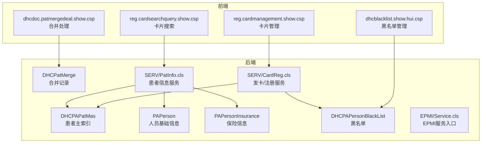
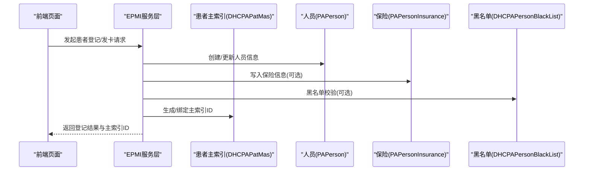
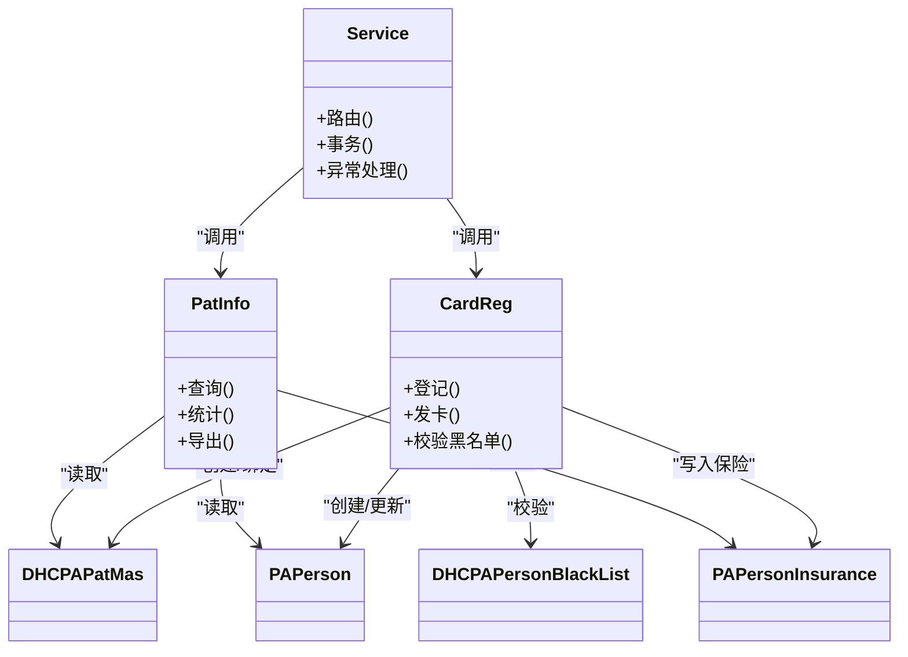
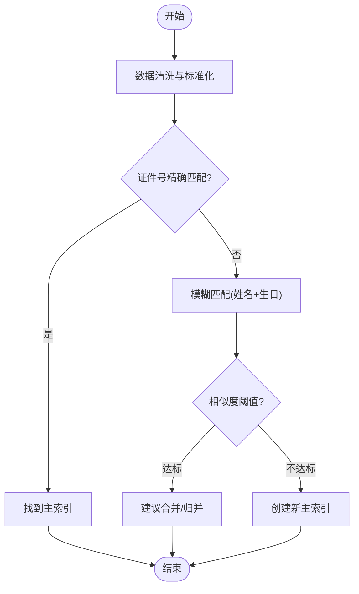
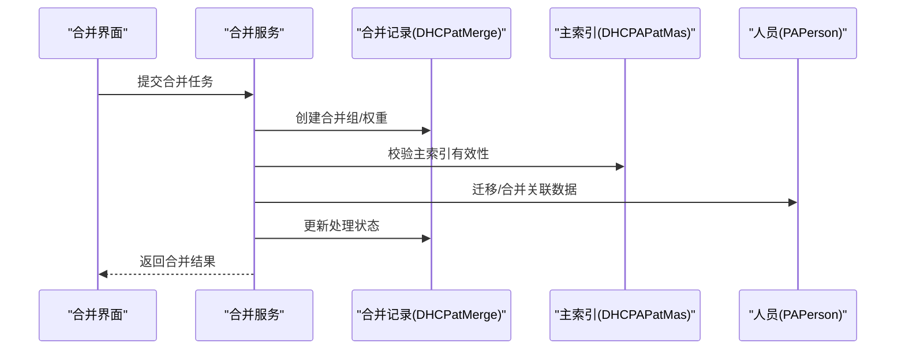
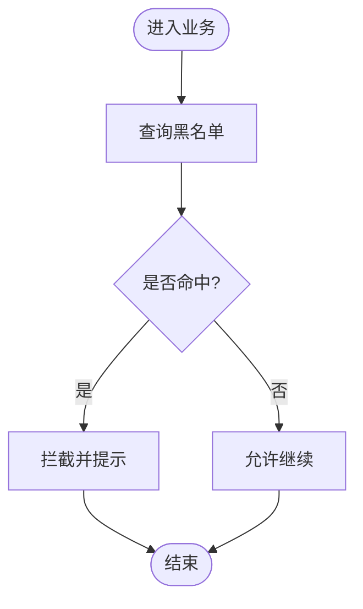
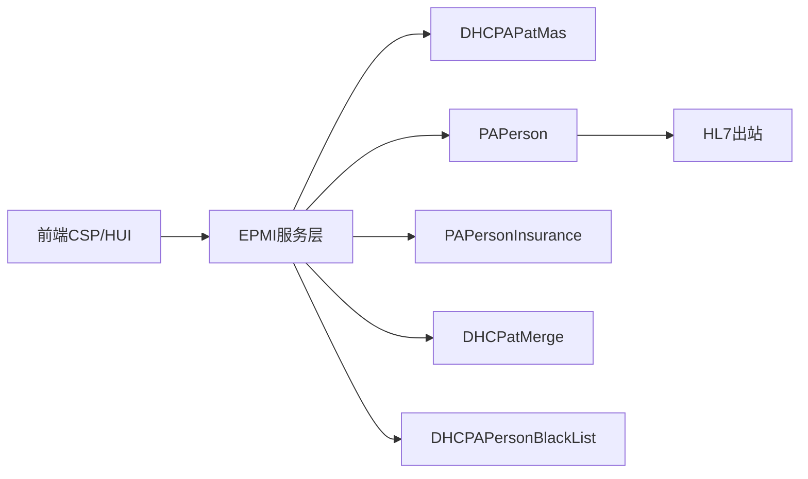

# 患者主索引 (epmi-mc)

<cite>
**本文引用的文件**
- [DHCPAPatMas.cls](file://src/backend/epmi-mc/User/DHCPAPatMas.cls)
- [PAPerson.cls](file://src/backend/epmi-mc/User/PAPerson.cls)
- [PAPersonInsurance.cls](file://src/backend/epmi-mc/User/PAPersonInsurance.cls)
- [DHCPatMerge.cls](file://src/backend/epmi-mc/User/DHCPatMerge.cls)
- [DHCPAPersonBlackList.cls](file://src/backend/epmi-mc/User/DHCPAPersonBlackList.cls)
- [CardReg.cls](file://src/backend/epmi-mc/DHCDoc/EPMI/SERV/CardReg.cls)
- [PatInfo.cls](file://src/backend/epmi-mc/DHCDoc/EPMI/SERV/PatInfo.cls)
- [Service.cls](file://src/backend/epmi-mc/DHCDoc/EPMI/Service.cls)
- [reg.cardmanagement.show.csp](file://src/frontend/epmi-mc/csp/reg.cardmanagement.show.csp)
- [reg.cardsearchquery.show.csp](file://src/frontend/epmi-mc/csp/reg.cardsearchquery.show.csp)
- [dhcdoc.patmergedeal.show.csp](file://src/frontend/epmi-mc/csp/dhcdoc.patmergedeal.show.csp)
- [dhcblacklist.show.hui.csp](file://src/frontend/epmi-mc/csp/dhcblacklist.show.hui.csp)
</cite>

## 目录
1. [简介](#简介)
2. [项目结构](#项目结构)
3. [核心组件](#核心组件)
4. [架构总览](#架构总览)
5. [详细组件分析](#详细组件分析)
6. [依赖关系分析](#依赖关系分析)
7. [性能考虑](#性能考虑)
8. [故障排查指南](#故障排查指南)
9. [结论](#结论)
10. [附录](#附录)

## 简介
本模块为患者主索引（EPMI）子系统，负责患者身份识别、主索引维护、数据整合与清洗、患者卡管理、保险信息、黑名单管控等。通过统一的患者主索引模型与合并策略，解决多系统间患者数据一致性与完整性问题，并提供查询、统计与导出等工具能力。

## 项目结构
- 后端领域模型与服务
  - 患者主索引实体：DHCPAPatMas
  - 人员基础信息：PAPerson
  - 保险信息：PAPersonInsurance
  - 合并记录：DHCPatMerge
  - 黑名单：DHCPAPersonBlackList
  - EPMI服务层：SERV/CardReg.cls、SERV/PatInfo.cls、EPMI/Service.cls
- 前端页面
  - 卡片管理、搜索查询、合并处理、黑名单管理等CSP/HUI页面

图表来源
- [DHCPAPatMas.cls:1-585](file://src/backend/epmi-mc/User/DHCPAPatMas.cls#L1-L585)
- [PAPerson.cls:1-800](file://src/backend/epmi-mc/User/PAPerson.cls#L1-L800)
- [PAPersonInsurance.cls:1-256](file://src/backend/epmi-mc/User/PAPersonInsurance.cls#L1-L256)
- [DHCPatMerge.cls:1-104](file://src/backend/epmi-mc/User/DHCPatMerge.cls#L1-L104)
- [DHCPAPersonBlackList.cls:1-173](file://src/backend/epmi-mc/User/DHCPAPersonBlackList.cls#L1-L173)
- [CardReg.cls](file://src/backend/epmi-mc/DHCDoc/EPMI/SERV/CardReg.cls)
- [PatInfo.cls](file://src/backend/epmi-mc/DHCDoc/EPMI/SERV/PatInfo.cls)
- [Service.cls](file://src/backend/epmi-mc/DHCDoc/EPMI/Service.cls)
- [reg.cardmanagement.show.csp](file://src/frontend/epmi-mc/csp/reg.cardmanagement.show.csp)
- [reg.cardsearchquery.show.csp](file://src/frontend/epmi-mc/csp/reg.cardsearchquery.show.csp)
- [dhcdoc.patmergedeal.show.csp](file://src/frontend/epmi-mc/csp/dhcdoc.patmergedeal.show.csp)
- [dhcblacklist.show.hui.csp](file://src/frontend/epmi-mc/csp/dhcblacklist.show.hui.csp)

章节来源
- [DHCPAPatMas.cls:1-585](file://src/backend/epmi-mc/User/DHCPAPatMas.cls#L1-L585)
- [PAPerson.cls:1-800](file://src/backend/epmi-mc/User/PAPerson.cls#L1-L800)
- [PAPersonInsurance.cls:1-256](file://src/backend/epmi-mc/User/PAPersonInsurance.cls#L1-L256)
- [DHCPatMerge.cls:1-104](file://src/backend/epmi-mc/User/DHCPatMerge.cls#L1-L104)
- [DHCPAPersonBlackList.cls:1-173](file://src/backend/epmi-mc/User/DHCPAPersonBlackList.cls#L1-L173)

## 核心组件
- 患者主索引（DHCPAPatMas）
  - 承载患者主索引关键属性（如就诊卡号、证件号、联系方式、医保类别、特殊人群标识等），并定义持久化存储与索引映射，支撑跨系统唯一标识与检索。
- 人员基础信息（PAPerson）
  - 通用人员主数据，包含姓名、性别、出生日期、地址、电话、国籍、紧急联系人等，并通过触发器联动HL7出站消息，保障外部系统同步。
- 保险信息（PAPersonInsurance）
  - 与人员一对多关联，记录保险类型、起止日期、限额、照片附件、代理公司等，支持团险与商业险等多场景。
- 合并记录（DHCPatMerge）
  - 记录待合并或已合并的候选组、权重系数与处理状态，为去重与合并提供审计与回溯依据。
- 黑名单（DHCPAPersonBlackList）
  - 记录高风险/受限人员，支持按身份证号、手机号、主索引ID等多维度索引，具备有效期与高危险标志。

章节来源
- [DHCPAPatMas.cls:1-585](file://src/backend/epmi-mc/User/DHCPAPatMas.cls#L1-L585)
- [PAPerson.cls:1-800](file://src/backend/epmi-mc/User/PAPerson.cls#L1-L800)
- [PAPersonInsurance.cls:1-256](file://src/backend/epmi-mc/User/PAPersonInsurance.cls#L1-L256)
- [DHCPatMerge.cls:1-104](file://src/backend/epmi-mc/User/DHCPatMerge.cls#L1-L104)
- [DHCPAPersonBlackList.cls:1-173](file://src/backend/epmi-mc/User/DHCPAPersonBlackList.cls#L1-L173)

## 架构总览
EPMI采用“服务层 + 领域模型”的分层设计：
- 服务层（SERV）暴露业务操作（如发卡、信息查询），封装事务与校验逻辑。
- 领域模型（User.*）定义数据实体与约束，配合SQL存储与索引优化查询。
- 前端CSP/HUI页面驱动用户交互，调用服务层完成登记、查询、合并、黑名单管理等流程。

图表来源
- [CardReg.cls](file://src/backend/epmi-mc/DHCDoc/EPMI/SERV/CardReg.cls)
- [PatInfo.cls](file://src/backend/epmi-mc/DHCDoc/EPMI/SERV/PatInfo.cls)
- [Service.cls](file://src/backend/epmi-mc/DHCDoc/EPMI/Service.cls)
- [DHCPAPatMas.cls:1-585](file://src/backend/epmi-mc/User/DHCPAPatMas.cls#L1-L585)
- [PAPerson.cls:1-800](file://src/backend/epmi-mc/User/PAPerson.cls#L1-L800)
- [PAPersonInsurance.cls:1-256](file://src/backend/epmi-mc/User/PAPersonInsurance.cls#L1-L256)
- [DHCPAPersonBlackList.cls:1-173](file://src/backend/epmi-mc/User/DHCPAPersonBlackList.cls#L1-L173)

## 详细组件分析

### 患者主索引（DHCPAPatMas）
- 职责：集中存储患者主索引相关字段（如就诊卡号、证件号、联系方式、医保类别、特殊人群标记等），提供持久化与索引映射，支撑快速检索与跨系统关联。
- 关键点：
  - 使用SQL存储与自定义索引（如ARTNo索引），提升特定字段查询性能。
  - 通过全局节点与分片存储策略，保证大数据量下的可扩展性。
- 典型用法：
  - 登记时生成或绑定主索引ID；
  - 查询时基于卡号/证件号/ARTNo等快速定位；
  - 与其他系统对接时作为统一外键引用。

章节来源
- [DHCPAPatMas.cls:1-585](file://src/backend/epmi-mc/User/DHCPAPatMas.cls#L1-L585)

### 人员基础信息（PAPerson）
- 职责：维护人员基础档案，包括身份信息、联系方式、地址、国籍、紧急联系人等。
- 关键点：
  - 计算字段（如年龄）与派生字段（如姓氏）简化展示与统计。
  - 触发器在插入/更新/删除时触发HL7出站消息，确保外部系统一致性。
- 典型用法：
  - 新患者建档；
  - 信息变更留痕与同步；
  - 与主索引建立一对一或一对多关联。

章节来源
- [PAPerson.cls:1-800](file://src/backend/epmi-mc/User/PAPerson.cls#L1-L800)

### 保险信息（PAPersonInsurance）
- 职责：记录患者的保险类型、有效期、限额、照片附件、代理公司、团险单位等。
- 关键点：
  - 与人员一对多关系，支持多条有效保险并存；
  - 流式存储图片，避免大对象影响主表性能。
- 典型用法：
  - 参保登记、续保、变更；
  - 结算与对账时的保险信息校验。

章节来源
- [PAPersonInsurance.cls:1-256](file://src/backend/epmi-mc/User/PAPersonInsurance.cls#L1-L256)

### 合并记录（DHCPatMerge）
- 职责：记录候选合并组、权重系数与处理状态，用于去重与合并流程的可追溯管理。
- 关键点：
  - 提供按主索引ID与合并组的索引，便于批量处理与进度跟踪。
- 典型用法：
  - 自动/手动发现重复记录；
  - 合并前评估与审批；
  - 合并后归档与审计。

章节来源
- [DHCPatMerge.cls:1-104](file://src/backend/epmi-mc/User/DHCPatMerge.cls#L1-L104)

### 黑名单（DHCPAPersonBlackList）
- 职责：管理受限/高风险人员，支持按身份证号、手机号、主索引ID等多维索引，具备有效期与高危险标志。
- 关键点：
  - 多维度索引提升拦截效率；
  - 有效期控制动态生效范围。
- 典型用法：
  - 挂号/入院前的风险拦截；
  - 业务规则中强制拒绝或提示。

章节来源
- [DHCPAPersonBlackList.cls:1-173](file://src/backend/epmi-mc/User/DHCPAPersonBlackList.cls#L1-L173)

### 服务层（CardReg / PatInfo / Service）
- CardReg：负责患者卡注册、发放、绑定主索引、黑名单校验等。
- PatInfo：提供患者信息查询、聚合展示、统计与导出接口。
- Service：EPMI服务入口，协调各子服务与领域模型，封装事务与错误处理。

图表来源
- [CardReg.cls](file://src/backend/epmi-mc/DHCDoc/EPMI/SERV/CardReg.cls)
- [PatInfo.cls](file://src/backend/epmi-mc/DHCDoc/EPMI/SERV/PatInfo.cls)
- [Service.cls](file://src/backend/epmi-mc/DHCDoc/EPMI/Service.cls)
- [DHCPAPatMas.cls:1-585](file://src/backend/epmi-mc/User/DHCPAPatMas.cls#L1-L585)
- [PAPerson.cls:1-800](file://src/backend/epmi-mc/User/PAPerson.cls#L1-L800)
- [PAPersonInsurance.cls:1-256](file://src/backend/epmi-mc/User/PAPersonInsurance.cls#L1-L256)
- [DHCPAPersonBlackList.cls:1-173](file://src/backend/epmi-mc/User/DHCPAPersonBlackList.cls#L1-L173)

### 算法与流程

#### 患者身份识别与数据清洗
- 输入：姓名、证件号、手机号、出生日期、地址等。
- 步骤：
  1) 标准化清洗（去除空格、统一大小写、规范化格式）。
  2) 相似度匹配（基于证件号精确匹配，姓名+生日模糊匹配）。
  3) 冲突检测（同一证件号重复、同名同生日冲突）。
  4) 决策：新建主索引或归并至现有主索引。
- 输出：主索引ID或合并建议。

[该图为概念流程图，无需代码来源]

#### 合并流程（去重与合并）
- 触发：自动扫描或人工提交合并任务。
- 步骤：
  1) 生成合并组与权重评分。
  2) 人工审核确认。
  3) 执行合并（保留主记录，迁移关联数据）。
  4) 记录合并日志与审计。

图表来源
- [DHCPatMerge.cls:1-104](file://src/backend/epmi-mc/User/DHCPatMerge.cls#L1-L104)
- [DHCPAPatMas.cls:1-585](file://src/backend/epmi-mc/User/DHCPAPatMas.cls#L1-L585)
- [PAPerson.cls:1-800](file://src/backend/epmi-mc/User/PAPerson.cls#L1-L800)

章节来源
- [dhcdoc.patmergedeal.show.csp](file://src/frontend/epmi-mc/csp/dhcdoc.patmergedeal.show.csp)

#### 黑名单拦截流程
- 触发：挂号/入院/结算前。
- 步骤：
  1) 根据身份证号/手机号/主索引ID检索黑名单。
  2) 判断有效期与高风险标志。
  3) 若命中则拦截并提示原因。

图表来源
- [DHCPAPersonBlackList.cls:1-173](file://src/backend/epmi-mc/User/DHCPAPersonBlackList.cls#L1-L173)

章节来源
- [dhcblacklist.show.hui.csp](file://src/frontend/epmi-mc/csp/dhcblacklist.show.hui.csp)

### 功能模块说明
- 患者信息管理
  - 新增/编辑人员信息、主索引绑定、保险信息维护。
- 主索引维护
  - 主索引ID分配、去重扫描、合并处理、历史追溯。
- 数据整合
  - 多源数据接入、清洗、标准化、冲突解决。
- 患者卡管理
  - 卡类型配置、发卡、换卡、挂失、注销、统计。
- 保险信息
  - 参保登记、续保、限额管理、附件上传。
- 黑名单
  - 添加/编辑/删除、有效期管理、高风险标记。
- 查询与统计
  - 多条件检索、报表统计、数据导出。

章节来源
- [reg.cardmanagement.show.csp](file://src/frontend/epmi-mc/csp/reg.cardmanagement.show.csp)
- [reg.cardsearchquery.show.csp](file://src/frontend/epmi-mc/csp/reg.cardsearchquery.show.csp)
- [dhcdoc.patmergedeal.show.csp](file://src/frontend/epmi-mc/csp/dhcdoc.patmergedeal.show.csp)
- [dhcblacklist.show.hui.csp](file://src/frontend/epmi-mc/csp/dhcblacklist.show.hui.csp)

## 依赖关系分析
- 耦合度
  - 服务层与领域模型松耦合，通过方法调用与实体关系解耦。
  - 前端页面仅依赖服务层API，降低直接访问数据库的风险。
- 外部依赖
  - HL7出站消息（PAPerson触发器）用于与外部系统同步。
  - 存储层使用SQL存储与全局节点，兼顾性能与扩展性。
- 潜在循环依赖
  - 当前未发现循环依赖；服务层单向依赖领域模型。

图表来源
- [PAPerson.cls:604-640](file://src/backend/epmi-mc/User/PAPerson.cls#L604-L640)
- [CardReg.cls](file://src/backend/epmi-mc/DHCDoc/EPMI/SERV/CardReg.cls)
- [PatInfo.cls](file://src/backend/epmi-mc/DHCDoc/EPMI/SERV/PatInfo.cls)
- [Service.cls](file://src/backend/epmi-mc/DHCDoc/EPMI/Service.cls)

章节来源
- [PAPerson.cls:604-640](file://src/backend/epmi-mc/User/PAPerson.cls#L604-L640)

## 性能考虑
- 索引优化
  - 针对高频查询字段（如ARTNo、身份证号、手机号）建立索引，减少全表扫描。
- 存储策略
  - 使用SQL存储与全局节点结合，合理设置ExtentSize与StreamLocation，平衡读写性能。
- 并发与事务
  - 在服务层封装事务，确保登记、合并、黑名单校验的原子性。
- 缓存与批处理
  - 对热点查询（如黑名单）可引入缓存；合并任务采用批处理降低锁竞争。
- 监控与告警
  - 记录慢查询与异常堆栈，设置阈值告警。

[本节为通用指导，无需具体文件来源]

## 故障排查指南
- 常见问题
  - 重复主索引：检查证件号唯一性与模糊匹配阈值。
  - 合并失败：核对合并组权重与关联数据迁移顺序。
  - 黑名单误拦截：验证有效期与高风险标志是否正确。
  - HL7同步失败：查看PAPerson触发器日志与出站队列。
- 排查步骤
  1) 定位前端页面与服务层日志。
  2) 检查领域模型数据一致性与索引状态。
  3) 复现问题并抓取SQL执行计划。
  4) 必要时回滚事务并恢复备份数据。

章节来源
- [PAPerson.cls:604-640](file://src/backend/epmi-mc/User/PAPerson.cls#L604-L640)
- [DHCPAPersonBlackList.cls:1-173](file://src/backend/epmi-mc/User/DHCPAPersonBlackList.cls#L1-L173)
- [DHCPatMerge.cls:1-104](file://src/backend/epmi-mc/User/DHCPatMerge.cls#L1-L104)

## 结论
EPMI模块通过清晰的分层架构与完善的领域模型，实现了患者主索引的统一管理与数据整合。借助索引优化、事务封装与HL7同步机制，保障了患者数据的一致性与完整性。未来可进一步引入更智能的去重算法与实时黑名单校验，提升用户体验与风控能力。

## 附录
- 配置建议
  - 主索引ID生成策略：建议使用自增或分布式ID，避免冲突。
  - 合并阈值：根据业务场景调整姓名与生日的相似度阈值。
  - 黑名单有效期：按政策动态调整，支持批量导入与导出。
- 数据同步策略
  - 增量同步：基于更新时间戳或触发器事件。
  - 全量同步：定期任务拉取差异数据。
  - 幂等处理：确保重复消息不影响数据一致性。
- 性能调优
  - 热点字段索引：如证件号、手机号、ARTNo。
  - 分页与懒加载：避免一次性加载大量数据。
  - 异步任务：合并与导出采用后台任务队列。

[本节为通用指导，无需具体文件来源]