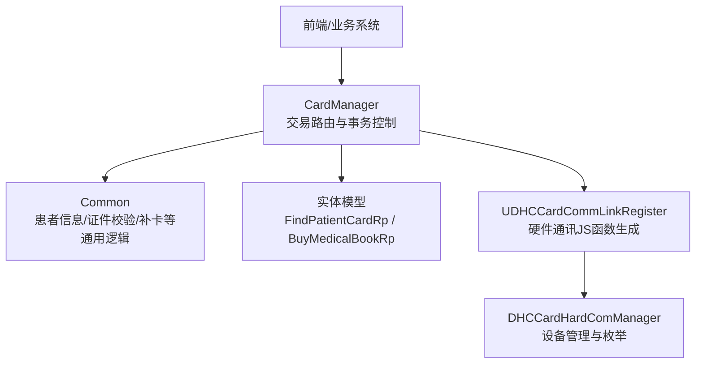
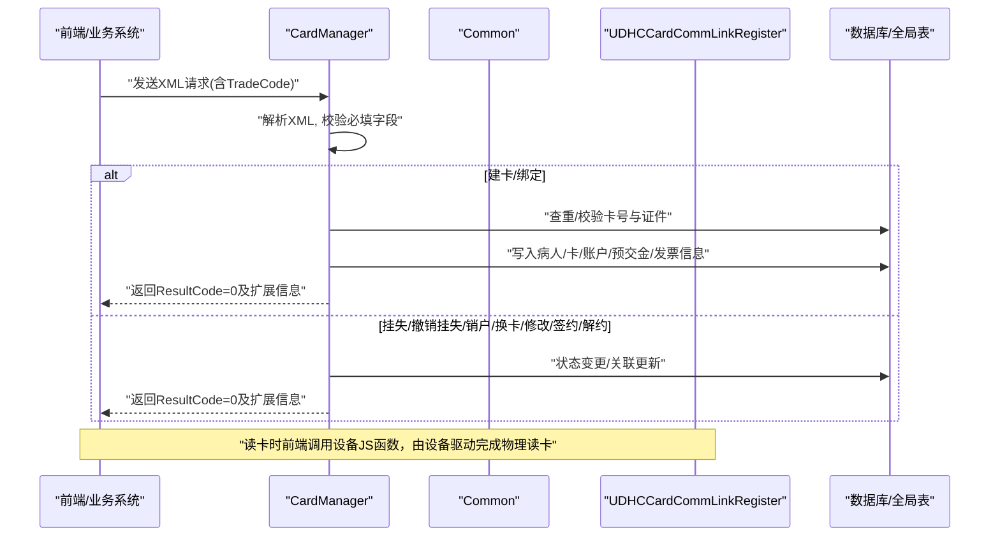
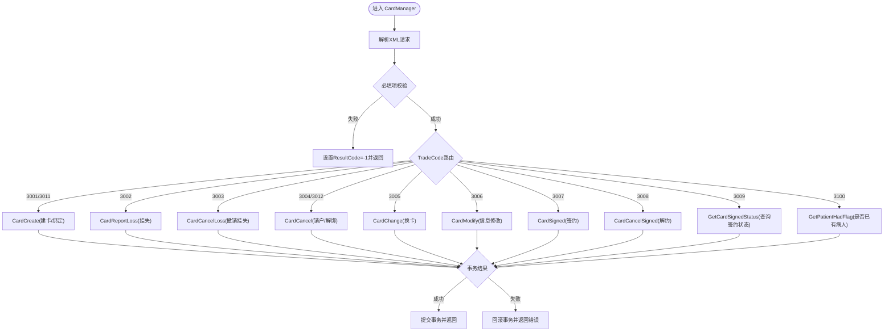
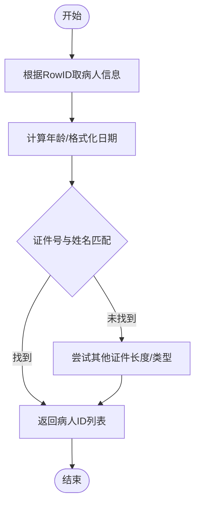
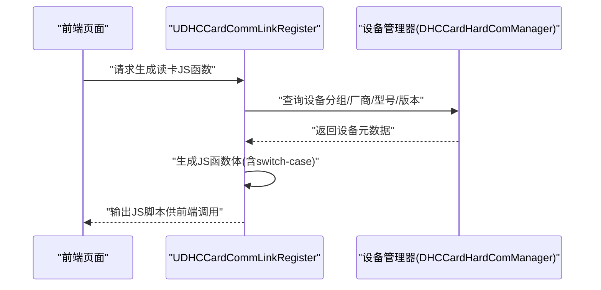
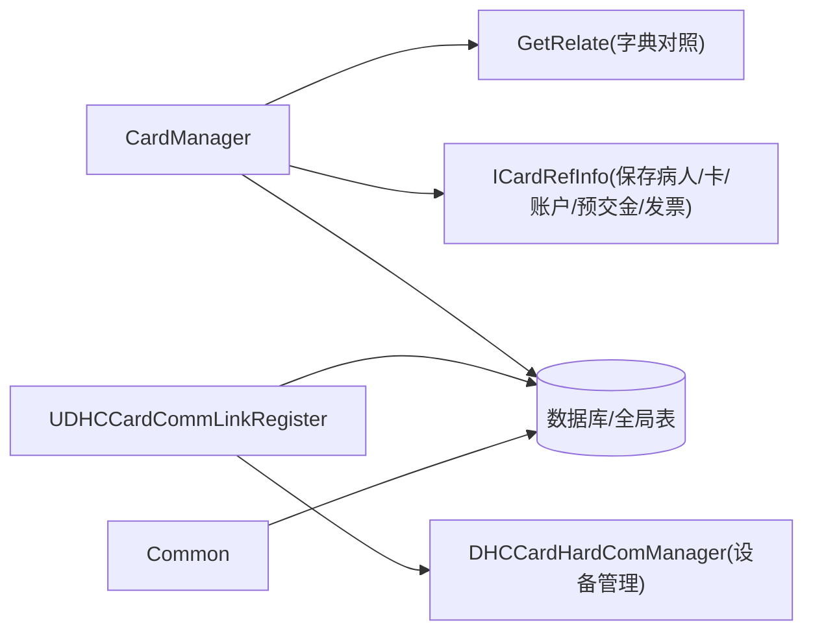

# 医保卡接口集成

<cite>
**本文引用的文件**
- [CardManager.cls](file://src/backend/public-mc/DHCExternalService/CardInterface/CardManager.cls)
- [Common.cls](file://src/backend/public-mc/DHCExternalService/CardInterface/Common.cls)
- [UDHCCardCommLinkRegister.cls](file://src/backend/public-mc/web/UDHCCardCommLinkRegister.cls)
- [DHCCardHardComManager.cls](file://src/backend/epmi-mc/User/DHCCardHardComManager.cls)
- [FindPatientCardRp.cls](file://src/backend/public-mc/DHCExternalService/CardInterface/Entity/FindPatientCardRp.cls)
- [BuyMedicalBookRp.cls](file://src/backend/public-mc/DHCExternalService/CardInterface/Entity/BuyMedicalBookRp.cls)
</cite>

## 目录
1. [简介](#简介)
2. [项目结构](#项目结构)
3. [核心组件](#核心组件)
4. [架构总览](#架构总览)
5. [详细组件分析](#详细组件分析)
6. [依赖关系分析](#依赖关系分析)
7. [性能考虑](#性能考虑)
8. [故障排查指南](#故障排查指南)
9. [结论](#结论)
10. [附录：API调用示例与数据格式](#附录api调用示例与数据格式)

## 简介
本文件面向“医保卡接口集成”的对接实现，覆盖读卡、身份验证、费用结算等核心能力，并说明医保数据格式转换、错误处理机制与异常恢复策略。文档同时提供API调用示例（请求参数、响应格式、状态码），以及安全认证与加密传输方案建议，并给出常见问题排查与性能优化建议。

## 项目结构
本项目在后端以“外部服务层 + 实体模型 + 硬件通讯适配”的方式组织医保相关能力：
- 外部服务层：统一入口与交易路由（如 CardManager）
- 实体模型：XML/JSON 适配器（如 FindPatientCardRp、BuyMedicalBookRp）
- 硬件通讯适配：设备抽象与JS函数生成（如 UDHCCardCommLinkRegister）
- 设备管理：读卡器配置与枚举（如 DHCCardHardComManager）

图表来源
- [CardManager.cls:1-118](file://src/backend/public-mc/DHCExternalService/CardInterface/CardManager.cls#L1-L118)
- [Common.cls:1-381](file://src/backend/public-mc/DHCExternalService/CardInterface/Common.cls#L1-L381)
- [UDHCCardCommLinkRegister.cls:15-318](file://src/backend/public-mc/web/UDHCCardCommLinkRegister.cls#L15-L318)
- [DHCCardHardComManager.cls:1-302](file://src/backend/epmi-mc/User/DHCCardHardComManager.cls#L1-L302)

章节来源
- [CardManager.cls:1-118](file://src/backend/public-mc/DHCExternalService/CardInterface/CardManager.cls#L1-L118)
- [UDHCCardCommLinkRegister.cls:15-318](file://src/backend/public-mc/web/UDHCCardCommLinkRegister.cls#L15-L318)
- [DHCCardHardComManager.cls:1-302](file://src/backend/epmi-mc/User/DHCCardHardComManager.cls#L1-L302)

## 核心组件
- CardManager：统一接收XML请求，解析交易类型（TradeCode），路由到具体业务方法（建卡、挂失、销户、换卡、修改、签约/解约、查询等），并进行事务提交或回滚。
- Common：提供患者基本信息获取、年龄计算、证件号与姓名匹配、补卡流程、证件类型校验、证件号有效性校验、外籍联系人信息等通用能力。
- UDHCCardCommLinkRegister：根据设备分组与功能类型动态生成前端可调用的JS函数，屏蔽不同厂商/类型的读卡设备差异；支持读取、写卡、条形码、语音提示、密码键盘、身份证读取等。
- DHCCardHardComManager：设备管理持久化类，维护设备组、厂商/型号/版本、激活状态、自定义JS等，并提供按组查询能力。
- Entity 模型：FindPatientCardRp、BuyMedicalBookRp 等用于XML序列化/反序列化的请求/响应对象。

章节来源
- [CardManager.cls:1-118](file://src/backend/public-mc/DHCExternalService/CardInterface/CardManager.cls#L1-L118)
- [Common.cls:1-381](file://src/backend/public-mc/DHCExternalService/CardInterface/Common.cls#L1-L381)
- [UDHCCardCommLinkRegister.cls:15-318](file://src/backend/public-mc/web/UDHCCardCommLinkRegister.cls#L15-L318)
- [DHCCardHardComManager.cls:1-302](file://src/backend/epmi-mc/User/DHCCardHardComManager.cls#L1-L302)
- [FindPatientCardRp.cls:1-20](file://src/backend/public-mc/DHCExternalService/CardInterface/Entity/FindPatientCardRp.cls#L1-L20)
- [BuyMedicalBookRp.cls:1-17](file://src/backend/public-mc/DHCExternalService/CardInterface/Entity/BuyMedicalBookRp.cls#L1-L17)

## 架构总览
整体采用“请求解析 -> 交易路由 -> 业务执行 -> 事务控制 -> 响应组装”的分层模式。硬件侧通过设备抽象层将不同读卡器封装为统一JS接口，前端按需加载。

图表来源
- [CardManager.cls:1-118](file://src/backend/public-mc/DHCExternalService/CardInterface/CardManager.cls#L1-L118)
- [UDHCCardCommLinkRegister.cls:15-318](file://src/backend/public-mc/web/UDHCCardCommLinkRegister.cls#L15-L318)

## 详细组件分析

### 组件A：CardManager（交易路由与事务控制）
- 职责：解析XML请求，提取交易类型（TradeCode）、银行代码（BankCode）、患者卡号、证件信息等；进行基础校验后路由至具体方法（建卡、挂失、销户、换卡、修改、签约/解约、查询等）。
- 事务：对建卡、挂失、销户、换卡、修改、签约/解约等关键操作使用事务，成功提交，失败回滚。
- 错误处理：统一封装 ResultCode 与 ErrorMsg；对特定错误码（如重复卡、无效状态）进行映射与提示。
- 扩展点：通过 GetRelate 做银行代码与HIS字典的对照（证件类型、性别、婚姻状况、民族、职业、国籍、邮编等）。

图表来源
- [CardManager.cls:1-118](file://src/backend/public-mc/DHCExternalService/CardInterface/CardManager.cls#L1-L118)

章节来源
- [CardManager.cls:1-118](file://src/backend/public-mc/DHCExternalService/CardInterface/CardManager.cls#L1-L118)

### 组件B：Common（通用能力）
- 患者信息：根据病人RowID获取姓名、性别、出生日期、年龄、证件类型、证件号、医保号等。
- 证件校验：检查证件类型是否启用、有效期；身份证号格式校验；根据证件号+姓名查找病人。
- 补卡流程：作废旧卡、新增新卡、更新账户与发票信息、必要时调用平台接口通知。
- 外籍联系人：根据年龄阈值要求填写完整联系人信息并校验其证件有效性。

图表来源
- [Common.cls:1-381](file://src/backend/public-mc/DHCExternalService/CardInterface/Common.cls#L1-L381)

章节来源
- [Common.cls:1-381](file://src/backend/public-mc/DHCExternalService/CardInterface/Common.cls#L1-L381)

### 组件C：UDHCCardCommLinkRegister（硬件通讯适配）
- 目标：屏蔽多厂商读卡设备的差异，动态生成前端可调用的JS函数（读卡、写卡、条形码、语音提示、密码键盘、身份证读取等）。
- 机制：从设备管理表中读取设备分组、厂商/型号/版本、DLL类型、JS函数名、入参定义等，拼接出switch-case结构的JS函数体，并在页面中注入。
- 优势：新增设备无需改动业务代码，仅需配置设备信息与函数映射。

图表来源
- [UDHCCardCommLinkRegister.cls:15-318](file://src/backend/public-mc/web/UDHCCardCommLinkRegister.cls#L15-L318)
- [DHCCardHardComManager.cls:1-302](file://src/backend/epmi-mc/User/DHCCardHardComManager.cls#L1-L302)

章节来源
- [UDHCCardCommLinkRegister.cls:15-318](file://src/backend/public-mc/web/UDHCCardCommLinkRegister.cls#L15-L318)
- [DHCCardHardComManager.cls:1-302](file://src/backend/epmi-mc/User/DHCCardHardComManager.cls#L1-L302)

### 组件D：实体模型（XML/JSON 适配器）
- FindPatientCardRp：就诊卡查询请求/响应实体，包含交易码、结果码、结果内容、余额、卡类型、卡号、病人ID等。
- BuyMedicalBookRp：购书（或类似业务）请求/响应实体，包含结果码与错误信息。

章节来源
- [FindPatientCardRp.cls:1-20](file://src/backend/public-mc/DHCExternalService/CardInterface/Entity/FindPatientCardRp.cls#L1-L20)
- [BuyMedicalBookRp.cls:1-17](file://src/backend/public-mc/DHCExternalService/CardInterface/Entity/BuyMedicalBookRp.cls#L1-L17)

## 依赖关系分析
- CardManager 依赖 GetRelate 进行字典对照（银行代码、证件类型、性别、婚姻状况、民族、职业、国籍、邮编等）。
- CardManager 调用 web.DHCBL.CARDIF.ICardRefInfo 保存病人/卡/账户/预交金/发票等信息。
- UDHCCardCommLinkRegister 依赖设备管理表（DHCCardHardComManager）动态生成JS函数。
- Common 依赖病人主索引与字典表（^PAPER、^CT、^PAC 等）获取患者与证件类型信息。

图表来源
- [CardManager.cls:1-118](file://src/backend/public-mc/DHCExternalService/CardInterface/CardManager.cls#L1-L118)
- [UDHCCardCommLinkRegister.cls:15-318](file://src/backend/public-mc/web/UDHCCardCommLinkRegister.cls#L15-L318)
- [DHCCardHardComManager.cls:1-302](file://src/backend/epmi-mc/User/DHCCardHardComManager.cls#L1-L302)
- [Common.cls:1-381](file://src/backend/public-mc/DHCExternalService/CardInterface/Common.cls#L1-L381)

章节来源
- [CardManager.cls:1-118](file://src/backend/public-mc/DHCExternalService/CardInterface/CardManager.cls#L1-L118)
- [UDHCCardCommLinkRegister.cls:15-318](file://src/backend/public-mc/web/UDHCCardCommLinkRegister.cls#L15-L318)
- [DHCCardHardComManager.cls:1-302](file://src/backend/epmi-mc/User/DHCCardHardComManager.cls#L1-L302)
- [Common.cls:1-381](file://src/backend/public-mc/DHCExternalService/CardInterface/Common.cls#L1-L381)

## 性能考虑
- 字典对照缓存：GetRelate 的字典映射可考虑缓存以减少重复查询。
- 批量操作：建卡/绑定涉及多表写入，尽量合并事务减少往返。
- 设备枚举：设备列表查询可按医院维度过滤，避免全量扫描。
- 日志与监控：对关键路径（建卡、挂失、销户、换卡）增加耗时与错误率监控。

## 故障排查指南
- 交易类型错误：确认 TradeCode 是否在支持范围内。
- 必填项缺失：检查 PatientCard、IDNo、IDType、Mobile 等必填字段。
- 重复卡/无效状态：根据返回的错误码定位是重复发卡、已挂失、已作废等。
- 设备不可用：检查设备分组是否激活、厂商/型号/版本是否正确、JS函数是否注入成功。
- 字典对照失败：核对 BankCode 与 HIS 字典的映射关系。

章节来源
- [CardManager.cls:1-118](file://src/backend/public-mc/DHCExternalService/CardInterface/CardManager.cls#L1-L118)
- [UDHCCardCommLinkRegister.cls:15-318](file://src/backend/public-mc/web/UDHCCardCommLinkRegister.cls#L15-L318)

## 结论
本集成通过 CardManager 统一入口与事务控制，结合 Common 的通用能力与 UDHCCardCommLinkRegister 的设备抽象，实现了医保卡的读卡、身份验证、费用结算等核心流程。通过实体模型进行XML/JSON适配，确保前后端数据一致。建议在生产环境完善安全认证与加密传输，并建立完善的监控与排障体系。

## 附录：API调用示例与数据格式

### 通用请求/响应结构
- 请求：XML 根节点 Request，包含 TradeCode、BankCode、PatientCard、IDType、IDNo、PatientName、Sex、DOB、Age、MaritalStatus、Nation、Occupation、Nationality、Address、TelephoneNo、Mobile、ContactName、ContactTelNo、PayMode、TotalAmount 等字段。
- 响应：ReturnInfo，包含 ResultCode、ErrorMsg、PatientID、PatientName、TransactionId、ActiveFlag、SignedStatus 等。

章节来源
- [CardManager.cls:1-118](file://src/backend/public-mc/DHCExternalService/CardInterface/CardManager.cls#L1-L118)

### 交易类型与说明
- 3001：建卡
- 3011：卡绑定
- 3002：挂失
- 3003：撤销挂失
- 3004：销户
- 3012：解绑
- 3005：换卡
- 3006：信息修改
- 3007：签约
- 3008：解约
- 3009：查询签约状态
- 3100：查询是否已有病人信息
- 3103：协和健康卡绑定
- 3104：协和健康卡解绑

章节来源
- [CardManager.cls:1-118](file://src/backend/public-mc/DHCExternalService/CardInterface/CardManager.cls#L1-L118)

### 状态码说明
- 0：成功
- -1：通用失败（请查看 ErrorMsg）
- -50：存在状态为“正常/未激活”的同卡号卡
- -51：存在状态为“有效”的同种类型卡
- -52：其他状态冲突
- -53：卡位数受限
- -54：卡已被作废
- -55：卡已被挂失

章节来源
- [CardManager.cls:120-206](file://src/backend/public-mc/DHCExternalService/CardInterface/CardManager.cls#L120-L206)
- [CardManager.cls:208-447](file://src/backend/public-mc/DHCExternalService/CardInterface/CardManager.cls#L208-L447)

### 请求参数示例（文本描述）
- TradeCode：交易类型（如 3001）
- BankCode：银行代码（用于字典对照）
- PatientCard：就诊卡号
- IDType：证件类型（如 01 表示身份证）
- IDNo：证件号码
- PatientName：患者姓名
- Sex：性别（需经字典对照）
- DOB：出生日期（YYYY-MM-DD）
- Age：年龄
- MaritalStatus：婚姻状况（需经字典对照）
- Nation：民族（需经字典对照）
- Occupation：职业（需经字典对照）
- Nationality：国籍（需经字典对照）
- Address：地址
- TelephoneNo：固定电话
- Mobile：手机号
- ContactName：联系人姓名
- ContactTelNo：联系人电话
- PayMode：支付方式
- TotalAmount：总金额（如需收费）

章节来源
- [CardManager.cls:1-118](file://src/backend/public-mc/DHCExternalService/CardInterface/CardManager.cls#L1-L118)

### 响应字段示例（文本描述）
- ResultCode：结果码（0 成功，负数失败）
- ErrorMsg：错误信息（失败时）
- PatientID：内部病人ID
- PatientName：患者姓名
- TransactionId：交易流水号
- ActiveFlag：卡状态标志
- SignedStatus：签约状态

章节来源
- [CardManager.cls:1-118](file://src/backend/public-mc/DHCExternalService/CardInterface/CardManager.cls#L1-L118)

### 安全认证与加密传输建议
- 传输层：建议使用 HTTPS 保证链路加密。
- 应用层：对敏感字段（如 IDNo、Mobile）进行签名与加密（如 RSA/SM2 签名，AES/GCM 加密）。
- 鉴权：接入统一网关，使用 Token/证书双向认证。
- 审计：记录关键操作的请求/响应摘要与时间戳，便于追溯。

### 常见问题排查
- 证件号无效：检查 IDType 与 IDNo 格式，调用 Common.CheckCredCard 进行校验。
- 重复卡：根据错误码判断是重复发卡还是状态冲突，调整卡号或先处理状态。
- 设备不可用：检查设备分组是否激活、厂商/型号/版本配置是否正确，确认JS函数已注入。
- 字典对照失败：核对 BankCode 与 HIS 字典映射，确保所有必要字典项已配置。

章节来源
- [Common.cls:297-381](file://src/backend/public-mc/DHCExternalService/CardInterface/Common.cls#L297-L381)
- [UDHCCardCommLinkRegister.cls:15-318](file://src/backend/public-mc/web/UDHCCardCommLinkRegister.cls#L15-L318)