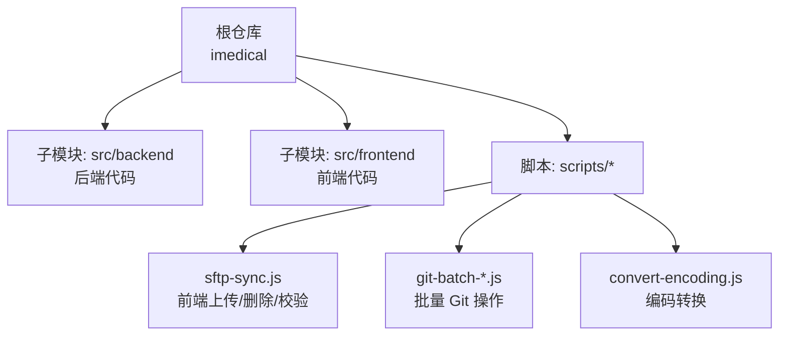

# 贡献指南

<cite>
**本文引用的文件**
- [CONTRIBUTING.md](file://CONTRIBUTING.md)
- [README.md](file://README.md)
- [AGENTS.md](file://AGENTS.md)
- [.gitignore](file://.gitignore)
- [scripts/package.json](file://scripts/package.json)
</cite>

## 目录
1. [简介](#简介)
2. [项目结构](#项目结构)
3. [核心角色与权限](#核心角色与权限)
4. [分支管理策略](#分支管理策略)
5. [代码提交流程](#代码提交流程)
6. [代码审查与合并策略](#代码审查与合并策略)
7. [新功能开发流程](#新功能开发流程)
8. [缺陷修复流程](#缺陷修复流程)
9. [文档更新流程](#文档更新流程)
10. [代码风格指南](#代码风格指南)
11. [测试要求](#测试要求)
12. [发布流程与版本管理](#发布流程与版本管理)
13. [回滚策略](#回滚策略)
14. [依赖与工具链](#依赖与工具链)
15. [常见问题排查](#常见问题排查)
16. [结论](#结论)

## 简介
本贡献指南面向所有参与 IRIS HIS 项目的开发者、测试与产品人员，统一说明角色权限、分支策略、提交规范、代码审查、合并策略、发版与回滚流程，以及代码风格、测试与文档编写要求。目标是帮助新贡献者快速上手并遵循团队最佳实践，保障多产品 HIS（医生工作站、治疗、牙科、门诊挂号、患者主索引等）在开发与交付过程中的质量与一致性。

## 项目结构
本项目采用“根仓库 + Git Submodule”的多产品组织方式：
- 根仓库用于聚合配置与脚本；实际前后端代码位于两个子模块：
  - src/backend：后端 ObjectScript 代码（按产品划分目录）
  - src/frontend：前端 CSP + jQuery/HISUI 资源（按产品划分目录）
- scripts：Git 管理与部署辅助脚本（批量拉取、分支管理、MR 创建、SFTP 同步、编码转换等）
- .vscode：本地开发环境模板（IRIS 连接、SFTP 通道映射），不纳入版本控制

图示来源
- [README.md:5-52](file://README.md#L5-L52)
- [README.md:256-300](file://README.md#L256-L300)
- [README.md:302-446](file://README.md#L302-L446)

章节来源
- [README.md:5-52](file://README.md#L5-L52)
- [README.md:256-300](file://README.md#L256-L300)
- [README.md:302-446](file://README.md#L302-L446)

## 核心角色与权限
- Maintainer（维护者）：拥有仓库管理权限，负责分支合并审批、发版管理与质量把控
- Developer（开发者）：日常功能开发与缺陷修复，可直接向 dev 分支推送和合并
- Reporter（报告者）：项目支持与协助，无法直接推送代码，需通过临时分支发起 MR

权限速查要点
- dev：Developer/Maintainer 可推送与合并；test/release/main：仅 Maintainer 可通过 MR 合并
- 临时分支：feature/fix/hotfix 由任意角色创建，但合并目标与路径受严格约束

章节来源
- [CONTRIBUTING.md:9-28](file://CONTRIBUTING.md#L9-L28)

## 分支管理策略
长期分支
- main：生产已发布版本，禁止直接推送，仅 Maintainer 可合并
- test：测试环境，供 QA 验证，禁止直接推送，仅 Maintainer 可合并
- dev：开发集成环境，允许 Developer/Maintainer 推送与合并

预发布分支
- release/<版本号>：从 main 创建，用于发布前最终验收与修复；通过后合并回 main 并删除

临时分支
- feature/<需求号>-<简述>：从 dev 创建，合并回 dev，合并后立即删除
- fix/<需求号>-<简述>：从 dev 创建，合并回 dev，合并后立即删除
- hotfix/<需求号>-<简述>：从 main 创建，合并回 main，合并后需 cherry-pick 到 dev，合并后立即删除

提升路径（严格序列）
- feature/fix → dev → test → release/* → main
- hotfix → main（合并后 cherry-pick 到 dev）
- 禁止跨级合并（如 dev 直达 main）

章节来源
- [CONTRIBUTING.md:31-77](file://CONTRIBUTING.md#L31-L77)
- [CONTRIBUTING.md:231-250](file://CONTRIBUTING.md#L231-L250)

## 代码提交流程
Developer 提交流程
- 日常小改动：直接在 dev 分支提交并推送
- 较大功能改造或新功能：从 dev 创建 feature/* 分支，完成后发起 MR 合并至 dev

Reporter 提交流程
- 从 dev 创建临时分支（feature/* 或 fix/*），开发并提交后发起 MR 至 dev，等待 Developer/Maintainer 审批合并

提交信息建议
- 类型(需求号): 简要描述
- 修改说明: ...
- 需求描述: ...
- 类型枚举：fix/feat/refactor/docs/style/test/chore

章节来源
- [CONTRIBUTING.md:79-143](file://CONTRIBUTING.md#L79-L143)
- [AGENTS.md:225-233](file://AGENTS.md#L225-L233)

## 代码审查与合并策略
合并前提条件
- 代码评审通过
- CI/CD 流水线全部通过（check-branch-name、check-promotion）
- 无未解决的讨论
- 目标分支为受保护分支时，至少 1 名审核人批准

MR 审批规则（受保护分支）
- main：最少 2 名 Maintainer 审批
- test/dev：最少 1 名 Maintainer/Developer 审批

合并方式
- Merge commit（保留合并记录，便于追溯）
- 启用“合并后自动删除源分支”

章节来源
- [CONTRIBUTING.md:329-337](file://CONTRIBUTING.md#L329-L337)
- [CONTRIBUTING.md:414-446](file://CONTRIBUTING.md#L414-L446)

## 新功能开发流程
- 从 dev 创建 feature/<需求号>-<简述> 分支
- 在分支上完成开发、自测与必要文档更新
- 推送分支并在 GitLab 创建 MR 至 dev
- 通过代码审查与自动化检查后合并，立即删除临时分支

章节来源
- [CONTRIBUTING.md:58-77](file://CONTRIBUTING.md#L58-L77)
- [CONTRIBUTING.md:79-115](file://CONTRIBUTING.md#L79-L115)

## 缺陷修复流程
- 从 dev 创建 fix/<需求号>-<简述> 分支
- 修复后提交并发起 MR 至 dev
- 紧急线上问题使用 hotfix/<需求号>-<简述>：从 main 创建，合并回 main，再 cherry-pick 到 dev

章节来源
- [CONTRIBUTING.md:58-77](file://CONTRIBUTING.md#L58-L77)
- [CONTRIBUTING.md:188-228](file://CONTRIBUTING.md#L188-L228)

## 文档更新流程
- 文档属于 docs 类变更，提交类型使用 docs
- 若涉及用户可见文案，必须遵循多语言翻译规范（后端 %Trans、前端 $trans）
- 更新 README/CONTRIBUTING/AGENTS 等关键文档后，建议同步更新相关指引（如 Git 工作流、编译部署指南）

章节来源
- [AGENTS.md:106-114](file://AGENTS.md#L106-L114)
- [AGENTS.md:275-287](file://AGENTS.md#L275-L287)

## 代码风格指南
命名规范
- 类名/构造函数：大驼峰（PascalCase）
- 方法名/入参/局部变量/返回字段：小驼峰（camelCase）
- JS 常量：全大写+下划线
- HTML id：小驼峰；HTML/CSS class、CSS/JS/图片文件名：kebab-case

JavaScript 编码规范
- 禁止 import/export（无构建工具）
- 优先使用 const/let、箭头函数、模板字符串、async/await、可选链与空值合并
- $.req/$.cm 默认异步且返回 JSON 对象，无需 JSON.parse
- jQuery 回调中引用 this 时使用 function 而非箭头函数

ObjectScript 编码规范
- 新增业务类继承 DHCDoc.Util.RegisteredObject，类名 PascalCase
- 方法签名 camelCase，返回值标注类型（%DynamicObject/%DynamicArray）
- 异常处理统一 throw ..%GetException(errCode, errMsg)，errMsg 必须用 %Trans 包裹

多语言翻译
- 后端：%Trans("中文")，占位符使用 %Trans("在{0}天内", "", days)
- 前端：$trans('中文')，占位符 $trans('{0}不存在', val)

注释语言
- ObjectScript 与 JS 注释使用中文

章节来源
- [AGENTS.md:120-141](file://AGENTS.md#L120-L141)
- [AGENTS.md:106-114](file://AGENTS.md#L106-L114)
- [AGENTS.md:211-214](file://AGENTS.md#L211-L214)

## 测试要求
- 提测前确保 dev 分支内容稳定，并通过内部自测
- 提测流程：Maintainer 发起 dev → test 的 MR，经测试团队确认与 CI 通过后合并
- 补丁发布：cherry-pick 指定提交依次进入 test → release → main，每次迁移后充分验证

章节来源
- [CONTRIBUTING.md:147-157](file://CONTRIBUTING.md#L147-L157)
- [CONTRIBUTING.md:188-228](file://CONTRIBUTING.md#L188-L228)

## 发布流程与版本管理
正式发版
- 产品部从 main 创建 release/<版本号>
- 测试组将 test 合并至 release/<版本号>
- 产品部完成配置、测试与联调
- 验收通过后合并 release/<版本号> 回 main，并删除 release 分支

补丁发布
- 在 dev 完成补丁并验证通过
- cherry-pick 到 test 测试，通过后 cherry-pick 到 release，再由产品部测试并发布至 main

版本命名
- release/v1.2.0、release/v1.2.0-hotfix1 等

章节来源
- [CONTRIBUTING.md:48-57](file://CONTRIBUTING.md#L48-L57)
- [CONTRIBUTING.md:159-186](file://CONTRIBUTING.md#L159-L186)
- [CONTRIBUTING.md:188-228](file://CONTRIBUTING.md#L188-L228)

## 回滚策略
- 通过 release 分支与 merge commit 保留完整合并历史，便于定位与回滚
- 紧急回滚建议使用 hotfix 流程：从 main 创建 hotfix 分支修复问题，合并回 main 后再 cherry-pick 到 dev
- 若需撤销某次提交，谨慎使用 revert 或重新 cherry-pick 反向提交，并确保在 test/release 充分验证

章节来源
- [CONTRIBUTING.md:188-228](file://CONTRIBUTING.md#L188-L228)
- [CONTRIBUTING.md:414-446](file://CONTRIBUTING.md#L414-L446)

## 依赖与工具链
- 后端：InterSystems IRIS、ObjectScript、CSP
- 前端：jQuery、HISUI（基于 EasyUI 二次封装）、传统静态资源
- 无现代前端构建工具链（webpack、vite、ESLint、Prettier、Jest）
- Node 脚本依赖：scripts/package.json 声明 iconv-lite（用于编码转换）

章节来源
- [README.md:526-537](file://README.md#L526-L537)
- [scripts/package.json:1-10](file://scripts/package.json#L1-L10)

## 常见问题排查
- 分支命名不符合规范：CI check-branch-name 失败，MR 无法合并
- 跨级合并：CI check-promotion 失败，MR 无法合并
- 直接推送到受保护分支或被拒绝：GitLab 服务端拒绝（403 Forbidden）
- 未通过代码评审：MR 审批数不足，无法合并
- 临时分支未及时删除：MR 合并时自动删除；定期清理遗漏分支
- 前端文件中文乱码：确保 UTF-8 编码保存
- CSP 编译失败：上传后必须调用 iris_doc_compile 编译
- iris_doc_load 返回 total=0 或 HTTP 405：路径缺少通配符或基准目录错误，需在包根目录名插入通配符（如 D*oc）

章节来源
- [CONTRIBUTING.md:488-497](file://CONTRIBUTING.md#L488-L497)
- [AGENTS.md:291-299](file://AGENTS.md#L291-L299)

## 结论
遵循统一的分支策略、提交流程、代码审查与合并规则，配合严格的提升路径与自动化检查，可有效降低协作成本与风险。结合多语言翻译、代码风格与测试要求，确保 IRIS HIS 在多产品、多团队协作下的质量与可维护性。建议新贡献者在开始开发前熟悉本指南与 AGENTS.md 中的工作流细则，并在实际操作中严格遵守分支命名、提交流程与合并前置条件。