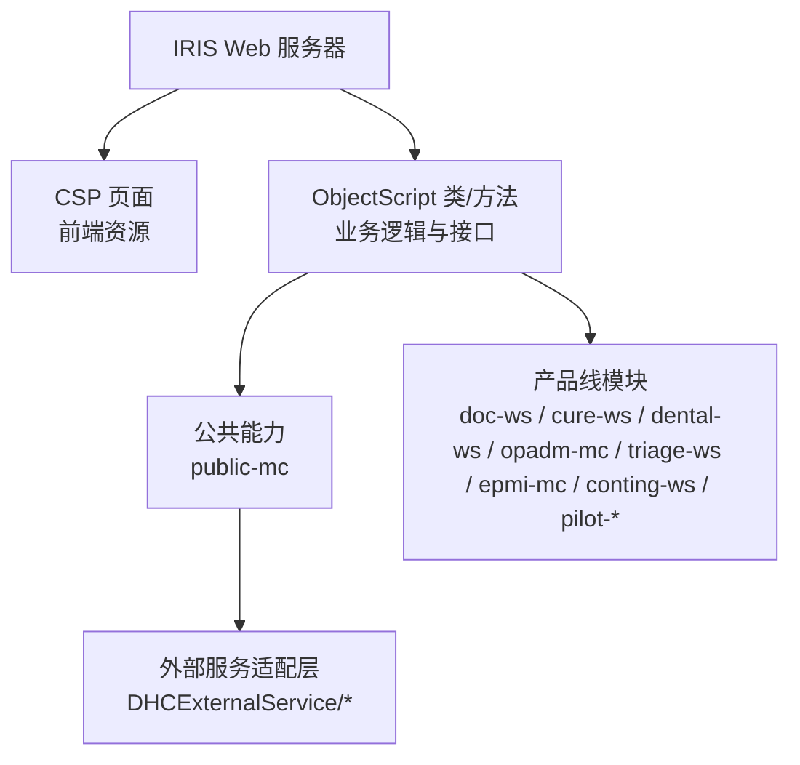
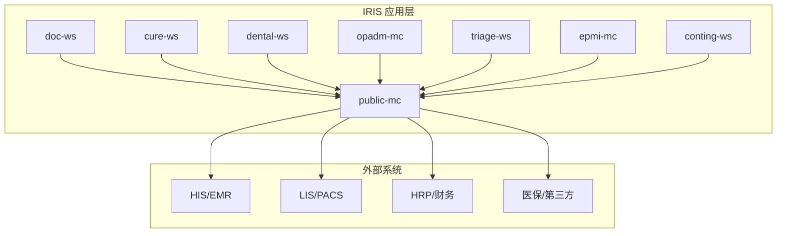
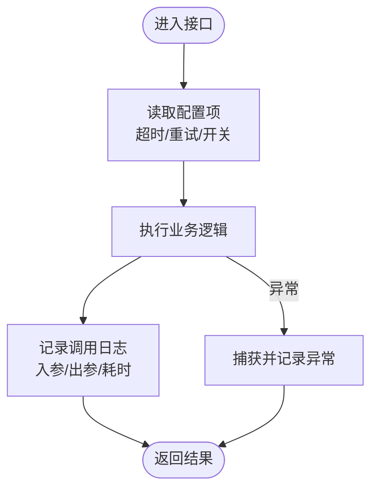
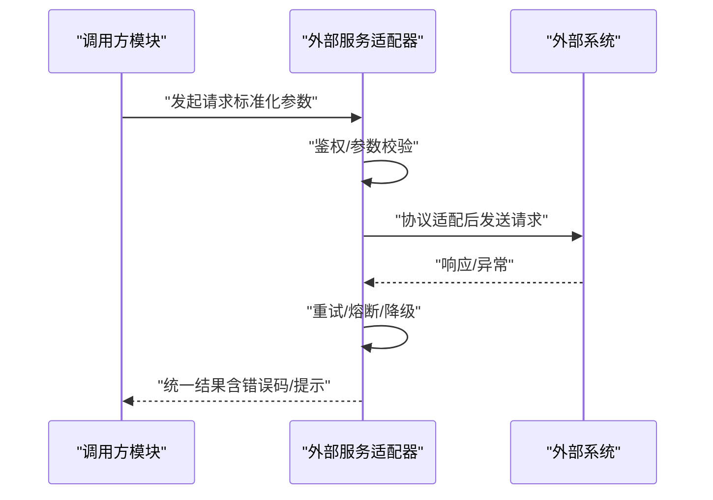
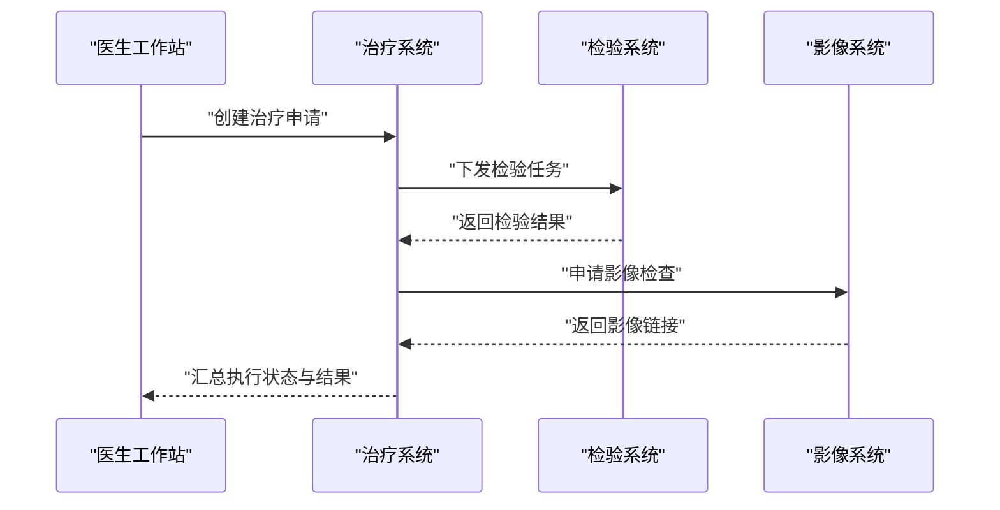
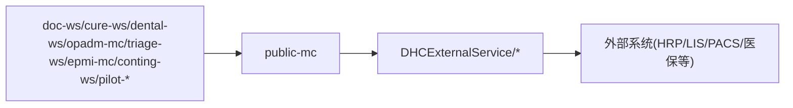

# 应用服务集成

<cite>
**本文引用的文件**
- [README.md](file://README.md)
- [DHCDocConfig.mac](file://src/backend/public-mc/DHCDocConfig.mac)
- [DHCDoc.inc](file://src/backend/public-mc/DHCDoc.inc)
- [DHCExternalService 目录](file://src/backend/public-mc/DHCExternalService)
</cite>

## 目录
1. [简介](#简介)
2. [项目结构](#项目结构)
3. [核心组件](#核心组件)
4. [架构总览](#架构总览)
5. [详细组件分析](#详细组件分析)
6. [依赖关系分析](#依赖关系分析)
7. [性能考虑](#性能考虑)
8. [故障排查指南](#故障排查指南)
9. [结论](#结论)
10. [附录](#附录)

## 简介
本文件面向医院内部多产品 HIS（医生工作站、治疗系统、牙科系统、门诊挂号、分诊、患者主索引等）的应用服务集成，聚焦在 InterSystems IRIS + ObjectScript 环境下的服务边界、调用方式与治理要点。仓库采用前后端分离的模块化组织：后端以 ObjectScript 类与宏实现业务逻辑与接口适配，前端通过 CSP/静态资源由 IRIS Web 服务器提供。当前仓库未内置现代微服务注册中心或网关，但提供了跨子系统的外部服务适配层与配置管理点，可作为后续演进为“服务化”的基础。

## 项目结构
- 后端位于 src/backend，按产品线划分模块（doc-ws、cure-ws、dental-ws、opadm-mc、triage-ws、epmi-mc、conting-ws、pilot-*），公共能力集中在 public-mc。
- 前端位于 src/frontend，对应各产品的 CSP 页面与脚本，统一部署到 IRIS Web 路径。
- 开发工作流通过 VS Code ObjectScript 扩展直接编译上传后端代码；前端通过脚本使用 psftp 同步至服务器。

图表来源
- [README.md:5-35](file://README.md#L5-L35)

章节来源
- [README.md:5-51](file://README.md#L5-L51)

## 核心组件
- 配置与全局常量
  - 配置存取：通过 DHCDocConfig.mac 提供的保存/读取/枚举节点等方法，集中管理运行期配置项（如限制时长、院区相关开关等）。
  - 日志对象定义：DHCDoc.inc 中定义了统一的日志对象引用，便于在各模块记录接口调用与异常信息。
- 外部服务适配层
  - DHCExternalService 目录下包含多个子系统对外接口的适配封装（如卡务、预约、互联网、EPMI、门诊挂号、注册等），用于屏蔽下游协议差异、数据格式转换与错误处理。
- 产品线模块
  - 各 ws/mc 模块承载具体业务场景（医嘱、治疗、牙科、门诊、分诊、主索引等），通过调用公共能力与外部适配层完成跨系统协作。

章节来源
- [DHCDocConfig.mac:1-119](file://src/backend/public-mc/DHCDocConfig.mac#L1-L119)
- [DHCDoc.inc:1-8](file://src/backend/public-mc/DHCDoc.inc#L1-L8)
- [DHCExternalService 目录](file://src/backend/public-mc/DHCExternalService)

## 架构总览
当前仓库未内置服务发现与负载均衡组件，服务间通信主要基于 IRIS 命名空间内的 ObjectScript 调用与 HTTP/WebService 适配。可将其视为“单体内多模块”的服务化雏形，具备向“微服务化”演进的天然基础：
- 服务边界：以产品线模块为服务边界，通过 DHCExternalService 暴露标准化接口。
- 服务治理：可在 IRIS 层面引入健康检查、限流、重试与熔断策略（需结合运行时与运维平台）。
- 分布式事务：可通过消息队列（异步解耦）与补偿机制实现最终一致性。
- 可观测性：利用统一日志对象与外部监控工具采集指标与链路信息。

图表来源
- [README.md:11-22](file://README.md#L11-L22)
- [DHCExternalService 目录](file://src/backend/public-mc/DHCExternalService)

## 详细组件分析

### 配置与日志基座
- 配置管理
  - 提供保存/获取/枚举/清理配置节点的方法，支持按节点维度隔离配置，便于多院区或多环境差异化。
  - 建议将关键开关（如超时、重试次数、降级策略）纳入配置中心化管理，并通过统一入口读取。
- 日志记录
  - 通过统一日志对象进行接口出入参、耗时、异常堆栈的记录，便于问题定位与审计。

图表来源
- [DHCDocConfig.mac:4-26](file://src/backend/public-mc/DHCDocConfig.mac#L4-L26)
- [DHCDoc.inc:1-8](file://src/backend/public-mc/DHCDoc.inc#L1-L8)

章节来源
- [DHCDocConfig.mac:1-119](file://src/backend/public-mc/DHCDocConfig.mac#L1-L119)
- [DHCDoc.inc:1-8](file://src/backend/public-mc/DHCDoc.inc#L1-L8)

### 外部服务适配层（DHCExternalService）
- 职责
  - 封装对 HRP、卡务、预约、互联网、EPMI、门诊挂号、注册等外部系统的调用细节。
  - 负责协议适配（HTTP/WebService/数据库直连等）、数据格式转换、鉴权、重试与降级。
- 设计建议
  - 每个外部系统一个适配器类，统一输入输出模型，屏蔽差异。
  - 在适配器中实现健康检查、熔断与退避重试，避免级联故障。
  - 所有调用均记录日志，并上报关键指标（成功率、延迟、错误码分布）。

图表来源
- [DHCExternalService 目录](file://src/backend/public-mc/DHCExternalService)

章节来源
- [DHCExternalService 目录](file://src/backend/public-mc/DHCExternalService)

### 产品线模块间的协作
- 典型流程：医生工作站创建医嘱 → 治疗系统接收并执行 → 检验/影像系统回传结果 → 医生工作站展示。
- 关键点：
  - 跨模块调用应通过公共能力或适配器进行，避免硬编码耦合。
  - 对关键路径增加幂等控制与状态机，保证重复提交安全。
  - 对慢依赖采用异步化与缓存，提升整体吞吐。

图表来源
- [README.md:11-22](file://README.md#L11-L22)

章节来源
- [README.md:11-22](file://README.md#L11-L22)

## 依赖关系分析
- 模块内聚与耦合
  - 公共能力集中在 public-mc，降低各产品线重复实现；外部适配层收敛异构依赖。
- 直接依赖
  - 各 ws/mc 模块依赖 public-mc 的配置、工具与日志。
  - 外部系统通过 DHCExternalService 间接被调用，避免直接耦合。
- 潜在风险
  - 若某外部系统不稳定，需在适配器层实现熔断与降级，防止雪崩。
  - 配置项过多时建议引入配置中心与动态刷新。

图表来源
- [README.md:11-22](file://README.md#L11-L22)
- [DHCExternalService 目录](file://src/backend/public-mc/DHCExternalService)

章节来源
- [README.md:11-22](file://README.md#L11-L22)
- [DHCExternalService 目录](file://src/backend/public-mc/DHCExternalService)

## 性能考虑
- 连接与并发
  - 合理设置外部系统连接池大小与超时时间，避免资源耗尽。
  - 对读多写少的热点数据引入缓存（本地缓存/Redis），减少下游压力。
- 异步与削峰
  - 对非实时操作（如通知、报表生成）采用消息队列异步处理，提升响应速度。
- 可观测性
  - 统一日志对象记录关键路径耗时与错误；配合 IRIS 监控与外部 APM 采集指标。
- 容量规划
  - 根据峰值 QPS 评估线程池、内存与磁盘 I/O，预留扩容空间。

[本节为通用指导，不直接分析具体文件]

## 故障排查指南
- 常见问题定位
  - 配置错误：检查 DHCDocConfig.mac 中的配置节点是否生效，确认取值是否符合预期。
  - 外部系统不可用：查看适配器层的健康检查与熔断状态，必要时切换备用通道或降级。
  - 日志缺失：确认统一日志对象已正确初始化并写入目标位置。
- 建议步骤
  - 先查配置，再查网络与鉴权，最后查业务逻辑与数据一致性。
  - 对关键接口增加重试与幂等保护，避免重复提交导致的数据不一致。
  - 收集完整上下文（请求ID、入参、时间戳、错误码）以便快速复现与定位。

章节来源
- [DHCDocConfig.mac:4-26](file://src/backend/public-mc/DHCDocConfig.mac#L4-L26)
- [DHCDoc.inc:1-8](file://src/backend/public-mc/DHCDoc.inc#L1-L8)

## 结论
当前仓库以 IRIS ObjectScript 为核心，采用模块化组织与公共能力沉淀，具备向服务化演进的坚实基础。建议在现有适配层基础上完善健康检查、熔断降级、异步化与可观测性，逐步实现服务发现与治理，提升系统弹性与可维护性。

[本节为总结性内容，不直接分析具体文件]

## 附录
- 开发与部署要点
  - 后端通过 ObjectScript 扩展直接编译上传；前端通过脚本同步至 IRIS Web 路径。
  - 注意文件编码统一为 UTF-8，避免跨平台显示问题。
- 参考路径
  - 后端模块：src/backend/*
  - 前端模块：src/frontend/*
  - 公共能力：src/backend/public-mc

章节来源
- [README.md:5-51](file://README.md#L5-L51)