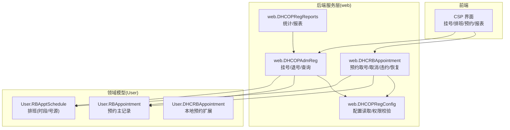
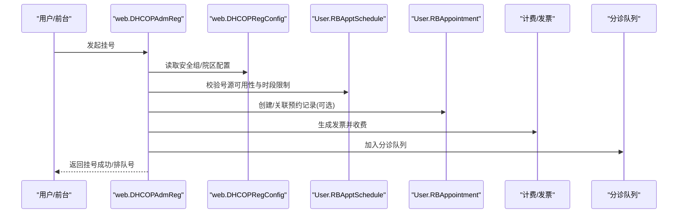
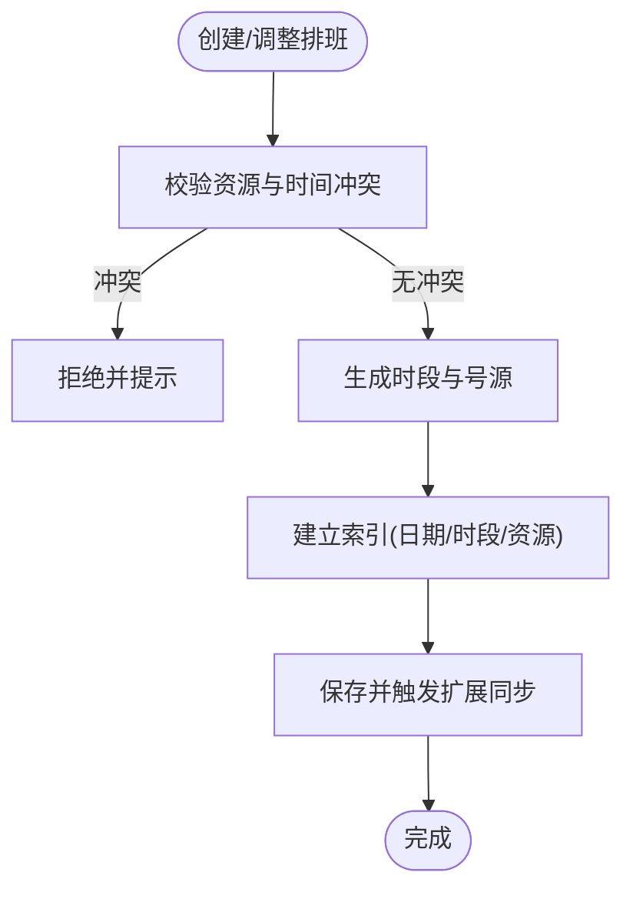
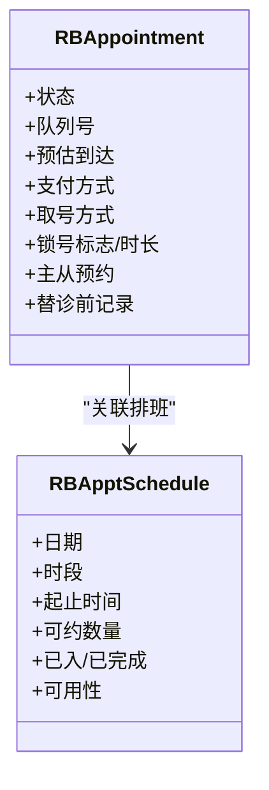
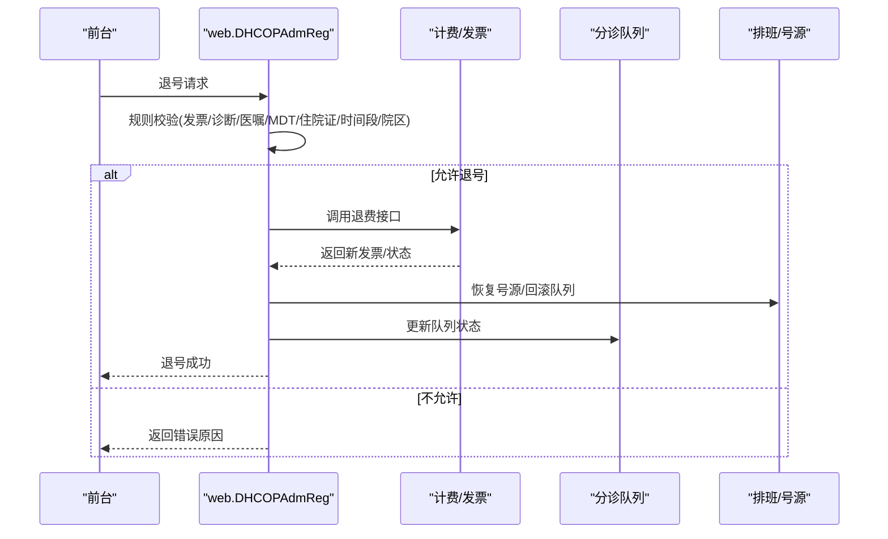
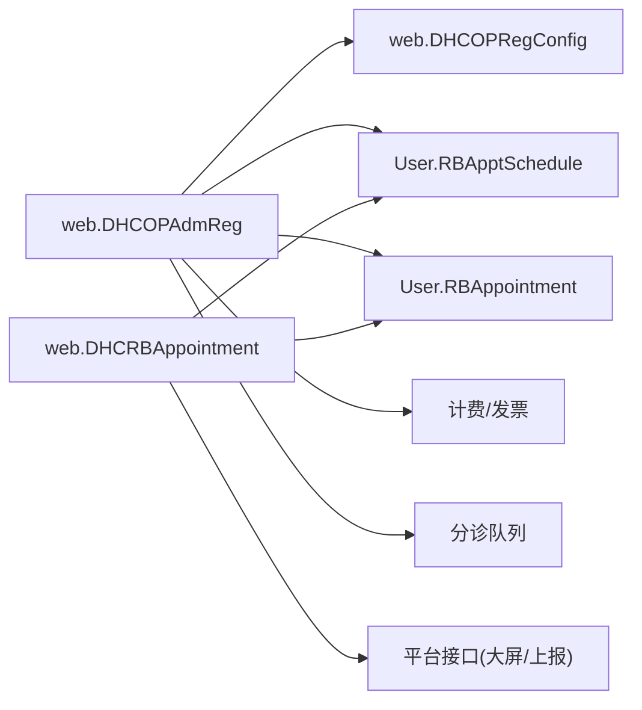

# 门诊挂号系统 (opadm-mc)

<cite>
**本文引用的文件**
- [DHCOPAdmReg.cls](file://src/backend/opadm-mc/web/DHCOPAdmReg.cls)
- [RBAppointment.cls](file://src/backend/opadm-mc/User/RBAppointment.cls)
- [RBApptSchedule.cls](file://src/backend/opadm-mc/User/RBApptSchedule.cls)
- [DHCRBAppointment.cls（User）](file://src/backend/opadm-mc/User/DHCRBAppointment.cls)
- [DHCRBAppointment.cls（web）](file://src/backend/opadm-mc/web/DHCRBAppointment.cls)
- [DHCOPRegConfig.cls](file://src/backend/opadm-mc/web/DHCOPRegConfig.cls)
- [DHCOPRegReports.cls](file://src/backend/opadm-mc/web/DHCOPRegReports.cls)
- [DHCDocRegDocAppoint.cls](file://src/backend/opadm-mc/User/DHCDocRegDocAppoint.cls)
</cite>

## 目录
1. [简介](#简介)
2. [项目结构](#项目结构)
3. [核心组件](#核心组件)
4. [架构总览](#架构总览)
5. [详细组件分析](#详细组件分析)
6. [依赖关系分析](#依赖关系分析)
7. [性能与高并发处理](#性能与高并发处理)
8. [故障排查指南](#故障排查指南)
9. [结论](#结论)
10. [附录：配置参数、接口规范与集成要点](#附录：配置参数接口规范与集成要点)

## 简介
本系统为门诊挂号子系统，覆盖预约管理、排班管理、挂号/退号流程、号源管理、医生排班、科室配置、收费与医保对接、查询统计与报表生成等核心能力。后端以 InterSystems Caché/IRIS 类与存储为主，前端通过 CSP 页面驱动交互；业务围绕“资源-时段-号源-预约-就诊”的主线展开，支持多院区、多安全组、多取号渠道的灵活扩展。

## 项目结构
- 后端模块 opadm-mc
  - User：领域模型与持久化实体（如 RBAppointment、RBApptSchedule、DHCRBAppointment 等）
  - web：业务流程与服务方法（挂号、退号、预约、排班、报表、配置读取等）
  - DHCDoc：扩展配置与字典映射（如按科室/号别排序等）
- 前端模块 opadm-mc
  - csp：挂号界面、排班界面、预约界面、报表展示等
  - scripts/css：前端脚本与样式

**图表来源**
- [DHCOPAdmReg.cls:1-800](file://src/backend/opadm-mc/web/DHCOPAdmReg.cls#L1-L800)
- [DHCRBAppointment.cls（web）:1-200](file://src/backend/opadm-mc/web/DHCRBAppointment.cls#L1-L200)
- [RBApptSchedule.cls:1-481](file://src/backend/opadm-mc/User/RBApptSchedule.cls#L1-L481)
- [RBAppointment.cls:1-800](file://src/backend/opadm-mc/User/RBAppointment.cls#L1-L800)
- [DHCOPRegConfig.cls:1-200](file://src/backend/opadm-mc/web/DHCOPRegConfig.cls#L1-L200)
- [DHCOPRegReports.cls:1-200](file://src/backend/opadm-mc/web/DHCOPRegReports.cls#L1-L200)

**章节来源**
- [DHCOPAdmReg.cls:1-800](file://src/backend/opadm-mc/web/DHCOPAdmReg.cls#L1-L800)
- [RBApptSchedule.cls:1-481](file://src/backend/opadm-mc/User/RBApptSchedule.cls#L1-L481)
- [RBAppointment.cls:1-800](file://src/backend/opadm-mc/User/RBAppointment.cls#L1-L800)
- [DHCRBAppointment.cls（web）:1-200](file://src/backend/opadm-mc/web/DHCRBAppointment.cls#L1-L200)
- [DHCOPRegConfig.cls:1-200](file://src/backend/opadm-mc/web/DHCOPRegConfig.cls#L1-L200)
- [DHCOPRegReports.cls:1-200](file://src/backend/opadm-mc/web/DHCOPRegReports.cls#L1-L200)

## 核心组件
- 排班与号源
  - 排班实体：日期、时段、起止时间、可约数量、已入/已完成人数、可用性计算、异常标记等
  - 号源：基于“资源-时段-子序号”的三维结构，支撑分时段号段、候补、加号、替诊等
- 预约与就诊
  - 预约主记录：状态机（插入/到院/转诊/取消/关闭/顺延/未出席/保留/无法等待/已到未看/离开）、队列号、预估到达、支付标志、取号方式、锁号等
  - 本地预约扩展：患者信息、验证码、联合门诊、急诊分级、锁定队列号等
- 挂号与退号
  - 挂号：创建就诊、关联排班、生成发票、扣减号源、进入分诊队列
  - 退号：规则校验（发票/诊断/医嘱/MDT/住院证/时间段/院区）、退费、回滚号源、更新队列、上报平台
- 配置与权限
  - 安全组/院区维度配置：退号策略、免费策略、医保结算策略、大屏显示开关、号别排序等
- 报表与统计
  - 按日挂号统计、按人/科室/用户汇总、金额与数量聚合、部分退费处理

**章节来源**
- [RBApptSchedule.cls:1-481](file://src/backend/opadm-mc/User/RBApptSchedule.cls#L1-L481)
- [RBAppointment.cls:1-800](file://src/backend/opadm-mc/User/RBAppointment.cls#L1-L800)
- [DHCRBAppointment.cls（User）:1-200](file://src/backend/opadm-mc/User/DHCRBAppointment.cls#L1-L200)
- [DHCOPAdmReg.cls:1-800](file://src/backend/opadm-mc/web/DHCOPAdmReg.cls#L1-L800)
- [DHCOPRegConfig.cls:1-200](file://src/backend/opadm-mc/web/DHCOPRegConfig.cls#L1-L200)
- [DHCOPRegReports.cls:1-200](file://src/backend/opadm-mc/web/DHCOPRegReports.cls#L1-L200)

## 架构总览

**图表来源**
- [DHCOPAdmReg.cls:1-800](file://src/backend/opadm-mc/web/DHCOPAdmReg.cls#L1-L800)
- [DHCOPRegConfig.cls:1-200](file://src/backend/opadm-mc/web/DHCOPRegConfig.cls#L1-L200)
- [RBApptSchedule.cls:1-481](file://src/backend/opadm-mc/User/RBApptSchedule.cls#L1-L481)
- [RBAppointment.cls:1-800](file://src/backend/opadm-mc/User/RBAppointment.cls#L1-L800)

## 详细组件分析

### 排班与号源管理（RBApptSchedule）
- 关键概念
  - 资源（医生/诊室/设备）+ 日期 + 时段 = 一个排班实例
  - 可约数量、已入/已完成计数、可用性动态计算
  - 异常标记（加号/挤号）、实际执行时间、延迟/超时原因
- 数据流
  - 生成排班后，系统维护“资源-时段-子序号”索引，供挂号/预约占用
  - 触发器同步扩展表字段与索引，保证一致性
- 复杂度
  - 可用性计算 O(1)，号源占用/释放通过原子更新与事务保障
- 优化点
  - 使用条件索引与分区键（资源ID、日期、开始时间）提升查询效率
  - 批量生成排班时采用事务与最小化日志

**图表来源**
- [RBApptSchedule.cls:1-481](file://src/backend/opadm-mc/User/RBApptSchedule.cls#L1-L481)

**章节来源**
- [RBApptSchedule.cls:1-481](file://src/backend/opadm-mc/User/RBApptSchedule.cls#L1-L481)

### 预约管理（RBAppointment / DHCRBAppointment）
- 状态机
  - 插入/到院/转诊/取消/关闭/顺延/未出席/保留/无法等待/已到未看/离开
- 关键属性
  - 队列号、预估到达、支付方式、取号方式、锁号标志与时长、主从预约关系、替诊前记录
- 操作
  - 取号：将预约状态置为到院，释放对应号源至队列
  - 取消/违约/恢复：根据配置决定是否允许重新投放号源，并刷新大屏显示
- 事务与一致性
  - 状态变更与号源恢复在同一事务中完成，避免超卖

**图表来源**
- [RBAppointment.cls:1-800](file://src/backend/opadm-mc/User/RBAppointment.cls#L1-L800)
- [RBApptSchedule.cls:1-481](file://src/backend/opadm-mc/User/RBApptSchedule.cls#L1-L481)

**章节来源**
- [RBAppointment.cls:1-800](file://src/backend/opadm-mc/User/RBAppointment.cls#L1-L800)
- [DHCRBAppointment.cls（User）:1-200](file://src/backend/opadm-mc/User/DHCRBAppointment.cls#L1-L200)
- [DHCRBAppointment.cls（web）:1-200](file://src/backend/opadm-mc/web/DHCRBAppointment.cls#L1-L200)

### 挂号与退号流程（DHCOPAdmReg）
- 挂号
  - 校验安全组/院区权限与号源可用性
  - 创建就诊记录、生成发票、扣减号源、加入分诊队列
- 退号
  - 规则校验：发票存在性、诊断/医嘱/MDT/住院证、时间段限制、跨院限制、应急系统限制
  - 退费：调用计费接口，处理集中打印发票场景
  - 号源回收：恢复号源或回滚队列，更新大屏显示
  - 上报：平台接口通知上游系统
- 查询
  - 按发票号/患者/日期范围检索挂号记录，包含退号信息与替诊排班状态

**图表来源**
- [DHCOPAdmReg.cls:1-800](file://src/backend/opadm-mc/web/DHCOPAdmReg.cls#L1-L800)

**章节来源**
- [DHCOPAdmReg.cls:1-800](file://src/backend/opadm-mc/web/DHCOPAdmReg.cls#L1-L800)

### 配置与权限（DHCOPRegConfig）
- 能力
  - 获取安全组/院区维度的配置项：退号策略、免费策略、医保实时结算策略、号别排序、大屏显示开关等
  - 提供统一读取入口，支持翻译与安全上下文
- 典型用法
  - 退号前检查强制退号权限
  - 挂号时决定号别排序与资源可见范围
  - 控制是否向大屏推送号源满员/空余状态

**章节来源**
- [DHCOPRegConfig.cls:1-200](file://src/backend/opadm-mc/web/DHCOPRegConfig.cls#L1-L200)

### 报表与统计（DHCOPRegReports）
- 功能
  - 按日挂号统计：按用户过滤，累计挂号金额
  - 全量用户统计：挂号数/退号数/总数与金额、部分退费处理、按科室/用户筛选
- 实现
  - 基于挂号费用表与发票明细聚合，考虑历史发票与部分退费
  - 缓存临时结果集，分页拉取

**章节来源**
- [DHCOPRegReports.cls:1-200](file://src/backend/opadm-mc/web/DHCOPRegReports.cls#L1-L200)

### 预约-科室-医生映射（DHCDocRegDocAppoint）
- 作用
  - 维护“就诊科室-预约号别/资源-医生-数量”的映射，用于快速定位号源与医生组合
- 索引
  - 科室、科室+医生、科室+资源、科室+医生+资源的复合索引，提升查询效率

**章节来源**
- [DHCDocRegDocAppoint.cls:1-92](file://src/backend/opadm-mc/User/DHCDocRegDocAppoint.cls#L1-L92)

## 依赖关系分析
- 模块耦合
  - web.DHCOPAdmReg 依赖 web.DHCOPRegConfig（配置）、User.RBApptSchedule（号源）、User.RBAppointment（预约）、计费/发票、分诊队列
  - web.DHCRBAppointment 依赖 User.RBAppointment、User.RBApptSchedule、平台接口（大屏/上报）
- 外部集成
  - 计费/发票：退费、集中打印发票、支付方式列表
  - 平台组接口：发送挂号/取消预约信息
  - 大屏显示：根据号源满员状态推送消息

**图表来源**
- [DHCOPAdmReg.cls:1-800](file://src/backend/opadm-mc/web/DHCOPAdmReg.cls#L1-L800)
- [DHCRBAppointment.cls（web）:1-200](file://src/backend/opadm-mc/web/DHCRBAppointment.cls#L1-L200)
- [RBApptSchedule.cls:1-481](file://src/backend/opadm-mc/User/RBApptSchedule.cls#L1-L481)
- [RBAppointment.cls:1-800](file://src/backend/opadm-mc/User/RBAppointment.cls#L1-L800)

**章节来源**
- [DHCOPAdmReg.cls:1-800](file://src/backend/opadm-mc/web/DHCOPAdmReg.cls#L1-L800)
- [DHCRBAppointment.cls（web）:1-200](file://src/backend/opadm-mc/web/DHCRBAppointment.cls#L1-L200)

## 性能与高并发处理
- 事务与锁
  - 挂号/退号涉及多表更新（就诊、发票、号源、队列），使用事务确保一致性
  - 号源占用/释放采用原子更新，避免超卖
- 索引设计
  - 排班表按资源、日期、时段建立索引；预约表按排班引用与子序号索引
  - 复合索引减少扫描，提高查询与更新效率
- 批处理
  - 排班批量生成、报表批量聚合，降低数据库压力
- 可扩展性
  - 配置项支持院区/安全组维度，便于多院区隔离与差异化策略
  - 平台接口异步上报，避免阻塞主流程

[本节为通用指导，不直接分析具体文件]

## 故障排查指南
- 退号失败常见原因
  - 存在收费发票且不符合强制退号权限
  - 已有诊断/医嘱/MDT会诊未撤销/住院证未取消
  - 超过退号时间段或跨院区
  - 应急系统就诊记录不可退号
- 挂号失败常见原因
  - 号源不足或时段不可用
  - 安全组无权访问该资源/科室
  - 发票生成失败
- 排查步骤
  - 核对配置项（退号策略、免费策略、医保结算策略）
  - 检查排班与号源状态（是否被占用/替诊/加号）
  - 查看发票与订单状态（是否已退费/部分退费）
  - 确认平台接口调用结果（大屏/上报）

**章节来源**
- [DHCOPAdmReg.cls:1-800](file://src/backend/opadm-mc/web/DHCOPAdmReg.cls#L1-L800)
- [DHCOPRegConfig.cls:1-200](file://src/backend/opadm-mc/web/DHCOPRegConfig.cls#L1-L200)

## 结论
本系统在“排班-号源-预约-就诊-收费-报表”的全链路中实现了严谨的业务规则与高可用的数据处理。通过配置化策略与平台集成，满足多院区、多渠道、多角色的复杂门诊挂号场景。建议在生产环境重点监控号源占用、发票退费、平台接口调用成功率，并结合报表进行容量规划与运营优化。

[本节为总结性内容，不直接分析具体文件]

## 附录：配置参数、接口规范与集成要点
- 配置参数（示例）
  - 退号策略：是否允许强制退号、退号时间段、允许提前天数
  - 免费策略：老年人免费、特殊人群免费
  - 医保结算：按费别优先/按界面传入参数优先
  - 大屏显示：是否推送号源满员/空余状态
  - 号别排序：按科室/号别自定义排序
- 接口规范（示例）
  - 挂号：输入患者、科室、医生/资源、时段；输出就诊ID、发票ID、队列号
  - 退号：输入就诊ID、退号原因；输出新发票ID、状态码
  - 预约取号：输入预约ID；输出队列号、状态更新
  - 上报：挂号/取消预约事件，携带必要标识
- 集成要点
  - 计费/发票：关注集中打印发票场景与支付方式列表
  - 平台组：挂号/取消预约信息上报，确保幂等与重试
  - 大屏：号源满员状态推送，保持前端显示一致

[本节为通用指导，不直接分析具体文件]