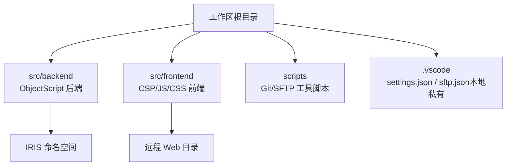
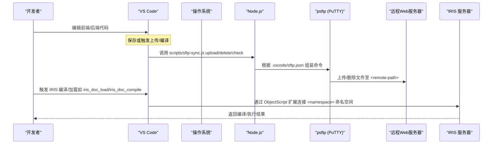
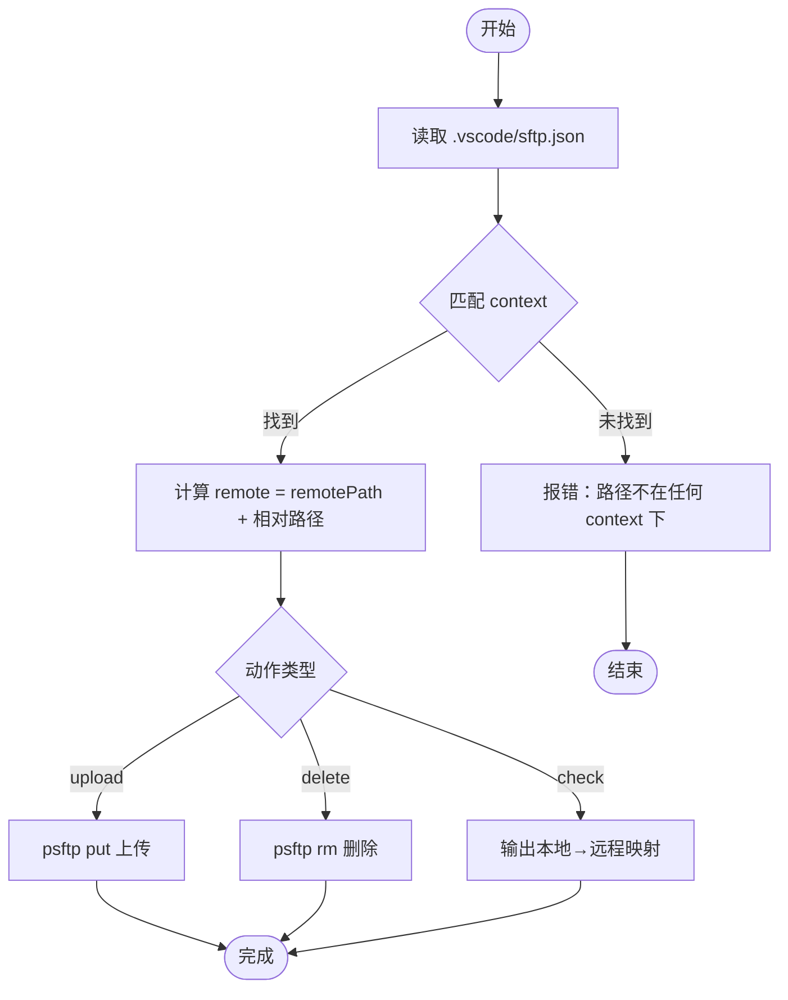
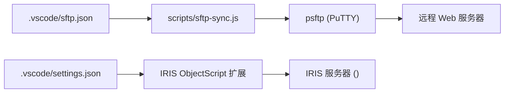

# VS Code配置

<cite>
**本文引用的文件**
- [README.md](file://README.md)
- [CONTRIBUTING.md](file://CONTRIBUTING.md)
- [.gitignore](file://.gitignore)
- [sftp-sync.js](file://scripts/sftp-sync.js)
- [mcp.json.template](file://.qoder-cn/mcp.json.template)
</cite>

## 目录
1. [简介](#简介)
2. [项目结构](#项目结构)
3. [核心组件](#核心组件)
4. [架构总览](#架构总览)
5. [详细组件分析](#详细组件分析)
6. [依赖关系分析](#依赖关系分析)
7. [性能与效率建议](#性能与效率建议)
8. [故障排查指南](#故障排查指南)
9. [结论](#结论)
10. [附录：环境搭建步骤与常见问题](#附录环境搭建步骤与常见问题)

## 简介
本文档面向使用 VS Code 开发本项目的工程师，聚焦以下目标：
- 说明 .vscode/settings.json 模板中涉及 ObjectScript 语言支持、代码导出/同步、调试相关的关键配置项及含义
- 说明 .vscode/sftp.json 模板的服务器连接参数、文件传输规则与同步策略（当前以脚本驱动上传为主）
- 记录推荐的扩展插件清单及其配置要求
- 提供按产品/环境自定义配置的指引
- 给出不同操作系统下的注意事项与常见问题的解决方案

## 项目结构
本项目采用“前后端分离 + Git Submodule”的组织方式：
- 后端：src/backend（ObjectScript，通过 IRIS 扩展编译上传）
- 前端：src/frontend（CSP + jQuery/HISUI，通过 psftp 脚本上传）
- 工具脚本：scripts（Git 多仓库管理、SFTP 同步等）
- VS Code 配置：.vscode（settings.json、sftp.json 由模板生成并忽略提交）

图表来源
- [README.md:7-51](file://README.md#L7-L51)

章节来源
- [README.md:7-51](file://README.md#L7-L51)

## 核心组件
- settings.json（模板）：配置 IRIS 服务器连接、默认命名空间、ObjectScript 导出路径、双向同步策略等
- sftp.json（模板）：配置各前端产品的 SFTP 通道（host/port/username/password/remotePath/context），供 scripts/sftp-sync.js 读取
- sftp-sync.js：统一的前端文件上传/删除/检查映射的 Node 脚本，基于 psftp（PuTTY）执行
- MCP 模板（可选）：用于 AI 辅助开发时连接 IRIS 的示例配置

章节来源
- [README.md:98-206](file://README.md#L98-L206)
- [sftp-sync.js:1-25](file://scripts/sftp-sync.js#L1-L25)
- [mcp.json.template:1-19](file://.qoder-cn/mcp.json.template#L1-L19)

## 架构总览
下图展示从 VS Code 到 IRIS 与远程 Web 服务器的整体交互流程。

图表来源
- [README.md:98-206](file://README.md#L98-L206)
- [sftp-sync.js:53-95](file://scripts/sftp-sync.js#L53-L95)
- [sftp-sync.js:118-164](file://scripts/sftp-sync.js#L118-L164)

## 详细组件分析

### 1) settings.json（ObjectScript 与 IRIS 集成）
- 服务器连接
  - intersystems.servers.*：包含 webServer（HTTPS/SSH）、用户名密码、实例名等
  - objectscript.conn：active、server、ns（默认命名空间，如 <namespace>）
- 导出与同步
  - objectscript.export：workspaceFolder、folder（导出到 src/backend）、是否带分类、是否 Atelier、并发数等
  - 可选：objectscript.syncLocalChanges、objectscript.overwriteServerChanges（测试组隔离环境推荐，生产禁用）
- 调试相关
  - 通过 IRIS 扩展进行编译/加载/执行；具体断点/调试器配置由扩展自身管理，通常无需在 settings.json 中额外设置

章节来源
- [README.md:151-206](file://README.md#L151-L206)

### 2) sftp.json（前端文件传输与映射）
- 字段说明
  - name：通道名称（如 doc-web）
  - host/port：SFTP 服务器地址与端口
[REDACTED: environment-specific example]
  - remotePath：远程根目录（如 <remote-path>
  - context：本地根目录（如 ./src/frontend/doc-ws/）
- 传输规则
  - 本地相对路径 → 远程相同相对路径（由脚本自动计算）
  - 支持批量上传、删除、仅打印映射（check）
- 同步策略
  - 当前不再依赖 SFTP 插件 watcher/uploadOnSave，统一通过脚本执行
  - 模板中的 watcher/syncOption 已废弃，无需配置

图表来源
- [sftp-sync.js:53-95](file://scripts/sftp-sync.js#L53-L95)
- [sftp-sync.js:181-227](file://scripts/sftp-sync.js#L181-L227)
- [sftp-sync.js:229-258](file://scripts/sftp-sync.js#L229-L258)
- [sftp-sync.js:260-270](file://scripts/sftp-sync.js#L260-L270)

章节来源
- [README.md:98-150](file://README.md#L98-L150)
- [sftp-sync.js:1-25](file://scripts/sftp-sync.js#L1-L25)

### 3) 后端编译与加载（ObjectScript）
- 常用命令
[REDACTED: environment-specific example]
[REDACTED: environment-specific example]
- 工作流
  - 修改 src/backend/*.cls/.mac → 调用加载/编译 → 生效于 IRIS 命名空间

章节来源
- [README.md:270-278](file://README.md#L270-L278)

### 4) MCP 模板（可选，AI 辅助开发）
- 用途：为 MCP 客户端提供 IRIS 连接的环境变量（主机、端口、用户名、命名空间、HTTPS 开关等）
- 注意：该模板位于 .qoder-cn/mcp.json.template，实际使用时需复制并填写敏感信息

章节来源
- [mcp.json.template:1-19](file://.qoder-cn/mcp.json.template#L1-L19)

## 依赖关系分析
- 运行时依赖
  - Node.js：运行 scripts/sftp-sync.js
  - PuTTY（psftp）：被脚本调用执行 SFTP 操作
  - IRIS 扩展：负责 ObjectScript 连接、编译、导出/同步
- 配置文件依赖
  - .vscode/sftp.json：脚本唯一的数据源（连接信息与目录映射）
  - .vscode/settings.json：IRIS 连接与导出/同步行为
- 版本控制
  - .gitignore 排除 .vscode/settings.json 与 .vscode/sftp.json，避免泄露敏感信息

图表来源
- [sftp-sync.js:53-95](file://scripts/sftp-sync.js#L53-L95)
- [sftp-sync.js:118-164](file://scripts/sftp-sync.js#L118-L164)
- [README.md:98-206](file://README.md#L98-L206)
- [.gitignore:6-7](file://.gitignore#L6-L7)

章节来源
- [.gitignore:6-7](file://.gitignore#L6-L7)

## 性能与效率建议
- 批量上传：尽量对目录执行 upload，脚本会递归收集文件并按连接分组，减少多次会话开销
- 首次连接缓存主机密钥：若提示主机密钥未缓存，按脚本提示执行一次交互式确认即可
[REDACTED: environment-specific example]
- 谨慎开启覆盖策略：objectscript.overwriteServerChanges 仅在隔离测试环境启用，生产环境严禁使用

[本节为通用建议，不直接分析具体文件]

## 故障排查指南
- 找不到 sftp.json
  - 现象：脚本报错未找到配置文件
  - 处理：从模板复制并填写连接信息（参考 README 快速开始）
- 路径不在任何 context 之下
  - 现象：上传/删除时报错
  - 处理：确认文件位于某个前端产品目录（context）内，或修正 sftp.json 的 context
- 主机密钥未缓存
  - 现象：首次连接失败
  - 处理：按提示执行交互式确认，或手动执行 echo y | psftp ... 缓存密钥
- psftp 未安装或未加入 PATH
  - 现象：启动失败
  - 处理：安装 PuTTY 并确保 psftp 可执行
- CSP 文件上传后未生效
  - 现象：页面仍显示旧内容
  - 处理：执行 iris_doc_compile 编译对应 CSP 文件
- IRIS 连接失败
  - 现象：无法连接或认证失败
  - 处理：核对 intersystems.servers 配置（host/port/sshuser/sshpassword/instance/用户名密码）

章节来源
- [sftp-sync.js:53-63](file://scripts/sftp-sync.js#L53-L63)
- [sftp-sync.js:69-95](file://scripts/sftp-sync.js#L69-L95)
- [sftp-sync.js:118-164](file://scripts/sftp-sync.js#L118-L164)
- [README.md:98-206](file://README.md#L98-L206)

## 结论
- 前端文件统一通过 scripts/sftp-sync.js 上传，连接与映射来自 .vscode/sftp.json
- 后端代码通过 IRIS ObjectScript 扩展连接 IRIS 命名空间进行编译/加载
- 安全与协作：敏感配置不入库，模板保留在仓库中供新成员初始化
- 建议在测试隔离环境谨慎开启“本地覆盖服务器”的双向同步，生产环境保持只写本地、按需上传/编译

[本节为总结性内容，不直接分析具体文件]

## 附录：环境搭建步骤与常见问题

### 环境准备
- 安装 Node.js（用于运行脚本）
- 安装 PuTTY（确保 psftp 可用）
- 安装 IRIS ObjectScript 扩展（用于连接 IRIS 与命名空间）

### 初始化项目
- 克隆主仓库并初始化子模块
- 复制模板文件生成本地配置：
  - .vscode/settings.json
  - .vscode/sftp.json
- 填写 IRIS 与 SFTP 的连接信息（主机、端口、用户名、密码、命名空间等）

### 验证安装
- 检查子模块状态
- 尝试上传一个前端文件并编译 CSP，确认远程生效
- 尝试加载/编译一个后端类，确认 IRIS 命名空间正常

### 不同操作系统注意事项
- Windows
  - 使用 PowerShell 复制模板文件
  - 确保 psftp 在系统 PATH 中
- Linux/Mac
  - 使用 cp 复制模板文件
  - 确保 psftp 可执行且具备网络访问权限

### 常见问题速查
- 为什么不再使用 SFTP 插件自动上传？
  - 项目已统一改为脚本驱动上传，更可控、可审计
- 如何新增一个前端产品的上传通道？
  - 在 sftp.json 中添加一条配置（name/host/port/username/password/remotePath/context）
- 如何批量上传多个文件？
  - 使用 node scripts/sftp-sync.js upload <文件或目录...>
- 如何删除服务器上的文件？
  - 使用 node scripts/sftp-sync.js delete <文件...>

章节来源
- [README.md:62-150](file://README.md#L62-L150)
- [README.md:247-278](file://README.md#L247-L278)
- [sftp-sync.js:11-25](file://scripts/sftp-sync.js#L11-L25)