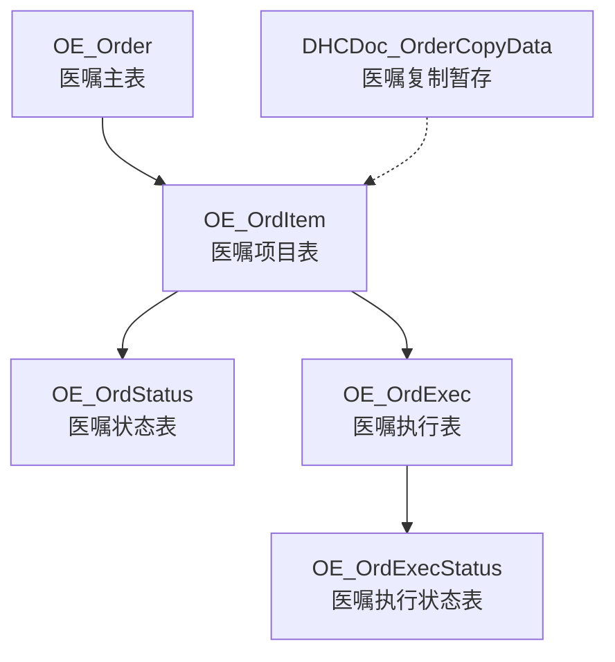
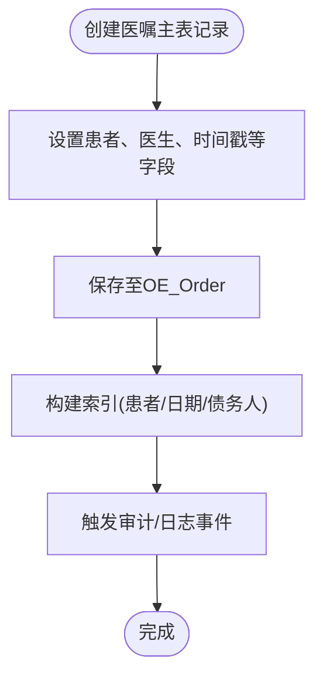
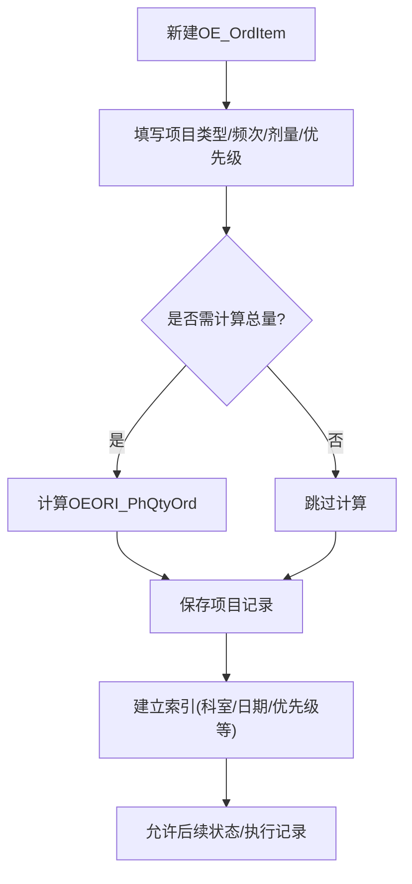
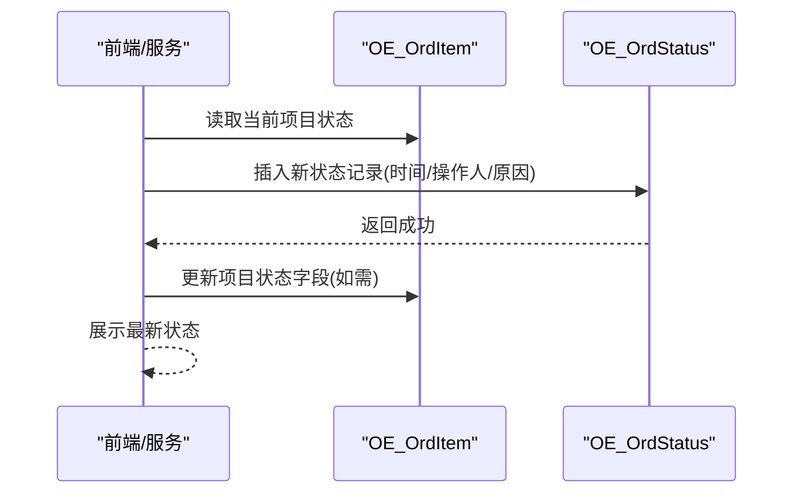
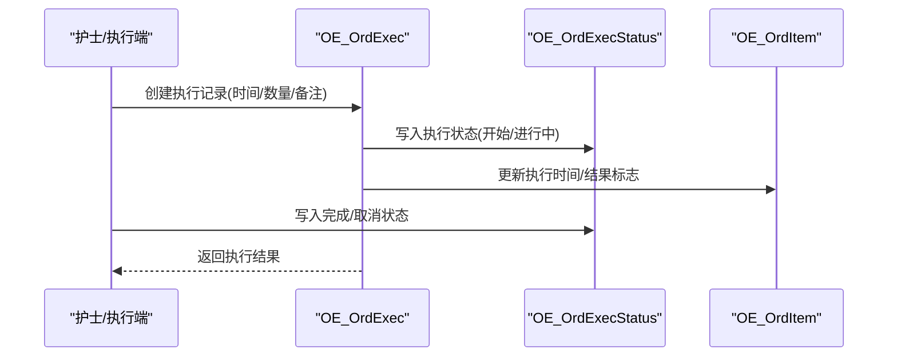
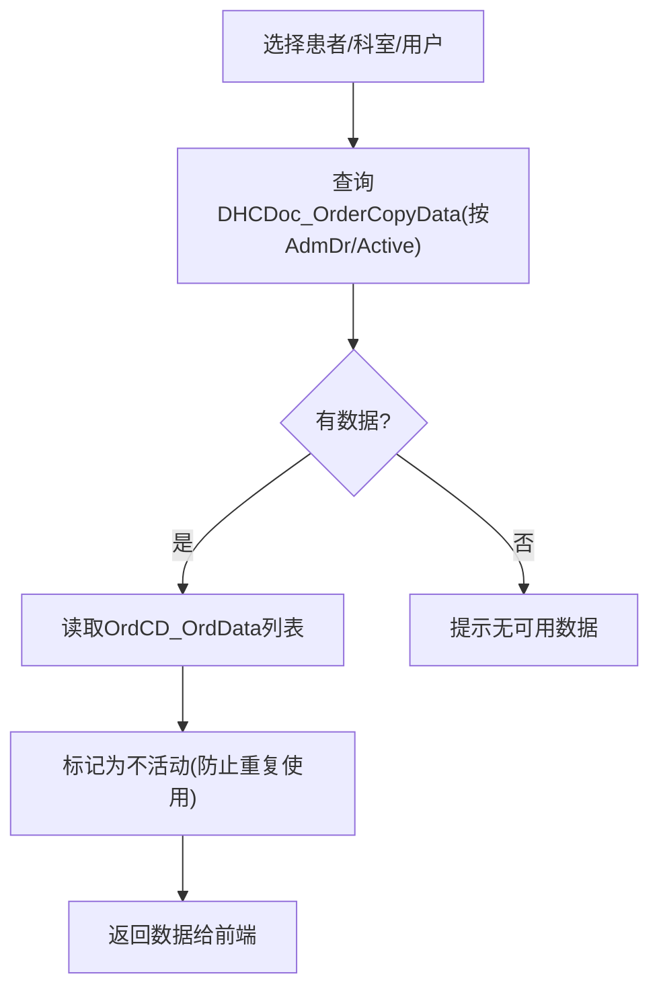
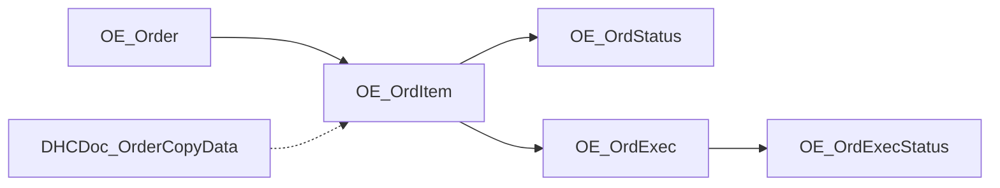

# 医嘱管理表

<cite>
**本文引用的文件**
- [OEOrder.cls](file://src/backend/doc-ws/User/OEOrder.cls)
- [OEOrdItem.cls](file://src/backend/doc-ws/User/OEOrdItem.cls)
- [OEOrdStatus.cls](file://src/backend/doc-ws/User/OEOrdStatus.cls)
- [OEOrdExec.cls](file://src/backend/doc-ws/User/OEOrdExec.cls)
- [OEOrdExecStatus.cls](file://src/backend/doc-ws/User/OEOrdExecStatus.cls)
- [DHCDocOrderCopyData.cls](file://src/backend/doc-ws/User/DHCDocOrderCopyData.cls)
</cite>

## 目录
1. [简介](#简介)
2. [项目结构](#项目结构)
3. [核心组件](#核心组件)
4. [架构总览](#架构总览)
5. [详细组件分析](#详细组件分析)
6. [依赖关系分析](#依赖关系分析)
7. [性能考虑](#性能考虑)
8. [故障排查指南](#故障排查指南)
9. [结论](#结论)
10. [附录](#附录)

## 简介
本文件围绕医嘱管理的核心数据模型与业务流转，系统梳理医嘱主表、医嘱项目表、医嘱状态表以及执行与执行状态表的数据库设计与实现。重点覆盖：
- 医嘱生命周期与状态流转（开立、确认、执行、完成等）
- 数据完整性约束与关联关系
- 医嘱复制、关联、执行跟踪的数据库实现
- 常用查询思路与性能优化建议
- 医嘱主表字段定义（患者、医生、时间戳等）与医嘱项目明细结构（药品、检查、治疗等）

## 项目结构
医嘱相关的数据实体以类形式持久化到SQL存储，并通过关系映射形成“主表-子项-状态/执行”的层次结构。关键类与对应表如下：
- 医嘱主表：User.OEOrder -> OE_Order
- 医嘱项目表：User.OEOrdItem -> OE_OrdItem
- 医嘱状态表：User.OEOrdStatus -> OE_OrdStatus
- 医嘱执行表：User.OEOrdExec -> OE_OrdExec
- 医嘱执行状态表：User.OEOrdExecStatus -> OE_OrdExecStatus
- 医嘱复制暂存：User.DHCDocOrderCopyData -> DHCDoc_OrderCopyData



**图表来源**
- [OEOrder.cls:1-201](file://src/backend/doc-ws/User/OEOrder.cls#L1-L201)
- [OEOrdItem.cls:1-800](file://src/backend/doc-ws/User/OEOrdItem.cls#L1-L800)
- [OEOrdStatus.cls:1-158](file://src/backend/doc-ws/User/OEOrdStatus.cls#L1-L158)
- [OEOrdExec.cls:1-800](file://src/backend/doc-ws/User/OEOrdExec.cls#L1-L800)
- [OEOrdExecStatus.cls:1-190](file://src/backend/doc-ws/User/OEOrdExecStatus.cls#L1-L190)
- [DHCDocOrderCopyData.cls:1-146](file://src/backend/doc-ws/User/DHCDocOrderCopyData.cls#L1-L146)

**章节来源**
- [OEOrder.cls:1-201](file://src/backend/doc-ws/User/OEOrder.cls#L1-L201)
- [OEOrdItem.cls:1-800](file://src/backend/doc-ws/User/OEOrdItem.cls#L1-L800)
- [OEOrdStatus.cls:1-158](file://src/backend/doc-ws/User/OEOrdStatus.cls#L1-L158)
- [OEOrdExec.cls:1-800](file://src/backend/doc-ws/User/OEOrdExec.cls#L1-L800)
- [OEOrdExecStatus.cls:1-190](file://src/backend/doc-ws/User/OEOrdExecStatus.cls#L1-L190)
- [DHCDocOrderCopyData.cls:1-146](file://src/backend/doc-ws/User/DHCDocOrderCopyData.cls#L1-L146)

## 核心组件
- 医嘱主表（OE_Order）：承载一次就诊/住院下的医嘱集合，包含患者、开嘱医生、时间戳等核心信息，并维护与项目、执行等子实体的关系。
- 医嘱项目表（OE_OrdItem）：描述具体医嘱条目，包括项目类型、频次、剂量、优先级、科室、费用、结果标记、执行时间等，是医嘱业务的核心载体。
- 医嘱状态表（OE_OrdStatus）：记录项目级状态变更历史（如开立、确认、停止等），含时间、操作人、原因等。
- 医嘱执行表（OE_OrdExec）：记录每次执行实例（如给药、检查、治疗的具体执行），含执行起止时间、执行人、数量、批次、签名等。
- 医嘱执行状态表（OE_OrdExecStatus）：记录执行实例的状态变迁（如开始、暂停、完成、取消），含状态、原因、时间、操作人。
- 医嘱复制暂存（DHCDoc_OrderCopyData）：用于在录入界面缓存待复制的医嘱数据，支持按患者、科室、用户维度检索与激活。

**章节来源**
- [OEOrder.cls:1-201](file://src/backend/doc-ws/User/OEOrder.cls#L1-L201)
- [OEOrdItem.cls:1-800](file://src/backend/doc-ws/User/OEOrdItem.cls#L1-L800)
- [OEOrdStatus.cls:1-158](file://src/backend/doc-ws/User/OEOrdStatus.cls#L1-L158)
- [OEOrdExec.cls:1-800](file://src/backend/doc-ws/User/OEOrdExec.cls#L1-L800)
- [OEOrdExecStatus.cls:1-190](file://src/backend/doc-ws/User/OEOrdExecStatus.cls#L1-L190)
- [DHCDocOrderCopyData.cls:1-146](file://src/backend/doc-ws/User/DHCDocOrderCopyData.cls#L1-L146)

## 架构总览
医嘱数据采用“主-子-状态/执行”的分层设计：
- OE_Order 作为根节点，通过关系指向多个 OE_OrdItem
- 每个 OE_OrdItem 可产生多条 OE_OrdStatus 状态变更记录
- 每个 OE_OrdItem 可产生多条 OE_OrdExec 执行记录
- 每条 OE_OrdExec 又可产生多条 OE_OrdExecStatus 执行状态变更记录
- 医嘱复制流程通过 DHCDoc_OrderCopyData 临时缓存，再落地为新的 OE_OrdItem

```mermaid
classDiagram
class OE_Order {
+OEORD_RowId
+OEORD_Adm_DR
+OEORD_Date
+OEORD_Time
+OEORD_Doctor_DR
}
class OE_OrdItem {
+OEORI_Childsub
+OEORI_OrdEnt_DR
+OEORI_ItmMast_DR
+OEORI_PrescType
+OEORI_ItemStat_DR
+OEORI_SttDat
+OEORI_SttTim
+OEORI_DoseQty
+OEORI_PHFreq_DR
+OEORI_DosageDR
+OEORI_Unit_DR
+OEORI_Billed
+OEORI_ResultFlag
+OEORI_DateExecuted
+OEORI_TimeExecuted
+OEORI_UserExecuted
}
class OE_OrdStatus {
+ST_Childsub
+ST_Date
+ST_Time
+ST_Status_DR
+ST_User_DR
+ST_Reason
+ST_TextStatus
+ST_Reason_DR
}
class OE_OrdExec {
+OEORE_Childsub
+OEORE_OEORI_ParRef
+OEORE_ExStDate
+OEORE_ExStTime
+OEORE_QtyAdmin
+OEORE_Order_Status_DR
+OEORE_DateExecuted
+OEORE_TimeExecuted
+OEORE_Notes
}
class OE_OrdExecStatus {
+STCH_Childsub
+STCH_AdminStatus_DR
+STCH_Reason_DR
+STCH_Date
+STCH_Time
+STCH_User_DR
}
class DHCDoc_OrderCopyData {
+OrdCD_RowID
+OrdCD_AdmDr
+OrdCD_LocDr
+OrdCD_UserDr
+OrdCD_OrdData
+OrdCD_Active
}
OE_Order "1" o-- "many" OE_OrdItem : "ChildOEOrdItem"
OE_OrdItem "1" o-- "many" OE_OrdStatus : "ChildOEOrdStatus"
OE_OrdItem "1" o-- "many" OE_OrdExec : "ChildOEOrdExec"
OE_OrdExec "1" o-- "many" OE_OrdExecStatus : "ChildOEOrdExecStatus"
DHCDoc_OrderCopyData -.-> OE_OrdItem : "复制生成"
```

**图表来源**
- [OEOrder.cls:1-201](file://src/backend/doc-ws/User/OEOrder.cls#L1-L201)
- [OEOrdItem.cls:1-800](file://src/backend/doc-ws/User/OEOrdItem.cls#L1-L800)
- [OEOrdStatus.cls:1-158](file://src/backend/doc-ws/User/OEOrdStatus.cls#L1-L158)
- [OEOrdExec.cls:1-800](file://src/backend/doc-ws/User/OEOrdExec.cls#L1-L800)
- [OEOrdExecStatus.cls:1-190](file://src/backend/doc-ws/User/OEOrdExecStatus.cls#L1-L190)
- [DHCDocOrderCopyData.cls:1-146](file://src/backend/doc-ws/User/DHCDocOrderCopyData.cls#L1-L146)

## 详细组件分析

### 医嘱主表（OE_Order）
- 作用：承载一次就诊/住院下的医嘱集合，提供患者、开嘱医生、时间戳等上下文信息。
- 关键字段
  - 行标识：OEORD_RowId（自增主键）
  - 患者关联：OEORD_Adm_DR（指向患者入院/就诊实体）
  - 时间戳：OEORD_Date、OEORD_Time（医嘱日期与时间）
  - 医生信息：OEORD_Doctor_DR（开嘱医生）
  - 其他：OEORD_ARCOP_DR、OEORD_OEOTC_DR、OEORD_SundryDebtor_DR（扩展/计费相关）
- 索引与触发器
  - 主键索引：RowIDBasedIDKeyIndex
  - 自定义索引：按患者、日期、债务人等建立索引以提升查询效率
  - 触发器：插入/更新/删除前后触发日志或审计动作



**图表来源**
- [OEOrder.cls:1-201](file://src/backend/doc-ws/User/OEOrder.cls#L1-L201)

**章节来源**
- [OEOrder.cls:1-201](file://src/backend/doc-ws/User/OEOrder.cls#L1-L201)

### 医嘱项目表（OE_OrdItem）
- 作用：描述具体的医嘱条目，涵盖药品、检查、治疗、检验等多种类型，承载执行所需的全部参数。
- 关键字段（节选）
  - 主键：OEORI_Childsub（项目级唯一标识）
  - 项目类型与归属：OEORI_OrdEnt_DR、OEORI_ItmMast_DR、OEORI_OrderType_DR
  - 处方与计费：OEORIPrescType、OEORIBillDesc、OEORI_Price、OEORI_Cost、OEORI_Billed
  - 频次与剂量：OEORI_DoseQty、OEORI_PHFreq_DR、OEORI_DosageDR、OEORI_Unit_DR、OEORI_Time、OEORI_FlowQty
  - 优先级与计划：OEORI_Priority_DR、OEORI_SttDat、OEORI_SttTim、OEORI_EndDate、OEORI_EndTime
  - 执行与结果：OEORI_DateExecuted、OEORI_TimeExecuted、OEORI_UserExecuted、OEORI_ResultFlag、OEORI_ResultAvailable
  - 科室与接收：OEORI_OrdDept_DR、OEORI_RecDep_DR、OEORI_CollectionDep_DR
  - 备注与说明：OEORI_Remarks、OEORI_DepProcNotes、OEORI_PhSpecInstr
  - 其他：过敏、针具、部位、麻醉、影像参数、血制品、等待列表等
- 计算字段
  - OEORI_PhQtyOrd：根据剂量、频次、持续时间、优先级计算总量
  - OEORI_FinDate：根据开始时间与持续时长计算结束日期
- 关系
  - 父引用：OEORIOEORDParRef（指向OE_Order）
  - 子关系：状态、执行、结果、标本、牙齿、账单、SNOMED编码、问题、医生、饮食修饰、财务、参考医生、警示、行动、诊断、剂量数量等



**图表来源**
- [OEOrdItem.cls:1-800](file://src/backend/doc-ws/User/OEOrdItem.cls#L1-L800)

**章节来源**
- [OEOrdItem.cls:1-800](file://src/backend/doc-ws/User/OEOrdItem.cls#L1-L800)

### 医嘱状态表（OE_OrdStatus）
- 作用：记录项目级状态变更历史，支撑“开立-确认-停止-完成”等状态机。
- 关键字段
  - 父引用：ST_ParRef（指向OE_OrdItem）
  - 子序号：ST_Childsub（状态序列号）
  - 时间：ST_Date、ST_Time
  - 状态：ST_Status_DR（状态字典）
  - 操作人：ST_User_DR
  - 原因：ST_Reason、ST_Reason_DR、ST_TextStatus、ST_ReasonComtent
- 索引
  - 按日期建立索引，便于按时间范围查询状态轨迹



**图表来源**
- [OEOrdStatus.cls:1-158](file://src/backend/doc-ws/User/OEOrdStatus.cls#L1-L158)
- [OEOrdItem.cls:1-800](file://src/backend/doc-ws/User/OEOrdItem.cls#L1-L800)

**章节来源**
- [OEOrdStatus.cls:1-158](file://src/backend/doc-ws/User/OEOrdStatus.cls#L1-L158)

### 医嘱执行表（OE_OrdExec）
- 作用：记录每次执行实例（如给药、检查、治疗的具体执行），支持多次执行与追踪。
- 关键字段
  - 父引用：OEORE_OEORI_ParRef（指向OE_OrdItem）
  - 子序号：OEORE_Childsub（执行序列号）
  - 执行时间：OEORE_ExStDate、OEORE_ExStTime、OEORE_StDateTime（组合）
  - 数量与单位：OEORE_QtyAdmin、OEORE_CTUOM_DR
  - 状态：OEORE_Order_Status_DR（执行状态字典）
  - 完成时间：OEORE_DateExecuted、OEORE_TimeExecuted
  - 备注与签名：OEORE_Notes、OEORE_Signature、OEORE_SignFile
  - 其他：批次、过敏/皮试结果、路径、替代接收科室、预约、耗时、效果等
- 索引
  - 按执行日期、执行时间、科室、未执行、停止执行、体积等多维索引提升查询性能



**图表来源**
- [OEOrdExec.cls:1-800](file://src/backend/doc-ws/User/OEOrdExec.cls#L1-L800)
- [OEOrdExecStatus.cls:1-190](file://src/backend/doc-ws/User/OEOrdExecStatus.cls#L1-L190)
- [OEOrdItem.cls:1-800](file://src/backend/doc-ws/User/OEOrdItem.cls#L1-L800)

**章节来源**
- [OEOrdExec.cls:1-800](file://src/backend/doc-ws/User/OEOrdExec.cls#L1-L800)
- [OEOrdExecStatus.cls:1-190](file://src/backend/doc-ws/User/OEOrdExecStatus.cls#L1-L190)

### 医嘱复制功能（DHCDoc_OrderCopyData）
- 作用：在医嘱录入界面缓存待复制的医嘱数据，支持按患者、科室、用户维度检索与激活，避免重复录入。
- 关键字段
  - 使用方：OrdCD_UserDr、OrdCD_LocDr
  - 目标患者：OrdCD_AdmDr
  - 数据体：OrdCD_OrdData（列表）
  - 活动标志：OrdCD_Active（Y/N）
  - 更新信息：OrdCD_UpdateUserDr、OrdCD_UpdateDate、OrdCD_UpdateTime
- 方法
  - GetCopyItem：获取指定患者的待复制医嘱列表，并标记为非活动
  - GetCopyItemJson：返回JSON格式数据供前端加载



**图表来源**
- [DHCDocOrderCopyData.cls:1-146](file://src/backend/doc-ws/User/DHCDocOrderCopyData.cls#L1-L146)

**章节来源**
- [DHCDocOrderCopyData.cls:1-146](file://src/backend/doc-ws/User/DHCDocOrderCopyData.cls#L1-L146)

## 依赖关系分析
- 耦合度
  - OE_OrdItem 与 OE_OrdStatus、OE_OrdExec 强耦合（一对多），确保状态与执行可追溯
  - OE_OrdExec 与 OE_OrdExecStatus 强耦合，保证执行过程可审计
  - OE_Order 与 OE_OrdItem 弱耦合（通过关系），便于扩展不同医嘱类型
- 外部依赖
  - 字典与枚举：OECOrderStatus、OECOrderAdminStatus、PHCFreq、PHCDuration、CTLoc、SSUser、CTCareProv 等
  - 计费与库存：ARCSundryDebtor、OEDispensing、CTUOM 等
- 潜在循环
  - 通过父子关系单向引用，未见直接循环依赖；注意在扩展时保持单向引用以避免环



**图表来源**
- [OEOrder.cls:1-201](file://src/backend/doc-ws/User/OEOrder.cls#L1-L201)
- [OEOrdItem.cls:1-800](file://src/backend/doc-ws/User/OEOrdItem.cls#L1-L800)
- [OEOrdStatus.cls:1-158](file://src/backend/doc-ws/User/OEOrdStatus.cls#L1-L158)
- [OEOrdExec.cls:1-800](file://src/backend/doc-ws/User/OEOrdExec.cls#L1-L800)
- [OEOrdExecStatus.cls:1-190](file://src/backend/doc-ws/User/OEOrdExecStatus.cls#L1-L190)
- [DHCDocOrderCopyData.cls:1-146](file://src/backend/doc-ws/User/DHCDocOrderCopyData.cls#L1-L146)

**章节来源**
- [OEOrder.cls:1-201](file://src/backend/doc-ws/User/OEOrder.cls#L1-L201)
- [OEOrdItem.cls:1-800](file://src/backend/doc-ws/User/OEOrdItem.cls#L1-L800)
- [OEOrdStatus.cls:1-158](file://src/backend/doc-ws/User/OEOrdStatus.cls#L1-L158)
- [OEOrdExec.cls:1-800](file://src/backend/doc-ws/User/OEOrdExec.cls#L1-L800)
- [OEOrdExecStatus.cls:1-190](file://src/backend/doc-ws/User/OEOrdExecStatus.cls#L1-L190)
- [DHCDocOrderCopyData.cls:1-146](file://src/backend/doc-ws/User/DHCDocOrderCopyData.cls#L1-L146)

## 性能考虑
- 索引策略
  - OE_Order：按患者（Adm）、日期、债务人建立索引，加速按患者/日期的医嘱检索
  - OE_OrdExec：按执行日期、执行时间、科室、未执行、停止执行、体积等建立条件索引，提升执行队列与统计查询性能
  - OE_OrdStatus：按日期建立索引，便于状态轨迹查询
- 计算字段
  - OE_OrdItem 中的总量与结束日期通过计算字段减少冗余存储，但需注意计算开销
- 批量操作
  - 医嘱复制通过列表缓存一次性传输，减少多次往返
- 事务与触发器
  - 触发器用于审计与日志，建议在高峰期评估触发器开销，必要时异步化

[本节为通用指导，无需特定文件来源]

## 故障排查指南
- 常见问题
  - 状态不一致：检查 OE_OrdStatus 与 OE_OrdItem 的状态字段是否同步
  - 执行缺失：核查 OE_OrdExec 是否存在对应执行记录，以及 OE_OrdExecStatus 是否完整
  - 复制失败：确认 DHCDoc_OrderCopyData 中 OrdCD_Active 是否为 Y，且患者/科室/用户匹配
- 定位步骤
  - 通过患者与日期范围筛选 OE_Order
  - 根据 OE_Order 找到 OE_OrdItem，再查看 OE_OrdStatus 与 OE_OrdExec
  - 若涉及执行状态异常，查看 OE_OrdExecStatus 的时间线与原因
- 审计日志
  - 利用各表的触发器记录插入/更新/删除事件，辅助回溯

**章节来源**
- [OEOrder.cls:1-201](file://src/backend/doc-ws/User/OEOrder.cls#L1-L201)
- [OEOrdItem.cls:1-800](file://src/backend/doc-ws/User/OEOrdItem.cls#L1-L800)
- [OEOrdStatus.cls:1-158](file://src/backend/doc-ws/User/OEOrdStatus.cls#L1-L158)
- [OEOrdExec.cls:1-800](file://src/backend/doc-ws/User/OEOrdExec.cls#L1-L800)
- [OEOrdExecStatus.cls:1-190](file://src/backend/doc-ws/User/OEOrdExecStatus.cls#L1-L190)
- [DHCDocOrderCopyData.cls:1-146](file://src/backend/doc-ws/User/DHCDocOrderCopyData.cls#L1-L146)

## 结论
本方案通过“主-子-状态/执行”的分层数据模型，实现了医嘱从开立到执行的完整闭环管理。借助丰富的索引与计算字段，系统在可读性与性能之间取得平衡。医嘱复制机制提升了录入效率，状态与执行状态表确保了全过程可追溯。未来可在触发器异步化、批量处理与查询优化方面进一步演进。

[本节为总结性内容，无需特定文件来源]

## 附录
- 常用查询思路（示例）
  - 按患者与日期查询医嘱项目：基于 OE_Order 的 Adm 与 Date 索引，关联 OE_OrdItem
  - 查询未执行医嘱：基于 OE_OrdExec 的条件索引（未执行）
  - 查询执行轨迹：基于 OE_OrdExec 与 OE_OrdExecStatus 的时间线
  - 查询状态历史：基于 OE_OrdStatus 的日期索引
- 注意事项
  - 计算字段可能带来额外开销，需在高频写入场景评估
  - 触发器审计可能影响吞吐，建议在高并发场景进行性能测试

[本节为通用指导，无需特定文件来源]