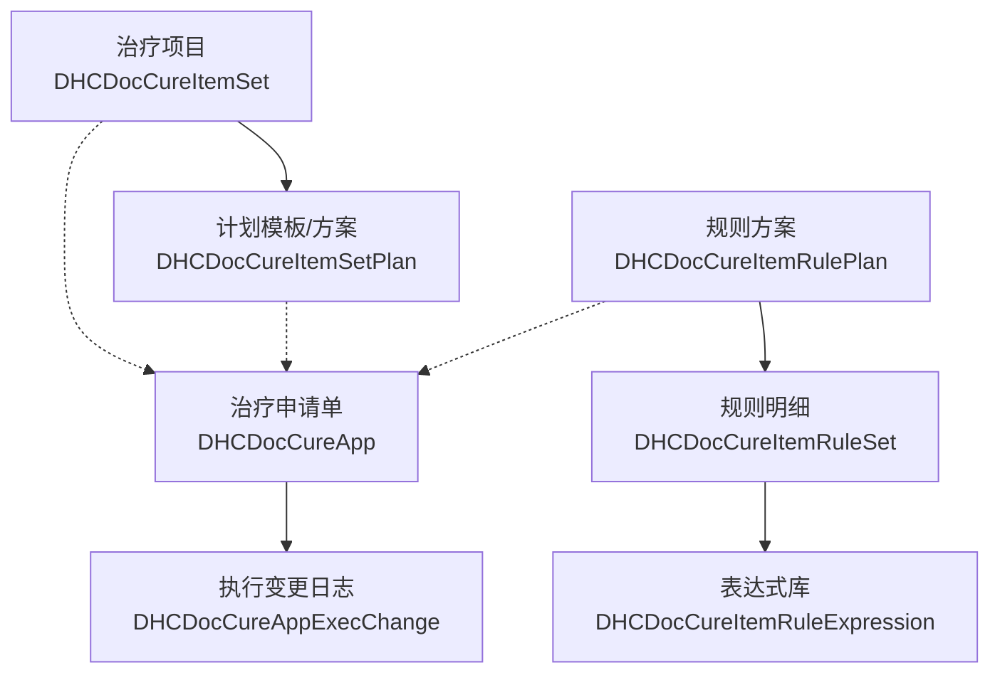
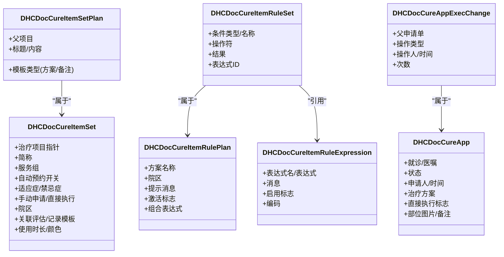
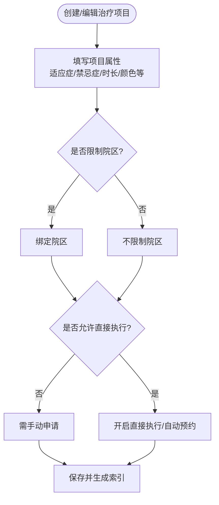
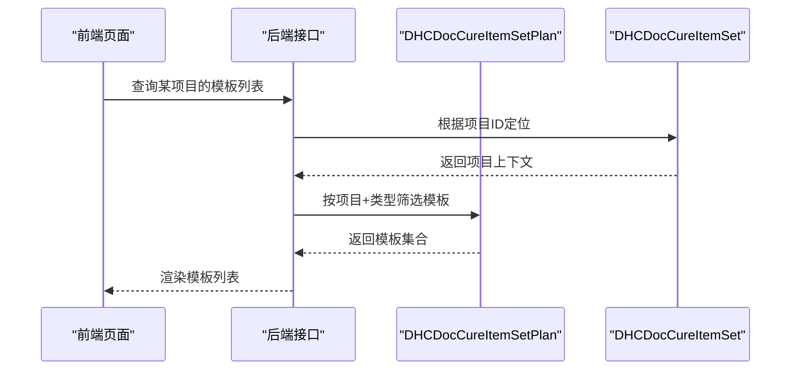
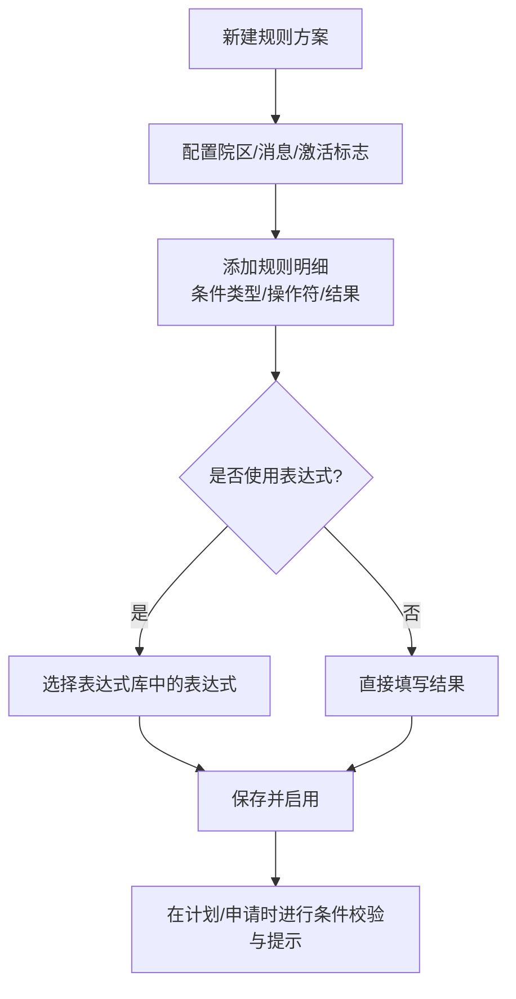
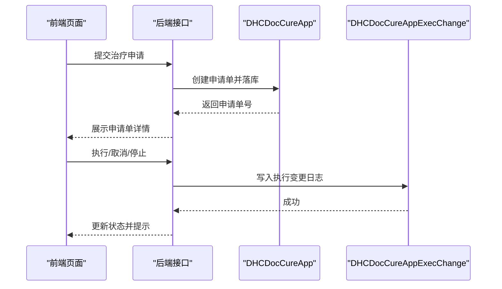
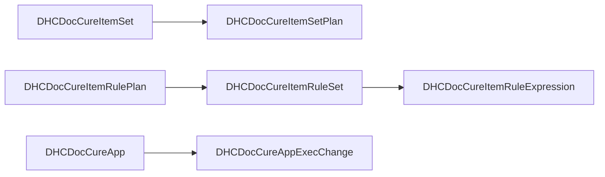

# 治疗计划管理

<cite>
**本文引用的文件**
- [DHCDocCureItemSet.cls](file://src/backend/cure-ws/User/DHCDocCureItemSet.cls)
- [DHCDocCureItemSetPlan.cls](file://src/backend/cure-ws/User/DHCDocCureItemSetPlan.cls)
- [DHCDocCureItemRulePlan.cls](file://src/backend/cure-ws/User/DHCDocCureItemRulePlan.cls)
- [DHCDocCureItemRuleSet.cls](file://src/backend/cure-ws/User/DHCDocCureItemRuleSet.cls)
- [DHCDocCureItemRuleExpression.cls](file://src/backend/cure-ws/User/DHCDocCureItemRuleExpression.cls)
- [DHCDocCureApp.cls](file://src/backend/cure-ws/User/DHCDocCureApp.cls)
- [DHCDocCureAppExecChange.cls](file://src/backend/cure-ws/User/DHCDocCureAppExecChange.cls)
</cite>

## 目录
1. [简介](#简介)
2. [项目结构](#项目结构)
3. [核心组件](#核心组件)
4. [架构总览](#架构总览)
5. [详细组件分析](#详细组件分析)
6. [依赖关系分析](#依赖关系分析)
7. [性能考虑](#性能考虑)
8. [故障排查指南](#故障排查指南)
9. [结论](#结论)
10. [附录](#附录)

## 简介
本文件围绕“治疗计划管理”功能，系统阐述治疗项目设置、治疗计划制定与执行跟踪的核心业务逻辑与技术实现。重点覆盖：
- 治疗项目的定义、配置与管理（DHCDocCureItemSet）
- 治疗计划模板与方案（DHCDocCureItemSetPlan）
- 规则配置体系（DHCDocCureItemRulePlan / DHCDocCureItemRuleSet / DHCDocCureItemRuleExpression）
- 治疗申请、执行与变更记录（DHCDocCureApp / DHCDocCureAppExecChange）
并给出数据模型、流程时序、常见问题与优化建议，帮助前后端开发与实施人员快速理解与落地。

## 项目结构
治疗计划相关代码位于后端 cure-ws 的 User 命名空间下，采用类（Class）+ SQL 存储映射的方式组织数据与关系。关键文件职责如下：
- 治疗项目主表：DHCDocCureItemSet.cls
- 治疗计划模板/方案：DHCDocCureItemSetPlan.cls
- 规则方案与明细：DHCDocCureItemRulePlan.cls、DHCDocCureItemRuleSet.cls
- 表达式库：DHCDocCureItemRuleExpression.cls
- 治疗申请单：DHCDocCureApp.cls
- 执行变更日志：DHCDocCureAppExecChange.cls

图表来源
- [DHCDocCureItemSet.cls:1-252](file://src/backend/cure-ws/User/DHCDocCureItemSet.cls#L1-L252)
- [DHCDocCureItemSetPlan.cls:1-88](file://src/backend/cure-ws/User/DHCDocCureItemSetPlan.cls#L1-L88)
- [DHCDocCureItemRulePlan.cls:1-56](file://src/backend/cure-ws/User/DHCDocCureItemRulePlan.cls#L1-L56)
- [DHCDocCureItemRuleSet.cls:1-87](file://src/backend/cure-ws/User/DHCDocCureItemRuleSet.cls#L1-L87)
- [DHCDocCureItemRuleExpression.cls:1-49](file://src/backend/cure-ws/User/DHCDocCureItemRuleExpression.cls#L1-L49)
- [DHCDocCureApp.cls:1-439](file://src/backend/cure-ws/User/DHCDocCureApp.cls#L1-L439)
- [DHCDocCureAppExecChange.cls:1-125](file://src/backend/cure-ws/User/DHCDocCureAppExecChange.cls#L1-L125)

章节来源
- [DHCDocCureItemSet.cls:1-252](file://src/backend/cure-ws/User/DHCDocCureItemSet.cls#L1-L252)
- [DHCDocCureItemSetPlan.cls:1-88](file://src/backend/cure-ws/User/DHCDocCureItemSetPlan.cls#L1-L88)
- [DHCDocCureItemRulePlan.cls:1-56](file://src/backend/cure-ws/User/DHCDocCureItemRulePlan.cls#L1-L56)
- [DHCDocCureItemRuleSet.cls:1-87](file://src/backend/cure-ws/User/DHCDocCureItemRuleSet.cls#L1-L87)
- [DHCDocCureItemRuleExpression.cls:1-49](file://src/backend/cure-ws/User/DHCDocCureItemRuleExpression.cls#L1-L49)
- [DHCDocCureApp.cls:1-439](file://src/backend/cure-ws/User/DHCDocCureApp.cls#L1-L439)
- [DHCDocCureAppExecChange.cls:1-125](file://src/backend/cure-ws/User/DHCDocCureAppExecChange.cls#L1-L125)

## 核心组件
- 治疗项目设置（DHCDocCureItemSet）
  - 定义治疗项目的主信息：关联基础治疗项目、服务组、是否自动预约/直接执行、适应症/禁忌症、院区、关联评估/记录模板、使用时长、颜色标识等。
  - 提供多索引以支持按院区+项目、仅项目、评估模板、更新时间等维度检索。
- 治疗计划模板/方案（DHCDocCureItemSetPlan）
  - 作为治疗项目下的子项，承载“方案模板”或“备注模板”，包含标题与详细内容，并通过父子关系与项目绑定。
- 规则配置（DHCDocCureItemRulePlan / DHCDocCureItemRuleSet / DHCDocCureItemRuleExpression）
  - 规则方案：按院区维护，可配置提示消息、激活标志、组合表达式。
  - 规则明细：定义条件类型、操作符、结果、引用值、表达式ID、优先级等。
  - 表达式库：集中维护可复用的表达式描述、表达式文本、启用状态与编码。
- 治疗申请与执行（DHCDocCureApp / DHCDocCureAppExecChange）
  - 申请单：记录就诊、医嘱关联、状态、申请人/时间、治疗方案、是否直接执行、部位图片/备注、科室、来源等，并提供多维度索引。
  - 执行变更：记录每次执行/取消/停止的操作人、时间、次数等，形成审计轨迹。

章节来源
- [DHCDocCureItemSet.cls:1-252](file://src/backend/cure-ws/User/DHCDocCureItemSet.cls#L1-L252)
- [DHCDocCureItemSetPlan.cls:1-88](file://src/backend/cure-ws/User/DHCDocCureItemSetPlan.cls#L1-L88)
- [DHCDocCureItemRulePlan.cls:1-56](file://src/backend/cure-ws/User/DHCDocCureItemRulePlan.cls#L1-L56)
- [DHCDocCureItemRuleSet.cls:1-87](file://src/backend/cure-ws/User/DHCDocCureItemRuleSet.cls#L1-L87)
- [DHCDocCureItemRuleExpression.cls:1-49](file://src/backend/cure-ws/User/DHCDocCureItemRuleExpression.cls#L1-L49)
- [DHCDocCureApp.cls:1-439](file://src/backend/cure-ws/User/DHCDocCureApp.cls#L1-L439)
- [DHCDocCureAppExecChange.cls:1-125](file://src/backend/cure-ws/User/DHCDocCureAppExecChange.cls#L1-L125)

## 架构总览
治疗计划管理的数据与流程由“项目-计划-规则-申请-执行”五层构成：
- 项目层：定义可被纳入计划的治疗项目及其属性。
- 计划层：基于项目构建方案模板/备注模板，供临床复用。
- 规则层：在方案层面进行条件判断与提示，保障安全与合规。
- 申请层：将计划转化为具体患者的治疗申请单。
- 执行层：对申请单进行执行、取消、停止等操作并留痕。

图表来源
- [DHCDocCureItemSet.cls:1-252](file://src/backend/cure-ws/User/DHCDocCureItemSet.cls#L1-L252)
- [DHCDocCureItemSetPlan.cls:1-88](file://src/backend/cure-ws/User/DHCDocCureItemSetPlan.cls#L1-L88)
- [DHCDocCureItemRulePlan.cls:1-56](file://src/backend/cure-ws/User/DHCDocCureItemRulePlan.cls#L1-L56)
- [DHCDocCureItemRuleSet.cls:1-87](file://src/backend/cure-ws/User/DHCDocCureItemRuleSet.cls#L1-L87)
- [DHCDocCureItemRuleExpression.cls:1-49](file://src/backend/cure-ws/User/DHCDocCureItemRuleExpression.cls#L1-L49)
- [DHCDocCureApp.cls:1-439](file://src/backend/cure-ws/User/DHCDocCureApp.cls#L1-L439)
- [DHCDocCureAppExecChange.cls:1-125](file://src/backend/cure-ws/User/DHCDocCureAppExecChange.cls#L1-L125)

## 详细组件分析

### 治疗项目设置（DHCDocCureItemSet）
- 业务含义
  - 定义一个可被计划引用的治疗项目，包括其基本属性、适用范围（院区）、是否允许直接执行、是否需手动申请、关联评估/记录模板、使用时长与展示色等。
- 关键字段与作用
  - 治疗项目指针：与基础治疗项目建立关联。
  - 服务组：用于资源与服务分组管理。
  - 自动预约/直接执行：控制门诊/住院场景下的预约与执行策略。
  - 适应症/禁忌症：为规则校验与提示提供依据。
  - 院区：限定项目可用范围。
  - 关联模板：便于在计划或记录中自动带入评估/记录模板。
- 索引设计
  - 按院区+项目、仅项目、评估模板、更新时间等多维索引，提升查询效率。
- 扩展能力
  - 通过扩展字段与关系（如扩展、附加项、记录模板）增强灵活性。

图表来源
- [DHCDocCureItemSet.cls:1-252](file://src/backend/cure-ws/User/DHCDocCureItemSet.cls#L1-L252)

章节来源
- [DHCDocCureItemSet.cls:1-252](file://src/backend/cure-ws/User/DHCDocCureItemSet.cls#L1-L252)

### 治疗计划模板/方案（DHCDocCureItemSetPlan）
- 业务含义
  - 针对某一治疗项目，维护“方案模板”或“备注模板”，用于快速生成患者层面的治疗计划。
- 关键字段与作用
  - 父项目：明确所属治疗项目。
  - 标题/内容：方案要点与说明。
  - 模板类型：区分方案模板与备注模板。
- 使用方式
  - 在创建治疗申请时，可从模板选择并实例化为具体患者的计划条目。

图表来源
- [DHCDocCureItemSetPlan.cls:1-88](file://src/backend/cure-ws/User/DHCDocCureItemSetPlan.cls#L1-L88)
- [DHCDocCureItemSet.cls:1-252](file://src/backend/cure-ws/User/DHCDocCureItemSet.cls#L1-L252)

章节来源
- [DHCDocCureItemSetPlan.cls:1-88](file://src/backend/cure-ws/User/DHCDocCureItemSetPlan.cls#L1-L88)

### 规则配置体系（DHCDocCureItemRulePlan / DHCDocCureItemRuleSet / DHCDocCureItemRuleExpression）
- 业务含义
  - 在方案层面定义条件与提示，确保治疗项目使用的安全性与规范性。
- 数据结构
  - 规则方案：按院区维护，可配置提示消息、激活标志、组合表达式。
  - 规则明细：定义条件类型（如性别、年龄、诊断等）、操作符（包含/不包含/大于/等于/小于）、结果、表达式ID、优先级等。
  - 表达式库：集中管理可复用的表达式文本、描述、启用状态与编码。
- 典型流程
  - 创建规则方案 -> 添加多条规则明细 -> 引用表达式 -> 激活方案 -> 在计划/申请时进行条件校验与提示。

图表来源
- [DHCDocCureItemRulePlan.cls:1-56](file://src/backend/cure-ws/User/DHCDocCureItemRulePlan.cls#L1-L56)
- [DHCDocCureItemRuleSet.cls:1-87](file://src/backend/cure-ws/User/DHCDocCureItemRuleSet.cls#L1-L87)
- [DHCDocCureItemRuleExpression.cls:1-49](file://src/backend/cure-ws/User/DHCDocCureItemRuleExpression.cls#L1-L49)

章节来源
- [DHCDocCureItemRulePlan.cls:1-56](file://src/backend/cure-ws/User/DHCDocCureItemRulePlan.cls#L1-L56)
- [DHCDocCureItemRuleSet.cls:1-87](file://src/backend/cure-ws/User/DHCDocCureItemRuleSet.cls#L1-L87)
- [DHCDocCureItemRuleExpression.cls:1-49](file://src/backend/cure-ws/User/DHCDocCureItemRuleExpression.cls#L1-L49)

### 治疗申请与执行跟踪（DHCDocCureApp / DHCDocCureAppExecChange）
- 业务含义
  - 将计划落实到具体患者，形成申请单；在执行过程中记录每次操作的审计信息。
- 关键字段与作用
  - 申请单：关联就诊与医嘱、状态、申请人/时间、治疗方案、是否直接执行、部位图片/备注、治疗科室、来源等。
  - 执行变更：记录执行/取消/停止的操作人、时间、次数等，支持按类型与时间检索。
- 典型流程
  - 从模板生成申请单 -> 审核/分配 -> 执行/取消/停止 -> 生成变更日志。

图表来源
- [DHCDocCureApp.cls:1-439](file://src/backend/cure-ws/User/DHCDocCureApp.cls#L1-L439)
- [DHCDocCureAppExecChange.cls:1-125](file://src/backend/cure-ws/User/DHCDocCureAppExecChange.cls#L1-L125)

章节来源
- [DHCDocCureApp.cls:1-439](file://src/backend/cure-ws/User/DHCDocCureApp.cls#L1-L439)
- [DHCDocCureAppExecChange.cls:1-125](file://src/backend/cure-ws/User/DHCDocCureAppExecChange.cls#L1-L125)

## 依赖关系分析
- 项目与计划
  - 计划模板/方案隶属于治疗项目，通过父子关系绑定，便于按项目聚合查看与批量应用。
- 规则与方案
  - 规则明细隶属于规则方案，并可引用表达式库，形成“方案-明细-表达式”的三层结构。
- 申请与日志
  - 执行变更隶属于申请单，形成完整的审计链。
- 索引与查询
  - 各表均定义了常用查询维度的索引，如申请单的状态、日期、科室、医嘱关联等，以提升检索性能。

图表来源
- [DHCDocCureItemSetPlan.cls:1-88](file://src/backend/cure-ws/User/DHCDocCureItemSetPlan.cls#L1-L88)
- [DHCDocCureItemRulePlan.cls:1-56](file://src/backend/cure-ws/User/DHCDocCureItemRulePlan.cls#L1-L56)
- [DHCDocCureItemRuleSet.cls:1-87](file://src/backend/cure-ws/User/DHCDocCureItemRuleSet.cls#L1-L87)
- [DHCDocCureItemRuleExpression.cls:1-49](file://src/backend/cure-ws/User/DHCDocCureItemRuleExpression.cls#L1-L49)
- [DHCDocCureApp.cls:1-439](file://src/backend/cure-ws/User/DHCDocCureApp.cls#L1-L439)
- [DHCDocCureAppExecChange.cls:1-125](file://src/backend/cure-ws/User/DHCDocCureAppExecChange.cls#L1-L125)

章节来源
- [DHCDocCureItemSetPlan.cls:1-88](file://src/backend/cure-ws/User/DHCDocCureItemSetPlan.cls#L1-L88)
- [DHCDocCureItemRulePlan.cls:1-56](file://src/backend/cure-ws/User/DHCDocCureItemRulePlan.cls#L1-L56)
- [DHCDocCureItemRuleSet.cls:1-87](file://src/backend/cure-ws/User/DHCDocCureItemRuleSet.cls#L1-L87)
- [DHCDocCureItemRuleExpression.cls:1-49](file://src/backend/cure-ws/User/DHCDocCureItemRuleExpression.cls#L1-L49)
- [DHCDocCureApp.cls:1-439](file://src/backend/cure-ws/User/DHCDocCureApp.cls#L1-L439)
- [DHCDocCureAppExecChange.cls:1-125](file://src/backend/cure-ws/User/DHCDocCureAppExecChange.cls#L1-L125)

## 性能考虑
- 索引利用
  - 充分利用已定义的索引（如按院区+项目、按项目、按评估模板、按更新时间、按申请单状态/日期/科室/医嘱等）进行高效检索。
- 大字段与流式存储
  - 申请单的部位图片等大字段采用流式存储，避免阻塞常规查询。
- 批量操作
  - 建议在批量创建计划或批量执行时，结合事务与分批提交，降低锁竞争与内存占用。
- 规则计算
  - 表达式应尽量幂等且轻量，复杂表达式可缓存结果，减少重复计算。

[本节为通用性能建议，无需特定文件来源]

## 故障排查指南
- 常见业务约束与问题
  - 直接执行冲突：若项目配置为“直接执行”，但申请单未设置相应标志，可能导致无法自动执行。检查项目与申请单的“直接执行”标志一致性。
  - 规则未生效：确认规则方案已激活，且规则明细的条件类型、操作符与当前患者/医嘱数据匹配；表达式是否启用。
  - 模板不可见：确认计划模板的“模板类型”与查询条件一致，且父项目正确。
  - 执行无日志：检查执行变更写入是否成功，确认父申请单存在且权限足够。
- 定位方法
  - 通过申请单号、医嘱ID、院区、日期等索引字段快速定位记录。
  - 查看执行变更日志，核对操作类型、操作人与时间。
  - 检查规则方案与明细的激活状态与表达式引用。

章节来源
- [DHCDocCureApp.cls:1-439](file://src/backend/cure-ws/User/DHCDocCureApp.cls#L1-L439)
- [DHCDocCureAppExecChange.cls:1-125](file://src/backend/cure-ws/User/DHCDocCureAppExecChange.cls#L1-L125)
- [DHCDocCureItemRulePlan.cls:1-56](file://src/backend/cure-ws/User/DHCDocCureItemRulePlan.cls#L1-L56)
- [DHCDocCureItemRuleSet.cls:1-87](file://src/backend/cure-ws/User/DHCDocCureItemRuleSet.cls#L1-L87)
- [DHCDocCureItemRuleExpression.cls:1-49](file://src/backend/cure-ws/User/DHCDocCureItemRuleExpression.cls#L1-L49)

## 结论
治疗计划管理以“项目-计划-规则-申请-执行”为主线，通过清晰的数据模型与索引设计，支撑了从模板化计划到执行追踪的完整闭环。规则体系提供了灵活的安全与合规控制，申请与执行日志确保了过程可追溯。建议在实施中重点关注：
- 项目属性的合理配置（尤其是直接执行与院区限制）
- 规则方案的精细化设计与表达式复用
- 申请单与执行日志的完整性与一致性
- 批量操作的批处理与事务控制

[本节为总结性内容，无需特定文件来源]

## 附录
- 术语说明
  - 治疗项目：可被计划引用的基础治疗单元。
  - 计划模板/方案：基于项目生成的可复用计划条目。
  - 规则方案/明细/表达式：用于条件判断与提示的配置体系。
  - 申请单：面向患者的具体治疗申请。
  - 执行变更：对申请单执行过程的审计记录。

[本节为概念性说明，无需特定文件来源]