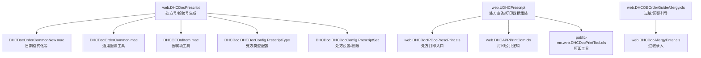
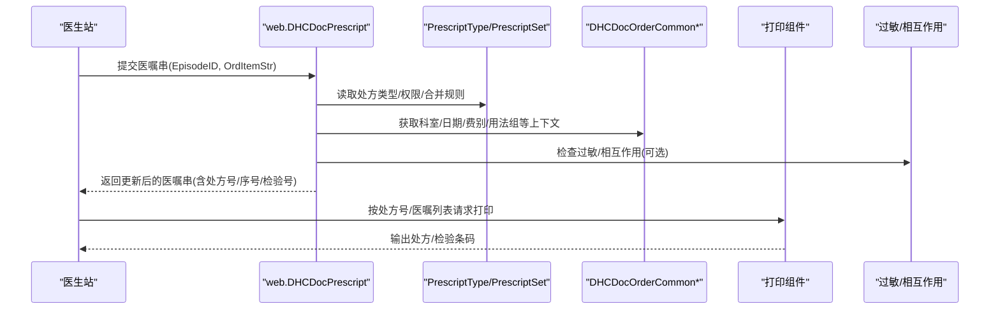
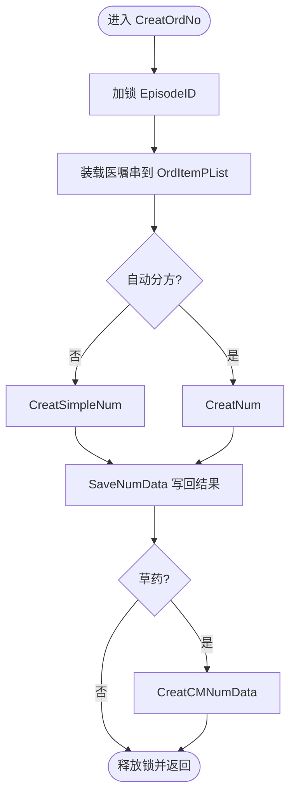
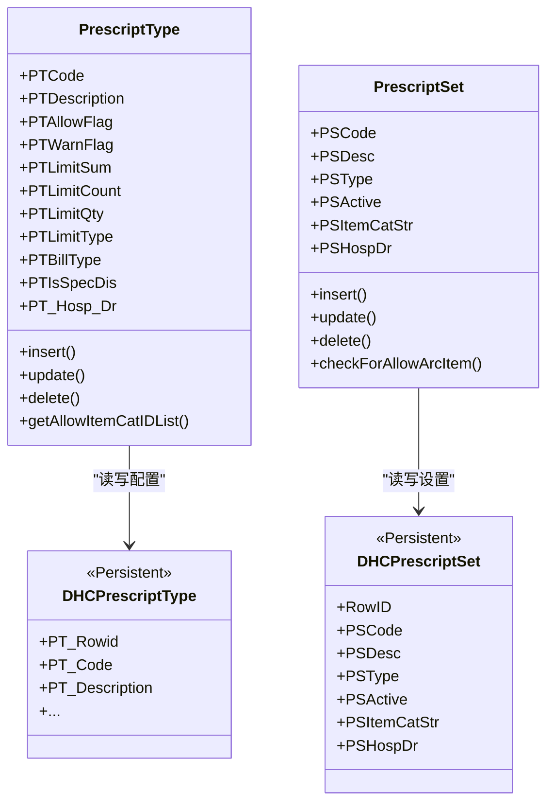
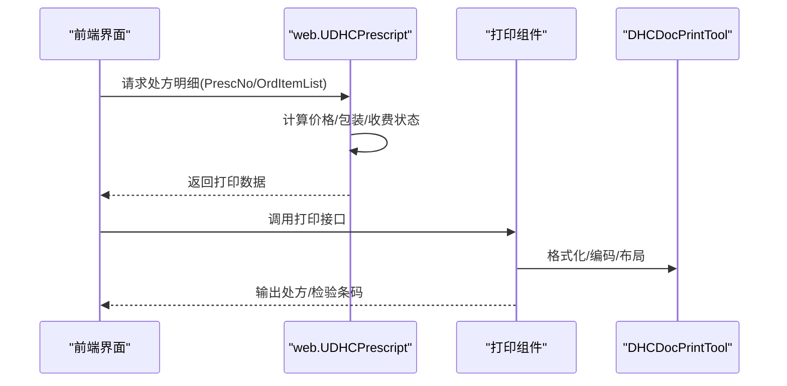
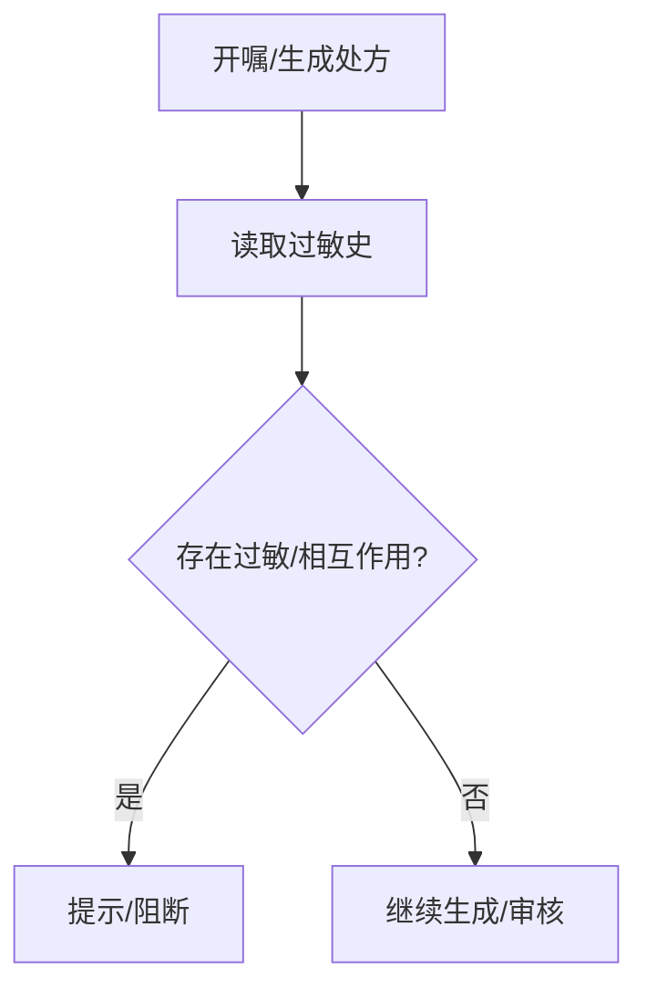
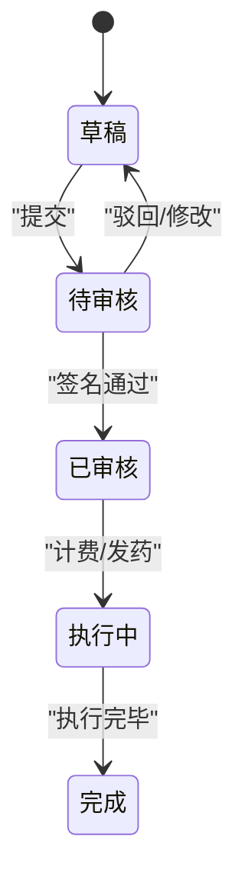
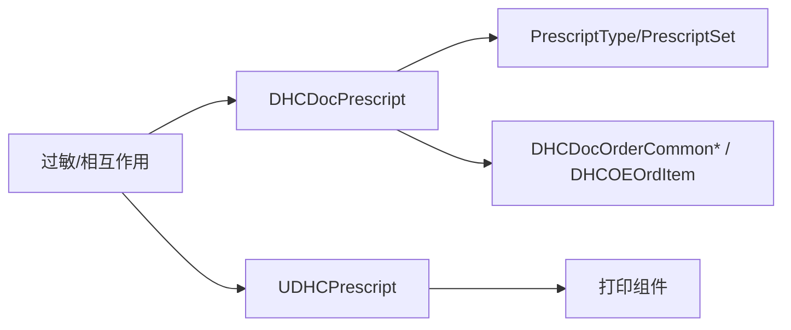

# 处方管理系统

<cite>
**本文引用的文件**
- [DHCDocPrescript.cls](file://src/backend/doc-ws/web/DHCDocPrescript.cls)
- [UDHCPrescript.cls](file://src/backend/doc-ws/web/UDHCPrescript.cls)
- [PrescriptSet.cls](file://src/backend/doc-ws/DHCDoc/DHCDocConfig/PrescriptSet.cls)
- [PrescriptType.cls](file://src/backend/doc-ws/DHCDoc/DHCDocConfig/PrescriptType.cls)
- [DHCPrescriptSet.cls](file://src/backend/doc-ws/User/DHCPrescriptSet.cls)
- [DHCPrescriptType.cls](file://src/backend/doc-ws/User/DHCPrescriptType.cls)
- [DHCOEOrdItem.mac](file://src/backend/doc-ws/DHCOEOrdItem.mac)
- [DHCDocOrderCommonNew.mac](file://src/backend/doc-ws/DHCDocOrderCommonNew.mac)
- [DHCDocOrderCommon.mac](file://src/backend/doc-ws/DHCDocOrderCommon.mac)
- [DHCDocSignVerify.cls](file://src/backend/doc-ws/web/DHCDocSignVerify.cls)
- [DHCDocIPDocPrescPrint.cls](file://src/backend/doc-ws/web/DHCDocIPDocPrescPrint.cls)
- [DHCAPPPrintCom.cls](file://src/backend/doc-ws/web/DHCAPPPrintCom.cls)
- [DHCDocPrintTool.cls](file://src/backend/public-mc/web/DHCDocPrintTool.cls)
- [DHCOEOrderGuideAllergy.cls](file://src/backend/doc-ws/web/DHCOEOrderGuideAllergy.cls)
- [DHCDocAllergyEnter.cls](file://src/backend/doc-ws/web/DHCDocAllergyEnter.cls)
</cite>

## 目录
1. [简介](#简介)
2. [项目结构](#项目结构)
3. [核心组件](#核心组件)
4. [架构总览](#架构总览)
5. [详细组件分析](#详细组件分析)
6. [依赖关系分析](#依赖关系分析)
7. [性能考量](#性能考量)
8. [故障排查指南](#故障排查指南)
9. [结论](#结论)
10. [附录](#附录)

## 简介
本系统提供完整的处方管理能力，覆盖药品、检验、检查与其他治疗项目的处方生成、审核、打印与跟踪。系统支持：
- 处方号与检验标本号的智能分配与合并规则（含成组医嘱合并、血糖分组、皮试标识等）
- 处方类型与权限控制（西药/草药、毒麻精二、小儿等），以及医生处方权校验
- 合理性检查与预警（药物相互作用、过敏禁忌提示）
- 打印模板与电子签名机制（门诊/住院、多终端打印）
- 版本管理与审计追踪（通过医嘱状态、执行记录与日志）

## 项目结构
处方管理相关代码主要分布在后端 doc-ws 模块中，围绕“处方号生成”“处方类型配置”“处方查询与打印”“过敏与预警”四大方向组织：
- 处方号生成与合并：web.DHCDocPrescript
- 处方查询与打印辅助：web.UDHCPrescript、web.DHCDocIPDocPrescPrint、web.DHCAPPPrintCom、public-mc.web.DHCDocPrintTool
- 处方类型与权限配置：DHCDoc.DHCDocConfig.PrescriptType、DHCDoc.DHCDocConfig.PrescriptSet；持久化模型 User.DHCPrescriptType、User.DHCPrescriptSet
- 过敏与预警：web.DHCOEOrderGuideAllergy、web.DHCDocAllergyEnter
- 通用工具与宏：DHCDocOrderCommonNew.mac、DHCDocOrderCommon.mac、DHCOEOrdItem.mac

**图表来源**
- [DHCDocPrescript.cls:22-800](file://src/backend/doc-ws/web/DHCDocPrescript.cls#L22-L800)
- [UDHCPrescript.cls:111-800](file://src/backend/doc-ws/web/UDHCPrescript.cls#L111-L800)
- [PrescriptType.cls:11-263](file://src/backend/doc-ws/DHCDoc/DHCDocConfig/PrescriptType.cls#L11-L263)
- [PrescriptSet.cls:1-262](file://src/backend/doc-ws/DHCDoc/DHCDocConfig/PrescriptSet.cls#L1-L262)

**章节来源**
- [DHCDocPrescript.cls:22-800](file://src/backend/doc-ws/web/DHCDocPrescript.cls#L22-L800)
- [UDHCPrescript.cls:111-800](file://src/backend/doc-ws/web/UDHCPrescript.cls#L111-L800)
- [PrescriptType.cls:11-263](file://src/backend/doc-ws/DHCDoc/DHCDocConfig/PrescriptType.cls#L11-L263)
- [PrescriptSet.cls:1-262](file://src/backend/doc-ws/DHCDoc/DHCDocConfig/PrescriptSet.cls#L1-L262)

## 核心组件
- 处方号/检验号生成器：负责按接收科室、开始日期、处方分类、费别、用法组、是否成组医嘱、皮试标识、PIVA、免费药等维度进行分方与合并，并生成处方号、处方序号、检验标本号。
- 处方类型与权限：维护处方类型（普通、毒麻一、精二、小儿等）、限制策略（数量/金额/频次）、允许的子类、医院范围与生效时间；校验医生处方权。
- 处方查询与打印：按处方号或医嘱列表获取明细，计算价格、包装单位、收费状态，输出打印所需信息；支持门诊/住院不同打印流程。
- 过敏与预警：在开嘱时读取患者过敏史，结合医嘱项进行相互作用与禁忌提示，阻止或警示不合理处方。

**章节来源**
- [DHCDocPrescript.cls:22-800](file://src/backend/doc-ws/web/DHCDocPrescript.cls#L22-L800)
- [PrescriptType.cls:11-263](file://src/backend/doc-ws/DHCDoc/DHCDocConfig/PrescriptType.cls#L11-L263)
- [PrescriptSet.cls:1-262](file://src/backend/doc-ws/DHCDoc/DHCDocConfig/PrescriptSet.cls#L1-L262)
- [UDHCPrescript.cls:111-800](file://src/backend/doc-ws/web/UDHCPrescript.cls#L111-L800)

## 架构总览
处方管理的核心流程如下：
1. 医生站提交待保存的医嘱串（包含主从关系、费用、时间、科室等信息）。
2. 系统根据配置与规则计算处方号、处方序号与检验标本号，必要时合并成组医嘱或拆分单药单处方。
3. 将结果写回医嘱串或数据库，并准备后续审核、计费、打印。
4. 打印阶段根据处方号或医嘱列表组装打印内容，调用打印组件输出。
5. 全程嵌入过敏与相互作用检查，必要时阻断或提示。

**图表来源**
- [DHCDocPrescript.cls:22-800](file://src/backend/doc-ws/web/DHCDocPrescript.cls#L22-L800)
- [UDHCPrescript.cls:111-800](file://src/backend/doc-ws/web/UDHCPrescript.cls#L111-L800)
- [PrescriptType.cls:11-263](file://src/backend/doc-ws/DHCDoc/DHCDocConfig/PrescriptType.cls#L11-L263)
- [PrescriptSet.cls:1-262](file://src/backend/doc-ws/DHCDoc/DHCDocConfig/PrescriptSet.cls#L1-L262)

## 详细组件分析

### 处方号与检验号生成（web.DHCDocPrescript）
- 入口方法：CreatOrdNo(EpisodeID, OrdItemStr, SessionStr, ByRef LabEpisArray, PrescType)
  - 并发锁：以就诊号为粒度加锁，避免重复生成。
  - 数据装载：InitOrdItemArr 解析医嘱串为主从关系，构建 PLIST 结构（含 OE_OrdItem、OE_OrdItemExt、Lab 标本信息等）。
  - 规则计算：
    - 简单模式：CreatSimpleNum，基于接收科室+开始日期+处方分类+费别+用法组等基础维度。
    - 高级模式：CreatNum，支持成组医嘱合并、血糖分组、皮试标识、PIVA、免费药、毒麻等特殊规则。
  - 结果整理：SaveNumData 将生成的处方号、序号、检验号写回医嘱串或数据库，并准备 LabEpisArray 用于采血费计算。
  - 草药处方：CreatCMNumData 处理草药分方与序列。
- 关键子过程：
  - MergeLabQue：合并检验标本号，考虑已打印/收费、血糖分组、TSGroup、通知临床等条件。
  - MergePrescQue/MergePrescGroupQue：合并处方号，支持成组医嘱与单药单处方策略。
  - ReSetPrescSeqNo：重置处方序号为“当前科室下该处方的第N条”。

**图表来源**
- [DHCDocPrescript.cls:22-800](file://src/backend/doc-ws/web/DHCDocPrescript.cls#L22-L800)

**章节来源**
- [DHCDocPrescript.cls:22-800](file://src/backend/doc-ws/web/DHCDocPrescript.cls#L22-L800)

### 处方类型与权限（PrescriptType / PrescriptSet）
- 处方类型（DHCDoc.DHCDocConfig.PrescriptType）：
  - 字段：PTCode、PTDescription、PTAllowFlag、PTWarnFlag、PTLimitSum/Count/Qty/Type、PTBillType、PTIsSpecDis、PT_Hosp_Dr。
  - 功能：查询/插入/更新/删除处方类型；限制策略（本科本日/本日）；费别映射；特殊展示（失效/未生效/过期）。
- 处方设置（DHCDoc.DHCDocConfig.PrescriptSet）：
  - 字段：PSCode、PSDesc、PSType（XM/CM）、PSActive、PSItemCatStr、PSHospDr。
  - 功能：查询/插入/更新/删除处方设置；维护允许的子类；医生处方权校验 CheckForAllowArcItem。
- 持久化模型（User.*）：
  - DHCPrescriptType：对应 DHC_PrescriptType 表，存储处方类型配置。
  - DHCPrescriptSet：对应 DHC_PrescriptSet 表，存储处方设置与子类关联。

**图表来源**
- [PrescriptType.cls:11-263](file://src/backend/doc-ws/DHCDoc/DHCDocConfig/PrescriptType.cls#L11-L263)
- [PrescriptSet.cls:1-262](file://src/backend/doc-ws/DHCDoc/DHCDocConfig/PrescriptSet.cls#L1-L262)
- [DHCPrescriptType.cls:1-105](file://src/backend/doc-ws/User/DHCPrescriptType.cls#L1-L105)
- [DHCPrescriptSet.cls:1-73](file://src/backend/doc-ws/User/DHCPrescriptSet.cls#L1-L73)

**章节来源**
- [PrescriptType.cls:11-263](file://src/backend/doc-ws/DHCDoc/DHCDocConfig/PrescriptType.cls#L11-L263)
- [PrescriptSet.cls:1-262](file://src/backend/doc-ws/DHCDoc/DHCDocConfig/PrescriptSet.cls#L1-L262)
- [DHCPrescriptType.cls:1-105](file://src/backend/doc-ws/User/DHCPrescriptType.cls#L1-L105)
- [DHCPrescriptSet.cls:1-73](file://src/backend/doc-ws/User/DHCPrescriptSet.cls#L1-L73)

### 处方查询与打印（UDHCPrescript / 打印组件）
- UDHCPrescript：
  - GetOrdItemInfo/GetAllOrdItemInfo：按处方或医嘱列表获取明细，计算价格、包装单位、收费状态、位置信息，组装打印文本。
  - GetPrescNoStr/GetPrescNoStrByOrdList：按处方号或医嘱列表汇总处方号、日期、科室、费别等。
  - GetOrdItemByPrescNo：按处方号拉取药品明细，处理剂量、频次、时长、说明、优先级等。
- 打印组件：
  - DHCDocIPDocPrescPrint：门诊/住院处方打印入口。
  - DHCAPPPrintCom：打印公共逻辑（模板、布局、分页）。
  - DHCDocPrintTool：打印工具（编码转换、格式控制）。

**图表来源**
- [UDHCPrescript.cls:111-800](file://src/backend/doc-ws/web/UDHCPrescript.cls#L111-L800)
- [DHCDocIPDocPrescPrint.cls](file://src/backend/doc-ws/web/DHCDocIPDocPrescPrint.cls)
- [DHCAPPPrintCom.cls](file://src/backend/doc-ws/web/DHCAPPPrintCom.cls)
- [DHCDocPrintTool.cls](file://src/backend/public-mc/web/DHCDocPrintTool.cls)

**章节来源**
- [UDHCPrescript.cls:111-800](file://src/backend/doc-ws/web/UDHCPrescript.cls#L111-L800)
- [DHCDocIPDocPrescPrint.cls](file://src/backend/doc-ws/web/DHCDocIPDocPrescPrint.cls)
- [DHCAPPPrintCom.cls](file://src/backend/doc-ws/web/DHCAPPPrintCom.cls)
- [DHCDocPrintTool.cls](file://src/backend/public-mc/web/DHCDocPrintTool.cls)

### 过敏与合理性检查（过敏/相互作用）
- 过敏录入：DHCDocAllergyEnter 提供过敏史录入与维护。
- 开嘱引导：DHCOEOrderGuideAllergy 在开嘱时读取患者过敏史，结合医嘱项进行相互作用与禁忌提示，必要时阻止提交。
- 与处方生成联动：在生成处方前可触发预警，确保处方安全。

**图表来源**
- [DHCDocAllergyEnter.cls](file://src/backend/doc-ws/web/DHCDocAllergyEnter.cls)
- [DHCOEOrderGuideAllergy.cls](file://src/backend/doc-ws/web/DHCOEOrderGuideAllergy.cls)

**章节来源**
- [DHCDocAllergyEnter.cls](file://src/backend/doc-ws/web/DHCDocAllergyEnter.cls)
- [DHCOEOrderGuideAllergy.cls](file://src/backend/doc-ws/web/DHCOEOrderGuideAllergy.cls)

### 电子签名与审核流程
- 电子签名：DHCDocSignVerify 提供签名验证与绑定，确保处方审核与打印前的签名有效性。
- 审核流程：医嘱状态机（V/E/I/D 等）驱动审核与执行；打印前需满足状态与签名要求。

**图表来源**
- [DHCDocSignVerify.cls](file://src/backend/doc-ws/web/DHCDocSignVerify.cls)

**章节来源**
- [DHCDocSignVerify.cls](file://src/backend/doc-ws/web/DHCDocSignVerify.cls)

## 依赖关系分析
- 处方生成强依赖：
  - 配置：PrescriptType/PrescriptSet（类型、权限、子类、限制策略）
  - 工具：DHCDocOrderCommonNew.mac（日期格式化）、DHCDocOrderCommon.mac（通用逻辑）、DHCOEOrdItem.mac（医嘱项工具）
- 打印依赖：
  - UDHCPrescript（数据组装）
  - 打印组件（模板、布局、编码）
- 预警依赖：
  - 过敏数据（DHCDocAllergyEnter）
  - 开嘱引导（DHCOEOrderGuideAllergy）

**图表来源**
- [DHCDocPrescript.cls:22-800](file://src/backend/doc-ws/web/DHCDocPrescript.cls#L22-L800)
- [UDHCPrescript.cls:111-800](file://src/backend/doc-ws/web/UDHCPrescript.cls#L111-L800)
- [PrescriptType.cls:11-263](file://src/backend/doc-ws/DHCDoc/DHCDocConfig/PrescriptType.cls#L11-L263)
- [PrescriptSet.cls:1-262](file://src/backend/doc-ws/DHCDoc/DHCDocConfig/PrescriptSet.cls#L1-L262)

**章节来源**
- [DHCDocPrescript.cls:22-800](file://src/backend/doc-ws/web/DHCDocPrescript.cls#L22-L800)
- [UDHCPrescript.cls:111-800](file://src/backend/doc-ws/web/UDHCPrescript.cls#L111-L800)
- [PrescriptType.cls:11-263](file://src/backend/doc-ws/DHCDoc/DHCDocConfig/PrescriptType.cls#L11-L263)
- [PrescriptSet.cls:1-262](file://src/backend/doc-ws/DHCDoc/DHCDocConfig/PrescriptSet.cls#L1-L262)

## 性能考量
- 并发控制：以就诊号为粒度加锁，避免重复生成与冲突。
- 批量处理：对医嘱串进行一次性解析与计算，减少多次数据库访问。
- 缓存与临时表：使用 ^TMPaOET1 等临时结构缓存合并结果，提升性能。
- 合并规则优化：血糖分组、TSGroup、通知临床等维度减少不必要的合并尝试。
- 打印优化：按需加载明细，避免全量查询。

[本节为通用指导，不直接分析具体文件]

## 故障排查指南
- 处方号重复或丢失：
  - 检查并发锁是否正确释放（EpisodeID 锁）。
  - 查看 InitOrdItemArr 与 SaveNumData 的数据流是否完整。
- 合并异常：
  - 核对 MergeLabQue/MergePrescQue 的规则键（科室、日期、费别、用法组、皮肤试验标识、PIVA、免费药等）。
  - 确认血糖分组与 TSGroup 配置。
- 打印失败：
  - 检查 UDHCPrescript 数据组装是否包含必要字段（价格、包装单位、收费状态）。
  - 验证打印组件模板与编码转换。
- 过敏/相互作用误报：
  - 确认过敏数据录入完整性。
  - 检查开嘱引导逻辑与医嘱项关联。

**章节来源**
- [DHCDocPrescript.cls:22-800](file://src/backend/doc-ws/web/DHCDocPrescript.cls#L22-L800)
- [UDHCPrescript.cls:111-800](file://src/backend/doc-ws/web/UDHCPrescript.cls#L111-L800)
- [DHCDocAllergyEnter.cls](file://src/backend/doc-ws/web/DHCDocAllergyEnter.cls)
- [DHCOEOrderGuideAllergy.cls](file://src/backend/doc-ws/web/DHCOEOrderGuideAllergy.cls)

## 结论
本处方管理系统通过精细化的分方与合并规则、完善的类型与权限配置、安全的过敏与相互作用检查、以及灵活的打印与签名机制，实现了药品、检验、检查与其他治疗项目的端到端处方管理。系统具备良好的扩展性与可维护性，支持医院个性化配置与持续优化。

[本节为总结，不直接分析具体文件]

## 附录
- 处方数据模型：
  - 处方类型：DHCPrescriptType（DHC_PrescriptType）
  - 处方设置：DHCPrescriptSet（DHC_PrescriptSet）
- 模板配置：
  - 打印模板由打印组件与工具类共同管理，支持多终端与多格式输出。
- 审核流程：
  - 医嘱状态机驱动审核与执行，电子签名确保合规。
- 权限控制：
  - 医生处方权校验（CheckForAllowArcItem），按医院、类型、子类控制。
- 版本管理与审计追踪：
  - 通过医嘱状态、执行记录与日志实现变更追踪。

[本节为补充说明，不直接分析具体文件]