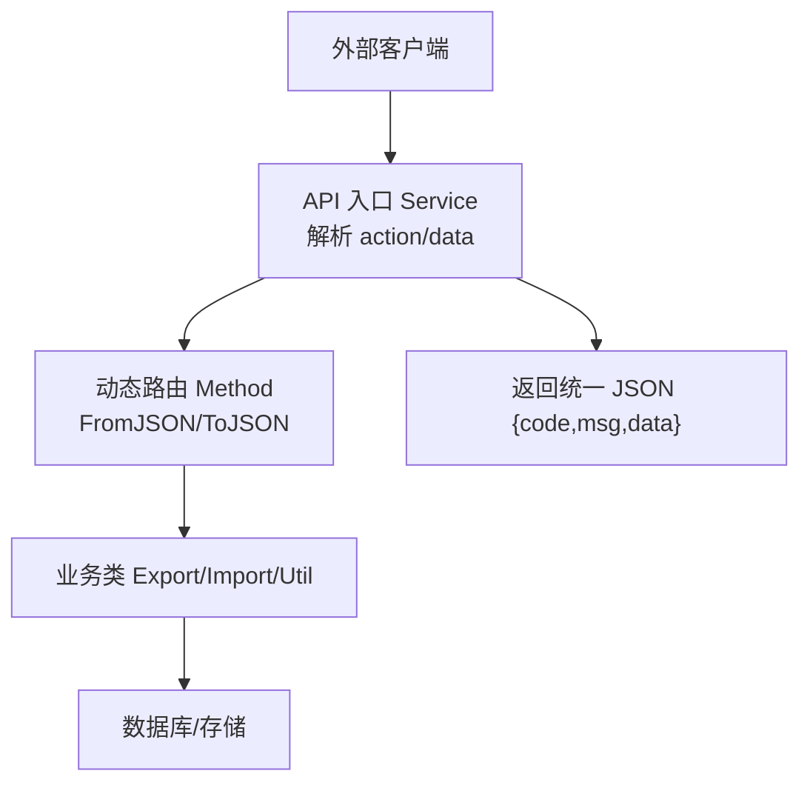
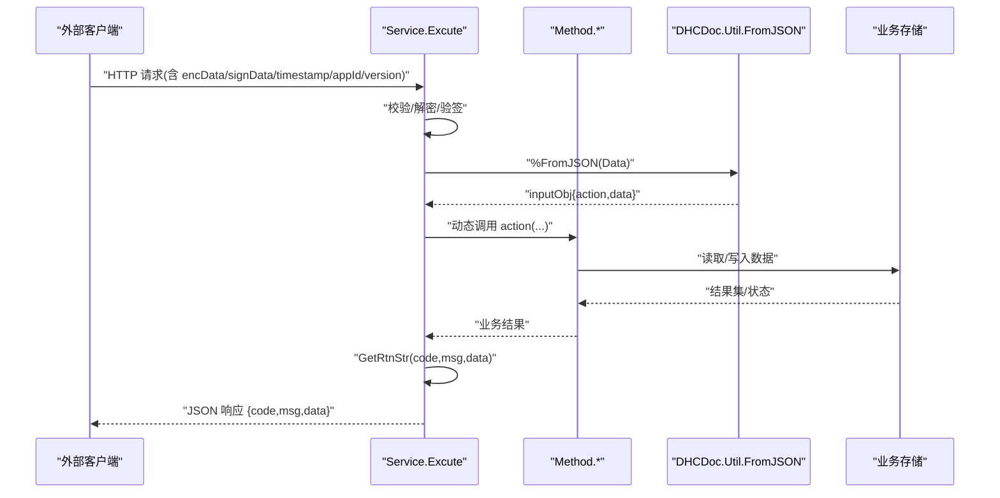
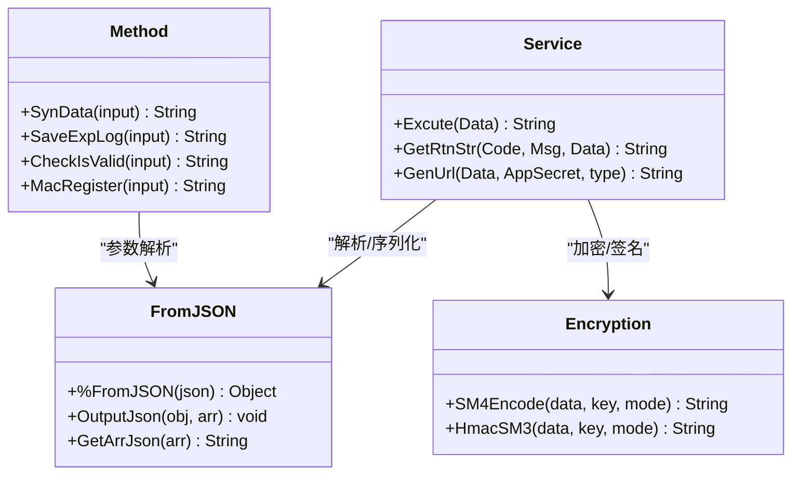
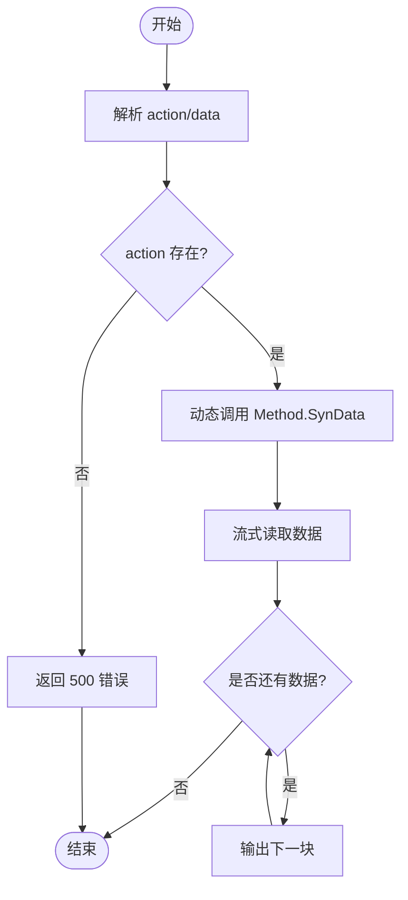

# 数据交换格式

<cite>
**本文引用的文件**
- [README.md](file://README.md)
- [Service.cls](file://src/backend/conting-ws/DHCDoc/Interface/StandAlone/API/Service.cls)
- [Method.cls](file://src/backend/conting-ws/DHCDoc/Interface/StandAlone/API/Method.cls)
- [Base.cls](file://src/backend/conting-ws/DHCDoc/Interface/StandAlone/Base.cls)
- [Import.cls](file://src/backend/conting-ws/DHCDoc/Interface/StandAlone/Import.cls)
- [convert-encoding.js](file://scripts/convert-encoding.js)
</cite>

## 目录
1. [简介](#简介)
2. [项目结构](#项目结构)
3. [核心组件](#核心组件)
4. [架构总览](#架构总览)
5. [详细组件分析](#详细组件分析)
6. [依赖关系分析](#依赖关系分析)
7. [性能考虑](#性能考虑)
8. [故障排查指南](#故障排查指南)
9. [结论](#结论)
10. [附录](#附录)

## 简介
本文件面向 IRIS HIS 项目的数据交换格式，聚焦应急系统（StandAlone）对外接口与内部序列化/反序列化机制。内容涵盖：
- 请求/响应 JSON 结构与字段说明
- 加密与签名参数规范
- 编码格式（UTF-8、GBK/GB2312）使用策略与工具
- 数据版本管理与向后兼容性建议
- 典型调用流程与示例

## 项目结构
本项目后端以 InterSystems IRIS ObjectScript 实现，前端为传统 CSP + jQuery。数据交换主要发生在“应急系统”对接层，采用统一的 JSON 封装与 SM4/SM3 安全通道。

图表来源
- [Service.cls:9-36](file://src/backend/conting-ws/DHCDoc/Interface/StandAlone/API/Service.cls#L9-L36)
- [Method.cls:16-37](file://src/backend/conting-ws/DHCDoc/Interface/StandAlone/API/Method.cls#L16-L37)

章节来源
- [README.md:1-35](file://README.md#L1-L35)

## 核心组件
- 统一响应体：所有接口返回 JSON 对象，包含 code、msg、data 三个字段。
- 请求体：包含 action（方法名）、data（业务参数）。
- 安全传输：GET/POST 两种模式，均携带 appId、version、encType、signType、timestamp、signData、encData。
- 序列化/反序列化：通过 DHCDoc.Util.FromJSON 进行 JSON 与对象/数组互转；对象序列化为 JSON 使用 %ToJSON。
- 编码策略：前端统一 UTF-8；历史遗留 GB2312/GBK 可通过脚本转换。

章节来源
- [Service.cls:46-53](file://src/backend/conting-ws/DHCDoc/Interface/StandAlone/API/Service.cls#L46-L53)
- [Service.cls:116-133](file://src/backend/conting-ws/DHCDoc/Interface/StandAlone/API/Service.cls#L116-L133)
- [Method.cls:16-37](file://src/backend/conting-ws/DHCDoc/Interface/StandAlone/API/Method.cls#L16-L37)
- [README.md:484-509](file://README.md#L484-L509)

## 架构总览
应急系统对接层采用“统一入口 + 动态分发”的架构：
- 入口 Service.Excute 接收原始 Data，解析出 action 与 data，并动态调用对应方法。
- 若 data 为对象，会先输出为数组再转为 JSON 字符串，确保下游兼容。
- 业务方法由 Method 类提供，如 SynData、SaveExpLog、CheckIsValid、MacRegister。
- 返回值统一封装为 {code, msg, data} 的 JSON 字符串。

图表来源
- [Service.cls:9-36](file://src/backend/conting-ws/DHCDoc/Interface/StandAlone/API/Service.cls#L9-L36)
- [Service.cls:46-53](file://src/backend/conting-ws/DHCDoc/Interface/StandAlone/API/Service.cls#L46-L53)
- [Method.cls:16-37](file://src/backend/conting-ws/DHCDoc/Interface/StandAlone/API/Method.cls#L16-L37)

## 详细组件分析

### 统一请求/响应格式
- 请求体（JSON 字符串）
  - action：字符串，必填，表示要调用的方法名。
  - data：任意类型，可选，业务参数。当为对象时会被转换为数组再转回 JSON 字符串，保证下游兼容。
- 响应体（JSON 字符串）
  - code：字符串或数字，状态码。
  - msg：字符串，消息描述。
  - data：任意类型，业务数据或错误详情。

注意：
- 所有接口返回均为 JSON 字符串，便于跨语言解析。
- 错误路径统一通过 GetRtnStr 构造响应。

章节来源
- [Service.cls:14-32](file://src/backend/conting-ws/DHCDoc/Interface/StandAlone/API/Service.cls#L14-L32)
- [Service.cls:46-53](file://src/backend/conting-ws/DHCDoc/Interface/StandAlone/API/Service.cls#L46-L53)

### 安全传输与签名
- GET 模式：URL 查询参数包含 encData、signData、timestamp、appId、version、encType、signType。
- POST 模式：请求体为 JSON，包含相同字段。
- 加密与签名：
  - encType：固定为 SM4。
  - signType：固定为 SM3。
  - signData：对拼接串进行 SM3 签名。
  - encData：对原始 Data 进行 SM4 加密。
  - timestamp：时间戳。
  - appId：应用标识。
  - version：协议版本。

生成链接示例见 GenUrl 方法，用于测试或第三方集成。

章节来源
- [Service.cls:116-133](file://src/backend/conting-ws/DHCDoc/Interface/StandAlone/API/Service.cls#L116-L133)

### 动态方法与数据下载
- SynData：根据输入中的 classname、methodname、index、num 动态执行导出方法，并以流式方式分块输出，避免一次性加载大数据。
- SaveExpLog、CheckIsValid、MacRegister：分别用于日志记录、终端有效性校验、终端注册。

章节来源
- [Method.cls:16-37](file://src/backend/conting-ws/DHCDoc/Interface/StandAlone/API/Method.cls#L16-L37)
- [Method.cls:47-92](file://src/backend/conting-ws/DHCDoc/Interface/StandAlone/API/Method.cls#L47-L92)

### 数据导入与日志
- Import 模块在导入过程中会将关键对象序列化为 JSON 字符串写入日志，便于问题追踪。
- 该行为体现了系统对数据可观测性的重视。

章节来源
- [Import.cls:458](file://src/backend/conting-ws/DHCDoc/Interface/StandAlone/Import.cls#L458)

### 编码规范与工具
- 前端统一使用 UTF-8 编码，日常开发无需转换。
- 对于历史遗留的 GB2312/GBK 文件，提供 convert-encoding.js 脚本，支持：
  - 严格 UTF-8 检测（含 BOM 处理）
  - GBK/GB2312 解码校验（拒绝混合污染）
  - 目标编码转换（utf-8 或 gb2312）
- 建议在新增或修改前端资源时保持 UTF-8 不变。

章节来源
- [README.md:484-509](file://README.md#L484-L509)
- [convert-encoding.js:1-24](file://scripts/convert-encoding.js#L1-L24)
- [convert-encoding.js:63-123](file://scripts/convert-encoding.js#L63-L123)
- [convert-encoding.js:127-188](file://scripts/convert-encoding.js#L127-L188)

### 基础能力与版本兼容
- Base 类提供日期/时间格式化、会话信息获取、错误码翻译、HIS 版本获取等通用能力。
- 通过 %GetHisVersion 等方法在不同 HIS 版本间做兼容判断。

章节来源
- [Base.cls:21-95](file://src/backend/conting-ws/DHCDoc/Interface/StandAlone/Base.cls#L21-L95)
- [Base.cls:163-175](file://src/backend/conting-ws/DHCDoc/Interface/StandAlone/Base.cls#L163-L175)

## 依赖关系分析
- Service 依赖 FromJSON 进行 JSON 解析与对象序列化。
- Method 依赖 FromJSON 将字符串参数解析为数组，并调用具体业务方法。
- 业务层（Export/Import/Util）负责数据访问与处理。
- 安全相关依赖 web.Util.Encryption 进行 SM4/SM3 加解密与签名。

图表来源
- [Service.cls:9-36](file://src/backend/conting-ws/DHCDoc/Interface/StandAlone/API/Service.cls#L9-L36)
- [Service.cls:116-133](file://src/backend/conting-ws/DHCDoc/Interface/StandAlone/API/Service.cls#L116-L133)
- [Method.cls:16-37](file://src/backend/conting-ws/DHCDoc/Interface/StandAlone/API/Method.cls#L16-L37)

章节来源
- [Service.cls:9-36](file://src/backend/conting-ws/DHCDoc/Interface/StandAlone/API/Service.cls#L9-L36)
- [Method.cls:16-37](file://src/backend/conting-ws/DHCDoc/Interface/StandAlone/API/Method.cls#L16-L37)

## 性能考虑
- 大数据导出采用流式分块读取与输出，避免内存峰值过高。
- JSON 序列化集中在统一入口与方法层，减少重复逻辑。
- 建议在批量导出时合理设置 index 与 num，控制单次数据量。

章节来源
- [Method.cls:16-37](file://src/backend/conting-ws/DHCDoc/Interface/StandAlone/API/Method.cls#L16-L37)

## 故障排查指南
- 常见错误：
  - 未提供 action：返回 500 与提示信息。
  - 数据为空：返回 403 与提示信息。
  - 异常捕获：统一进入 ExcuteErr 分支，返回 500 与错误堆栈信息。
- 调试建议：
  - 使用 GenUrl 生成测试链接，验证加密与签名流程。
  - 检查 encType、signType、version 是否与约定一致。
  - 确认 data 是否为对象时已正确转换为数组再转回 JSON。

章节来源
- [Service.cls:9-36](file://src/backend/conting-ws/DHCDoc/Interface/StandAlone/API/Service.cls#L9-L36)
- [Service.cls:116-133](file://src/backend/conting-ws/DHCDoc/Interface/StandAlone/API/Service.cls#L116-L133)

## 结论
本系统的交换格式以 JSON 为核心，配合 SM4/SM3 的安全传输，形成统一、可扩展的接口契约。通过动态路由与流式导出，兼顾灵活性与性能。编码策略明确：前端统一 UTF-8，历史文件可通过脚本转换。建议在后续扩展中继续遵循统一响应体与安全传输规范，并在版本升级时保持向后兼容。

## 附录

### 请求/响应字段定义
- 请求体（JSON 字符串）
  - action：字符串，必填，方法名。
  - data：任意类型，可选，业务参数。
- 响应体（JSON 字符串）
  - code：字符串或数字，状态码。
  - msg：字符串，消息描述。
  - data：任意类型，业务数据或错误详情。

章节来源
- [Service.cls:14-32](file://src/backend/conting-ws/DHCDoc/Interface/StandAlone/API/Service.cls#L14-L32)
- [Service.cls:46-53](file://src/backend/conting-ws/DHCDoc/Interface/StandAlone/API/Service.cls#L46-L53)

### 安全传输参数
- GET 查询参数：encData、signData、timestamp、appId、version、encType、signType。
- POST 请求体：同上字段。
- 加密与签名：
  - encType：SM4。
  - signType：SM3。
  - signData：SM3 签名。
  - encData：SM4 加密。
  - timestamp：时间戳。
  - appId：应用标识。
  - version：协议版本。

章节来源
- [Service.cls:116-133](file://src/backend/conting-ws/DHCDoc/Interface/StandAlone/API/Service.cls#L116-L133)

### 数据版本管理与向后兼容策略
- 版本号：接口携带 version 字段，便于服务端识别协议版本。
- 兼容建议：
  - 新增字段应默认可选，避免破坏旧客户端。
  - 废弃字段保留一段时间并提供迁移指引。
  - 重大变更通过新版本号发布，旧版本继续维护过渡期。
- HIS 版本兼容：通过 Base 类的 %GetHisVersion 等方法在不同 HIS 版本间做分支处理。

章节来源
- [Service.cls:116-133](file://src/backend/conting-ws/DHCDoc/Interface/StandAlone/API/Service.cls#L116-L133)
- [Base.cls:163-175](file://src/backend/conting-ws/DHCDoc/Interface/StandAlone/Base.cls#L163-L175)

### 编码格式与工具使用
- 前端统一 UTF-8。
- 历史 GB2312/GBK 文件可使用 convert-encoding.js 进行转换。
- 脚本特性：
  - 严格 UTF-8 检测（含 BOM 处理）
  - GBK/GB2312 解码校验（拒绝混合污染）
  - 支持 utf-8 与 gb2312 双向转换

章节来源
- [README.md:484-509](file://README.md#L484-L509)
- [convert-encoding.js:63-123](file://scripts/convert-encoding.js#L63-L123)
- [convert-encoding.js:127-188](file://scripts/convert-encoding.js#L127-L188)

### 典型调用流程（数据下载）

图表来源
- [Method.cls:16-37](file://src/backend/conting-ws/DHCDoc/Interface/StandAlone/API/Method.cls#L16-L37)
- [Service.cls:9-36](file://src/backend/conting-ws/DHCDoc/Interface/StandAlone/API/Service.cls#L9-L36)